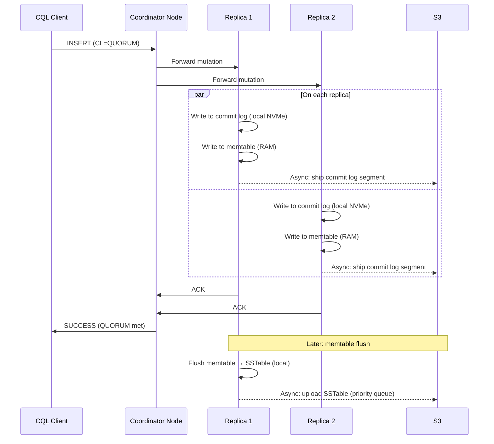
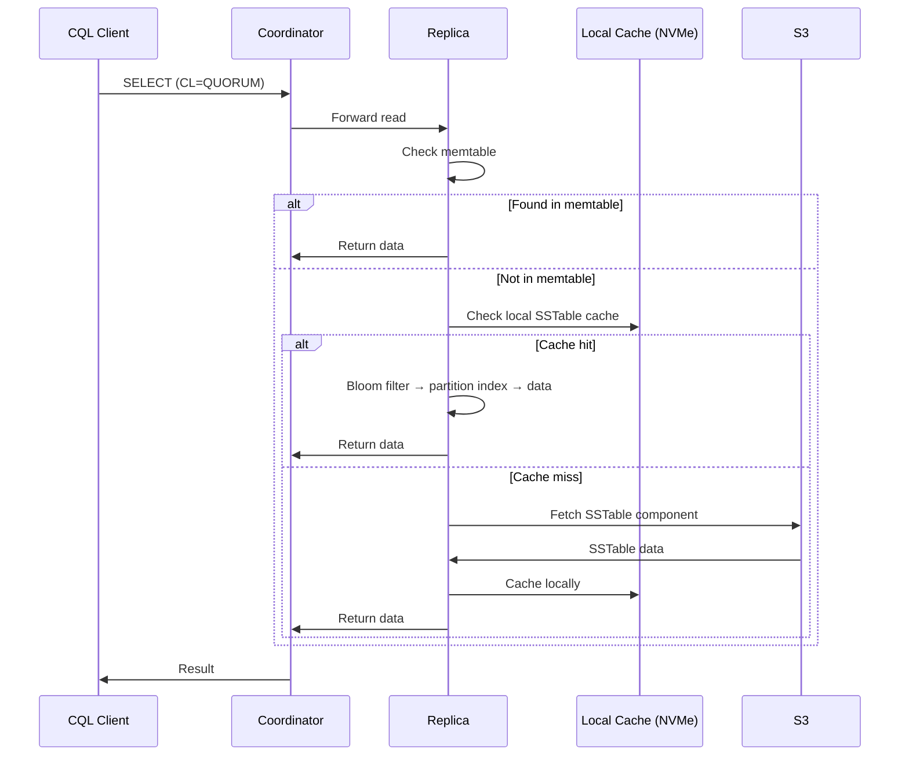
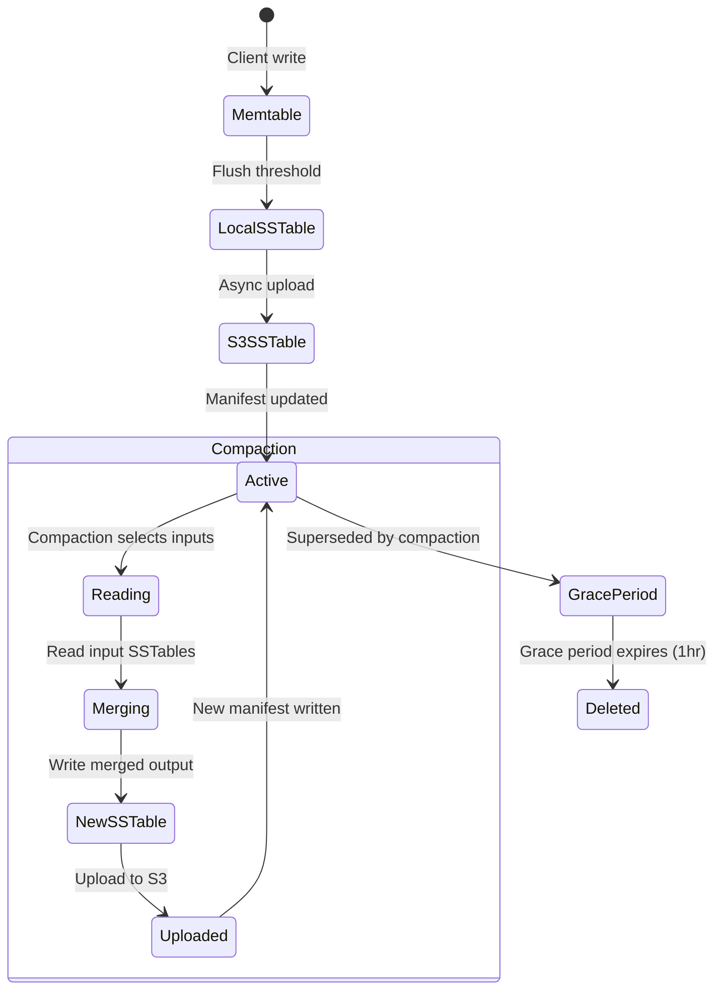
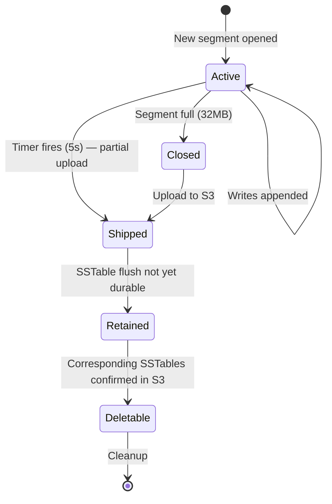
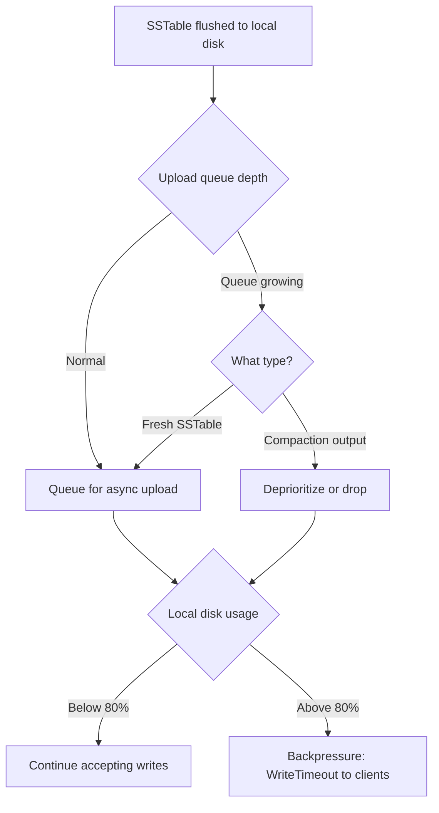
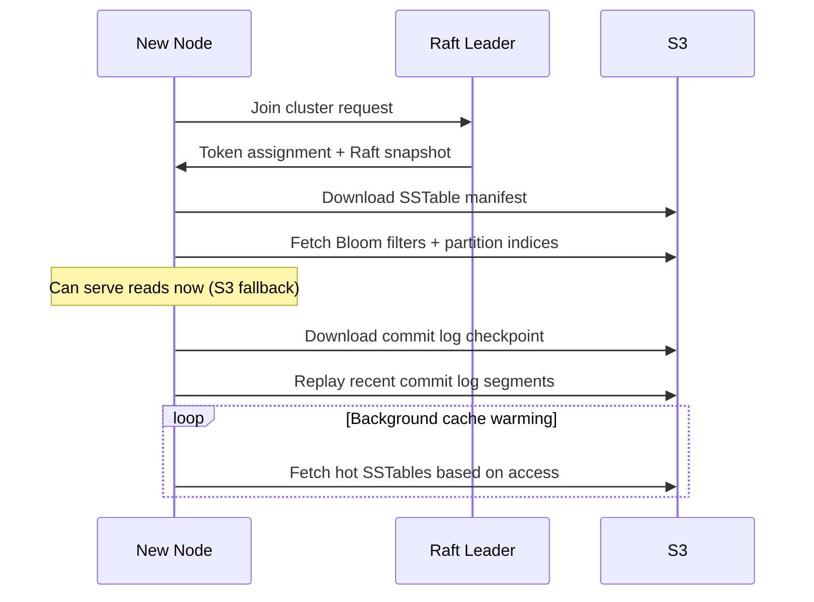

# Data Flow

> Last updated: 2026-03-11
> Status: Approved

## Overview

Ferrosa uses a write-behind async S3 storage model. Writes go to local ephemeral storage first, then are asynchronously uploaded to S3. Reads check memtable, local cache, then fall back to S3 on cache miss.

## Write Path



## Read Path



## SSTable Lifecycle in S3



### Manifest Update Protocol

1. Compaction completes: new SSTables uploaded, confirmed durable in S3
1. Updated `manifest.json` written (atomic S3 PUT — new generations in, old out)
1. Old SSTables marked for deletion with 1-hour grace period
1. Background GC deletes expired S3 objects
1. Periodic orphan sweep catches objects not in any manifest

## Commit Log Lifecycle



**Commit log entry format**: 4-byte length + 8-byte logical timestamp + CQL mutation payload + 4-byte CRC32.

**Recovery**: New node reads `checkpoint.json` from S3, determines replay starting point, downloads and replays segments newer than the latest durable SSTable.

## S3 Upload Backpressure



## Node Recovery



## Data Loss Mitigations

| Layer | Mechanism | Window Covered |
|-------|-----------|---------------|
| 1. Quorum writes | Data on >= 2 nodes before ACK (RF=3, CL=QUORUM) | Node death before S3 upload |
| 2. Commit log shipping | S3 upload every 5s (configurable) | Node death before SSTable flush |
| 3. SSTable upload priority | Fresh flushes before compaction output | Node death between flush and upload |
| 4. Replica coordination | Track S3 upload confirmation per replica | Multi-node failure before any upload |
| 5. Increased quorum (optional) | CL=ALL or higher RF | Catastrophic multi-node failure |

## S3 Object Layout

```
s3://ferrosa-data/{cluster_id}/
  {keyspace}/{table}/
    sstables/{generation}-{component}.db
    manifest.json
  commitlog/
    {node_id}/{segment_id}.log
    {node_id}/checkpoint.json
  metadata/
    schema.json
    topology.json
```

## Related Specs

- [Overview](overview.md) — system overview
- [Components](components.md) — crate architecture
- [Testing](testing.md) — data integrity and chaos tests
