# Data Flow

> Last updated: 2026-03-13
> Status: Approved

## Overview

Ferrosa uses a write-behind async S3 storage model. Writes go to local ephemeral storage first, then are asynchronously uploaded to S3. Reads check memtable, local cache, then fall back to S3 on cache miss.

## Write Path

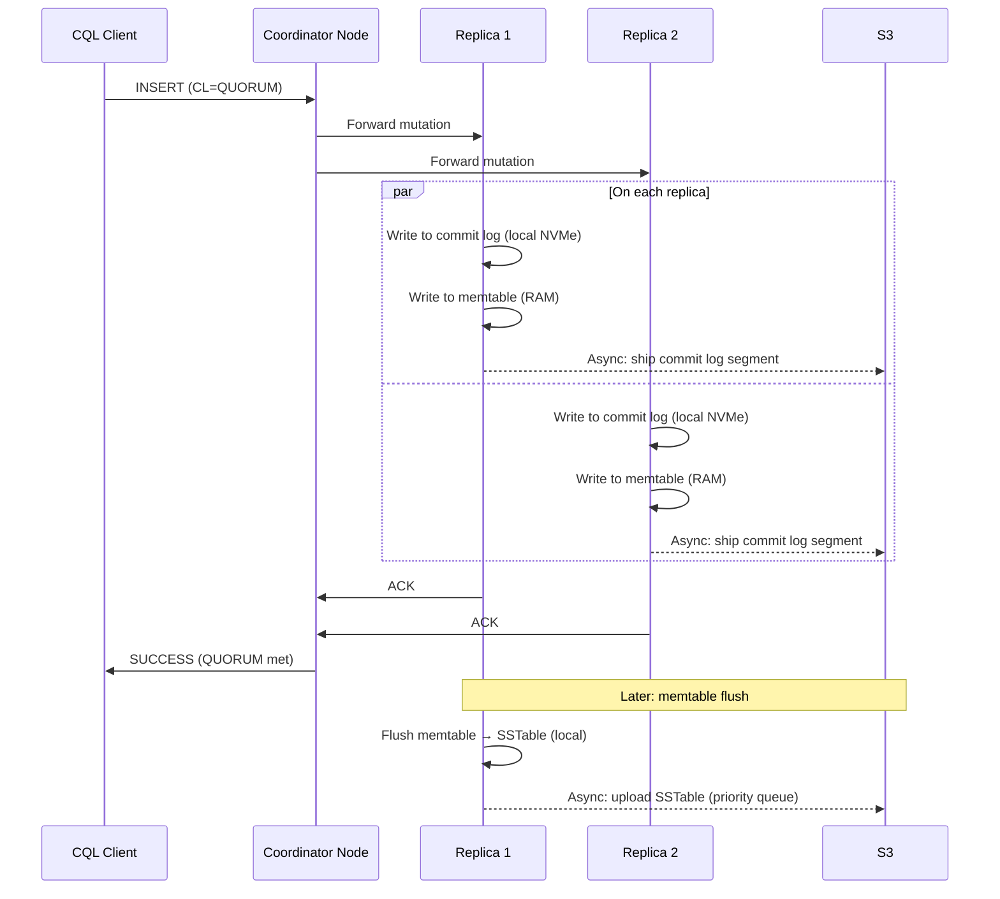

## Read Path

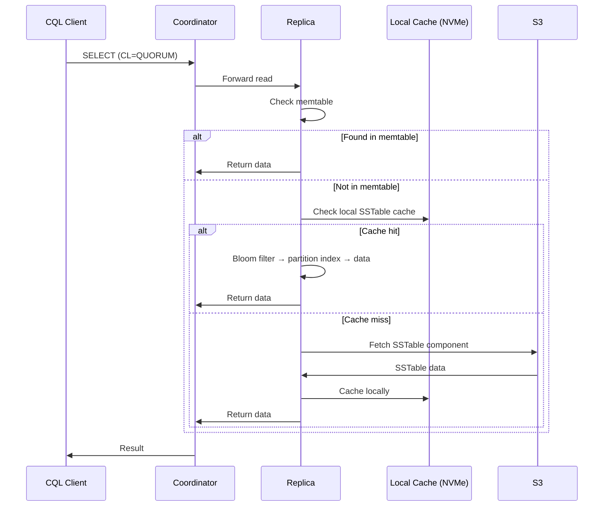

## SSTable Lifecycle in S3

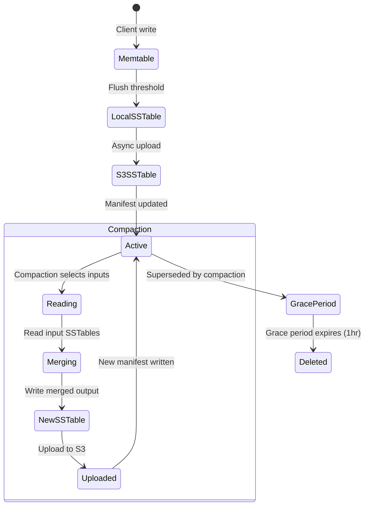

### Manifest

Each table has a `manifest.json` in S3 that lists the current set of active SSTable entries per table. The manifest is the source of truth for what SSTables are live. It is a complete document (not a diff) — each update writes a new version.

**Implementation status**: The `Manifest` struct (`ferrosa-storage/src/manifest.rs`) uses **etag-based CAS** (conditional put) via `object_store`'s `PutMode::Update(UpdateVersion { e_tag, version })` to detect stale writes. On `load()`, the current etag is captured; on `save()`, the etag is passed to the conditional put. If another node updated the manifest in the meantime, the put fails and the caller must reload and retry. The CAS retry loop is follow-on work — currently `save()` returns an error on conflict.

The manifest contains a `format_version`, a map of table name to `Vec<ManifestEntry>` (SSTable ID, path, size, token range, timestamp range, partition count), and a `last_compacted_at` timestamp.

### Safe Deletion Protocol (Follow-on)

Not yet implemented. The design:

1. Compaction completes: new SSTables uploaded, confirmed durable in S3
1. Updated `manifest.json` written (etag-based CAS — new entries in, old out)
1. Old SSTables marked for deletion with grace period (default 1 hour)
1. Background GC deletes S3 objects whose grace period has expired
1. Grace period ensures nodes reading old SSTables from S3 (cache miss during transition) have time to complete

### Orphan Cleanup (Follow-on)

Not yet implemented. The design:

A periodic sweep compares SSTable objects in S3 against all known manifests. Objects not referenced by any manifest and older than the grace period are deleted. This catches orphans from partial upload failures or interrupted compactions.

## Commit Log Lifecycle

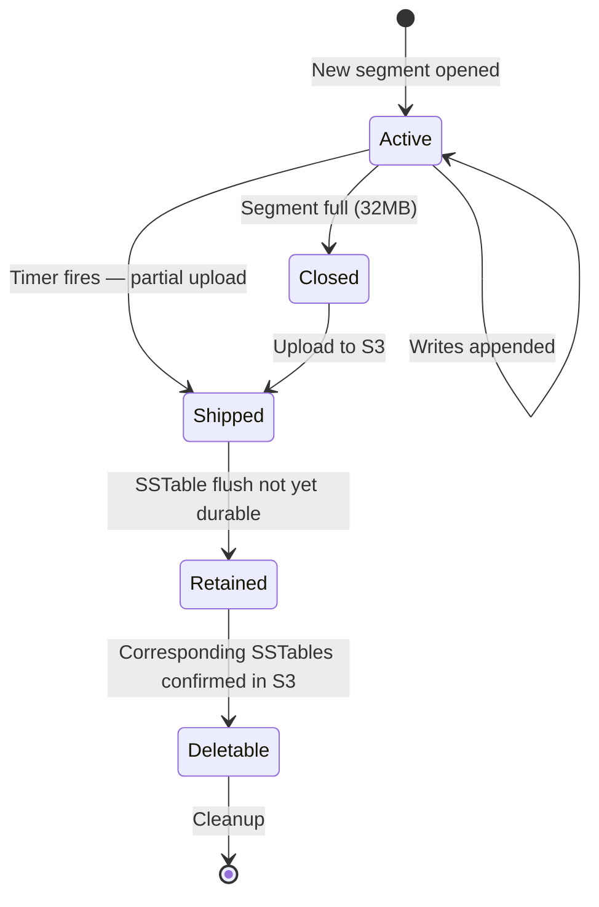

### Commit Log Entry Format

**Segment-level**: Each entry in a segment is framed as:

| Field | Size | Description |
|-------|------|-------------|
| Length prefix | 4 bytes | Record length (big-endian u32) |
| Mutation payload | Variable | Self-describing binary (see below) |
| CRC32 checksum | 4 bytes | CRC32 of the mutation payload |

**Mutation binary layout** (implemented in `ferrosa-storage/src/commitlog/mutation.rs`):

```text
Mutation: keyspace_len:u16 | keyspace | table_len:u16 | table
        | key_len:u16 | key_bytes | token:i64 | timestamp:i64
        | row_count:u16 | rows...

Row: clustering_len:u16 | clustering
   | deletion_marked_for_delete_at:i64 | deletion_local_deletion_time:u32
   | liveness_timestamp:i64 | liveness_ttl:i32 | liveness_local_deletion_time:i32
   | cell_count:u16 | cells...

Cell: column_index:u16 | timestamp:i64 | ttl:i32 | local_deletion_time:i32
    | value_len:i32 (-1=tombstone) | value
```

All multi-byte integers are big-endian. Each entry is fully self-describing — it carries keyspace, table, key, token, and complete row/cell data. This is unlike SSTable row format (which uses delta-encoding against a `SerializationHeader`).

Segments are configurable-size files (default 32 MB, `DEFAULT_SEGMENT_SIZE`). A segment is closed and a new one opened when it reaches capacity or max age (default 5 minutes, `DEFAULT_MAX_SEGMENT_AGE`). Segment space is allocated via compare-and-swap (CAS) on an `AtomicUsize` offset, enabling concurrent appends without holding a lock during serialization.

### S3 Shipping (Follow-on)

Commit log S3 shipping is not yet implemented. The design:

Closed segments are uploaded to S3 immediately. The active (not yet full) segment is uploaded on a configurable timer (`commitlog_ship_interval`, candidate values: 1-10 seconds, trading durability window for upload overhead) as a partial segment. The `checkpoint.json` per node tracks:

- The latest segment ID and offset confirmed durable in S3
- The latest SSTable generation confirmed durable in S3
- A mapping of segment IDs to their S3 object keys

**What is implemented**: The commit log checkpoint system (`ferrosa-storage/src/commitlog/checkpoint.rs`) tracks per-table flush positions as `CommitLogPosition { segment_id, offset }`. The checkpoint is serialized as JSON and persisted to local disk. S3 upload of segments and checkpoint is follow-on work.

### Replay Protocol (Follow-on)

Commit log replay is not yet implemented. The design:

1. Read `checkpoint.json` from S3 (or local disk) to find the replay starting point
1. Determine which commit log segments contain data newer than the latest durable SSTable
1. Download and replay those segments in order, applying mutations to the memtable
1. Once replay is complete, the node is current and can begin serving

### Commit Log Cleanup

Segments are deleted once the data they contain has been flushed to SSTables. The checkpoint tracks per-table flush boundaries. Currently, local segment cleanup is based on the checkpoint; S3 segment cleanup is follow-on work.

## S3 Upload Backpressure

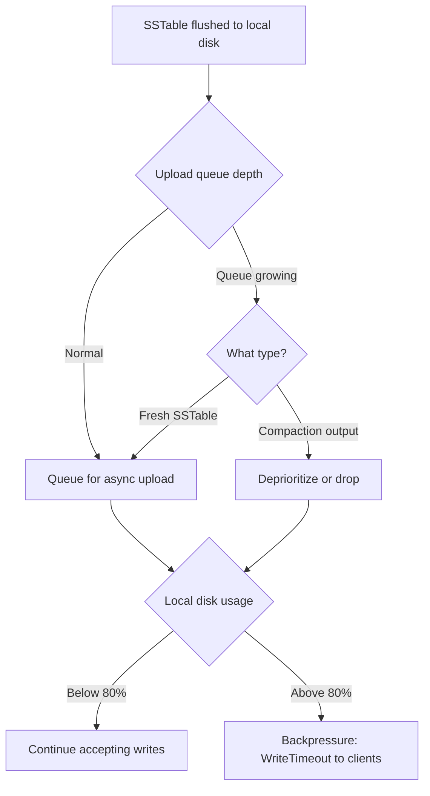

### Backpressure Details

**Implementation status**: The `UploadManager` (`ferrosa-storage/src/upload/manager.rs`) uses a bounded `tokio::sync::mpsc` channel for backpressure — when the channel is full, senders block. Exponential backoff retry on upload failure is implemented. Priority shedding and disk space threshold monitoring are follow-on work.

1. **Queue depth monitoring**: Track pending uploads by count and total bytes. *(follow-on)*
1. **Priority shedding**: Drop compaction output uploads first — they can be re-compacted. Freshly-flushed SSTables always get priority. *(follow-on)*
1. **Disk space threshold**: When local ephemeral disk usage exceeds a configurable threshold (default 80%), begin rejecting writes with backpressure (return `WriteTimeout` to clients). *(follow-on)*
1. **S3 outage behavior**: Writes continue locally as long as disk space permits. Uploads queue and retry with exponential backoff. When S3 returns, the queue drains in priority order. *(backoff retry implemented; priority drain follow-on)*

## Node Recovery

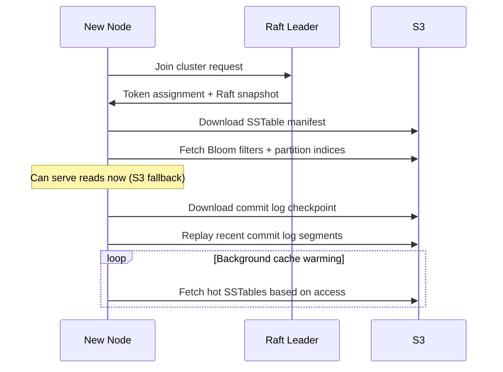

## Data Loss Mitigations

| Layer | Mechanism | Window Covered |
|-------|-----------|---------------|
| 1. Quorum writes | Data on >= 2 nodes before ACK (RF=3, CL=QUORUM) | Node death before S3 upload |
| 2. Commit log shipping | Async S3 upload on configurable interval (`commitlog_ship_interval`) | Node death before SSTable flush |
| 3. SSTable upload priority | Fresh flushes before compaction output | Node death between flush and upload |
| 4. Replica coordination | Track S3 upload confirmation per replica | Multi-node failure before any upload |
| 5. Increased quorum (optional) | CL=ALL or higher RF | Catastrophic multi-node failure |

## S3 Object Layout (Design Target)

The intended S3 layout once upload wiring is complete:

```
s3://ferrosa-data/{cluster_id}/
  {keyspace}/{table}/
    sstables/{generation}-{component}.db
    manifest.json
  commitlog/
    {node_id}/{segment_id}.log
    {node_id}/checkpoint.json
  metadata/
    schema.json
    topology.json
```

**Implementation status**: The `ObjectStoreConfig` (`ferrosa-storage/src/upload/config.rs`) configures the S3 bucket, region, endpoint, and prefix via `FERROSA_S3_*` environment variables. The `UploadManager` can upload files to S3 via the `object_store` crate. The actual path structure and wiring from flush/compaction to upload is follow-on work.

## S3 Object Metadata (per SSTable component)

| Key | Value | Purpose |
|-----|-------|---------|
| `x-amz-meta-ferrosa-table` | `keyspace.table_name` | Quick identification |
| `x-amz-meta-ferrosa-generation` | `42` | SSTable generation |
| `x-amz-meta-ferrosa-format` | `bti-1.0` | Format version |
| `x-amz-meta-ferrosa-min-token` | `-9223372036854775808` | Partition range start (cache warming) |
| `x-amz-meta-ferrosa-max-token` | `3074457345618258602` | Partition range end |
| `x-amz-meta-ferrosa-level` | `0` | Compaction level |
| `x-amz-meta-ferrosa-checksum` | `sha256:abc123...` | Integrity verification |
| `x-amz-meta-ferrosa-uploaded-by` | `node-3` | Source node |
| `x-amz-meta-ferrosa-created-at` | `2026-03-11T...` | Lifecycle policies |

## Observability

### Virtual Table Read Path

Virtual tables are code-backed (not SSTable-backed) and served entirely in-process. The router intercepts SELECTs targeting virtual table keyspaces before the storage engine is consulted.

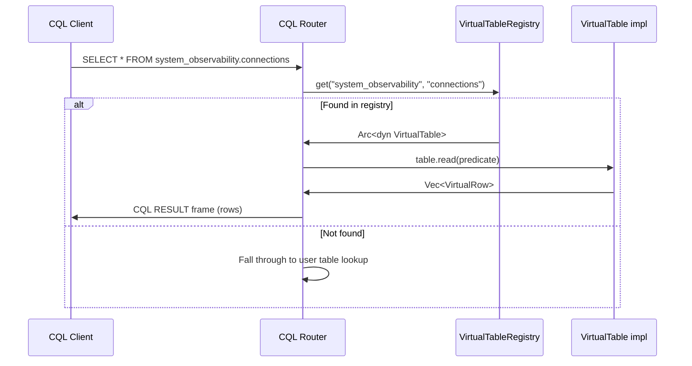

**Implementation**: The `VirtualTableRegistry` (`ferrosa-schema/src/virtual_registry.rs`) stores `Arc<dyn VirtualTable>` in an `ArcSwap<HashMap>` for lock-free reads. The router (`ferrosa-cql/src/router.rs`) checks `state.schema.virtual_tables().get(ks, &s.table)` before attempting storage engine lookups.

### Connection Tracking Flow

Every CQL TCP connection is registered with a `ConnectionTracker` on accept and deregistered on disconnect. State transitions are tracked as the connection progresses through the protocol handshake.

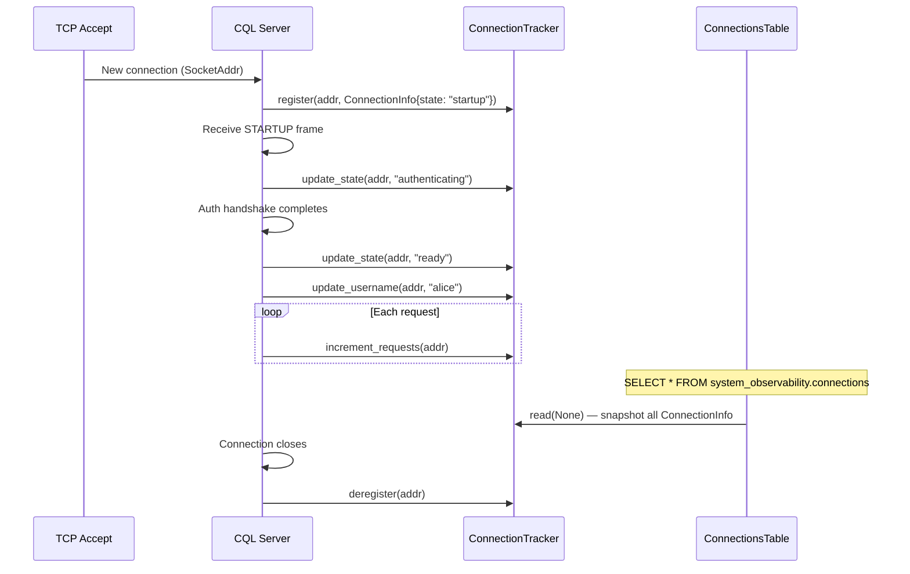

**Implementation**: `ConnectionTracker` (`ferrosa-cql/src/virtual_tables/connections.rs`) uses `RwLock<HashMap<SocketAddr, ConnectionInfo>>`. Each `ConnectionInfo` carries `peer_address`, `peer_port`, `state` (`"startup"` / `"authenticating"` / `"ready"`), `username`, `connected_at`, `requests_served`, and `protocol_version`. The `ConnectionsTable` exposes this as `system_observability.connections` with primary key `(peer_address, peer_port)`.

### Query Tracking Flow

Every query is tracked from arrival to completion via `QueryTracker`. The RAII `QueryGuard` ensures automatic deregistration even if query execution panics.

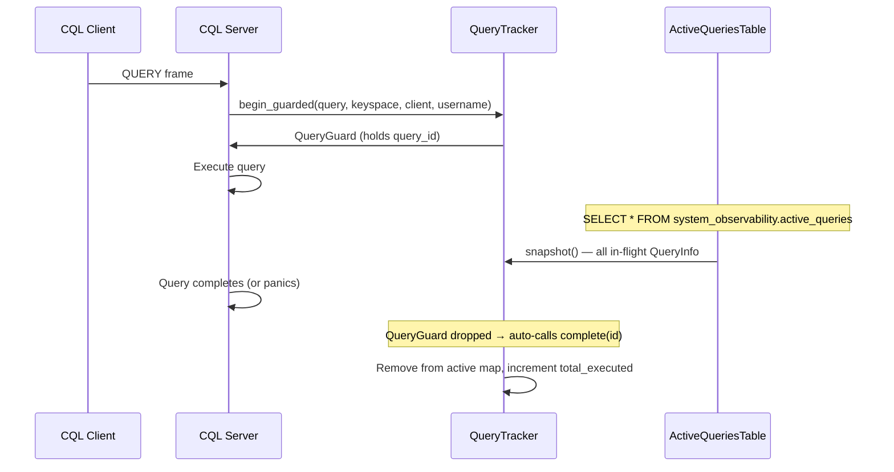

**Implementation**: `QueryTracker` (`ferrosa-cql/src/virtual_tables/active_queries.rs`) uses `RwLock<HashMap<u64, QueryInfo>>` with `AtomicU64` for ID generation and total-executed counting. `QueryGuard` implements `Drop` to call `complete()`. The `ActiveQueriesTable` exposes this as `system_observability.active_queries` with primary key `query_id`. Columns: `query_id`, `client_address`, `username`, `query_text`, `keyspace`, `start_time` (epoch ms), `elapsed_ms`, `state`.

### Prometheus Scrape Flow

The Prometheus exporter converts all virtual tables in `system_observability` into text exposition format. Text columns become labels; numeric columns (Int, BigInt, Double) become metric values named `ferrosa_<table>_<column>`.

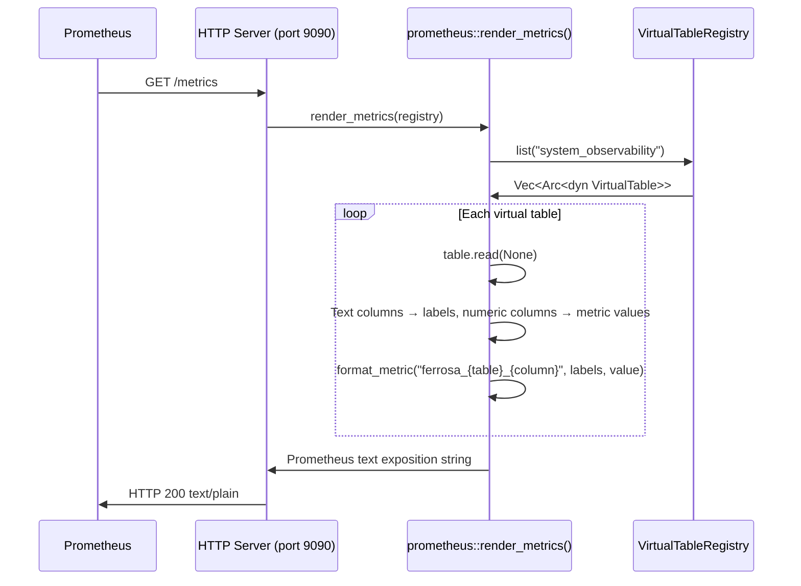

**Implementation**: `render_metrics()` (`ferrosa-cql/src/prometheus.rs`) iterates `registry.list("system_observability")`, calls `table.read(None)` on each, and emits metric lines. Tombstoned cells are skipped. The `/metrics` route wiring is follow-on work — the renderer is complete.

### Web Dashboard Flow

An Axum-based web server (default port 9090) serves both a static HTML frontend and JSON API endpoints backed by the `VirtualTableRegistry`. The frontend auto-refreshes every 5 seconds.

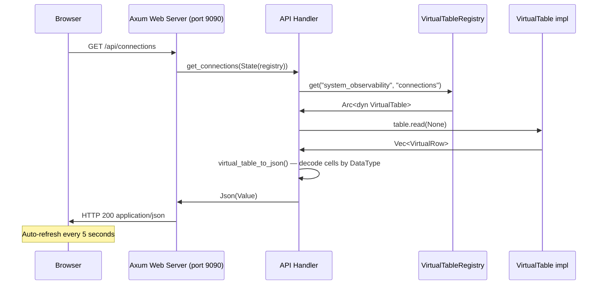

**Endpoints**:

| Route | Handler | Virtual Table |
|-------|---------|---------------|
| `GET /api/connections` | `get_connections` | `system_observability.connections` |
| `GET /api/storage_stats` | `get_storage_stats` | `system_observability.storage_stats` |
| `GET /api/active_queries` | `get_active_queries` | `system_observability.active_queries` |
| `GET /api/tables` | `list_tables` | Lists all tables in `system_observability` |

**Implementation**: `ferrosa/src/web/mod.rs` binds on `FERROSA_WEB_BIND` (default `0.0.0.0:9090`). `ferrosa/src/web/api.rs` converts virtual table rows to JSON: Text columns become strings, Int/BigInt become numbers, Double uses `from_f64`, Boolean checks first byte, tombstones become `null`, and unrecognized types render as `"<binary>"`. Static files are served via rust-embed on the fallback route.

### TUI Monitor Flow

`ferrosa-ctl monitor` provides a terminal dashboard using ratatui. It connects as a CQL client and polls virtual tables via standard CQL queries.

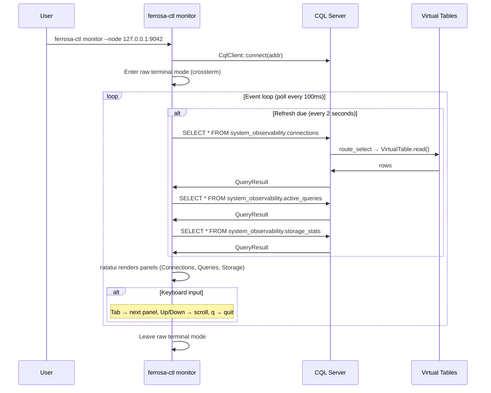

**Implementation**: `ferrosa-ctl/src/tui.rs` uses three panels (`Connections`, `Queries`, `Storage`). The event loop polls crossterm events with a 100 ms timeout and refreshes CQL data every 2 seconds via `AppState::refresh()`. Panel switching resets scroll position. The CQL client runs on a tokio runtime handle with `block_on()` for synchronous integration with the ratatui render loop.

### Subscription Flow (Deferred)

SUBSCRIBE allows clients to receive notifications when watched tables are written to. The observer hooks into the storage write path and filters mutations by subscription interest.

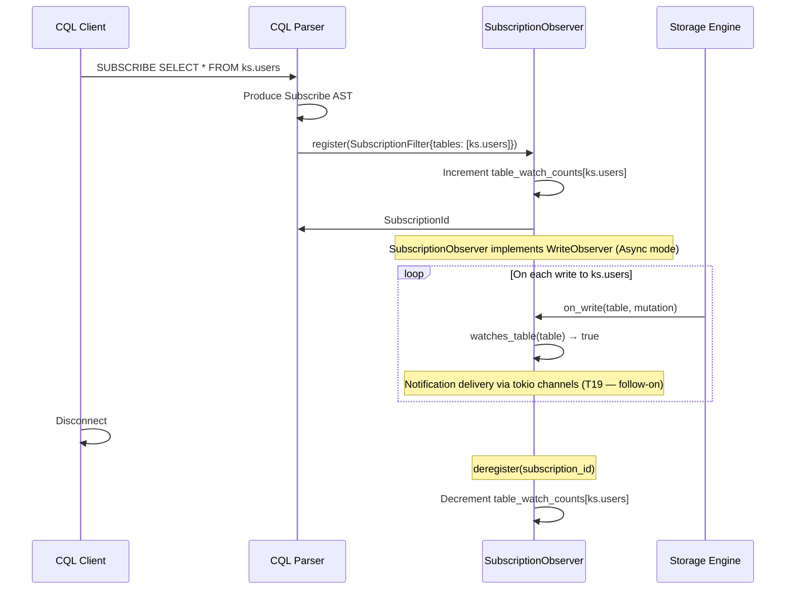

**Implementation status**: The `SubscriptionObserver` (`ferrosa-storage/src/subscription_observer.rs`) implements `WriteObserver` with `ObserverMode::Async`. It maintains ref-counted `table_watch_counts` so multiple subscriptions to the same table are handled correctly — only when the last subscription is removed does `watches_table()` return false. Currently, `on_write()` returns an empty vec; notification delivery via tokio channels is deferred (T19). The `SubscriptionState` per-connection tracking and `SUBSCRIBE` AST parsing are also follow-on work.

## Related Specs

- [Overview](overview.md) — system overview
- [Components](components.md) — crate architecture
- [Testing](testing.md) — data integrity and chaos tests
