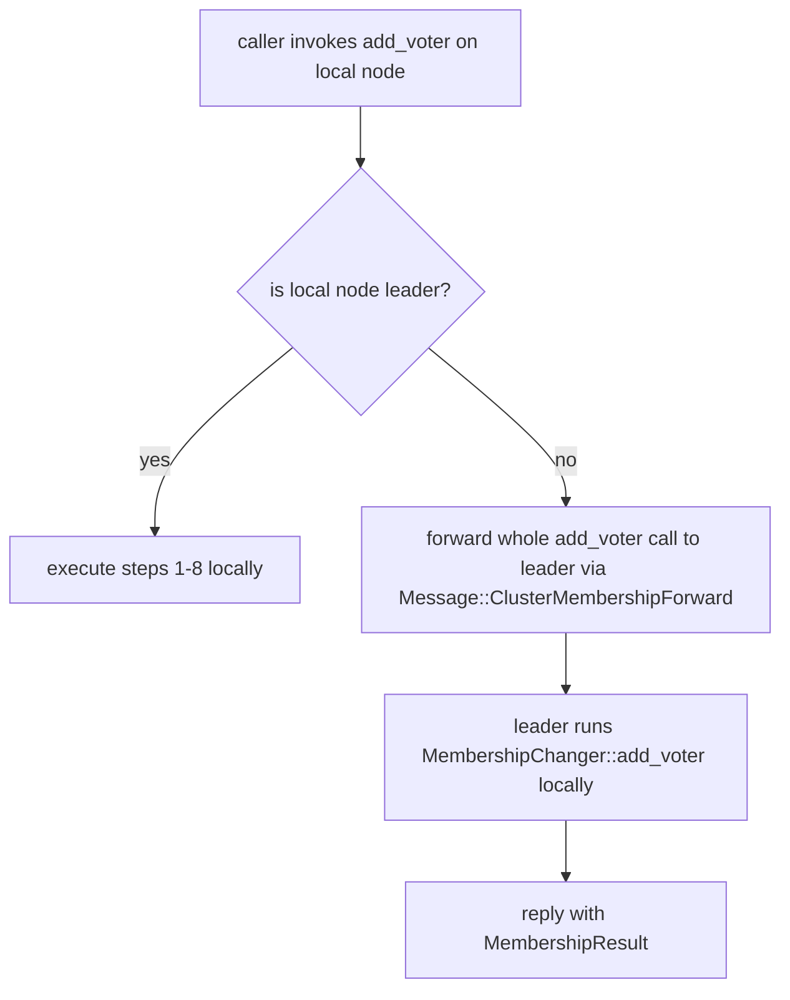

# ADR-013: Membership Change Protocol — Single Atomic API

> Date: 2026-05-09
> Status: Proposed
> Supersedes: parts of `cluster-formation-architecture.md` ADR-3 (ClusterInvite still stands; this ADR replaces ad-hoc `client_write(JoinNode/LeaveNode/UpdateNodeInfo)` patterns)
> Companion to: ADR-012 (PreVote/CheckQuorum), ADR-014 (Learners), ADR-015 (Multi-DC)

## Context

Ferrosa today maintains four distinct stores that together describe cluster membership:

1. `RaftStateMachine.state.members` — application-level membership (host_id → NodeInfo with addr, dc, rack, lifecycle state, cql_broadcast).
2. `openraft Membership.nodes` — the consensus voter set (BasicNode with addr; addr ignored by ferrosa network factory).
3. `FerrosRaftNetworkFactory.node_map` — `Arc<RwLock<HashMap<u64, Uuid>>>` for replication routing.
4. `PeerManager.peers` — live TCP connection state.

These stores are updated by **different code paths with no transactional API spanning them**:

| Update site | (1) state.members | (2) openraft Membership | (3) node_map | (4) PeerManager |
|---|---|---|---|---|
| Seed `raft.initialize(members)` | — | yes | yes (initial only) | — |
| Seed bootstrap `JoinNode` per peer (after init) | yes | — | — | — |
| `peer_events` → `trigger_cluster_join` (normal late join) | yes | **no** | **no** | yes (reverse-connect) |
| `cluster_rejoin` post-hook (after 30 s formation timeout only) | yes | yes (via `add_learner`+`change_membership`) | yes | yes |
| `RaftOp::LeaveNode` (decommission) | removes | **no** | **no** | — |
| `RaftOp::UpdateNodeInfo` apply | yes | — | — | — |
| `handle_join_request` (rarely called) | yes | — | — | — |

**Consequences observed in production**:
- Today's outage (2026-05-09 19:51 UTC): non-leader silent drop of `client_write(UpdateNodeInfo)` (line 426 of `controller/membership.rs`); ad-hoc fix in `raft_forward.rs` (branch `fix/membership-forward-to-leader`). Even with that fix, the underlying drift persists: a node added via `trigger_cluster_join` is in `state.members` but is not an openraft voter, so the leader cannot replicate to it.
- Phantom voters: `RaftOp::LeaveNode` removes from `state.members` but never from openraft Membership. Quorum size grows monotonically; cluster collapses on second voter loss.
- Re-discovered four times in P0-21 and once more in `fbfc39c8` (Agent B bug genome). Single-fix-exposes-next-layer pattern.

## Decision

Introduce a single transactional API for all membership changes. No code outside this module may call `raft.client_write(JoinNode|LeaveNode|UpdateNodeInfo)`, `raft.add_learner`, `raft.change_membership`, `network_factory.register_node`, or directly mutate `state.members`. CI gate enforces this via grep-based lint.

### Module: `ferrosa-cluster/src/membership/`

```rust
pub struct MembershipChanger {
    raft: Arc<FerrosRaft>,
    network_factory: Arc<FerrosRaftNetworkFactory>,  // exposes register_node + unregister_node
    peer_manager: Arc<PeerManager>,
    config: Arc<ClusterConfig>,
}

impl MembershipChanger {
    /// Add a node as a voter. Idempotent — adding an already-present voter is a NoOp.
    /// Steps:
    ///   1. ensure peer connection (peer_manager.ensure_peer)
    ///   2. register_node in network_factory's node_map
    ///   3. raft.add_learner(node_id, BasicNode { addr }, blocking=false)
    ///   4. wait for replication.matched_index >= leader.last_log_id (catch up)
    ///   5. raft.change_membership(ChangeMembers::AddVoters({...}), retain=true)
    ///   6. raft.client_write(RaftOp::JoinNode(NodeInfo { ... }))
    ///   7. raft.client_write(RaftOp::AssignTokens { ... })
    ///   8. wait for state.members to reflect the new node (apply barrier)
    /// On any partial failure, returns a typed error containing which step failed.
    /// The caller may retry with the same arguments — every step is idempotent.
    pub async fn add_voter(
        &self,
        host_id: Uuid,
        addr: SocketAddr,
        config: NodeJoinConfig,
    ) -> Result<(), MembershipError>;

    /// Remove a node from the cluster.
    /// Steps:
    ///   1. if removing the leader, transfer leadership first (Sprint 3 dependency)
    ///   2. raft.client_write(RaftOp::SetNodeState { state: Joining })  // pause writes to N
    ///   3. drain N's owned token ranges (stream to next replica) -- skip if N unreachable
    ///   4. raft.change_membership(ChangeMembers::RemoveVoters({...}), retain=true)
    ///   5. raft.client_write(RaftOp::LeaveNode { node_id })
    ///   6. network_factory.unregister_node(node_id)
    ///   7. peer_manager.remove_peer(host_id)
    ///   8. wait for state.members removal to propagate
    pub async fn remove_voter(&self, host_id: Uuid) -> Result<(), MembershipError>;

    /// Update an existing voter's metadata (addr, cql_broadcast).
    /// No openraft change_membership needed — addr is in NodeInfo, not BasicNode.
    /// Idempotent — same metadata = NoOp.
    pub async fn update_metadata(
        &self,
        host_id: Uuid,
        new_addr: Option<SocketAddr>,
        new_cql_broadcast: Option<String>,
    ) -> Result<(), MembershipError>;

    /// Promote a learner to voter (ADR-014).
    pub async fn promote_learner_to_voter(&self, host_id: Uuid) -> Result<(), MembershipError>;

    /// Approve a host_id (auto_join=false). Replicated via Raft, not local cache.
    pub async fn approve_node(&self, host_id: Uuid) -> Result<(), MembershipError>;
}

pub enum MembershipError {
    NotLeader { leader_node_id: Option<u64>, leader_uuid: Option<Uuid> },
    InProgress,                              // openraft ChangeMembership already running
    ApprovalRequired,                        // auto_join=false and host_id not approved
    LearnerCatchupTimeout,                   // step 4 timed out
    ApplyTimeout,                            // step 8 timed out
    Net(NetError),                           // peer_manager couldn't reach a peer
    RaftError(String),                       // any other openraft error
    Internal(String),
}
```

### Forwarding when this node is not the leader

`MembershipChanger` is callable from any node. Each step that proposes a Raft change automatically forwards via `raft_forward::forward_raft_command_to_leader` if `client_write` returns `ForwardToLeader`. The internal flow:



This requires extending the wire-message addition we made in branch `fix/membership-forward-to-leader` (currently only forwards a single `RaftCommand`) into a richer `Message::ClusterMembershipForward(MembershipOp)` that carries the full operation. Sprint 1 deliverable.

### Idempotence and retry contract

Every step is idempotent. A retried `add_voter(host_id, addr, ...)` after a partial failure produces the same end state. Specifically:

- Step 2 (`register_node`): inserting an already-present `(node_id, host_id)` is a NoOp.
- Step 3 (`add_learner`): openraft documents this as idempotent for already-known learners.
- Step 4 (catch-up): if already caught up, returns Ok immediately.
- Step 5 (`change_membership(AddVoters)`): adding an already-present voter is a NoOp.
- Step 6 (`RaftOp::JoinNode` apply): inserting an already-present `state.members[node_id]` is a NoOp.
- Step 7 (`AssignTokens`): the apply path is already idempotent (inserts same key→value).
- Step 8 (apply barrier): always idempotent.

Caller retries `MembershipError::InProgress` with exponential backoff (10 ms, 30 ms, 100 ms, 300 ms, 1 s, 3 s, 10 s, fail).

### Joint consensus, not single-server change

openraft 0.9 only supports joint consensus (`raft/impl_raft_blocking_write.rs:30-105`) — there is no single-server-change API. This is the right choice for ferrosa for two reasons:

1. **DC swap operations** (e.g., decom DC1, add DC3) need atomicity that single-server-change cannot provide. With joint, `{DC1.voters, DC2.voters} → {DC2.voters, DC3.voters}` happens in one logical step. With single-server, you would step through 6 changes; intermediate configs like `{DC1.b, DC1.c, DC2.a, DC2.b, DC3.a}` are *less available* than what you started with.
2. **Joint is strictly safer** under arbitrary set differences (Ongaro §4.3 vs §6.4.1).

The cost: `MembershipChanger::add_voter` always issues a learner add + voter promotion as two separate calls (rather than one single-server change). Acceptable.

### Apply-path ordering invariant

Reads of `state.members` are correct iff:
- Step 5 (`change_membership(AddVoters)`) commits *before* step 6 (`RaftOp::JoinNode`).

If step 6 commits first and an external observer reads `state.members` between step 6 and step 5, they will see a member that openraft does not yet treat as a voter. Today this is the production bug. Fix: step 6 must wait on the openraft join completing, which `change_membership(retain=true)` provides (the call returns when the joint config is committed).

For removal (`remove_voter`): step 4 must commit *before* step 5. If step 5 commits first, an external observer can see a member already gone from `state.members` while openraft still expects a vote from them, deadlocking the next `change_membership`. Step 4 returns when the joint config is committed.

### `RaftOp::ApproveNode` is no longer dead code

Sprint 1 wires `MembershipChanger::approve_node` to propose `RaftOp::ApproveNode`. The local `controller.approved_nodes` cache becomes a derived view populated by apply, not the source of truth. `auto_join=false` becomes correctly enforced on every node (I-11 in `raft-invariants.md`).

### Apply path returns errors

Per ADR-013 § "Apply errors propagate" (also I-15): `apply_command` returns `RaftResponse::Error(reason)` on any sub-error (`schema.create_table_internal` failure, `engine.register_table` failure, `system_writer` failure, etc.). Today these are silently swallowed via `let _ = engine.register_table(...)`. Sprint 1 rewrites `state_machine.rs::apply_command` to bubble all sub-errors; CI gate `grep -rn "let _ = " ferrosa-cluster/src/raft/` returns zero matches.

`MembershipChanger` callers see `RaftResponse::Error` as `MembershipError::RaftError` and decide retry vs fail.

## Rationale

The four-maps-must-agree invariant (I-06) is the dominant defect class in the bug genome: 6 of 38 fixes hit it directly, plus 9 more in the related "non-leader-silent-drop" class. The right shape is **a single API that is the only way to mutate any of the four maps** — no atomicity bug can hide behind partial coverage.

Joint consensus is the right concurrency model. Apply-path ordering is a contract we can enforce in code review and at runtime. Idempotence makes retry safe.

## Consequences

### Positive

- The dominant defect class collapses to a single audit point.
- Decommission no longer leaves phantom voters.
- Operator-driven membership changes (ferrosa-ctl) become trivial — they call into `MembershipChanger` and inherit forwarding, retry, idempotence.
- Multi-DC DC swap is atomic via joint consensus.

### Negative

- Sprint 1 is heavyweight: rewriting every membership-mutating call site, plus the apply-path error propagation.
- Forward-and-retry cycle adds latency to non-leader-initiated membership changes (one extra round-trip vs the silent-drop path which had zero RTT — and zero correctness).

### Neutral

- Wire format gains `Message::ClusterMembershipForward(MembershipOp)`. We already added `Message::ClusterRaftForward` in the membership-forwarding patch; this generalizes it.

## Open questions

1. **`MembershipChanger::add_voter` step 1 (`peer_manager.ensure_peer`) on the leader for a remote joiner.** If the leader cannot reach the joiner directly (e.g. asymmetric partition), should add_voter fail or succeed-without-route? **Decision: succeed.** The joiner's reverse-connect path will eventually establish reachability; openraft handles the temporary unreachable as Unreachable backoff. Document this in the API.
2. **Should `update_metadata` be replicated through Raft?** It mutates `state.members[host_id].addr`. If addr is wrong on the leader but the leader is the only one with the updated info (e.g., a follower's reconnect notification), the leader's apply must propagate to followers. **Decision: yes, via `RaftOp::UpdateNodeInfo`.** Already today's pattern.
3. **What happens if `MembershipChanger::add_voter` is called from a node that is not in the cluster yet?** Today `trigger_cluster_join` runs on the connection-receiver's side. **Decision: same.** The new joiner does not call `add_voter` on itself; the receiver does.

## Acceptance criteria (Sprint 1)

- [ ] Module `ferrosa-cluster/src/membership/` exists with `MembershipChanger` API as specified.
- [ ] No call to `raft.client_write(RaftOp::JoinNode|LeaveNode|UpdateNodeInfo)`, `raft.add_learner`, `raft.change_membership`, or `network_factory.register_node` outside this module. CI grep gate.
- [ ] `apply_command` returns `RaftResponse::Error(_)` on any sub-error. CI grep: `grep -rn "let _ = " ferrosa-cluster/src/raft/state_machine.rs` returns zero matches.
- [ ] Test `membership_atomicity_test`: 4-node openraft in-memory cluster, add 4th via `add_voter`, verify on every node `state.members.contains(N4) ∧ openraft.metrics().voter_ids().contains(N4) ∧ node_map.get(N4_id) == Some(N4_uuid) ∧ peer_manager.peers.contains_key(N4)`.
- [ ] Test `membership_decom_atomicity_test`: same shape; after `remove_voter`, all four maps removed N3.
- [ ] Test `membership_concurrent_changes_serialize`: two `add_voter` calls in parallel; both succeed via retry on `InProgress`.
- [ ] Test `membership_idempotent`: call `add_voter(N4)` twice; second call is NoOp.
- [ ] `RaftOp::ApproveNode` proposed when `MembershipChanger::approve_node` runs; verify follower's `state.approved_nodes` reflects it.
- [ ] Reverting Sprint 1's `MembershipChanger::add_voter` to the pre-Sprint-1 pattern produces a Jepsen smoke run failure (Sprint 2 dependency).
- [ ] `ferrosa-ctl raft reset --node N` lands as the operator escape hatch (uncommitted in worktree `ferrosa-raft-fix`).

## References

- `specs/raft-correctness-plan.md` Sprint 1.
- `specs/raft-invariants.md` I-06, I-07, I-08, I-09, I-10, I-11, I-13, I-15, I-19, I-25.
- `specs/raft-failure-mode-matrix.md` S-01 through S-10, S-26, S-40.
- Bug genome (Agent B): P0-21 saga (`5256ff10`, `9fdd6c82`, `1af4f5f9`, `024a75a8`), `fbfc39c8`, plus the 9 commits in the "non-leader-silent-drop" class.
- Ongaro dissertation §4.3 (joint consensus).
