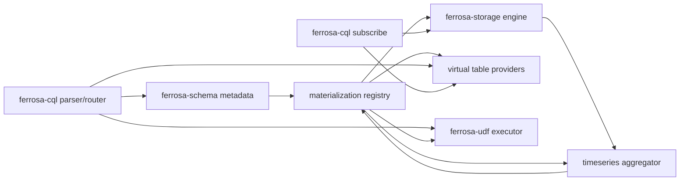

# DSM Analysis — RRD Materialized Rollups and WASM Time-Series UDFs

> Last updated: 2026-05-20
> Status: Draft blueprint

## Summary

Repository-level DSM via `frg dsm analyze . --format markdown` reports:

| Metric | Value | Status |
| ------ | ----- | ------ |
| Elements | 18 crates | - |
| Dependencies | 63 | - |
| Propagation cost | 29.0% | warning |
| Max cycle size | 0 | good |
| Number of cycles | 0 | good |
| Cluster quality | 54.0% | warning |

Feature implementation crosses the warning-level coupling area: CQL parser and
router, schema metadata, storage engine observers, virtual tables, subscription
support, and the WASM executor. The highest-churn files in the last year are
also on this path: `ferrosa-cql/src/router.rs`, `ferrosa-storage/src/engine.rs`,
and `ferrosa/src/main.rs`.

## Feature Module Matrix

| Module | Responsibilities | Depends on | Provides to |
| ------ | ---------------- | ---------- | ----------- |
| CQL parser/router | table-extension validation, UDF DDL forms, UDF predicates | schema, UDF executor, storage state | schema metadata, query execution |
| Schema registry | table/function metadata, DDL replication payloads | common types | CQL router, cluster DDL, startup rebuild |
| Storage engine | write path, observer dispatch, target writes | schema-derived table IDs, commitlog/memtable | materialization registry, subscriptions |
| Timeseries registry | consolidator lifecycle, queue ownership, metrics | storage engine, schema metadata | observers, workers, virtual tables |
| Aggregator | ring buffer insert, boundary/late detection | config, queue sink | materialization queue |
| Materialization worker | compute aggregates, call UDFs, write rollups | queue, storage engine, UDF executor | target tables, metrics |
| Virtual tables | queue lag/status, consolidation metrics | registry metrics provider | CQL queries, SUBSCRIBE |
| Subscription engine | poll/delta streams for target and virtual tables | CQL query routing, virtual table registry | clients |
| UDF executor | compile/call WASM components, cache by signature | schema function metadata | router, materialization worker |
| Examples/docs | sensor story, CQL scripts, WASM stddev artifact | implemented CQL surface | users, CI example tests |

## Desired Boundaries

## Coupling Risks

| Risk | Cause | Design response |
| ---- | ----- | --------------- |
| Router grows more monolithic | UDF DDL, table DDL, query predicates, examples all touch `router.rs` | Keep parser changes small; move validation/import helpers into focused modules where possible |
| Storage engine owns too much feature state | Observer dispatch currently lives in `engine.rs` | Add a registry/provider abstraction instead of embedding queue logic directly in `engine.rs` |
| Schema and executor identity mismatch | Schema keys functions by signature; executor currently keys by name | Define a shared `FunctionIdentity` including arg types |
| Virtual table duplication | CQL and storage both expose virtual tables | Use provider traits for queue metrics, mirroring existing storage virtual table pattern |
| Subscription semantics drift | Virtual tables and physical target tables may stream differently | Add contract tests for `SUBSCRIBE SELECT ... DELTA` over both |

## Refactoring Guidance

- Introduce small interfaces before changing hot files:
  `MaterializationRegistry`, `MaterializationQueueProvider`,
  `FunctionArtifactLoader`, and `FunctionIdentity`.
- Keep target-row encoding in one module with unit tests; do not duplicate
  column-name construction in CQL DDL and worker code.
- Treat virtual table schemas as contracts; add tests before changing
  `consolidation_status`.
- Avoid adding filesystem/HTTP logic directly to router; route `AS FILE` and
  `AS URL` through an artifact loader with explicit admin checks.

## Architecture Enforcement Candidates

- `ferrosa-storage::timeseries` may depend on `ferrosa-udf` only through a
  narrow trait or caller-provided closure if crate dependencies would otherwise
  become cyclic.
- `ferrosa-udf` must not depend on `ferrosa-cql` or `ferrosa-storage`.
- `ferrosa-cql` owns syntax and routing, not queue execution.
- Virtual table providers should expose read-only snapshots; mutation remains in
  registry/worker code.
