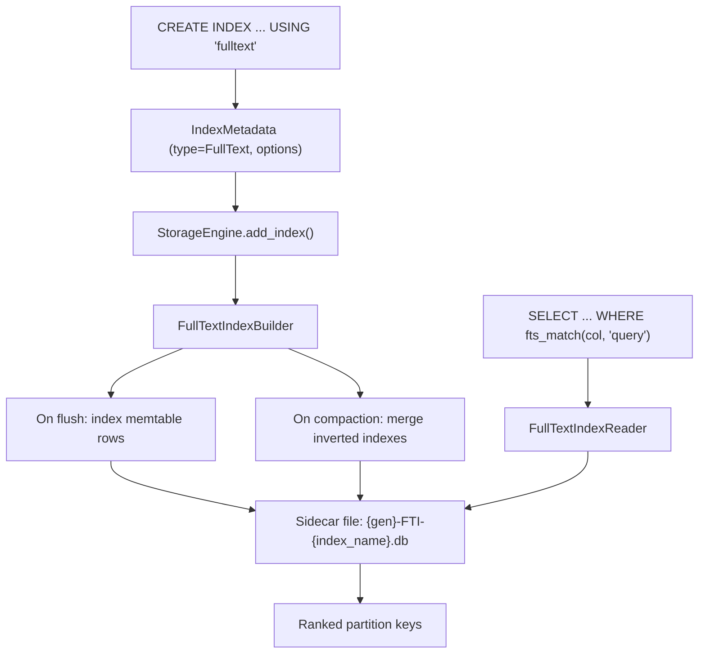

# Full-Text Indexing — Architecture Spec

> Created: 2026-03-29
> Updated: 2026-03-30
> Status: Implemented — analyzer pipeline, builder, reader, BM25 scoring, query parser (AND/OR/NOT/Prefix), merge, FTI sidecar on flush, CQL fts_match() wired
> Crate scope: ferrosa-index (fulltext/), ferrosa-storage (engine.rs, store.rs, flush.rs), ferrosa-cql (router.rs)

---

## Overview

Full-text search index for text columns, stored as sidecar files alongside SSTables. Supports tokenization, stop-word filtering, stemming, and ranked retrieval. Follows the same `IndexType` + sidecar pattern as BTree, Hash, Phonetic, and Vector indexes.

---

## Data Flow



---

## Design Decisions

### ADR-FTS-01: Inverted index stored as sidecar files per SSTable

**Decision:** Each SSTable gets a companion `{gen}-FTI-{index_name}.db` file containing the inverted index for that SSTable's rows.

**Rationale:**
- Matches the existing sidecar pattern (BTree, Hash, Vector indexes all do this)
- Compaction naturally merges inverted indexes when SSTables merge
- S3 upload includes sidecar files (no special handling needed)
- Index can be rebuilt from SSTable data if sidecar is lost

### ADR-FTS-02: Pluggable analyzer pipeline

**Decision:** The analyzer is a configurable pipeline: character filter → tokenizer → token filter chain.

**Rationale:**
- Different languages need different tokenizers and stemmers
- Custom analyzers needed for code search, email addresses, URLs
- Cassandra SASI uses a similar model; Elasticsearch/Lucene use this pattern universally

**Default pipeline:** `StandardAnalyzer` = lowercase → unicode word tokenizer → English stop words → English stemmer

### ADR-FTS-03: Query via CQL function, not new syntax

**Decision:** Full-text queries use a `fts_match(column, query)` function in WHERE clauses, not new CQL syntax like `MATCH` or `CONTAINS TEXT`.

**Rationale:**
- CQL function calls are already parsed by the ferrosa CQL parser
- No grammar changes needed — functions are extensible
- Cassandra compatibility: SASI uses `LIKE '%term%'`; we support that too
- Advanced queries via `fts_match(col, 'term1 AND term2 OR "exact phrase"')` with mini query parser inside the function

### ADR-FTS-04: BM25 ranking for relevance scoring

**Decision:** Use BM25 (Okapi) for term-frequency/inverse-document-frequency ranking.

**Rationale:**
- Industry standard for text relevance (used by Elasticsearch, Solr, Tantivy)
- Simple to implement: needs term frequency per document and document frequency per term
- Stored in the inverted index sidecar file

---

## Inverted Index File Format

### Header
```
[4 bytes] magic: "FTI\x01"
[4 bytes] version: 1
[4 bytes] term_count: u32
[4 bytes] doc_count: u32
[8 bytes] terms_offset: u64  (offset to terms dictionary)
[8 bytes] postings_offset: u64  (offset to postings lists)
```

### Terms Dictionary (sorted, binary-searchable)
```
For each term:
  [2 bytes] term_length: u16
  [N bytes] term_bytes: UTF-8
  [4 bytes] doc_frequency: u32  (number of documents containing this term)
  [8 bytes] postings_offset: u64  (offset into postings section)
  [4 bytes] postings_length: u32
```

### Postings List (per term)
```
For each document containing the term:
  [8 bytes] partition_key_hash: i64  (murmur3 token for fast lookup)
  [2 bytes] key_length: u16
  [N bytes] partition_key_bytes
  [4 bytes] term_frequency: u32  (count of term in this document)
  [4 bytes] field_length: u32  (total tokens in the field — for BM25 normalization)
```

### Footer
```
[4 bytes] checksum: CRC32 of everything above
```

---

## Components

### 1. Analyzer Pipeline

**File:** `ferrosa-index/src/fulltext/analyzer.rs` (new)

```rust
pub trait CharFilter: Send + Sync {
    fn filter(&self, input: &str) -> String;
}

pub trait Tokenizer: Send + Sync {
    fn tokenize<'a>(&self, input: &'a str) -> Vec<Token<'a>>;
}

pub trait TokenFilter: Send + Sync {
    fn filter(&self, tokens: Vec<Token>) -> Vec<Token>;
}

pub struct Analyzer {
    char_filters: Vec<Box<dyn CharFilter>>,
    tokenizer: Box<dyn Tokenizer>,
    token_filters: Vec<Box<dyn TokenFilter>>,
}

pub struct Token<'a> {
    pub text: Cow<'a, str>,
    pub position: u32,
    pub start_offset: u32,
    pub end_offset: u32,
}
```

**Built-in analyzers:**
- `StandardAnalyzer` — Unicode word boundaries, lowercase, English stop words, Porter stemmer
- `SimpleAnalyzer` — Whitespace split, lowercase only
- `KeywordAnalyzer` — No tokenization (exact match on whole field)
- `LanguageAnalyzer(lang)` — Language-specific stemmer + stop words

### 2. Inverted Index Builder

**File:** `ferrosa-index/src/fulltext/builder.rs` (new)

Implements `IndexBuilder` trait:
```rust
impl IndexBuilder for FullTextIndexBuilder {
    fn add_row(&mut self, partition_key: &[u8], token: i64, cells: &[(usize, &CellValue)]) {
        // For each target column:
        //   1. Extract text from cell value
        //   2. Run through analyzer pipeline
        //   3. For each token: add to in-memory postings map
    }

    fn finish(self) -> Result<Vec<u8>> {
        // Serialize: header + sorted terms dict + postings lists + footer
    }
}
```

### 3. Inverted Index Reader

**File:** `ferrosa-index/src/fulltext/reader.rs` (new)

```rust
pub struct FullTextIndexReader<R: ReadAt> {
    reader: R,
    header: FtiHeader,
    terms_offset: u64,
    postings_offset: u64,
}

impl<R: ReadAt> FullTextIndexReader<R> {
    /// Binary search the terms dictionary for a term.
    pub fn lookup_term(&self, term: &str) -> Option<TermEntry>;

    /// Read the postings list for a term.
    pub fn read_postings(&self, entry: &TermEntry) -> Vec<Posting>;

    /// Execute a full-text query (AND/OR/phrase) and return ranked results.
    pub fn search(&self, query: &FtsQuery, bm25_params: &Bm25Params) -> Vec<ScoredResult>;
}
```

### 4. Query Parser

**File:** `ferrosa-index/src/fulltext/query.rs` (new)

```rust
pub enum FtsQuery {
    Term(String),                          // Single term
    Phrase(Vec<String>),                   // "exact phrase"
    And(Box<FtsQuery>, Box<FtsQuery>),     // term1 AND term2
    Or(Box<FtsQuery>, Box<FtsQuery>),      // term1 OR term2
    Not(Box<FtsQuery>),                    // NOT term
    Prefix(String),                        // term*
}

pub fn parse_fts_query(input: &str) -> Result<FtsQuery>;
```

### 5. CQL Integration

**File:** `ferrosa-cql/src/router.rs`

Add `fts_match` to the function resolver:
```rust
// In WHERE clause evaluation:
if function_name == "fts_match" {
    let column = args[0];
    let query_str = args[1];
    // Look up FullText index on this column
    // Parse query string into FtsQuery
    // Execute search across all SSTable sidecar indexes
    // Merge and rank results by BM25 score
    // Return matching partition keys
}
```

### 6. Index Type Registration

**File:** `ferrosa-index/src/lib.rs`

```rust
pub enum IndexType {
    BTree,
    Hash,
    Composite,
    Phonetic,
    Filtered,
    Vector,
    FullText,   // NEW
}
```

**File:** `ferrosa-cql/src/router.rs` — `resolve_index_type()`:
```rust
Some("fulltext") | Some("fts") => Ok(IndexType::FullText),
```

---

## CQL Syntax

```sql
-- Create a full-text index with default analyzer (StandardAnalyzer)
CREATE INDEX idx_description_fts ON products (description)
    USING 'fulltext';

-- Create with custom analyzer options
CREATE INDEX idx_body_fts ON articles (body)
    USING 'fulltext'
    WITH OPTIONS = {
        'analyzer': 'standard',
        'language': 'english',
        'min_token_length': '2',
        'stop_words': 'custom',
        'stop_words_list': 'the,a,an,is,are,was,were'
    };

-- Query using fts_match function
SELECT * FROM articles WHERE fts_match(body, 'distributed database');

-- Boolean query
SELECT * FROM articles WHERE fts_match(body, 'rust AND cassandra');

-- Phrase query
SELECT * FROM articles WHERE fts_match(body, '"S3 backed storage"');

-- Prefix query
SELECT * FROM articles WHERE fts_match(body, 'compac*');

-- Combined with regular WHERE clauses
SELECT * FROM articles
    WHERE category = 'tech'
    AND fts_match(body, 'distributed database')
    ALLOW FILTERING;
```

---

## Compaction Integration

When SSTables are compacted:
1. Read all FTI sidecar files for input SSTables
2. Merge postings lists (union terms, sum frequencies, update doc counts)
3. Re-sort terms dictionary
4. Write merged FTI sidecar for output SSTable
5. Delete input FTI sidecars

This follows the same pattern as BTree/Hash index sidecar merging during compaction.

---

## S3 Integration

FTI sidecar files are included in the SSTable component list:
- Upload: `{gen}-FTI-{index_name}.db` uploaded alongside Data.db, Partitions.db, etc.
- Download: fetched from S3 when SSTable is opened from remote
- The sidecar is NOT listed in TOC.txt (it's a secondary index, not a core component)

---

## Performance Characteristics

| Operation | Complexity | Notes |
|-----------|-----------|-------|
| Index build (per SSTable) | O(N * T) | N = rows, T = avg tokens per field |
| Term lookup | O(log M) | M = unique terms (binary search) |
| Postings read | O(K) | K = documents containing term |
| BM25 scoring | O(K * Q) | Q = query terms |
| Compaction merge | O(M1 + M2) | Merge two sorted term dictionaries |

Expected sizes:
- 1M rows with avg 100 tokens/field → ~50 MB inverted index
- Term dictionary: ~500 KB (assuming 50K unique terms)
- Postings: ~49.5 MB (term frequencies + positions)

---

## Observability

- `ferrosa_index_fulltext_terms` gauge — total unique terms across all FTI indexes
- `ferrosa_index_fulltext_queries_total` counter — FTS queries executed
- `ferrosa_index_fulltext_query_duration_seconds` histogram — query latency
- `ferrosa_index_fulltext_build_duration_seconds` histogram — index build time per SSTable
