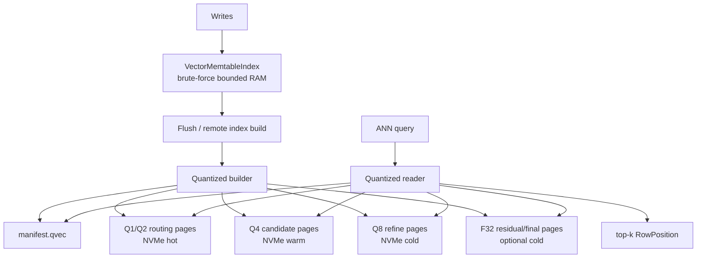
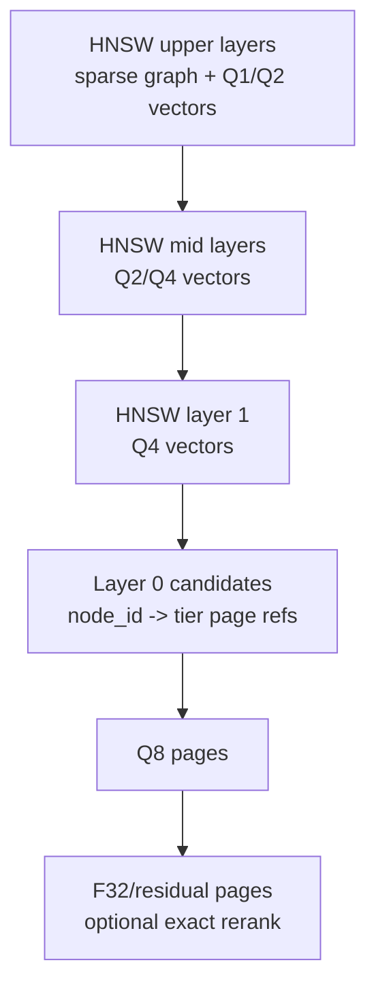
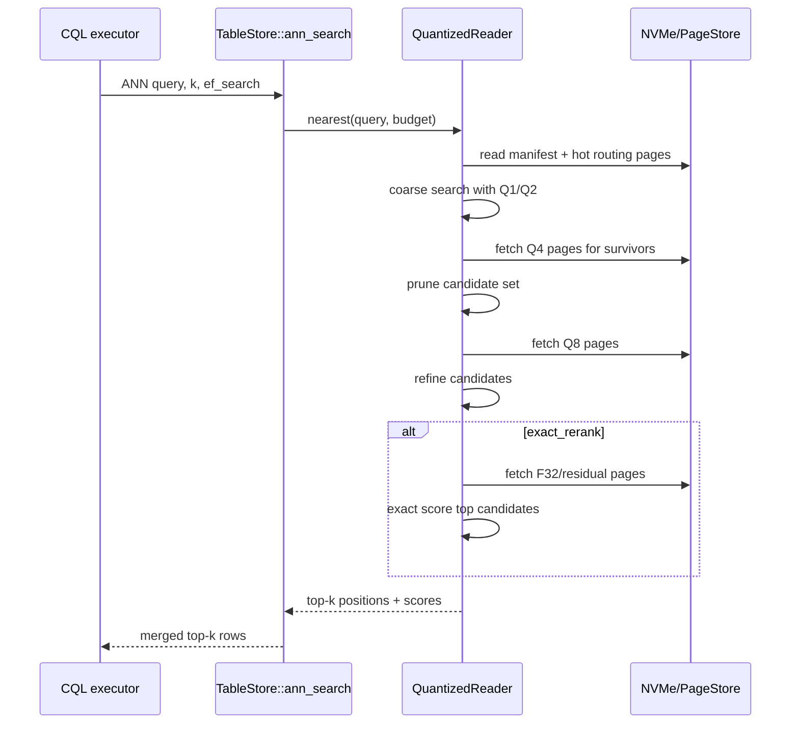

# Hierarchical Vector Quantization for NVMe-Resident ANN

> Last updated: 2026-05-12
> Status: Draft / design investigation

## Executive Summary

Ferrosa currently stores flushed vector indexes as per-SSTable JSON sidecars that contain full `f32` vectors for HNSW and IVFFlat. That is correct for small sidecars, but it does not scale to a 100B-vector target: every searched sidecar must be read and decoded as full precision before it can narrow the candidate set.

This spec proposes a hierarchical quantized vector index: store progressively more precise vector representations (`Q1 -> Q2 -> Q4 -> Q8 -> F32` or residual/PQ equivalents) in NVMe-resident sidecar pages, use coarse tiers to eliminate most candidates with bounded reads, then fetch finer tiers only for survivors. The first implementation should be an additive index method (`quantized_hnsw` or `hnsw_quantized`) rather than a rewrite of existing HNSW/IVFFlat.

## Current Codebase Findings

### Existing vector module

- `ferrosa-index/src/vector/mod.rs` defines vector traits and distance functions.
  - `IndexFactory::create_builder(dir)` and `open_reader(dir)` are directory/file based.
  - `IndexBuilder::add_row(position, value)` accumulates rows and `finish()` writes the index.
  - `IndexReader::nearest(query, k, ef_search)` returns `IndexResult { position, score }`.
  - `RowPosition` is currently only `offset: u64`, not an SSTable/object/page locator.
- `ferrosa-index/src/vector/hnsw.rs` stores `HnswGraphData` as JSON with:
  - `layers: Vec<Vec<Vec<usize>>>`
  - `vectors: Vec<Vec<f32>>`
  - `positions: Vec<RowPosition>`
  - `entry_point`, `max_layer`, `m`, `ef_construction`, `metric`
- `ferrosa-index/src/vector/ivfflat.rs` stores `IvfFlatData` as JSON with:
  - `centroids: Vec<Vec<f32>>`
  - `lists: Vec<Vec<IvfEntry>>`
  - each `IvfEntry` embeds `position: RowPosition` and `vector: Vec<f32>`
- `ferrosa-storage/src/memtable/vector_index.rs` is not HNSW despite stale comments. It is a bounded brute-force memtable index: `Vec<Vec<f32>> + Vec<RowPosition>` behind `RwLock`.

### Current flush/search path

- `TableStore::flush()` drains each `VectorMemtableIndex` and writes one `{gen}-VEC-{index_name}.db` sidecar per SSTable generation.
- Persistent vector sidecar method dispatch currently supports:
  - `IndexMethod::Hnsw { m, ef_construction }`
  - `IndexMethod::IvfFlat { lists }`
- `TableStore::ann_search()` searches the active memtable, then loops all SSTable generation IDs, reads each vector sidecar with `flush_target.read_vector_sidecar(gen, index_name)`, dispatches to HNSW or IVFFlat decoder, merges by `position.offset`, sorts by score, and truncates to `k`.
- `FlushTarget::write_vector_sidecar/read_vector_sidecar` currently treat the whole sidecar as one byte blob. File-based sidecars are named `{generation}-VEC-{index_name}.db`.

### Hotspots

Git churn over the last year for the vector-relevant paths:

- `ferrosa-storage/src/store.rs`: 45 commits touching it; 25 bug/fix commits touching it.
- `ferrosa-index/src/vector/hnsw.rs`: 6 commits; 2 bug/fix commits.
- `ferrosa-index/src/vector/ivfflat.rs`: 5 commits; 1 bug/fix commit.
- `ferrosa-index/src/vector/mod.rs`: 3 commits.
- `ferrosa-storage/src/memtable/vector_index.rs`: 1 commit.

Interpretation: put minimal new dispatch in `store.rs`; keep new quantized formats inside `ferrosa-index/src/vector/quantized.rs` plus a small `IndexMethod` extension.

## Target Problem

At 100B vectors, full precision sidecars are untenable:

- Raw `f32` storage = `N * dims * 4` bytes.
  - 100B x 768 dims x 4 bytes = 307.2 TB before graph/list metadata.
  - 100B x 1536 dims x 4 bytes = 614.4 TB before metadata.
- JSON adds unacceptable overhead and decode CPU.
- Existing `ann_search()` reads per-SSTable whole sidecars, which becomes an O(number-of-SSTables * sidecar-size) anti-pattern.
- HNSW and IVFFlat both currently store full vectors at their leaf/candidate layer.

The design goal is not merely smaller storage. It is fewer NVMe reads per query by matching representation precision to search phase.

## Design Goals

1. Keep all existing vector index methods working.
1. Add a new method whose on-disk format is page-addressable, binary, and versioned.
1. Store coarse quantized representations in upper/coarse routing nodes.
1. Fetch more precise representations only after candidate narrowing.
1. Keep exact `f32` vectors optional and cold; use them only for final rerank when configured.
1. Make cost/recall tunable per query and per index.
1. Avoid global in-memory graph requirements. The reader may cache manifests, routing summaries, and hot top-level pages, but not all vectors.
1. Preserve fail-loud behavior: unknown format, missing tier page, dimension mismatch, or corrupted checksum returns an error and records telemetry.

## Non-Goals for First Implementation

- No mutation-in-place of an existing quantized sidecar. Build immutable sidecars during flush or remote index build.
- No global 100B index across all SSTables in v1. The first cut remains per-SSTable sidecars, then adds a higher-level manifest/fanout layer later.
- No GPU requirement.
- No approximate delete handling beyond current SSTable/tombstone semantics.
- No replacement of scalar secondary index machinery.

## Proposed Architecture



### Components

#### `ferrosa-index::vector::quantized`

New module for binary quantized ANN formats.

Responsibilities:

- Quantization codecs: `Q1`, `Q2`, `Q4`, `Q8`, optional residual/PQ codecs.
- Versioned binary manifest and page table.
- Builders from drained `(RowPosition, Vec<f32>)` entries.
- Readers that perform staged candidate narrowing without decoding every vector.
- Recall/latency test hooks and golden corpus tests.

#### `QuantizedVectorManifest`

A small, eagerly loaded metadata file. Suggested fields:

```rust
struct QuantizedVectorManifest {
    magic: [u8; 8],              // FERQVE01
    version: u16,
    dimensions: u16,
    metric: DistanceMetric,
    method: QuantizedMethod,     // HNSW, IVFFlat, IVF_HNSW, future
    tiers: Vec<QuantizedTier>,
    routing_root: PageId,
    row_count: u64,
    checksum: u32,
}

struct QuantizedTier {
    precision: PrecisionTier,    // Q1, Q2, Q4, Q8, F32
    page_size: u32,              // e.g. 4 KiB, 16 KiB, 64 KiB
    page_count: u64,
    codec: CodecId,
    byte_range: ByteRange,
}
```

#### `QuantizedPageStore`

A page-addressable sidecar reader/writer abstraction. It should not require reading the entire sidecar into memory.

First version can wrap local files under the existing flush target directory. Later versions can map the same page API to S3 object ranges or an NVMe cache manager.

#### Query planner

The reader needs a staged search budget:

```rust
struct QuantizedSearchBudget {
    coarse_k: usize,       // candidates retained after Q1/Q2
    mid_k: usize,          // retained after Q4
    refine_k: usize,       // retained after Q8
    final_k: usize,        // requested k
    max_page_reads: usize,
    exact_rerank: bool,
}
```

`ef_search` can map to this budget initially, but the public CQL/engine contract should eventually expose clearer options.

## HNSW Mapping

HNSW already has hierarchy, but Ferrosa's current HNSW stores full vectors on every node and clones the whole graph into memory when reading.

Recommended mapping:

- Keep graph adjacency separate from vector payloads.
- Store upper layers with compact routing vectors (`Q1` or `Q2`) and node IDs.
- Store layer 0 candidates with page references to finer tiers.
- Use quantized distance for graph traversal, then fetch `Q8`/`F32` only for candidate rerank.



Open design point: HNSW edge selection with low-bit quantized vectors can degrade graph quality. Build should probably still use `f32` input, then quantize for persisted search. The builder can discard full vectors after writing optional rerank pages.

## IVFFlat Mapping

IVFFlat naturally separates routing from candidate scans.

Recommended mapping:

- Keep centroids in `Q8` or `f16` initially; their count is small relative to rows.
- Store each inverted list as tiered pages:
  - list header and row count
  - `Q1/Q2` sketch for fast pruning inside large lists
  - `Q4` candidate payload pages
  - `Q8` refine pages
  - optional full/residual final pages
- Query path:
  1. rank centroids
  2. read selected list headers
  3. scan low-bit sketches
  4. read only pages containing surviving candidates
  5. rerank survivors

This is the easier first target than HNSW because it minimizes graph traversal error from very low precision.

## Sidecar Layout

Replace one JSON blob with a small manifest plus binary tier pages. One physical file is simplest for atomicity; multiple files are simpler for debugging. Suggested v1: one `.qvec` file with internal byte ranges.

```text
{gen}-VEC-{index_name}.qvec
  header
  manifest
  adjacency/routing section
  tier Q1 pages
  tier Q2 pages
  tier Q4 pages
  tier Q8 pages
  optional F32/residual pages
  checksum footer
```

The existing `{gen}-VEC-{index_name}.db` can remain for JSON HNSW/IVFFlat. New method should use `.qvec` or a magic header so decode never guesses.

## Query Flow



## API and Configuration Sketch

Extend `IndexMethod` without changing existing methods:

```rust
enum IndexMethod {
    Hnsw { m: usize, ef_construction: usize },
    IvfFlat { lists: usize },
    Quantized {
        base: QuantizedBase,       // hnsw | ivf_flat
        tiers: Vec<PrecisionTier>, // q2,q4,q8,f32
        lists: Option<usize>,      // for IVF
        m: Option<usize>,          // for HNSW
        ef_construction: Option<usize>,
        exact_rerank: bool,
    },
}
```

CQL examples:

```sql
CREATE INDEX idx_embed ON docs (embedding) USING 'vector'
    WITH OPTIONS = {
        'method': 'quantized',
        'base': 'ivf_flat',
        'metric': 'cosine',
        'tiers': 'q2,q4,q8,f32',
        'lists': '65536',
        'exact_rerank': 'true'
    };
```

Questions before locking the public DDL:

- Should `Q1` be exposed, or should the planner choose it internally only when row counts justify it?
- Should tier selection be per-index immutable config or query-time adjustable?
- Should existing `ef_search` be retained as the sole query knob, or should CQL expose `WITH ANN_OPTIONS` later?

## Implementation Plan

### Phase 0 — Measurement Harness

1. Add a benchmark fixture generator for random, clustered, and real embedding distributions.
1. Measure current JSON HNSW/IVFFlat sidecar sizes and query decode time.
1. Establish recall@k and latency baselines for full precision.
1. Add instrumentation for candidates scanned, sidecar bytes read, page reads, and rerank count.

### Phase 1 — Binary Page Container

1. Implement a versioned binary `.qvec` container with manifest, page table, and checksums.
1. Add `QuantizedPageStore` with file-backed read ranges.
1. Add golden encode/decode tests and corruption tests.
1. Add fail-loud errors for magic/version/checksum/dimension mismatch.

### Phase 2 — Quantization Codecs

1. Implement per-dimension scalar quantization for `Q8`, `Q4`, `Q2`, `Q1` with per-block scale/zero-point.
1. Add SIMD-friendly distance kernels later; first implementation can be scalar and verified.
1. Add property tests for monotonic behavior bounds and decode error ranges.
1. Compare scalar quantization against product quantization before committing to storage format.

### Phase 3 — IVFFlat Quantized Reader/Builder

1. Build IVF centroids from full vectors as today.
1. Write list pages by tier.
1. Query centroid routing, then staged list pruning.
1. Verify recall/latency/storage against full IVFFlat.

### Phase 4 — HNSW Quantized Reader/Builder

1. Split adjacency from vector payloads.
1. Use quantized vectors for persisted traversal.
1. Keep optional full/residual pages for final rerank.
1. Verify graph recall degradation at each precision tier.

### Phase 5 — Storage Integration

1. Extend `IndexMethod::from_options` for `quantized`.
1. Add dispatch in `TableStore::flush()` and `ann_search()`.
1. Update `FlushTarget` docs and file-backed range read support.
1. Preserve old `.db` sidecars for existing HNSW/IVFFlat methods.

### Phase 6 — Remote Index Builder / NVMe Cache

1. Move large quantized builds to `ferrosa-index-builder` for production-sized SSTables.
1. Add page prefetch and admission policy for hot routing pages.
1. Add compaction merge behavior: rebuild quantized sidecars for compacted SSTables.

## Test Strategy

- Unit tests:
  - codec round trips by precision tier
  - manifest parse errors
  - page table bounds checking
  - dimension mismatch errors
- Property tests:
  - random vectors decode within expected quantization error
  - staged search never returns more than `k`
  - exact rerank score ordering equals full `f32` scoring for survivor set
- Integration tests:
  - flush writes `.qvec` sidecar
  - restart/read path opens sidecar without full decode
  - `ann_search()` merges active memtable + quantized SSTable results
  - compaction removes/replaces old quantized sidecars
- Benchmarks:
  - bytes read/query
  - p50/p95 latency
  - recall@10/100
  - build time
  - sidecar size by tier config

## Risks

| Risk | Impact | Mitigation |
|---|---|---|
| Low-bit traversal breaks HNSW recall | Bad results despite fast search | Start with IVFFlat; keep HNSW exact/rerank pages; benchmark recall before enabling by default |
| JSON compatibility churn | Existing sidecars fail to decode | New magic/versioned `.qvec`; no change to old `.db` readers |
| `RowPosition { offset }` insufficient | Cannot uniquely identify rows across SSTables/pages | Keep generation context at `TableStore` merge layer initially; consider future `VectorRowRef { generation, offset }` in quantized sidecar internals |
| Whole-sidecar `read_vector_sidecar` API | Destroys NVMe page-read goal | Add page/range read API for quantized method; keep old blob API for old formats |
| Large builder RAM use | Cannot build production-size indexes during flush | Use remote index builder and streaming/page-spilling builder before production use |
| Quantization calibration drift | Poor recall on skewed embedding distributions | Store per-block/per-list scales; benchmark on real corpus embeddings |


## Blueprint Expansion

This section captures the request as a blueprint-level design package rather than only a storage-format sketch. It is intentionally implementation-facing: each item should become a work item, benchmark, or explicit owner decision before coding starts.

### Phase 0 — Plan Interrogation Defaults

Until the grill-me answers below are resolved, use these defaults for planning:

| Decision | Default | Why |
|---|---|---|
| First base algorithm | IVFFlat | IVFFlat has explicit centroid/list phases, so low-bit approximation is easier to bound than HNSW graph traversal error. |
| HNSW scope | Research/prototype after IVFFlat | HNSW can still use tiered payload pages, but low-bit vectors can corrupt greedy routing decisions. |
| First storage format | New `.qvec` container | Avoids changing existing JSON `.db` sidecars and makes version/magic/checksum checks fail loud. |
| First durability model | Immutable per-SSTable sidecar | Matches current flush/compaction semantics and avoids mutable quantized trees. |
| First precision ladder | Q2 -> Q4 -> Q8 -> optional F32 | Q1 should be benchmark-gated; it is attractive for routing but high-risk for recall. |
| First query guarantee | Approximate narrow + exact survivor rerank | Keeps correctness understandable while storage and recall are measured. |
| First build path | Local prototype builder, remote production builder later | Local keeps tests simple; remote builder is required before production-scale flushes. |

### Phase 1 — Reconnaissance Summary

- Stack: Rust workspace with GitHub Actions, Cargo, Make, clippy, and pre-commit.
- Existing vector implementations are concentrated in `ferrosa-index/src/vector/{mod,hnsw,ivfflat}.rs`.
- Existing persistence/search integration is concentrated in `ferrosa-storage/src/{store,flush}.rs` and `ferrosa-storage/src/memtable/vector_index.rs`.
- `store.rs` is the main churn hotspot, so quantized search should add one dispatch seam there and keep page format/search logic inside `ferrosa-index`.
- `ferrosa-index-builder` is already the natural production path for large index construction; this design should not assume flush-time training at production scale.

### Phase 2 — Architecture Boundary

Split the work into five stable seams:

| Seam | Owns | Should not own |
|---|---|---|
| Quantized codecs | Bit-packing, scale/zero-point metadata, distance kernels | SSTable generation, CQL parsing, compaction policy |
| `.qvec` container | Manifest, page table, checksums, range reads | Search algorithm policy |
| Quantized ANN reader/builder | IVFFlat/HNSW staged narrowing and rerank | Flush target implementation details |
| Storage dispatch | Method selection, sidecar naming, per-generation merge | Codec internals |
| Benchmark harness | Recall/latency/bytes-read gates | Production query execution |

The critical dependency direction should be:

```text
ferrosa-storage -> ferrosa-index::vector::quantized -> quantized codecs/container
```

Do not let codec/container code depend back on storage, table schema, or CQL executor types. Pass plain row positions and byte-range abstractions.

### Phase 3 — Threat / Data Integrity Model

High-confidence static threat scan findings for the vector paths were empty, but the new format introduces data-integrity risks that should be treated as first-class threats:

| Threat | Failure mode | Required control |
|---|---|---|
| Tampered/corrupt sidecar | Wrong nearest-neighbor results without a crash | Magic/version/checksum per file and per page; fail query on mismatch. |
| Dimension drift | Query vector scored against wrong-width pages | Store dimensions in manifest and every tier header; reject mismatches. |
| Codec confusion | Q4 bytes decoded as Q8 or stale format | Per-tier codec id and version; no extension-based guessing. |
| Partial compaction cleanup | Old sidecars searched with new sidecars | Generation-scoped manifests and compaction delete/replace tests. |
| Recall regression hidden by speed | Fast but bad ANN results | Recall gates in benchmarks before enabling defaults. |
| NVMe cache miss storm | Query fans out across too many cold pages | Budgeted `max_page_reads`, telemetry, and fallback behavior. |

### Phase 4 — FMEA

| Failure mode | Severity | Occurrence | Detection | RPN | Mitigation / test |
|---|---:|---:|---:|---:|---|
| Q1/Q2 routing eliminates true neighbors too early | 9 | 5 | 4 | 180 | Keep coarse candidate multiplier high; benchmark recall@k by tier; default exact rerank. |
| `.qvec` page table points outside file | 8 | 3 | 2 | 48 | Bounds-check every byte range; corruption tests. |
| Builder OOMs on large SSTable flush | 8 | 5 | 5 | 200 | Streaming builder, spill pages, and production offload to `ferrosa-index-builder`. |
| Whole sidecar read path accidentally used | 7 | 4 | 3 | 84 | Instrument bytes read/query; assert quantized reader uses range reads in tests. |
| Compaction leaves orphaned quantized sidecars | 6 | 4 | 4 | 96 | Integration test compaction replacement and cleanup. |
| Score ordering differs after exact rerank | 7 | 3 | 3 | 63 | Golden tests comparing survivor-set f32 order to exact search. |
| HNSW graph traversal degrades under quantization | 9 | 4 | 5 | 180 | HNSW is phase 2; benchmark before exposing in default DDL. |

RPN >= 180 items should be treated as gating work before any production/default enablement.

### Phase 5 — Correctness Hazards

- JSON-to-binary migration must not silently reinterpret old `.db` files. Use a new extension or magic header and explicit method dispatch.
- Bit-packing codecs are easy to get subtly wrong. Require golden vectors, property tests, and cross-tier decode error bounds.
- Approximate distance kernels must declare whether they estimate cosine, dot, or Euclidean distance after quantization. Metric mismatch is a correctness bug, not a tuning issue.
- `RowPosition { offset }` is probably too weak for future cross-SSTable/global routing. Keep generation context in the storage merge path for v1 and plan a future `VectorRowRef`.
- Query budgets must be deterministic and observable. If `ef_search` maps to internal `coarse_k/mid_k/refine_k`, log/metric the derived budget.

### Phase 6 — Work Plan

| Sprint | Scope | Acceptance gate |
|---|---|---|
| S0 Measurement | Current HNSW/IVFFlat size, decode latency, bytes read, recall baselines | Benchmark report checked into `specs/` or `benches/` output documented. |
| S1 Container | `.qvec` manifest/page-table/checksum/range-read implementation | Golden encode/decode and corruption tests pass. |
| S2 Codecs | Q8/Q4/Q2/Q1 scalar codecs and exact decode tests | Property tests prove error bounds and no panics on malformed input. |
| S3 Quantized IVFFlat | Tiered list pages, staged narrowing, exact rerank | Recall@10 gate met against exact/f32 baseline on synthetic and real embeddings. |
| S4 Storage integration | New index method dispatch in flush/search; old methods unchanged | Restart/read and memtable+SSTable merge tests pass. |
| S5 HNSW research | Split adjacency/payload and quantized traversal prototype | Recall regression characterized before product decision. |
| S6 Productionization | Remote builder, NVMe cache policy, compaction rebuild | Build memory bounded; bytes-read/query telemetry available. |

### Phase 7 — Test Specification

Required layers before merge-ready implementation:

1. Codec unit tests: packing/unpacking, scale headers, malformed bytes.
1. Container unit tests: manifest versioning, page table bounds, checksum failure.
1. Distance kernel tests: exact vs quantized scoring on known vectors for each metric.
1. Builder tests: tier files/pages generated from deterministic small corpora.
1. Reader tests: staged narrowing returns stable top-k and honors page-read budget.
1. Storage integration tests: flush, restart, search, compaction replacement.
1. Benchmark tests: recall@k, p95 latency, bytes read/query, sidecar size.

### Phase 8 — Observability and Operations

Add metrics before tuning:

- `vector_quantized_page_reads_total{tier,index}`
- `vector_quantized_bytes_read_total{tier,index}`
- `vector_quantized_candidates_total{stage,index}`
- `vector_quantized_exact_rerank_total{index}`
- `vector_quantized_recall_benchmark{tier,corpus}` for offline benchmark output, not runtime production metrics
- `vector_quantized_decode_errors_total{reason}`

Operational rule: a decode/checksum/dimension failure should fail the query/index read loudly and emit telemetry. It should not fall back to a plausible empty result set.

### Phase 9 — Compiled Implementation DAG

1. `container-types`: define manifest/page table structs and binary encoding.
1. `container-reader-writer`: implement file-backed range reads/writes and checksum checks.
1. `codec-q8-q4`: implement and test higher-precision scalar codecs first.
1. `codec-q2-q1`: add lower-bit codecs after Q8/Q4 gates are stable.
1. `bench-baseline`: measure current f32 HNSW/IVFFlat before comparing new code.
1. `ivf-builder`: write quantized inverted-list pages.
1. `ivf-reader`: staged scan Q2/Q4/Q8/F32 survivor rerank.
1. `storage-dispatch`: add `IndexMethod::Quantized` and sidecar naming/range-read API.
1. `integration-tests`: flush/restart/search/compaction coverage.
1. `hnsw-prototype`: only after IVFFlat gates pass.

Parallelizable batches:

- Batch A: `container-types`, `bench-baseline`.
- Batch B: `container-reader-writer`, `codec-q8-q4`.
- Batch C: `codec-q2-q1`, `ivf-builder`.
- Batch D: `ivf-reader`, `storage-dispatch`.
- Batch E: `integration-tests`, then `hnsw-prototype`.

## Grill-Me Questions

These are the decisions that need owner input before implementation starts:

1. Scope: Is the first target Ferrosa core only, or specifically ferrosa-memory/entity embeddings as the driving workload?
   - Recommended: use ferrosa-memory embeddings as the benchmark corpus, but implement in Ferrosa core.
1. Base method: Should v1 target IVFFlat or HNSW?
   - Recommended: IVFFlat first; HNSW quantized traversal has more recall risk.
1. Precision ladder: Do you want literal `Q8 -> Q4 -> Q2 -> Q1`, or is product/residual quantization acceptable if it wins recall/storage?
   - Recommended: expose precision tiers generically, benchmark scalar Q tiers and PQ before freezing the format.
1. Exact rerank: Must final top-k be reranked against full `f32` vectors, or is approximate `Q8` final scoring acceptable?
   - Recommended: default exact rerank for correctness-sensitive workloads; allow approximate-only for cost-sensitive workloads.
1. Storage target: Should cold `F32`/residual pages live on local NVMe only, S3 object ranges, or both?
   - Recommended: manifest + routing pages hot on NVMe; cold full/residual pages recoverable from S3 or rebuilt by remote index builder.
1. Query contract: Should CQL continue using `ef_search`, or add explicit ANN budget knobs?
   - Recommended: keep `ef_search` for compatibility now; add internal budget mapping and later expose explicit options.
1. Build path: Is synchronous flush-time build acceptable for v1 prototypes?
   - Recommended: yes for tests/prototype; production should use `ferrosa-index-builder` because quantized training/builds are too heavy for flush critical path.
1. Recall SLO: What minimum recall@k is acceptable at each latency/storage tier?
   - Recommended default gate: recall@10 >= 0.95 against full `f32` exact search for benchmark corpora before enabling by default.
1. Scale unit: Is the design target one table with 100B rows, or 100B vectors across many tenant/table/SSTable shards?
   - Recommended: design for shard-local quantized sidecars plus a future global routing manifest.
1. Compatibility: Can quantized vector indexes require a rebuild, or must existing HNSW/IVFFlat sidecars be upgradable in place?
   - Recommended: rebuild only; no in-place upgrade.

## Recommended Next Step

Create a prototype work item for Phase 0 + Phase 1 only:

- `ferrosa-index/src/vector/quantized.rs`
- `ferrosa-index/src/vector/quantized/container.rs`
- `ferrosa-index/src/vector/quantized/codec.rs`
- tests under `ferrosa-index/src/vector/quantized.rs` or `ferrosa-index/tests/quantized_vector.rs`

Do not wire into `TableStore` until the binary container and codec tests are stable. This keeps churn out of `ferrosa-storage/src/store.rs`, which is the current hotspot.
