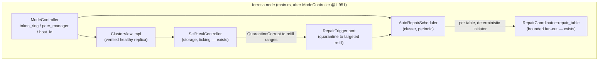

# Design — Automatic anti-entropy repair scheduler

> Last updated: 2026-06-04
> Status: Draft (design-first; grill open questions before implementing)
> Scope: make anti-entropy repair run **autonomously** on a live cluster — no
> operator, no HTTP trigger — and connect it to the self-heal controller so a
> quarantined corrupt SSTable is refilled from a healthy replica.

## Executive summary

The engine already has **memory-bounded repair primitives** (`RepairCoordinator::
repair_table` → Merkle-diff-then-stream sessions, bounded concurrency + byte
budget — PR #83) and a **self-heal controller** that detects corrupt SSTables.
What is missing for "fully automatic repair":

1. There is **no periodic driver**. `repair_table` is invoked from exactly one
   production call site — the `POST /api/cluster/repair` web handler
   (`ferrosa/src/web/api.rs`). Nothing runs it on a schedule.
2. The self-heal controller is spawned with a **`SingleNodeClusterView` stub**
   (`main.rs:722`, before `ModeController` exists at `main.rs:933`), so on a
   real cluster it **never quarantines** — it only escalates-degraded.
3. The controller has **no repair/converge action** and no way to call the
   cluster repair path (it lives in `ferrosa-storage`, below `ferrosa-cluster`).

This design adds a cluster-layer **`AutoRepairScheduler`**: a deterministic,
loud, bounded background task that periodically reconciles replicas, plus the
**`ClusterView` wiring** that lets the self-heal controller quarantine safely and
request a targeted refill.

## Why the scheduler lives in the cluster layer

`AutoRepairScheduler` needs the `TokenRing`, `PeerManager`, and
`RepairCoordinator` — all in `ferrosa-cluster` / the `ModeController`. The
storage-side self-heal controller stays focused on corrupt-SSTable
detection/quarantine and *requests* a refill through a port (the controller
cannot depend on the cluster layer). So:

- **Divergence repair** (replica reconciliation) → `AutoRepairScheduler` (cluster).
- **Corrupt-SSTable quarantine** → self-heal controller (storage), with a
  `ClusterView` for replica-health and a `RepairTrigger` port for refill.

## Architecture

- `AutoRepairScheduler` is constructed in `main.rs` after `ModeController` is
  wired (after L951), reusing the exact executor/ring/local-node-id construction
  the `repair_handler` already does (`StorageEngineRepairStore` local +
  per-peer `RemoteRepairStore`, `LocalRepairExecutor`).
- The self-heal spawn moves to after `ModeController` too (or takes a lazy
  ring/peer handle) so it can be given the **real** `ClusterView` instead of the
  single-node stub.

## Control loop (deterministic)

```mermaid
stateDiagram-v2
    [*] --> Idle
    Idle --> Tick: fixed interval (FERROSA_AUTO_REPAIR_INTERVAL)
    Tick --> Enumerate: list user tables (skip system/local-only)
    Enumerate --> PerRange: for each owned (table, range)
    PerRange --> Skip: not the deterministic initiator
    PerRange --> Skip: manual/auto repair already in-flight
    PerRange --> Run: lowest live host-id among owners
    Run --> Observe: repair_table (bounded); log + metrics
    Observe --> Idle: record last-repaired; cooldown
```

### Determinism (anti-thundering-herd — self-heal FMEA #4)

For each `(table, token-range)`, **only the replica whose host-id sorts first
among the range's *currently-live* owners initiates** repair. Same ring → same
initiator, no election, no RNG. A range is therefore repaired once per cycle by
one node, not RF times. Recomputed from the live ring each tick, so membership
churn self-corrects (idempotent LWW repair makes a transient duplicate harmless).

## Cadence and load shaping

Repair is load-heavy, so the cycle is **spread**, not a thundering full-sweep:
one table (or one merged range) per sub-tick, round-robin, so the whole keyspace
is covered once per `FERROSA_AUTO_REPAIR_INTERVAL`. `RepairCoordinator` already
bounds in-flight sessions (semaphore=4) and per-session memory (byte budget), so
a single initiated table is safe; spreading bounds the *aggregate* across tables.

## Quarantine to refill coupling

When the self-heal controller quarantines a corrupt generation, the rows in that
generation are gone locally. It calls a **`RepairTrigger` port** (implemented by
the scheduler) to schedule a **targeted repair of the affected token ranges**, so
the quarantined data is refilled from a healthy replica promptly — not only at
the next full cycle. The quarantine itself remains gated on a **verified healthy
replica** (FMEA #1): never quarantine unless a reachable peer is confirmed to
hold a non-corrupt copy of the range.

## Config knobs (all deterministic)

| Env | Default (proposed) | Meaning |
|-----|--------------------|---------|
| `FERROSA_AUTO_REPAIR_ENABLED` | **on** (grill) | master switch |
| `FERROSA_AUTO_REPAIR_INTERVAL` | **24h** (grill) | full-coverage period |
| `FERROSA_AUTO_REPAIR_MAX_CONCURRENT_TABLES` | 1 | load shaping (round-robin) |
| `FERROSA_AUTO_REPAIR_SKIP_KEYSPACES` | system\* | don't auto-repair system tables |
| (reuse) `RepairCoordinator.max_concurrent_sessions` | 4 | per-table session bound |

## Safety rails

- Single deterministic initiator per range (no herd); recomputed per tick.
- Skip a `(table, range)` if a manual `POST /repair` or a prior auto-repair is
  still in-flight (a shared in-flight set), + per-table cooldown.
- Only initiate when this node is in cluster mode with a ring **and** >=1 live
  peer for the range (single-node / no-peer = nothing to do, log).
- Loud: WARN on divergence found, INFO on every session start/outcome, metrics
  (`ferrosa_auto_repair_*`: cycles, sessions, partitions streamed, failures,
  time-to-converge), health-surface entry.
- Bounded memory inherited from the repair primitives (PR #83).
- Master switch off = scheduler never spawns its loop (the manual endpoint
  still works).

## Implementation plan (TDD)

1. `AutoRepairScheduler` struct + pure `select_initiated_ranges(ring, host_id,
   rf, tables) -> Vec<(table, range, peers)>` (deterministic initiator) — unit
   test the selection in isolation (no IO), incl. membership-churn idempotence.
2. Tick loop + in-flight/cooldown bookkeeping (logical clock, like the self-heal
   controller) — unit test that one tick initiates exactly the
   lowest-host-id-owned ranges and skips in-flight.
3. Wire into `main.rs` after `ModeController`; reuse `repair_handler`'s executor
   construction (extract a shared `build_repair_executor(mc, storage)` helper so
   the endpoint and scheduler share one code path).
4. Real `ClusterView` impl (cluster) for the self-heal controller:
   `replica_posture(table, range)` = verified healthy peer (digest/read probe)
   = `HealthyReplicaAvailable`; move/relazy the self-heal spawn so it gets it.
5. `RepairTrigger` port: quarantine schedules a targeted range repair.
6. Config, metrics, health surface; integration test on a sim/multi-node where a
   divergent replica converges within one cycle with no operator action.

## Decisions (locked 2026-06-04, owner)

- **Q1 — enable default:** `FERROSA_AUTO_REPAIR_ENABLED` defaults **on** — truly
  self-managing out of the box; deterministic single-initiator + conservative
  cadence keep load safe; operators can disable.
- **Q2 — cadence:** `FERROSA_AUTO_REPAIR_INTERVAL` defaults **24h** full
  coverage, spread round-robin across tables. Comfortably under the 10-day
  gc_grace so tombstones don't resurrect.
- **Q3 — quarantine→refill:** a quarantine triggers an **immediate targeted
  repair** of the affected ranges via the `RepairTrigger` port; the periodic
  cycle is the backstop.
- **Q4 — phase scope:** **scheduler + real `ClusterView` wiring** — both the
  divergence-repair driver and the corrupt-SSTable quarantine go live this
  phase, delivering fully automatic repair end-to-end.

## Related

- Repair primitives: `ferrosa-cluster/src/repair/{coordinator,executor,merkle}.rs`
- Self-heal controller: `specs/proposed/self-healing-controller-{design,fmea}.md`,
  `ferrosa-storage/src/self_heal/`
- Bounded-memory foundation (PR #83): `specs/proposed/p0-bounded-sstable-reader-*`
