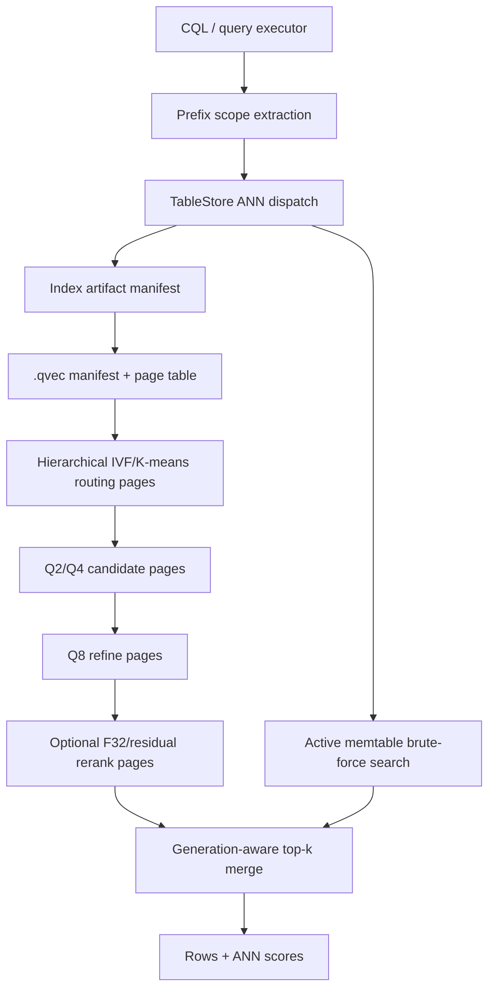

# HVQ / C-SPANN-Inspired Vector Index Implementation Blueprint

> Status: in-process blueprint pending owner answers before Kanban swarm
> Source design: `specs/proposed/hierarchical-vector-quantization.md`
> Last updated: 2026-05-29

## Goal

Build an additive Ferrosa vector index strategy that is faster and more storage-efficient than the current full-vector JSON sidecar path by combining:

- prefix-scoped vector index routing,
- C-SPANN-like hierarchical IVF/K-means partitions,
- binary page-addressable `.qvec` artifacts,
- quantized candidate pruning,
- exact survivor rerank when configured,
- S3-durable artifacts with bounded NVMe/local cache.

The first implementation target is **quantized IVFFlat / hierarchical K-means**, not quantized HNSW.

## Non-goals for the first swarm

- Do not replace existing HNSW/IVFFlat JSON sidecars.
- Do not implement mutable-in-place vector partitions.
- Do not require local disk/NVMe to contain the full index.
- Do not make HNSW the first production path.
- Do not silently fall back to empty ANN results on corrupt/missing quantized artifacts.
- Do not open a PR or push upstream until explicitly approved.

## Architecture

## Stable seams

| Seam | Crate/path | Owns | Notes |
|---|---|---|---|
| Prefix metadata | `ferrosa-schema`, `ferrosa-cql`, storage index metadata | vector index prefix columns and equality-bound scope keys | Needed before multi-tenant speed claims. |
| Row identity | `ferrosa-index::vector`, `ferrosa-storage` | generation/object-aware row refs | `RowPosition { offset }` is insufficient across SSTables. |
| Container | `ferrosa-index/src/vector/quantized/container.rs` | magic/version/manifest/page table/checksum/ranges | No dependency on storage/CQL. |
| Codecs | `ferrosa-index/src/vector/quantized/codec.rs` | Q8/Q4/Q2/Q1 packing and distance estimates | Start scalar; SIMD later. |
| IVF builder/reader | `ferrosa-index/src/vector/quantized/ivf.rs` | tiered list pages, staged pruning, rerank | First algorithm target. |
| Page store | `ferrosa-index` test backend first; storage object backend later | range-read contract and page-read metrics | Tests must prove no whole-sidecar read. |
| Storage dispatch | `ferrosa-storage/src/store.rs`, `flush.rs` | method dispatch, artifact resolution, merge | Keep minimal due to churn. |
| Remote build | `ferrosa-index-builder` | production-size builds and direct S3 artifact publish | Later after format/read path is stable. |
| Bench harness | `ferrosa-index/benches` or focused tests | recall/latency/bytes-read evidence | Required acceptance gate. |

## Implementation DAG

1. **RED baseline benchmark/spec harness**
   - Prove the current JSON sidecar path reads/decodes full sidecars and establish exact-search recall/latency baselines.
   - Output: tests/bench harness with current metrics.

2. **Generation-aware vector row refs**
   - Add a row identity that prevents offset collision across SSTable generations.
   - Output: failing test first for two generations with same offset both surviving ANN merge.

3. **`.qvec` container foundation**
   - Versioned binary manifest, page table, checksums, and file-backed range-read tests.
   - Output: golden encode/decode, corruption, short-read, bounds tests.

4. **Q8/Q4 codecs**
   - Higher-precision scalar codecs with property/error-bound tests.
   - Output: decode bounds and distance estimate tests.

5. **Q2/Q1 codecs behind benchmark gates**
   - Lower-bit codecs and recall characterization; Q1 not default until evidence is green.
   - Output: tests plus benchmark report.

6. **Quantized IVFFlat builder**
   - Build centroids from full vectors; write tiered list pages and optional F32 rerank pages.
   - Output: deterministic small corpus `.qvec` artifact tests.

7. **Quantized IVFFlat reader**
   - Staged centroid/list scan, Q-tier pruning, exact survivor rerank, page-read budget enforcement.
   - Output: top-k, recall, page-budget, and fail-loud tests.

8. **Prefix-scoped routing**
   - Index/query path constrains ANN search to prefix equality scope before vector routing.
   - Output: multi-tenant corpus test where scoped search avoids cross-tenant candidates and reads fewer pages.

9. **Storage integration**
   - Add additive `quantized` method dispatch in flush/search, preserve legacy sidecars.
   - Output: memtable + flushed `.qvec` merge test, restart/read test, no full materialization test.

10. **Object-store + cache integration**
    - Artifact manifest, S3-compatible range read, bounded cache behavior.
    - Output: cache smaller than index still queries; deleting cache rehydrates from object ranges.

11. **Compaction/index-builder production path**
    - Replacement `.qvec` generations, stale-cache prevention, remote builder direct upload.
    - Output: compaction replacement and builder manifest-publish tests.

12. **Final verifier lane**
    - Focused tests, affected crate tests, benchmark evidence, clippy/fmt gate.
    - Output: clean verification summary and implementation readiness call.

## TDD acceptance spec

Every implementation packet must include RED/GREEN evidence. Minimum required tests:

| Test class | Required RED | Required GREEN |
|---|---|---|
| Baseline speed | Current path shows full-sidecar bytes/decode behavior under instrumentation | Baseline metrics captured for comparison. |
| Row ref | Same offset in two generations dedupes incorrectly or cannot be represented | Both row refs survive and merge deterministically. |
| Container | Unknown/corrupt `.qvec` bytes parse as success or lack a type | Parser fails loudly with typed error. |
| Range reads | Reader can only load whole file | Reader asks page store for bounded ranges; test store records ranges. |
| Codecs | Known vector fails to round trip within declared error bound | Q8/Q4/Q2/Q1 decode/error tests pass. |
| IVF builder | No tiered pages emitted for deterministic corpus | Manifest/page table/tier pages match golden expectations. |
| IVF reader | Quantized reader cannot meet top-k/recall/page-budget assertions | Recall and page-budget tests pass. |
| Prefix scope | Query scans/returns cross-tenant candidates | Prefix-bound query only searches scoped partitions/pages. |
| Exact rerank | Survivor ordering differs from exact f32 ordering | Rerank top-k matches exact order over survivor set. |
| Fail loud | Missing page/short read/checksum mismatch returns empty success | Typed error and telemetry hook are exercised. |
| Storage integration | Legacy ANN cannot read `.qvec` or search uses whole blob | Additive method dispatch works; legacy sidecars unchanged. |
| Speedup | New path has no measurable advantage | Bench proves lower bytes read and lower p95/p50 than current sidecar path at target corpus/threshold. |

## Benchmark acceptance gates

Owner decisions can tune exact numbers, but the default swarm gate is:

- recall@10 >= 0.95 vs exact `f32` brute force on clustered synthetic corpus;
- recall@100 >= 0.95 when benchmark corpus supports it;
- bytes read/query at least 5x lower than current full-sidecar read path for a multi-sidecar corpus;
- p95 query latency at least 2x lower than current path on the same local/file-backed range-read benchmark;
- cache-size smoke with cache <= 5% of quantized index bytes still returns correct results;
- no production query path materializes the full quantized sidecar before candidate narrowing.

## Kanban swarm shape after owner answers

Use worktrees so parallel workers do not trample one checkout. Suggested cards:

### Parallel batch A — discovery and foundation

- `hvq-baseline-bench`: benchmark current JSON HNSW/IVFFlat sidecar bytes/latency/recall.
- `hvq-row-ref-red`: add generation-aware row-ref tests and minimal type seam.
- `hvq-container-red`: create `.qvec` container tests and parser/writer skeleton.

### Parallel batch B — codecs and container implementation

Depends on batch A where relevant.

- `hvq-container-green`: implement binary manifest/page-table/range-read checks.
- `hvq-codec-q8-q4`: Q8/Q4 scalar codecs and distance tests.
- `hvq-codec-q2-q1`: Q2/Q1 codecs behind benchmark flags.

### Batch C — algorithm implementation

- `hvq-ivf-builder`: tiered quantized IVFFlat builder.
- `hvq-ivf-reader`: staged reader, page budgets, exact rerank.
- `hvq-prefix-scope`: prefix metadata and scoped query seam.

### Batch D — storage integration

- `hvq-storage-dispatch`: additive method dispatch and legacy preservation.
- `hvq-object-cache`: object-range page store + bounded cache semantics.
- `hvq-compaction-builder`: compaction replacement and remote builder direct-upload shape.

### Batch E — final verification

- `hvq-final-verifier`: serialize broad Rust verification, benchmark evidence, and review. Implementation workers should run focused tests only; this card owns broad-suite contention.

## Owner decisions locked 2026-05-29

- First implementation target: quantized IVFFlat / hierarchical K-means; HNSW remains later/prototype.
- Driving workload: ferrosa-memory/entity embeddings if readily available plus synthetic clustered corpus; synthetic fallback is acceptable.
- Speedup gate: default gates stand — >=5x fewer bytes read/query, >=2x lower p95 query latency, recall@10 >= 0.95.
- Recall gate: recall@10 >= 0.95 against exact `f32` brute force before default enablement.
- Prefix scope: tenant_id + session_id for v1 proof unless implementation reconnaissance finds the current schema uses different equivalent names.
- Exact rerank: enabled by default for correctness-sensitive results.
- Q1/RaBitQ: experimental until benchmark evidence is green; Q2/Q4/Q8 first.
- Storage integration depth: go all the way through object-range cache, compaction, and remote builder in this swarm.
- Object layout: one `.qvec` object per SSTable/index/build generation for v1, with per-tier object-key fields retained for later multi-object layout.
- Local vs S3: production code requires S3-compatible durability; `local_test_only` is limited to tests/prototypes.
- Worktree policy: one worktree per packet/card under `~/src/ferrosa-suite/worktrees/hvq-<packet>` with focused branches.
- Profile assignment: architect for decision/spec lock, backend-eng for implementation, research_assistant for benchmark/corpus/recon, reviewer for reviews, reviewer-claude for final independent review if useful.
- Commit policy: small focused commits in worktrees; no push until user approves.
- Full-suite policy: implementation workers run focused RED/GREEN; final verifier owns broad Cargo/CI gates.
- Output expectation: produce an integrated branch ready for human testing/review, passing local CI and ready to push; do not open a PR unless explicitly approved.
