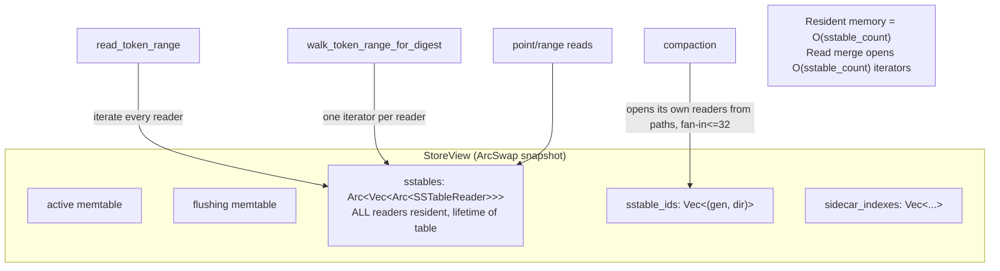
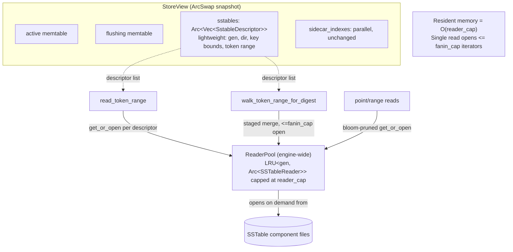

# Design — Bounded SSTable reader memory (LRU pool + bounded read fan-in)

> Last updated: 2026-06-03
> Status: Draft
> Scope: single in-crate refactor of `ferrosa-storage`. Not an engine-wide redesign.
> Root-cause spec: [`specs/todo/p0-unbounded-sstable-reader-memory-oom.md`](../todo/p0-unbounded-sstable-reader-memory-oom.md)

## Executive summary

The storage engine holds one fully-resident `SSTableReader` per SSTable for a
table's entire lifetime, and the read-merge paths open one iterator per SSTable at
once. Both make memory scale with **SSTable count**, which is unbounded — on a node
bloated by the (since-fixed) compaction merge bug this OOM-kills the node under its
2 GiB cgroup during startup/compaction/repair. This design bounds resident reader
memory to `O(reader_cap)` via a generation-keyed LRU open-reader pool, and bounds a
single read to `O(fanin_cap)` open readers via a staged (multi-pass) merge. Behaviour
(read results, dedup/LWW semantics) is unchanged; only peak memory is bounded.

## Current architecture



## Target architecture



## On-demand open + eviction (sequence)

```mermaid
sequenceDiagram
    participant Rd as Read path
    participant V as StoreView (descriptors)
    participant P as ReaderPool (LRU)
    participant FS as Component files
    Rd->>V: load() snapshot of descriptors in [start,end)
    loop each descriptor in current merge pass (<= fanin_cap)
        Rd->>P: get_or_open(gen, dir)
        alt cached
            P-->>Rd: Arc<SSTableReader> (move to MRU)
        else miss
            P->>FS: open components (data/partitions/rows/filter/...)
            FS-->>P: reader
            P->>P: insert; if len > reader_cap evict LRU (idle, refcount==1)
            P-->>Rd: Arc<SSTableReader>
        end
    end
    Rd->>Rd: k-way merge this pass; emit/merge partials; drop readers (Arc released)
```

## Components

### `SstableDescriptor`

- **Purpose**: lightweight, always-resident identity + pruning metadata for one SSTable.
- **Fields**: `gen: String`, `dir: PathBuf`, `min_key/max_key: Vec<u8>` (or `DecoratedKey`
  bounds), `min_token/max_token: i64`. Cheap to clone; no file handles, no bloom, no index.
- **Source**: captured at flush/compaction-swap time (the writer already knows bounds) and
  on startup load. Replaces the reader as the `StoreView` source of truth, parallel to
  `sstable_ids`/`sidecar_indexes` (preserve the existing length-invariant check).

### `ReaderPool`

- **Purpose**: bound the number of simultaneously-resident `SSTableReader`s engine-wide.
- **Location**: new module `ferrosa-storage/src/reader_pool.rs`; one instance per
  `StorageEngine`, shared by all `TableStore`s (Arc).
- **Shape**: `Mutex<lru::LruCache<ReaderKey, Arc<SSTableReader<FileReadAt>>>>` where
  `ReaderKey = (table_id, gen)`. `get_or_open(desc) -> Result<Arc<SSTableReader>>`.
- **Eviction**: on insert past `reader_cap`, evict least-recently-used entries whose
  `Arc::strong_count == 1` (not in active use). If all are in use, the cap is *softened*
  for the duration of that operation — correctness over a hard cap — but this only happens
  when an operation legitimately needs >cap readers, which the staged merge (below)
  prevents for reads. Log when the soft-cap is exceeded (observability, fail-loud).
- **Config**: `FERROSA_SSTABLE_READER_CACHE_CAP` (default proposed: 256).

### Bounded read-merge (staged)

- **Purpose**: a single token-range read / Merkle build must hold `<= fanin_cap` readers.
- **Where**: `read_token_range`, `read_token_range_bounded`, `walk_token_range_for_digest`.
- **How**: if the descriptors overlapping `[start,end)` number `<= fanin_cap`, do the
  existing single-pass k-way merge. If more, merge in **tiers**: merge groups of
  `fanin_cap` sources into sorted intermediate streams, then merge the intermediate
  streams — at any instant `<= fanin_cap` readers are open. Memtable + flushing are always
  included as two of the sources. Dedup/LWW (`merge_partitions` + `apply_deletions`) is
  applied identically; staging changes only *when* sources are opened, not the merge math.
- **Config**: `FERROSA_READ_MERGE_FANIN` (default proposed: 32, aligning with
  compaction `max_threshold`).

## Migration sites (~30 `guard.sstables` accesses in `store.rs`)

Categorize and migrate:

1. **Read merges** (`read_token_range` ~691, range reads ~790/890, point ~1570/1640/1726,
   `read_token_range_bounded` ~2306, `walk_token_range_for_digest` ~1998): iterate
   *descriptors*, open via pool, apply staged fan-in.
2. **Count/length** (`sstable_count` ~2901, `n_sst` ~160/3064, invariant check): read from
   the descriptor vec length — no reader open needed.
3. **Swap/clone paths** (flush ~1495, compaction swap ~2602/2696/2990, snapshot ~1131):
   operate on descriptors; readers are not carried across swaps (pool is keyed by gen and
   survives swaps; evict stale gens on swap).
4. **Single-reader fast paths** (`view.sstables[0]` ~4217/4498 in tests/compat): open the
   one descriptor via pool.

Preserve `check_invariants`: keep `sstables`(descriptors)/`sstable_ids`/`sidecar_indexes`
length-equal; the invariant becomes descriptor-based.

## Invariants & non-goals

- **Behavioural equivalence**: read results, dedup, LWW, deletion application unchanged.
- **Compaction** is already bounded (fan-in 32 / 512 MiB); untouched except it should
  drop evictable readers from the pool for gens it removes.
- **Sidecar indexes / vector indexes**: keep their current residency model for now
  (separate follow-up if they prove to be a second O(count) source); this design bounds the
  primary `SSTableReader` population, which is the documented OOM driver.

## TDD plan (small steps, red → green)

1. `ReaderPool` unit tests: open-on-miss, LRU eviction past cap, no-evict-while-in-use,
   concurrent `get_or_open`.
2. `resident_reader_count()` accessor; test: load N ≫ cap SSTables → resident ≤ cap (red today).
3. Staged-merge: peak-open-readers ≤ `fanin_cap` for N ≫ cap (instrument the pool with a
   high-water gauge); **equivalence** test: staged result == single-pass result for the
   same window (golden).
4. Migration: after each batch of sites, run full `ferrosa-storage` lib suite (779) green.
5. End-to-end: rebuild image, deploy, run repair on the bloated node — no OOM
   (`OOMKilled=false`, restart count stable) and counts converge.

## Open questions (feed FMEA)

- [ ] `reader_cap` / `fanin_cap` default values vs the 2 GiB node budget — tune with FMEA.
- [ ] Eviction when all cached readers are in use (soft-cap) — acceptable, or hard-fail?
- [ ] Pool scope: engine-wide (one budget) vs per-table (simpler, weaker global bound)?
- [ ] Does any path hold an `Arc<SSTableReader>` across an `await` long enough to pin the
      pool above cap? (repair streams; verify the staged merge releases per pass.)
- [ ] Startup smoke-test currently opens every SSTable to validate — does it also need the
      pool / staging to avoid OOM before the pool is even consulted?

## Related specs

- Root cause: [`p0-unbounded-sstable-reader-memory-oom.md`](../todo/p0-unbounded-sstable-reader-memory-oom.md)
- Held hardening branches: `fix/sstable-bounded-length-allocation`, `fix/repair-memory-and-correctness`
