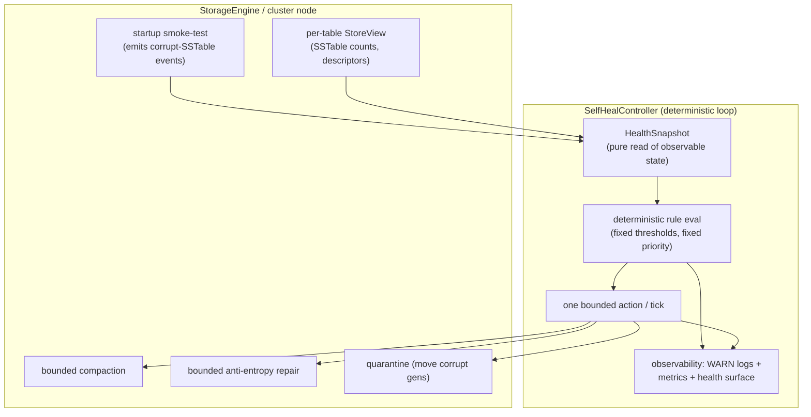
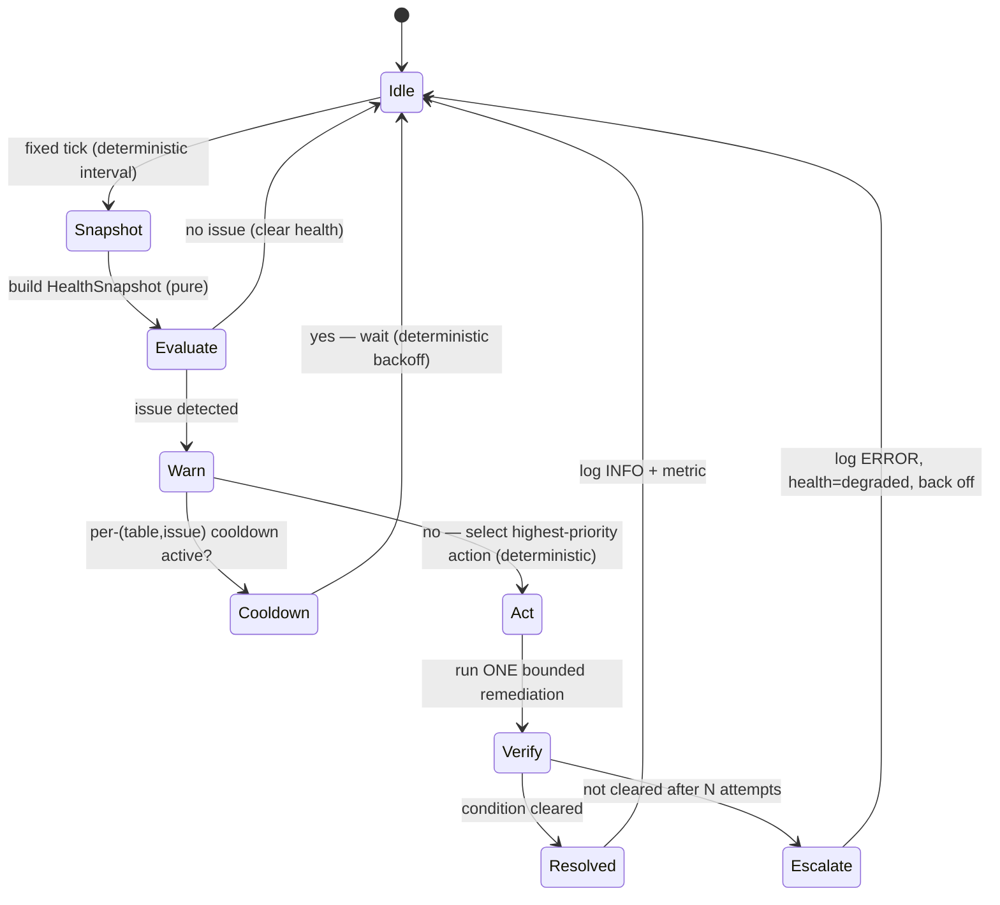

# Design — Self-healing controller (deterministic autonomous DB repair)

> Last updated: 2026-06-03
> Status: Draft
> Scope: a new `ferrosa-storage`/`ferrosa-cluster` subsystem that detects, warns about,
> and repairs degraded database state automatically — no operator, no LLM.

## Executive summary

Ferrosa should manage its own integrity. When a node accumulates corrupt SSTables,
SSTable bloat, or replica divergence, the engine must **detect it, log a loud warning,
and repair it automatically** — bounded in memory so the repair can never make things
worse, and **deterministic** so the same observable state always yields the same action.
The bounded-memory work already landed (reader pool, bounded startup, streaming merge,
bounded compaction) is the safety foundation that makes autonomous repair possible: a
self-healing loop is only safe if every remediation primitive is memory-bounded. One
engine bound remains and is a hard prerequisite — **bounded repair fan-in under full
token overlap** (see Prerequisite).

## Principles (non-negotiable)

1. **Deterministic.** Detection, action selection, and scheduling are pure functions of
   observable state + fixed config. No RNG, no wall-clock-derived randomness, no
   LLM. The same `HealthSnapshot` always produces the same `RemediationDecision`.
   Cluster coordination uses deterministic host-id/token ordering, not random election.
   Replayable: feed a snapshot, get the same decision in a unit test.
2. **Loud.** Every detected data issue emits a `WARN` (or `ERROR`) log + a metric + a
   health-surface entry **before and regardless of** any auto-repair. Self-healing is
   never silent. Every action and outcome is logged. (Aligns with the fail-loud rule.)
3. **Bounded.** Every remediation primitive is memory-bounded (engine prereqs). The
   controller itself runs single-threaded, one action at a time.
4. **Effective + verified.** Each action re-checks its condition afterward. Unresolved
   after a deterministic number of attempts → escalate (louder log, health = degraded).
5. **Never-worse.** Files are quarantined (moved), never deleted. Repair is per-cell LWW.
   Cluster-aware so it can't drive quorum loss.

## Component model

## Control loop (state machine)

## Detectors (each → loud WARN + metric + health entry)

| Detector | Condition (deterministic threshold) | Signal |
|----------|------|--------|
| Corrupt SSTables | startup/runtime smoke-test excluded ≥ 1 gen for a table | `WARN` "table X: N corrupt SSTables excluded"; `ferrosa_selfheal_corrupt_sstables{table}` |
| SSTable bloat | `sstable_count(table) > bloat_threshold` (config) | `WARN` "table X bloated: N SSTables"; gauge |
| Replica divergence | scheduled Merkle compare (deterministic schedule) shows diverging leaf ranges | `WARN` "table X diverges from peer P on M ranges"; gauge |
| Repeated OOM/restart | restart count / OOMKilled history exceeds threshold | `WARN`; throttles remediation aggressiveness |

## Remediation actions (fixed priority order; bounded; verified)

1. **Quarantine corrupt SSTables** (highest priority) — move excluded corrupt generations
   to a quarantine dir (logged, files preserved), then schedule a repair to refill the
   lost rows from healthy replicas. *Fully automatic* (per owner decision) with loud logs.
2. **Drain bloat** — trigger bounded compaction; verify `sstable_count` drops. (Bounded
   compaction + pool-routed inputs already landed.)
3. **Converge divergence** — bounded anti-entropy repair on the divergent ranges; verify
   the Merkle diff shrinks.

Action selection is a deterministic priority fold over the snapshot. **One action per
tick**, serialized — no concurrent remediation, so behavior is reproducible.

## Determinism guarantees (the explicit contract)

- `decide(snapshot, config) -> Option<Action>` is a **pure function** — unit-testable by
  feeding a snapshot and asserting the action. No I/O, clock, or RNG inside `decide`.
- Thresholds, intervals, cooldowns, max-attempts are **fixed config** (env/defaults).
- **Cluster coordination is deterministic:** for a given (table, token-range), only the
  replica whose host-id sorts first among the range's owners initiates repair — so
  replicas don't all repair at once (quorum-safe) **without** random election. Same ring →
  same initiator.
- Backoff is a **fixed escalating schedule** keyed by attempt count, not random jitter.
- Replayable: a recorded sequence of snapshots reproduces the exact action sequence.

## Observability ("logs warnings if data has issues")

- Every detected issue → `WARN` (corrupt/divergence) or escalating `ERROR` (unresolved),
  **independent of** whether auto-repair runs. Never silent.
- Every action start/outcome → `INFO` with table/range/why.
- Metrics: per-issue gauges, action counters, attempt/escalation counters, time-to-heal.
- Health surface: a `self_heal` status (issues, in-flight action, last outcome, degraded
  flag) on the existing web/metrics endpoint.

## Safety rails

- Single-threaded loop, one action at a time, per-(table,issue) cooldown.
- Cluster-aware deterministic initiator → no simultaneous all-replica repair.
- Quarantine moves files (never deletes); repair is LWW; all primitives memory-bounded.
- Escalate-and-stop after N deterministic attempts (don't thrash); surface degraded.
- Master switch `FERROSA_SELFHEAL_ENABLED` (default on; can disable for ops).

## Prerequisite (engine fix, in scope per owner decision)

**Bounded repair fan-in under full token overlap.** The repair Merkle/digest build opens
one reader per overlapping SSTable; for tables whose SSTables span the whole ring
(`entity_store`, `typed_edges`), a bloated node opens O(SSTable-count) readers (the node1
~258-reader OOM). Autonomous repair cannot assume an operator drained the node first, so
the digest/repair path must bound concurrently-open readers to `FERROSA_READ_MERGE_FANIN`
even under full overlap — via **windowed multi-pass streaming** (process the range in
passes of ≤ fanin readers, combining per-partition digests across passes; for the
order-independent Merkle XOR this composes cleanly) or external spill. Must stay streaming
(no tier re-materialization — see FMEA #13). This is the last bound the controller depends
on.

## Config knobs (all deterministic)

`FERROSA_SELFHEAL_ENABLED`, `_TICK_SECS`, `_BLOAT_SSTABLE_THRESHOLD`,
`_DIVERGENCE_SCAN_SECS`, `_MAX_ATTEMPTS`, `_COOLDOWN_SECS`, plus existing
`FERROSA_READ_MERGE_FANIN`, `FERROSA_MAX_CONCURRENT_COMPACTIONS`,
`FERROSA_SSTABLE_READER_CACHE_CAP`.

## Open questions (feed FMEA)

- [ ] Quarantine destination + retention; does refill-from-replicas assume RF>1 (single-node?).
- [ ] Divergence scan cost/cadence vs steady-state load.
- [ ] Interaction with manual `ferrosa-ctl repair` (don't double-run).
- [ ] Deterministic initiator under membership change (ring churn mid-heal).
- [ ] What "effective" means when no healthy replica exists (corrupt on all replicas) —
      escalate to degraded, don't loop.

## Related

- Bounded-memory foundation: [`p0-bounded-sstable-reader-design.md`](./p0-bounded-sstable-reader-design.md), [`p0-bounded-sstable-reader-fmea.md`](./p0-bounded-sstable-reader-fmea.md)
- Existing repair: `ferrosa-cluster/src/repair/`, `ferrosa-ctl repair`
