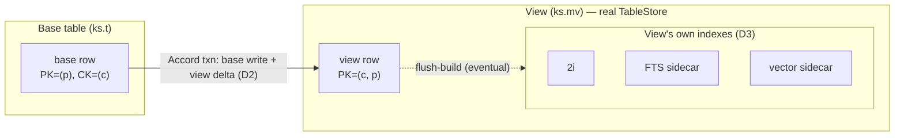
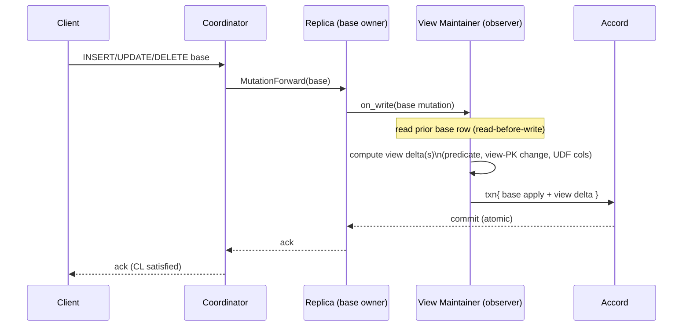
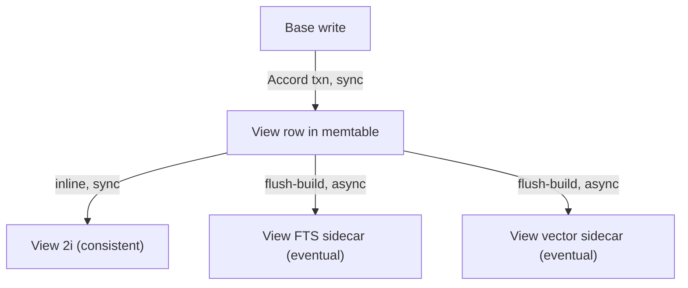

# Materialized Views — Architecture

> Spec root: `specs/materialized-views/`. Decisions:
> [decisions.md](decisions.md). Coupling/DSM: [dsm-coupling.md](dsm-coupling.md).

## 1. Goals and non-goals

**Goals**

- Cassandra-compatible `CREATE / ALTER / DROP MATERIALIZED VIEW` DDL and semantics
  — a view is an automatically-maintained, denormalized projection of a base
  table with a different primary key.
- All Cassandra MV operations: create, drop, alter (view options), read (a view
  is queried exactly like a table), and automatic maintenance on every base
  INSERT/UPDATE/DELETE/TTL-expiry.
- A consistency guarantee **stronger** than Cassandra: base and view never
  diverge (Accord strict-serializable maintenance — [D2](decisions.md)).
- Ferrosa supersets: indexes on views (2i/FTS/vector — [D3](decisions.md)),
  richer WHERE predicates and UDF-computed columns ([D4](decisions.md)).
- Forward-compatible with a future Postgres snapshot/`REFRESH` view engine via a
  `view_kind` discriminator ([D1](decisions.md)) — without building it now.

**Non-goals (this work item)**

- Postgres snapshot/`REFRESH MATERIALIZED VIEW` engine (reserved, deferred epic).
- Views over views (chained MVs) — Cassandra forbids; we forbid initially.
- Multi-base / join views — out of scope (that is the Postgres-snapshot domain).
- Changing the existing index-build backends; we *reuse* them on the view store.

## 2. Current state (ground truth)

| Concern | State today | Evidence |
|---------|-------------|----------|
| DDL parse | `CREATE/ALTER/DROP MATERIALIZED VIEW` rejected "not yet supported" | `ferrosa-cql/src/parser.rs:714`, `:1317`, `:1508`; test `:4436` |
| AST | No MV statement variants | `ferrosa-cql/src/ast.rs` |
| Schema metadata | No `ViewMetadata`; `SchemaSnapshot` has no `views` field | `ferrosa-schema/src/registry.rs:38` |
| `system_schema.views` | Registered; returns 0 rows; 10-col C* 5.0 shape | `schema_tables.rs:241`; `router.rs:2554` |
| Maintenance hook | `WriteObserver` Sync/Async; derived mutations supported | `ferrosa-storage/src/observer.rs`; `engine.rs:4709`, `:5139` |
| Inline 2i | Updated before memtable put | `ferrosa-storage/src/store.rs:1208` |
| FTS / vector | Flush-built sidecars (eventually consistent) | `store.rs:2237`, `:2274` |
| Write fan-out | Coordinator forwards base mutations only | `ferrosa-cluster/src/coordinator/write.rs:363` |
| Accord | Strict-serializable txns available | `ferrosa-cluster` (Accord) |

There is **no** partial MV implementation to extend — this is greenfield on top
of existing maintenance and index seams.

## 3. Conceptual model

A materialized view is a **real table** (`TableStore`) whose rows are a
deterministic function of the base table's rows, re-partitioned under a new
primary key. It is not a query rewrite and not a virtual table — it has its own
SSTables, memtable, commit log entries, and (optionally) its own secondary,
full-text, and vector indexes.



**Two consistency tiers (must be documented for operators):**

1. **View rows ⟺ base rows: strictly consistent** (Accord, D2). A successful base
   write means the view row is present/absent correctly, atomically.
2. **View's FTS/vector sidecars: eventually consistent** (flush-build, D3) — the
   view *row* is immediately correct; a vector/FTS index *over* the view lags
   until the view's memtable flushes, exactly as for any base-table FTS/vector
   index today.

## 4. DDL and validation

### 4.1 Grammar

```text
CREATE MATERIALIZED VIEW [IF NOT EXISTS] ks.mv AS
  SELECT <col_list | *>
  FROM ks.base
  WHERE <is-not-null-conjunction> [ AND <ferrosa-predicate> ]   -- D4 extension
  PRIMARY KEY ( <partition_key>, <clustering_cols...> )
  [ WITH <view_options> ]

ALTER MATERIALIZED VIEW ks.mv WITH <view_options>
DROP  MATERIALIZED VIEW [IF EXISTS] ks.mv
```

UDF-computed columns (D4) appear in the `SELECT` list as
`udf_name(col, ...) AS derived_col`.

### 4.2 Validation rules (Cassandra baseline — enforced)

These are hard-validated at DDL time; violations reject the statement:

1. The view PK **must include every base PK column** (so each base row maps to at
   most one view row — no orphans, no fan-out).
2. The view PK **may add at most one** column that is not part of the base PK.
3. Every view-PK column requires `IS NOT NULL` (a row missing any view-PK column
   is not projected).
4. Selected columns must be base columns or D4-permitted expressions; **no
   aggregates, no static columns, no counters** (Cassandra restriction retained —
   they break incremental maintenance).
5. Base table must not itself be a view (no chained MVs, initial release).

### 4.3 Validation rules (ferrosa extensions — D4)

6. A `WHERE` may carry a ferrosa predicate beyond the `IS NOT NULL` conjunction;
   it is compiled to the same predicate representation the Filtered index uses
   (`ferrosa_index::evaluate_predicate_row`).
7. A `SELECT` may include UDF-computed columns. **The UDF must be deterministic**
   — the DDL path rejects any UDF not marked/proven deterministic (Gate G2). A
   computed column may not be part of the view PK (its value must be reproducible
   from the row, but PK membership would couple partitioning to UDF identity —
   out of scope initially).

## 5. Metadata and schema replication

Add `ViewMetadata` and a `views` map to the schema, replicated through the same
Raft DDL path (`DdlPath`) that carries tables/indexes today.

```rust
// ferrosa-schema/src/registry.rs — new
pub enum ViewKind {            // D1 — present in the FIRST replicated rev
    Incremental,               // implemented now
    // Snapshot,               // reserved; Postgres REFRESH engine (deferred)
}

pub struct ViewMetadata {
    pub keyspace: String,
    pub name: String,
    pub kind: ViewKind,                 // D1
    pub base_table: (String, String),
    pub base_table_id: Uuid,
    pub id: Uuid,
    pub selected: Vec<ViewColumn>,      // base cols + D4 UDF-computed cols
    pub primary_key: ViewPrimaryKey,    // partition + clustering, all base-derived
    pub where_predicate: Option<CompiledPredicate>, // D4 (IS NOT NULL + extras)
    pub include_all_columns: bool,
    pub options: ViewOptions,           // TTL, compaction, caching, etc.
}
```

`SchemaSnapshot` (`registry.rs:38`) gains
`views: HashMap<(String, String), ViewMetadata>`. The view's backing `TableStore`
is created from `ViewMetadata` exactly as a table is created from
`TableMetadata`. `view_kind` is mandatory in the serialized form from day one so
adding `Snapshot` later is non-breaking (D1 acceptance gate G1).

## 6. Maintenance engine

### 6.1 Where it runs

View deltas are computed **at the replica that applies the base write**, not at
the coordinator (the coordinator only forwards base mutations — `write.rs:363`).
The seam is the existing `WriteObserver` (`observer.rs`), but the *commit* is
escalated to an Accord transaction (D2) rather than the observer's plain derived
mutation, so base and view are atomic.



### 6.2 Fast path (mandatory, Gate G3)

If the base table has **no** views, `on_write` is a no-op and **no Accord
transaction is created** — the write keeps the existing plain memtable/commit-log
path with zero added latency. Accord cost is paid only by base tables that
actually feed a view.

### 6.3 Delta computation (state machine)

For a base mutation, the maintainer computes view mutations from the *prior* and
*next* base row state. Let `P(row)` = view `WHERE` predicate holds (D4; for the
Cassandra baseline `P` is just "all view-PK columns non-null").

| Base op | Prior in view? | Next in view? | View action |
|---------|----------------|---------------|-------------|
| INSERT | n/a | `P(next)` true | insert view row |
| INSERT | n/a | `P(next)` false | none |
| UPDATE (non-view-PK col) | yes | yes | update view row columns |
| UPDATE (view-PK col changes) | yes | yes | **delete old view row, insert new** |
| UPDATE (predicate flip in) | no | yes | insert view row |
| UPDATE (predicate flip out) | yes | no | delete view row |
| DELETE | yes | n/a | delete view row |
| TTL/tombstone expiry | yes | n/a | delete view row (timestamp-correct) |

The "view-PK col changes" and "predicate flip" rows are why **read-before-write**
is required: without the prior base row, the maintainer cannot know which old
view row to delete. That read joins the Accord transaction so the
delete-old/insert-new pair is atomic with the base apply.

### 6.4 UDF-computed columns (D4 under D2)

When a selected column is `udf(col,...) AS x`, the maintainer evaluates the UDF
inside the transaction over the next base row. Because the transaction is
strict-serializable, the UDF **must be deterministic** (Gate G2). The DDL path
already rejected nondeterministic UDFs at create time; the runtime additionally
runs view UDFs in a determinism-restricted Wasmtime configuration (no clock, no
RNG host calls, no external I/O) as defense in depth.

### 6.5 Timestamps, tombstones, TTL

View cell timestamps derive from the base mutation timestamp (Cassandra
semantics) so that concurrent base writes resolve to the same winner in base and
view. A view row's liveness is a function of the base row's liveness; base
tombstones and TTL expiry produce corresponding view-row deletes at the same
timestamp. Repair of base rows must propagate to view rows — under Accord this is
a stronger story than Cassandra (which leaves views unrepaired); scoped as a
follow-up once base maintenance lands (see [decisions.md](decisions.md) open
questions).

## 7. Indexing a view (D3)

A view's `TableStore` is indexable with no new machinery:

- **Native 2i** (`CREATE INDEX ... ON ks.mv (col)`): maintained inline on the
  view store exactly as on a base table (`store.rs:1208`).
- **FTS / Vector** (`CREATE CUSTOM INDEX ...`): flush-built sidecars on the view
  store (`store.rs:2237` / `:2274`).

The only new property is **two-stage asynchrony**: base write → (Accord, sync)
view row → (flush, async) view's FTS/vector sidecar. The view row is strictly
consistent; its FTS/vector index inherits flush-build lag. This is the single
most important operator-facing nuance and must be in the user docs (Gate G5).



## 8. Read path

Reading a view is reading a table — no special read code. `SELECT ... FROM ks.mv`
resolves the view's `TableStore`, uses the view's PK for partitioning/routing,
and may use the view's own 2i/FTS/vector indexes. This is the payoff of modeling
a view as a real table: the entire existing read path, pagination, and index
resolution apply unchanged.

## 9. `system_schema.views` and the driver bug

Real MVs finally give `system_schema.views` rows to serve. This work item must:

1. Populate `system_schema.views` from the new `views` map in `SchemaSnapshot`
   (today it hard-returns `&[]` at `router.rs:2597`).
2. Resolve the **open** scylla-rust-driver shape bug
   (`specs/todo/bug-system-schema-views-column-shape-breaks-scylla-driver.md`):
   the 10-column C* 5.0 shape breaks the stale fork. Decision deferred to the
   work item, but the architecture constrains it — the served shape must match a
   shape mainstream rust/python/java drivers type-check against, with any
   ferrosa-only columns surfaced under a separate `ferrosa_system_schema` table
   if needed. **This must be verified against the actual driver fork, not
   assumed** — the bug report's premise (that a registry already populates the
   table) was false; do not repeat that mistake.

## 10. Consistency summary

| Property | Guarantee | Mechanism |
|----------|-----------|-----------|
| Base row ⟺ view row | Strict-serializable, no divergence | Accord txn (D2) |
| Base table, no views | Unchanged, zero MV cost | Fast path (G3) |
| View 2i | Consistent with view row | Inline 2i on view store |
| View FTS / vector | Eventually consistent | Flush-build sidecars (D3) |
| Concurrent base writes | Same winner in base + view | Base-derived timestamps |
| View UDF columns | Reproducible | Determinism contract (G2) |

## 11. Build order (phasing)

1. **P1 — Metadata + DDL parse/validate.** AST variants, parser, `ViewMetadata`
   (+`view_kind`), `SchemaSnapshot.views`, Raft DDL replication, validation
   rules (4.2 + 4.3). View `TableStore` created on CREATE; dropped on DROP. No
   maintenance yet. `system_schema.views` populated (§9).
2. **P2 — Local maintenance (single-node/pair) via Accord.** Delta state machine
   (6.3), read-before-write, UDF columns (6.4), fast path (6.2). Strict
   correctness tests on one node.
3. **P3 — Cluster maintenance.** Replica-local computation across the ring,
   Accord across replica sets, failure/retry, hints interaction.
4. **P4 — Indexing on views (D3).** 2i/FTS/vector on the view store; two-stage
   async tests.
5. **P5 — Driver-shape resolution + repair propagation.** Finalize
   `system_schema.views` shape against the real driver fork; scope view-row
   repair under Accord.

## 12. Acceptance gates

| Gate | Statement | Tied to |
|------|-----------|---------|
| **G1** | `ViewMetadata.view_kind` is present in the first schema-replicated rev; adding `Snapshot` later requires no schema migration. | D1 |
| **G2** | A nondeterministic UDF in a view definition is rejected at DDL time; view UDFs run in a determinism-restricted Wasmtime config at runtime. | D2+D4 |
| **G3** | A base write to a table with no views creates no Accord transaction and shows no measurable added latency vs. pre-MV baseline. | D2 |
| **G4** | A view-PK column change emits exactly one old-view-row delete + one new-view-row insert, atomic with the base apply (no transient orphan visible at any serial point). | D2 |
| **G5** | Docs state the two-tier consistency model: view rows strict, view FTS/vector sidecars eventual. | D3 |
| **G6** | Predicate-flip UPDATEs (D4 WHERE) correctly insert/delete the view row. | D4 |
| **G7** | `system_schema.views` served shape is verified to load in the actual scylla-rust-driver fork in CI (the existing P2 bug repro passes). | §9 |

## 13. Risks (seed for FMEA)

- **Accord on the write path** widens the blast radius of an Accord regression to
  every viewed base table. → fast path (G3) contains it to viewed tables only.
- **Nondeterministic UDF** silently corrupts the view under concurrent writes. →
  G2 (reject at DDL + restricted runtime).
- **Read-before-write cost** on hot base tables with views. → measure; consider
  caching the prior row already resident in memtable.
- **Two-stage async** misread as "view is stale" when only its FTS/vector lags. →
  G5 docs + metrics distinguishing view-row vs view-index freshness.
- **Driver shape regression** — repeating the false premise of the original bug.
  → G7 verifies against the real fork, not an assumption.
