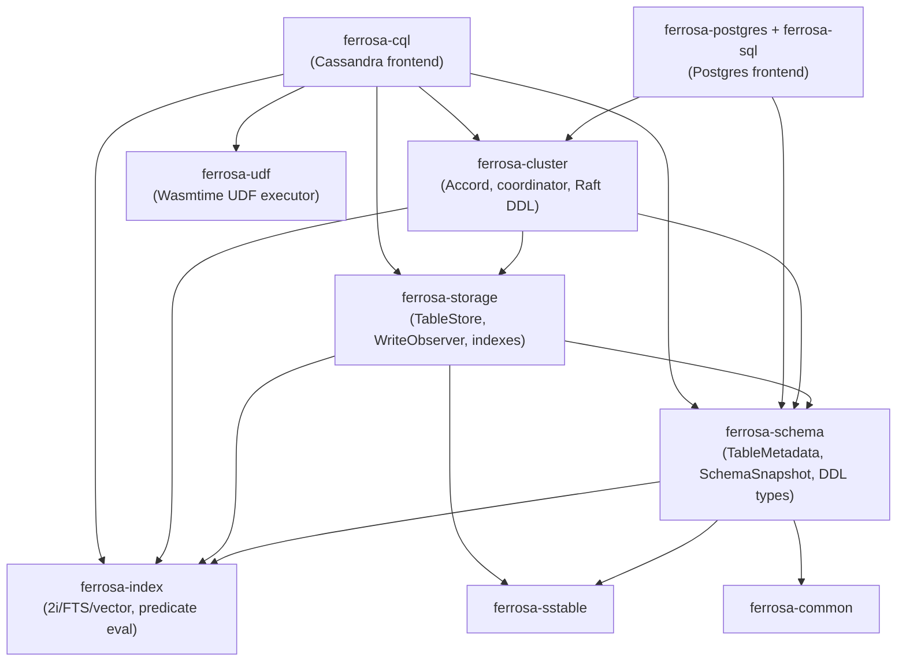
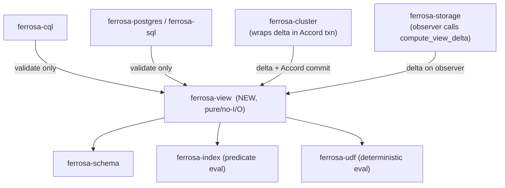

# Materialized Views — DSM & Coupling Analysis

> Companion to [architecture.md](architecture.md) and [decisions.md](decisions.md).
> Motivated by: "materialized views will be needed in the upcoming
> feature/postgres-frontend branch, so we should do the DSM on this so that we
> don't end up with unnecessary coupling while building it."

## 1. Current crate layering (ground truth)

Edges read top-to-bottom (a crate depends on those below it). Verified from
`Cargo.toml` path-dependencies on `feature/materialized-views` (off `main`).



Key facts that drive the design:

- **Accord lives in `ferrosa-cluster`**, the highest non-frontend layer.
- **`ferrosa-storage` does not depend on `ferrosa-cluster`** — storage is *below*
  Accord. So storage's `WriteObserver` cannot itself open an Accord transaction;
  the Accord-coordinated commit must be driven from `ferrosa-cluster`.
- **Two frontends already exist**: `ferrosa-cql` (Cassandra) and
  `ferrosa-postgres` + `ferrosa-sql` (Postgres). Both depend downward on
  `ferrosa-cluster`/`ferrosa-schema`; neither depends on the other (correct — and
  must stay that way).
- **`ferrosa-udf` is a low crate** (no dependency on cluster/storage), so it can
  be consumed by lower layers without a cycle.

## 2. Where MV logic wants to live (the span problem)

The feature is inherently cross-layer:

| Concern | Natural layer |
|---------|--------------|
| `ViewMetadata`, `ViewKind`, schema replication | `ferrosa-schema` |
| DDL validation rules (§4 architecture) | shared by both frontends |
| Delta computation (prior/next row → view mutations) | pure logic, needs schema + predicate eval (`index`) + UDF eval (`udf`) |
| View `TableStore` lifecycle + maintenance observer | `ferrosa-storage` |
| Accord-coordinated base+view commit, read-before-write | `ferrosa-cluster` |
| DDL parse/translate (CQL) | `ferrosa-cql` |
| DDL parse/translate (Postgres) | `ferrosa-postgres`/`ferrosa-sql` |

**The coupling hazard:** the path of least resistance is to write the validation
and delta logic *inside `ferrosa-cql`* (because that is where CREATE MATERIALIZED
VIEW first parses). If that happens, the Postgres frontend can only reuse it by
depending on `ferrosa-cql` — a frontend-to-frontend edge — which is exactly the
"unnecessary coupling" to avoid. It would also drag the CQL protocol crate onto
the Postgres write path.

## 3. Recommendation — extract a pure `ferrosa-view` core crate

Introduce **`ferrosa-view`** holding the protocol-agnostic, **I/O-free** core:

```text
ferrosa-view
├── metadata:  ViewMetadata, ViewKind, ViewColumn, ViewPrimaryKey   (or re-export from schema)
├── validate:  validate_view_def(...) -> Result<(), ViewDefError>    (§4 rules)
└── delta:     compute_view_delta(view, prior: Option<&Row>,
                                  next:  Option<&Row>) -> Vec<ViewMutation>
```

Dependencies (all downward, no cycles):



Why this shape:

- **`compute_view_delta` is pure and takes the prior row as a parameter** — the
  I/O (read-before-write) is done by the *caller* (`ferrosa-storage` observer or
  `ferrosa-cluster` coordinator). This keeps the delta function deterministic and
  unit-testable in isolation, which is also exactly what decision **D2 (Accord
  strict-serializable)** requires: a reproducible delta.
- **Both frontends depend on `ferrosa-view` only for `validate_view_def`** — they
  translate their protocol's `CREATE MATERIALIZED VIEW` into a `ViewMetadata`,
  validate it, and hand it to the existing Raft DDL path. No maintenance logic in
  any frontend. No frontend-to-frontend edge.
- **The Accord coupling is isolated to `ferrosa-cluster`.** Only the cluster
  layer turns a computed delta into an atomic base+view Accord transaction.
  `ferrosa-view` knows nothing about Accord; `ferrosa-storage` knows nothing
  about Accord (it stays below it, as today).
- **UDF eval (`ferrosa-udf`) and predicate eval (`ferrosa-index`)** are consumed
  by `ferrosa-view`, which is below both frontends and below cluster — no new
  upward edges, no cycle.

> Lighter alternative considered: skip the new crate and put `ViewMetadata` +
> validation in `ferrosa-schema` and the maintainer in `ferrosa-cluster`. This
> works for the CQL path, but it pulls UDF/predicate eval into `ferrosa-cluster`
> and gives the Postgres frontend nothing reusable below the cluster layer except
> raw schema types — frontends would re-implement validation. The dedicated
> `ferrosa-view` crate is preferred precisely because the Postgres frontend is
> coming and must share validation + (eventually) delta logic. If the team wants
> to defer the crate split, keep the modules **internally separated** in
> `ferrosa-schema`/`ferrosa-cluster` with the same public boundaries so the
> extraction is mechanical later.

## 4. Design rules (DSM edges)

### Allowed edges (new, introduced by this feature)

| From | To | Purpose |
|------|----|---------|
| `ferrosa-cql` | `ferrosa-view` | translate + validate CQL `CREATE MV` |
| `ferrosa-postgres`/`ferrosa-sql` | `ferrosa-view` | translate + validate Postgres MV DDL |
| `ferrosa-storage` | `ferrosa-view` | call `compute_view_delta` in observer (local/P2) |
| `ferrosa-cluster` | `ferrosa-view` | call `compute_view_delta`, wrap in Accord txn |
| `ferrosa-view` | `ferrosa-schema`, `ferrosa-index`, `ferrosa-udf` | metadata, predicate, UDF eval |
| `ferrosa-schema` | (existing) | add `views` map + `ViewMetadata` to `SchemaSnapshot` |

### Forbidden edges (CI-enforceable design rules)

| Forbidden edge | Why |
|----------------|-----|
| `ferrosa-postgres`/`ferrosa-sql` → `ferrosa-cql` (or reverse) | frontend-to-frontend coupling — the exact thing to avoid |
| `ferrosa-storage` → `ferrosa-cluster` | would invert the layering and pull Accord below itself; storage stays Accord-agnostic |
| `ferrosa-view` → `ferrosa-storage` / `ferrosa-cluster` / any frontend | the core must stay pure/below; an upward edge creates a cycle |
| any frontend → `ferrosa-storage` MV maintenance internals | maintenance is engine-layer; frontends only do DDL translate + validate |

## 5. Accord coupling — keep it one-directional and contained

Decision **D2** introduces a dependency from MV maintenance onto Accord. The DSM
constraint is that this edge points **only** `ferrosa-cluster → Accord`, and:

- `ferrosa-view` and `ferrosa-storage` never reference Accord. The maintainer at
  P2 (single-node/pair) commits the base+view delta through the local engine; the
  Accord coordination is layered in at P3 from `ferrosa-cluster` (see architecture
  §11 phasing). This means the *core* of MV maintenance is testable and useful
  before Accord is wired, and an Accord regression cannot reach below the cluster
  layer.
- The **fast path** (architecture §6.2 / Gate G3): a base table with no views
  produces no `ferrosa-view` call and no Accord txn — the new edges are inert for
  the overwhelming majority of writes.

## 6. Postgres-frontend forward-compatibility

The Postgres frontend will want **snapshot/`REFRESH`** views (decision D1), not
incremental ones. The DSM accommodates this without rework:

- `ViewKind` (in `ferrosa-view`/`ferrosa-schema`) already discriminates
  `Incremental` vs reserved `Snapshot`.
- The Postgres frontend depends on `ferrosa-view` for validation/metadata exactly
  as the CQL frontend does; the future snapshot engine slots in as a new
  maintenance strategy behind the same `ViewMetadata`, with its `REFRESH`
  execution living in the engine layer (cluster/storage), **not** in the Postgres
  crate.
- Because incremental-MV maintenance logic is in `ferrosa-view` + engine layer
  (never in `ferrosa-cql`), the Postgres frontend inherits everything reusable and
  adds only its own DDL translation + the snapshot `REFRESH` trigger.

## 7. CI enforcement

- Add a dependency-direction test (e.g. a `cargo-deny`/`x-task` graph assertion or
  a `forge dsm` gate) that fails the build if any **forbidden edge** in §4
  appears.
- Run `forge dsm analyze --format markdown` after P1 lands to confirm no new
  cycle and that `ferrosa-view` has in-degree from {cql, postgres, sql, storage,
  cluster} and out-degree only to {schema, index, udf}.
