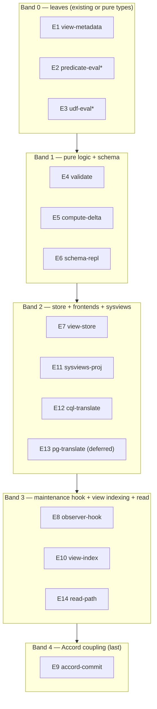

# Materialized Views — Proposed-State DSM & Integration Analysis

> Companion to [dsm-coupling.md](dsm-coupling.md) (crate-level boundaries) and
> [architecture.md](architecture.md). This doc analyzes the **proposed** internal
> module structure of the feature as a Design Structure Matrix, to verify the
> integration is acyclic and to locate the test seams.

## 1. Design elements

The feature introduces or modifies these 14 elements. "Home" is the crate it
lives in under the [dsm-coupling.md](dsm-coupling.md) plan.

| ID | Element | Home crate | What it is |
|----|---------|-----------|-----------|
| E1 | `view-metadata` | ferrosa-view | `ViewMetadata`, `ViewKind`, `ViewColumn`, `ViewPrimaryKey` types |
| E2 | `predicate-eval` | ferrosa-index *(existing)* | `evaluate_predicate_row` reused for D4 WHERE |
| E3 | `udf-eval` | ferrosa-udf *(existing)* | deterministic Wasmtime eval for D4 computed cols |
| E4 | `validate` | ferrosa-view | `validate_view_def` — §4 DDL rules + UDF determinism gate |
| E5 | `compute-delta` | ferrosa-view | pure `compute_view_delta(view, prior, next)` — §6.3 state machine |
| E6 | `schema-repl` | ferrosa-schema (+cluster DDL) | `SchemaSnapshot.views` + Raft DDL replication |
| E7 | `view-store` | ferrosa-storage | view `TableStore` create/drop lifecycle |
| E8 | `observer-hook` | ferrosa-storage | `WriteObserver` wiring base-write → delta |
| E9 | `accord-commit` | ferrosa-cluster | atomic base+view Accord txn + read-before-write |
| E10 | `view-index` | ferrosa-storage/index | 2i/FTS/vector on the view store (D3) |
| E11 | `sysviews-proj` | ferrosa-cql/schema | `system_schema.views` projection (Gate G7) |
| E12 | `cql-translate` | ferrosa-cql | CQL `CREATE/ALTER/DROP MV` → `ViewMetadata` |
| E13 | `pg-translate` | ferrosa-postgres/sql | Postgres MV DDL → `ViewMetadata` *(deferred; designed-for)* |
| E14 | `read-path` | existing | `SELECT … FROM view` = table read (mostly no new code) |

## 2. The DSM matrix

Rows depend on columns: a mark at `(row, col)` means **row requires col**.
Elements are ordered providers-first. All marks fall in the lower-left triangle
(below the diagonal) → **no feedback loops, acyclic DAG**.

```text
            │ E1  E2  E3  E4  E5  E6  E7  E8  E9 E10 E11 E12 E13 E14
 ───────────┼────────────────────────────────────────────────────────
 E1 metadata│  ·   ·   ·   ·   ·   ·   ·   ·   ·   ·   ·   ·   ·   ·
 E2 pred    │  ·   ·   ·   ·   ·   ·   ·   ·   ·   ·   ·   ·   ·   ·
 E3 udf     │  ·   ·   ·   ·   ·   ·   ·   ·   ·   ·   ·   ·   ·   ·
 E4 validate│  ●   ●   ●   ·   ·   ·   ·   ·   ·   ·   ·   ·   ·   ·
 E5 delta   │  ●   ●   ●   ·   ·   ·   ·   ·   ·   ·   ·   ·   ·   ·
 E6 schema  │  ●   ·   ·   ·   ·   ·   ·   ·   ·   ·   ·   ·   ·   ·
 E7 store   │  ●   ·   ·   ·   ·   ●   ·   ·   ·   ·   ·   ·   ·   ·
 E8 observer│  ●   ·   ·   ·   ●   ·   ●   ·   ·   ·   ·   ·   ·   ·
 E9 accord  │  ·   ·   ·   ·   ●   ·   ●   ●   ·   ·   ·   ·   ·   ·
 E10 vindex │  ●   ·   ·   ·   ·   ·   ●   ·   ·   ·   ·   ·   ·   ·
 E11 sysview│  ●   ·   ·   ·   ·   ●   ·   ·   ·   ·   ·   ·   ·   ·
 E12 cql-tr │  ●   ·   ·   ●   ·   ●   ·   ·   ·   ·   ·   ·   ·   ·
 E13 pg-tr  │  ●   ·   ·   ●   ·   ●   ·   ·   ·   ·   ·   ·   ·   ·
 E14 read   │  ·   ·   ·   ·   ·   ·   ●   ·   ·   ●   ·   ·   ·   ·
 ───────────┴────────────────────────────────────────────────────────
 ● = row requires col      · = no dependency
```

## 3. Partition (build bands)

Topological partition of the matrix → five bands. Elements in the same band have
no mutual dependency and can be built/tested in parallel.



**Finding:** the only element in Band 4 is `accord-commit`. Everything that makes
a view correct *locally* (E1–E8, E10–E14) sits beneath it, so the entire feature
is exercisable single-node before Accord is wired — matching the
[architecture.md](architecture.md) §11 phasing (P2 local, P3 cluster) and keeping
an Accord regression from reaching below the cluster layer.

### Band → build phase mapping

| Band | Elements | Phase |
|------|----------|-------|
| B0 | E1, (E2, E3 existing) | P1 |
| B1 | E4, E5, E6 | P1 |
| B2 | E7, E11, E12 (E13 later) | P1 |
| B3 | E8, E14, then E10 | P2 (E8), P4 (E10) |
| B4 | E9 | P3 |

## 4. Coupling metrics

Fan-in = dependents; Fan-out = dependencies; Instability I = FO / (FI + FO)
(0 = stable/depended-upon, 1 = unstable/depends-on-many).

| Element | FI | FO | I | Reading |
|---------|----|----|------|---------|
| E1 view-metadata | 8 | 0 | 0.00 | **Stability anchor.** Spec first, change last; every change ripples to 8 elements. |
| E6 schema-repl | 4 | 1 | 0.20 | Stable hub; replicated form must be right early (G1 view_kind). |
| E7 view-store | 4 | 2 | 0.33 | Storage hub; reused by observer, index, read. |
| E5 compute-delta | 2 | 3 | 0.60 | Pure logic core; high-value unit/property target. |
| E4 validate | 2 | 3 | 0.60 | DDL gatekeeper; shared by both frontends. |
| E8 observer-hook | 1 | 3 | 0.75 | Integration seam base→view. |
| E9 accord-commit | 0 | 3 | 1.00 | **Top of graph, max instability, the risk concentrator.** Last to build, isolated by the fast path (G3). |

**Actionable consequences**

- E1 is the change-propagation epicenter → its serialized form (esp. `view_kind`,
  D1/G1) must be locked in P1; a later field addition is cheap, a field rename is
  an 8-element ripple.
- E5 + E4 are pure and high-fan-out — the cheapest place to buy correctness
  confidence (property + unit tests, no infra). The test spec front-loads them.
- E9 is the only high-risk integration point and the only Accord coupling. It is
  the last band and the most heavily fault-injected layer in the test spec.

## 5. Integration points → test seams

The DSM marks that **cross a crate boundary** are the integration points the test
spec must cover explicitly (a unit test inside one crate will not catch them):

| Seam | Crossing | Test layer (see test-specification.md) |
|------|----------|----------------------------------------|
| E12/E13 → E4 → E6 | frontend → view → schema | Contract (DDL accept/reject), Integration (schema replication) |
| E8 → E5 | storage observer → view delta | Unit (delta), Integration (observer emits correct mutations) |
| E9 → E8/E5/E7 | cluster Accord → storage/view | System + Fault-injection (atomicity, crash mid-txn) |
| E10 → E7 | view index → view store | Integration (two-stage async freshness) |
| E11 → E6 | sysviews projection → schema | Contract (driver shape, G7) |
| E14 → E7/E10 | read path → view store/index | System (read-your-write on view) |

## 6. Forbidden marks (regression guards)

These cells must **stay empty** — if they ever get a mark, a coupling rule broke
(enforce with the `forge dsm` CI gate from [dsm-coupling.md](dsm-coupling.md) §7):

- `(E12, E13)` / `(E13, E12)` — frontend ↔ frontend.
- `(E5, E7)` / `(E5, E8)` / `(E5, E9)` — compute-delta must stay pure (no store,
  observer, or Accord dependency); its I/O is passed in as `prior`/`next` rows.
- `(E1, *)` — metadata types depend on nothing in-feature.
- any mark in the **upper triangle** — would introduce a build cycle.
