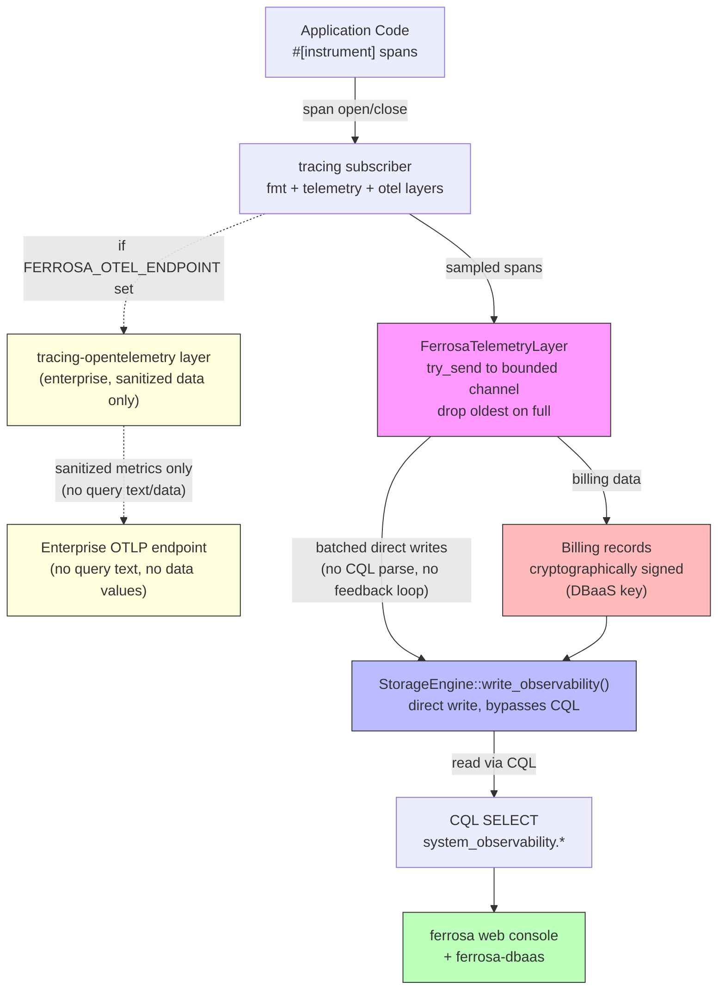
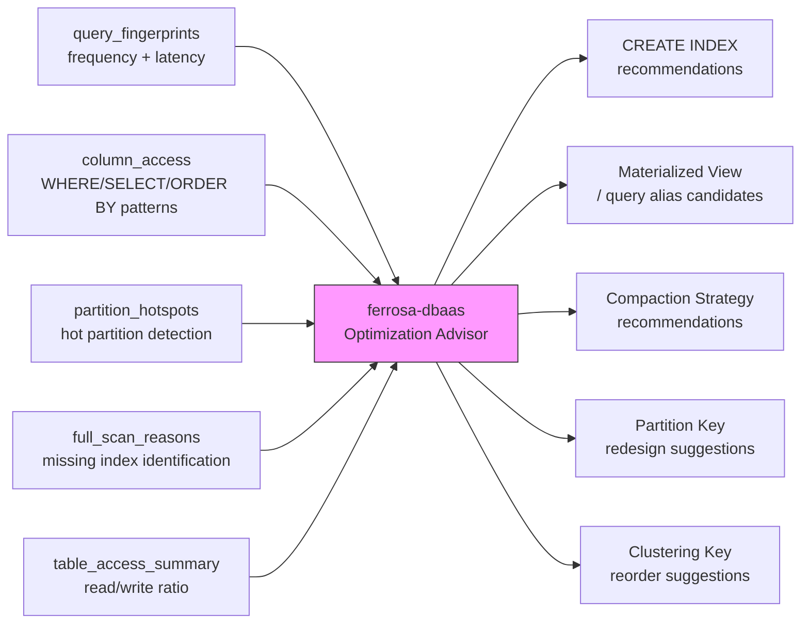

# Observability Architecture — Internals Instrumentation

> Created: 2026-04-03
> Status: Draft
> Scope: End-to-end distributed tracing, metrics, contention/bottleneck instrumentation
> References: CMU-PDL-14-102 (Sambasivan et al.), Dynatrace Developer's Guide to Observability

---

## Design Decisions

Following CMU-PDL-14-102's four design axes:

| Axis | Choice | Rationale |
|------|--------|-----------|
| **Causal relationships** | Trigger-preserving (shows critical path) | Diagnosis use case — "why is this query slow?" |
| **Metadata propagation** | Hybrid fixed-width (trace_id + span_id) | Constant-size, works with OTel, less brittle than static |
| **Sampling** | Head-based coherent, 100% in dev, 1% in prod | Coherent sampling required for trigger causality; configurable per-node |
| **Visualization** | Gantt charts (Jaeger) + flow graphs (Grafana Tempo) | Gantt for individual traces, flow graphs for steady-state diagnosis |

## Stack



**Dual export architecture:**
- **Always:** Self-hosted `FerrosaTelemetryLayer` writes to ferrosa via CQL. No external deps. UI in `ferrosa-dbaas`.
- **Optional (enterprise):** When `FERROSA_OTEL_ENDPOINT` is set, an additional `tracing-opentelemetry` layer exports spans via OTLP gRPC to the customer's existing observability stack (Jaeger, Datadog, Grafana Tempo, etc.). Both layers run concurrently — self-hosted telemetry is always available, OTLP is additive.

**Crate additions:**
- Custom `tracing::Layer` (`FerrosaTelemetryLayer`) — batches spans, writes via `CqlClient`
- `tracing-opentelemetry` + `opentelemetry` + `opentelemetry-otlp` + `opentelemetry_sdk` — behind `otel` feature flag, only compiled when enterprise OTLP export is needed

**Schema (created in `system_observability` keyspace):**

```sql
CREATE TABLE system_observability.spans (
    trace_id    uuid,
    span_id     uuid,
    parent_id   uuid,
    node_id     uuid,
    name        text,
    start_us    bigint,      -- microseconds since epoch
    duration_us bigint,
    status      text,        -- ok / error
    attributes  map<text, text>,
    PRIMARY KEY (trace_id, start_us, span_id)
) WITH CLUSTERING ORDER BY (start_us ASC, span_id ASC);

CREATE TABLE system_observability.metrics (
    node_id     uuid,
    metric_name text,
    bucket      bigint,      -- epoch second, rounded to interval
    value       double,
    labels      map<text, text>,
    PRIMARY KEY ((node_id, metric_name), bucket)
) WITH CLUSTERING ORDER BY (bucket DESC);

CREATE TABLE system_observability.slow_queries (
    node_id     uuid,
    timestamp   bigint,
    duration_us bigint,
    keyspace    text,
    query_text  text,
    client_addr text,
    trace_id    uuid,
    PRIMARY KEY (node_id, timestamp)
) WITH CLUSTERING ORDER BY (timestamp DESC);
```

**Configuration (env vars):**
- `FERROSA_TELEMETRY_ENDPOINT` — CQL endpoint for telemetry writes (default: `127.0.0.1:9042` — self)
- `FERROSA_TELEMETRY_SAMPLE_RATE` — sampling ratio 0.0-1.0 (default: 1.0 in dev, 0.01 in prod)
- `FERROSA_TELEMETRY_ENABLED` — master switch (default: true)
- `FERROSA_SLOW_QUERY_THRESHOLD_MS` — slow query threshold (default: 1000)
- `FERROSA_OTEL_ENDPOINT` — OTLP gRPC endpoint for enterprise export (default: disabled). When set, adds `tracing-opentelemetry` layer alongside the self-hosted layer.
- `FERROSA_OTEL_SERVICE_NAME` — OTel service name (default: "ferrosa")

---

## Instrumentation Points

### Layer 1: CQL Request Lifecycle (business metrics, long queries)

| Span | Location | Attributes | Why |
|------|----------|------------|-----|
| `cql.request` | `server.rs` accept loop | `cql.opcode`, `cql.keyspace`, `client.address` | Top-level request span — every CQL frame gets one |
| `cql.parse` | `parser.rs` entry | `cql.statement_type`, `cql.table` | Parser latency, identifies complex queries |
| `cql.route` | `router.rs` route dispatch | `cql.consistency_level`, `cql.rf` | Routing decision latency |
| `cql.execute` | `router.rs` per-statement handler | `cql.rows_returned`, `cql.rows_scanned` | Execution time — the "business metric" |
| `cql.prepared` | `prepared.rs` cache lookup | `cql.cache_hit` | Prepared statement cache effectiveness |

**Slow query detection:** Log at WARN when `cql.execute` span exceeds configurable threshold (default 1s). Include full query text at DEBUG level.

### Layer 1b: Graph Engine (Cypher queries, Bolt protocol, HTTP)

| Span | Location | Attributes | Why |
|------|----------|------------|-----|
| `graph.request` | `http.rs` POST /graph/query | `graph.query_text`, `client.address` | Top-level graph query span |
| `graph.parse` | `parser/` Cypher parser | `graph.node_labels`, `graph.hop_count` | Parse latency, query complexity |
| `graph.plan` | `planner/logical.rs` + `physical.rs` | `graph.plan_type`, `graph.hops` | Plan generation latency |
| `graph.execute` | `executor/expand.rs` | `graph.rows_returned`, `graph.fan_out`, `graph.timeout` | Execution time — traversal depth + result size |
| `graph.explain` | `engine.rs` explain API | `graph.plan_summary` | Explain (no execution) |
| `bolt.session` | Bolt v5 handler | `bolt.version`, `client.address`, `bolt.state` | Bolt connection lifecycle |
| `bolt.run` | Bolt RUN message handler | `bolt.query`, `bolt.params_count` | Per-statement execution via Bolt |
| `graph.adjacency_build` | `adjacency/observer.rs` | `graph.keyspace`, `graph.entries_written` | Adjacency index build latency on flush |
| `graph.reconcile` | `adjacency/reconcile.rs` | `graph.divergence_count`, `graph.repaired` | Background reconciliation cycle |

### Layer 1c: Index Usage (which indexes are hit, build times)

| Span | Location | Attributes | Why |
|------|----------|------------|-----|
| `index.plan` | `planner.rs` ScanPlan | `index.type`, `index.name`, `index.table`, `plan` (PrimaryKey/SingleIndex/IndexIntersection/FullScan) | Tracks which plan was chosen — did we use an index or full scan? |
| `index.lookup` | `IndexReader` implementations | `index.type`, `index.keyspace`, `index.table`, `index.column`, `index.rows_matched` | Per-index lookup latency + selectivity |
| `index.build` | `index/scheduler.rs` | `index.type`, `index.table`, `index.priority`, `index.duration_ms`, `index.entries` | Background index build time per SSTable |
| `index.fts_search` | `fts_match()` function | `index.query_terms`, `index.results`, `index.bm25_top_score` | Full-text search latency + result quality |
| `index.vector_ann` | `vector/hnsw.rs`, `vector/ivfflat.rs` | `index.k`, `index.ef_search`, `index.distance_fn`, `index.candidates_scanned` | ANN query latency + search depth |

**Metrics:**

| Metric | Type | Labels | Why |
|--------|------|--------|-----|
| `ferrosa_index_lookups_total` | counter | `type`, `keyspace`, `table` | Index usage frequency — are indexes being used? |
| `ferrosa_index_full_scans_total` | counter | `keyspace`, `table` | Full scans — indicates missing index |
| `ferrosa_index_build_duration_seconds` | histogram | `type` | Build latency distribution |
| `ferrosa_index_staleness` | gauge | `keyspace`, `table`, `type` | Current/Building/Stale/Failed per index |
| `ferrosa_graph_queries_total` | counter | `endpoint` (http/bolt) | Graph query rate |
| `ferrosa_graph_query_duration_seconds` | histogram | `endpoint` | Graph query latency |
| `ferrosa_graph_traversal_depth` | histogram | — | Hop count distribution |
| `ferrosa_bolt_connections_active` | gauge | — | Active Bolt sessions |

### Layer 2: Cluster Coordination (contention, consensus)

| Span | Location | Attributes | Why |
|------|----------|------------|-----|
| `cluster.write` | `coordinator/write.rs` | `cl`, `rf`, `replicas`, `acks` | Write fan-out latency + quorum wait |
| `cluster.read` | `coordinator/read.rs` | `cl`, `digest_match`, `repair_needed` | Read coordination + digest comparison |
| `cluster.read_repair` | `coordinator/read.rs` | `stale_replicas`, `repair_success` | Read repair latency (now inline) |
| `accord.txn` | `accord/coordinator.rs` | `txn_id`, `path` (fast/slow), `shards` | Full Accord transaction lifecycle |
| `accord.preaccept` | `accord/coordinator.rs` | `ballot`, `deps_count` | PreAccept round latency |
| `accord.commit` | `accord/coordinator.rs` | `commit_type` | Commit decision latency |
| `raft.propose` | `ddl_path.rs` | `op_type`, `leader_id` | DDL through Raft latency |
| `raft.forward` | `ddl_path.rs` | `leader_id` | Non-leader DDL forwarding latency |

### Layer 3: Storage Engine (I/O bottlenecks, backpressure)

| Span | Location | Attributes | Why |
|------|----------|------------|-----|
| `storage.write` | `engine.rs` write | `table`, `key_size`, `row_count` | Per-write storage latency |
| `storage.read` | `engine.rs` read | `table`, `memtable_hit`, `sstable_count` | Read path breakdown |
| `storage.flush` | `flush.rs` | `table`, `bytes_flushed`, `duration_ms` | Memtable flush duration |
| `storage.compaction` | `compaction/` | `input_sstables`, `output_bytes`, `strategy` | Compaction duration + I/O |
| `storage.s3_upload` | `upload/` | `component`, `bytes`, `retry_count` | S3 upload latency + retries |
| `commitlog.write` | `commitlog/` | `segment_id`, `entry_bytes` | Commit log write latency |
| `commitlog.sync` | `commitlog/` | `sync_strategy`, `entries_batched` | fsync latency (critical for durability) |

### Layer 4: Network / Internode (queue depths, backpressure)

| Span | Location | Attributes | Why |
|------|----------|------------|-----|
| `net.rpc` | `rpc/client.rs` send | `peer`, `msg_type`, `lane`, `bytes` | RPC round-trip latency |
| `net.handshake` | `handshake.rs` | `peer`, `protocol_version` | Connection establishment time |
| `net.pool` | `pool.rs` | `peer`, `lane`, `active_rpcs` | Connection pool utilization |

### Layer 5: Native Metrics (virtual tables + web UI)

All metrics are exposed as **CQL virtual tables** in `system_observability` and rendered
natively in the **ferrosa web console** (port 9090). No Prometheus server needed.
Enterprise customers who want Prometheus/OTLP get it via the optional `otel` feature flag export.

**Virtual tables (queryable via CQL, auto-refreshed in web UI):**

| Virtual Table | Key Columns | Why |
|---------------|-------------|-----|
| `system_observability.cql_stats` | `opcode`, `keyspace`, `requests`, `errors`, `p50_us`, `p95_us`, `p99_us` | CQL request rate + latency by operation type |
| `system_observability.slow_queries` | `timestamp`, `duration_us`, `keyspace`, `query_text`, `trace_id` | Slow query log with trace link |
| `system_observability.cluster_stats` | `operation` (write/read), `cl`, `requests`, `errors`, `p50_us`, `p99_us` | Coordinator write/read latency by CL |
| `system_observability.storage_stats` | `table`, `memtable_bytes`, `sstable_count`, `flush_count`, `compaction_count` | Per-table storage health (extends existing) |
| `system_observability.compaction_history` | `table`, `started_at`, `duration_ms`, `input_bytes`, `output_bytes`, `strategy` | Compaction event log |
| `system_observability.s3_uploads` | `component`, `bytes`, `duration_ms`, `retry_count`, `status` | S3 upload latency + failures |
| `system_observability.commitlog_stats` | `sync_strategy`, `segments_active`, `segments_pending_upload`, `sync_p99_us` | Commit log health + fsync timing |
| `system_observability.net_stats` | `peer`, `lane`, `bytes_sent`, `bytes_received`, `rpcs_inflight`, `rpc_p99_us` | Per-peer network health |
| `system_observability.raft_stats` | `proposals`, `leader_elections`, `snapshot_count`, `proposal_p99_us` | Raft consensus health |
| `system_observability.index_stats` | `keyspace`, `table`, `index_name`, `type`, `lookups`, `full_scans`, `build_duration_ms`, `state` | Index usage — are indexes being used? |
| `system_observability.graph_stats` | `endpoint` (http/bolt), `queries`, `errors`, `p50_us`, `p99_us`, `avg_depth` | Graph query performance |
| `system_observability.mode_transitions` | `timestamp`, `from_mode`, `to_mode`, `reason` | Cluster mode change audit log |
| `system_observability.contention` | `resource`, `lock_waits`, `avg_hold_us`, `max_hold_us` | Lock contention hot spots |
| `system_observability.backpressure` | `queue_name`, `depth`, `drain_rate`, `max_depth` | Internal queue health (S3 upload, hints, commit log archive) |

**Web UI panels (ferrosa web console, port 9090):**

| Panel | Data Source | Visualization |
|-------|------------|---------------|
| **CQL Throughput** | `cql_stats` | Requests/sec by opcode, live chart |
| **CQL Latency** | `cql_stats` | p50/p95/p99 by keyspace, live chart |
| **Slow Queries** | `slow_queries` | Table with duration, query text, trace link |
| **Cluster Health** | `cluster_stats` + `mode_transitions` | Write/read latency, mode history |
| **Storage** | `storage_stats` + `compaction_history` | Memtable size, SSTable count, compaction timeline |
| **S3 Pipeline** | `s3_uploads` + `backpressure` | Upload latency, queue depth gauge |
| **Network** | `net_stats` | Per-peer bandwidth, RPC latency, in-flight gauge |
| **Indexes** | `index_stats` | Lookups vs full scans ratio, build times, staleness |
| **Graph** | `graph_stats` | Query rate, latency, traversal depth histogram |
| **Contention** | `contention` | Lock hot spots, hold times |
| **Traces** | `spans` | Recent traces, drill-down by trace_id (links to ferrosa-dbaas) |

**Enterprise OTLP export (optional):** When `FERROSA_OTEL_ENDPOINT` is set, all virtual table
data is also exported as Prometheus-compatible metrics via the existing `/metrics` endpoint and
spans are exported via OTLP gRPC. This is additive — the native web UI always works.

### Layer 6: Resource Attribution (consumption billing)

Tracks per-client, per-keyspace resource consumption for billing and capacity planning.
The analysis system in `ferrosa-dbaas` aggregates these into billing periods.

**Virtual tables:**

| Virtual Table | Key Columns | Why |
|---------------|-------------|-----|
| `system_observability.client_usage` | `client_address`, `keyspace`, `bucket`, `reads`, `writes`, `bytes_read`, `bytes_written`, `compute_us` | Per-client resource attribution for consumption billing |
| `system_observability.keyspace_storage` | `keyspace`, `table`, `disk_bytes`, `s3_bytes`, `sstable_count`, `memtable_bytes` | Per-keyspace/table storage footprint for storage billing |
| `system_observability.s3_egress` | `keyspace`, `bucket`, `bytes_uploaded`, `bytes_downloaded`, `requests` | S3 usage per keyspace for cloud cost attribution |

**Span attributes to add:**

| Existing Span | New Attributes | Why |
|---------------|----------------|-----|
| `cql.request` | `cql.tenant_id` (from auth role), `cql.bytes_in`, `cql.bytes_out` | Per-request byte metering |
| `storage.write` | `storage.bytes_written` (total, including index overhead) | Write amplification visibility |
| `storage.read` | `storage.bytes_read` (memtable + SSTable I/O) | Read cost attribution |
| `storage.s3_upload` | `s3.keyspace` | Attribute S3 cost to keyspace |

### Layer 7: Query Fingerprints + Access Patterns (optimization advisor)

Captures the data an analysis system needs to suggest table layouts, indexes, and query rewrites.
This is the foundation for automatic database optimization in `ferrosa-dbaas`.

**Virtual tables:**

| Virtual Table | Key Columns | Why |
|---------------|-------------|-----|
| `system_observability.query_fingerprints` | `fingerprint_hash`, `keyspace`, `table`, `parameterized_text`, `count`, `avg_us`, `p99_us`, `last_seen`, `plan_type` | ALL queries (not just slow), grouped by parameterized fingerprint. Frequency + latency = optimization priority. |
| `system_observability.column_access` | `keyspace`, `table`, `column`, `in_select`, `in_where_eq`, `in_where_range`, `in_order_by`, `in_group_by` | Which columns are accessed how — the input for "create index on X" and "change clustering key" recommendations |
| `system_observability.partition_hotspots` | `keyspace`, `table`, `partition_key_hash`, `reads`, `writes`, `last_access` | Hot partition detection — identifies data model problems (e.g., unbounded partition growth) |
| `system_observability.full_scan_reasons` | `keyspace`, `table`, `predicate_column`, `operator`, `count`, `suggested_index_type` | Why full scans happened — directly maps to "CREATE INDEX" recommendations |
| `system_observability.table_access_summary` | `keyspace`, `table`, `reads`, `writes`, `point_lookups`, `range_scans`, `full_scans`, `rw_ratio` | Read/write ratio per table — input for compaction strategy selection (STCS vs LCS vs TWCS) |

**Span attributes to add:**

| Existing Span | New Attributes | Why |
|---------------|----------------|-----|
| `cql.parse` | `cql.fingerprint_hash`, `cql.select_columns`, `cql.where_columns`, `cql.where_operators` | Structured access pattern extraction from parsed AST |
| `cql.execute` | `cql.scan_type` (point/range/full), `cql.partition_key_hash` | Point vs range vs full scan classification + hot partition tracking |
| `index.plan` | `index.full_scan_reason` (column + operator that forced scan) | Root cause for missing index |

**How the ferrosa-dbaas optimization advisor uses this:**



**Optimization rules the advisor can derive:**

| Signal | Recommendation |
|--------|----------------|
| `full_scan_reasons` shows column X with >100 scans | "CREATE INDEX ON table(X) USING 'btree'" |
| `column_access` shows WHERE on non-PK column with high frequency | "Consider materialized view with X as partition key" |
| `table_access_summary` shows write-heavy table on STCS | "ALTER TABLE ... WITH compaction = {'class': 'LeveledCompactionStrategy'}" |
| `table_access_summary` shows time-series pattern (append-only, range reads) | "ALTER TABLE ... WITH compaction = {'class': 'TimeWindowCompactionStrategy'}" |
| `partition_hotspots` shows single partition with >90% of traffic | "Partition key has low cardinality — consider adding a bucket column" |
| `query_fingerprints` shows same table queried with different PK order | "Create query alias (materialized view) for the alternate access pattern" |
| `column_access` shows ORDER BY on non-clustering column | "Add column to clustering key or create secondary index" |

### Layer 8: Contention-Specific Instrumentation (unchanged from original)

| Point | Location | What to capture | Why |
|-------|----------|-----------------|-----|
| Memtable shard lock | `memtable/` | Contention count per shard, wait time | Identifies hot partitions |
| ArcSwap loads | `write_path.rs`, `ddl_path.rs` | Load count (sampled) | Mode transition frequency |
| transition_guard | `peer_events.rs` | Hold duration, contention count | Serialized mode transitions |
| Raft log store | `raft/log_store.rs` | Write latency, batch size | sled I/O bottleneck |
| S3 upload queue | `upload/` | Queue depth, drain rate | Backpressure indicator |
| Hint store | `hints/` | Pending hints per peer, replay rate | Divergence indicator |
| Commit log segments | `commitlog/` | Active segments, closed-pending-upload | Archive lag |

### Layer 9: On-Demand Flame Charts (code hot path analysis)

`tracing-flame` writes a folded stack line per span close — **always-on cost is too high for
production** (write per span at thousands of req/sec). Instead, use an on-demand model:

**Design:** The flame layer is NOT installed in the subscriber at startup. When an operator
requests a profile, the system temporarily adds a `FlameLayer` with a `BufWriter<Vec<u8>>`,
captures for N seconds, removes the layer, and returns an SVG flame chart.

**Endpoint:** `GET /api/debug/flamechart?seconds=30`

- Zero overhead when not profiling (layer not installed)
- During profiling window: ~5-10% overhead (buffered write per span close)
- Returns `image/svg+xml` flame chart rendered by `inferno`
- Auth-gated (requires superuser or `FERROSA_DEBUG_ENABLED=true`)
- Only one profile at a time (mutex-guarded)

**Crate additions:**
- `tracing-flame` — folded stack capture (only used during profiling window)
- `inferno` — flamegraph SVG rendering

**Implementation:**

```rust
// No flame layer in normal subscriber stack.
// On /api/debug/flamechart request:
let (flame_layer, guard) = FlameLayer::with_file("/tmp/ferrosa-flame.folded")?;
let handle = subscriber.with(flame_layer);  // temporarily add layer
tokio::time::sleep(Duration::from_secs(seconds)).await;
drop(handle);  // remove layer
drop(guard);   // flush writer
// Read folded stacks, render SVG via inferno, return to client
```

**What this shows:** CPU time distribution across span hierarchy — "60% of time in
`storage.read`, of which 40% in `sstable.decompress`". Identifies code-level hot paths
that span-level latency alone can't pinpoint.

---

## Context Propagation

Per CMU-PDL-14-102 Section 4, use hybrid fixed-width metadata:

1. **Within a node:** `tracing::Span` context propagates via `tracing::Instrument` and task-local storage
2. **Across nodes (internode RPC):** Inject `trace_id` + `span_id` into internode message headers (new 32-byte optional header field after the existing 12-byte frame header)
3. **Across nodes (CQL):** Extract trace flag from CQL v5 custom payload (driver-initiated tracing)

The internode propagation requires a wire format change:
- Add `trace_context: [u8; 32]` to the codec frame (REQUIRED, not optional)
- Layout: 16-byte trace_id + 8-byte span_id + 8-byte flags
- All-zero = no active trace (equivalent to unsampled)
- Mixed observable/non-observable clusters are a non-goal — all nodes must support trace context
- In high-security mode, invalid/malformed trace context triggers warning log and optional node ejection

---

## Sprint Plan

### O1: Foundation (self-hosted telemetry layer)

| # | Task | Size | Description |
|---|------|------|-------------|
| O1.1 | Create `system_observability` schema | S | Tables: `spans`, `metrics`, `slow_queries` — auto-created at startup like other system keyspaces |
| O1.2 | Build `FerrosaTelemetryLayer` | L | Custom `tracing::Layer` that batches closed spans in a bounded channel and writes DIRECTLY to the storage engine (bypassing CQL parse/route/execute). **CRITICAL (OF1):** This eliminates the self-write feedback loop architecturally — observability writes never generate spans. Channel uses try_send; drops oldest on full with alerting. Cancel-safe. Configurable sample rate, batch size (default 100 spans / 1s flush). |
| O1.3 | Configure telemetry subscriber in main.rs | M | Add `FerrosaTelemetryLayer` conditionally when `FERROSA_TELEMETRY_ENABLED=true`. Stack with existing fmt layer. |
| O1.4 | Instrument CQL request lifecycle | M | `#[instrument]` on server accept, parse, route, execute — generates spans that flow into self-hosted storage |
| O1.5 | Slow query table + threshold logging | S | Queries exceeding `FERROSA_SLOW_QUERY_THRESHOLD_MS` written to `system_observability.slow_queries` with trace_id link. **CRITICAL (OBS-T3):** Store parameterized form only (replace literals with `?`), never raw query text in CQL tables. |
| O1.6 | CQL request metrics (counter + histogram) | M | `ferrosa_cql_requests_total`, `ferrosa_cql_request_duration_seconds` — written to `metrics` table on configurable interval |

### O2: Cluster + Storage Spans

| # | Task | Size | Description |
|---|------|------|-------------|
| O2.1 | Instrument coordinator write/read | M | Spans on `coordinate_write_with`, `coordinate_read_with`, `coordinate_write_nts`, `coordinate_read_nts` |
| O2.2 | Instrument Accord transaction lifecycle | M | Spans on PreAccept, Accept, Commit, Execute phases |
| O2.3 | Instrument storage engine | M | Spans on write, read, flush, compaction |
| O2.4 | Instrument commit log | S | Spans on write_entry, sync (fsync timing critical) |
| O2.5 | Storage + compaction metrics | M | Histograms for flush/compaction duration, gauges for memtable/SSTable sizes |

### O3: Network + Contention

| # | Task | Size | Description |
|---|------|------|-------------|
| O3.1 | Instrument internode RPC | M | Span on send/receive with peer, msg_type, bytes, latency |
| O3.2 | Trace context propagation across nodes | L | 32-byte trace header in internode frames, inject/extract — enables cross-node trace stitching |
| O3.3 | Contention metrics | M | Memtable shard contention, transition guard hold time, S3 upload queue depth |
| O3.4 | Network bandwidth metrics | S | `ferrosa_net_bytes_sent_total`, `ferrosa_net_bytes_received_total` by peer + lane |
| O3.5 | In-flight RPC gauge | S | `ferrosa_net_rpc_inflight` per peer |
| O3.6 | On-demand flame chart endpoint | M | `GET /api/debug/flamechart?seconds=N` — temporarily installs `tracing-flame` layer, captures span stacks, renders SVG via `inferno`. Zero overhead when not profiling. **CRITICAL (OF3, OBS-T1):** Cap seconds to 60, BufWriter to 64 MB, mutex (1 concurrent), superuser auth, rate limit 1/5min. Strip sensitive attributes from output (OBS-T2). |

### O4: Native Web UI Panels

| # | Task | Size | Description |
|---|------|------|-------------|
| O4.1 | Virtual table registry for all `system_observability.*` tables | M | Register 14 virtual tables with `VirtualTableRegistry`. Each backed by atomic counters + ring buffers, queryable via CQL. |
| O4.2 | Web console: CQL dashboard panel | M | Throughput + latency charts (requests/sec, p50/p95/p99) in `web/index.html` auto-refreshing from `/api/observability/cql` |
| O4.3 | Web console: Storage + S3 panel | M | Memtable bytes, SSTable counts, compaction timeline, S3 queue depth from `/api/observability/storage` |
| O4.4 | Web console: Network + Cluster panel | M | Per-peer bandwidth, RPC latency, mode transition history from `/api/observability/cluster` |
| O4.5 | Web console: Index usage panel | S | Lookups vs full scans, build times, staleness heatmap from `/api/observability/indexes` |
| O4.6 | Web console: Graph panel | S | Query rate, latency, depth histogram from `/api/observability/graph` |
| O4.7 | Web console: Slow queries + traces panel | M | Slow query table with trace_id drill-down, recent traces list. Links to ferrosa-dbaas for full trace view. |
| O4.8 | Web console: Contention + backpressure panel | S | Lock hot spots, queue depths, fsync timing from `/api/observability/contention` |
| O4.9 | Metrics rollup background task | M | Aggregate fine-grained counters into hourly/daily buckets, TTL old data (7 days raw, 90 days rolled up) |
| O4.10 | Alert evaluator | M | Background task evaluates threshold rules (slow query rate, S3 queue > 100, hint backlog growing). Writes to `system_observability.alerts`, shown in web UI banner. |

### O5: Billing + Query Optimization Foundation

| # | Task | Size | Description |
|---|------|------|-------------|
| O5.1 | `client_usage` virtual table + per-request byte metering | M | Track `bytes_in`, `bytes_out`, `compute_us` per CQL request attributed to `client_address` + `keyspace`. Aggregate in 1-minute buckets. **CRITICAL (OF10):** Flush counters to commit log every 10s; replay on startup to recover partial buckets. |
| O5.2 | `keyspace_storage` virtual table | M | Periodic scan of storage engine for per-keyspace/table disk + S3 byte totals. Refresh every 60s. |
| O5.3 | `query_fingerprints` virtual table + AST extraction | L | On every CQL parse, extract parameterized fingerprint hash + column access patterns. Aggregate by fingerprint with count, avg latency, p99. Ring buffer of top 10k fingerprints. |
| O5.4 | `column_access` virtual table | M | Accumulate per-column usage counters (in_select, in_where_eq, in_where_range, in_order_by) from parsed AST. |
| O5.5 | `partition_hotspots` virtual table | M | **CRITICAL (OF7):** Use count-min sketch (not naive sampling) for frequency estimation. Require minimum 1000 samples before reporting hot. Include confidence score in advisor output. |
| O5.6 | `full_scan_reasons` virtual table | S | When `index.plan` chooses FullScan, record the predicate column + operator that caused it. Aggregate by column. |
| O5.7 | `table_access_summary` virtual table | S | Derive from existing storage.read/write spans: point vs range vs full scan counts, read/write ratio. |
| O5.8 | `s3_egress` virtual table with keyspace attribution | S | Add `keyspace` label to S3 upload spans, aggregate bytes by keyspace. |

### O6: Enterprise OTLP Export (formerly O5) (optional, behind `otel` feature flag)

| # | Task | Size | Description |
|---|------|------|-------------|
| O6.1 | Add `otel` feature flag to ferrosa crate | S | `tracing-opentelemetry`, `opentelemetry-otlp`, `opentelemetry_sdk` compiled only with `--features otel` |
| O6.2 | OTLP span exporter layer | M | When `FERROSA_OTEL_ENDPOINT` set, add `tracing-opentelemetry` layer to subscriber. Runs alongside native layer. |
| O6.3 | Prometheus `/metrics` from virtual tables | S | Render all `system_observability.*` virtual table data as Prometheus text exposition format at existing `/metrics` endpoint. Enterprise customers scrape this. |

---

## Design Principles

1. **Native first, enterprise export optional:** All observability is built into the ferrosa web console and CQL virtual tables. No external tools required. Enterprise customers optionally export via OTLP/Prometheus.
2. **Write-path bypass, CQL read-path:** Observability table writes go directly to the storage layer — NOT through CQL parse/route/execute. This eliminates the self-write feedback loop architecturally (FMEA OF1, RPN 504). Reads happen via standard CQL `SELECT` against `system_observability.*` tables.
3. **Trigger-preserving causality:** Every span shows the critical path of the triggering request, not background work attributed to it.
4. **Contention visibility first:** Prioritize instrumenting lock contention, queue depths, and backpressure over exhaustive function tracing.
5. **Coherent sampling:** Head-based, decided at CQL request entry. All spans within a sampled request are captured.
6. **Homogeneous observability:** All nodes in a cluster have observability enabled or none do. Mixed observable/non-observable clusters are a non-goal. Trace context in internode frames is REQUIRED, not optional.
7. **Cancel-safe, crash-proof:** All telemetry paths use try-send (non-blocking). Channel full → drop oldest with alerting. Bad/excessive monitoring MUST NEVER crash the node.
8. **Signed billing data:** Billing records in `client_usage` are cryptographically signed by a key created by the DBaaS. Even DB admins cannot modify billing records. Non-repudiation for consumption billing.
9. **Data-safe external export:** External OTLP export NEVER includes query text, data values, or any information that could compromise user data. Only operational metrics (latency, counts, error rates) and sanitized span names are exported. Query analysis is admin-only, on-system only.
10. **High-security mode:** `FERROSA_HIGH_SECURITY_MODE=true` enables node ejection on detection of potentially malicious internode behavior (spoofed trace context, replay attacks).
11. **Standard CQL interface:** All telemetry is queryable via normal CQL SELECT. No proprietary query language. `ferrosa-dbaas` reads the same tables any CQL client can.
12. **Configurable billing path:** Billing endpoint is configurable separately from the telemetry endpoint (`FERROSA_BILLING_ENDPOINT`) since the DBaaS billing system may differ from the performance monitoring system.
