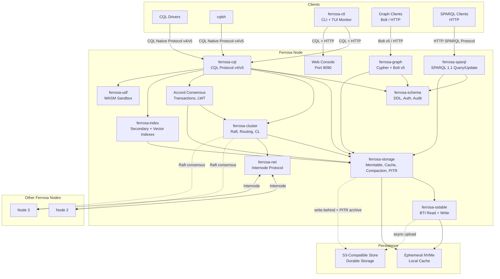
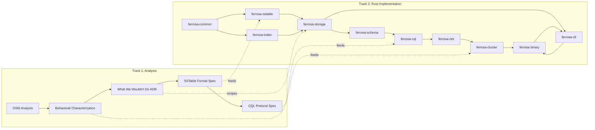

# System Overview

> Last updated: 2026-04-05
> Status: Approved

## Overview

Ferrosa is a distributed database that speaks CQL, Cypher, and SPARQL, backed by S3-compatible object storage for durability and ephemeral local storage for performance. It is built as independent Rust crates, informed by a deep analysis of Apache Cassandra's architecture but designed as idiomatic Rust from the ground up.

## System Diagram

## Design Principles

1. **S3 as source of truth** — nodes are ephemeral, SSTables live in object storage
1. **CQL compatibility** — existing drivers and tools work unchanged
1. **Rust-native** — idiomatic Rust with clean ownership, not a Java transliteration
1. **Cassandra's consistency model** — tunable CL (ONE, QUORUM, ALL) preserved
1. **Serializable transactions** — Accord consensus for LWT and multi-statement transactions
1. **Independent crates** — each subsystem testable and usable on its own

## Two Parallel Tracks

Track 1 (Java analysis) informs Track 2 (Rust implementation). Track 1 is analysis only, not a deliverable.

**Current progress**: All 12 crates are implemented and functional. **Accord consensus transactions** are fully implemented (7 sprints, 2,808 tests): AccordStateMachine, AccordCoordinator (fast/slow path), LWT (INSERT IF NOT EXISTS, IF conditions on UPDATE/DELETE), BEGIN TRANSACTION/COMMIT/ROLLBACK, cross-shard conflict detection, Jepsen-style linearizability testing, electorate reconfiguration, crash recovery, and 9 observability metrics. The production cluster sprint is complete with Raft consensus, coordinated reads/writes, hinted handoff, node lifecycle (join/decommission/rebalance), reconnection, and integration tests. The graph engine is fully complete: Cypher parser, expression evaluator, aggregation framework, variable-length paths, SUBSCRIBE/UNSUBSCRIBE with SSE streaming, leapfrog triejoin, and Bolt v5 wire protocol. UDF/UDA with WASM sandboxing is complete and integrated with Accord transactions (18 tests). Secondary and vector indexes are consolidated with a full query planner pipeline, including transactional index reads (READ_2I, 5-layer merge). Point-in-time recovery is implemented: commit log archiving to S3, snapshot management, point-in-time restoration, CLI tooling, and web console integration. CQL driver compatibility is verified with cdrs-tokio, supporting protocol v4 and v5 negotiation. The `vector<float, N>` type enables embedding storage for AI/ML workloads. Phonetic indexes with Double Metaphone support fuzzy text search. The `system_observability` virtual tables expose live system state for monitoring. The `ferrosa` binary composes everything into a cluster-mode database with background maintenance, graceful shutdown, per-connection backpressure, PITR archiving, and exponential backoff reconnection. Available as a `.deb` package via GitHub Releases.

## Key Architectural Decisions

| Decision | Choice | Rationale |
|----------|--------|-----------|
| Deployment | AWS-first, flag lock-in | Start concrete, stay portable |
| Storage | Write-behind async S3 | Minimal write latency, quorum mitigates loss window |
| SSTable | Phased: BTI read+write first, Big read later | Focus on modern format, migration path preserved |
| Protocol | CQL client compat, own internode | Apps work unchanged, clean internal design |
| Consensus | Raft metadata, tunable CL | Proven Rust libs + Cassandra semantics |
| Transactions | Accord consensus (serializable) | Cassandra 5.x compatible, no dedicated coordinator |
| Partitioner | Murmur3Partitioner | Cassandra SSTable compatibility |
| Driver compat | Protocol v4 + v5 negotiation | cdrs-tokio and other standard CQL drivers work out of the box |
| Embeddings | `vector<float, N>` CQL type | Native vector storage for AI/ML workloads; ANN query support via vector indexes |
| NVMe Table Pinning | Per-table `storage.pin = nvme` | Pins SSTables to local disk, bypassing S3 for sub-millisecond reads |
| Full-Text Search | Inverted index sidecars + `fts_match()` | BM25-scored full-text queries via CQL function; `CREATE INDEX ... USING 'fulltext'` |
| Compaction | STCS (default) + UCS (density-based) | UCS (Cassandra 5.0 CEP-26) subsumes LCS/STCS via fan factor; per-table DDL config |
| Phonetic Search | `SOUNDS LIKE` operator + phonetic indexes | Double Metaphone matching for fuzzy name lookups |

## AWS Lock-in Flags

Ferrosa is AWS-first but must remain portable to S3-compatible stores (MinIO, etc.):

- **S3 object metadata** (`x-amz-meta-*`): Standard across S3-compatible stores. No lock-in.
- **S3 client library**: Using `object_store` crate 0.11 (Apache Arrow project) with `aws` feature. Supports S3, MinIO (via endpoint override), GCS, Azure. Configured via `FERROSA_S3_*` environment variables in `ObjectStoreConfig`.
- **S3 conditional writes**: The manifest uses etag-based conditional put (`PutMode::Update`) for CAS. The `object_store` crate supports this on S3 and MinIO. Other S3-compatible stores may vary — flag as portability concern if expanding.

## Observability

Ferrosa includes a built-in observability system that exposes live database state through multiple interfaces without requiring external tooling for basic monitoring.

### Virtual Tables

The `system_observability` keyspace provides read-only virtual tables that are computed on demand rather than stored on disk:

| Table | Source | Contents |
|-------|--------|----------|
| `connections` | `ConnectionTracker` (ferrosa-cql) | Active CQL client connections, addresses, auth state |
| `active_queries` | `QueryTracker` (ferrosa-cql) | In-flight queries, elapsed time, bound parameters |
| `storage_stats` | `StorageStatsTable` (ferrosa-storage) | Memtable sizes, flush counts, compaction stats, cache hit rates |
| `secondary_indexes` | `SecondaryIndexesVirtualTable` (ferrosa-storage) | Per-index staleness, build status, pending SSTables, build errors |

Virtual tables are backed by the `VirtualTable` trait defined in ferrosa-schema (`virtual_table.rs`). Each implementation provides a `read_rows()` method that returns the current state as CQL rows. The `VirtualTableRegistry` (`virtual_registry.rs`) manages registration and lookup using `ArcSwap` for lock-free concurrent reads.

### Web Dashboard

The ferrosa binary hosts an Axum web server on port 9090 (`web/` module) that provides:

- **JSON API** — programmatic access to connection, query, and storage stats
- **Static file serving** — embedded HTML/JS dashboard for browser-based monitoring
- **Prometheus `/metrics` endpoint** — standard Prometheus text format for scraping by Prometheus, Grafana, Datadog, and other monitoring tools

### CQL Extensions

Two new CQL commands support real-time push-based monitoring:

- **`SUBSCRIBE`** — register for streaming updates on virtual table changes (backed by `subscribe.rs` in ferrosa-cql)
- **`UNSUBSCRIBE`** — cancel an active subscription

The `subscription_observer.rs` in ferrosa-storage bridges storage events into the subscription system, pushing updates to connected clients as state changes occur.

### ferrosa-ctl

`ferrosa-ctl` is a standalone CLI admin tool built with `ratatui` and `crossterm`. It connects to a running Ferrosa node and provides:

- **CLI mode** — issue admin queries, inspect virtual tables, check node health
- **TUI monitor mode** — live-updating terminal dashboard showing connections, active queries, and storage stats in a multi-panel layout

## Research Items

Deferred but tracked for future investigation:

| Area | Options | Status |
|------|---------|--------|
| Distributed transactions | Accord consensus | **Implemented** — 7 sprints (A1-A7), 2,808 tests, Jepsen-verified |
| Clock synchronization | HLC (Hybrid Logical Clock) | **Implemented** — HLC timestamps for Accord transaction ordering |
| Transport protocol | QUIC (`quinn` crate) | Research — better for multi-DC, built-in multiplexing |
| Native SSTable format | S3-optimized: larger blocks, content-addressed, embedded metadata | Research — behind feature flag, after BTI is solid |
| Object store abstraction | `object_store` crate (Apache Arrow) | **Adopted** — used for S3/MinIO/GCS/Azure portability |
| S3 conditional writes | Etag-based CAS via `object_store` `PutMode::Update` | **Adopted** — used in manifest for consistency |

## References

- Fleming et al., "Hunter: Using Change Point Detection to Hunt for Performance Regressions," ICPE '23. [Paper](https://dl.acm.org/doi/10.1145/3578244.3583719) | [Code](https://github.com/datastax-labs/hunter)
- DeCandia et al., "Dynamo: Amazon's Highly Available Key-value Store," SOSP '07. [Paper](https://www.allthingsdistributed.com/files/amazon-dynamo-sosp2007.pdf)
- [Apache Cassandra Source](https://github.com/apache/cassandra)
- [AWS S3 Object Metadata](https://docs.aws.amazon.com/AmazonS3/latest/userguide/UsingMetadata.html)
- [Sprites Documentation](https://docs.sprites.dev/)
- [fly.io Documentation](https://fly.io/docs/)

## Related Specs

- [Components](components.md) — crate architecture details
- [SSTable](sstable.md) — BTI format, trie encoding, I/O traits, compression
- [Data Flow](data-flow.md) — write/read paths, Accord transaction flow, and S3 lifecycle
- [Accord](accord.md) — Accord consensus protocol specification
- [Testing](testing.md) — test infrastructure and suites
