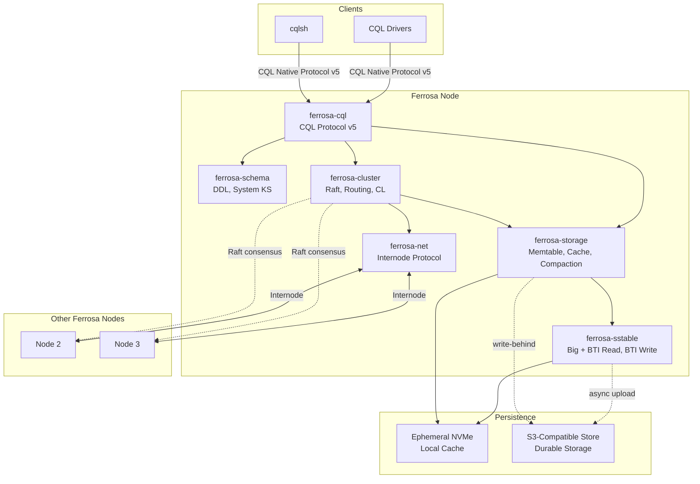
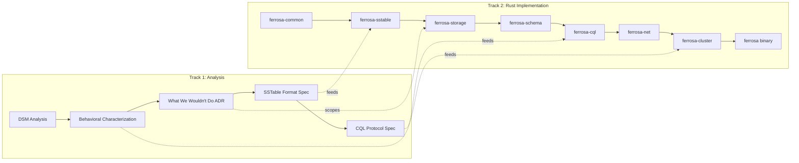

# System Overview

> Last updated: 2026-03-11
> Status: Approved

## Overview

Ferrosa is a distributed database that speaks CQL, backed by S3-compatible object storage for durability and ephemeral local storage for performance. It is built as independent Rust crates, informed by a deep analysis of Apache Cassandra's architecture but designed as idiomatic Rust from the ground up.

## System Diagram

## Design Principles

1. **S3 as source of truth** — nodes are ephemeral, SSTables live in object storage
1. **CQL compatibility** — existing drivers and tools work unchanged
1. **Rust-native** — idiomatic Rust with clean ownership, not a Java transliteration
1. **Cassandra's consistency model** — tunable CL (ONE, QUORUM, ALL) preserved
1. **Independent crates** — each subsystem testable and usable on its own

## Two Parallel Tracks

Track 1 (Java analysis) informs Track 2 (Rust implementation). Track 1 is analysis only, not a deliverable. Track 2a (`ferrosa-sstable`) can start immediately.

## Key Architectural Decisions

| Decision | Choice | Rationale |
|----------|--------|-----------|
| Deployment | AWS-first, flag lock-in | Start concrete, stay portable |
| Storage | Write-behind async S3 | Minimal write latency, quorum mitigates loss window |
| SSTable | Layered: read Big+BTI, write BTI | Migration path + room to innovate |
| Protocol | CQL client compat, own internode | Apps work unchanged, clean internal design |
| Consensus | Raft metadata, tunable CL | Proven Rust libs + Cassandra semantics |
| Partitioner | Murmur3Partitioner | Cassandra SSTable compatibility |

## AWS Lock-in Flags

Ferrosa is AWS-first but must remain portable to S3-compatible stores (MinIO, etc.):

- **S3 object metadata** (`x-amz-meta-*`): Standard across S3-compatible stores. No lock-in.
- **S3 client library**: Start with `aws-sdk-s3` (works with MinIO via endpoint override). Add trait abstraction for `object_store` crate (Apache Arrow) if broader backend support needed.
- **S3 conditional writes** (`If-None-Match`, Nov 2024): Not required for write-behind model. If used in future native format, flag as portability concern — MinIO supports them, other S3-compat stores may not.

## Research Items

Deferred but tracked for future investigation:

| Area | Options | Notes |
|------|---------|-------|
| Distributed transactions | Accord, Tempo, Janus, EPaxos | Evaluate when core is stable |
| Clock synchronization | HLC, TrueTime-like | Needed for cross-DC consistency |
| Transport protocol | QUIC (`quinn` crate) | Better for multi-DC, built-in multiplexing |
| Native SSTable format | S3-optimized: larger blocks, content-addressed, embedded metadata | Behind feature flag, after BTI is solid |
| Object store abstraction | `object_store` crate (Apache Arrow) | For GCS/Azure/MinIO portability |
| S3 conditional writes | `If-None-Match` for consistency | Portability concern |

## References

- Fleming et al., "Hunter: Using Change Point Detection to Hunt for Performance Regressions," ICPE '23. [Paper](https://dl.acm.org/doi/10.1145/3578244.3583719) | [Code](https://github.com/datastax-labs/hunter)
- DeCandia et al., "Dynamo: Amazon's Highly Available Key-value Store," SOSP '07. [Paper](https://www.allthingsdistributed.com/files/amazon-dynamo-sosp2007.pdf)
- [Apache Cassandra Source](https://github.com/apache/cassandra)
- [AWS S3 Object Metadata](https://docs.aws.amazon.com/AmazonS3/latest/userguide/UsingMetadata.html)
- [Sprites Documentation](https://docs.sprites.dev/)
- [fly.io Documentation](https://fly.io/docs/)

## Related Specs

- [Components](components.md) — crate architecture details
- [Data Flow](data-flow.md) — write/read paths and S3 lifecycle
- [Testing](testing.md) — test infrastructure and suites
