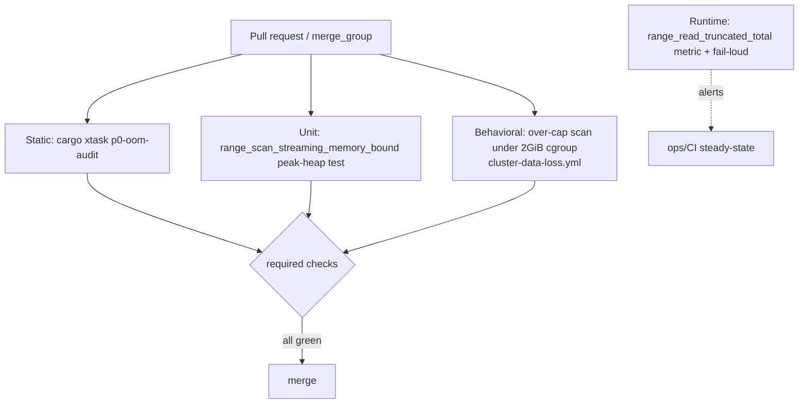

# P0 OOM Guard

## 1. Problem (current state)

On 2026-06-29 the cluster-coordinated `ALLOW FILTERING` scan path regressed from
streaming to materializing:

- `ferrosa-cluster/src/write_path.rs:27` — `DEFAULT_RANGE_READ_LIMIT = 10_000`.
- `range_read_limited_rows` (write_path.rs:731) clamps to it and returns `Vec<Partition>`.
- `coordinator/range_read_stream.rs:232` — `Vec::with_capacity(limit)` collects the window.
- `ferrosa-cql/src/router.rs:4673-4792` — the degraded `IndexScanWithFilter`/`SingleIndex`
  arm routes scans here; the `row_limit > 0` branch passes `DEFAULT_RANGE_READ_LIMIT`.

Two failure modes from one cap: **OOM** (materialized Vec on a 2 GiB cgroup →
`exit 137`, crash loop, quorum loss) and **silent truncation** (>10k partitions
dropped with no error — a correctness/data-loss bug). PR #230 fixed the COUNT
path; the SELECT arm remains (forge `t_15417b35`).

### Why CI did not catch it

1. **A source-grep test cemented the bug.** `range_read_stream.rs:2504`
   (`coordinate_streaming_range_read_does_not_call_vec_local_read`) `include_str!`s
   its own source and asserts the body **contains** `while partitions.len() < limit`
   — i.e. it required the materializing loop to exist. Green while behavior was broken.
2. **No behavioral coverage** exercised a scan past the cap or bounded peak memory.
3. **Magic read caps** (`DEFAULT_RANGE_READ_LIMIT`) were introduced with no lint.
4. **Silent partial results** had no fail-loud signal or metric.
5. **Required-check gap** — the merge queue once skipped the integration job entirely
   (see the comment now at `ci.yml:448-451`); a red run could not gate the merge.

## 2. Decisions (decision record)

| # | Decision | Rationale |
|---|----------|-----------|
| D1 | Defense in depth: static audit **and** behavioral gate **and** runtime metric. | Each layer covers the others' blind spots. The static audit catches the shape at compile time; the behavioral gate catches semantics; the metric catches production drift. |
| D2 | Static analysis is **AST-based** (`syn`), never source-string `.contains()`. | Source-grep tests caused this (they certified the bug). Ban that style; the audit must parse, not grep. |
| D3 | Allowed materialization requires a **checked-in whitelist entry** (reason, bound, owner, expiry). | No bare `#[allow]`. Exceptions are explicit, bounded, and expire. |
| D4 | A capped read that hits its cap with more data available must **fail loud** (error or paging token) + increment a metric — never silently truncate. | Truncation is data loss; silence is the worst outcome (safety: fail-loud philosophy). |
| D5 | All guards are **required merge-queue checks** (`merge_group` arm + ruleset). | The 2026-06-29 red PR slipped because a check wasn't required in the queue. |
| D6 | Behavioral over-cap test runs **under the production cgroup limit** against a real cluster. | Only an under-2-GiB scan of >cap rows reproduces both OOM and truncation. Extend existing `cluster-data-loss.yml`. |

## 3. Architecture — the guard layers

### Layer 1 — Static AST audit (`cargo xtask p0-oom-audit`)
New `xtask` crate (none exists today). Uses `syn` over the crates listed in
`oom_audit::AUDIT_CRATES`. Fails on:
- a fn whose name contains `stream` returning `Vec<T>`/`Result<Vec<T>>`/Vec-alias;
- production returns of `Vec<Partition>`/`Vec<Row>` not whitelisted;
- `Vec::with_capacity(limit)` where `limit` derives from paging/query/user input;
- `while let Some(x) = stream.next().await { vec.push(x?) }` accumulation;
- CQL broad-scan call sites invoking `range_read_limited_rows` / `coordinate_*_limited_rows` unwhitelisted.
Whitelist: `specs/p0-oom-guard/oom-audit-allow.toml` (reason/bound/owner/expiry).

**Coverage is exhaustive by default (2026-07 extension, forge t_2487eeb7).** The
audited-crate set was originally a hand-maintained list, which made coverage
opt-in — and opt-in coverage rots. `ferrosa-graph` and `ferrosa-sparql` both grew
query-sized serving paths, and shipped real materialization OOMs, while sitting
entirely outside the gate.

Every workspace member must now be either in `AUDIT_CRATES` or in
`NON_SERVING_CRATES` with the reason it owns no query-sized path. A crate in
neither set produces an `unclassified-crate` finding, so a newly added crate
fails the audit instead of silently widening the blind spot. The check runs in
the binary (not only in unit tests) and treats an unreadable workspace manifest
as a finding — unknown coverage must never read as a clean run.

The same change taught `returns-vec-partition-or-row` about `Vec<VirtualRow>`.
`VirtualTable::read` returns a whole table while `visit_rows` streams, and the
trait docs already tell large/live tables to override the visitor; the rule is
what holds them to it. That shape alone surfaced 21 findings inside crates the
gate was *already* auditing.

Known gap: allow entries that omit `symbol` suppress a whole (file, rule) pair,
so a *new* violation inside an already-allowlisted file is not caught. Tracked
as forge t_e1d5f83c; baseline triage is forge t_a49d88c3.

**Move-based-streaming Clone/Copy rules (2026-07 extension).** The original
`clone-on-row-data` matched only literal `partition/rows/cells` receivers; six
confirmed blind spots (`.cloned()` adapters, closure-param clones, renamed
bindings, `extend_from_slice`, UFCS `::clone`, accessor receivers) are closed by:
- `clone-on-row-data` (broadened): `.clone()/.to_vec()/.to_owned()` on row-data
  receivers — by NAME (incl. `chunk`/`fragment`, through `&`/`*`/parens and
  accessor methods) or by TYPE (any ident the fn binds to
  `Partition`/`Row`/`Cell`/`CellValue`, incl. behind `&`/`Vec`/`Option`/`Box`/
  `Arc`/slice — closes the renamed-binding gap);
- `cloned-stream-elements`: `.cloned()`/`.copied()` iterator adapters over a
  row-data or `stream`/`range_iter` chain (per-element copy of the whole
  stream); chains ending `.next()` are exempt (Option accessor, one element);
- `clone-in-scan-closure`: a copy of the closure param inside
  `map/filter/filter_map/…` over a row-data chain (`rows.iter().map(|r| r.clone())`);
- `copies-row-data-arg`: arg-position copies — `extend_from_slice(&rows)`,
  `Vec::from(&rows)`, UFCS `Partition::clone(&p)` / `Clone::clone(&partition)`;
- `copy-derive-large-type`: `derive(Copy)` on a struct with an array field
  ≥ 64 bytes or ≥ 12 fields (every implicit copy is a hidden bulk memmove).
`--root <path>` audits another checkout (e.g. a feature-branch worktree).

### Layer 2 — Behavioral gates
- **Unit (in repo, PR #230):** `ferrosa-cluster/tests/range_scan_streaming_memory_bound.rs`
  asserts streaming-scan peak heap is independent of partition count. Keep as a
  required check.
- **Cluster (extend `cluster-data-loss.yml`):** seed > `DEFAULT_RANGE_READ_LIMIT`
  rows, run `COUNT(*) ... ALLOW FILTERING` under the 2 GiB cgroup, assert full
  count (no truncation) and no `OOMKilled`/restart.

### Layer 3 — Runtime fail-loud
`range_read_truncated_total` counter in `ferrosa-storage/src/metrics.rs`,
incremented whenever a bounded read hits its cap with more data available; the
read returns an error or a continuation token, never a truncated `Vec`. Alert on
non-zero in CI steady state.

### Layer 4 — Remove the enabler
Delete `coordinate_streaming_range_read_does_not_call_vec_local_read`
(range_read_stream.rs:2504) and ban the `include_str!(self) + .contains()` test
style via the audit.

## 4. FMEA — failure modes of the guard itself

| Failure mode | Effect | S | O | D | RPN | Mitigation |
|---|---|--:|--:|--:|--:|---|
| Audit misses a new materializing path (novel shape) | Regression merges | 8 | 5 | 6 | 240 | Pair static audit with the behavioral over-cap gate (Layer 2) so semantics are checked even when the shape is novel. |
| Behavioral smoke runs under-scale (≤ cap rows) | OOM/truncation not reproduced | 8 | 4 | 7 | 224 | Pin seed count to `DEFAULT_RANGE_READ_LIMIT + margin`, read the constant from the binary; assert it in the test. |
| Guard check not in merge-queue required set | Red run can't gate merge (the original miss) | 9 | 3 | 4 | 108 | D5: add `merge_group` arm + ruleset required-status-check; add a meta-test asserting the job appears in the queue trigger. |
| Whitelist entry never expires / rubber-stamped | Materialization creeps back behind an allow | 6 | 5 | 5 | 150 | Expiry date is mandatory; audit fails on an expired entry. |
| Truncation metric never wired to an alert | Silent prod drift | 7 | 4 | 6 | 168 | Add the metric to the standing alert set; CI asserts the counter exists and is registered. |
| `syn` false positives block unrelated PRs | Audit disabled out of frustration | 5 | 4 | 4 | 80 | Scope to the four crates + scan-path modules; whitelist with proof; start in warn-mode for one release, then enforce. |

## 5. Project plan (phased)

**P0 — quick wins (this PR / immediate, low risk):**
- Delete the source-grep test `coordinate_streaming_range_read_does_not_call_vec_local_read` (forge `t_dbb9929b`).
- Fix the pre-push clippy hook to pass `--all-features` (forge `t_c1295013`) so `protocol_conformance` compiles.
- Confirm `range_scan_streaming_memory_bound` runs as a required check.

**P1 — static audit (`t_dbb9929b`):**
- New `xtask` crate + `p0-oom-audit` subcommand (`syn`), warn-mode first.
- Whitelist `oom-audit-allow.toml`. Wire into `ci.yml` as a job + pre-push hook.

**P2 — behavioral over-cap gate (D6):**
- Extend `cluster-data-loss.yml` with the over-cap COUNT-under-cgroup assertion.

**P3 — fail-loud truncation (D4):**
- `range_read_truncated_total` metric; convert silent caps to error/continuation; alert wiring.

**P4 — enforce + finish the underlying fix:**
- Flip the audit to enforce-mode; add `merge_group` ruleset required checks (D5).
- Land the SELECT-arm streaming fix (`t_15417b35`) and re-add the data-loss
  regression test green.

## 6. Traceability

- Epic: forge `t_110dd8a5` (eliminate materialization/allocation hot-path regressions).
- This guard: `t_dbb9929b` (child of the epic). Clippy hook: `t_c1295013`.
- Underlying engine fix: `t_15417b35` (SELECT arm) — green before P4 enforce.
- Source plan: `~/tmp/ferrosa-p0-oom-guard-plan.md`.
