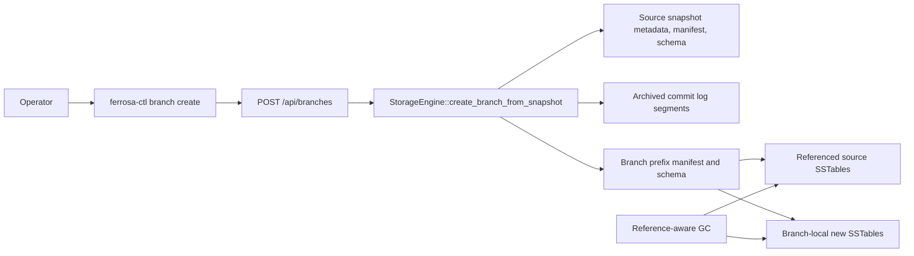
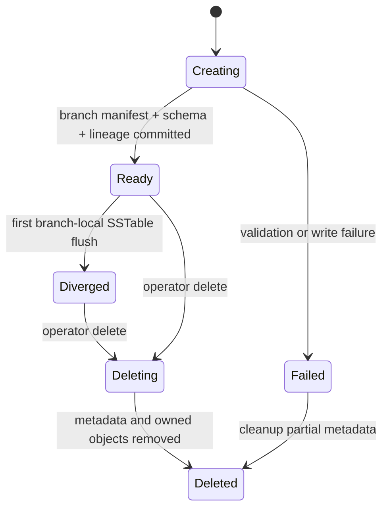

---
executive_summary:
  purpose: "Defines the PITR branch/copy feature for cheap object-storage forks in Ferrosa."
  critical_items:
    - "Branches are metadata forks, not deep SSTable copies."
    - "The S3 symlink analogue is an explicit object-reference manifest entry with source bucket, prefix, key, etag, version, and checksum metadata."
    - "The feature must expose a storage API, web API, `ferrosa-ctl branch` CLI, public website examples, and unit/integration tests."
    - "Branch deletion must not delete shared source SSTables until reference-aware GC proves no branch or snapshot still references them."
---

# PITR Branch/Copy Architecture

> Last updated: 2026-05-12
> Status: Draft

This document specifies how users create a writable branch from a point-in-time
recovery checkpoint. The design extends the existing S3-native PITR model: a
branch starts as a cheap metadata fork that references immutable SSTables from a
source snapshot and writes all new SSTables into a branch-local object-store
prefix.

## Current code anchors

- **Web API**: PITR routes live under `/api`: snapshots, archive status,
  restore preflight, and restore. Source: `ferrosa/src/web/snapshots.rs`.
- **CLI**: `ferrosa-ctl snapshot` and `ferrosa-ctl restore` are HTTP clients for
  the web control plane. Sources: `ferrosa-ctl/src/main.rs` and
  `ferrosa-ctl/src/commands.rs`.
- **Snapshot manager**: Snapshots write only `metadata.json`, `manifest.json`,
  and `schema.json`; SSTables are not copied. Source:
  `ferrosa-storage/src/snapshot/manager.rs`.
- **Live manifest**: `ManifestEntry` currently identifies an SSTable by local
  `id`, size, token range, and timestamp range. Source:
  `ferrosa-storage/src/manifest.rs`.
- **Restore**: Restore validates snapshot metadata and downloads referenced
  SSTables into local cache. Source: `ferrosa-storage/src/restore/manager.rs`.

## Goals

1. Create a writable branch from an existing snapshot, optionally with a PITR
   cutoff inside the archived commit-log window.
1. Make branch creation cheap: copy only metadata, not SSTable objects.
1. Let branch writes diverge into a target prefix or bucket without mutating the
   source prefix.
1. Keep object lifecycle safe: a source object referenced by any branch or
   snapshot is protected from GC.
1. Expose the feature through storage code, HTTP API, CLI, tests, and public
   website examples.

## Non-goals

1. Cross-cluster online branching with live traffic cutover.
1. Deep materialized copies by default.
1. SQL/CQL-level branch switching inside one running process.
1. S3 object-versioning as a required dependency.
1. S3 symlink emulation through provider-specific redirects or zero-byte marker
   objects.

## User-facing workflow

```bash
# Capture a durable checkpoint.
ferrosa-ctl snapshot create before-maintenance --ttl-hours 168

# Create a cheap writable fork from that checkpoint.
ferrosa-ctl branch create staging-copy \
  --from-snapshot before-maintenance \
  --target-prefix branches/staging-copy

# Optionally replay archived commit log records up to a cutoff.
ferrosa-ctl branch create customer-debug \
  --from-snapshot before-maintenance \
  --point-in-time 2026-05-12T16:20:00Z \
  --target-prefix branches/customer-debug

# Inspect and remove branches.
ferrosa-ctl branch list
ferrosa-ctl branch delete customer-debug
```

## Architecture



Branch creation reads the source snapshot metadata, source snapshot manifest, and
source schema. It writes a new branch record and branch-local live manifest under
the target prefix. The manifest entries initially point at source objects; later
flushes and compactions add target-prefix entries.

## S3 symlink analogue: object-reference manifest entries

S3 does not provide symlinks. Ferrosa should model the link explicitly in the
manifest instead of relying on provider-specific behavior.

Extend manifest entries from local identifiers to durable object references:

```rust
pub struct ManifestEntry {
    pub id: String,
    pub object_ref: ObjectRef,
    pub size: u64,
    pub min_token: i64,
    pub max_token: i64,
    pub min_timestamp: i64,
    pub max_timestamp: i64,
}

pub struct ObjectRef {
    pub store_id: String,
    pub bucket: Option<String>,
    pub prefix: String,
    pub key: String,
    pub etag: Option<String>,
    pub version: Option<String>,
    pub sha256: Option<String>,
    pub owner_branch: Option<String>,
}
```

Interpretation:

- `store_id` identifies the configured object-store endpoint and credentials
  scope. This avoids silently referencing an object in a different account.
- `bucket` is optional for S3-compatible stores where the bucket is already part
  of the store configuration.
- `prefix` and `key` are the immutable source object location.
- `etag`, `version`, and `sha256` make stale or overwritten references fail loud.
- `owner_branch = None` means the entry comes from a source prefix or snapshot;
  `Some(branch)` means the branch wrote the object.

This gives Ferrosa symlink-like sharing without fake filesystem semantics:
metadata points to the canonical object, readers dereference it, and writers
append new objects in the branch prefix.

## Branch metadata layout

Use branch-local control objects under the configured control prefix:

```text
{prefix}/branches/{branch}/metadata.json
{prefix}/branches/{branch}/manifest.json
{prefix}/branches/{branch}/schema.json
{prefix}/branches/{branch}/lineage.json
```

`metadata.json` records the branch name, source snapshot, source node ID,
creation timestamp, optional PITR cutoff, target prefix, and lifecycle state.

`lineage.json` records source prefix/bucket and the source snapshot manifest
checksum. It is the audit trail that explains why branch entries may dereference
objects outside the branch prefix.

## API contract

Add routes under `/api` beside existing PITR routes:

- `GET /api/branches`: list branches and lineage summaries.
- `POST /api/branches`: create a branch from a snapshot/PITR checkpoint.
- `GET /api/branches/{name}`: return branch metadata and reference counts.
- `DELETE /api/branches/{name}`: delete branch metadata and branch-owned objects
  only.

Request body for `POST /api/branches`:

```json
{
  "name": "staging-copy",
  "from_snapshot": "before-maintenance",
  "point_in_time": "2026-05-12T16:20:00Z",
  "target_prefix": "branches/staging-copy",
  "target_bucket": null,
  "fail_if_target_exists": true
}
```

Successful response:

```json
{
  "name": "staging-copy",
  "source_snapshot": "before-maintenance",
  "source_prefix": "prod",
  "target_prefix": "branches/staging-copy",
  "created_at": "2026-05-12T16:21:00Z",
  "point_in_time": "2026-05-12T16:20:00Z",
  "referenced_sstables": 128,
  "branch_owned_sstables": 0,
  "state": "ready"
}
```

Validation rules:

1. Branch names reuse snapshot name validation: alphanumeric, `_`, `-`, max 128
   characters.
1. `target_prefix` must not equal the source prefix.
1. `target_prefix` must be empty or already contain a matching branch record,
   unless `fail_if_target_exists = false` is explicitly requested.
1. `point_in_time` must be at or after the snapshot commit-log position and
   within archived segment retention.
1. Source snapshot manifest checksum must match the source metadata before any
   branch metadata is written.

## CLI contract

Add a top-level `branch` command to `ferrosa-ctl`:

```text
ferrosa-ctl branch create <name>
  --from-snapshot <snapshot>
  [--point-in-time <rfc3339>]
  --target-prefix <prefix>
  [--target-bucket <bucket>]
  [--force]

ferrosa-ctl branch list
ferrosa-ctl branch describe <name>
ferrosa-ctl branch delete <name> [--force]
```

The CLI remains a thin HTTP client, matching `snapshot` and `restore`. Output
should be human-readable by default and add `--json` later if the broader CLI
standardizes machine output.

Implementation note: existing `restore` CLI code sends `snapshot_name`, while
`RestoreRequest` expects `snapshot`. Fix that contract drift before using it as
copy/paste scaffolding for branch commands.

## Copy-on-write lifecycle



Writes after branch startup use the branch's target prefix. Compaction inside a
branch reads both referenced source SSTables and branch-owned SSTables, then
writes compacted output into the branch prefix. Once compaction supersedes a
source-referenced SSTable inside that branch, the branch manifest can drop its
reference, but source GC still checks every snapshot and branch before deleting
objects.

## Garbage collection and retention

Reference-aware GC must treat these as roots:

1. Live manifest entries in each prefix.
1. Snapshot manifests under each prefix.
1. Branch manifests and lineage records.
1. Archived commit-log ranges required by branch PITR cutoffs.

Deleting a branch removes:

- branch metadata, manifest, schema, and lineage objects;
- branch-owned SSTables no longer referenced by any live branch/snapshot;
- branch-local archived commit-log objects, if branch writes are archived.

Deleting a branch must not delete source objects referenced by source snapshots,
source live manifests, or other branches.

## Testing requirements

Storage tests:

1. Creating a branch from a snapshot writes branch metadata, schema, lineage, and
   manifest without copying SSTable bytes.
1. Branch manifest entries include durable `ObjectRef` data for source SSTables.
1. A branch write adds branch-owned SSTables under the target prefix.
1. Branch deletion keeps shared source SSTables and deletes only branch-owned
   unreferenced SSTables.
1. PITR cutoff validation rejects a cutoff outside archived commit-log retention.

Web API tests:

1. `POST /api/branches` returns `503` when S3 is not configured.
1. `POST /api/branches` returns `201` and branch metadata on success.
1. Duplicate branch names return `409`.
1. `GET /api/branches` includes source and target prefixes.
1. `DELETE /api/branches/{name}` is idempotent only if the API deliberately
   chooses idempotency; otherwise missing branch returns `404` like snapshots.

CLI tests:

1. Clap parsing for `branch create`, `list`, `describe`, and `delete`.
1. HTTP body generated by CLI matches API fields exactly.
1. Non-2xx HTTP responses fail loud and include endpoint, status, and body.

Website/doc example tests:

1. Public docs include a PITR branch example in `docs/database/`.
1. Commands in docs match Clap help and parse in `ferrosa-ctl` tests.
1. HTML examples do not claim deep-copy behavior; they describe cheap
   copy-on-write forks and lifecycle caveats.

## Documentation requirements

Add a public docs section under `docs/database/` that explains:

- what a PITR branch is;
- why creation is fast;
- how branch storage costs diverge over time;
- the lifecycle caveat that source retention must keep referenced objects alive;
- example commands for snapshot, branch create, list, describe, and delete.

Avoid internal terms such as "demo" or "seed". The page should be operator-facing
product documentation, not an implementation memo.

## Work breakdown

1. Manifest schema v2: add `ObjectRef`, serde compatibility for old entries, and
   dereference helpers.
1. Branch storage manager: create/list/describe/delete branch metadata and
   copy-on-write manifests.
1. GC root expansion: include branch manifests and lineage records.
1. Web API: add `/api/branches` routes and tests.
1. CLI: add `ferrosa-ctl branch` subcommands and tests.
1. Public docs: add website examples and parser-backed doc tests.
1. Integration: create a branch from a snapshot using object-store test backend,
   write into it, verify source data remains shared and branch data diverges.

## Open questions

No blocking product decisions remain from the first grill pass. Implementation
may still discover low-level compatibility choices, especially whether branch
references can span different configured buckets in the first release or only
different prefixes in the same bucket.
