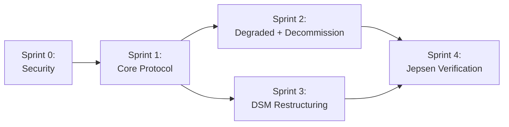

# Project Plan: Cluster Formation State Machine

> Date: 2026-04-01
> Status: Active
> Source: specs/cluster-formation-state-machine.md, specs/cluster-formation-architecture.md, specs/dsm-cluster-formation.md, specs/hazards-cluster-formation.md, specs/threat-model-cluster-formation.md, specs/fmea-cluster-formation.md
> Branch: fix/load-test-bugs → new branch per sprint

## Overview

Implement the cluster formation state machine as specified in `specs/cluster-formation-state-machine.md`. The work closes 7 known gaps, addresses 9 correctness hazards, mitigates 17 STRIDE threats (7 critical), and fixes 5 FMEA items with RPN ≥ 250. Restructures the controller module to reduce propagation cost from 34% to <22%.

## Sprint 0: Security Prerequisites (Priority 0 — Blocker)

**Goal:** Close the 2 highest-risk threats (CF-T9, CF-T11: unauthenticated admin API, risk 12) before any formation work. These allow any VPC-internal entity to promote nodes or destroy the cluster.

**Duration:** 2 days

| # | Task | Size | Source | Tests | Success Criteria |
|---|------|------|--------|-------|-----------------|
| 0.1 | Add bearer token auth to admin API | M | CF-T9, CF-T11 | Integration: unauthenticated requests rejected with 401 | `FERROSA_ADMIN_TOKEN` env var required; all /api/cluster/* routes protected |
| 0.2 | Bind admin API to localhost by default | S | CF-T9 | Unit: default bind is 127.0.0.1:9090 | `FERROSA_ADMIN_BIND` overrides for production |
| 0.3 | Add quorum safety check to decommission | S | CF-T11 | Unit: refuse decommission if remaining < quorum | `can_decommission()` check before LeaveNode proposal |
| 0.4 | Audit logging for all admin API calls | S | CF-T9, CF-T11 | Unit: promote/decommission/add-node logged with caller | tracing::info! with operation, caller IP, result |

**Sprint 0 Definition of Done:**
- No unauthenticated admin API access
- Decommission refuses to break quorum

## Sprint 1: Core Formation Protocol (Priority 1 — Critical)

**Goal:** Nodes form a full mesh cluster from hub-and-spoke seeds. No more stuck-in-Pair bug.

**Duration:** 1 week

| # | Task | Size | Source | Tests | Success Criteria |
|---|------|------|--------|-------|-----------------|
| 1.1 | Add `FormationState` enum replacing `DeploymentMode` | S | Arch ADR-2 | Unit: all valid transitions, reject invalid | `FormationState` has Standalone, Pair, Forming, Cluster, DegradedPair, DegradedCluster variants with `can_transition_to()` |
| 1.2 | Add `ClusterInvite` / `ClusterInviteAck` messages | S | Spec Gap #1 | Unit: encode/decode roundtrip; integration: 3-node formation | New `MsgType` variants in ferrosa-net codec, Message enum |
| 1.3 | Implement `ClusterInvite` handler in ModeController | M | Spec Gap #1 | Integration: hub-and-spoke topology forms full mesh | Handler connects to unknown peers from invite, re-broadcasts to newly discovered peers |
| 1.4 | Add `Forming` state + `transition_to_forming()` | M | Spec Gap #2 | Unit: Pair→Forming on 2nd peer; Forming→Cluster after Raft | `transition_to_cluster` split into `transition_to_forming` + `transition_to_cluster` |
| 1.5 | Add Forming→Pair timeout fallback | S | Spec Gap #6, Hazard P1-4 | Unit: timeout triggers fallback; integration: 3rd node disappears | Configurable timeout (default 60s), logs warning, returns to Pair |
| 1.6 | Switch role assignment to connection direction | S | Spec Gap #1, Hazard P1-5 | Unit: inbound=Primary, outbound=Secondary | Remove `PairRole::elect()`, use `need_reverse`/`is_inbound` flag |
| 1.7 | Fix degraded mode to preserve pair context | M | Spec Gap #7 | Unit: disconnect preserves DegradedPair state; reconnect restores Pair | No more resetting to Standalone on peer disconnect |
| 1.8 | Block DDL during Forming window | S | Hazard P0-1 | Unit: DDL returns error during Forming; DDL works after Cluster | DdlPath::Blocked variant, or queue + replay |
| 1.9 | Replace `std::sync::Mutex` with `parking_lot::Mutex` | S | Hazard P1-1 | Existing tests pass | 17 `.lock().unwrap()` calls become `.lock()` (no poison) |
| 1.10 | Add transition lock (CAS or mutex) for mode changes | S | Hazard P1-3, CF-T6 | Unit: concurrent transitions don't double-fire | `ArcSwap::compare_and_swap` or dedicated transition lock |
| 1.11 | ClusterInvite: dedup by initiator + epoch, rate limit, independent handshake validation | M | CF-T1, CF-T2, CF-T3 | Unit: poisoned invite rejected; duplicate ignored; rate > 5/min rejected | Invite format includes epoch counter; peers validated via mTLS before trust |
| 1.12 | Freeze peer list on entering Forming — only seed calls Raft::initialize() | M | CF-T15, CF-T17 | Unit: late arrivals not in initial membership; only 1 node calls initialize() | Canonical sorted membership from ClusterInvite; other nodes wait for AppendEntries |
| 1.13 | FERROSA_CLUSTER_MODE=pair enforcement (reject 3rd peer) | S | CF-T4 | Unit: pair mode rejects additional peer connections | Config guard in on_peer_connected |

**Sprint 1 Definition of Done:**
- `cargo test -p ferrosa-cluster` passes
- 3-node cluster forms from single-seed topology in integration test
- Forming timeout falls back to Pair if 3rd node disappears
- No `.lock().unwrap()` in production code

## Sprint 2: Degraded Modes + Decommission (Priority 2 — High)

**Goal:** Proper degraded state handling and graceful node removal.

**Duration:** 1 week

| # | Task | Size | Source | Tests | Success Criteria |
|---|------|------|--------|-------|-----------------|
| 2.1 | Implement `DegradedPair` state with operator promote | M | Spec T8a/T8b/T9 | Integration: primary fails, operator promotes secondary | `ferrosa-ctl promote` transitions DegradedPair → Pair(Primary) |
| 2.2 | Implement `DegradedCluster` state | M | Spec T6a-T6c | Integration: follower fails, cluster continues; quorum lost, reads-only | Raft quorum loss detected, writes blocked, stale reads served |
| 2.3 | Implement decommission data streaming (T5a) | L | Spec Gap #5 | Integration: follower decommission streams all data | `LeaveNode` → stream data → `RemoveNode` via Raft |
| 2.4 | Implement leader decommission via transfer (T5b) | M | Spec T5b | Integration: leader decommission transfers leadership first | `transfer_leader()` → proceed as T5a |
| 2.5 | Move approval check inside Raft command | S | Spec Gap #7, Hazard | Unit: unapproved node rejected at Raft apply | `RaftOp::JoinNode` checks approval in state machine `apply()` |
| 2.6 | Track spawned tasks with JoinSet | M | Hazard P1-2 | Unit: panic in spawned task is logged/propagated | All 7 `tokio::spawn` calls use JoinSet or store JoinHandle |
| 2.7 | Add CancellationToken + shutdown() | M | Hazard P2-2 | Integration: graceful shutdown cancels in-flight transitions | All spawned tasks respect cancellation |
| 2.8 | Replace hardcoded sleeps with condition waits | M | Hazard P2-1 | Unit: transitions complete without fixed delays | `tokio::sync::Notify` or `watch` channels for readiness |

**Sprint 2 Definition of Done:**
- Operator can promote secondary when primary dies
- Follower decommission streams data before removal
- Leader decommission transfers leadership first
- No fire-and-forget spawns

## Sprint 3: DSM Restructuring (Priority 3 — Medium)

**Goal:** Reduce propagation cost from 34% to <22% by fixing structural issues.

**Duration:** 1 week

| # | Task | Size | Source | Tests | Success Criteria |
|---|------|------|--------|-------|-----------------|
| 3.1 | Extract `types.rs` from raft/mod (NodeInfo, NodeState, Token) | S | DSM Rec #1 | All existing tests pass | ring/mod no longer imports from raft/mod |
| 3.2 | Extract `wire.rs` from pair/coordinator (encode/decode_mutation) | S | DSM Rec #2 | All existing tests pass | coordinator/* no longer imports from pair/coordinator |
| 3.3 | Split controller.rs into controller/{mod,pair,cluster,recovery}.rs | L | DSM Rec #3 | All existing tests pass | controller.rs < 400 lines, each sub-module independently testable |
| 3.4 | Extract select_index_ready_replicas to ring/ | S | DSM Rec #4 | All existing tests pass | raft/state_machine no longer imports from coordinator/read |
| 3.5 | Cap connected_peers and pending_joins | S | Hazard P2-3 | Unit: reject connections beyond max_cluster_size | Configurable limits with clear error messages |

**Sprint 3 Definition of Done:**
- `cargo clippy --all-targets` clean
- No layering violations
- controller.rs < 400 lines
- Propagation cost estimated < 22%

## Sprint 4: Jepsen-Style Verification (Priority 2 — High)

**Goal:** Verify formation protocol correctness under network partitions and node failures.

**Duration:** 2 weeks

| # | Task | Size | Source | Tests | Success Criteria |
|---|------|------|--------|-------|-----------------|
| 4.1 | Formation under partition: seed unreachable during Forming | L | Threat model | Jepsen: partition seed during 3-node formation | Forming timeout fires, nodes fall back to Pair |
| 4.2 | Split brain prevention: promote during partition | L | Threat model | Jepsen: partition pair, promote both sides, heal | Only one side accepts writes; conflict detected on heal |
| 4.3 | Decommission during partition | M | FMEA | Jepsen: partition during decommission streaming | Decommission retries or aborts cleanly |
| 4.4 | Concurrent formation: 5 nodes join simultaneously | M | FMEA | Integration: 5 nodes all connect to seed within 1s | All 5 nodes reach Cluster mode with consistent Raft membership |
| 4.5 | Message replay/duplication: duplicate ClusterInvite | S | FMEA | Unit: duplicate invite is idempotent | No double-connection, no state corruption |
| 4.6 | Schema consistency after formation | M | Hazard P0-1 | Integration: DDL during formation, verify all nodes converge | All nodes have identical schema after cluster forms |

**Sprint 4 Definition of Done:**
- All Jepsen-style tests pass
- No split brain detected under any test scenario
- Schema convergence verified after every formation test

## Risk Register

| Risk | Likelihood | Impact | Mitigation | Owner |
|------|-----------|--------|------------|-------|
| **Unauthenticated admin API** (CF-T9/T11, risk 12) | High | Critical | Bearer token + localhost bind | Sprint 0 |
| **Raft membership race** (CF-T17, risk 9) | Medium | Critical | Only seed calls initialize() | Sprint 1 |
| ClusterInvite poisoning (CF-T1, risk 8) | Medium | High | Independent handshake validation | Sprint 1 |
| Dual-Primary after partition (CF-T8, risk 8) | Low | Critical | Promotion epoch + conflict resolution | Sprint 2 |
| ClusterInvite amplification (CF-T2) | Medium | High | Dedup by initiator, rate limit, epoch | Sprint 1 |
| DDL race during Forming (F3, RPN 378) | Medium | Critical | Block DDL during Forming | Sprint 1 |
| Missing reverse pools (F5, RPN 280) | High | High | Wait for pools before Raft init | Sprint 1 |
| Split brain during role migration | Low | Critical | Atomic cutover, single-version deployment | Sprint 1 |
| Raft init panic in spawned task | Medium | High | JoinSet tracking, panic hook | Sprint 2 |
| Data loss during decommission crash (F4, RPN 250) | Low | Critical | Idempotent streaming, S3 backup | Sprint 2 |
| Controller refactor breaks transitions | Medium | Medium | Test coverage before refactor | Sprint 3 |

## Dependencies

Sprint 0 (security prerequisites) blocks everything. Sprint 1 must complete before Sprints 2 and 3 (they build on the new FormationState). Sprint 4 requires both Sprint 2 (degraded modes to test) and Sprint 3 (clean structure for Jepsen harness).
