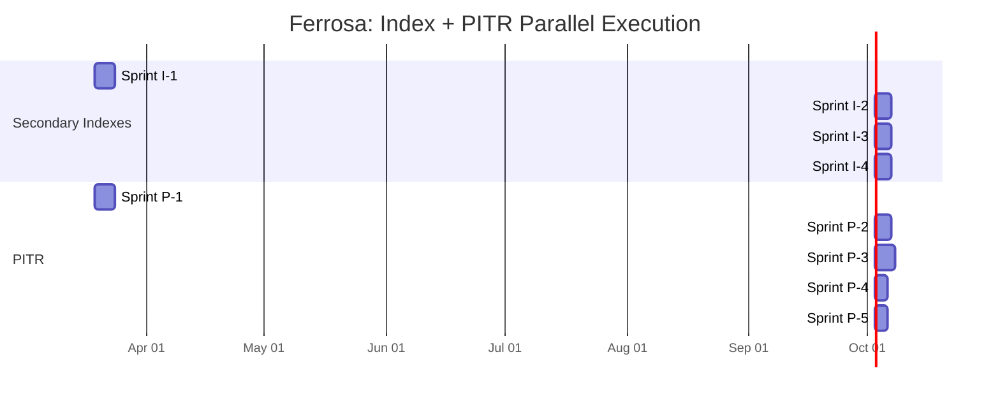

# Combined Project Plan: Secondary Indexes + Point-in-Time Recovery

> Last updated: 2026-03-18
> Status: Draft

## Parallel Workstreams

These two workstreams are independent and can execute simultaneously. They touch different subsystems with no code overlap.

## Workstream A: Secondary Indexes

**Owner**: Can be a separate subagent/developer from PITR
**Crates touched**: `ferrosa-index`, `ferrosa-storage` (memtable, store), `ferrosa-cql` (planner, router, parser)
**No overlap with PITR**: Index changes touch the read/write data path; PITR touches commit log archiving and snapshot management.

| Sprint | Focus | Size | Key Deliverable |
|--------|-------|------|-----------------|
| I-1 | MemtableIndex + sidecar files + `read_by_index` | L | Single index accelerates a point lookup |
| I-2 | Query planner + EXPLAIN + route_select wiring | M | SELECT uses indexes automatically |
| I-3 | Flush serialization + compaction merge + crash recovery | M | Indexes persist across restarts |
| I-4 | Multi-index intersection + full test suite | M | `WHERE a = x AND b = y` uses both indexes |

**Full task breakdown**: See [project-plan-secondary-index.md](project-plan-secondary-index.md)

## Workstream B: Point-in-Time Recovery

**Owner**: Can be a separate subagent/developer from Indexes
**Crates touched**: `ferrosa-storage` (commitlog, engine), `ferrosa` (CLI), `ferrosa-ctl`, web console
**No overlap with Indexes**: PITR changes touch the commit log archive path and snapshot/restore lifecycle.

| Sprint | Focus | Size | Key Deliverable |
|--------|-------|------|-----------------|
| P-1 | Commit log archiving to S3 | L | Closed segments auto-uploaded |
| P-2 | Snapshot management (create/list/delete) | M | `create_snapshot("daily")` freezes state |
| P-3 | Point-in-time restoration | L | `--restore-snapshot daily --restore-point-in-time <ts>` |
| P-4 | CLI commands + monitoring virtual tables | M | `ferrosa-ctl snapshot create/list/delete` |
| P-5 | Web console backup & restore UI | M | Dashboard card for snapshots + archive health |

**Full task breakdown**: See [pitr-project-plan.md](pitr-project-plan.md)

## Shared Component: StorageEngine

Both workstreams add methods to `StorageEngine`, but in non-overlapping areas:

| Workstream | New Methods | Subsystem |
|------------|-------------|-----------|
| Indexes | `read_by_index()`, `read_by_index_range()` | Memtable + SSTable read path |
| PITR | `create_snapshot()`, `open_from_snapshot()` | Commit log + S3 snapshot path |

No merge conflicts expected. Both can be developed on separate branches.

## Integration Points (After Both Complete)

Once both workstreams are done, two optional integration tasks:

1. **Sidecar index files in S3**: Upload sidecar index files alongside SSTables in the S3 write-behind path. Currently backlog for indexes, but PITR's S3 upload infrastructure makes it trivial.

1. **Index rebuild from snapshot**: When restoring from a snapshot, rebuild secondary indexes from the restored SSTables. Uses the same "startup rebuild" path from Index Sprint 3.

## Risk Summary (Combined)

| Risk | Workstream | Severity | Sprint |
|------|-----------|----------|--------|
| Low-selectivity index OOM | Index | Critical | I-1 |
| SSTable GC deletes snapshot data | PITR | Critical | P-2 |
| Stale index after crash | Index | High | I-3 |
| Timestamp boundary off-by-one | PITR | High | P-3 |
| Archiver falls behind under load | PITR | High | P-1 |
| Sidecar corruption → wrong results | Index | High | I-4 |
| Restore from wrong node | PITR | Critical | P-3 |

## Execution Strategy

**Option A (Recommended): Parallel subagents** — dispatch Index Sprint I-1 and PITR Sprint P-1 simultaneously as separate subagents. Review between sprints. No coordination needed until integration tasks.

**Option B: Interleaved** — alternate between workstreams sprint by sprint. Slower but keeps one developer in the loop on both.

## Related Specs

- [Secondary Index Pipeline](secondary-index-pipeline.md) — architecture
- [Index Threat Model](threat-model-secondary-index.md) — STRIDE analysis
- [Index FMEA](fmea-secondary-index.md) — failure modes
- [Index Project Plan](project-plan-secondary-index.md) — sprint breakdown
- [PITR Architecture](pitr.md) — architecture
- [PITR Threat Model](threat-model-pitr.md) — STRIDE analysis
- [PITR FMEA](pitr-fmea.md) — failure modes
- [PITR Project Plan](pitr-project-plan.md) — sprint breakdown
- [ADR-011: S3-Native PITR](decisions/011-s3-native-pitr.md) — design decision
