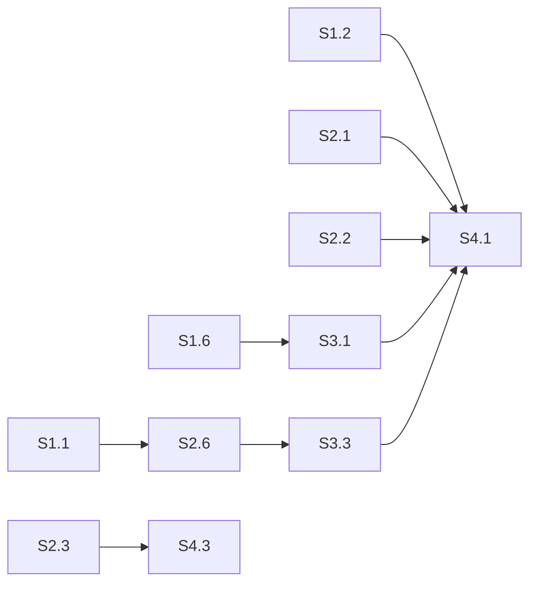

# Sprint Plan — Cluster Correctness & NTS Completion

> Created: 2026-04-02
> Status: Active
> Focus: Fix all remaining hazards, complete NTS support, close correctness gaps
> Predecessor: [project-plan-cluster-formation.md](project-plan-cluster-formation.md), [project-plan-correctness-sprints.md](project-plan-correctness-sprints.md)

---

## Sprint Overview

| Sprint | Focus | Duration | Gate |
|--------|-------|----------|------|
| **S1** | P0/P1 hazards + NTS read path | 1 week | `cargo test` green, NTS reads work on all replicas |
| **S2** | Correctness gaps (read fallback, hints, streaming) | 1 week | CL=ONE reads, hints stored on failure, full row streaming |
| **S3** | Formation robustness + repair | 1 week | Forming timeout tested, promotion epoch, anti-entropy |
| **S4** | Polish + Jepsen/driver compat | 1 week | C4 Jepsen runs, C8 driver compat, DSM coupling reduction |

---

## Sprint S1: P0/P1 Hazards + NTS Read Path

**Gate:** All P0/P1 hazards from hazard scan closed, NTS reads use `coordinate_read_nts()`.

| # | Task | Source | Size | Success Criteria | Tests |
|---|------|--------|------|-----------------|-------|
| S1.1 | Block or queue DDL during Forming window | P0-1, F3 (RPN 378) | S | DDL requests return `Unavailable` during Forming state, not silently dropped or applied to wrong path | `ddl_blocked_during_forming`, `ddl_resumes_after_cluster` |
| S1.2 | Wire `coordinate_read_nts()` into read path | NTS bug-B | M | SELECT with NTS keyspace routes through `coordinate_read_nts()`, LOCAL_QUORUM reads only local DC replicas | `nts_read_routes_to_local_dc`, `nts_read_local_quorum` |
| S1.3 | Validate DC name at `CREATE KEYSPACE` | NTS bug-C | S | `CREATE KEYSPACE ... NTS {'bogus_dc': '3'}` returns error if no node matches `bogus_dc` | `create_keyspace_nts_unknown_dc_rejected` |
| S1.4 | Switch `IpConnectionTracker` to `parking_lot::RwLock` | P1-6 | S | Poison impossible; CQL accept loop survives panics in connection handlers | `ip_tracker_survives_handler_panic` |
| S1.5 | Track 3 `tokio::spawn` calls via `spawn_tracked` | P1-7 | S | ClusterInviteHandler re-broadcast, mesh connect, and CQL broadcast store all tracked in JoinSet | Code review (grep for raw `tokio::spawn` in controller/) |
| S1.6 | Fix quorum calc to use fixed membership size | P1-8 | M | `required_for_quorum()` uses Raft-committed cluster size, not live `connected` count. Prevents false quorum restoration. | `quorum_uses_committed_size_not_connected` |
| S1.7 | Replace `std::sync::Mutex` with `parking_lot::Mutex` (17 instances) | P1-1 | S | `grep -r "std::sync::Mutex" ferrosa-cluster/src/controller/` returns 0 | Compile + existing tests |
| S1.8 | Add Forming timeout with Pair fallback | P1-4, F26 (RPN 140) | S | If Raft leader not elected within `formation_timeout_secs`, revert to Pair mode. Default 60s. | `forming_timeout_reverts_to_pair` |

---

## Sprint S2: Correctness Gaps (Read, Hints, Streaming)

**Gate:** CL=ONE reads try all replicas, hints stored on every failed write, streaming sends full rows.

| # | Task | Source | Size | Success Criteria | Tests |
|---|------|--------|------|-----------------|-------|
| S2.1 | CL=ONE read fallback to other replicas | Correctness gap #2 | M | `read_one_replica()` tries remaining replicas if preferred returns None. Read succeeds when data is on replica 2 but not replica 1. | `read_one_falls_back_to_second_replica` |
| S2.2 | Store hints on ALL failed replica writes | Correctness gap #3 | M | Hints stored for failed replicas regardless of quorum outcome. Below-quorum failures also generate hints. | `hints_stored_even_when_write_times_out` |
| S2.3 | Full row serialization in bootstrap streaming | Correctness gap #4 | M | `StreamedMutation` carries all cells, clustering keys, deletion info, liveness. Receiving node reconstructs full `Row`. | `streamed_row_roundtrip_all_cells` |
| S2.4 | Paginate bootstrap `read_range` | P1-9 | M | Bootstrap streaming uses paginated reads (e.g., 10k partitions per batch) instead of `usize::MAX`. No OOM on large tables. | `bootstrap_streaming_paginates_large_table` |
| S2.5 | Add pagination/truncation flag to `RangeReadHandler` | P1-10 | M | `RangeReadHandler` returns a truncation flag when hitting the 1M limit. Coordinator issues follow-up requests. | `range_read_truncation_flag_set` |
| S2.6 | Replace 5s bootstrap promotion delay with RPC barrier | P2-4, F27 (RPN 96) | M | Leader waits for `BootstrapComplete` RPC from all joining nodes before promoting. No fixed delay. | `promotion_waits_for_bootstrap_complete` |

---

## Sprint S3: Formation Robustness & Repair

**Gate:** Split-brain prevented on partition heal, repair module operational, DSM coupling reduced.

| # | Task | Source | Size | Success Criteria | Tests |
|---|------|--------|------|-----------------|-------|
| S3.1 | Promotion epoch (Lamport counter) | Correctness gap #6 | M | `force_promote` increments Lamport counter. On reconnect, higher counter wins. Prevents dual-promote split brain. | `dual_promote_higher_epoch_wins` |
| S3.2 | ClusterInvite peer connect handler | Correctness gap #5 | M | Nodes receiving ClusterInvite connect to unknown peers and re-broadcast. Hub-and-spoke resolves to full mesh. | `invite_triggers_full_mesh_3_nodes` |
| S3.3 | Anti-entropy repair module | Correctness gap #7 | L | Periodic Merkle tree comparison across replicas, stream missing data. Reuses existing streaming infrastructure. | `repair_detects_missing_partition`, `repair_streams_missing_data` |
| S3.4 | PeerManager broadcast map cleanup on disconnect | P2-5, F28 (RPN 90) | S | `on_peer_disconnected` removes stale broadcast entries. Map does not grow unbounded. | `broadcast_map_cleaned_on_disconnect` |
| S3.5 | LazyRaft retry on slow init | P2-6, F29 (RPN 90) | S | If 10s timeout exceeded, LazyRaft retries with backoff instead of returning None. Raft messages queued, not dropped. | `lazy_raft_retries_after_timeout` |
| S3.6 | `BroadcastResolver` trait to reduce PeerManager coupling | DSM rec #6 | M | Introduce trait to invert `state.rs → PeerManager` dependency. `net/peer` coupling target: 50 (down from 65). | DSM re-analysis |
| S3.7 | Make Raft heartbeat/election/snapshot config tunable | P2-7 | S | `ClusterConfig` fields for Raft timing. Environment variables for override. | `raft_config_from_env` |
| S3.8 | Return `Result` from `compute_partition_digest` | P2-8 | S | Serialization failures propagate instead of `unwrap_or_default()`. Read repair skips partitions with error instead of silently ignoring divergence. | `digest_error_propagated` |

---

## Sprint S4: Jepsen, Drivers, Polish

**Gate:** Jepsen standard tier zero anomalies, all 6 CQL drivers pass, SSTable-based streaming operational.

| # | Task | Source | Size | Success Criteria | Tests |
|---|------|--------|------|-----------------|-------|
| S4.1 | C4 live Jepsen runs | Correctness sprint C4 | L | `ferrosa-jepsen run --tier standard` on 3-node cluster reports zero anomalies. Elle/Knossos verification passes. | `FERROSA_TEST_CLUSTER_NODES` |
| S4.2 | C8 all-drivers CQL compat | Correctness sprint C8 | L | Python, Go, Node.js, Java, C#, Rust drivers execute full workload matrix against 3-node NTS cluster. T-032 standard. | Docker compose + driver test suites |
| S4.3 | SSTable-based streaming | Correctness gap #8 | L | Bootstrap sends SSTable component files via Bulk lane instead of per-row mutations. Order-of-magnitude faster for large datasets. | `sstable_streaming_roundtrip` |
| S4.4 | Connection-direction role assignment | P1-5 | S | Primary/Secondary determined by connection direction (who initiated), not UUID comparison. Eliminates tie-breaking edge cases. | `connection_direction_determines_role` |
| S4.5 | Remaining P2 polish | P2-1, P2-2, P2-3 | M | Replace sleeps with condition waits, add CancellationToken + shutdown(), cap unbounded collections. | Existing tests stay green |

---

## Risk Register

| Risk | Probability | Impact | Mitigation |
|------|------------|--------|-----------|
| NTS read path has subtle LOCAL_QUORUM bugs | Medium | High | S1.2 has dedicated test; follow with Jepsen in S4 |
| Anti-entropy repair is a large new module | Medium | Medium | Reuse existing streaming; start with single-table repair |
| Jepsen finds new bugs during S4 | High | Medium | Expected — log as BUG-### and fix in-sprint |
| SSTable streaming changes wire format | Low | High | Version the stream protocol; old mutation-based still works |
| Driver compat surfaces new CQL parser gaps | High | Medium | Fix as discovered; parser coverage already 81.8% |

---

## Dependencies

S1 blocks S2 (hazards must be closed before correctness work). S2+S3 block S4 (Jepsen runs need correct read/write paths). S3.3 (repair) depends on S2.6 (streaming completion barrier).
