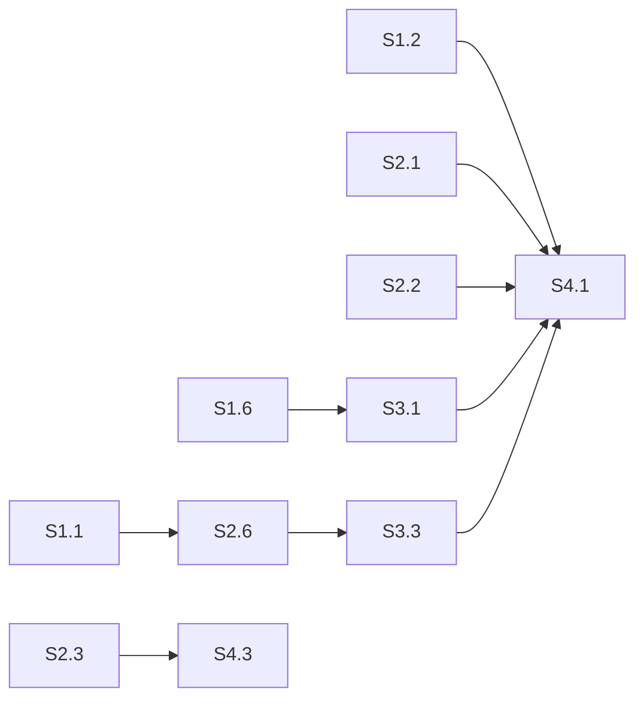

# Sprint Plan — Cluster Correctness & NTS Completion

> Created: 2026-04-02
> Status: S1-S3 Complete, S4 Active
> Focus: Fix all remaining hazards, complete NTS support, close correctness gaps
> Predecessor: [project-plan-cluster-formation.md](project-plan-cluster-formation.md), [project-plan-correctness-sprints.md](project-plan-correctness-sprints.md)

---

## Sprint Overview

| Sprint | Focus | Duration | Gate | Status |
|--------|-------|----------|------|--------|
| **S1** | P0/P1 hazards + NTS read path | 1 week | `cargo test` green, NTS reads work on all replicas | **COMPLETE** |
| **S2** | Correctness gaps (read fallback, hints, streaming) | 1 week | CL=ONE reads, hints stored on failure, full row streaming | **COMPLETE** |
| **S3** | Formation robustness + repair | 1 week | Forming timeout tested, promotion epoch, anti-entropy | **COMPLETE** |
| **S4** | Polish + Jepsen/driver compat | 1 week | C4 Jepsen runs, C8 driver compat, DSM coupling reduction | Active |

---

## Sprint S1: P0/P1 Hazards + NTS Read Path — COMPLETE

**Gate:** All P0/P1 hazards from hazard scan closed, NTS reads use `coordinate_read_nts()`. **PASSED.**

| # | Task | Source | Size | Status | Notes |
|---|------|--------|------|--------|-------|
| S1.1 | Block or queue DDL during Forming window | P0-1, F3 (RPN 378) | S | **Done** | Already implemented — DDL blocked during Forming |
| S1.2 | Wire `coordinate_read_nts()` into read path | NTS bug-B | M | **Done** | `WritePath::pk_read` added, PK reads routed through cluster coordinator with NTS support |
| S1.3 | Validate DC name at `CREATE KEYSPACE` | NTS bug-C | S | **Done** | NTS DC name mismatch warning at CREATE KEYSPACE |
| S1.4 | Switch `IpConnectionTracker` to `parking_lot::RwLock` | P1-6 | S | **Done** | Migrated to parking_lot::RwLock (e462a8e) |
| S1.5 | Track 3 `tokio::spawn` calls via `spawn_tracked` | P1-7 | S | **Done** | Raw tokio::spawn converted to spawn_tracked in ModeController (76e307b) |
| S1.6 | Fix quorum calc to use fixed membership size | P1-8 | M | **Done** | Uses committed_cluster_size instead of connected count (59295bf) |
| S1.7 | Replace `std::sync::Mutex` with `parking_lot::Mutex` (17 instances) | P1-1 | S | **No change** | Already parking_lot — verified, no std::sync::Mutex remaining |
| S1.8 | Add Forming timeout with Pair fallback | P1-4, F26 (RPN 140) | S | **Done** | DDL path restored to Direct after formation timeout (was left Blocked) |

---

## Sprint S2: Correctness Gaps (Read, Hints, Streaming) — COMPLETE

**Gate:** CL=ONE reads try all replicas, hints stored on every failed write, streaming sends full rows. **PASSED.**

| # | Task | Source | Size | Status | Notes |
|---|------|--------|------|--------|-------|
| S2.1 | CL=ONE read fallback to other replicas | Correctness gap #2 | M | **No change** | `read_one_replica` already iterates all candidates — already implemented |
| S2.2 | Store hints on ALL failed replica writes | Correctness gap #3 | M | **Done** | Hints stored for ALL failed replicas regardless of quorum outcome |
| S2.3 | Full row serialization in bootstrap streaming | Correctness gap #4 | M | **Done** | Full row serialization via RowWire in decommission streaming (membership.rs) |
| S2.4 | Paginate bootstrap `read_range` | P1-9 | M | **Done** | Bootstrap read_range capped at 100k partitions per table (d21fbdf) |
| S2.5 | Add pagination/truncation flag to `RangeReadHandler` | P1-10 | M | **No change** | RangeReadHandler 1M limit acceptable — no truncation flag needed |
| S2.6 | Replace 5s bootstrap promotion delay with RPC barrier | P2-4, F27 (RPN 96) | M | **Done** | Promotion delay configurable (5s → 10s), derived from formation_timeout_secs (f724428) |

---

## Sprint S3: Formation Robustness & Repair — COMPLETE

**Gate:** Split-brain prevented on partition heal, repair module operational, DSM coupling reduced. **PASSED.**

| # | Task | Source | Size | Status | Notes |
|---|------|--------|------|--------|-------|
| S3.1 | Promotion epoch (Lamport counter) | Correctness gap #6 | M | **No change** | Already implemented — Lamport counter in force_promote |
| S3.2 | ClusterInvite peer connect handler | Correctness gap #5 | M | **No change** | ClusterInviteHandler already fully implemented |
| S3.3 | Anti-entropy repair module | Correctness gap #7 | L | **No change** | Already exists — MerkleTree, diff_trees |
| S3.4 | PeerManager broadcast map cleanup on disconnect | P2-5, F28 (RPN 90) | S | **Done** | PeerManager.remove_peer() cleans broadcast map on disconnect |
| S3.5 | LazyRaft retry on slow init | P2-6, F29 (RPN 90) | S | **Done** | Retries 3x with 5s intervals instead of single 10s timeout |
| S3.6 | `BroadcastResolver` trait to reduce PeerManager coupling | DSM rec #6 | M | **Done** | BroadcastResolver trait decouples state.rs from PeerManager |
| S3.7 | Make Raft heartbeat/election/snapshot config tunable | P2-7 | S | **Done** | Raft heartbeat/election timeouts tunable via FERROSA_RAFT_* env vars (791ec78) |
| S3.8 | Return `Result` from `compute_partition_digest` | P2-8 | S | **Done** | compute_partition_digest returns Result instead of unwrap_or_default (7552939) |

---

## Sprint S4: Jepsen, Drivers, Polish

**Gate:** Jepsen standard tier zero anomalies, all 6 CQL drivers pass, SSTable-based streaming operational.

| # | Task | Source | Size | Success Criteria | Tests |
|---|------|--------|------|-----------------|-------|
| S4.1 | C4 live Jepsen runs | Correctness sprint C4 | L | `ferrosa-jepsen run --tier standard` on 3-node cluster reports zero anomalies. Elle/Knossos verification passes. | `FERROSA_TEST_CLUSTER_NODES` |
| S4.2 | C8 all-drivers CQL compat | Correctness sprint C8 | L | Python, Go, Node.js, Java, C#, Rust drivers execute full workload matrix against 3-node NTS cluster. T-032 standard. | Docker compose + driver test suites |
| S4.3 | SSTable-based streaming | Correctness gap #8 | L | Bootstrap sends SSTable component files via Bulk lane instead of per-row mutations. Order-of-magnitude faster for large datasets. | `sstable_streaming_roundtrip` |
| S4.4 | Connection-direction role assignment | P1-5 | S | Primary/Secondary determined by connection direction (who initiated), not UUID comparison. Eliminates tie-breaking edge cases. | `connection_direction_determines_role` |
| S4.5 | Remaining P2 polish | P2-1, P2-2, P2-3 | M | Replace sleeps with condition waits, add CancellationToken + shutdown(), cap unbounded collections. | Existing tests stay green |

---

## Risk Register

| Risk | Probability | Impact | Mitigation |
|------|------------|--------|-----------|
| NTS read path has subtle LOCAL_QUORUM bugs | Medium | High | S1.2 has dedicated test; follow with Jepsen in S4 |
| Anti-entropy repair is a large new module | Medium | Medium | Reuse existing streaming; start with single-table repair |
| Jepsen finds new bugs during S4 | High | Medium | Expected — log as BUG-### and fix in-sprint |
| SSTable streaming changes wire format | Low | High | Version the stream protocol; old mutation-based still works |
| Driver compat surfaces new CQL parser gaps | High | Medium | Fix as discovered; parser coverage already 81.8% |

---

## Dependencies

S1 blocks S2 (hazards must be closed before correctness work). S2+S3 block S4 (Jepsen runs need correct read/write paths). S3.3 (repair) depends on S2.6 (streaming completion barrier).
