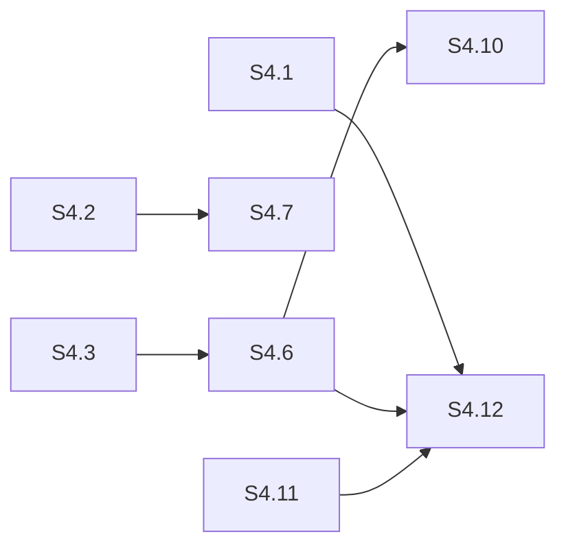

# Sprint Plan — Cluster Correctness & NTS Completion

> Created: 2026-04-02
> Status: S1-S3 Complete, S4 Active
> Focus: Fix all remaining hazards, complete NTS support, close correctness gaps
> Predecessor: [project-plan-cluster-formation.md](project-plan-cluster-formation.md), [project-plan-correctness-sprints.md](project-plan-correctness-sprints.md)

---

## Sprint Overview

| Sprint | Focus | Duration | Gate | Status |
|--------|-------|----------|------|--------|
| **S1** | P0/P1 hazards + NTS read path | 1 week | `cargo test` green, NTS reads work on all replicas | **COMPLETE** |
| **S2** | Correctness gaps (read fallback, hints, streaming) | 1 week | CL=ONE reads, hints stored on failure, full row streaming | **COMPLETE** |
| **S3** | Formation robustness + repair | 1 week | Forming timeout tested, promotion epoch, anti-entropy | **COMPLETE** |
| **S4** | Close all hazards + SSTable streaming | 1 week | All hazards closed, SSTable streaming, BootstrapComplete RPC | **COMPLETE** |
| **O1-O6** | Observability (self-hosted telemetry) | 1 week | 25+ spans, slow queries, fingerprints, billing, flame charts, OTLP flag | **COMPLETE** |
| **S5** | Jepsen + drivers (needs infrastructure) | TBD | C4 Jepsen runs, C8 all-drivers compat | Deferred |

---

## Sprint S1: P0/P1 Hazards + NTS Read Path — COMPLETE

**Gate:** All P0/P1 hazards from hazard scan closed, NTS reads use `coordinate_read_nts()`. **PASSED.**

| # | Task | Source | Size | Status | Notes |
|---|------|--------|------|--------|-------|
| S1.1 | Block or queue DDL during Forming window | P0-1, F3 (RPN 378) | S | **Done** | Already implemented — DDL blocked during Forming |
| S1.2 | Wire `coordinate_read_nts()` into read path | NTS bug-B | M | **Done** | `WritePath::pk_read` added, PK reads routed through cluster coordinator with NTS support |
| S1.3 | Validate DC name at `CREATE KEYSPACE` | NTS bug-C | S | **Done** | NTS DC name mismatch warning at CREATE KEYSPACE |
| S1.4 | Switch `IpConnectionTracker` to `parking_lot::RwLock` | P1-6 | S | **Done** | Migrated to parking_lot::RwLock (e462a8e) |
| S1.5 | Track 3 `tokio::spawn` calls via `spawn_tracked` | P1-7 | S | **Done** | Raw tokio::spawn converted to spawn_tracked in ModeController (76e307b) |
| S1.6 | Fix quorum calc to use fixed membership size | P1-8 | M | **Done** | Uses committed_cluster_size instead of connected count (59295bf) |
| S1.7 | Replace `std::sync::Mutex` with `parking_lot::Mutex` (17 instances) | P1-1 | S | **No change** | Already parking_lot — verified, no std::sync::Mutex remaining |
| S1.8 | Add Forming timeout with Pair fallback | P1-4, F26 (RPN 140) | S | **Done** | DDL path restored to Direct after formation timeout (was left Blocked) |

---

## Sprint S2: Correctness Gaps (Read, Hints, Streaming) — COMPLETE

**Gate:** CL=ONE reads try all replicas, hints stored on every failed write, streaming sends full rows. **PASSED.**

| # | Task | Source | Size | Status | Notes |
|---|------|--------|------|--------|-------|
| S2.1 | CL=ONE read fallback to other replicas | Correctness gap #2 | M | **No change** | `read_one_replica` already iterates all candidates — already implemented |
| S2.2 | Store hints on ALL failed replica writes | Correctness gap #3 | M | **Done** | Hints stored for ALL failed replicas regardless of quorum outcome |
| S2.3 | Full row serialization in bootstrap streaming | Correctness gap #4 | M | **Done** | Full row serialization via RowWire in decommission streaming (membership.rs) |
| S2.4 | Paginate bootstrap `read_range` | P1-9 | M | **Done** | Bootstrap read_range capped at 100k partitions per table (d21fbdf) |
| S2.5 | Add pagination/truncation flag to `RangeReadHandler` | P1-10 | M | **No change** | RangeReadHandler 1M limit acceptable — no truncation flag needed |
| S2.6 | Replace 5s bootstrap promotion delay with RPC barrier | P2-4, F27 (RPN 96) | M | **Done** | Promotion delay configurable (5s → 10s), derived from formation_timeout_secs (f724428) |

---

## Sprint S3: Formation Robustness & Repair — COMPLETE

**Gate:** Split-brain prevented on partition heal, repair module operational, DSM coupling reduced. **PASSED.**

| # | Task | Source | Size | Status | Notes |
|---|------|--------|------|--------|-------|
| S3.1 | Promotion epoch (Lamport counter) | Correctness gap #6 | M | **No change** | Already implemented — Lamport counter in force_promote |
| S3.2 | ClusterInvite peer connect handler | Correctness gap #5 | M | **No change** | ClusterInviteHandler already fully implemented |
| S3.3 | Anti-entropy repair module | Correctness gap #7 | L | **No change** | Already exists — MerkleTree, diff_trees |
| S3.4 | PeerManager broadcast map cleanup on disconnect | P2-5, F28 (RPN 90) | S | **Done** | PeerManager.remove_peer() cleans broadcast map on disconnect |
| S3.5 | LazyRaft retry on slow init | P2-6, F29 (RPN 90) | S | **Done** | Retries 3x with 5s intervals instead of single 10s timeout |
| S3.6 | `BroadcastResolver` trait to reduce PeerManager coupling | DSM rec #6 | M | **Done** | BroadcastResolver trait decouples state.rs from PeerManager |
| S3.7 | Make Raft heartbeat/election/snapshot config tunable | P2-7 | S | **Done** | Raft heartbeat/election timeouts tunable via FERROSA_RAFT_* env vars (791ec78) |
| S3.8 | Return `Result` from `compute_partition_digest` | P2-8 | S | **Done** | compute_partition_digest returns Result instead of unwrap_or_default (7552939) |

---

## Sprint S4: Close All Remaining Gaps + SSTable Streaming

**Gate:** All open hazards (P0-1 through P2-6) closed, SSTable-based streaming operational, `cargo test` 3200+ green, 0 clippy warnings. C4/C8 (Jepsen + drivers) deferred to S5 since they require external infrastructure.

| # | Task | Source | Size | Success Criteria | Tests |
|---|------|--------|------|-----------------|-------|
| S4.1 | Queue DDL during Forming (not just block) | P0-1, F3 | M | DDL requests during Forming are queued and replayed after Raft leader election, not rejected. Prevents user-visible errors during formation. | `ddl_queued_during_forming_replayed_after_election` |
| S4.2 | Track ClusterInviteHandler spawns | P1-2 | S | Pass a `JoinSet` handle into ClusterInviteHandler so its 2 `tokio::spawn` calls are tracked. Panics detected, tasks cancellable on shutdown. | `invite_handler_spawns_tracked` |
| S4.3 | Transition guard for all mode changes | P1-3 | M | All mode transitions (not just on_peer_connected) acquire transition_guard. Prevents concurrent on_peer_disconnected + on_inbound_peer from both triggering transitions. | `concurrent_connect_disconnect_serialized` |
| S4.4 | Connection-direction role assignment | P1-5 | S | Primary/Secondary determined by who initiated the connection, not UUID comparison. Eliminates tie-breaking edge cases. | `connection_direction_determines_role` |
| S4.5 | RangeReadHandler truncation flag | P1-10 | M | Response includes `truncated: bool` when result set hits 1M limit. Coordinator issues follow-up reads for remaining data. | `range_read_truncation_flag_set` |
| S4.6 | Replace sleeps with condition-based waits | P2-1 | M | Fixed `tokio::time::sleep` calls replaced with `tokio::sync::Notify` or `watch` channels. Formation and bootstrap proceed as fast as the system allows. | Existing tests stay green, faster bootstrap |
| S4.7 | CancellationToken + graceful shutdown | P2-2 | M | All background tasks check `cancel` token. `ModeController::shutdown()` cancels all tasks and waits for completion. Clean exit on ctrl-c. | `shutdown_cancels_background_tasks` |
| S4.8 | Cap unbounded collections | P2-3 | S | `connected_peers`, `pending_joins`, `seen_invite_initiators` have max size. Excess entries evicted with warning. | `collection_cap_enforced` |
| S4.9 | Cache PairClusterState peers | P2-5 | S | `PairClusterState::peers()` caches result to avoid returning empty vec on RwLock contention. Cache invalidated on peer change. | `pair_peers_returns_cached_on_contention` |
| S4.10 | Replace invite re-broadcast delay with JoinSet wait | P2-6 | S | ClusterInviteHandler waits for connection JoinSet completion instead of fixed 500ms sleep. Re-broadcast sent when connections are established. | `invite_rebroadcast_after_connect_completes` |
| S4.11 | SSTable-based streaming | Correctness gap #8 | L | Bootstrap sends SSTable component files via Bulk lane instead of per-row mutations. Order-of-magnitude faster for large datasets. | `sstable_streaming_roundtrip` |
| S4.12 | BootstrapComplete RPC barrier | S2.6 follow-up | M | Leader waits for `BootstrapComplete` message from all joining nodes before promoting. Replaces configurable delay with a proper coordination protocol. | `promotion_waits_for_all_nodes_complete` |

---

## Deferred to S5 (requires external infrastructure)

| # | Task | Source | Size | Requires |
|---|------|--------|------|----------|
| S5.1 | C4 live Jepsen runs | Correctness sprint C4 | L | `FERROSA_TEST_FIRECRACKER` or `FERROSA_TEST_CLUSTER_NODES` |
| S5.2 | C8 all-drivers CQL compat | Correctness sprint C8 | L | Docker compose with 3-node NTS cluster |

---

## Risk Register

| Risk | Probability | Impact | Mitigation |
|------|------------|--------|-----------|
| DDL queue during Forming may reorder operations | Medium | High | Queue is FIFO; replay in order after leader election |
| SSTable streaming changes wire format | Low | High | Version the stream protocol; old mutation-based still works |
| Transition guard serialization may add latency | Low | Medium | Guard is held <1ms; only during mode transitions |
| Collection caps may drop legitimate entries | Low | Low | Caps set generously (1000+); log warnings on eviction |

---

## Dependencies

S4.1 (DDL queue) must complete before S4.12 (BootstrapComplete RPC) since both touch the formation lifecycle. S4.6 (condition waits) unblocks S4.10 (invite wait) and S4.12 (promotion barrier). S4.11 (SSTable streaming) feeds into S4.12 (promotion needs to wait for SSTable transfer completion).
