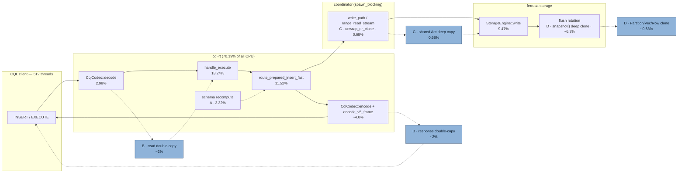

# CQL Request-Thread (`cql-rt`) Copy Analysis — Arc-Swap Candidates

> Last updated: 2026-10-08
> Status: Draft — implemented by `perf/cql-hot-path-copies` (levers A, D-read-only, B-response)
> Scope: `ferrosa-cql` (CQL wire server) + the CQL write fan-out; storage memtable/commitlog
> Measured at: PR #537 head `dd4ec12b` (`perf/levers-crc-lz4-io`)

## Executive Summary

The attached capture (`pr537_full.svg`) is a frame-pointer CPU profile of a 3-node
cluster under a CQL write load, at CQL 512 client threads. **70.19 % of all
on-CPU samples are attributed to the thread pool named `cql-rt`.** That is not a
measurement artifact: `cql-rt` is the CQL server's tokio runtime, so the sample
simply says the CQL runtime consumes ~70 % of CPU.

Within `cql-rt`, the copy/allocation class accounts for roughly **11.3 % of all
CPU** and is dominated by **`memcpy` at 8.20 %** (union self-cost across 293
frames). The single largest memcpy consumer is the **CQL wire codec's buffer
staging**, not application data clones. The genuine application-level deep copies
still on the hot path are worth **~1.5 %**, and one of them — the **memtable flush
`snapshot()` deep clone** — was missed by PR #537, which converted only
`range_iter`. Three per-request recomputations worth **3.32 %** are not copies but
sit in the same "recompute what could be looked up once" family.

| Lever | Kind | ~CPU (of total) | Risk | Status |
|---|---|---|---|---|
| A. Per-request schema recompute (`storage_column_is_multicell`, `resolve_col_type`, `build_request_context`) | redundant work, no data copy | **3.32 %** | low | open — **best first win** |
| B. CQL wire codec: response double-copy (fixed here) + bound-value `Term` copy | bytes moved | response **~2 %**; read-path bound values **~0.5 %** | low | response half landed; read half open |
| C. Coordinator → client deep copy (`Arc::unwrap_or_clone` on a shared `Arc<Partition>`) | shared→owned data copy | **0.68 %** + 1.21 % storage clone | medium | partially addressed by PR #537 |
| D. Read-only memtable re-scans deep-cloning (`snapshot()` on read paths) | shared→owned data copy | **~0.63 %** clone self (+ 6.3 % flush tree) | low | **fixed (this PR)** |
| F. CQL hot-path `Vec` alloc/grow + `drop_glue` (unprofiled by name) | allocator churn | 2.5 % combined | medium | needs attribution |

**Recommendation:** start with **A** (pure compute, no ownership risk), then **D**
(same pattern PR #537 already proved out, one more call site), then **B**. Note the
4.54 % memcpy under `handle_connection` is **unattributed** — musl's `memcpy` asm
has no CFI, so it cannot be blamed on the codec without an instruction-level
capture.

## Method (so the numbers are reproducible)

1. The capture is an `inferno`/`flamegraph.pl` SVG. Frames are recovered with
   `<g><title>name (N samples, P %)</title><rect x y width/></g>`; the tree is
   reconstructed by interval containment (`parent` = the narrowest frame at a
   smaller `y` whose `x..x+w` contains the child).
2. `self` cost is computed as `n − Σ(children)` **after the parent links are
   built**, so a frame that carries no `.title` cannot leave unaccounted samples.
3. All percentages are of the profile total (543 045 038 916 samples ≈ 1515 s CPU
   over 3 nodes).

> **Corrected in a later revision.** The first version reported `memcpy` as 8.20 %
> by summing frames named *exactly* `memcpy`, and quoted the 4.54 % node as if it
> were a self-cost. Both were wrong: Linux symbolises the same function as
> `memcpy`/`__memcpy`/`memmove`/`memset`, and the 4.54 % node is *inclusive*
> (1.37 % self, with 2.71 % of its children being page faults). The memory-ops
> totals are re-derived in the companion
> [`cql-rt-memory-ops-analysis.md`](cql-rt-memory-ops-analysis.md):
> **allocator 7.84 % + memcpy family 8.85 % = 16.7 % disjoint**, with a further
> 3.79 % of kernel page-fault/alloc/zeroing layered inside them.

## Findings

### Where the copies sit (write + read hot paths)



Dashed edges mark the copy/allocation sites this analysis is about (B, C, D) and
the recompute (A). Solid edges are real work that stays.

### A. Per-request schema recomputation — 3.32 % (no data copy)

These are flat **leaf** frames — they execute, and call nothing that was itself
sampled — so the cost is computation inside the function.

| Frame | CPU | Site |
|---|---|---|
| `router::storage_column_is_multicell` | 1.34 % | `router.rs:9035` |
| `connection::build_request_context` | 1.11 % | `connection.rs:2239` |
| `router::resolve_col_type` | 0.87 % | `router.rs:15410` |

- `storage_column_is_multicell` runs **per regular/static column of every
  prepared INSERT** (`router.rs:8938` inside the column loop of
  `route_prepared_insert_fast`), re-deriving the marshal type from the column's
  type string on each call. Confirmed by the profile: its cost descends into
  `ferrosa_schema::convert::cql_to_marshal_type → strip_wrapper → format!` — i.e.
  **it is formatting type strings into an intermediate `String` on every column of
  every insert.**
- `resolve_col_type` is a thin wrapper over
  `bridge::parse_cql_type_in_keyspace` — **re-parsing the column type string per
  insert**, although the column's `CqlType` is a property of the table, not the
  request.
- `build_request_context` rebuilds a `RequestContext` per request; the only
  non-trivial work is `peer.to_string()` and
  `effective_serial_consistency(...)`. The `auth_context.is_none()` arm allocates a
  default `AuthContext` (`"cassandra".to_string()`).

**Arc-swap / remedy.** These are **not** ownership copies; the fix is to compute
once and share. `TableMetadata` should carry a precomputed
`multicell_columns: Arc<HashSet<u16>>` (or a per-column `is_multicell: bool`
resolved at schema-load time), and a resolved `Arc<[CqlType]>` or
`Arc<HashMap<String, CqlType>>` so `resolve_col_type` becomes a lookup.
`build_request_context`'s `SocketAddr`-derived client address is invariant per
connection and can be stored on the connection state once. Expected recovery:
**most of 3.3 %**, with no change to data ownership and therefore no risk of the
data-loss class.

### B. CQL wire codec — corrected: the body is NOT copied on the common path

Inside `handle_connection`'s read/send loop (16.60 % inclusive):

| Frame | CPU |
|---|---|
| `memcpy` directly under `handle_connection` | 4.54 % (callee unsymbolised) |
| `futures_util::sink::send::Send<Framed<..>>::poll` | 4.00 % (write side) |
| `CqlCodec::decode` | 2.98 % (mostly CRC32 framing verify, required) |
| `poll_read_buf::<TlsStream, BytesMut>` | 2.85 % |

**Correction to the first version of this spec.** It claimed the read path copies
every request payload twice. Checking the source and the profile, that is wrong on
the common path:

- Self-contained v5 frame (`v5_segment_buf` empty) takes `payload.freeze()` —
  **zero copies** — and `emit_envelopes` then hands out `Bytes` slices via
  `envelope_data.slice(...)`, also zero-copy.
- The v4 path does a single `split_to(..).freeze()` — one buffer, no copy.
- The profiler agrees: **zero `v5_segment_buf` frames**. The
  `extend_from_slice` accumulation branch at `frame.rs:349/377` is a genuine second
  copy, but it only runs when a peer sends an envelope **> 128 KiB**
  (`V5_MAX_PAYLOAD`) split across slices — a segmented *write*, not this workload.

**What is actually still copied on the read path** (measured):

| Site | Copy | CPU |
|---|---|---|
| `raw_bytes_to_term` / `cql_value_to_term` (`connection.rs:2814/2817/2871/2896`) | each bound value's bytes copied into an owned `Term` — `s.clone()`, `b.clone()`, `bytes.to_vec()` — although the source `Bytes` outlives the whole request | **0.46 %** memcpy (0.21 + 0.25) under `decode_query_params` 1.79 % |

So the removable read-path copy is **~0.5 %**, not 2–4 %. The response-path
double copy described below was real and is fixed in this PR.

**Remedy (remaining).** Make the bound-value path `Bytes`-backed instead of
`Vec<u8>`-owned: a `Term::BlobLiteral(Bytes)` (or `Arc<[u8]>`) variant plus a
borrowing term view for scalar text. Note this only pays if the round trip is also
changed — `cql_value_to_term` converts a decoded value back into a `Term`, which the
router then re-decodes through `bridge::term_to_cql_value`, so a `Bytes` term must
survive that second step to be a saving rather than a wash.

**Still unattributed.** The 4.54 % memcpy directly under `handle_connection` has no
symbolised callee. This is **not** fixable by a "TLS-off capture": the musl
`memcpy`/`memmove` fast paths are hand-written asm with no CFI, so `--call-graph fp`
stops dead at them (`.github/workflows/release.yml`: 12 506 of 16 285 memcpy samples
had a 2-frame `cql-rt;memcpy` stack; 6.5 % of total CPU un-attributable).
Attributing it needs an **instruction-level** capture (dwarf unwinding past asm, or
an allocator/`ltrace`-style probe), not another frame-pointer run.

**Do not confuse the two copy classes.** A copy of the request body on the way *in*
(whether the payload bytes are duplicated) is a different bug from `Bytes` being
re-sliced or the TLS record layer buffering — and from the memcpy being in the write
path the whole time. The 4.54 % is unattributed; do not assume it is the codec.

### C. Coordinator → client deep copy — `Arc::unwrap_or_clone` (0.68 % + 1.21 %)

The dominant single clone chain in the profile is:

```
Partition::clone → Vec<Row>::clone → Row::clone → memcpy     0.68 % inclusive
  under map() over SkipListMemtable::snapshot
  under TableStore::flush_sharded → flush_sealed → run_rotation_group → rotate
  under StorageEngine::flush → FlushSupervisor::run   (thread "storage-flush-u")
```

and separately `Partition::clone` **1.21 % inclusive** (plus other sites) feeding
the `memcpy` under `handle_connection`.

PR #537's own "Honest scope" section says the coordinator layer still
`Arc::unwrap_or_clone`s scan Arcs because `ClusterPartitionStream` /
`PartitionResultStream` carry **owned** `Partition`; at refcount ≥ 2 that is a
full deep copy. Confirmed in source:

- `ferrosa-cluster/src/write_path.rs:165, 189, 204, 219` — `local_range_stream*`
  / `local_projected_range_stream*`: each yields
  `item.map(Arc::unwrap_or_clone)`. Where the upstream Arc is uniquely owned this
  is free; where the storage layer shares the Arc it deep-copies. Note
  `local_range_stream` also **truncates rows in place** when `row_limit > 0`,
  which *requires* ownership — that site is a legitimate `Arc::make_mut`, not a
  plain `Arc<Partition>` hand-off.
- `ferrosa-cluster/src/coordinator/range_read_stream.rs:780, 786, 1094, 1103,
  1822, 1831, 2054, 2084, 2300, 2308, 2317, 2325`; `stream_request_handler.rs:158,
  168`; `controller/membership.rs:222`; `repair/executor.rs:212`.

**Invariant to hold.** Any Arc conversion here must preserve: complete
partitions, correct row ordering, and no lost tombstones. Where the merge path
must mutate (tombstone suppression, multi-source merge, `row_limit` truncation),
it must go through `Arc::make_mut` (copy-on-write) — the merge is allowed to
materialise, and must be, before it mutates. Converting a mutable site to a
shared `Arc<Partition>` without `make_mut` is a **data-corruption** change, not a
perf change.

### D. Memtable flush `snapshot()` — a gap PR #537 left behind (~0.63 % clone self, ~7 % flush tree)

PR #537 converted `range_iter` to hand out `Arc<Partition>`, and added a test
(`range_iter_does_not_deep_clone_partition_bodies`). **It did not convert
`snapshot()`**, which the flush rotation path uses:

- `ferrosa-storage/src/memtable/skiplist.rs:155` —
  `.map(|entry| (**entry.value().read()).clone())`
- `ferrosa-storage/src/memtable/sharded.rs:221, 258` — `Partition::clone(arc)`
  (also `snapshot_range_limited`)

The profile confirms the live cost: the `Partition::clone → Vec<Row>::clone →
memcpy` chain under `SkipListMemtable::snapshot` inside `flush_sharded` /
`flush_sealed`. The enclosing `StorageEngine::flush` subtree is **~6.3 %
inclusive** (3.60 % on the `storage-flush-u` thread, 3.54 % on `data-rt`).

**Why the initial snapshot clone cannot simply become an `Arc`.** The flush's
first `snapshot()` **must** own its partitions, because the flush mutates them in
place four times before/during encoding: `partitions.sort_by(..)`,
`filter_partition_rows` (quarantine), `ordinal_space::flat_into_sstable_space`,
and `memtable::expand_collection_blobs_in_place`. Returning `Vec<Arc<Partition>>`
there would move the same deep clone into `Arc::make_mut` — a no-op, not a win.
(`flush_sharded` additionally **moves** the `Vec<Partition>` into per-shard
ownership — `split_sorted_partitions_into_shards` — so those bodies must be owned
too.)

**What was actually safe to remove.** The two *read-only* consumers of the memtable
were doing an unnecessary second full deep clone:

- the flush **late-writer drain** (both paths) — re-snapshotted the whole memtable
  (`old_active.snapshot()`) to replay writes that, behind the sealed gate, are
  always empty, then `drop`ped it unused;
- the fulltext `fts_match` **index build** — deep-cloned the active + flushing
  memtables to read key/clustering/cell bytes.

Both now walk `range_iter` one partition at a time (never collecting into a `Vec`)
and borrow the stored `Arc<Partition>`. The correct framing of lever D is therefore

> **CORRECTION (post-benchmark, important).** This substitution is **not a win on the
> shipped configuration** and it is the likely source of the t512 regression.
> `ferrosa-storage/Cargo.toml` sets `default = ["skiplist-memtable"]`, so
> `SkipListMemtable` is the live backend and `sharded.rs` is not instantiated at all
> (0 frames in the profile). On the *live* path the change swapped a
> `snapshot()` that **drains to an owned `Vec`** (lock traffic in one short burst,
> then a lock-free scan) for a **lazy `range_iter` that holds each partition's value
> `read()` while the consumer walks**, interleaved with writer `put`s — a longer
> contention window against 512 writers. `parking_lot::RwLock` is 2.43 % self in
> the profile. The fulltext build also now walks the table **twice while holding the
> store guard** (`store.rs:9307-9311`). See
> [`cql-rt-memory-ops-analysis.md`](cql-rt-memory-ops-analysis.md) § "Regression
> report" for the measurement and the two candidate fixes (per-value `ArcSwap`
> instead of `RwLock`, and point lookups instead of a full scan for the
> late-writer drains). Note `sharded.rs`'s lazy rewrite is inert either way: it
> neither caused the regression nor delivered the memory win claimed below.

**"stop re-snapshotting for reads"**, not "make `snapshot()` return Arcs".

### E. Non-actionable (recorded so it is not chased)

- **`route_prepared_insert_fast` (11.52 %) itself** is real work, not a copy:
  `term_to_cql_value`, `build_row`, the column loop.
- **`(*skeleton).clone()` is NOT the hot path.** Both sites
  (`connection.rs:1682`, `param_cache.rs:401`) are on the **fallback** branch when
  the borrowed fast path declines. The transparent param cache already hands out
  `Arc<InsertStatement>` and the fast path borrows it (`&skeleton`) — this is the
  correct design and should be the **template** for lever A.
- **`substitute_bound_terms` / `substitute_in_statement` produce zero frames** in
  the profile. The prepared INSERT/SELECT fast paths intercept before it runs, so
  the "clone whole AST then substitute terms" path is **cold** here. Do not
  prioritise it.

### F. Unattributed allocator churn

Frames whose caller the profiler did not resolve: `RawVec::reserve/finish_grow`
≈ 1.56 %, `drop_glue` ≈ 1.01 %. Combined ≈ 2.5 % of CPU. These are real but need
an attribution pass (a capture with a deeper stack or an allocation profiler)
before any specific site can be blamed. `route_prepared_insert_fast`'s
`pk_vals` / `ck_vals` / `regular_cells` / `pending_collections` — built per
insert with no capacity hint — is the most likely contributor and the cheapest
thing to instrument.

## Key Decisions

- **Order the work by risk, not by size.** A (3.32 %, pure compute) and D
  (one more `Arc` hand-off, pattern already proven by PR #537) carry no data-safety
  risk. B is larger but unattributed in its dominant bucket and is overlapping an
  in-flight io_uring change.
- **`state.schema.snapshot()` is already the model, not a problem.** It returns
  `Arc<SchemaSnapshot>` via `ArcSwap::load_full` (`ferrosa-schema/src/registry.rs:256`)
  — a refcount bump, invoked per INSERT at `router.rs:8901` with no copy. Lever A
  should extend that same idea *inside* `TableMetadata`: precompute the resolved
  type and the multicell flag at schema-build time so the per-request path does
  lookups, not string parsing.
- **Do not present the 70.19 % as "the CQL layer is a copy problem."** Only
  ~1.5 % of total CPU is application data copies on the CQL hot path; the rest of
  `cql-rt` is wire buffering, syscall I/O, and real routing work.
- **Every mutable merge site stays copy-on-write.** The one invariant that must
  survive all of C, D and E: partitions/rows are never aliased in a way that lets
  one consumer's mutation be seen by another.

## Recommended sequence

1. **A** — add `TableMetadata`-level cached `is_multicell` + resolved `CqlType`;
   make `storage_column_is_multicell` / `resolve_col_type` lookups; hoist the
   connection-invariant `client_address` out of `build_request_context`. One
   invariant test per field (the cached flag must equal the computed one for every
   column of every table) and one behaviour test (an INSERT into a multicell
   column still expands into per-element cells).
2. **D (done)** — the two **read-only** memtable consumers (flush late-writer
   drain, fulltext index build) walk `range_iter` one partition at a time and
   borrow `Arc<Partition>`; they never collect the table into a `Vec`. The
   flush's own `snapshot()` is left owning its partitions on purpose — it mutates
   them in place. Test: `range_iter_and_snapshot_agree_exactly`.
3. **B (done, response half)** — `encode_v5_frame` writes the single-frame case in
   place into `dst` instead of staging the envelope and copying it again; pinned
   byte-for-byte against the old algorithm. The **decode** staging
   (`frame.rs:374–379`) is *not* done — re-capture with TLS off first to attribute
   the 4.54 %.
4. **C** — carry `Arc<Partition>` through `ClusterPartitionStream` /
   `PartitionResultStream`, with `Arc::make_mut` at the truncation/merge sites.

## Open Questions

- [ ] Which consumer holds the 4.54 % `handle_connection`-direct `memcpy`? (needs
      a TLS-off or better-symbolised capture)
- [x] Is `StorageEngine::flush`'s snapshot mutable at any stage that would forbid
      a plain `Vec<Arc<Partition>>` return? — **Yes, four times.** Settled; see
      § D. `snapshot()` stays owning.
- [ ] What is the actual Arc refcount at each `write_path.rs` / `range_read_stream.rs`
      site under the 512-thread write load — 1 (free) or ≥ 2 (deep copy)?
- [ ] Does the io_uring branch (`perf/levers-crc-lz4-io`, in flight) already
      rewrite the codec staging in lever B?
- [ ] Crate doc obligation: `ferrosa-cql` and `ferrosa-storage` crate docs must be
      updated in the same change (per `CLAUDE.md` / `AGENTS.md` definition of done).

## Scope: what the implementation PR does not do

- **The CQL wire read path** (`frame.rs` decode staging) — see lever B above.
- **`ShardedBTreeMemtable::range_iter` — DONE** (was listed here as open). It
  pre-collected the whole in-range `Arc` set into one `Vec` per shard before
  yielding anything, pinning `8 B` per partition for the scan's lifetime — a parked
  paging cursor held it for the query's duration. It now lazily merges: one heap
  entry per shard, re-seeking each shard under a short-lived read lock on advance,
  so it retains `O(num_shards)` and never stalls a writer. This contradicted the
  `Memtable::range_iter` doc contract ("must NOT pre-materialize … O(1) memory",
  ADR-020) and was the last **production** finding in
  `frg materialization-scan ferrosa-storage/src/memtable`. Measured before:
  22 624 B retained over 2 000 partitions vs 295 008 B over 32 000. Guarded by
  `memtable_scan_memory_bound.rs` — peak live bytes, not allocation count, because
  `Arc::clone` does not allocate so a counter cannot see this — plus
  exactly-once / bounded-range / empty / single-shard tests.
- **`snapshot()` still materializes by design.** The flush mutates its partitions in
  place; `k_way_merge` remains the materializing merge for that path. The
  `frg materialization-scan` hits on `snapshot` / `snapshot_range_limited` /
  `k_way_merge` are intentional and bounded by the memtable flush threshold.
- **Per-request `resolve_col_type` / `build_request_context` recompute** (0.87 % +
  1.11 %) is untouched — caching a parsed `CqlType` or a marshalled client address
  needs a metadata decision, not a micro-fix.

## Related Specs / Prior Art

- **`specs/reference/io-page-cache-copy-audit.md` (2026-07-18) — the closest
  sibling; read it before acting.** Its **A6** ("CQL nested values are encoded into
  intermediate vectors", `encode_value() -> Vec<u8>` then copy into the body) and
  its note that the raw result fast path copies storage cell bytes once cover
  **part of lever B and the result-size half of F**. This spec does not restate
  A6; it adds what A6 does **not** cover: the **framing** double-copy
  (`encode_v5_frame` stages an envelope that `put_v5_frame` copies again) and the
  **decode** staging double-copy (`frame.rs:374–379`). Its A3 (remote SSTable
  range reads copy the payload twice) is the network-SSTable layer, distinct from
  lever C (in-process coordinator→client).
- `specs/p0-oom-guard/blueprint.md` + `oom-audit-allow.toml` (65 allow entries) —
  the existing materialization guard; several entries cover
  `range_read_stream.rs` under the materialization epic `t_110dd8a5`, with expiries
  dated 2026-09-30 / 2026-12-31 (now past — the guard's `--enforce` baseline needs
  a re-audit).
- `specs/implemented/bug-streaming-range-read-perf-50x-floor.md` — the streaming
  range-read wall-time investigation; same streaming/ownership theme, different
  symptom (wall time, not CPU).
- `specs/reference/observability-architecture.md`,
  `specs/reference/testing-methodology-and-results-2026-07.md` — capture
  methodology.
- Prior commits: `ee0247db` (memtable scans hand out `Arc<Partition>`),
  `96ccd0fb` (repair fetch borrowed wire serializer), `e440b60f` (merge memtable
  writes in place), `14662cd8` (move rows instead of cloning on
  graph/flight/cql/postgres paths).

## Appendix — How to re-verify

```bash
# 1. Capture (frame pointers, per-node). The profile in this spec is "PR#537 levers".
perf record -F 999 -g --call-graph fp -- ./<cql load driver at 512 threads>
perf script | inferno-flamegraph --title "cql-rt absolute" > pr537_full.svg

# 2. Attribution sanity: the cql-rt share and memcpy total should reproduce.
#    cql-rt == 70.19 % ; sum(memcpy self) == 8.20 % ; copy/alloc class == 11.34 %.

# 3. To attribute lever B, re-capture with TLS disabled so the 4.54 %
#    handle_connection-direct memcpy resolves to a named callee.
```
