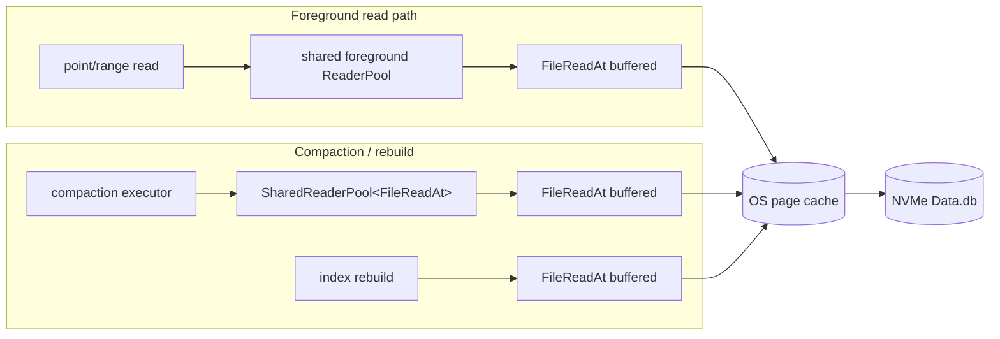
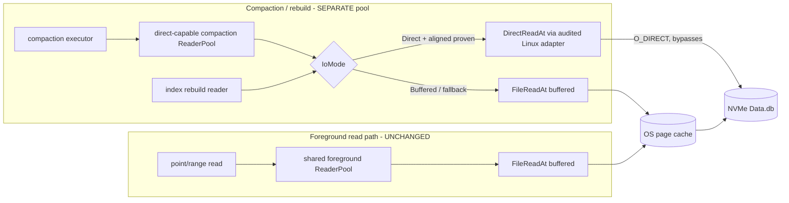

# Opt-in Linux `O_DIRECT` compaction/rebuild reader — architecture

## Problem

Compaction and index rebuild stream cold `Data.db` bodies through the OS page cache
via buffered `FileReadAt` (pooled in `compaction/executor.rs` as
`SharedReaderPool<FileReadAt>`). Under a bounded cgroup this evicts the foreground
random-read hot set, raising serving tail latency and refaults.

## Goal

Let compaction/rebuild read `Data.db` **without polluting the page cache** on
Linux/NVMe, behind a default-off flag, without touching foreground reads.

## Non-goals

- Changing foreground point/range read I/O (they keep using the page cache).
- Reusing the shared foreground reader pool for direct I/O.
- Direct **writes** (this task is read-side only; writers keep buffered I/O).
- io_uring / async direct I/O; `mmap`; a portable `fadvise` scheme (possible later,
  not here).
- Enabling the feature by default (promotion is measurement-gated).

## Current state



Every reader is buffered; compaction and foreground share the page cache, so the
cold scan evicts the hot set.

## Proposed state



Foreground stays buffered/cached; compaction/rebuild select `Direct` when supported,
else transparently fall back to buffered.

## Additions (trait / types)

Extend `ferrosa-sstable/src/io.rs` (the `ReadAt` seam) — no change to the trait
signature, one new impl + a mode enum:

```rust
/// Selects how a compaction/rebuild reader opens a Data.db. Safe, platform-neutral.
#[derive(Clone, Copy, Debug, Default, PartialEq, Eq)]
pub enum IoMode {
    #[default]
    Buffered,
    /// Prefer O_DIRECT on Linux where alignment is provable; else buffered.
    Direct,
}

/// Direct-I/O reader. Implements the SAME `ReadAt` trait. All unsafe + platform
/// code is inside `io::direct` (Linux adapter); this type is a safe facade that
/// falls back to `FileReadAt` when direct I/O is unavailable/unproven.
pub struct DirectReadAt {
    inner: DirectOrBuffered,          // Direct(linux::DirectFd) | Buffered(FileReadAt)
    align: DioAlign,                  // from STATX_DIOALIGN (mem/offset), or fallback marker
    buf_bytes_cap: usize,             // bounded aligned bounce-buffer residency
    len: u64,
}

impl ReadAt for DirectReadAt { /* read_at/len/is_empty — bounce-buffer + tail logic */ }

/// Open a compaction/rebuild reader for a Data.db under the given mode. Returns a
/// `DirectReadAt` that is already resolved to Direct or Buffered.
pub fn open_scan_reader(path: &Path, mode: IoMode, cfg: &DirectIoConfig)
    -> Result<DirectReadAt>;
```

`io::direct` (Linux-only, audited): `libc::open(O_DIRECT|O_RDONLY)`, `statx` with
`STATX_DIOALIGN`, aligned `Vec`/`alloc` for bounce buffers, raw `pread`. `#[cfg(not(target_os = "linux"))]` compiles to an always-buffered stub.

**Config** (`DirectIoConfig`, default-off): `enabled: bool`, `max_buffer_bytes`,
`readahead_bytes`, plus env overrides (e.g. `FERROSA_COMPACTION_IO_DIRECT=1`).

## Data flow — a compaction scan read

```mermaid
sequenceDiagram
  participant CE as Compaction executor
  participant OP as open_scan_reader
  participant AD as io::direct (Linux adapter)
  participant DR as DirectReadAt
  participant D as NVMe Data.db
  CE->>OP: open(path, IoMode::Direct, cfg)
  OP->>AD: open O_DIRECT + statx(STATX_DIOALIGN)
  alt alignment proven & fs supports O_DIRECT
    AD-->>OP: DirectFd{align}
    OP-->>CE: DirectReadAt(Direct)
    CE->>DR: read_at(buf, offset)  %% arbitrary alignment
    DR->>DR: align offset down / len up to superset
    DR->>D: pread(aligned_buf, aligned_off)  %% O_DIRECT
    D-->>DR: aligned bytes (or short read at EOF)
    DR->>DR: copy requested slice; handle unaligned tail; verify checksum on reassembled data
    DR-->>CE: n bytes
  else EINVAL / unsupported fs / non-Linux / unproven align
    AD-->>OP: fallback
    OP-->>CE: DirectReadAt(Buffered = FileReadAt)
    CE->>DR: read_at(buf, offset) -> buffered pread (page cache)
  end
```

## Acceptance criteria

1. **Default-off + fallback:** with the flag off, behavior is byte-identical to
   today. On macOS / unsupported fs / older Linux, `open_scan_reader(Direct)`
   silently resolves to buffered; `read_at` results are identical to `FileReadAt`.
2. **Isolation:** foreground point/range reads and the shared foreground reader pool
   are provably untouched (no direct fd ever opened for a foreground read; separate
   compaction pool). No direct+buffered+mmap access to an overlapping `Data.db`
   range in any code path.
3. **Correctness:** short reads at EOF, unaligned head/tail, and per-chunk checksums
   pass on the reassembled data; a compaction whose inputs are read via `Direct`
   produces byte-identical output SSTables to the buffered path; crash/restart
   mid-compaction recovers exactly as today (read-only path adds no durability risk);
   in-flight reads cancel cleanly.
4. **Measurement gate:** on the owner-pinned baseline environment — a multi-node fly
   cluster of 2-core `performance` instances (Linux + local NVMe, RF=3) — a
   buffered-only baseline first shows page-cache eviction materially hurts the
   foreground hot set (else the feature is not built), then an A/B on the same
   environment shows, for an identical compaction workload + a concurrent foreground
   hot set, that `Direct` reduces foreground refaults/tail latency vs `Buffered`
   without a compaction-throughput regression. Metrics emitted: buffered/direct
   bytes, fallback + error counts,
   tail-fallback count, readahead depth, foreground read latency, faults/refaults,
   memory + I/O PSI, device latency.
5. **Audit:** all `unsafe` confined to `io::direct` with safety comments; the module
   passes clippy `-D warnings` and (where the harness supports it) Miri on the
   alignment/copy logic exercised with a mock fd.
