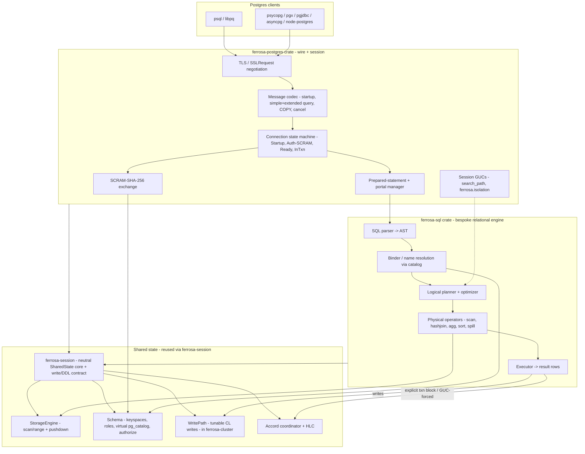
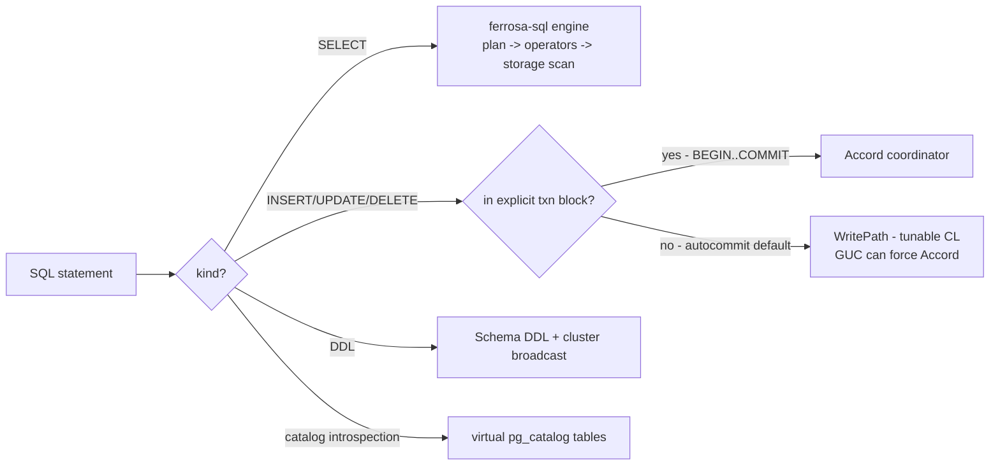
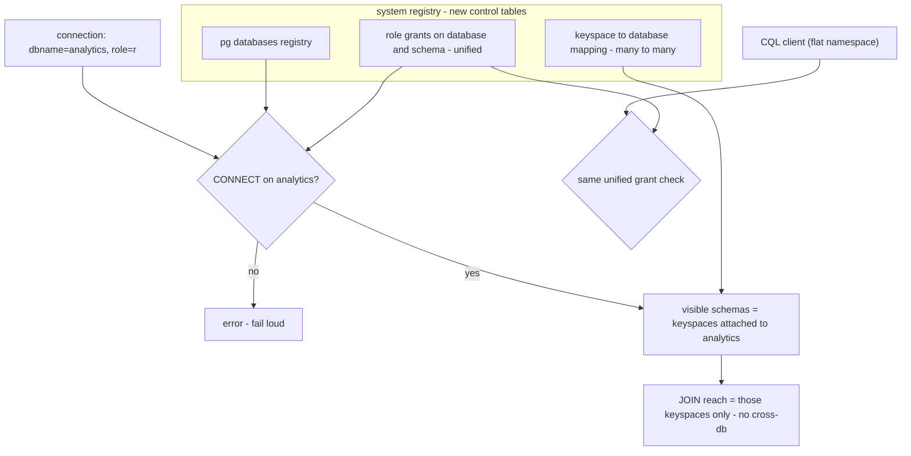

# Postgres Front-End — Architecture

> Constraints come from `decisions.md` (D1–D11). This document describes target structure,
> not a release claim. No code exists yet (per D7).

## 1. Where it slots in

Ferrosa already runs four protocol listeners off one `async fn main()` in
`ferrosa/src/main.rs`, each spawned on a background runtime and handed a shared state:

| Protocol | Crate | Port | Listener entry |
|----------|-------|------|----------------|
| CQL v5 | `ferrosa-cql` | 9042 | `CqlServer::start_background` |
| Web console | `ferrosa` | 9090 | — |
| Graph HTTP | `ferrosa-graph` | 7474 | — |
| Bolt | `ferrosa-graph` | 7687 | `start_bolt_server` |
| SPARQL | `ferrosa-sparql` | 8080 | `start_sparql_http` |
| **Postgres (new)** | **`ferrosa-postgres`** | **5432** | **`PostgresServer::start_background`** |

The key reusable asset is the shared engine state — `Arc<StorageEngine>`, `Arc<Schema>`,
`Arc<WritePath>` (which lives in `ferrosa-cluster`), optional `Arc<PeerManager>`, optional
`Arc<HybridLogicalClock>`, plus caches/trackers/metrics. Today this `SharedState` lives
inside the ~54k-LOC `ferrosa-cql` crate. **Per D10 (DSM), it is extracted into a new neutral
`ferrosa-session` crate** that both `ferrosa-cql` and `ferrosa-postgres` depend on — so the
Postgres listener shares the same storage/schema/auth/Accord core **without** depending on
`ferrosa-cql`. The protocol-agnostic write/DDL contract is protocol-agnostic for *writes and
DDL*, but is **not** sufficient for relational *reads* (D2) — those go through the new engine.

## 2. Component overview



## 3. Crate layout

### 3.1 `ferrosa-postgres` (new) — wire + session

Mirrors `ferrosa-cql` structure deliberately (so reviewers map one to the other):

| Module | Mirrors CQL | Responsibility |
|--------|-------------|----------------|
| `server.rs` | `ferrosa-cql/src/server.rs` | `PostgresServer`, `start_background`, TCP bind 5432, `max_connections`/per-IP semaphores, TLS acceptor (reuse `ferrosa-net` TLS, mirror `build_tls_acceptor`) |
| `codec.rs` | `ferrosa-cql/src/frame.rs` | Postgres message framing: 1-byte type tag + i32 length; **bounded max message length** (mirror CQL's 256 MiB cap); StartupMessage (no type tag), SSLRequest, CancelRequest special cases |
| `messages.rs` | `frame.rs` opcodes | Typed front/back messages: Startup, Authentication\*, Query, Parse, Bind, Describe, Execute, Sync, Close, CopyData, ErrorResponse, RowDescription, DataRow, CommandComplete, ReadyForQuery, ParameterStatus, BackendKeyData, NotificationResponse |
| `connection.rs` | `ferrosa-cql/src/connection.rs` | Per-connection state machine: `Startup → Auth → Ready → (Simple \| Extended) → Sync`; transaction-status byte `I`/`T`/`E`; error-recovery-until-Sync semantics |
| `scram.rs` | `ferrosa-cql/src/auth.rs` | SCRAM-SHA-256 server exchange (client-first/server-first/client-final/server-final), nonce handling, against the role store's stored/server keys |
| `portal.rs` | prepared-stmt cache | Named/unnamed prepared statements + portals; parameter formats (text/binary); `Describe` → RowDescription/ParameterDescription |
| `session.rs` | request context | Session GUCs (`search_path`, `ferrosa.isolation`), current schema, applied **after auth** from StartupMessage params + later `SET` |
| `types.rs` | — | CQL type ↔ Postgres OID mapping; text + binary wire encodings per OID |
| `catalog_queries.rs` | — | Recognize/serve driver introspection (`SELECT current_schema()`, `SHOW`, `pg_catalog`/`information_schema` reads) by delegating to virtual tables |

### 3.2 `ferrosa-sql` (new) — bespoke relational engine

This is the dominant subsystem (D3) and the main schedule risk. Kept separate from the wire
layer so the planner is testable in isolation and could, in principle, back other front-ends.

| Module | Responsibility |
|--------|----------------|
| `parser/` | SQL lexer + parser → AST (Postgres dialect subset growing toward full). Hand-written, TDD. |
| `catalog.rs` | Name resolution + type lookup over `Schema`; keyspace=schema (D5, re-bounded by D8a database-bounded resolution); exposes a `TableProvider`-like scan contract |
| `logical/` | Logical plan nodes (Scan, Filter, Project, Join, Aggregate, Sort, Limit, Subquery, CTE) |
| `optimizer/` | Rule-based rewrites: predicate/projection pushdown to storage, join ordering, constant folding. Cost model later. |
| `physical/` | Operators: `SeqScan`/`RangeScan` (with pushdown), `HashJoin`/`NestedLoopJoin`, `HashAggregate`, `Sort` (external/spill), `Limit`. **Every operator bounded** (Power-of-10): bounded buffers, spill-to-disk past a threshold, hard caps surfaced as errors not OOM. |
| `exec.rs` | Pull-based (Volcano) or push executor producing rows in catalog order for the wire layer |
| `write.rs` | INSERT/UPDATE/DELETE lowering onto `WritePath`; strict path onto Accord when session opted in (D1) |

### 3.2b Dependency direction (D10 — see dsm.md)

```
ferrosa-postgres  →  ferrosa-sql, ferrosa-session, ferrosa-schema, ferrosa-net
ferrosa-sql       →  ferrosa-session, ferrosa-schema, ferrosa-storage, ferrosa-common
ferrosa-session   →  ferrosa-cluster, ferrosa-storage, ferrosa-schema, ferrosa-common
ferrosa-cql       →  ferrosa-session  (refactored to consume the extracted core)
```

Hard rules: **`ferrosa-sql` must NOT depend on `ferrosa-postgres`** (engine ⊥ wire); the
unified `authorize()` and catalog tables live in `ferrosa-schema` and stay **pure over a
metadata snapshot** so no `schema → engine` back-edge forms.

### 3.3 Extensions to existing crates

- **`ferrosa-schema`**: role record gains an optional `scram_sha256 {salt, iterations,
  stored_key, server_key}` (D4); every password-set path (CQL *and* Postgres `CREATE/ALTER
  ROLE ... PASSWORD`) computes and stores it. New **virtual tables** projecting
  `pg_namespace`, `pg_class`, `pg_attribute`, `pg_type`, `pg_proc` (stub),
  `information_schema.*` from live keyspace/table/column metadata (D5).
- **`ferrosa-storage`**: a pull-based scan/range interface with **predicate + projection
  pushdown** so the engine avoids full scans on a partition-keyed store. (Verify how much of
  this the existing read path already exposes before building new surface.)
  - **Fail-loud scan contract (required).** The engine scan contract MUST distinguish
    **table-absent** (an `Err`, e.g. `NoSuchTable`) from **table-empty** (an `Ok` yielding
    zero rows). Today `ferrosa-storage`'s `range_iter_projected` returns an *empty stream* when
    the table is not registered — a silent fallback that makes a missing table
    indistinguishable from a legitimately empty one. The bespoke scan/join in `ferrosa-sql`
    MUST NOT inherit this silent empty-stream-on-missing-table behavior: a catalog-known but
    storage-unregistered table (timing, partial DDL broadcast, the D8 mapping race — see
    FM-36/FM-41) is a fail-loud error, never an empty scan. This is required by the project's
    fail-loud rule ("never return empty when the operation could not be performed"); a join
    that silently drops one side because a scan returned empty-instead-of-error is a
    silently-wrong result (the FM-12 class) introduced beneath the engine. The binder resolves
    table existence against the catalog and asserts storage registration *before* scanning. See
    [`todo/storage-scan-fail-loud.md`](./todo/storage-scan-fail-loud.md).
- **`ferrosa` (main)**: spawn `PostgresServer::start_background` alongside the others, gated
  by config/env (mirror `FERROSA_CQL_*`): `FERROSA_POSTGRES_BIND` (default `0.0.0.0:5432`),
  TLS cert/key, auth-enabled flag.

## 4. Read vs write path (the hybrid from D2/D3)



- **Reads** never use `router::route`; they use the engine. This is the deliberate divergence
  from the CQL path.
- **Writes** in autocommit reuse `WritePath` by default; writes inside an explicit
  `BEGIN … COMMIT` block (and GUC-forced sessions) go through the Accord coordinator
  (`AccordCoordinatorDriver::run_transaction`), exactly as CQL LWT does today (D11).
- **DDL** reuses `Schema` mutation + DDL broadcast.
- **Catalog introspection** is served from virtual tables so drivers' connect-time queries
  succeed.

## 4b. Database / schema / table model & RBAC (D8, revises D5)

Postgres namespacing is genuinely 3-level here: **database → schema (= keyspace) → table**.
A connection binds to exactly one database (Postgres-standard).



- **Mapping (D8a):** a keyspace can be attached to **many** databases; schema names unique
  within a database; **JOINs are database-bounded** (no cross-database joins). Co-locate
  keyspaces in a database to make them joinable. This re-bounds D2's join reach by design.
- **Unified grants (D8b):** one permission model. `GRANT ON SCHEMA` maps to existing
  keyspace permissions; a new **database-level grant** (`CONNECT`/`USAGE ON DATABASE`) gates
  **both** Postgres and CQL. CQL stays namespace-flat but is subject to the same grants — a
  keyspace in database `D` needs the role to hold connect on `D`, even via CQL. The grant
  check is a **single shared enforcement point** consulted by both the Postgres engine and
  the CQL router (getting this divergent would be a privilege bug — see fmea.md).
- **Unmapped keyspaces (D8c):** auto-land in a default database `ferrosa`, so CQL-created
  keyspaces are always reachable from Postgres without admin action.
- **Backward-compat (rollout):** existing CQL roles must gain `CONNECT ON DATABASE ferrosa`
  (or `ferrosa` is implicitly connectable for roles holding the underlying keyspace perms),
  else unification would revoke their access. Never silently widen — fail loud on denial.

### New control/system tables

| Table (logical) | Home | Purpose |
|-----------------|------|---------|
| database registry | new `system_pg`-style keyspace | list of Postgres databases (drives `pg_database`) |
| keyspace↔database map | new `system_pg`-style keyspace | many-to-many attachment (D8a) |
| database/schema grants | extend `system_auth` | unified role grants on db + schema (D8b) |

`pg_catalog` virtual tables now project from these: **`pg_database`** lists the registry;
`pg_namespace`/`pg_class`/`pg_attribute` are filtered by the connected database's attached
keyspaces and the caller's grants. CQL `CREATE KEYSPACE` and Postgres `CREATE DATABASE`/attach
both mutate the registry; DDL broadcast must cover the new tables.

## 5. Transaction & isolation model (D1, refined by D11)

- **Entering an explicit transaction block** (`BEGIN`, status byte `T`) is the trigger for
  Accord: any `BEGIN … COMMIT` / multi-statement txn runs strict-serializable with
  read-your-writes inside it, **no GUC required** (D11).
- **Autocommit / bare statements** stay eventual-by-default (D1); they may expose
  read-after-write staleness — **documented expected behavior**, encoded in the test
  matrix, not a bug.
- The session GUC `ferrosa.isolation=accord` remains available to **optionally force Accord
  on autocommit reads too**; set connection-time via StartupMessage `options`/`server_settings`
  (dotted custom GUC) or per-session `SET`. It is no longer the only path to Accord.
- `BEGIN/COMMIT/ROLLBACK` drive the transaction-status byte correctly regardless of CL.

## 6. Explicit non-goals / deferrals for v1

- No DataFusion/Arrow (D3). No cross-database JOINs — joins are bounded to the connected
  database's attached keyspaces (D8a).
- COPY, `LISTEN/NOTIFY`, cursors (`DECLARE`/`FETCH`), function-call protocol, large-object
  protocol, logical replication: post-M1 milestones.
- SCRAM channel binding (`-PLUS`), legacy bcrypt-role migration tool: follow-ups (Q3/Q4).

## 7. Key risks (see fmea.md, threat-model.md)

1. **Grant-check divergence Postgres-vs-CQL** (FMEA FM-33, top RPN 480; threat E5). Two
   enforcement paths drift → silent privilege escalation. Control: a single shared
   `authorize()` in `ferrosa-schema` (pure over a metadata snapshot) consulted by both the
   Postgres engine and the CQL router + differential authz tests driving the same grant
   fixtures through both paths.
2. Bespoke engine returns **silently-wrong** join/aggregate results (FMEA FM-12/FM-14, top
   RPN). Control: differential testing against real Postgres; fail-loud over emitting
   unproven rows.
3. Planner resource blowup / query-of-death (bounded operators, spill, hard caps).
4. Catalog-emulation gaps break driver connect (introspection tests in the driver matrix).
5. SCRAM correctness + cross-protocol verifier population (D4).
