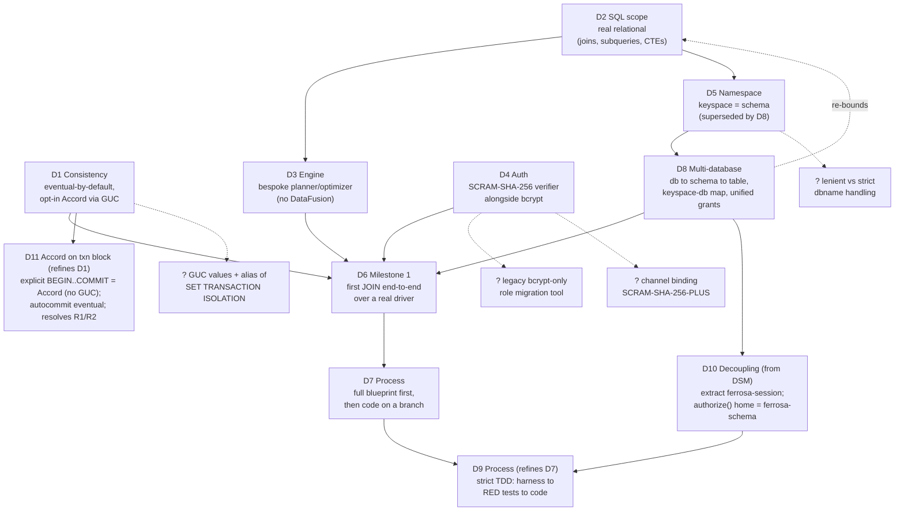

# Decision Tree — Postgres Front-End

Each node is a locked decision (see `decisions.md` for full records). Arrows show which
later decisions a choice constrains. `?` nodes are open follow-ups to resolve in design.

## Reading order and coupling

1. **D1 (consistency)** is the root: it decides that the default read path is eventual and
   that strict serializability is opt-in. Everything the engine and drivers see flows from
   this. It also dictates a wire-layer requirement: accept custom dotted GUCs in the
   StartupMessage.
2. **D2 (real relational)** forces a query engine that ferrosa does not have today.
3. **D3 (bespoke)** is the direct consequence of D2 and is the dominant cost/risk. It feeds
   the M1 gate.
4. **D4 (SCRAM)** and **D5 (namespace)** are independent of the engine but both gate driver
   connectivity, so both must land before M1.
5. **D6 (first-JOIN M1)** is the convergence point — it requires the spine of D1+D3+D4+D5.
6. **D7 (blueprint-first)** sequences the work: specs now, code after approval, on a branch.
7. **D9 (strict TDD, refines D7)** pins the execution order *within* the code phase:
   **harness → RED tests → code → refactor**, so the harness and failing tests are authored
   before the production code they cover.
8. **D10 (decoupling, from the DSM)** is spawned by D8's unified-RBAC requirement: extract a
   neutral `ferrosa-session` crate as a Sprint-0 prerequisite so `ferrosa-postgres` shares
   `SharedState` *without* depending on `ferrosa-cql`, and pin the single `authorize()` (plus
   the db-registry and `pg_catalog` virtual tables) to `ferrosa-schema`, pure over a metadata
   snapshot.

## Open follow-ups (resolve in architecture/design phase)

| ID | Question | Owner decision | Default leaning |
|----|----------|----------------|-----------------|
| Q1 | Exact `ferrosa.isolation` values; should `SET TRANSACTION ISOLATION LEVEL SERIALIZABLE` alias to Accord? | D1 | Support both names; alias the standard form for ORM ergonomics |
| Q2 | Lenient vs strict handling when a client connects with a `database` other than `ferrosa` | D8 | Strict: reject a dbname not in the registry (per D8 / threat-model S5); no coercion to a default |
| Q3 | Migration/backfill tool for legacy bcrypt-only roles to gain a SCRAM verifier | D4 | Capture verifier at next password reset; no silent backfill (needs cleartext) |
| Q4 | SCRAM channel binding (`-PLUS`) under TLS | D4 | Follow-up after base SCRAM; not in M1 |
