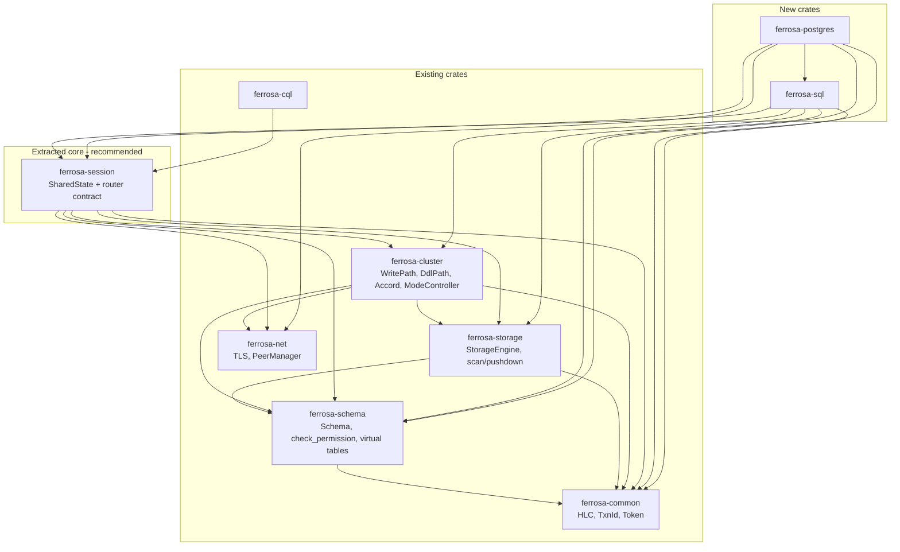
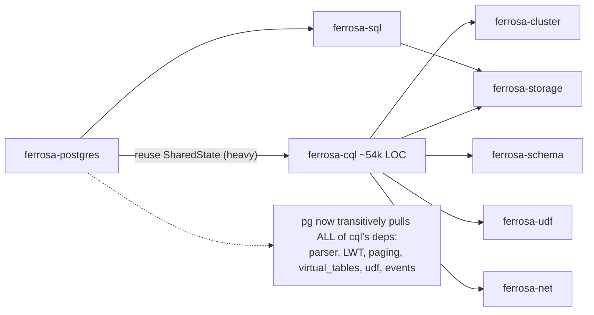

# Postgres Front-End — DSM & Dependency-Surface Design

> Forward-looking design. No product code exists yet (D7). Every crate name, field, and
> path below was verified against the current workspace via `cargo metadata --no-deps` and
> direct source reads on branch `fix/p0-read-compaction-get-error-race`. This document
> validates the proposed dependency surface against that reality and flags what should
> change in `architecture.md`.

## 0. Ground truth — the REAL current workspace graph (verified)

Intra-workspace edges today (`cargo metadata --format-version 1 --no-deps`, leaves first):

| Crate | Depends on (workspace-internal) |
|-------|----------------------------------|
| `ferrosa-common` | — (leaf) |
| `ferrosa-sstable` | common |
| `ferrosa-index` | common |
| `ferrosa-net` | common |
| `ferrosa-udf` | common |
| `ferrosa-schema` | common, index, sstable |
| `ferrosa-storage` | common, index, schema, sstable |
| `ferrosa-cluster` | common, index, net, schema, sstable, storage |
| `ferrosa-cql` | **cluster, common, index, net, schema, sstable, storage, udf** |
| `ferrosa-graph` | cluster, common, net, schema, sstable, storage |
| `ferrosa-sparql` | cluster, common, index, schema, sstable, storage |
| `ferrosa` (bin) | cluster, common, cql, graph, net, schema, sparql, storage, udf |

Verified placement of the reusable assets named in `architecture.md` §1:

- **`SharedState`** is defined in `ferrosa-cql/src/router.rs:860`. It is NOT a neutral
  type — it mixes engine-level handles with CQL-internal types:
  - Neutral handles: `engine: Arc<StorageEngine>` (storage), `schema: Arc<Schema>`
    (schema), `node_config`, `cluster_state: Arc<ArcSwap<ferrosa_cluster::ClusterStateHolder>>`,
    `write_path: Arc<ArcSwap<WritePath>>`, `ddl_path: Arc<ArcSwap<DdlPath>>`,
    `mode_controller: Arc<ferrosa_cluster::ModeController>`,
    `peer_manager: Option<Arc<ferrosa_net::peer::PeerManager>>`,
    `accord_clock: Option<Arc<ferrosa_common::accord::HybridLogicalClock>>`,
    `udf_executor: Arc<UdfExecutor>`.
  - **CQL-only** fields: `prepared_cache: Arc<PreparedCache>`, `query_tracker`,
    `connection_tracker`, `full_scan_tracker: crate::virtual_tables::FullScanTracker`,
    `index_usage_tracker`, `event_sender: broadcast::Sender<crate::event::CqlEvent>`,
    `cql_metrics: Arc<CqlMetrics>`, `topology_policy: ClientTopologyPolicy`, `auth_warn`.
- **`WritePath`** and **`DdlPath`** are defined in **`ferrosa-cluster`** (not storage), and
  re-exported at the crate root — `router.rs:24`: `use ferrosa_cluster::{DdlPath, WritePath};`.
  `WritePath::range_read_projected` already exists (the pushdown read surface partly exists
  at the cluster layer).
- **`StorageEngine`** is in `ferrosa-storage/src/engine.rs`.
- **`Schema`** (the registry) is in `ferrosa-schema/src/registry.rs`; the unified-grant
  primitive **already exists** as `ferrosa_schema::auth::permission::check_permission`
  (`auth/permission.rs:109`), reached via `Registry::check_permission` (`registry.rs:711`).
- **Virtual-table machinery** already lives in `ferrosa-schema` (`virtual_table.rs`,
  `virtual_registry.rs`, `system/schema_tables.rs`).
- **`HybridLogicalClock` / `TxnId`** are in `ferrosa-common/src/accord.rs`.
- The bin constructs `SharedState` directly: `ferrosa/src/main.rs:1217` builds
  `ferrosa_cql::router::SharedState { … }` and hands it to
  `CqlServer::new(..).start_background()` (`main.rs:1349-1352`).

`ferrosa-cql` source totals **~53,947 LOC** (`find … | wc -l`). Depending on the whole
crate to obtain a struct is the central coupling concern this DSM interrogates (§4).

---

## 1. Proposed internal module structure (Power-of-10 spirit: small modules, one responsibility)

### 1.1 `ferrosa-postgres` (new) — wire + session only

| Module | Responsibility (one line) |
|--------|---------------------------|
| `server.rs` | `PostgresServer`, `start_background`, bind 5432, connection/per-IP semaphores, TLS acceptor (reuse `ferrosa-net` TLS). |
| `codec.rs` | Byte framing: 1-byte tag + i32 length, bounded max length; Startup/SSLRequest/CancelRequest special cases. |
| `messages.rs` | Typed front/back messages (Startup, Authentication*, Parse/Bind/Describe/Execute/Sync, RowDescription, DataRow, ErrorResponse, ReadyForQuery, …). |
| `connection.rs` | Per-connection state machine `Startup→Auth→Ready→(Simple\|Extended)→Sync`; txn-status byte `I`/`T`/`E`; error-until-Sync recovery. |
| `scram.rs` | SCRAM-SHA-256 server exchange (D4) against the role store's stored/server keys. |
| `portal.rs` | Named/unnamed prepared statements + portals; param formats; Describe → Row/ParameterDescription. |
| `session.rs` | Session GUCs (`search_path`, `ferrosa.isolation`), current database/schema, applied after auth. |
| `types.rs` | CQL type ↔ Postgres OID mapping; text + binary wire encodings per OID. |
| `catalog_queries.rs` | Recognize/serve driver introspection by delegating to schema's virtual `pg_catalog`/`information_schema`. |
| `dispatch.rs` | Thin glue: route a parsed statement to `ferrosa-sql` (reads/writes) or to the shared DDL/auth paths; owns NO engine logic. |

Intentionally NO planner/optimizer/storage logic here — that is `ferrosa-sql`. This keeps
each module reviewable against its CQL twin and keeps the wire crate's dependency surface
small (§2).

### 1.2 `ferrosa-sql` (new) — bespoke relational engine (the dominant subsystem, D3)

| Module | Responsibility (one line) |
|--------|---------------------------|
| `parser/lexer.rs` | SQL token stream (hand-written, TDD). |
| `parser/ast.rs` | Postgres-dialect-subset AST node definitions. |
| `parser/parse.rs` | Recursive-descent parser → AST. |
| `catalog.rs` | Name resolution + type lookup over `Schema`; `TableProvider`-like scan contract; database/schema (D5/D8) resolution. |
| `binder.rs` | Bind AST names to catalog objects; apply `search_path`; enforce database-bounded reach (D8a). |
| `logical/plan.rs` | Logical nodes: Scan, Filter, Project, Join, Aggregate, Sort, Limit, Subquery, CTE. |
| `logical/rewrite.rs` | Rule-based rewrites: predicate/projection pushdown, join ordering, constant folding. |
| `optimizer.rs` | Orchestrates rewrite passes; cost model later (stub in v1). |
| `physical/scan.rs` | `SeqScan`/`RangeScan` with predicate+projection pushdown into the storage scan contract. |
| `physical/join.rs` | `HashJoin`, `NestedLoopJoin` (bounded buffers; spill past threshold; hard cap → error). |
| `physical/aggregate.rs` | `HashAggregate` (bounded; spill). |
| `physical/sort.rs` | External/spill `Sort`; `Limit`. |
| `exec.rs` | Pull-based (Volcano) executor producing rows in catalog order. |
| `write.rs` | INSERT/UPDATE/DELETE lowering onto `WritePath`; strict path onto Accord when opted in (D1). |
| `error.rs` | Engine error taxonomy — fail-loud over emitting unproven rows (FMEA FM-12/14). |

Every operator is bounded (Power-of-10 §2/§3): bounded buffers, spill-to-disk, hard caps
surfaced as `error.rs` variants, never OOM.

---

## 2. Dependency design (which EXISTING crate each new crate/module touches, and why)

### 2.1 Per-module dependency rationale

`ferrosa-postgres`:

- `ferrosa-net` — TLS acceptor / connection plumbing (mirror CQL's `build_tls_acceptor`). Wire only.
- `ferrosa-schema` — role store for SCRAM verifiers (D4); the shared `check_permission`/`authorize()` (D8b); virtual `pg_catalog` tables for `catalog_queries.rs`.
- `ferrosa-common` — `Token`, `CqlValue`/`CellValue`, HLC types for txn-status mapping.
- `ferrosa-sql` — hands parsed/executed work to the engine via `dispatch.rs`.
- **`ferrosa-session` (new, recommended)** — obtains `SharedState` + the protocol-agnostic
  router/engine contract WITHOUT pulling all of `ferrosa-cql`.

`ferrosa-sql`:

- `ferrosa-storage` — the pull-based scan/range interface with predicate+projection pushdown (`physical/scan.rs`).
- `ferrosa-schema` — catalog/name resolution + type metadata (`catalog.rs`, `binder.rs`).
- `ferrosa-cluster` — `WritePath` (writes) + Accord coordinator/`DdlPath` (`write.rs`); `HybridLogicalClock` flows from common via cluster.
- `ferrosa-common` — value/type/token primitives shared end-to-end.
- **`ferrosa-session` (new)** — `SharedState` handle bundle so the engine reads `engine`/`schema`/`write_path`/`accord_clock` from one place.

Neither new crate should depend on `ferrosa-cql` (see §4).

### 2.2 Dependency matrix (rows DEPEND ON columns; `●` = direct, `○` = transitive-only, blank = none)

Recommended target state (with the `ferrosa-session` extraction):

| ↓ depends on → | common | sstable | index | net | udf | schema | storage | **session** | cluster | sql | cql | postgres |
|----------------|:--:|:--:|:--:|:--:|:--:|:--:|:--:|:--:|:--:|:--:|:--:|:--:|
| **postgres** (new) | ● | | | ● | | ● | ○ | ● | ○ | ● | | — |
| **sql** (new)      | ● | ○ | ○ | ○ | ○ | ● | ● | ● | ● | — | | |
| **session** (new)  | ● | ○ | ○ | ● | ● | ● | ● | — | ● | | | |
| **cql** (existing) | ● | ● | ● | ● | ● | ● | ● | ● | ● | | — | |
| **cluster**        | ● | ● | ● | ● | | ● | ● | | — | | | |
| **storage**        | ● | ● | ● | | | ● | — | | | | | |
| **schema**         | ● | ● | ● | | | — | | | | | | |
| **net**            | ● | | | | | | | | | | | |
| **common**         | — | | | | | | | | | | | |

Note the change to the EXISTING `cql` row: it gains a `●` on `session` and no longer
defines `SharedState` itself. `postgres` has NO mark in the `cql` column — that is the whole
point of the extraction.

---

## 3. Mermaid dependency graphs (validated — `mermaid_validate` returned `valid:true`, 0 errors)

### 3.1 RECOMMENDED target graph (with `ferrosa-session` extraction)

### 3.2 The architecture.md-as-written graph (heavy coupling this DSM warns against)

---

## 4. CYCLE + COUPLING VALIDATION (the core ask)

### 4.1 Is `ferrosa-postgres → ferrosa-cql` a true cycle?

**No hard compile cycle today** — `ferrosa-cql` does not (and must not) depend on
`ferrosa-postgres`, so the edge is acyclic at the cargo level. The problem is not a cycle;
it is **coupling weight + a latent cycle hazard**:

1. **Coupling weight (real, now).** To obtain `SharedState` (a struct), `ferrosa-postgres`
   would link the entire ~54k-LOC `ferrosa-cql` crate and, transitively, ALL of its deps:
   `cluster, storage, schema, net, udf, index, sstable, common`. The Postgres wire layer has
   zero need for CQL's parser, LWT engine, paging, `virtual_tables` trackers, UDF executor,
   or `CqlEvent` broadcast. This violates Power-of-10 §9 (minimize indirection / unnecessary
   layers) and the DSM principle of depending on the smallest provider. It also inflates
   incremental build time for the new crate and couples PG's compile health to CQL churn.
2. **Latent cycle hazard (the real risk).** `SharedState` is the natural home for
   cross-protocol shared services. The moment any *Postgres-originated* concern needs to be
   visible to that shared contract (e.g. a unified session registry, a shared cancel-key
   table, or — most likely — the **D8b unified `authorize()` checkpoint** if it were placed
   in CQL), you get pressure to make `ferrosa-cql` reference Postgres types, which *would*
   close the cycle. Putting the shared contract inside one of the two protocol crates is the
   classic setup for a future cycle. Fail-loud principle applies to architecture too: design
   out the hazard now rather than discover it mid-implementation.

### 4.2 Options for the `SharedState` / router-contract home

**Option A — depend on the whole `ferrosa-cql` (architecture.md as written).**
- Pros: zero new crate; `SharedState` already exists and is constructed in `main.rs`.
- Cons: pulls 54k LOC + 8 transitive crates for a struct; latent cycle hazard (§4.1.2);
  couples PG build to CQL; CQL-internal fields (`prepared_cache`, `cql_metrics`,
  `event_sender`, `topology_policy`, trackers) leak into PG's view of "shared" state.
- Verdict: **reject.**

**Option B — extract `SharedState` + protocol-agnostic contract into a NEW
`ferrosa-session` crate (RECOMMENDED).**
- Placement: above `ferrosa-cluster` (it needs `WritePath`/`DdlPath`/`ModeController`/Accord),
  above `ferrosa-storage`/`ferrosa-schema`/`ferrosa-net`/`ferrosa-common`; below BOTH
  `ferrosa-cql` and `ferrosa-postgres`. Both protocol crates depend on it.
- Contents: the **neutral** subset of today's `SharedState` (engine, schema, node_config,
  cluster_state, write_path, ddl_path, mode_controller, peer_manager, accord_clock,
  udf_executor) + the protocol-agnostic write/DDL dispatch contract (`route(Statement,
  RequestContext)` for writes/DDL, which D2/D3 already keep separate from reads) + the
  `RequestContext`/`AuthContext` plumbing both protocols share.
- CQL-internal fields stay in `ferrosa-cql` via composition: `ferrosa_cql` keeps a thin
  `CqlSharedState { core: Arc<ferrosa_session::SharedState>, prepared_cache, cql_metrics,
  event_sender, topology_policy, trackers, auth_warn }`. PG similarly composes
  `PgSharedState { core, portal/scram state }`.
- Pros: PG depends on ~1 small crate, not 54k LOC; the cycle hazard is structurally removed
  (the shared contract lives below both protocols, so neither protocol's types can leak into
  it); `main.rs` constructs the neutral core ONCE and both servers clone it (§5); mirrors how
  `ferrosa-graph`/`ferrosa-sparql` already sit beside CQL over the same lower layers.
- Cons: one-time refactor of `ferrosa-cql` (move the struct, re-export for source compat,
  update `main.rs:1217` construction site and `router.rs:860`). Moderate, mechanical,
  test-covered by the existing CQL suite. This is an ordering constraint, not new risk.
- Verdict: **recommended.**

**Option C — place the shared contract in `ferrosa-cluster` (or `ferrosa-storage`).**
- Pros: no new crate; `ferrosa-cluster` already owns `WritePath`/`DdlPath`/`ModeController`
  and is below both protocols, so it is cycle-safe.
- Cons: `SharedState` references `Arc<UdfExecutor>` (`ferrosa-udf`) and `PeerManager`
  (`ferrosa-net`, which cluster already has) — but **`ferrosa-cluster` does not currently
  depend on `ferrosa-udf`**, so this either adds a `cluster → udf` edge (widening a hot,
  consensus-critical crate for an unrelated reason) or forces UDF out of the shared bundle.
  It also overloads the cluster crate (already large, Raft/Accord-critical) with a
  session-aggregation role that is not its job (Power-of-10 §4/§6: keep scope minimal).
- Verdict: **acceptable fallback if a new crate is politically unwanted**, but `ferrosa-udf`
  edge + scope-creep make Option B cleaner. If chosen, put the bundle in a new
  `ferrosa-cluster::session` module and leave `udf_executor` composed in CQL, not in core.

**Recommendation: Option B (`ferrosa-session`).** Extract the neutral `SharedState` core +
protocol-agnostic write/DDL router contract into `ferrosa-session`; both `ferrosa-cql` and
`ferrosa-postgres` depend on it and each composes its own protocol-private fields on top.

### 4.3 Other cycle risks checked

- **`ferrosa-schema` calling back into the engine for D8b `authorize()`?** Verified
  `ferrosa-schema` depends ONLY on `common, index, sstable` — it does **not** depend on
  `storage` or `cluster`. The grant check (`check_permission`) already lives here and is pure
  over a schema snapshot. So the unified `authorize()` must NOT need engine/cluster handles;
  if any future variant wants live engine state, pass it IN as a parameter (dependency
  inversion) rather than adding a `schema → storage/cluster` edge — that edge would create a
  `storage → schema → storage` cycle (storage already depends on schema). **Keep `authorize()`
  pure-over-snapshot in `ferrosa-schema`.** No cycle.
- **Virtual `pg_catalog` tables needing the database registry.** The registry +
  keyspace↔database mapping are schema-level metadata; placing them in `ferrosa-schema`
  (where `virtual_registry.rs`/`virtual_table.rs` already live) keeps catalog projection
  local with no upward edge. No cycle.
- **`ferrosa-sql → ferrosa-cluster` (writes/Accord) and `ferrosa-cql → ferrosa-cluster`** are
  both downward; no cycle. `ferrosa-sql` must NOT depend on `ferrosa-postgres` (engine stays
  front-end-agnostic, per D3 "could back other front-ends") — enforce this as a lint/review
  rule.

---

## 5. Where D8b `authorize()` and the new registry/mapping tables live (ONE impl, no cycle)

**Home: `ferrosa-schema`.** It already contains `auth::permission::check_permission`
(`auth/permission.rs:109`) reached via `Registry::check_permission` (`registry.rs:711`), and
the virtual-table machinery (`virtual_table.rs`, `virtual_registry.rs`,
`system/schema_tables.rs`). It is below `storage`, `cluster`, `cql`, and the new crates, so a
single function here is callable by every path with no cycle.

Concrete placement:

- **`authorize()` unified checkpoint (D8b):** add the database-level grant
  (`CONNECT`/`USAGE ON DATABASE`) and `GRANT ON SCHEMA → keyspace-permission` mapping to
  `ferrosa-schema/src/auth/permission.rs`, extending the existing `Permission`/`Resource`
  enums and `check_permission`. Expose ONE entry point (e.g.
  `Registry::authorize(auth, action, resource)`). The CQL router (today's `router.rs`
  call-sites) and the new PG `dispatch.rs`/`session.rs` both call it. Keeping it pure over a
  `Schema` snapshot guarantees no `schema → engine` back-edge (§4.3). This is the FMEA-flagged
  privilege-divergence target — single source of truth.
- **Database registry + keyspace↔database mapping (D8a/D8c):** new `system_pg`-style system
  tables defined in `ferrosa-schema/src/system/` (alongside the existing `system_auth`
  tables). The grant rows extend `system_auth`. `pg_database`/`pg_namespace`/`pg_class`/
  `pg_attribute` virtual tables project from these via the existing virtual registry, filtered
  by connected database + caller grants.
- **DDL broadcast:** CQL `CREATE KEYSPACE` and PG `CREATE DATABASE`/attach both mutate this
  registry through the shared `DdlPath` (in `ferrosa-cluster`); broadcast must cover the new
  tables. Since both protocols reach `DdlPath` through `ferrosa-session` (Option B), the write
  side is also single-sourced.

Result: BOTH the CQL path and the Postgres path call ONE `authorize()` and ONE registry,
located in a crate that nothing above it can cycle back into.

---

## 6. Integration with the main binary + shared runtime / SharedState construction

Today (`ferrosa/src/main.rs`):
- `:1217` constructs `ferrosa_cql::router::SharedState { … }` inline.
- `:1349-1352` builds `CqlServer::new(cql_config, shared_state).start_background()`.

Target (Option B):
1. `main.rs` constructs the neutral `ferrosa_session::SharedState` core ONCE (same handles it
   builds today — engine, schema, write_path, ddl_path, cluster_state, mode_controller,
   peer_manager, accord_clock, udf_executor).
2. CQL wraps it: `CqlSharedState { core: core.clone(), prepared_cache, cql_metrics,
   event_sender, topology_policy, trackers, auth_warn }` → `CqlServer::start_background`
   (unchanged port 9042).
3. PG wraps it: `PgSharedState { core: core.clone(), … }` →
   `ferrosa_postgres::server::PostgresServer::new(pg_config, pg_shared).start_background()`,
   gated by config/env mirroring `FERROSA_CQL_*`: `FERROSA_POSTGRES_BIND`
   (default `0.0.0.0:5432`), TLS cert/key, auth-enabled flag.
4. Runtime: PG listener spawns on a background runtime exactly like CQL/Bolt/SPARQL today
   (one `async fn main()` spawning N listeners over the shared state). No new global runtime.
5. The bin's workspace edge changes from "owns construction of a CQL struct" to "owns
   construction of a session-core struct" — small, mechanical, and makes the
   construction-site cleanly protocol-neutral.

---

## 7. Risks, dependency smells & recommendations (what should change in architecture.md)

1. **Dependency smell — `pg → whole ferrosa-cql` to grab a struct.** Replace with the
   `ferrosa-session` extraction (§4.2 Option B). **Edit architecture.md §1/§3** to say
   "Postgres takes a clone of the shared `SharedState` core from the neutral
   `ferrosa-session` crate," not "the CQL `SharedState`." (Highest-value change.)
2. **`authorize()` home was left ambiguous** (architecture.md §4b says "single shared
   enforcement point" but doesn't name a crate). Pin it to `ferrosa-schema` (§5). **Add to
   architecture.md.**
3. **Keep `authorize()` pure-over-snapshot.** If a future grant check wants live engine
   state, inject it as a parameter — never add `schema → storage/cluster` (would cycle with
   `storage → schema`). Document this constraint.
4. **`ferrosa-sql` must not depend on `ferrosa-postgres`.** The engine is front-end-agnostic
   (D3). Enforce via review/lint; state it explicitly in architecture.md §3.2.
5. **Storage scan/pushdown surface (D2/D3) is partly present.** `WritePath::range_read_projected`
   exists in `ferrosa-cluster`, but it sits on the cluster crate, not `ferrosa-storage`.
   architecture.md §3.3 says the pull-based scan interface is a `ferrosa-storage` extension —
   **verify whether the engine's `physical/scan.rs` should pull from `ferrosa-storage`
   directly or via `ferrosa-cluster::WritePath`.** This affects whether `ferrosa-sql` needs a
   `cluster` edge for reads (currently marked for writes only). Resolve before M1.
6. **Build-ordering constraint (D9 harness-first):** the `ferrosa-session` extraction is a
   prerequisite that touches the existing `ferrosa-cql` + `main.rs` and must land (with the
   CQL test suite green) BEFORE PG wire/engine code. Sequence it as Sprint-0 infra work
   alongside the test harness, not as a PG feature.
7. **`udf_executor` in the shared core** forces any "shared core" host to depend on
   `ferrosa-udf`. `ferrosa-session` can (it's a fresh crate); `ferrosa-cluster` (Option C)
   currently can't without a new edge. Another reason to prefer Option B. If PG genuinely
   never needs UDFs at the wire layer, consider leaving `udf_executor` composed in
   `CqlSharedState` rather than the neutral core.
8. **Latent-cycle guard.** Add an architectural lint/CI rule (or a `deny`-style note) that
   `ferrosa-session` may NOT depend on `ferrosa-cql` or `ferrosa-postgres`, and `ferrosa-sql`
   may NOT depend on `ferrosa-postgres` — the two invariants that keep the graph acyclic.
