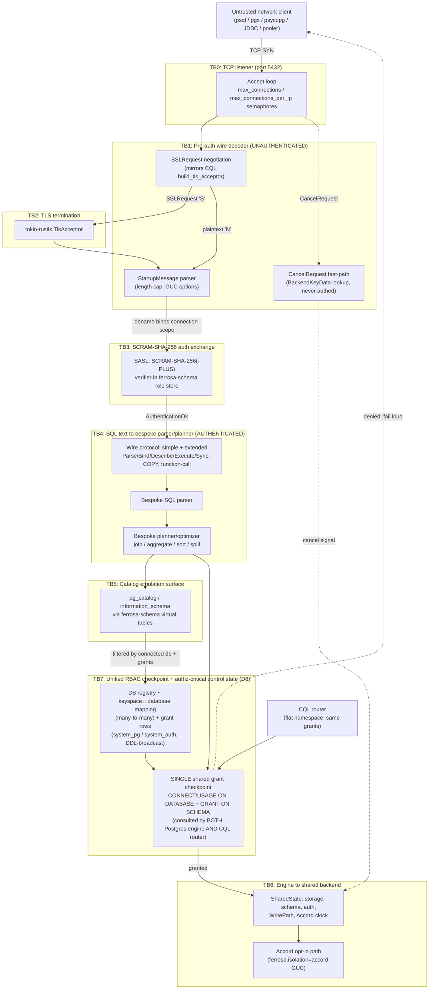

# Postgres Front-End — STRIDE Threat Model

## Scope and locked design constraints

This model covers the proposed Postgres wire-protocol front-end only. The following are
**locked design decisions** (constraints, not subjects of debate here):

- **D1** — Eventual consistency by default; strict-serializable (Accord) is opt-in via the
  session GUC `ferrosa.isolation=accord`, settable at connection time through the
  `StartupMessage` `options`/server-settings (dotted custom GUC) or per-session `SET`.
- **D2/D3** — A **bespoke** relational engine (own planner/optimizer/join/aggregate/sort/spill
  operators) over ferrosa's wide-column storage. No DataFusion.
- **D4** — Auth uses **SCRAM-SHA-256** verifiers stored alongside the existing bcrypt
  records in the shared `ferrosa-schema` role store (`ferrosa-schema/src/auth/`); bcrypt
  remains for CQL/Bolt/SPARQL.
- **D5** _(revised by D8)_ — keyspace = Postgres schema;
  `pg_catalog`/`information_schema` emulated via `ferrosa-schema` virtual tables. The
  "one logical database `ferrosa`" assumption is **superseded by D8**.
- **D8** — Multi-database, unified-RBAC, CQL interop. Namespace is a real 3-level
  **database → schema (= keyspace) → table**; a connection binds to exactly one database.
  - **D8a** — a keyspace can be attached to **many** databases (many-to-many mapping table);
    JOINs are **database-bounded** (no cross-database joins).
  - **D8b** — a **unified** grant model: `GRANT ... ON DATABASE` (`CONNECT`/`USAGE`) +
    `GRANT ... ON SCHEMA` are enforced at a **single shared checkpoint** consulted by **both**
    the Postgres engine and the CQL router. "Flat through CQL" = namespace flatness only;
    permissions (including the database-connect grant) apply to CQL too.
  - **D8c** — a keyspace with no explicit attachment **auto-lands in a default database
    `ferrosa`**, so CQL-created keyspaces stay reachable from Postgres.
  - **Rollout** — existing CQL roles must gain `CONNECT ON DATABASE ferrosa` (or an implicit
    default-db connect) or unification revokes their access; per the fail-loud philosophy a
    role denied at rollout is surfaced loudly and access is **never silently widened**.
- **D6** — Milestone 1 = first JOIN end-to-end with a real driver over SCRAM.
- **D10** — the unified grant checkpoint (E5/TB7) is `ferrosa-schema::authorize()`, **pure over
  a metadata snapshot**; shared state is the neutral `ferrosa-session` core, **not** the CQL
  crate (no `postgres → cql` edge).
- New crate `ferrosa-postgres` (wire) + bespoke engine crate; listener on **TCP 5432** in
  `ferrosa/src/main.rs` sharing `SharedState` (storage, schema, auth, WritePath, Accord clock);
  TLS mirrors CQL via SSLRequest negotiation.

The threat model **designs to** these constraints; it does not relitigate them. Where a
constraint *creates* a threat (e.g. the D1 GUC opt-in creating a pooler-leakage surface),
that threat is enumerated and given a control.

## Trust-boundary overview

The Postgres backend sits at the same trust tier as the CQL listener: an untrusted network
peer drives a state machine through several boundaries before, and after, it is authenticated.
The critical observation is that a large amount of parsing and buffering happens **pre-auth**:
SSLRequest, StartupMessage, the SCRAM exchange itself, and the CancelRequest fast-path (which
is, by Postgres design, never authenticated). Only after `AuthenticationOk` does the connection
cross into the authenticated query path, and only then does it reach the bespoke planner,
catalog emulation, and shared storage/schema.

### Boundary inventory

| ID | Boundary | Authenticated? | Primary risk class |
|----|----------|----------------|--------------------|
| TB0 | TCP accept loop on 5432 | No | DoS (connection exhaustion) |
| TB1 | Pre-auth wire decoder (SSLRequest, StartupMessage, CancelRequest) | **No** | DoS, Spoofing, Tampering |
| TB2 | TLS termination | No (negotiating) | Info-disclosure, Spoofing (downgrade) |
| TB3 | SCRAM-SHA-256 exchange | Becoming | Spoofing, Info-disclosure (replay/downgrade) |
| TB4 | Extended-query flow → bespoke parser/planner | Yes | DoS (query-of-death), Elevation |
| TB5 | Catalog emulation (`pg_catalog`/`information_schema`, now incl. `pg_database`) | Yes | Info-disclosure (cross-tenant, **cross-database**) |
| TB6 | Engine → SharedState / Accord | Yes | Elevation, Tampering, Repudiation |
| TB7 | **Unified RBAC checkpoint + control state (D8)**: single grant gate shared by Postgres engine **and** CQL router; database registry + keyspace↔database mapping tables | Yes | **Elevation (path divergence)**, Info-disclosure (cross-db), Spoofing/Tampering (control-state writes), Confused-deputy |

## STRIDE analysis

Threats are specific to this protocol surface. Severity is rated Critical / High / Medium / Low
on impact × exposure (pre-auth and cross-tenant threats weighted up). Each carries a neutral
**design control / acceptance gate** — a condition that must hold before the surface is considered
shippable, not an implementation mandate.

### Spoofing

| # | Threat | Severity | Design control / acceptance gate |
|---|--------|----------|----------------------------------|
| S1 | **SCRAM downgrade to plaintext / `trust` / MD5.** A MITM or malicious client negotiates the connection down from SCRAM-SHA-256 to a weaker `AuthenticationCleartextPassword`/`AuthenticationMD5Password` method (or, on a non-TLS socket, captures the cleartext). | **Critical** | Server advertises SASL `SCRAM-SHA-256` (and `-PLUS` when TLS is up) as the *only* method; cleartext/MD5 auth methods are never emitted. Acceptance: a driver that requests cleartext is rejected with a fixed error; integration test asserts no `AuthenticationCleartextPassword`/`MD5` code path is reachable. |
| S2 | **SCRAM channel-binding absence enabling MITM credential relay.** Without channel binding (`SCRAM-SHA-256-PLUS`), an attacker terminating TLS can relay the SCRAM exchange to the real server. | **High** | When TLS is active, advertise and require `SCRAM-SHA-256-PLUS` with `tls-server-end-point` binding; the client's GS2 header (`p=`/`y=`/`n=`) is validated against actual TLS state and a `y` (downgrade-claim) over a TLS socket is rejected. Acceptance: test that a channel-binding mismatch fails authentication. |
| S3 | **CancelRequest / BackendKeyData forgery (cross-session cancel).** CancelRequest is unauthenticated by Postgres design; an attacker who guesses or brute-forces a `(pid, secret_key)` pair can cancel another session's running query. | **High** | `BackendKeyData` secret key is a full-entropy CSPRNG value (≥ 32-bit secret, prefer 64-bit where driver-compatible); cancel lookups are constant-time and rate-limited per source IP; a failed cancel is logged. Acceptance: brute-force resistance documented; cancel attempts metered. |
| S4 | **Connection identity spoofing via StartupMessage `user`.** The `user` parameter is attacker-controlled and must not be trusted until SCRAM completes. | **Medium** | `user` from StartupMessage is treated as a *claim* only; no role/permission is bound until `AuthenticationOk`. Acceptance: authz checks reference the SCRAM-verified principal, never the raw startup `user`. |
| S5 | **Database-scope spoofing via StartupMessage `database` (confused deputy).** D8 binds a connection to one database via the startup `database` parameter, which selects *which* grant scope (`CONNECT ON DATABASE`) and *which* attached keyspaces are reachable. A client can claim any `dbname`; if the engine trusts the claimed name without re-resolving the connected database's grant + attachment set on every object access, a connection nominally scoped to database A could touch keyspaces it reaches only via database B. | **High** | The connected database is resolved once at connect against the registry, the `CONNECT ON DATABASE` grant is checked there (fail loud on denial — see E5), and **every** subsequent object resolution (planner, catalog, CQL router) is filtered through *that* database's keyspace-attachment set and the caller's schema grants — never the raw claimed name. Acceptance: a connection to database A cannot SELECT/JOIN a keyspace attached only to B; a `dbname` not in the registry is rejected with a fixed error, not coerced to a default. |

### Tampering

| # | Threat | Severity | Design control / acceptance gate |
|---|--------|----------|----------------------------------|
| T1 | **GUC injection via StartupMessage `options`.** D1 permits a dotted custom GUC (`ferrosa.isolation`) in startup `options`. A crafted `options` string could attempt to set arbitrary/privileged GUCs (e.g. spoof `is_superuser`, `role`, internal flags) or smuggle extra `-c` directives. | **High** | StartupMessage GUCs are parsed against an explicit allow-list; only namespaced `ferrosa.*` custom GUCs and a known-safe subset of standard runtime params are accepted. Security-relevant GUCs (`role`, `session_authorization`, any `is_superuser`-like flag) are non-settable via the wire. Unknown GUCs are ignored-with-warning, never silently applied. Acceptance: fuzz the `options` parser; assert no privileged GUC is reachable. |
| T2 | **Extended-query state-machine desync (Parse/Bind/Describe/Execute/Sync).** Out-of-order or malformed extended-query messages (Bind referencing an unknown prepared statement/portal, Execute without Bind, missing Sync) corrupt per-connection state or leak a previous statement's plan. | **Medium** | The extended-query state machine is explicit and total: every message validates the referenced statement/portal exists and is owned by this connection; protocol violations send `ErrorResponse` + enter the documented skip-until-Sync recovery, never undefined behavior. Acceptance: protocol-conformance tests for each illegal transition. |
| T3 | **COPY-stream framing abuse.** `CopyData`/`CopyDone`/`CopyFail` carry bulk attacker bytes; malformed framing or a never-terminated COPY can corrupt parse state or pin buffers. | **Medium** | COPY data is bounded per-message and the COPY subprotocol has a hard total-bytes / duration cap; an unterminated COPY is reaped. Acceptance: COPY fuzz + a test that an unterminated COPY frees resources. |
| T4 | **Unauthorized mutation of the authz-critical control state (D8).** The database registry, the keyspace↔database mapping (many-to-many), and the database/schema grant rows are **new control state that directly governs authorization**. `CREATE DATABASE`, attach/detach-keyspace, and grant statements (over Postgres) and `CREATE KEYSPACE` (over CQL) all write it. A role that can write these tables can attach a keyspace it controls into a database it can connect to (privilege escalation), or detach a keyspace to deny others (DoS). | **High** | Writes to the registry/mapping/grant tables are gated by an explicit administrative permission (e.g. a database-owner / `CREATEDB`-equivalent and grant-admin right), checked at the **same** unified checkpoint (TB7), never inferred from mere `CONNECT`. Attach requires authority over **both** the keyspace and the target database. The tables are not directly INSERT/UPDATE-able as ordinary user tables (cf. E4 for `pg_catalog`). Acceptance: a non-admin `CREATE DATABASE` / attach-keyspace / `GRANT ... ON DATABASE` is refused on both paths; attach without rights over both endpoints fails. |
| T5 | **DDL-broadcast tampering of the mapping/registry across the cluster.** D8 routes registry + mapping mutations through the existing DDL broadcast (`CREATE KEYSPACE`/`CREATE DATABASE`/attach all replicate). A forged, replayed, or partially-applied broadcast could leave nodes with divergent attachment/grant state — some nodes granting an access others deny, which is itself a divergence-class privilege bug (cf. E5). | **Medium** | The new control tables ride the existing authenticated internode DDL channel (`ferrosa-net`), with the same integrity/ordering guarantees as schema DDL; mapping/grant mutations are idempotent and versioned so a replay cannot silently widen, and a node that cannot apply a broadcast fails loud rather than serving stale grant state. Acceptance: a node that misses/rejects a mapping broadcast does not serve queries against the affected database with stale grants; convergence is asserted in a cluster test. |

### Repudiation

| # | Threat | Severity | Design control / acceptance gate |
|---|--------|----------|----------------------------------|
| R1 | **Unattributable auth failures / privileged operations.** Without an audit trail keyed to the SCRAM principal, an attacker's failed logins, DDL, or cross-schema access cannot be reconstructed. | **Medium** | Auth outcomes (success/failure, method, channel-binding state, source IP) and privileged statements are emitted through the existing `ferrosa-schema` audit log, keyed by verified principal and connection id. Acceptance: an auth failure and a DDL statement each produce one attributable audit record. |
| R2 | **Cancel/abort actions not logged.** A forged or legitimate CancelRequest leaves no trace (see S3). | **Low** | Cancel attempts (matched and unmatched) are logged with source IP. Acceptance: covered by S3's metering gate. |

### Information disclosure

| # | Threat | Severity | Design control / acceptance gate |
|---|--------|----------|----------------------------------|
| I1 | **Cross-tenant schema leakage via emulated `pg_catalog`/`information_schema`.** D5 emulates the catalog over `ferrosa-schema` virtual tables. A naive emulation lists *all* keyspaces/tables/roles, leaking other tenants' schema names, columns, and role names to any authenticated principal. | **Critical** | Catalog virtual-table reads are filtered by the same authorization predicate as ordinary table access; a principal sees only objects in schemas (keyspaces) it is granted. `pg_roles`/`pg_authid`-equivalents never expose verifiers and are restricted. Acceptance: a tenant-A principal querying `information_schema.tables`/`pg_class` sees zero tenant-B objects; verifier columns are unreadable. |
| I2 | **Cleartext credentials/data on a non-TLS socket.** With TLS optional (mirrors CQL), a client may connect plaintext; SCRAM protects the password but query text and result rows traverse in clear. | **High** | A deploy-time `require_tls` (sslmode-equivalent) gate; when set, plaintext StartupMessage after an `N` SSL response is refused. Default posture and the non-TLS risk are documented loudly (fail-loud philosophy). Acceptance: with TLS required, a plaintext connection is rejected before auth. |
| I3 | **Verifier disclosure through error/parameter-status channels.** SCRAM iteration count, salt, or stored-key material leaking via verbose errors or `ParameterStatus` enables offline attack. | **High** | SCRAM messages expose only the protocol-required `s=`/`i=`; error responses are generic for auth failures (no "user does not exist" vs "bad password" distinction). Acceptance: identical error/timing for unknown-user and bad-password (also mitigates user enumeration). |
| I4 | **Plan/identifier disclosure across connections.** A leaked prepared-statement or portal name from another session (see T2) reveals query text or schema. | **Medium** | Prepared statements/portals are namespaced per connection and dropped on disconnect. Acceptance: covered by T2. |
| I5 | **Driver/version fingerprinting via `ParameterStatus`/`server_version`.** Detailed `server_version` and GUC reports aid targeting. | **Low** | Report a minimal, intentional `server_version` compatibility string; do not leak internal build identifiers. Acceptance: documented version string. |
| I6 | **Cross-database catalog leakage (D8).** With a real `pg_database` and a 3-level namespace, a role connected to database A can enumerate the schemas/tables/columns of database B via `pg_database`/`pg_namespace`/`pg_class`/`pg_attribute` if the catalog is not filtered by the *connected* database and the caller's grants. Worse, a keyspace **attached to multiple databases** (D8a) can leak its existence and columns to a role that holds only one of those databases. The headline I1 cross-tenant case now has a cross-*database* dimension. | **Critical** | `pg_database` lists only databases the caller holds `CONNECT`/`USAGE` on; `pg_namespace`/`pg_class`/`pg_attribute` are filtered to the connected database's attached keyspaces **and** the caller's per-schema grants — applied at the same unified checkpoint (TB7) as data access, so catalog visibility can never exceed data visibility. A multi-attached keyspace is visible only through databases the caller can connect to. Acceptance: a role connected to A sees zero B-only databases/schemas/tables in any catalog relation; a multi-attached keyspace is invisible through a database the caller lacks `CONNECT` on. |
| I7 | **Default-database auto-landing (D8c) as an over-broad disclosure surface.** Because an unmapped keyspace auto-lands in the default database `ferrosa`, a keyspace created via CQL becomes instantly visible (existence + columns) in `ferrosa` to *any* role holding default-db connect — possibly wider than the keyspace's own grants intend, and immediate (no admin step). | **High** | Even in the default database, catalog and data visibility remain gated by the keyspace's **own schema grants** at the unified checkpoint — default-db `CONNECT` is necessary but not sufficient to see a keyspace's objects; landing in `ferrosa` does not grant `USAGE ON SCHEMA`. The implicit-default rule (D8c) and its visibility consequence are documented loudly. Acceptance: a freshly CQL-created keyspace is not visible to a default-db-connect role that lacks a schema grant on it. |

### Denial of service

| # | Threat | Severity | Design control / acceptance gate |
|---|--------|----------|----------------------------------|
| D-1 | **Oversized StartupMessage / unbounded message length (pre-auth).** The Postgres message header carries a 32-bit length; an attacker sends a huge declared length pre-auth to force unbounded buffer allocation. CQL already caps frame bodies at **256 MiB** (`DEFAULT_MAX_FRAME_SIZE`, `ferrosa-cql/src/frame.rs:19`). | **Critical** | The Postgres codec enforces a hard per-message length cap (a small pre-auth cap for StartupMessage/SASL — kilobytes — and a separate, configurable post-auth cap not exceeding the CQL 256 MiB ceiling). Declared lengths over the cap are rejected before allocation. Ties to Power-of-10 Rule 3 (constrained dynamic allocation). Acceptance: a StartupMessage with an over-cap declared length is rejected without large allocation; fuzz the length field. |
| D-2 | **Pre-auth message flooding / slowloris.** An unauthenticated peer opens many connections and dribbles bytes (or floods StartupMessages) to exhaust the accept loop, file descriptors, and per-connection buffers. | **Critical** | Inherit the CQL listener's `max_connections` (1024) and `max_connections_per_ip` (64) semaphores (`ferrosa-cql/src/server.rs`); add a pre-auth handshake **timeout** and a cap on bytes buffered before `AuthenticationOk`. Acceptance: N+1 connections from one IP are rejected; a connection idle in handshake past the timeout is closed. |
| D-3 | **Query-of-death in the bespoke planner — deep nested subqueries.** D2/D3's own planner must bound recursion. Deeply nested subqueries / parenthesization can blow the planner stack or explode planning time. | **High** | The parser and planner enforce a maximum subquery/expression nesting depth and a planning-time / iteration budget (Power-of-10 Rule 1 simple control flow, Rule 2 bounded loops — no unbounded recursion in plan construction). Acceptance: a pathologically nested query is rejected with a clear error, not a crash; depth limit is a tested constant. |
| D-4 | **Cartesian-join / cross-product amplification.** A small query (`SELECT … FROM a, b, c …` with no/weak join predicates) produces an O(n^k) intermediate that exhausts CPU and memory before any row is returned — the bespoke analog of an algorithmic-complexity attack. M1 (D6) ships JOIN, so this is in scope at first release. | **High** | The optimizer estimates output cardinality and enforces a per-query intermediate-row / time budget; unbounded cross products are refused or require an explicit opt-in. Bounded operators only (Power-of-10 Rule 2). Acceptance: an unconstrained 3-way cross join over large tables is bounded/aborted, not run to OOM. |
| D-5 | **Spill exhaustion (sort/aggregate/join spill).** The bespoke sort/aggregate/join spill operators write to local disk; an attacker drives a query that spills until disk is exhausted, taking down the node (which also threatens the S3 write-behind cache). | **High** | Per-query and global spill quotas with admission control; spill is bounded and a query exceeding its quota fails cleanly rather than filling the disk. Acceptance: a high-spill query is capped and the node's storage cache remains healthy. |
| D-6 | **Prepared-statement / portal accumulation.** A client `Parse`s many named statements without `Close`, growing per-connection (and shared-cache) memory unboundedly. | **Medium** | Bound the number of named prepared statements/portals per connection; enforce an eviction or hard cap (Power-of-10 Rule 3, bounded collections). Acceptance: exceeding the cap returns an error; disconnect frees all. |
| D-7 | **Accord opt-in amplification.** A connection pinned to `ferrosa.isolation=accord` (D1) drives a flood of strict-serializable transactions, saturating the Accord coordinator shared with CQL LWT. | **Medium** | Accord-path requests share the existing write backpressure (`Semaphore`) and are admission-controlled; the eventual-consistency default means only opted-in connections reach this path. Acceptance: Accord-path load does not starve CQL; backpressure observable via metrics. |

### Elevation of privilege

| # | Threat | Severity | Design control / acceptance gate |
|---|--------|----------|----------------------------------|
| E1 | **Authz bypass: Postgres-role vs ferrosa-role mismatch.** D4/D5 map Postgres roles/schemas onto ferrosa keyspaces and the shared role store. A gap where the Postgres path checks weaker (or no) permissions than CQL lets a principal read/write data it could not via CQL. | **Critical** | The Postgres engine routes every read/write/DDL through the **same** `SharedState` authorization checks as CQL (single chokepoint); no Postgres-only fast path skips authz. DDL via Postgres maps to the same schema-mutation permissions. Acceptance: a principal denied a keyspace via CQL is denied the equivalent schema via Postgres for SELECT/INSERT/DDL. **Under D8 this is sharpened by E5: the chokepoint must be the literally-shared grant checkpoint, asserted divergence-free on both paths.** |
| E2 | **Privileged GUC / `SET ROLE` escalation.** `SET ROLE`, `SET session_authorization`, or a smuggled superuser GUC (see T1) elevates the session's effective principal. | **High** | `SET ROLE`/`session_authorization` either unsupported or strictly validated against grants of the authenticated principal; no GUC can grant superuser. Acceptance: `SET ROLE` to an ungranted role fails. |
| E3 | **Function-call / FunctionCall-message abuse.** The legacy FunctionCall protocol message (and any UDF surface) invokes server-side functions by OID; an attacker calls an internal/privileged function directly. | **High** | The FunctionCall message is either rejected (recommended — most modern drivers do not need it) or restricted to a vetted allow-list with full authz; any UDF dispatch shares the `ferrosa-udf` sandbox (Wasmtime) and authz. Acceptance: FunctionCall to an arbitrary OID is refused. |
| E4 | **Catalog-write tampering.** If catalog emulation (D5) is anything other than read-only virtual tables, a client could `INSERT`/`UPDATE` `pg_catalog` to forge metadata. | **Medium** | `pg_catalog`/`information_schema` virtual tables are strictly read-only at the engine boundary; writes are rejected. Acceptance: an `INSERT INTO pg_catalog.*` is refused. |
| **E5** | **Grant-check DIVERGENCE between the Postgres path and the CQL path (D8b) — the headline new risk.** The unified grant model (`CONNECT/USAGE ON DATABASE` + `GRANT ON SCHEMA`) must be enforced identically for both the Postgres engine and the CQL router. If the two paths consult *different* code — or one path forgets the new database-level grant (e.g. CQL keeps its legacy keyspace-only check) — a principal **denied on one path is allowed on the other**: a privilege escalation that the deny-side audit will never show. This subsumes E1 and elevates it: E1 was "Postgres skips authz"; E5 is "the two paths *disagree*." | **Critical** | There is exactly **one** grant-enforcement code path — a single shared checkpoint (TB7) — that both the Postgres engine and the CQL router call for every database-connect, schema-usage, and object access. Neither path has a private authz branch. The same decision function is exercised by **shared test fixtures driven on both paths**: a table of (principal, database, schema, action) cases is asserted to yield byte-identical allow/deny over Postgres *and* over CQL, including the database-connect gate. A divergence is a build-breaking test failure, and the `ELECTION_STORM`-style metric posture applies: a runtime path-disagreement counter (should be 0) is wired so a divergence in production is loud, not silent. Acceptance: the shared decision-table fixture passes identically on both protocols; CQL respects `CONNECT ON DATABASE`; no code path bypasses the shared checkpoint (enforced by a no-private-authz lint/grep gate). |
| **E6** | **Silent access-widening via the rollout migration (D8b backward-compat).** Existing CQL roles hold keyspace/table perms but no database grant. Auto-granting `CONNECT ON DATABASE ferrosa` (or treating `ferrosa` as implicitly connectable) to "preserve access" can **widen** access: a role that should not reach a particular keyspace — but whose keyspace now lands in `ferrosa` (D8c) — gains reach it never had, and the migration does it silently. The mirror risk is silent *revocation* (a role that legitimately had access loses it because no connect grant was created). | **High** | The rollout is an **explicit, audited migration**, not an implicit coercion: it enumerates each affected role, computes the before/after reachable-keyspace set, and **fails loud** (halts, reports) on any role whose access set would *change* — never silently widening or narrowing. Implicit default-db connect (if chosen over auto-grant) is gated by the role's existing underlying keyspace perms, so `CONNECT` alone never adds new keyspace reach (cf. I7/E5 — schema grant still required). The chosen policy and every grant the migration creates are recorded in the audit log (R1). Acceptance: a dry-run migration report lists every role whose reachable set changes; a role with no prior reach to keyspace K does not gain it via the migration; the migration refuses to run silently. |

## Threats to promote to work items (Critical / High)

The following must become tracked work items (acceptance gates above are the definition of
done). Critical items gate Milestone 1 (D6: first JOIN over SCRAM); High items gate first
non-internal exposure.

**Critical (gate M1 / first real driver over SCRAM):**

- **S1** — Reject all non-SCRAM auth methods; never emit cleartext/MD5. *(Spoofing)*
- **I1** — Authorization-filtered catalog emulation; no cross-tenant schema/verifier leakage. *(Info-disclosure)*
- **D-1** — Hard pre-auth and post-auth message-length caps (pre-auth KB; post-auth ≤ 256 MiB CQL ceiling). *(DoS)*
- **D-2** — Inherit `max_connections`/`max_connections_per_ip` semaphores + pre-auth handshake timeout/byte cap. *(DoS)*
- **E1** — Single shared-`SharedState` authz chokepoint; no Postgres-only authz bypass. *(Elevation)*
- **E5** — **Grant-check divergence (D8b): one shared enforcement code path, shared decision-table fixtures asserted byte-identical on BOTH the Postgres and CQL paths, runtime path-disagreement counter wired to 0.** *(Elevation — headline new D8 risk)*
- **I6** — Cross-database catalog filtering (D8): `pg_database`/`pg_namespace`/`pg_class` scoped to the connected database's attached keyspaces + caller grants; multi-attached keyspaces never leak through an unauthorized database. *(Info-disclosure)*

**High (gate exposure beyond internal/dev):**

- **S2** — `SCRAM-SHA-256-PLUS` channel binding required under TLS. *(Spoofing)*
- **S3** — Full-entropy `BackendKeyData`; constant-time, rate-limited, logged cancel lookups. *(Spoofing)*
- **T1** — Allow-list StartupMessage GUC parsing; security-relevant GUCs non-settable over the wire. *(Tampering)*
- **I2** — `require_tls` deploy gate; loud documentation of the plaintext risk. *(Info-disclosure)*
- **I3** — Generic auth errors + constant-time compare (anti-enumeration); no verifier leakage. *(Info-disclosure)*
- **D-3** — Bounded planner recursion / planning-time budget (Power-of-10 Rules 1 & 2). *(DoS)*
- **D-4** — Cardinality-bounded joins; refuse unbounded cross products (M1-relevant). *(DoS)*
- **D-5** — Per-query and global spill quotas with admission control. *(DoS)*
- **E2** — `SET ROLE`/`session_authorization` validated against grants; no superuser GUC. *(Elevation)*
- **E3** — Reject or allow-list the FunctionCall message; UDF dispatch through `ferrosa-udf` sandbox + authz. *(Elevation)*
- **S5** — Database-scope resolution (D8): connected database resolved + `CONNECT` checked once; every object access filtered through that database's attachment set + grants, never the raw claimed `dbname`. *(Spoofing / confused-deputy)*
- **T4** — Admin-gated writes to the database registry / keyspace↔database mapping / grant tables (D8); attach requires authority over both keyspace and target database. *(Tampering)*
- **I7** — Default-db auto-landing (D8c) does not bypass per-schema grants; default-db `CONNECT` is necessary but not sufficient to see a keyspace's objects. *(Info-disclosure)*
- **E6** — Explicit, audited, fail-loud rollout migration (D8b backward-compat); never silently widen or narrow any role's reachable-keyspace set. *(Elevation)*

Medium/Low threats (S4, T2, T3, T5, R1, R2, I4, I5, D-6, D-7, E4) are tracked as hardening items
and conformance tests but do not gate M1.

## Cross-cutting note: connection-pooler GUC leakage (D1)

The D1 opt-in model (`ferrosa.isolation` set at connection time) interacts badly with
transaction/statement-level connection poolers (PgBouncer-style): a backend connection pinned
to `accord` by one client may be handed to another client expecting the eventual default,
silently changing that client's isolation. This is a **correctness-and-trust** risk that
straddles Tampering (T1) and a DoS-of-correctness. Control: the GUC's lifetime and reset
semantics on connection reuse must be defined, the `RESET`/`DISCARD ALL` path must clear it,
and the documented driver-compat matrix (per D1) must call out pooler behavior explicitly. This
should be captured as a follow-up work item against the D1 design, not silently inherited.

## Cross-cutting note: the unified grant checkpoint is a single point of trust (D8)

The D8b decision to enforce one grant model for both protocols turns the shared checkpoint
(TB7) into the platform's central authorization oracle — a deliberate design win (no
Postgres-vs-CQL bypass) that is simultaneously a single point of trust and the most
security-load-bearing code in the feature. Three properties must hold together and are easy
to violate independently:

1. **Non-divergence (E5).** Both paths call the *same* function — verified by the same
   decision-table fixture run over each protocol, plus a no-private-authz lint that fails the
   build if either path grows its own grant branch. A divergence is the headline new risk
   because it is invisible from the denied side.
2. **Catalog visibility ≤ data visibility (I6/I7).** The same checkpoint that gates data must
   gate catalog enumeration, so a role can never *list* what it cannot *read* — across tenants
   and now across databases.
3. **No silent change of the reachable set (E6, T4, T5).** The control state behind the
   checkpoint (registry, mapping, grants) changes only through admin-gated, audited, fail-loud
   operations and a convergent DDL broadcast — never an implicit migration coercion or a
   partially-applied cluster broadcast.

This mirrors the suite's fail-loud / never-fake philosophy: a denial is loud and attributable;
a widened grant is explicit and audited; a divergence trips a counter and a test, never a
silent escalation. This note should be captured as a tracked design-control work item spanning
the Postgres engine, the CQL router, and the `system_auth`/`system_pg` control tables.
