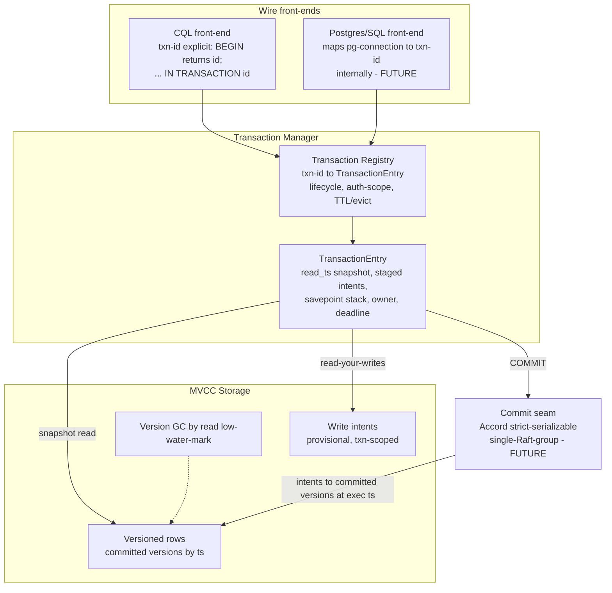
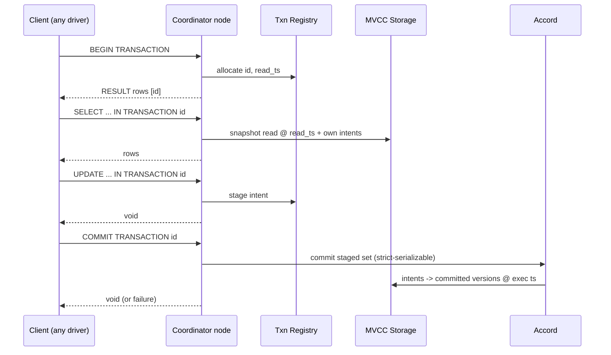

# Unified Transaction Manager — Architecture

## Current state

Transaction state is per-TCP-connection and fragile:

- `ferrosa-cql/src/session.rs`
  - `CqlTransaction` (a.k.a. the batch/staging tx) — the **real** per-connection
    transaction: `open`, `staged: Vec<BatchOp>`, `deadline`. Staged writes commit
    atomically via the storage batch primitive / Accord committer.
  - `TransactionState` (the `in_transaction` bool) — **dead code**: only referenced by
    tests, never on the production path. Remove.
- `ferrosa-cql/src/connection.rs`
  - One `Arc<Mutex<CqlTransaction>>` per connection; QUERY runs on **concurrent spawned
    tasks** (`connection.rs:544`) that lock it around `route_transactional`
    (`connection.rs:1600`). Correct only if the client is strictly serial **and** pinned.
- `ferrosa-cql/src/router.rs::route_transactional` — routes BEGIN/COMMIT/ROLLBACK and
  buffers in-transaction DML; COMMIT drives `AccordTransactionCommitter`.
- `ferrosa-cluster/src/accord/transaction_commit.rs::AccordTransactionCommitter` — the
  strict-serializable multi-key commit (Accord). **Kept.**

Reads inside a transaction are **not** MVCC-isolated today; the model is
Cassandra newest-wins (LWW by cell timestamp). Interactive read-your-writes and isolation
levels are not expressible.

## Target architecture

### Components

**Transaction Registry** (`txn-id → TransactionEntry`)
- Replaces the per-connection field. A server-side map with lifecycle: `begin`, `stage`,
  `read`, `commit`, `abort`, `expire`. Bounded (max entries); an **open-timeout reaper**
  (constraint 8, `transaction_open_timeout` default 10s) actively aborts transactions past
  their deadline (drops the temp table, evicts the entry) rather than only checking lazily
  on the next statement; fail-loud on overflow.
- **Auth-scoped**: each entry records the authenticated principal/tenant; a statement
  referencing a txn-id it does not own fails loud (prevents cross-client hijack).
- **Locality (D1)**: the txn-id encodes its owning coordinator. In a multi-node cluster a
  node that receives `… IN TRANSACTION <id>` for a non-local id **forwards** to the owner
  (NewSQL transaction-record pattern). Phase A is single-node (pinned coordinator);
  Phase B adds forwarding.
- Per-txn-id serialization: statements for one txn-id execute in submission order (a
  transaction is logically serial even if the client pipelines).

**TransactionEntry** (in-RAM metadata only — data lives on NVMe)
- `read_ts`: the MVCC snapshot timestamp (assigned at BEGIN or first read).
- `temp_table`: handle to this transaction's **per-transaction temp table on NVMe** —
  the staging store for its write intents (keyed by key/clustering). NOT in RAM; bounded
  by NVMe capacity (constraint 7), so a transaction can be as large as local disk allows.
- `savepoints`: stack of temp-table checkpoints (SQL `SAVEPOINT`).
- `owner`: auth principal/tenant; `deadline`: abort budget.

**Per-transaction temp table (NVMe staging store)**
- A lightweight, transaction-scoped table on local NVMe holding the transaction's
  intents. Reuses ferrosa's existing on-NVMe write path (memtable spill + local SSTable
  segments), but under a temp-table namespace that never publishes to S3 until commit.
- **Read-your-writes:** a `SELECT … IN TRANSACTION <id>` merges the snapshot read
  (committed versions ≤ read_ts) with this temp table's rows.
- **Commit:** the temp table is **promoted** into the permanent SSTable write path,
  stamping every row at the Accord execution timestamp (intents → committed versions),
  through the same all-or-nothing `apply_writeset` Accord already uses. The temp table is
  then dropped.
- **Abort / expire / crash-recover:** the temp table is dropped (NVMe reclaimed). Because
  temp tables are on-disk, a coordinator restart can enumerate orphan temp tables and
  abort/GC them (recoverable intent cleanup).
- **NVMe budget:** a transaction whose temp table would exceed the configured NVMe budget
  fails loud and aborts — never silently truncates or spills a live transaction's data.

**MVCC Storage** (the "full SQL" pillar)
- **Versioned rows**: retain multiple committed versions keyed by commit timestamp
  (Accord execution ts), not just newest. A snapshot read at `read_ts` returns the newest
  version `≤ read_ts`.
- **Write intents**: uncommitted writes are provisional records held in the
  transaction's **NVMe temp table** (above), visible only to their transaction
  (read-your-writes) and to conflict detection. On commit they are promoted to committed
  versions at the Accord execution ts; on abort the temp table is dropped. Because they
  live on NVMe (not RAM), a transaction's write set is bounded by disk, not memory.
- **GC (D6)**: versions below the cluster read low-water-mark (oldest live snapshot) are
  collected during compaction — analogous to `gc_grace`. The open-transaction timeout
  (constraint 8, default 10s) bounds the low-water-mark to ~one timeout window, so version
  retention stays small and predictable regardless of client behavior.
- Isolation: **Snapshot Isolation** by default (read at `read_ts`, own intents visible);
  **Serializable** via Accord ordering the commit against concurrent conflicts.

**Commit seam**
- Pluggable. `AccordTransactionCommitter` for cross-partition strict-serializability
  (today). A single-Raft-group committer is a future option for one-shard transactions.
- Commit atomically flips this transaction's intents to committed versions at the agreed
  execution timestamp; abort discards them.

### Wire mapping (CQL, wire-compatible)

| Client action | CQL text (standard QUERY frame) | Server |
|---|---|---|
| Begin | `BEGIN TRANSACTION` | allocate txn-id; return `RESULT: Rows [[txn_id]]` |
| Write | `UPDATE t SET … WHERE … IN TRANSACTION <id>` | stage intent under `<id>` |
| Read | `SELECT … FROM t WHERE … IN TRANSACTION <id>` | read snapshot@read_ts ∪ own intents |
| Savepoint | `SAVEPOINT s IN TRANSACTION <id>` (future) | push intent checkpoint |
| Commit | `COMMIT TRANSACTION <id>` | Accord commit; intents → versions |
| Rollback | `ROLLBACK TRANSACTION <id>` | discard intents; drop entry |

The Postgres/SQL front-end (future) presents standard connection-sticky `BEGIN/COMMIT`
and maps `(pg-connection → txn-id)` internally, so the core stays connection-independent.

### Data / control flow (interactive transaction)

## Migration & compatibility

- **Compat shim (D5):** keep bare `BEGIN TRANSACTION` (no id) working by internally
  allocating a txn-id bound to the connection; log a deprecation warning. Remove once the
  SQL front-end and MVCC land.
- **Elle harness:** switch to the `IN TRANSACTION <id>` flow — the connection-affinity
  desync disappears by construction (Phase A).
- **PR #283 fixes:** unaffected; this is a session/transaction-manager layer above them.

## Seams for future phases

- **Postgres/SQL front-end** — new crate/front-end mapping connection→txn-id onto the
  registry; reuses MVCC + Accord.
- **MVCC storage** — versioned rows + intents + GC in `ferrosa-storage`; the largest
  addition and the enabler of interactive SQL isolation.
- **Durable/recoverable txn state** — replicate registry entries (or make them
  reconstructable) so a coordinator failure does not lose a long interactive transaction.
