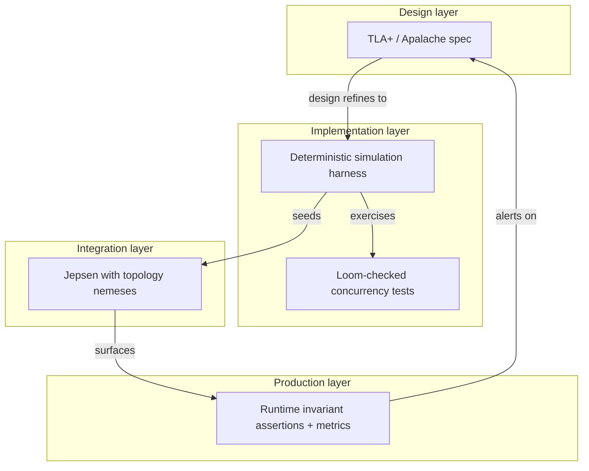
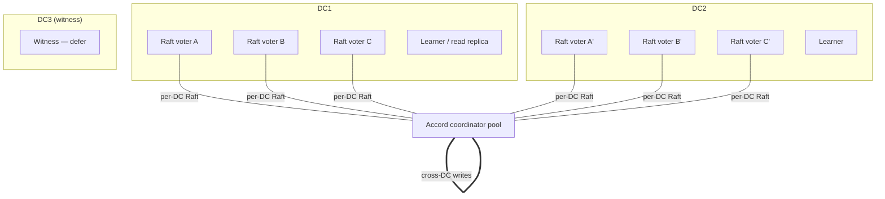

# Raft Correctness Plan

> Status: Draft
> Owner: TBD
> Created: 2026-05-09
> Supersedes: nothing — extends `cluster-formation-architecture.md`, `fmea-cluster-formation.md`, `hazards-cluster-formation.md`, `jepsen-e2e-test-plan.md`, ADR-003

## What this is

A multi-sprint correctness program for Ferrosa's Raft layer. It is the umbrella for:

- A **steady-state failure-mode matrix** — what can go wrong while a cluster is *operating*, distinct from the cluster-*formation* matrix already in `fmea-cluster-formation.md`.
- A **layered verification stack** — TLA+/Apalache, deterministic simulation, Loom, and an actually-functional Jepsen, with explicit overlap rationale.
- A **fork of openraft** under `github.com/ferrosadb/openraft` carrying PreVote, CheckQuorum, and Leadership Transfer until / unless those land upstream.
- A **multi-DC architecture** of Raft-per-DC + Accord cross-DC, replacing today's implicit assumption that one Raft group spans the world.
- A **learner replicas** capability sketched in ADR-003 but never implemented.
- A **bug-class amnesty** — every fix in the bug genome (12 months, 38 commits) maps to exactly one invariant in `specs/raft-invariants.md`. We enforce the invariants; the bug class can no longer reopen.

This plan does **not** try to land everything in one sprint. It lays out 8 sprints with concrete acceptance criteria, dependencies, and the test work needed to keep each sprint's gain durable.

## Why now

Production cluster (`ferrosa-memory`, 3 nodes) ran a 30 s availability outage today (2026-05-09 19:51 UTC) when a non-leader silently dropped a `ForwardToLeader` from a `RaftOp::UpdateNodeInfo` proposal. We patched the immediate hole (forwarder + leader-side handler in branch `fix/membership-forward-to-leader`) but four parallel investigations (code audit, 12-month git-log bug genome, Jepsen audit, and literature gap analysis) showed:

1. The **same bug class** has produced 38 fixes in 12 months — the top ten are repeat offences in five recurring root causes.
2. The Jepsen harness that was supposed to catch this has been **excluded from CI on every lane** (`.github/workflows/ci.yml:53`, `:277`, `nightly-fuzz.yml:35`); furthermore the orchestrator wires `MockCqlSession` even when a real cluster is provisioned (`ferrosa-jepsen/src/orchestrator.rs:203`), so workloads have never been driven against actual Raft.
3. openraft 0.9 lacks **PreVote** *and* **CheckQuorum** as a deliberate design choice (README: "get rid of pre-vote RPC"). The resulting election-storm and zombie-leader windows are exactly what we observed in the 19:51 logs.
4. The **two-membership-maps drift** between `state.members` and openraft `Membership.nodes` is structural — the late-joiner paths do not call `add_learner`/`change_membership` and the leave path does not remove from openraft membership. Today's outage was one symptom; an undecommissioned phantom voter that grows quorum monotonically is another, latent.

The fix list is large enough that we want to bundle it as a correctness program with explicit invariants, not piecemeal bugfixes.

## How this plan relates to existing specs

| Existing | Status under this plan |
|---|---|
| `cluster-formation-architecture.md` | Authoritative for *formation*. We do not redo it. We add a steady-state `Cluster→Cluster` failure matrix that covers what happens **after** Forming completes. |
| `cluster-formation-state-machine.md` | Authoritative for transitions T1–T9. We add T10–T1x for steady-state membership operations (add voter, demote voter to learner, promote learner to voter, swap, witness add) and T2x for multi-DC. |
| `fmea-cluster-formation.md` | Closed. Most of its critical findings are mitigated. We do not extend it — instead `raft-failure-mode-matrix.md` covers steady-state. |
| `hazards-cluster-formation.md` | Most P0/P1 hazards landed. P0-1 (DDL queueing during Forming), P1-1 (Mutex poison), P1-3 (mode CAS), P1-4 (Forming timeout), P1-5 (connection-direction roles) are still open and **roll into Sprint 1**. |
| `jepsen-e2e-test-plan.md` | The plan stays. We add: (a) a one-line orchestrator wiring fix; (b) the six structural invariants in `raft-invariants.md`; (c) topology-mutating nemeses; (d) CI integration. Sprint 2. |
| `decisions/003-raft-metadata.md` | Stands. ADR-014 (this plan, learner replicas) elaborates the "learners" sentence. |
| `archive/bugs-verified/bug-raft-stale-candidate-runaway-term-no-prevote.md` | Subsumed by ADR-012 + Sprint 3. |
| Recovery-saga bugs in `implemented/` | Closed but inform invariant 9 in `raft-invariants.md`. |
| Worktree `ferrosa-raft-fix` (uncommitted `SledLogStore::reset(path) -> ResetCounts`) | Lands in Sprint 1 alongside the runaway-term recovery story. |

Read this document, then `raft-failure-mode-matrix.md`, then `raft-invariants.md`. ADRs 012-018 cover the design forks. Sprint scope files archived under `specs/archive/project-plans/raft-correctness-sprints/sprint-NN-*` are written **after** this umbrella is reviewed.

## Current state in one paragraph

Ferrosa runs a single global Raft group for metadata (schema, topology, tokens, roles, indexes). The Raft engine is openraft 0.9.24 from a fork (`fix/separate-replication-timeout`); cargo features `serde, storage-v2, loosen-follower-log-revert`. State is sled-backed via `SledLogStore`. The state machine is `FerrosStateMachine` with non-deterministic-but-replicated `schema_version: Uuid` per command. There are two side-channels around openraft: an `election_guard` that detects election storms and disables elections for 60 s when one fires, and a `snapshot_pusher` that proactively triggers `InstallSnapshot` to followers more than 10 entries behind. `loosen-follower-log-revert` is enabled to support follower log truncation when a wiped node rejoins. There is no PreVote, no CheckQuorum, no leadership transfer. There is no Multi-DC. Late-joining nodes via `peer_events` reach `state.members` but never become openraft voters; the only path that *does* update both maps is the post-formation-timeout `cluster_rejoin` post-hook, and only because it was added in P0-21 specifically to fix that bug. Jepsen exists, is well-architected on paper, runs zero CI lanes, and is mocked at the orchestrator boundary.

## Top-level findings (the agents' headlines)

### F1 — Two-maps drift is the dominant defect class

The membership-forwarding bug we patched today is one symptom of a larger structural problem: ferrosa's `state.members` (in `RaftStateMachine`), openraft's `Membership.nodes` (the consensus voter set), `FerrosRaftNetworkFactory.node_map` (u64→Uuid for replication routing), and `PeerManager.peers` (live TCP connections) are four distinct stores updated by four different code paths, with no transactional API spanning them.

Update site coverage today:

| Update site | `state.members` | openraft `Membership` | `node_map` | `PeerManager.peers` |
|---|---|---|---|---|
| Seed `raft.initialize()` | — | yes | yes (initial only) | — |
| Bootstrap `JoinNode` per peer | yes | — | — | — |
| `peer_events` → `trigger_cluster_join` (normal late join) | yes | **no** | **no** | yes (reverse-connect) |
| `cluster_rejoin` post-hook (after 30 s formation timeout) | yes | yes (via add_learner+change_membership) | yes | yes |
| `RaftOp::LeaveNode` | removes | **does not remove** | **does not remove** | — |
| `RaftOp::UpdateNodeInfo` apply | yes | — | — | — |

A node that joins via `trigger_cluster_join` is not an openraft voter, so the leader physically cannot replicate to it. The cluster appears formed; reads at QUORUM that route to the new node fail with `Unreachable`. Decommission removes from `state.members` but never from openraft Membership; phantom voters grow quorum monotonically.

This drift is the unifying invariant violation behind 5 of the 38 fixes in the bug genome (P0-21 alone produced 4 commits; fbfc39c8 the 5th). It is **not fixed** by today's membership-forwarding patch — that patch only ensures the `UpdateNodeInfo` proposal reaches the leader. The deeper problem is that membership changes do not flow through a single transactional API.

**Sprint 1** addresses this. See ADR-013 (Membership Change Protocol).

### F2 — openraft 0.9 has neither PreVote nor CheckQuorum, by design

The openraft README explicitly lists "get rid of pre-vote RPC" as a goal; the substitute is leader-lease state. Two well-known problems:

1. **PreVote substitute insufficient under leases-expired healing.** A 30 s partition heals after every follower's lease has lapsed; a rejoining node with an inflated `(committed, term, voted_for)` triple can still poison the cluster. CockroachDB hit exactly this (cockroach#92088) and added both PreVote and CheckQuorum in #104042. The decentralizedthoughts.github.io 2020-12-12 post proves: **without both, Raft does not guarantee liveness under network omission faults**.
2. **CheckQuorum absence makes the leader zombie.** A leader without a majority cannot commit but does not voluntarily step down. Clients keep submitting writes that hang. We saw this in today's 19:51 logs: 114 AppendEntries failures + 521 reconnect events over 5 minutes.

Ferrosa today partially compensates with `election_guard` (detects storm, disables elections for 60 s) and `snapshot_pusher` (proactively pushes InstallSnapshot to wiped followers). These are bolt-ons, not equivalents. They prevent the runaway-term **symptom** from becoming an outage, but they do not prevent the runaway-term **cause**. The known-and-open `bug-raft-stale-candidate-runaway-term-no-prevote.md` (P1, 2026-04-25) documents the unrecoverable end state — a node at term T18,348 versus a leader at T8.

**Sprint 3** forks openraft and adds PreVote + CheckQuorum + Leadership Transfer. See ADR-012 and ADR-018.

### F3 — Jepsen is mocked at the orchestrator boundary and excluded from CI

Three blocking gaps:

1. `ferrosa-jepsen/src/orchestrator.rs:203` discards the `_cluster: Option<&ClusterInfo>` argument and uses `MockCqlSession`. Workloads never touch the real cluster. Every nemesis combination is theatre.
2. `ferrosa-jepsen/tests/docker/jepsen-cluster.yml` encodes a deterministic happy path: node1 has no `FERROSA_SEED` env var (so always boots first → always becomes leader); node2 and node3 both list `node1` as their only seed. The non-leader-receives-membership-write code path is unreachable in this topology.
3. `--exclude ferrosa-jepsen` appears in every CI workflow (`.github/workflows/ci.yml:53`, `:277`, `nightly-fuzz.yml:35`). The suite has never run on a PR.

Knossos and Elle checkers are wired as `Option<_>: None` in `UnifiedChecker::check_all` (`checker/mod.rs:278-282`). The `ferrosa-jepsen/jepsen/` Clojure subdirectory is vestigial.

**Sprint 2** fixes the orchestrator wiring (one line), enables CI on `Tier::Smoke`, adds the six structural invariants, adds the topology-mutating nemeses, wires Knossos.

### F4 — `loosen-follower-log-revert` is a deliberate Raft-safety relaxation

This openraft cargo feature lets a follower's log regress when re-bootstrapped from a fresh disk. It is enabled (`Cargo.toml:21`). The Raft log-monotonicity invariant exists for safety; relaxing it is acceptable **only** during deliberate disaster-recovery rebootstrap (e.g. wiping a node's raft data dir). If any code path triggers reverts during steady-state operation, that is silent data loss masked by a flag.

**Sprint 1 deliverable**: audit every code path that could trigger a follower log revert; confirm steady-state operation never does. Add a metric `RAFT_FOLLOWER_LOG_REVERTED_TOTAL` that fires on every revert. If the metric is non-zero in production telemetry over a 30-day window without an associated wipe-and-rejoin operator action, downgrade the feature flag in production builds. See ADR-018.

### F5 — Bootstrap path is one ~700-line spaghetti future

`controller/cluster.rs:792-1665` is one `spawn_tracked` future that does ClusterInvite delivery, peer-pool establishment, network-factory setup, state-machine recovery (×4 phases), Raft creation, seed initialization, leader-election polling, schema replay, bootstrap-streaming, BootstrapComplete acks, promotion, and DDL queue drain. Any error returns silently. Twenty-five+ commits to this file in 12 months — every fix lands here.

This file is the source of formation-race bugs and the single largest barrier to verifying formation correctness. **Sprint 4** decomposes it into typed phases each with a clear pre/post condition. See ADR-013.

### F6 — Multi-DC is undesigned; today's code is implicitly single-DC

There is one Raft group, one ring, one set of voters. Cassandra-style NetworkTopologyStrategy exists in the schema layer but is not reflected in the Raft layer. Operators wanting two DCs today get one Raft group spanning both, with all of Raft's wide-area-network failure modes (cross-DC vote latency, partition between DCs causes one DC to lose quorum, etc.).

The user's chosen design — Raft-per-DC + Accord cross-DC — preserves per-DC linearizability for metadata while delegating cross-DC consistency to Accord (already partially present in `ferrosa-cluster/src/accord/`). It is a separate sprint cluster (Sprints 6–8). See ADR-015.

## Verification stack — TLA+ / Apalache / Sim / Loom / Jepsen

Four layers, each catches a different bug class. The user picked all four.



| Layer | What it catches | What it cannot | Effort to set up | Where it lives |
|---|---|---|---|---|
| **TLA+ / Apalache** | Protocol-level safety + liveness invariants. Joint-consensus correctness. PreVote interactions. Multi-DC quorum properties. | Implementation bugs (off-by-one, serialization, timing). | 1 sprint to skeleton; ongoing model evolution. | `specs/tla/` (new dir). Refines existing openraft TLA+ models. |
| **Deterministic simulation (Tigerbeetle/Madsim style)** | Implementation bugs reproducible by seed. Time-travel debugging. Topology + nemesis combinations at 10K+ seeds/min. | Anything outside the simulated model (real disk, real network). Bugs that require real OS scheduling. | 1 large sprint to build; 1 small sprint per workload. | New crate `ferrosa-sim` or as a feature in `ferrosa-jepsen`. |
| **Loom** | Concurrency bugs in shared-state primitives — mutex-across-await, races in the lane actor, the RpcClient pending-request map. | Anything multi-process. | Days. Wraps existing tokio code. | `ferrosa-net` (lane actor, peer manager) and `ferrosa-cluster/src/raft/` (election guard state). |
| **Jepsen + topology nemeses** | End-to-end behaviour against real (containerized) cluster. Wire-format issues. Cross-driver bugs. | Things that never repro on this machine (state-space rare). | Reactivation sprint; ongoing. | `ferrosa-jepsen` (existing crate). |
| **Runtime invariants** | Detection in production. Catches drift the upper layers missed. | Nothing without instrumentation. | Constant. | Inline asserts + Prometheus metrics. |

The four layers overlap deliberately. **The same invariant is enforced at multiple levels** — e.g., "openraft Membership ⊆ state.members" is:

- a TLA+ invariant of the joint-consensus model
- a deterministic-sim post-step assertion
- a Jepsen post-run snapshot diff
- a production Prometheus alert (`MEMBERSHIP_DRIFT_NODES > 0`)

Catalogued in `raft-invariants.md`. Each invariant has a "tagged with" column saying where it's enforced.

See ADR-016 (verification stack), ADR-017 (deterministic simulation harness).

## Multi-DC: Raft-per-DC + Accord cross-DC (sketch)

**Topology.**



Per-DC Raft: each DC has its own Raft group for metadata + ring + token assignment within that DC. A cross-DC write lands on the local DC's Raft for durability, then Accord coordinates the cross-DC commit. Reads at LOCAL_QUORUM hit only the local DC's Raft. Reads at QUORUM fan out via Accord.

**Invariants the cross-DC handoff must hold** (from Agent D's analysis, ADR-015 expands):

1. Every Accord transaction has a global timestamp; per-DC Raft state machine applies effects in **timestamp order**, not Raft-index order. Requires a buffered apply with watermark.
2. Apply is **idempotent** by Accord txn ID. Recovery may retry.
3. Accord vote-commit must wait for **applied-durability**, not just commit-durability. Use openraft's `wait().applied_index_at_least(...)` after each vote-commit.
4. Joint-consensus DC swaps must **drain in-flight Accord transactions referencing the leaving DC's voters** before the joint config commits.

**Failure mode that matters most**: cross-DC partition during Accord pre-accept. Accord recovery handles it iff per-DC Raft groups are still reachable; if DC1's Raft loses leader at the same instant, recovery stalls until DC1-Raft re-elects. PreVote+CheckQuorum cuts that re-election window from 5–30 s adversarial to <1 s.

**Witnesses**: Spanner-style non-storing voters in DC3 to break ties cheaply. Openraft has no concept; adding requires touching `quorum/`, `progress/`, `replication/`, and the election-restriction predicate (~2000–4000 LOC). Defer past Sprint 8 unless cost analysis demands it.

## Sprint roadmap

8 sprints, 2-week cadence. Each sprint has acceptance criteria written so a different agent could verify them without conversation context. Sprints 1–4 are correctness-of-current-design; Sprints 5–8 add the new capabilities.

### Sprint 1 — Membership atomicity + bug-class amnesty

**Theme**: stop the bleeding. Make the four membership maps update atomically.

**Deliverables**:
- New module `ferrosa-cluster/src/membership/` — single transactional API `MembershipChanger::add_voter(host_id, addr)` / `remove_voter(host_id)` / `update_addr(host_id, addr)` that wraps:
  1. The openraft Membership change (`add_learner` then `change_membership(AddVoterIds)` for adds; `change_membership(RemoveVoters)` for removes).
  2. `node_map.register_node` / `node_map.unregister_node`.
  3. The corresponding `RaftOp::JoinNode` / `LeaveNode` / `UpdateNodeInfo`.
  4. PeerManager `add_peer` / `remove_peer`.
  All four are issued from one async function; on partial failure the function rolls forward via documented retry, never silently. No raw `client_write(JoinNode)` survives outside this module.
- Replace every existing call site (`controller/cluster.rs`, `controller/membership.rs`, `controller/cluster_rejoin.rs`, `ddl_path.rs::ClusterDdlForwardHandler` post-hook) with calls to the new API. Every previous `tracing::warn!("UpdateNodeInfo proposal failed"); return` becomes a typed error.
- `RaftOp::ApproveNode` is wired (today appears unused — see Agent A finding).
- `loosen-follower-log-revert` audit: every code path that could trigger a follower log revert is traced, documented, and gated behind a "this is a deliberate wipe-and-rejoin" boolean. Add `RAFT_FOLLOWER_LOG_REVERTED_TOTAL` metric.
- The uncommitted `SledLogStore::reset(path) -> ResetCounts` from worktree `ferrosa-raft-fix` lands as `ferrosa-ctl raft reset --node N` (operator escape hatch for runaway-term recovery).
- Resolve open hazards from `hazards-cluster-formation.md`: P0-1 (DDL queueing during Forming), P1-1 (Mutex poison via parking_lot migration), P1-3 (mode CAS), P1-4 (Forming timeout fallback test), P1-5 (connection-direction roles).

**Acceptance criteria**:
- Every membership-mutating call site goes through `MembershipChanger`. Verified by `grep -r "client_write.*JoinNode\|client_write.*LeaveNode\|add_learner\|change_membership"` — only matches inside `membership/` module.
- A new test `membership_atomicity_test`: spawn a 3-node openraft cluster (in-process), add a 4th node via the new API, assert that on every node both `state.members.contains(N4)` and `openraft.metrics().membership_config.voter_ids().contains(N4)` and `node_map.get(N4_id) == Some(N4_uuid)`.
- Decommission a node, assert all four maps removed it.
- `ferrosa-ctl raft reset` recovers a runaway-term node verified by integration test (existing `tests/raft_election_storm.rs` + new wipe-and-rejoin scenario).

**Dependencies**: none. Sprint 1 is the foundation.

### Sprint 2 — Jepsen reactivation + structural invariants

**Theme**: catch things at PR time, not at deploy.

**Deliverables**:
- Fix `ferrosa-jepsen/src/orchestrator.rs:203` to use the real CQL driver against `cluster.nodes[i].cql_address()` when `cluster_opt.is_some()`.
- Add the six structural invariants from `raft-invariants.md` §B as `MembershipSnapshot` post-run checks. Expose `/admin/membership-snapshot` HTTP endpoint that dumps `state.members`, `openraft.metrics().membership_config`, `network_factory.node_map`, `peer_manager.peers` as JSON. Orchestrator hits it on every node post-run and diffs.
- Add three topology nemeses: `add-node-via-follower`, `decommission-leader`, `random-startup-order`. (See `raft-failure-mode-matrix.md` for the full nemesis × workload matrix.)
- Add three topology workloads: `membership-churn`, `forward-probe`, `late-join-flood`.
- Wire Knossos via the existing `ferrosa-jepsen/jepsen/` Clojure subproject.
- Lift `--exclude ferrosa-jepsen` from `ci.yml` for `Tier::Smoke` only (≈6 min budget) on every PR with `FERROSA_TEST_CONTAINERS=1`.
- Replace the asymmetric seed config in `tests/docker/jepsen-cluster.yml` with a fully symmetric one — every node lists every other as a seed. Add a `random-startup-order` test that rerandomizes the boot sequence per run.

**Acceptance criteria**:
- A clean checkout produces a green Jepsen smoke run on `Tier::Smoke` in CI.
- Reverting Sprint 1's `MembershipChanger::add_voter` to the pre-Sprint-1 silent-drop variant **causes the smoke run to fail** (this is the regression-test-for-the-test).
- Every recent in-process bug (the five from Agent C §5) has a corresponding workload + nemesis + invariant such that reverting its fix produces a Jepsen failure.

**Dependencies**: Sprint 1 (so the invariants have a meaningful API to verify against).

### Sprint 3 — Fork openraft, add PreVote + CheckQuorum + Leadership Transfer

**Theme**: cure the protocol-level liveness gap.

**Deliverables**:
- New repo `github.com/ferrosadb/openraft`, branched from upstream `0.9.24` with our existing `fix/separate-replication-timeout` patches squashed in. Cargo.toml in ferrosa-cluster repointed.
- **PreVote** (Ongaro §9.6): new `PreVoteRequest` RPC; new `is_prevote: bool` flag in vote handler; no term advance unless majority pre-grants. ~600–1500 LOC + tests in the fork.
- **CheckQuorum** (Ongaro §6.4): leader voluntarily steps down to follower when its lease has lapsed without a quorum of `AppendEntries` acks within an election timeout. ~200–500 LOC.
- **Leadership Transfer** (Ongaro §3.10): `TimeoutNow` RPC; `raft.trigger().transfer_to(node_id).await` API; drains pending writes, ensures target is up-to-date, sends TimeoutNow. ~400–800 LOC.
- Submit each as a separate PR upstream (the openraft author has rejected PreVote in principle but may accept CheckQuorum and Leadership Transfer — best-effort upstreaming).
- Wire all three into ferrosa-cluster: PreVote enabled by default; CheckQuorum enabled by default with lease ratio configurable via `FERROSA_RAFT_CHECK_QUORUM_RATIO` (default `1.0` × election_timeout); `transfer_to` exposed via `ferrosa-ctl raft transfer-leader --to N`.
- Retire `election_guard` and `snapshot_pusher` as primary defenses *only after* PreVote + CheckQuorum land; keep them as belt-and-braces with longer timeouts. (Specifically: the election_guard's "term-bump-without-log-progress" detector is still useful as a paranoia check that PreVote actually fired.)

**Acceptance criteria**:
- Repro of `bug-raft-stale-candidate-runaway-term-no-prevote.md` against the new build no longer produces a runaway term. Specifically: a 60 s partition of node3 followed by reconnect produces zero term advances on node3 after pre-vote rejection.
- TLA+ model of PreVote+CheckQuorum (Sprint 5) refines openraft's published model (Sprint 5 deliverable proves this).
- `transfer_to` integration test: 3-node cluster, transfer leadership from node1 to node2, assert <500 ms downtime and zero failed writes.

**Dependencies**: none from us; we just fork. Sprint 1 makes integration easier.

### Sprint 4 — Bootstrap decomposition + snapshot transport + bolt-on retirement

**Theme**: make the formation path verifiable; replace bolt-ons with protocol-level fixes.

**Deliverables**:
- Decompose `controller/cluster.rs:792-1665` into typed phases:
  ```rust
  Bootstrap::DeliverInvites -> Bootstrap::EstablishPools -> Bootstrap::CreateRaft -> Bootstrap::WaitLeader -> Bootstrap::ReplaySchema -> Bootstrap::BootstrapStream -> Bootstrap::Promote -> Bootstrap::DrainQueue
  ```
  Each phase has explicit pre/post conditions and a `BootstrapError::Phase{name, source}` error type. No silent `return`.
- For each `Cluster→Cluster` transition in `raft-failure-mode-matrix.md` §3, write a deterministic-simulation test (Sprint 5 will provide the harness; Sprint 4 writes the tests against the existing in-memory test cluster).
- Decommission flow now calls `MembershipChanger::remove_voter` (Sprint 1 dependency). `initiate_decommission` first transfers leadership away (Sprint 3 dependency) then proposes LeaveNode then removes from openraft membership.
- **Custom snapshot transport via `generic-snapshot-data`** (per ADR-018 §"Snapshot transport"): enable the cargo feature, implement `ferrosa-cluster/src/raft/snapshot_transport.rs` on a dedicated `Lane::Snapshot`, decoupling InstallSnapshot streaming from the heartbeat lane.
- **Retire `election_guard` and `snapshot_pusher`** (per ADR-012 §"Interaction with the bolt-ons"), gated on a 2-week clean Jepsen window against the Sprint 3 build (zero `ELECTION_STORM_TERM_JUMPS_TOTAL` increments under any nemesis combination, runaway-term repro produces zero term advances). If the gate fails, retirement is bumped to a later sprint and a PreVote bug is filed instead.

**Acceptance criteria**:
- A formation-race injection test produces a clear typed error per phase, not a silent hang.
- Every transition in the failure-mode matrix has at least one passing test.
- 100 MB snapshot install during 1000 writes/sec sustained AppendEntries produces no `RAFT_LANE_DELAY_P99` excursions on `Lane::Raft` (validates the snapshot-transport split).
- `election_guard` and `snapshot_pusher` removed from the codebase OR a documented decision to keep them is recorded with the Jepsen evidence that motivated keeping them.

**Dependencies**: Sprint 1, Sprint 3 (Leadership Transfer for decom; PreVote+CheckQuorum for bolt-on retirement).

### Sprint 5 — Deterministic simulation harness + TLA+ skeleton

**Theme**: catch design bugs at design time and impl bugs at seed time.

**Deliverables**:
- New crate `ferrosa-sim` (or `ferrosa-jepsen` feature-gated). Discrete-event simulator over an `Async` runtime trait that ferrosa code can be compiled against. Single-threaded, seeded RNG, time travel, full nemesis matrix. Targets 10K seeds/min baseline.
- Port the Sprint 4 transition tests to the simulator. Run `--seeds 100000 --workers 16` in nightly CI on a separate workflow.
- TLA+/Apalache spec at `specs/tla/raft.tla` covering: leader election with PreVote, AppendEntries with quorum commit, joint-consensus membership change, snapshot install. Apalache model-checks it with bounded N and term values.
- A "refinement check" — the simulator's transitions are tagged with TLA+ action names; a property-based test asserts every simulator-observed transition is permitted by the TLA+ spec.

**Acceptance criteria**:
- Apalache reports no safety violations at N=5, max_term=10, max_log=20.
- The simulator produces reproducible failures by seed; a recorded failure can be replayed and the divergence step pinpointed.
- All Sprint 4 tests pass under simulation as well as against in-memory.

**Dependencies**: Sprint 1, Sprint 3 (PreVote in the spec).

### Sprint 6 — Multi-DC: Raft-per-DC scaffolding

**Theme**: wire the topology that lets DC1 and DC2 have independent Raft groups.

**Deliverables**:
- Schema-level concept of "DC group" already partially present (NetworkTopologyStrategy). Lift it to the cluster layer: `RaftGroupId = Uuid` per DC; `ModeController` carries a map `RaftGroupId -> Arc<FerrosRaft>` rather than one global instance.
- Cluster formation extends to detect DC membership and route join requests to the appropriate per-DC Raft.
- Read/write paths (CL=LOCAL_QUORUM, CL=QUORUM, CL=EACH_QUORUM) route via the relevant Raft group(s).
- Configuration: `FERROSA_DC` env var; per-DC `raft_data_dir`; per-DC seed lists.
- No Accord cross-DC yet; cross-DC writes return `NotImplemented` in this sprint.

**Acceptance criteria**:
- 3+3 dual-DC topology (T3 from `jepsen-e2e-test-plan.md`) brings up two healthy Raft groups, one per DC.
- Local writes at LOCAL_QUORUM succeed within DC; cross-DC reads at LOCAL_SERIAL succeed; cross-DC writes fail with the explicit not-implemented error.
- `dc-partition` nemesis from Jepsen produces clean per-DC degraded mode, not a global outage.

**Dependencies**: Sprint 1, Sprint 3.

### Sprint 7 — Multi-DC: Accord cross-DC adapter + reorder-by-timestamp apply

**Theme**: cross-DC consistency.

**Deliverables**:
- Reorder-by-timestamp apply adapter on `FerrosStateMachine`: buffers Accord-marked entries by Accord timestamp, applies in timestamp order with a watermark. Watermark advancement uses HLC + bounded clock skew; tunable via `FERROSA_HLC_MAX_SKEW_MS`.
- Idempotent apply by Accord txn ID — `state.applied_accord_txns: BTreeMap<TxnId, AppliedRecord>` to dedupe.
- Apply-durability barrier: cross-DC Accord vote-commit waits for `wait().applied_index_at_least(...)` post-Raft-commit.
- Joint-consensus DC swap procedure: drain in-flight Accord txns referencing the leaving DC's voters before the joint config commits.

**Acceptance criteria**:
- 3+3 dual-DC topology runs the bank workload at QUORUM consistency level for 1h with no balance-conservation violations under `dc-partition` + `dc-slow` nemeses.
- The TLA+ spec from Sprint 5 extends to multi-DC; Apalache reports no safety violations at N=2 DCs × 3 voters each, max_term=5, max_log=15.

**Dependencies**: Sprint 5, Sprint 6, existing Accord scaffolding.

### Sprint 8 — Learner replicas + endurance run

**Theme**: production-readiness.

**Deliverables**:
- Learner role implemented per ADR-014: openraft `add_learner` already supported; we add the application-level concept of "this node serves reads but does not vote." Learners participate in `peer_manager`, receive AppendEntries (no quorum participation), serve LOCAL_ONE reads, are candidates for promotion to voter via `MembershipChanger::promote_learner_to_voter`.
- `ferrosa-ctl cluster add-learner <addr>` and `cluster promote-to-voter <node>` operator commands.
- Endurance run from `jepsen-e2e-test-plan.md` `Tier::Endurance`: 24 h on Fly.io tri-DC. Knossos every 10 min on rolling history window. Acceptance: zero linearizability violations, zero membership drift violations.
- Witness role evaluation: write a sharp design doc for or against (defer to Sprint 9+ either way).

**Acceptance criteria**:
- 24 h Fly.io tri-DC endurance run completes with zero invariant violations.
- A learner added during continuous load reaches voter status within 30 s of `promote-to-voter`.

**Dependencies**: Sprints 1–7.

## Resolved decisions (2026-05-09 review)

All eight previously-open questions resolved. The relevant ADR carries the detail.

| # | Question | Decision | ADR |
|---|---|---|---|
| 1 | CheckQuorum ratio | **0.75** (not 1.0). Tuned for ferrosa's long election timeouts (3000–6000 ms); 0.75× ≈ 2.25–4.5 s zombie window before voluntary step-down. | 012 |
| 2 | PreVote × `single-term-leader` interaction | **Don't enable `single-term-leader`.** ferrosa stays on openraft default (multi-term-leader). | 012, 018 |
| 3 | Snapshot transport channel | **Implement `generic-snapshot-data` in Sprint 4.** Custom transport on dedicated `Lane::Snapshot`, decoupling InstallSnapshot from heartbeats. | 018 |
| 4 | Witness vs full replica in DC3 | **Defer witness role past Sprint 8.** Run 3 voters + 1 learner per DC until cost analysis justifies the openraft surgery. | 015 |
| 5 | Reorder-buffer watermark | **HLC max-skew = 200 ms** (`FERROSA_HLC_MAX_SKEW_MS`). Matches Spanner-class clock-sync conservatism without TrueTime. | 015 |
| 6 | `loosen-follower-log-revert` policy | **Audit in Sprint 1; downgrade to `cfg(debug_assertions)` if 30 days clean.** Runtime metric `RAFT_FOLLOWER_LOG_REVERTED_TOTAL` correlates triggers to operator actions. | 018 |
| 7 | Joint-consensus vs single-server | **Joint consensus only.** ferrosa never falls back to step-by-step changes. Required for DC swap atomicity (ADR-015). | 013 |
| 8 | Retire `election_guard` + `snapshot_pusher` after Sprint 3? | **Yes — Sprint 4, gated on 2-week clean Jepsen window** (zero `ELECTION_STORM_TERM_JUMPS_TOTAL` under any nemesis; runaway-term repro produces zero term advances). | 012 |

### Telemetry-driven knobs to revisit post-deploy

These are committed-but-tunable. Production observation over the first 30 days informs adjustment:

- **CheckQuorum ratio (0.75)**: raise to 1.0 if unnecessary step-downs; lower to 0.5 if zombie-leader windows still cause client-visible latency.
- **HLC max-skew (200 ms)**: tighten if cross-DC reorder buffer rarely uses it; loosen if buffer stalls under realistic clock skew.
- **`generic-snapshot-data` chunk size (8 MiB)**: revisit if snapshot install dominates network bandwidth.

## Glossary of cross-references

- **Failure-mode matrix**: `specs/raft-failure-mode-matrix.md` — every steady-state Cluster→Cluster failure with sequence diagrams.
- **Invariant catalog**: `specs/raft-invariants.md` — every invariant we enforce, tagged by where it is enforced.
- **ADR-012**: PreVote, CheckQuorum, Leadership Transfer — the openraft-fork patches.
- **ADR-013**: Membership Change Protocol — the `MembershipChanger` API, atomicity model, joint-consensus semantics.
- **ADR-014**: Learner Replicas.
- **ADR-015**: Multi-DC: Raft-per-DC + Accord.
- **ADR-016**: Verification Stack (TLA+ / sim / Loom / Jepsen layering).
- **ADR-017**: Deterministic Simulation Harness.
- **ADR-018**: Fork openraft into `ferrosadb/openraft`; `loosen-follower-log-revert` audit.
