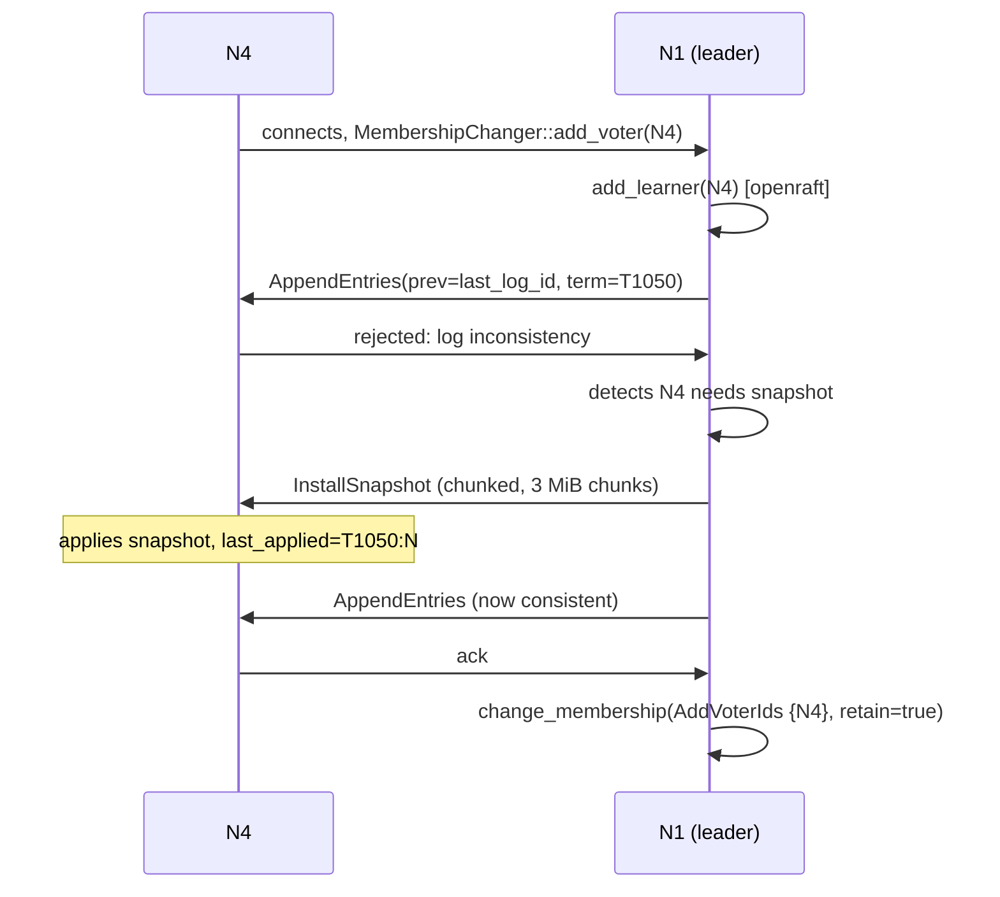
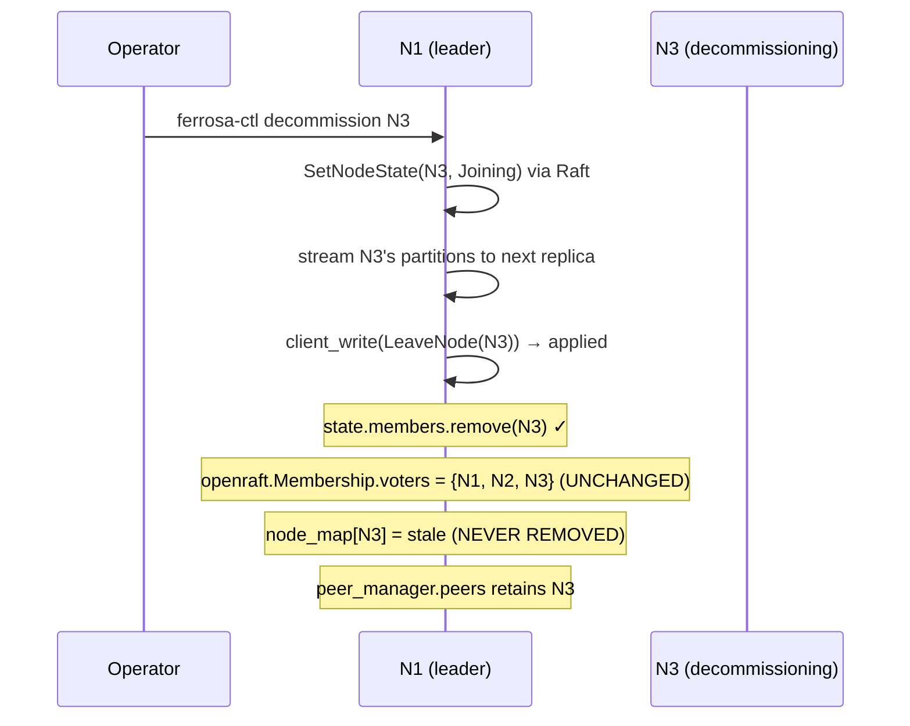
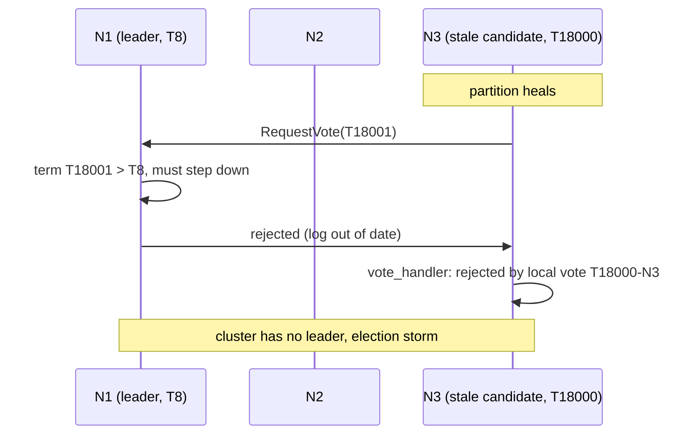

# Raft Failure-Mode Matrix (Steady State)

> Status: Draft
> Created: 2026-05-09
> Companion to: `raft-correctness-plan.md`, `raft-invariants.md`
> Distinct from: `fmea-cluster-formation.md` (covers formation T1–T9, not steady state)

## What this is

Every failure that can occur to a `Cluster→Cluster`-mode Ferrosa cluster, with sequence diagrams that show:

- the trigger event,
- the in-flight Raft state when the event happens,
- the symptom an observer (operator, client, internal probe) sees,
- the invariant violated (cross-reference to `raft-invariants.md`),
- the test that would catch it, and where (TLA+ / sim / Jepsen / runtime).

This is the **steady-state matrix**. The formation matrix (T1–T9, plus T2/T3 races) lives in `cluster-formation-state-machine.md` and `fmea-cluster-formation.md` — those documents close out the `Standalone → Pair → Forming → Cluster` path. This document picks up after Cluster mode is reached and the leader is elected.

## Convention

Each scenario has the form:

> ### S-NN: short name
>
> **Trigger.** What happens, when.
> **Pre-state.** Cluster topology + Raft state when triggered.
> **Sequence.** Mermaid diagram or step list.
> **Outcome.** What an external observer sees.
> **Invariant violated.** Reference to `raft-invariants.md`.
> **Detection.** Layer (runtime / jepsen / sim / tla+).
> **Mitigation.** Sprint or ADR that delivers it.

Scenarios are grouped:

- **§1 Adding members** (S-01..S-05)
- **§2 Removing members** (S-06..S-10)
- **§3 Node death and recovery** (S-11..S-18)
- **§4 Network failures** (S-19..S-26)
- **§5 Leader handover and election** (S-27..S-32)
- **§6 Snapshots and log compaction** (S-33..S-37)
- **§7 DDL during failure** (S-38..S-42)
- **§8 Data mutation during partition** (S-43..S-47)
- **§9 Multi-DC** (S-48..S-54)
- **§10 Composed nemeses** (S-55..S-60)

---

## §1 Adding members

### S-01: Late-join via `peer_events` succeeds in `state.members` but never becomes openraft voter

**Trigger.** A 4th node connects to a 3-node cluster after Forming has completed. `on_peer_connected` fires on the receiving node.
**Pre-state.** 3 voters {N1, N2, N3} in openraft Membership. Leader = N1. `state.members = {N1, N2, N3}`.
**Sequence.**

```mermaid
sequenceDiagram
    participant N4 as N4 (joiner)
    participant N1 as N1 (leader)
    participant N2 as N2
    participant N3 as N3
    Note over N1,N3: Cluster healthy at T8. Membership={N1,N2,N3}.
    N4->>N2: TCP connect (seed=N2)
    N2->>N2: on_peer_connected → trigger_cluster_join
    Note over N2: existing_member=None, propose JoinNode(N4)
    N2->>N1: client_write(JoinNode(N4)) [non-leader] → ForwardToLeader hint
    Note over N2: With Sprint 1 fix: forwarder runs.<br/>Leader applies JoinNode → state.members += N4.
    Note over N1: BUT openraft Membership unchanged.<br/>BUT node_map unchanged.
    N1->>N4: AppendEntries via node_map.new_client(N4)
    Note over N1: new_client returns Uuid::nil()
    N1->>N1: Unreachable; backoff
```

**Outcome.** N4 is in `system.peers` and the ring; CQL clients route reads to N4; reads fail with "host unreachable" because N1 cannot replicate to N4 (no openraft voter, no node_map entry).
**Invariant violated.** I-06 (four-maps agree); I-08 (openraft Membership ⊆ state.members); I-09 (state.members ⊆ openraft Membership ∪ pending learners).
**Detection.** `runtime` — `MEMBERSHIP_DRIFT_NODES > 0`. `jepsen` — `add-node-via-follower` workload + `membership-snapshot` post-run diff.
**Mitigation.** Sprint 1 / ADR-013. `MembershipChanger::add_voter` is the single path; `peer_events` calls into it instead of raw `client_write(JoinNode)`.

### S-02: Concurrent late-joins of two new nodes race

**Trigger.** N4 and N5 both connect simultaneously, each to a different existing node.
**Pre-state.** 3 voters; both N4 and N5 dial in within the same election interval.
**Sequence.** Two parallel `MembershipChanger::add_voter` calls hit the leader. openraft serializes them (it does not allow concurrent membership changes). Second call returns `ChangeMembershipError::InProgress`.
**Outcome.** Without retry, second join is silently dropped.
**Invariant violated.** I-15 (apply propagates errors); I-06 indirectly (the dropped node lingers in `state.members` if `RaftOp::JoinNode` was already committed).
**Detection.** `sim` — concurrent-add seed; `jepsen` — `late-join-flood` workload.
**Mitigation.** Sprint 1. `MembershipChanger::add_voter` retries on `InProgress` with exponential backoff; the joint-consensus protocol completes both in series.

### S-03: Joiner connects only to a single non-leader; non-leader is partitioned from leader

**Trigger.** N4 dials N3. Network partition isolates N3 from {N1, N2} but not from N4.
**Pre-state.** 3 voters, leader N1, partition forming.
**Sequence.** N3 receives N4's connect, calls `MembershipChanger::add_voter`. The internal `client_write(JoinNode)` returns `ForwardToLeader { leader_id: Some(N1) }`. The forwarder tries `peer_manager.send(N1.uuid, ClusterRaftForward, Lane::Data)` — fails with `Unreachable` (partition).
**Outcome.** `MembershipChanger::add_voter` returns `Err(ClusterError::Net(...))`. `peer_events` retains N4 in `pending_joins`; on next reconnect (`partition heal`), the join retries.
**Invariant violated.** None if `MembershipChanger` retry is correct.
**Detection.** `jepsen` — `partition-one + add-node` composed nemesis.
**Mitigation.** Sprint 1 + Sprint 2 (Jepsen test).

### S-04: Joiner has stale snapshot; AppendEntries lag exceeds replication lag timeout

**Trigger.** N4 was a former member, was wiped (`ferrosa-ctl raft reset`), rejoins at term T1000 vs leader at T1050.
**Pre-state.** Cluster at term T1050. N4 has empty raft data dir.
**Sequence.**



**Outcome.** Healthy promotion. RTO ≈ snapshot install time + one election interval.
**Invariant violated.** None if successful. I-22 (purge does not block heartbeats) at risk during snapshot install if the snapshot is large.
**Detection.** `jepsen` — `wipe-and-rejoin` workload from `tests/raft_election_storm.rs`. `runtime` — `INSTALLSNAPSHOT_PUSHES_TOTAL` per `snapshot_pusher`.
**Mitigation.** Already implemented. Sprint 1 `loosen-follower-log-revert` audit confirms revert fires only here.
**Sprint 4 retirement note (W4.12).** Sprint 1's `MembershipChanger` ensures every voter is registered atomically (the original P0-20 motivation: "voter not in replication map" is gone). Sprint 3's PreVote+CheckQuorum, combined with openraft's normal snapshot-on-log-inconsistency response, handles this scenario without the proactive `snapshot_pusher` sweep. The `snapshot_pusher` module is therefore scheduled for deletion under the bolt-on retirement gate (`controller/bootstrap/retirement_gate.rs`). Until the 2-week clean Jepsen window manifest lands, the pusher remains in place. Post-retirement detection rolls into openraft's intrinsic `RaftMetrics::snapshot` counters; the dedicated `INSTALLSNAPSHOT_PUSHES_TOTAL` metric is retired alongside.

### S-05: Approval check disagrees between leader and follower (`auto_join=false`)

**Trigger.** Operator approves N4 on the leader (controller-local cache update). N4 connects via N3.
**Pre-state.** `auto_join=false`. Leader has N4 in `controller.approved_nodes` but state machine `state.approved_nodes` does not (no `RaftOp::ApproveNode` ever proposed).
**Sequence.** N3 receives N4, calls `MembershipChanger::add_voter`. Forwards to leader. Leader's `client_write(JoinNode(N4))` apply: state machine's `apply_command` for JoinNode checks `!self.state.config.auto_join && !self.state.approved_nodes.contains(&host_id)` → rejects, logs warn.
**Outcome.** N4 silently never admitted. Operator sees nothing.
**Invariant violated.** I-11 (approval is replicated, not just controller-local); I-15 (apply propagates errors — the rejection is silent today).
**Detection.** `sim` — `approve-node-then-add` test; `jepsen` — `add-with-approval` workload.
**Mitigation.** Sprint 1. `approve_node` proposes `RaftOp::ApproveNode` via `MembershipChanger`. Apply rejection bubbles to the caller as `RaftResponse::Error`.

---

## §2 Removing members

### S-06: Decommission of follower leaves phantom voter in openraft Membership

**Trigger.** Operator runs `ferrosa-ctl decommission <node>` on a follower N3.
**Pre-state.** 3 voters, leader N1.
**Sequence (today, before Sprint 1).**



**Outcome.** Quorum sizing still treats N3 as a voter; if N1 fails, election needs `{N2, N3}` but N3 is gone. Cluster wedges with no possible quorum.
**Invariant violated.** I-10 (decommission removes from all four maps); I-13 (quorum sizing is committed not connected — if `committed_cluster_size` is rebuilt from openraft Membership it stays at 3).
**Detection.** `runtime` — `MEMBERSHIP_DRIFT_NODES > 0` after decommission. `jepsen` — `decommission` workload + post-run snapshot.
**Mitigation.** Sprint 1. `MembershipChanger::remove_voter` calls `change_membership(RemoveVoters)` first, then `RaftOp::LeaveNode`.

### S-07: Decommission of leader without leadership transfer

**Trigger.** Operator runs `ferrosa-ctl decommission <node>` on the current leader N1.
**Pre-state.** 3 voters, leader N1.
**Sequence (today).** `initiate_decommission` notes "openraft 0.9 doesn't have transfer_leader" and proceeds. Proposes `LeaveNode(N1)`. The leader removes itself from `state.members` while still being the openraft leader. Subsequent client writes hang or fail with `ForwardToLeader` to the dead leader.
**Outcome.** ~election timeout of unavailability before another node detects the situation and elects.
**Invariant violated.** No clean invariant violation, but RTO is bad.
**Detection.** `jepsen` — `decommission-leader` nemesis.
**Mitigation.** Sprint 3. `MembershipChanger::remove_voter` for leader case: `transfer_to(some_other_voter)` first, then proceed as S-06.

### S-08: Decommission concurrent with another membership change

**Trigger.** N4 join initiated; before it completes, operator decommissions N3.
**Pre-state.** Mid-`change_membership` joint config.
**Sequence.** openraft rejects the second `change_membership` with `ChangeMembershipError::InProgress`.
**Outcome.** Without retry, decom is silently dropped.
**Invariant violated.** I-15.
**Detection.** `sim` — concurrent-membership-change seed.
**Mitigation.** Sprint 1 `MembershipChanger` retries `InProgress`.

### S-09: Decommission of partitioned node

**Trigger.** N3 is partitioned and unreachable; operator decommissions N3.
**Pre-state.** 3 voters; N3 unreachable.
**Sequence.** Streaming step (`initiate_decommission`) cannot reach N3 to drain its partitions. `LeaveNode` proposal succeeds (N3 doesn't need to ack — quorum is N1+N2). N3 returns later, sees its old `state.members` and old openraft Membership, attempts to behave as a voter.
**Outcome.** N3 splits brain (it thinks it's a voter; cluster has removed it). Reads on N3 return stale data; writes fail.
**Invariant violated.** I-10. After Sprint 1, also: N3's openraft Membership is locally stale (it never received the joint-config commit); on reconnect it gets replaced via InstallSnapshot.
**Detection.** `jepsen` — `partition-decom-rejoin` composed nemesis.
**Mitigation.** Sprint 1 + Sprint 4. The `snapshot_pusher` already handles wiped/stale followers; same path applies here.

### S-10: Re-add of previously decommissioned node

**Trigger.** Operator decommissions N3, then `add-node` for the same host_id.
**Sequence.** `MembershipChanger::add_voter(N3.host_id)` — but N3.host_id has the same UUID and thus the same `node_id = uuid_to_node_id(host_id)`. openraft sees an `add_learner` for an already-known-but-removed id.
**Outcome (today).** Behavior depends on openraft internals; possibly silent NoOp or possibly success.
**Invariant violated.** Potential I-06 if the apply path inserts into `state.members` but `add_learner` was a NoOp.
**Detection.** `sim` — `decom-then-readd` seed.
**Mitigation.** Sprint 1. `MembershipChanger::add_voter` queries openraft Membership before issuing `add_learner`; treats existing-but-removed as a fresh add.

---

## §3 Node death and recovery

### S-11: Single follower OOM kill mid-AppendEntries

**Trigger.** SIGKILL on N3. N1 was streaming AppendEntries (300 entries) to N3.
**Pre-state.** Healthy 3-node cluster, mid-replication.
**Sequence.** N3 dies. N1 retries AppendEntries; gets `Unreachable` from peer_manager. After replication_lag_timeout (3 s), N1 marks N3 as lagging in metrics. Cluster continues with quorum {N1, N2}. N3 restarts; recovery runs (`recover_from_purge_point`, `find_last_membership`); N3 resumes as Learner; AppendEntries catches it up; it becomes Voter again on next leader heartbeat.
**Outcome.** Healthy.
**Invariant violated.** None.
**Detection.** `jepsen` — `kill-minority` nemesis.
**Mitigation.** Already correct. Sprint 1 audit verifies `loosen-follower-log-revert` is not triggered here (it shouldn't be — N3's log was a prefix of leader's).

### S-12: OOM kill between log purge and snapshot write

**Trigger.** SIGKILL exactly between `SledLogStore::purge(idx)` and `state_machine.build_snapshot()`.
**Pre-state.** N3 has purged log up to index 64; in-memory `last_applied=63`; about to write snapshot.
**Sequence (today, with bug fix).** `recover_from_purge_point()` advances `last_applied` to 64.
**Outcome.** Healthy. `last_applied >= last_purged_log_id`.
**Invariant violated.** None — I-17 holds.
**Detection.** `sim` — kill-between-purge-and-snapshot seed.
**Mitigation.** Already implemented (`bug-raft-startup-fails-after-oom-purged-log`). Sprint 5 sim test.

### S-13: Cold start after total cluster crash with healthy snapshot

**Trigger.** All 3 nodes SIGKILL'd. All restart.
**Pre-state.** 3 voters, healthy snapshots, healthy logs.
**Sequence.** Each node runs recovery: snapshot → topology → membership. `find_last_membership` reads the last `EntryPayload::Membership` from log (or, if absent, synthesizes from `state.members`). If at least one node has the actual membership, the seed-init logic at `cluster.rs:1055-1068` skips re-init and Raft re-elects.
**Outcome.** Healthy. RTO ≈ election timeout.
**Invariant violated.** None.
**Detection.** `jepsen` — `kill-majority + restart` nemesis.
**Mitigation.** Already implemented. Sprint 1 fixes I-19 (don't synthesize a voter-only Membership if the actual last commit was joint).

### S-14: Cold start where state.members is non-empty but log has no Membership entry

**Trigger.** A node restarts after surviving snapshot installation but having never received an `EntryPayload::Membership`.
**Pre-state.** State machine has 3 members; openraft log has no Membership entry.
**Sequence.** `find_last_membership` returns `None`. `recover_membership_from_topology_state` synthesizes `Membership::new(vec![voters], None)` from `state.members`.
**Outcome.** Today: works, because the synthesized config matches the real one. **Latent risk**: if the actual last committed Membership was a joint config (during a `change_membership`), recovery silently downgrades to voter-only.
**Invariant violated.** I-19.
**Detection.** `sim` — kill-during-change-membership seed; `tla+` — joint-config-recovery state explored.
**Mitigation.** Sprint 1. Synthesis fails loudly if it cannot match a committed joint config.

### S-15: Runaway-term node returns to cluster (the open P1 bug)

**Trigger.** N3 partitioned for 60 s; advances term to T18,000 while cluster stays at T8. Partition heals.
**Pre-state.** {N1, N2} healthy at T8; N3 at T18,000 with stale log.
**Sequence (today, without PreVote).**



**Outcome.** Cluster degraded until something extra (manual `ferrosa-ctl raft reset`) intervenes.
**Invariant violated.** I-31 (election storm detector fires) catches the symptom but not the cause; PreVote is the cause-fix.
**Detection.** `jepsen` — `flap-leader` + `partition-one + reconnect` nemesis. `runtime` — `ELECTION_STORM_TERM_JUMPS_TOTAL`.
**Mitigation.** Sprint 3 (PreVote+CheckQuorum) + Sprint 1 (`ferrosa-ctl raft reset` operator escape).

### S-16: Leader OOM mid-commit

**Trigger.** SIGKILL on leader N1 after `client_write` returned Ok (commit) but before all followers applied.
**Pre-state.** N1 leader, entry committed at index 1000, N2 applied to 1000, N3 applied to 999.
**Sequence.** N1 dies. {N2, N3} elect — N2 wins (its log is more up-to-date by Leader Completeness). N2 catches N3 to index 1000. Cluster healthy.
**Outcome.** Healthy. RTO ≈ election timeout. The committed write is preserved (I-04).
**Invariant violated.** None.
**Detection.** `jepsen` — `kill-leader` + register linearizability check.

### S-17: Disk full mid-AppendEntries on follower

**Trigger.** N3's sled disk fills. `SledLogStore::append` returns Err.
**Pre-state.** N3 follower, healthy.
**Sequence.** AppendEntries fails on N3. N1 sees no ack from N3 within replication_lag_timeout. N3 stays at older log index. **Today**: `SledLogStore::append`'s `callback.log_io_completed(Ok(()))` path: on error it returns to the caller without invoking callback at all → openraft hangs. (Agent A finding §3.)
**Outcome.** Worse than necessary — openraft hangs on N3's stream rather than treating it as Unreachable.
**Invariant violated.** No formal invariant; but the contract with openraft requires the callback be invoked.
**Detection.** `jepsen` — `disk-fail` nemesis.
**Mitigation.** Sprint 1. Fix `append` to invoke `callback.log_io_completed(Err(...))` on failure.

### S-18: Process kill of lone seed during raft.initialize

**Trigger.** SIGKILL on seed during the spawned bootstrap task at `cluster.rs:1061`.
**Pre-state.** Seed building Raft for the first time.
**Sequence.** Bootstrap task disappears. `raft_instance` ArcSwap stays at None. Other peers wait for ClusterInvite or for bootstrap; never get past Forming. Restart: seed runs `should_initialize_seed_membership=true` (no recovered state), re-issues `initialize`, completes.
**Outcome.** Recoverable, but the formation race window doubles.
**Invariant violated.** I-32.
**Detection.** `jepsen` — `kill-seed-during-bootstrap` nemesis.
**Mitigation.** Sprint 4 bootstrap-task decomposition; each phase is restartable.

---

## §4 Network failures

### S-19: Symmetric partition isolating one voter from the other two

**Trigger.** iptables drop between {N3} and {N1, N2}.
**Pre-state.** 3 voters, leader N1.
**Sequence.** N3 misses heartbeats; advances term, starts election; rejected. N1 still has quorum {N1, N2}, continues. On heal: N3 receives AppendEntries with higher term, **but** today's openraft has no PreVote, so N3's incremented term forces N1 to step down (S-15 chain). With CheckQuorum (Sprint 3) N3 voluntarily steps down on the higher-term peer rather than disrupting.
**Outcome (today).** Recoverable but disruptive. **Outcome (post Sprint 3).** Clean re-election in <1× election timeout.
**Invariant violated.** I-04 (Leader Completeness — depends on PreVote not undermining); I-31.
**Detection.** `jepsen` — `partition-one`.
**Mitigation.** Sprint 3.

### S-20: Asymmetric partition (leader can hear followers but not vice versa)

**Trigger.** iptables drop on outgoing from {N2, N3} to {N1}, but not the reverse.
**Pre-state.** Leader N1.
**Sequence.** N1's AppendEntries succeed (followers receive). Followers' acks never reach N1. N1's lease expires; `read_log_id` calls fail; client writes hang. N2 and N3 don't elect because they're still receiving heartbeats.
**Outcome (today).** Zombie leader. Clients see hangs. **No CheckQuorum** means N1 never steps down voluntarily.
**Invariant violated.** None violated, but availability is lost. CheckQuorum (Sprint 3) makes N1 step down → re-election succeeds with N2 or N3.
**Detection.** `jepsen` — `partition-asymmetric` nemesis.
**Mitigation.** Sprint 3 (CheckQuorum).

### S-21: Flapping partition (heal/break every 5–30 s)

**Trigger.** iptables drop/restore cycle on N3.
**Pre-state.** Healthy.
**Sequence (today).** Each break/heal triggers vote attempts; without PreVote, term inflation accelerates; election guard fires after 30 s window.
**Sequence (post Sprint 3).** PreVote suppresses term advances during break; on heal, N3 is caught up via AppendEntries.
**Invariant violated.** I-31 in pathological cases (see open P1 bug).
**Detection.** `jepsen` — `dc-flap` nemesis (also S-49).
**Mitigation.** Sprint 3.

### S-22: Slow link (200ms RTT to one node)

**Trigger.** tc netem delay 200ms on N3's NIC.
**Pre-state.** Healthy. heartbeat_interval=300ms, replication_lag_timeout=3000ms, election_timeout_min=3000ms.
**Sequence.** AppendEntries to N3 take 200ms+. With heartbeat_interval=300ms, N3 just barely sees heartbeats. Election timeouts on N3 don't fire because heartbeats are received in time.
**Outcome.** Slow but healthy.
**Invariant violated.** None.
**Detection.** `jepsen` — `slow-network` nemesis.

### S-23: Packet loss 10–30%

**Trigger.** tc netem loss 10–30%.
**Pre-state.** Healthy.
**Sequence.** AppendEntries retry. openraft's per-RPC retries handle this. If loss > ~50%, lease may lapse.
**Outcome.** Latency increase; >50% loss → degraded mode.
**Invariant violated.** None up to ~50%; above that, election storm risk.
**Detection.** `jepsen` — `packet-loss` nemesis.

### S-24: Packet reordering on Raft lane

**Trigger.** tc netem reorder 25%.
**Pre-state.** Healthy.
**Sequence.** TCP handles reordering at transport layer; reorder rates need to exceed window size to cause Raft-level issues. Practically harmless under normal TCP.
**Outcome.** Healthy.
**Invariant violated.** None.

### S-25: Lane is reconnecting when AppendEntries needs it (today's bug)

**Trigger.** Connection broken, lane in reconnect-with-backoff. AppendEntries queued.
**Pre-state.** Leader trying to replicate to a follower whose pool is dead.
**Sequence.** `peer_manager.send` returns `NetError::Reconnecting`. `FerrosRaftNetwork::append_entries` maps to `RPCError::Unreachable`. openraft applies its own backoff. Today's logs at 19:51 showed 521 such reconnect events.
**Outcome.** Eventually consistent if the reconnect succeeds.
**Invariant violated.** I-23 (Raft lane independent of data lane) at risk if data lane traffic is also using the same TCP conn.
**Detection.** `runtime` — `RAFT_RECONNECT_EVENTS_TOTAL`. `jepsen` — `kill-process` nemesis.
**Mitigation.** Already mostly handled.

### S-26: TCP connection survives but handshake replay fails

**Trigger.** Conn re-established; TLS resumes; but ferrosa internode handshake fails (e.g., changed cluster name).
**Pre-state.** Cluster name changed on N3 due to misconfig.
**Sequence.** Handshake rejects. N3 cannot re-join. peer_manager keeps retrying.
**Outcome.** N3 permanently isolated until misconfig fixed.
**Invariant violated.** None — this is a config error.
**Detection.** `runtime` — `HANDSHAKE_REJECTED_TOTAL` with reason label.

---

## §5 Leader handover and election

### S-27: Voluntary leadership transfer

**Trigger.** `ferrosa-ctl raft transfer-leader --to N2`.
**Pre-state.** Leader N1, healthy.
**Sequence (post Sprint 3).** N1 stops accepting writes; replicates remaining log to N2; sends `TimeoutNow(target=N2, term=current_term, last_log_id=...)`. N2 immediately starts election at `current_term + 1`. N1 votes for N2; N3 votes for N2; N2 wins on first ballot.
**Outcome.** Sub-second downtime, deterministic new leader.
**Invariant violated.** None.
**Detection.** `jepsen` — `transfer-leader` workload.
**Mitigation.** Sprint 3.

### S-28: Leader transfer to a follower that's lagging

**Trigger.** Same as S-27 but target N2 is behind on log.
**Sequence (post Sprint 3).** `transfer_to` first ensures N2 is caught up via AppendEntries; sends TimeoutNow only after.
**Outcome.** Slightly longer downtime (catch-up time) but clean.
**Invariant violated.** None.

### S-29: Transfer leadership to a node that's about to be decommissioned

**Trigger.** Operator runs transfer-leader concurrent with decommission.
**Sequence.** `MembershipChanger` serializes; second op gets `InProgress` and retries.
**Outcome.** Both eventually succeed in some order.
**Invariant violated.** None.

### S-30: Forced election by the election guard

**Trigger.** election guard detects storm; calls `runtime_config().elect(false)` for 60s.
**Pre-state.** Election storm in progress.
**Sequence.** Suppression in effect; AppendEntries can still arrive (just no new elections); incoming votes dropped via the guard. After 60s, normal election attempts resume.
**Outcome.** Storm subsides.
**Invariant violated.** None.
**Sprint 4 retirement note (W4.11).** With Sprint 3's PreVote enabled, term inflation cannot occur in the steady-state path that motivated S-30; the election guard is therefore scheduled for deletion under the bolt-on retirement gate (`controller/bootstrap/retirement_gate.rs`). Until the 2-week clean Jepsen window manifest lands at `specs/in-process/sprint-04-jepsen-window.json`, the guard remains in place. Post-retirement: this scenario becomes "openraft's PreVote loop converges in O(1) round-trip; no separate suppression layer." Metric `ELECTION_STORM_TERM_JUMPS_TOTAL` stays exposed (zeroed) for one release for downstream dashboards.

### S-31: Two simultaneous elections

**Trigger.** N2 and N3 both timeout in same instant.
**Sequence.** Each requests vote; majority granted to whichever arrives first at the third node. Other candidate steps down.
**Outcome.** One leader elected.
**Invariant violated.** None.

### S-32: Pre-vote fails but actual vote would have succeeded

**Trigger (post Sprint 3).** A candidate loses pre-vote because a majority's lease windows are still live.
**Sequence.** Candidate doesn't advance term. Backs off until next election timeout.
**Outcome.** Correct (the live leader has quorum; no need for new election).

---

## §6 Snapshots and log compaction

### S-33: Snapshot install on far-behind follower

See S-04.

### S-34: Snapshot install during heavy AppendEntries traffic

**Trigger.** Leader streams snapshot to N3 while serving 1000 writes/s.
**Sequence (today).** `install_snapshot` shares Lane::Raft with AppendEntries; head-of-line blocking risk.
**Outcome.** Possible heartbeat starvation during snapshot install.
**Invariant violated.** I-22 if too long.
**Detection.** `runtime` — `RAFT_LANE_DELAY_P99` exceeds threshold during snapshot.
**Mitigation.** ADR-018 — defer; consider `generic-snapshot-data` if SM > 1 GiB.

### S-35: Snapshot mid-build when leader changes

**Trigger.** Leader N1 starts snapshot via `raft.trigger().snapshot()`. N1 fails before snapshot completes; N2 elected.
**Sequence.** N2 starts its own snapshot. Wasted work on N1 but no correctness issue.
**Outcome.** Healthy.
**Invariant violated.** None.

### S-36: Log purge while a follower needs an old entry

**Trigger.** Leader purges log up to index 1000. Follower N3 needs index 800.
**Sequence.** N3's AppendEntries response says "log inconsistency at 800." Leader detects N3 needs snapshot. Sends InstallSnapshot. (Standard openraft behavior.)
**Outcome.** Healthy via S-04 path.
**Invariant violated.** None.

### S-37: Snapshot data corruption on disk

**Trigger.** Bit-flip in the snapshot file.
**Sequence.** Recovery's `bincode::deserialize` fails. Today: error logged, falls through to `recover_from_purge_point + find_last_membership` rebuild. May synthesize a Membership.
**Outcome.** Best-effort recovery; possibly stale state.
**Invariant violated.** I-19 risk.
**Detection.** `sim` — corrupt-snapshot seed.
**Mitigation.** Sprint 1: snapshot file gets a CRC and version byte; corrupt snapshot fails loudly.

---

## §7 DDL during failure

### S-38: DDL during leader election

**Trigger.** `CREATE TABLE` while no leader.
**Pre-state.** Election in progress.
**Sequence.** `DdlPath::Cluster::execute` calls `execute_via_raft`; `client_write` returns `ForwardToLeader { leader_id: None }`. ferrosa returns "no Raft leader elected yet" error to the CQL client. Client retries.
**Outcome.** Brief unavailability.
**Invariant violated.** None.

### S-39: DDL during partition where the receiving node is in minority

**Trigger.** `CREATE TABLE` to N3 while N3 is partitioned from {N1, N2}.
**Pre-state.** N3 in minority partition.
**Sequence.** N3 still thinks N1 is leader (lease may not have expired yet). Forwards DDL via `forward_ddl_to_leader` over Lane::Data → fails with Unreachable. Returns Net error to client.
**Outcome.** Client retries, hits {N1, N2} partition, succeeds.
**Invariant violated.** None.

### S-40: DDL applied on leader, leader dies before broadcast

**Trigger.** Leader N1 commits `CREATE TABLE` (replicated to majority); N1 dies before all followers apply.
**Pre-state.** Index 1000 = CreateTable, committed.
**Sequence.** N2 (new leader) applies index 1000 via state machine; then catches up other followers. New leader's `apply_command` for `CreateTable` runs, calling `engine.register_table` and `schema.create_table_internal`. **Today**: errors swallowed via `let _ =`. **Sprint 1**: errors propagate.
**Outcome (today).** Possible silent divergence: schema commit visible, table not registered with engine.
**Invariant violated.** I-15.
**Detection.** `jepsen` — `kill-leader-after-ddl-commit` nemesis.

### S-41: DDL during dead host

**Trigger.** N3 is dead; `CREATE TABLE` issued.
**Sequence.** Quorum {N1, N2}; commit succeeds. When N3 returns: AppendEntries replays through state machine; `apply_command` runs `engine.register_table` and `schema.create_table_internal`. Subsequent reads succeed.
**Outcome.** Healthy.
**Invariant violated.** None.

### S-42: Two concurrent DDLs from different clients

**Trigger.** Client A issues `CREATE TABLE foo`; client B issues `CREATE TABLE foo` simultaneously.
**Sequence.** Both forward to leader. Leader serializes via `client_write`. First commit succeeds; second sees `state.tables` already populated and treats as NoOp (returns existing schema_version).
**Outcome.** Idempotent. Healthy.
**Invariant violated.** None.

---

## §8 Data mutation during partition

### S-43: Write at LOCAL_QUORUM during minority partition

**Trigger.** Coordinator on N3 (minority) receives a write at LOCAL_QUORUM=2.
**Pre-state.** N3 in minority {N3}; N1 and N2 unreachable from N3.
**Sequence.** Coordinator fans out to replicas; only N3 itself acks. Quorum=2 not met. Times out. Hints stored for N1 and N2.
**Outcome.** Write fails with timeout. Hints replay on heal.
**Invariant violated.** None.

### S-44: Write at QUORUM during partition followed by old-leader return

**Trigger.** N1 was leader; partitioned away; N2 elected; writes happen at QUORUM via {N2, N3}; N1 returns.
**Sequence.** Standard Raft Leader Completeness handles. N1 receives AppendEntries from N2; reverts any uncommitted writes; catches up.
**Outcome.** Writes preserved (I-04).
**Invariant violated.** None.
**Detection.** `jepsen` — register linearizability under `partition-halves`.

### S-45: Concurrent writes to same partition during heal

**Trigger.** Partition heals; client retries; old write and new write both target same key.
**Sequence.** Last-write-wins via timestamp. Cassandra-compat semantics.
**Outcome.** Latest wins.
**Invariant violated.** Nothing in Cassandra semantics; CL=SERIAL would catch G-anomalies if used.
**Detection.** `jepsen` — bank workload + `partition + heal` nemesis.

### S-46: Hint store overflow during extended outage

**Trigger.** N3 down for hours; hint store fills to capacity.
**Sequence (today).** Hints dropped silently past capacity.
**Outcome.** N3 returns missing data; no automatic anti-entropy.
**Invariant violated.** F19 in `fmea-cluster-formation.md` (RPN=168, still open).
**Detection.** `runtime` — `HINTS_DROPPED_TOTAL`.
**Mitigation.** Sprint 1+2: trigger anti-entropy repair on N3 when hint replay exceeds threshold.

### S-47: Mutation timestamp clock skew

**Trigger.** N3's clock is 5s in the future; writes get higher timestamps.
**Sequence.** N3's writes always win LWW comparisons; even older actual writes from N1 are overwritten.
**Outcome.** Logical "data loss" of N1's writes.
**Invariant violated.** None in Cassandra semantics; HLC mitigates partially.
**Detection.** `jepsen` — `clock-skew-large` nemesis + register check.

---

## §9 Multi-DC (Sprint 6+)

### S-48: Cross-DC partition during steady state

**Trigger.** WAN bridge drops between DC1 and DC2.
**Pre-state.** Per-DC Raft groups: DC1={N1A,N1B,N1C}, DC2={N2A,N2B,N2C}. Cross-DC writes via Accord.
**Sequence.** Within each DC, local Raft continues. Cross-DC Accord transactions: pre-accepted ones may fail to commit; recovery coordinator picks up via Accord recovery protocol.
**Outcome.** Each DC retains read+write availability for LOCAL_QUORUM. Cross-DC writes blocked.
**Invariant violated.** I-27 if reorder buffer drift exceeds watermark.
**Detection.** `jepsen` — `dc-partition` (T3 topology).

### S-49: WAN flap during cross-DC write

**Trigger.** WAN bridge flaps every 5–30s during a sustained Accord workload.
**Sequence.** Accord recovery handles repeatedly. With CheckQuorum (Sprint 3) per-DC Raft elections converge quickly; without, each DC may suffer election churn.
**Outcome.** Increased latency; possible Accord transaction restarts; no data loss.
**Invariant violated.** None if CheckQuorum present.
**Detection.** `jepsen` — `dc-flap`.

### S-50: DC1 dies mid-Accord pre-accept

**Trigger.** All of DC1 SIGKILL'd while a cross-DC transaction is in pre-accept phase.
**Sequence.** DC2 receives no further messages from DC1. Accord recovery: DC2's coordinator detects timeout, runs recovery protocol, decides to abort or commit based on quorum of DC2 voters.
**Outcome.** Accord txn either aborts cleanly or commits (if DC2 had received enough pre-accepts before DC1 died).
**Invariant violated.** None.
**Detection.** `jepsen` — `kill-dc + accord workload`.

### S-51: Joint-consensus DC swap (decom DC1, add DC3)

**Trigger.** Operator runs `MembershipChanger::swap_dc(DC1, DC3)`.
**Pre-state.** Active DCs {DC1, DC2}. DC3 nodes provisioned but not voting.
**Sequence.** Issued as one openraft `change_membership` joint config: `{DC1.voters, DC2.voters} → {DC2.voters, DC3.voters}`. Joint majority must agree at each step.
**Outcome.** Atomic transition.
**Invariant violated.** None if I-30 holds (drain in-flight Accord referencing DC1).
**Detection.** `jepsen` — `dc-swap` workload (Sprint 6).

### S-52: Cross-DC clock skew exceeds reorder watermark

**Trigger.** DC2's HLC drifts +500ms beyond `FERROSA_HLC_MAX_SKEW_MS=200`.
**Sequence.** Reorder buffer's watermark cannot advance because DC2's "future" timestamps haven't reached DC1.
**Outcome.** Cross-DC writes stall until skew reduces.
**Invariant violated.** I-27 if applied out of order; the reorder buffer correctly stalls instead.
**Detection.** `runtime` — `ACCORD_REORDER_BUFFER_DEPTH` gauge.

### S-53: Witness vote during DC1 failure (deferred)

**Trigger.** DC1 dies; DC3 witness must break tie.
**Sequence.** Without witness role implemented (Sprint 8 evaluation), this scenario is currently impossible.
**Mitigation.** ADR-015 deferral.

### S-54: Multi-DC during DDL

**Trigger.** `CREATE TABLE` issued during DC partition.
**Sequence.** DDL is per-DC's Raft (metadata stays local). On heal, Accord propagates schema across.
**Outcome.** Per-DC visibility immediately; cross-DC after Accord propagation.
**Invariant violated.** None.

---

## §10 Composed nemeses

### S-55: partition-halves + clock-skew-large

**Trigger.** Partition + clocks +5s on minority side.
**Sequence.** Standard partition behavior; HLC absorbs timestamp drift; LWW favors minority's writes if they reach majority on heal. Cassandra semantics.
**Outcome.** Acceptable; verifiable via Jepsen register check.

### S-56: kill-minority + jitter-network

**Trigger.** Two random kills + 200ms jitter.
**Sequence.** Surviving members elect; jitter slows election; eventually converge.
**Outcome.** Healthy.

### S-57: pause-node + packet-loss

**Trigger.** SIGSTOP on N3 + 30% loss to N3.
**Sequence.** N3 pauses, missed messages accumulate as loss; on resume, AppendEntries catches up.
**Outcome.** Healthy.

### S-58: dc-partition + kill-minority within surviving DC

**Trigger.** WAN cut + SIGKILL on one node in surviving DC.
**Sequence.** Each DC at 2/3; if surviving DC is DC1 with N1A killed, DC1 has {N1B,N1C}=2 voters. Quorum=2 of 3 (still has it). Continues.
**Outcome.** Healthy if DC has 2 of 3 left.

### S-59: All nemeses random for 60s

**Trigger.** Random nemesis schedule.
**Sequence.** Every nemesis fires 2–5 times.
**Outcome.** Stress test; observe linearizability and convergence.

### S-60: Membership churn + partition + DDL

**Trigger.** add-node + partition-halves + create-table simultaneously.
**Sequence.** Many serialization points; openraft serializes at the membership change layer; partitioned half can't see commits; on heal, replay catches up.
**Outcome.** Eventually consistent; main risk is silent error swallowing in apply (Sprint 1 fix).
**Detection.** `jepsen` — composed `membership-churn + partition + ddl` workload (Sprint 2 + Sprint 7).

---

## Test matrix from this matrix

A complete test matrix is built by the cross-product:

```
{topology: [T1, T2, T3, T4]} × {nemesis: [§4, §10]} × {workload: [§1, §2, §7, §8]} × {invariant: [§A..§G of raft-invariants.md]}
```

Existing `jepsen-e2e-test-plan.md` defines T1–T4 topologies and the `Tier::{Smoke, Standard, Full, Endurance}` execution levels. This document supplies the missing nemesis × workload × invariant triples. Sprint 2 wires a subset; Sprint 5 (deterministic sim) explores the full cross-product at high seed-count.
