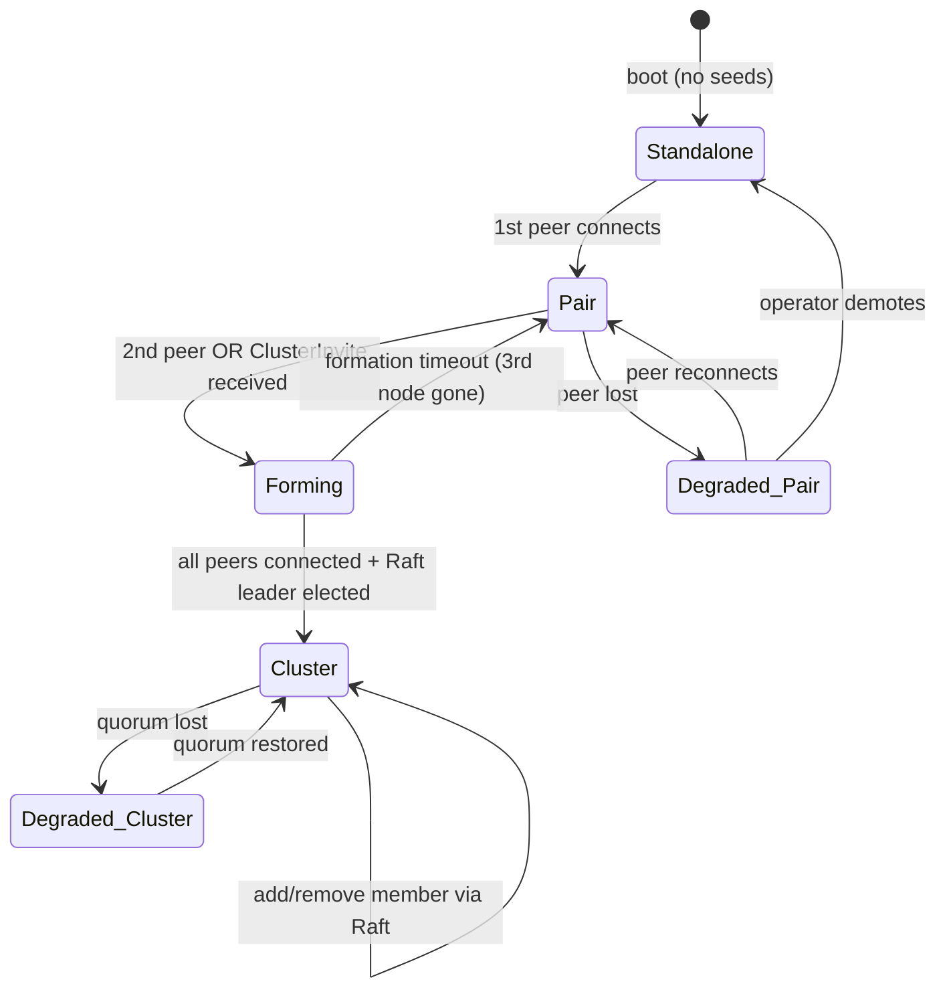
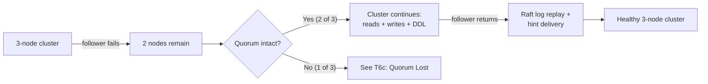
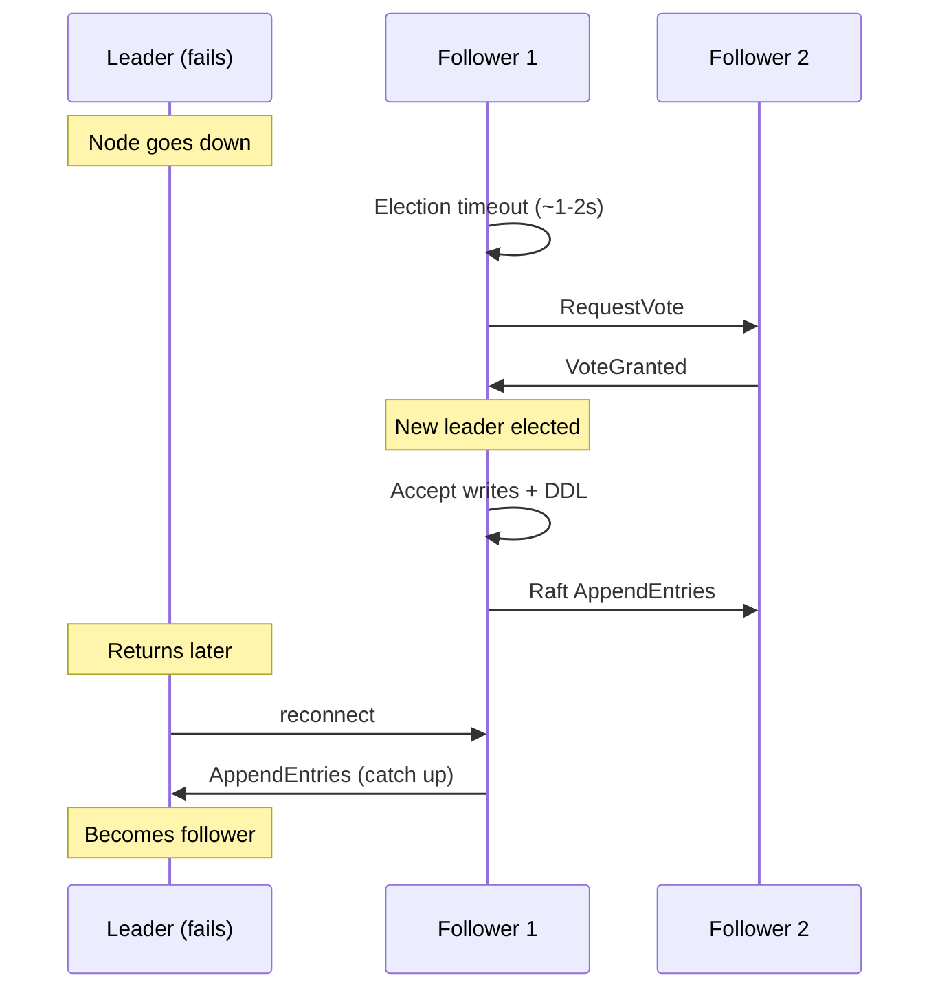
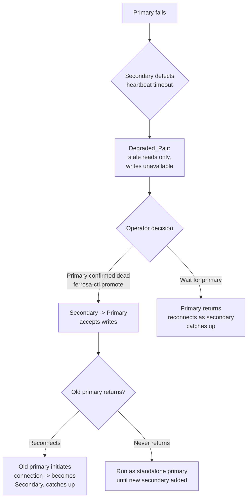
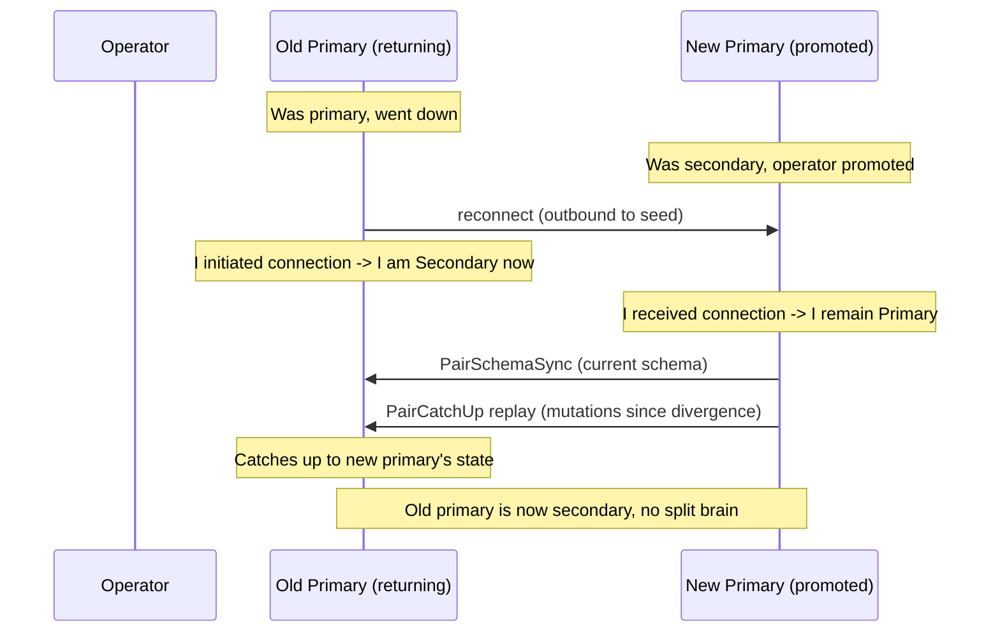
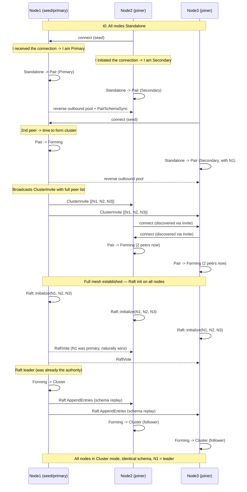
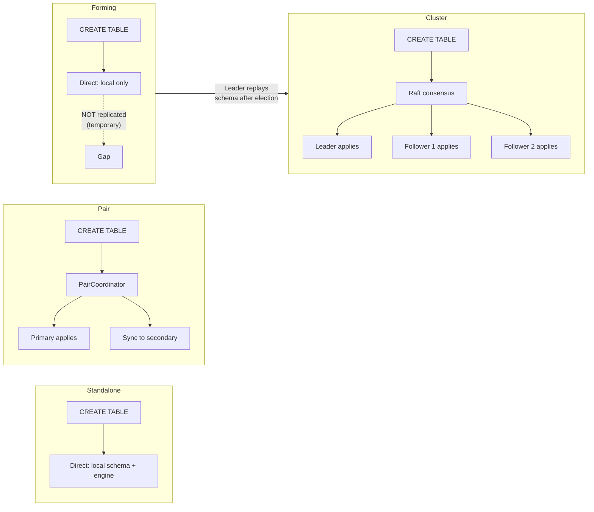

# Cluster Formation State Machine

> Status: **Draft** — Design review required before implementation
> Date: 2026-04-01
> Context: Load testing revealed that nodes fail to form a full cluster when only
> one seed is configured (hub-and-spoke topology). The root cause is that the
> current `ModeController` does not propagate peer information between nodes,
> so non-seed nodes never discover each other and remain stuck in Pair mode.

## Problem Statement

The design spec (`superpowers/specs/2026-03-13-ferrosa-net-cluster-design.md`)
describes progressive formation:

> 1. First node starts with no seed -> Standalone
> 2. Second node joins (via `--seed`) -> both transition to Pair
> 3. Third node joins -> all three transition to Cluster (Raft group forms)
> 4. Subsequent nodes join existing Raft group

The current implementation handles step 3 incorrectly:

- Node1 (seed) sees 2 inbound peers -> transitions to Cluster
- Node2 sees only node1 (1 peer) -> stays in Pair
- Node3 sees only node1 (1 peer) -> stays in Pair
- Raft on node1 cannot form quorum (only 1 of 3 nodes in cluster mode)
- DDL applied on node1 never replicates to node2/node3

The fundamental gap: **there is no mechanism for a node that transitions to
cluster mode to invite its peers to also transition**. Each node makes
independent mode decisions based only on its local peer count.

## Design: Cluster Formation State Machine

### States

Each node maintains a `FormationState` that tracks its progress through
cluster formation. This is separate from `DeploymentMode` (which tracks
the operational mode).



### State Definitions

| State | Peer Count | Raft | DDL Path | Writes |
|-------|-----------|------|----------|--------|
| **Standalone** | 0 | Off | Direct (local) | Local only |
| **Pair** | 1 | Off | Pair coordinator | Write-both sync |
| **Forming** | 1-2+ (connecting) | Initializing | Direct (local, temporary) | Pair semantics with original peer |
| **Cluster** | 2+ (all connected) | Leader elected | Cluster (Raft) | Tunable CL |
| **Degraded** | < quorum reachable | Running (no quorum) | Cluster (reads only) | Writes fail (no quorum) |

### Transitions

#### T1: Standalone -> Pair

**Trigger:** First peer connects (inbound or outbound).

**Role assignment — no election needed:**
- The node that **receives** the connection (the seed) is **Primary**. It has
  been running, has data, and is the authority.
- The node that **initiates** the connection (the joiner) is **Secondary**. It
  is asking to join and will receive data from the primary.
- This is deterministic from the connection direction — no UUID comparison,
  no consensus, no race conditions.

**Actions:**
1. Seed node (inbound connection): become Primary
2. Joining node (outbound connection): become Secondary
3. Primary creates reverse outbound pool to secondary
4. Create `PairCoordinator` (write forwarding, sync replication)
5. Register pair RPC handlers
6. Swap write path to `WritePath::Pair`
7. Swap DDL path to `DdlPath::Pair`
8. Primary sends `PairSchemaSync` to secondary

**Invariants:**
- Exactly 1 peer
- Both nodes agree on roles (seed = Primary, joiner = Secondary)
- Primary has all existing data; secondary receives it via schema sync + catch-up

#### T2: Pair -> Forming

**Trigger:** Second peer connects to a node already in Pair mode, OR node
receives a `ClusterInvite` message from a peer that has already transitioned.

**Actions:**
1. Set state to `Forming`
2. **Broadcast `ClusterInvite`** to all connected peers:
   ```rust
   ClusterInvite {
       initiator: Uuid,       // host_id of the node that triggered formation
       known_peers: Vec<(Uuid, SocketAddr)>,  // all peers this node knows about
   }
   ```
3. For each peer in the invite that we're not connected to: initiate outbound
   connection via `PriorityPool::connect()`
4. DDL remains on Direct path (temporary — will switch to Raft after leader election)
5. Write path remains on Pair semantics with the original pair peer

**Invariants:**
- At least 2 known peers (may not all be connected yet)
- Connections to missing peers are in progress

#### T3: Forming -> Cluster

**Trigger:** All known peers are connected AND Raft leader election succeeds.

**Raft leader — no election surprise:**
The original seed node (which was Primary in pair mode) naturally becomes the
Raft leader. It initiated the `ClusterInvite`, it has all the data, and it
initializes Raft first. The joiners become Raft followers — the same
relationship they had as secondaries. No data movement, no re-election
surprise.

**Actions:**
1. Register Raft RPC handlers (AppendEntries, Vote, InstallSnapshot) BEFORE async
   Raft init using the LazyRaft pattern (commit 7b057b0) — ensures handlers are
   ready to receive messages the moment Raft starts on any node
2. Deliver `ClusterInvite` synchronously on the **Data lane** (not the Raft lane)
   with a 10-attempt retry loop BEFORE Raft init starts (commits 808b72b, 30768c0)
3. Create Raft log store, state machine (seeded with current schema), network factory
4. Register all peer node IDs in Raft network factory
5. Build initial token ring with deterministic token assignment
6. Initialize Raft membership with all nodes
7. Wait for leader election (30s timeout with backoff)
8. Swap DDL path to `DdlPath::Cluster`
9. **Canonical bootstrap runner on ALL nodes**:
   - **DeliverInvites:** multicast `ClusterInvite` to every peer.
   - **EstablishPools:** ensure outbound `Lane::Raft` and `Lane::Data` pools.
   - **CreateRaft:** construct and publish `FerrosRaft`.
   - **WaitLeader:** wait until a Raft `current_leader` is observed.
   - **ReplaySchema:** Leader replays local schema state through Raft so all
     followers converge. Non-leaders replay schema via `PairDdlForward` to
     ensure DDL applied during Pair/Direct windows is captured.
   - **BootstrapStream:** ALL nodes stream their local data to the new token
     owners based on the initial token ring assignment.
   - **Promote:** Leader proposes state changes from `Joining` to `Normal` for
     all nodes via Raft.
   - **DrainQueue:** queued DDL drains through the cluster path.
10. Swap write path to `WritePath::Cluster`
11. Set state to `Cluster`

**Invariants:**
- All peers connected with bidirectional pools (outbound for sends)
- Raft handlers registered before async Raft init (no message-before-handler race)
- Raft leader elected (original seed/primary)
- All nodes have identical schema (via Raft replay + PairDdlForward)

#### T4: Cluster -> Cluster (Adding Members)

**Trigger:** New peer connects to a node already in Cluster mode.

**Actions:**
1. Check approval: if `auto_join=false`, peer must be pre-approved via
   `ferrosa-ctl add-node <host_id>`
2. Propose `JoinNode` via Raft (includes NodeInfo: host_id, addr, DC, rack)
3. Propose `AssignTokens` via Raft (deterministic tokens for new node)
4. New node appears in token ring as state `Joining`
5. Bootstrap: new node streams data from existing owners OR restores from S3
6. Once bootstrap complete, propose state change to `Normal` via Raft
7. **Send `ClusterInvite`** to new node with full peer list so it can
   connect to all existing members (not just the seed it contacted)

**Invariants:**
- Raft quorum maintained throughout
- New node's tokens don't serve reads until bootstrap complete
- Existing nodes' token ownership unchanged until bootstrap finishes

#### T5: Cluster -> Cluster (Decommissioning Members)

**Trigger:** Operator sends decommission command via `ferrosa-ctl decommission [host_id]`.

**Two cases:** decommissioning a follower vs decommissioning the leader.
The data streaming and token reassignment logic is the same — the only
difference is that decommissioning the leader requires a leadership
transfer first.

##### T5a: Decommission a Follower

Straightforward — the leader coordinates the departure.

**Actions:**
1. Leader proposes `LeaveNode` via Raft
2. Departing node's state changes to `Leaving` in token ring
3. Leader computes token reassignment (tokens distributed to remaining nodes)
4. Leader proposes `ReassignTokens` via Raft
5. Departing node streams its data to new token owners via bulk lane
6. Once streaming complete, leader proposes `RemoveNode` via Raft
7. Departing node removed from Raft membership
8. Departing node shuts down or enters Standalone mode

```mermaid
sequenceDiagram
    participant Op as Operator
    participant Leader as Raft Leader
    participant Leaving as Departing Follower
    participant F2 as Remaining Follower

    Op->>Leader: ferrosa-ctl decommission &lt;follower_id&gt;
    Leader->>Leader: Propose LeaveNode via Raft
    Leader->>F2: Raft commit: node state -> Leaving
    Leader->>Leader: Propose ReassignTokens via Raft
    Leader->>F2: Raft commit: new token owners

    Leaving->>F2: Stream data (bulk lane)
    Leaving->>Leader: Stream data (bulk lane)
    Note over Leaving: All token ranges transferred

    Leaving->>Leader: Streaming complete
    Leader->>Leader: Propose RemoveNode via Raft
    Leader->>F2: Raft commit: node removed
    Leaving->>Leaving: Shutdown
```

##### T5b: Decommission the Leader

The departing node IS the leader — it can't coordinate its own removal.
The solution is simple: **transfer leadership first, then decommission as
a follower.**

This reuses the same logic as an unplanned leader failure (T6b) — Raft
already knows how to elect a new leader. The only difference is that this
is a graceful, ordered handoff rather than a crash.

**Actions:**
1. Leader receives decommission command for itself
2. Leader calls `raft.transfer_leader()` to a chosen follower
   (prefer the follower with the most up-to-date log)
3. Raft leadership transfers (~1 round-trip, sub-second)
4. Old leader is now a follower
5. **Proceed with T5a** — new leader coordinates the departure

```mermaid
sequenceDiagram
    participant Op as Operator
    participant L as Leader (departing)
    participant F1 as Follower 1
    participant F2 as Follower 2

    Op->>L: ferrosa-ctl decommission &lt;leader_id&gt;
    Note over L: I'm the leader — transfer first

    L->>F1: Raft: transfer_leader
    F1->>F1: Becomes new leader
    Note over L: Now a follower

    Note over F1,L: Proceed with normal follower decommission (T5a)

    F1->>F1: Propose LeaveNode via Raft
    F1->>F2: Raft commit: old leader state -> Leaving
    F1->>F1: Propose ReassignTokens via Raft

    L->>F1: Stream data (bulk lane)
    L->>F2: Stream data (bulk lane)

    L->>F1: Streaming complete
    F1->>F1: Propose RemoveNode via Raft
    F1->>F2: Raft commit: old leader removed
    L->>L: Shutdown
```

**Why this works cleanly:**
- Raft's `transfer_leader` is a graceful operation — the old leader stops
  accepting proposals and tells a follower to start an election immediately
- The follower wins the election because the old leader votes for it
- Total leadership transfer time: ~1 Raft round-trip (sub-second)
- From that point, the departing node is just a follower being decommissioned
- **Same code path as T5a** — no special "decommission leader" logic needed

**If the leader crashes during its own decommission:**
- Raft automatically elects a new leader (T6b)
- The crashed node's tokens are still assigned (it was in `Leaving` state)
- New leader can complete the decommission once the node's data is
  confirmed on other replicas (or operator forces removal)

**Invariants (both T5a and T5b):**
- Remaining cluster maintains quorum throughout
- No data loss — all token ranges transferred before removal
- Cannot decommission if it would break quorum (refuse if remaining
  voters < 3, or if this would leave fewer than RF replicas for any range)
- Leader decommission is just leadership transfer + follower decommission

#### T6a: Follower Fails (Leader + quorum survive)

**Trigger:** Leader detects a follower is unreachable (heartbeat timeout).
Quorum still holds (e.g., 1 of 3 nodes down — 2 remain, quorum = 2).

**Impact: Minimal** — cluster continues operating normally.

**Actions:**
1. Raft continues — quorum intact, leader still commits
2. DDL continues — Raft proposals succeed with remaining quorum
3. Writes continue at CL=QUORUM (2 of 3 replicas available)
4. Writes at CL=ALL fail (missing replica)
5. Hinted handoff stores mutations for the failed follower
6. Log warning, expose via metrics

**When follower returns:**
- Follower reconnects, Raft replays log entries it missed
- If too far behind, leader sends Raft snapshot (install_snapshot)
- Hinted handoff replayed for any data-path mutations
- If hints overflowed, flag for full anti-entropy repair
- **No operator action required** — fully automatic recovery



#### T6b: Leader Fails (Followers survive)

**Trigger:** Followers detect leader is unreachable (Raft election timeout).

**Impact: Brief write disruption** — Raft must elect a new leader.

**Actions:**
1. Raft election timeout fires on remaining followers (~1-2s)
2. Remaining followers hold leader election automatically
3. New leader elected from surviving followers (the one with the most
   up-to-date log wins — Raft's built-in safety guarantee)
4. New leader begins accepting writes and DDL proposals
5. **Write unavailability window: ~1-2 seconds** (election timeout only)
6. Reads at CL=ONE continue throughout (no interruption)
7. Hinted handoff stores mutations for the failed old leader
8. CQL clients connected to the failed node get connection errors and
   must reconnect to a surviving node

**When old leader returns:**
- Old leader reconnects, discovers it is no longer leader
- Becomes a follower, receives Raft log entries from new leader
- Catches up via log replay or snapshot install
- Hinted handoff replayed to bring its data partition replicas current
- **No operator action required** — Raft handles re-election automatically

**Key difference from pair mode:** With 3+ nodes, Raft can safely auto-elect
a new leader because a quorum (2 of 3) can distinguish "leader dead" from
"network partition". This is why pair mode requires manual promotion but
cluster mode does not.



#### T6c: Quorum Lost (2+ nodes fail in 3-node cluster)

**Trigger:** Fewer than quorum nodes are reachable. In a 3-node cluster,
2 nodes failing leaves 1 — no quorum.

**Impact: Severe** — cluster cannot make progress.

**Actions:**
1. Raft stops accepting writes (no quorum for commits)
2. DDL unavailable (cannot propose to Raft)
3. Surviving node(s) serve **stale reads only** at CL=ONE
4. Writes at any CL fail with `Unavailable`
5. Hinted handoff stores mutations (limited value — most replicas down)
6. Alert via metrics: `ferrosa_cluster_quorum_lost`

**Recovery — nodes return:**
- If enough nodes return to restore quorum, Raft automatically resumes
- Leader election occurs, writes resume
- Hinted handoff replayed
- **No operator action required** if nodes come back on their own

**Recovery — nodes permanently lost:**
- Operator must intervene to reconfigure the cluster
- `ferrosa-ctl` force-reconfigure to reduce membership
- Or restore from S3 snapshots onto new hardware
- This is a disaster recovery scenario, not normal operations

**Invariants:**
- Surviving node never accepts writes without quorum — no split brain
- Data is safe on surviving node's local disk + S3
- Raft's safety guarantee: committed entries are never lost as long as
  a quorum of the log survives

#### T7: Degraded -> Cluster (Recovery)

**Trigger:** Failed peers reconnect, quorum restored.

**Actions:**
1. Raft leader election completes (if leader was lost) or existing leader resumes
2. Writes and DDL resume
3. Replay hinted handoff to recovered peers
4. If peer was down long enough that hints overflowed, flag for full repair

**Invariants:**
- Recovered peers catch up via Raft log replay (or snapshot install)
- Hinted handoff replayed in write-order with original timestamps
- No manual intervention required for quorum restoration

#### T8a: Secondary Fails (Primary survives)

**Trigger:** Primary detects secondary is unreachable (heartbeat timeout).

**Impact: Minimal** — primary is the authority and has all data.

**Actions (on primary):**
1. Set state to `Degraded_Pair`
2. Primary continues serving **reads and writes** (unreplicated)
3. Begin storing hints for failed secondary (capped at `HINTED_HANDOFF_MAX_MB`)
4. Log warning, expose via metrics

**When secondary returns:**
- Secondary reconnects (initiates connection → becomes secondary again)
- Primary replays hints to bring secondary up to date
- If hints overflowed, secondary does full catch-up from commit log or S3 snapshot
- State returns to healthy `Pair`

**No operator action required.** Primary never stopped, secondary catches up
automatically on reconnect.

#### T8b: Primary Fails (Secondary survives)

**Trigger:** Secondary detects primary is unreachable (heartbeat timeout).

**Impact: Significant** — the authority node is gone.

**Actions (on secondary):**
1. Set state to `Degraded_Pair`
2. Secondary continues serving **stale reads only**
3. **Writes are unavailable** — secondary cannot accept writes without promotion
4. **No auto-promotion** — operator must explicitly decide

**Operator choices:**

| Action | When | Consequence |
|--------|------|-------------|
| `ferrosa-ctl promote` | Primary is confirmed dead | Secondary becomes primary, accepts writes. Old primary becomes secondary on return. |
| Wait | Partition, primary may return | Writes remain down until primary returns or operator promotes. No data loss risk. |

**Why no auto-promote:** With only 2 nodes, the secondary cannot distinguish
"primary is dead" from "network partition". Auto-promoting during a partition
creates split brain — both nodes accept writes, data diverges irrecoverably.
The operator has out-of-band knowledge (checked the hardware, pinged the host)
that the code cannot have.



#### T9: Degraded Pair -> Operator Promotes Secondary

**Trigger:** Primary is down, operator runs `ferrosa-ctl promote` on the secondary.

**Actions:**
1. Secondary promotes to Primary (accepts writes)
2. Records promotion event with timestamp (for later conflict resolution)
3. Begins accepting writes — data diverges from old primary

**When old primary comes back:**



**Key rule:** When the old primary reconnects, it **initiates** the connection
(it's trying to rejoin). Since it initiated, it becomes Secondary — same rule
as T1. The promoted node received the connection, so it stays Primary. No
ambiguity, no election, no split brain.

**If both nodes were partitioned and both had writes:**
- The promoted secondary's writes win (it was explicitly promoted by the operator)
- The old primary's unreplicated writes during the partition are lost
- This is correct: the operator made a decision, and that decision is authoritative
- If preserving both is needed, the operator should NOT promote and instead
  wait for the partition to heal

**Invariants:**
- Old primary always becomes secondary on return (it initiates the connection)
- No automatic role swap — operator promotion is the only way to change roles
- Split brain is impossible: only one node can be promoted, and connection
  direction determines roles on reconnect

### The `ClusterInvite` Message

This is the key missing piece in the current implementation. When a node
decides to form a cluster (because it sees >= 2 peers), it must tell ALL
its peers about ALL other peers so the full mesh can form.

```rust
// New message type
Message::ClusterInvite {
    initiator: Uuid,
    peers: Vec<(Uuid, SocketAddr)>,
}
Message::ClusterInviteAck {
    host_id: Uuid,
}
```

**Handler on receiving node:**

```
fn on_cluster_invite(invite):
    for (peer_id, peer_addr) in invite.peers:
        if peer_id != self.local_host_id && !peer_manager.has_peer(peer_id):
            connect_to_peer(peer_id, peer_addr)

    if connected_peers.len() >= 2:
        transition_to_forming()
    else:
        // Wait for connections to complete, then transition
        schedule_formation_check()
```

**Propagation guarantee:** Every node that receives a `ClusterInvite` also
sends `ClusterInvite` to any peers it connects to as a result. This ensures
the peer list propagates even in non-star topologies.

### Mesh Formation Sequence (3 nodes, hub-and-spoke seeds)



### DDL During Transition Windows

| Phase | DDL Path | Replication |
|-------|----------|-------------|
| Standalone | Direct (local) | None |
| Pair | Pair coordinator | Sync to secondary |
| Forming | Direct (local) | **Not replicated** (temporary) |
| Cluster (leader) | Raft | Full consensus |



**Risk:** DDL applied during the Forming window is only on the local node.
**Mitigation:** After Raft leader election, the leader replays all non-system
keyspaces and tables through Raft. The state machine's `apply_command` is
idempotent (`or_insert_with`), so replaying existing entries is safe.

### Configuration

Progressive join (Standalone -> Pair -> Cluster) is the only supported formation
mode. The `FERROSA_CLUSTER_MODE` environment variable was removed (commit 83943a5)
as it added configuration complexity without meaningful safety benefit — the
progressive state machine already gates transitions correctly.

| Config | Effect |
|--------|--------|
| `FERROSA_AUTO_JOIN=false` | New nodes after initial formation must be pre-approved |
| `FERROSA_AUTO_JOIN=true` | Any authenticated node can join (dev/test only) |

## Gaps in Current Implementation

| # | Gap | Impact | Fix |
|---|-----|--------|-----|
| 1 | **No `ClusterInvite` message** | Non-seed nodes never learn about each other, stay in Pair | Add message type + handler + propagation logic |
| 2 | **No `Forming` state** | Transition from Pair to Cluster is atomic — if connections aren't ready, Raft fails | Add intermediate state with connection wait |
| 3 | **Missing reverse outbound pools** | `transition_to_cluster` doesn't create pools for peers connected after pair formation | Ensure pools for all peers before Raft init |
| 4 | **DDL race during formation** | DDL applied via Direct path during Raft init never replicates | Leader replays schema after election (partially implemented) |
| 5 | **No decommission data streaming** | `LeaveNode` removes from topology but doesn't stream data | Implement bulk lane streaming before removal |
| 6 | **No `Forming -> Pair` fallback** | If 3rd node disappears during formation, cluster hangs | Timeout on Forming state, fall back to Pair |
| 7 | **`trigger_cluster_join` approval not checked before Raft proposal** | Production: unapproved nodes could be proposed (race between approval check and Raft) | Move approval check inside Raft command |

## Implementation Order

1. **Add `ClusterInvite` / `ClusterInviteAck` messages** to ferrosa-net
2. **Add `Forming` state** to DeploymentMode enum
3. **Implement `ClusterInvite` handler** in ModeController
4. **Wire `ClusterInvite` send** into `transition_to_cluster` (now `transition_to_forming`)
5. **Add formation timeout** — if Forming doesn't reach Cluster in 60s, log warning
6. **Add mesh verification** — before Raft init, verify all peers have bidirectional pools
7. **Test with hub-and-spoke seeds** — 1 seed node, 2 non-seed nodes
8. **Add decommission data streaming** (separate sprint)
9. **Add `Forming -> Pair` fallback** (separate sprint)

## Adding a Member (4th node joins running cluster)

```mermaid
sequenceDiagram
    participant N4 as Node4 (new)
    participant N1 as Node1 (leader)
    participant N2 as Node2
    participant N3 as Node3

    N4->>N1: connect (seed)
    N1->>N1: on_peer_connected: mode=Cluster

    alt auto_join=true (dev)
        N1->>N1: Propose JoinNode via Raft
    else auto_join=false (prod)
        Note over N1: Reject: not approved
        Note over N4: Operator: ferrosa-ctl add-node &lt;host_id&gt;
        N1->>N1: Propose JoinNode via Raft
    end

    N1->>N2: Raft commit: N4 joins (state=Joining)
    N1->>N3: Raft commit: N4 joins (state=Joining)
    N1->>N1: Propose AssignTokens for N4

    N1->>N4: ClusterInvite [{N1, N2, N3}]
    N4->>N2: connect (from invite)
    N4->>N3: connect (from invite)

    Note over N4: Bootstrap from S3 or stream from owners

    N4->>N1: Bootstrap complete
    N1->>N1: Propose state -> Normal via Raft
    N1->>N2: Raft commit: N4 state=Normal
    N1->>N3: Raft commit: N4 state=Normal

    Note over N1,N4: N4 now serving reads and writes
```
