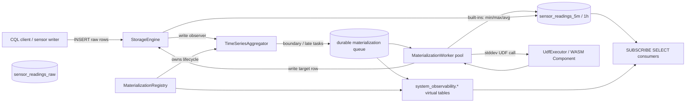
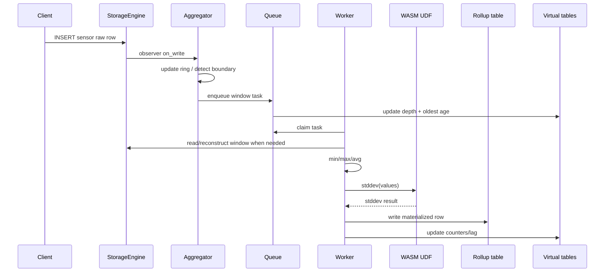

# RRD Materialized Rollups and WASM Time-Series UDF Architecture

> Last updated: 2026-05-20
> Status: Draft blueprint for `feature/rrd-wasm-timeseries-blueprint`

## Overview

This blueprint turns the existing RRD/time-series consolidation code from
storage-local building blocks into a CQL-visible materialized-rollup feature.
Users configure rollups with table extensions, write high-frequency sensor
readings into the raw table, and read asynchronous rollup rows from generated
target tables. The same feature must support subscription operators so clients
can subscribe to new rollup rows and to queue/lag state.

The example story is time-series sensor data: raw temperature, vibration, and
humidity readings arrive every second; Ferrosa maintains 5-minute and 1-hour
rollups with min/max/avg and a WASM UDF for standard deviation. The UDF example
is intentional: it proves custom per-window math can run close to storage
without exporting raw sensor streams to an external analytics service.

## Current Ground Truth

Implemented:

- `ferrosa-storage/src/timeseries/` contains ring buffers, aggregation
  functions, late-data debouncing, task types, and focused tests.
- `ferrosa-cql/src/router.rs::create_cascade_tables_if_needed` auto-creates
  downstream table metadata when `consolidation.cascade = true`.
- `system_observability.consolidation_status` lists tables with consolidation
  extensions.
- `CREATE FUNCTION ... LANGUAGE wasm AS '<hex>'` parses, compiles, and stores
  WASM function metadata for scalar UDFs.

Missing:

- Table extensions do not register active `TimeSeriesAggregator` observers.
- Consolidation workers do not write materialized target rows.
- Materialization queues are not observable or subscribable.
- Late data does not trigger durable target-row recomputation.
- CQL-loaded WASM is not cluster-complete for overloads, replacement,
  restart/follower recompilation, file/URL admin import, or `WHERE` predicates.

## Architecture

## Components

### Materialization Registry

- **Location**: new module under `ferrosa-storage/src/timeseries/registry.rs`
  or `ferrosa-storage/src/materialization/`.
- **Purpose**: own active consolidators, worker queues, queue metrics, and DDL
  lifecycle.
- **Inputs**: schema snapshot, table DDL changes, storage engine handle.
- **Outputs**: registered write observers, durable queue records, virtual table
  providers.
- **Key requirement**: idempotent rebuild from schema on startup and after DDL
  apply.

### Aggregator Observer

- **Location**: `ferrosa-storage/src/timeseries/aggregator.rs`.
- **Purpose**: fast write-path ring insertion and boundary/late detection.
- **Constraint**: no disk reads or blocking work on the write path.
- **Change**: emit durable queue tasks through the registry rather than only an
  in-memory `mpsc` sender.

### Materialization Queue

- **Purpose**: decouple source write latency from rollup creation while making
  lag observable.
- **Durability**: tasks must survive crash or be reconstructable by scanning
  source windows on recovery.
- **Observability fields**: source/target table, window start/end, task type,
  enqueue time, oldest task age, queue depth, retry count, last error, max delay
  threshold, alerting flag.

### Worker Pool

- **Purpose**: consume queue tasks, compute built-in aggregates, invoke WASM
  UDFs, and write target rows through `StorageEngine`.
- **Late data**: tasks inside `consolidation.late_window` recompute the entire
  affected target row. Older data increments stale/drop counters.
- **Cascade**: target writes must flow back through observers when the target
  table has its own consolidation config.

### WASM UDF Loading

- **Location**: `ferrosa-cql/src/parser.rs`, `ferrosa-cql/src/router.rs`,
  `ferrosa-udf/src/executor.rs`, `ferrosa-schema/src/metadata/function.rs`.
- **CQL forms**:
  - Inline deterministic bytes: `AS '0x<hex>'`.
  - Admin-only file import: `AS FILE '/secure/path/stddev.wasm'`.
  - Admin-only URL import: `AS URL 'https://...' WITH SHA256 = '<digest>'`.
- **Storage model**: replicated schema metadata contains resolved bytes/hash,
  not filesystem paths or URLs.
- **Execution model**: scalar UDFs work in SELECT projections and deterministic
  `WHERE ... ALLOW FILTERING` predicates.

## Data Flow

## Key Decisions

- Materialization is asynchronous. Source writes do not wait for target rows,
  but queue state must be observable and alertable.
- Late data correction is bounded by table configuration. The default should be
  conservative and visible in `consolidation_status`.
- File/URL UDF loading is admin-only and normalizes to deterministic bytes plus
  SHA-256 before schema replication.
- UDFs in `WHERE` are in scope, but require `ALLOW FILTERING` unless a future
  planner path can prove an index-safe rewrite.
- Example docs must show sensor-specific value: min/max/avg summarize operating
  envelope, and a WASM stddev UDF exposes volatility/anomaly risk.

## Open Questions

- Should the materialization queue be a storage table, commit-log sidecar, or
  reconstructable in-memory queue with checkpointed watermarks?
- Should target rollup rows include sample count and source window coverage
  by default?
- What default `consolidation.late_window` is acceptable for IoT sensor data:
  `2x interval`, fixed `10m`, or explicit-only?

## Related Specs

- [RRD materialized rollups work item](in-process/gap-rrd-materialized-rollups.md)
- [CQL-loaded WASM UDF work item](in-process/gap-cql-loaded-wasm-udf-e2e.md)
- [Example docs blueprint](timeseries-sensor-example-docs.md)
- [FMEA](fmea-rrd-wasm-timeseries.md)
- [Threat model](threat-model-rrd-wasm-timeseries.md)
