# Runtime Isolation Architecture

> Last updated: 2026-04-08
> Status: Draft

## Overview

All ferrosa subsystems currently share a single tokio multi-thread runtime.
Under load, cross-path interference causes Raft heartbeat timeouts (P0),
CQL P99/P100 latency spikes, and silent drops of internode RPCs. This spec
defines a runtime-per-subsystem architecture where the main runtime becomes
a supervisor and each subsystem gets its own isolated thread pool.

## Problem

The main tokio runtime hosts ~30 spawned task families including CQL query
execution, graph/Bolt/SPARQL servers, internode RPC handlers, Raft consensus,
S3 uploads, bootstrap streaming, compaction polling, index building, and the
web console. Any CPU-intensive or blocking work on one task starves all others.

Concrete failures observed:
- Raft AppendEntries timeout at 300ms because `reply_rx.await` on the main
  runtime can't be polled while CQL/S3/bootstrap tasks run
- CQL reads timeout when internode RPC handlers can't process range reads
- Zero bytes on TCP wire for Raft despite dedicated lane actor thread — the
  `RpcClient` read/write loops were spawned on the main runtime via
  `tokio::spawn` during pool construction

## Architecture

```mermaid
graph TB
    MAIN["Main Runtime<br/>(supervisor only)"]

    MAIN --> RAFT["Raft Runtime<br/>2 threads"]
    MAIN --> CQL["CQL Runtime<br/>N threads"]
    MAIN --> DATA["Data Runtime<br/>N threads"]
    MAIN --> S3["S3 Runtime<br/>2 threads"]
    MAIN --> IDX["Index Runtime<br/>2 threads"]
    MAIN --> AUX["Aux Runtime<br/>2 threads"]

    RAFT --> R1["openraft tasks"]
    RAFT --> R2["Raft lane actors"]
    RAFT --> R3["Raft RPC handlers"]
    RAFT --> R4["Raft RpcClient IO"]

    CQL --> C1["CQL accept loop"]
    CQL --> C2["CQL per-connection handlers"]
    CQL --> C3["Query execution"]

    DATA --> D1["Internode RPC server"]
    DATA --> D2["Data/Bulk lane actors"]
    DATA --> D3["Read/Write handlers"]
    DATA --> D4["Bootstrap streaming"]
    DATA --> D5["Repair + hints"]

    S3 --> S1["SSTable upload"]
    S3 --> S2["Schema snapshot persist"]
    S3 --> S3A["Manifest save"]

    IDX --> I1["Index build scheduler"]
    IDX --> I2["Secondary index rebuild"]

    AUX --> A1["Graph HTTP server"]
    AUX --> A2["Bolt server"]
    AUX --> A3["SPARQL server"]
    AUX --> A4["Web console"]
```



## Runtime Definitions

### Main Runtime (supervisor)

**Threads**: 1 (current\_thread)
**Owns**: Startup sequence, signal handling, shutdown coordination, health
monitoring, periodic flush/compaction polling (scheduling only, not execution).

Does NOT execute any query, network IO, or consensus work. Spawns subsystem
runtimes and monitors them.

### Raft Runtime

**Threads**: 2
**Owns**: All openraft internal tasks (replication, election, snapshot),
Raft lane actors (outbound), Raft RPC handlers (inbound AppendEntries/Vote),
Raft `RpcClient` read/write IO loops, sled log store operations.

**Isolation guarantee**: A CQL query or S3 upload cannot delay a Raft
heartbeat. The Raft runtime is the only runtime that touches openraft.

**Implementation**:
- Create `RaftRuntime` struct wrapping `Arc<tokio::runtime::Runtime>`
- Pass its handle to `ConnectionPool::connect()` for Raft lane spawning
- Call `FerrosRaft::new()` on this runtime so openraft spawns there
- Route inbound Raft RPC dispatch to this runtime

### CQL Runtime

**Threads**: `num_cpus` (matches current default)
**Owns**: CQL TCP accept loop, per-connection handlers, query parsing,
query execution (reads/writes that don't cross node boundaries).

Cross-node reads/writes submit work to the Data Runtime via channels and
await results.

### Data Runtime

**Threads**: `num_cpus / 2` (minimum 2)
**Owns**: Internode RPC server accept loop, per-connection handlers,
Data/Bulk lane actors, read/write forwarding handlers, bootstrap streaming,
repair writes, hinted handoff delivery.

### S3 Runtime

**Threads**: 2
**Owns**: SSTable upload workers, schema snapshot persistence, manifest
save (CAS or unconditional), commit log archiving.

Already partially implemented (S3 sync on dedicated OS threads in main.rs).
Consolidate into a proper runtime.

### Index Runtime

**Threads**: 2
**Owns**: `IndexBuildScheduler`, secondary index rebuild after compaction,
full index rebuild on CREATE INDEX.

### Aux Runtime

**Threads**: 2
**Owns**: Graph HTTP server, Bolt/Cypher server, SPARQL server, web
console/dashboard. These are user-facing but lower priority than CQL.

## Implementation Plan

### Phase 1: Raft isolation (fixes P0 heartbeat timeouts)

1. Create `RuntimeManager` in `ferrosa/src/runtime.rs` that builds and
   holds all subsystem runtimes
2. Move `FerrosRaft::new()` call to Raft runtime handle
3. Move Raft RPC handler dispatch to Raft runtime (already prototyped
   in `rpc/server.rs` with `raft_runtime`)
4. Ensure `RpcClient` for Raft lanes spawns IO on Raft runtime (already
   prototyped in `lane_actor.rs` reconnection)
5. Validate: Raft heartbeats survive concurrent S3 sync + CQL load

### Phase 2: CQL + Data isolation (fixes P99/P100)

1. Move CQL server to CQL runtime
2. Move internode RPC server to Data runtime
3. Add channel bridge for cross-node CQL reads/writes
4. Validate: CQL P99 unaffected by bootstrap streaming

### Phase 3: S3 + Index + Aux isolation

1. Consolidate S3 dedicated threads into S3 runtime
2. Move index scheduler to Index runtime
3. Move graph/Bolt/SPARQL servers to Aux runtime
4. Main runtime becomes supervisor only

## `RuntimeManager` API

```rust
pub struct RuntimeManager {
    pub raft: Arc<tokio::runtime::Runtime>,
    pub cql: Arc<tokio::runtime::Runtime>,
    pub data: Arc<tokio::runtime::Runtime>,
    pub s3: Arc<tokio::runtime::Runtime>,
    pub index: Arc<tokio::runtime::Runtime>,
    pub aux: Arc<tokio::runtime::Runtime>,
}

impl RuntimeManager {
    pub fn new() -> Self { /* build all runtimes */ }

    pub fn shutdown_all(&self, timeout: Duration) {
        // Shutdown in reverse dependency order:
        // aux -> index -> s3 -> data -> cql -> raft
    }
}
```

## Key Decisions

- **Raft gets its own runtime** rather than sharing with Data: Raft
  heartbeats are latency-critical (300ms timeout). Even internode data
  RPCs can take 100ms+ for large range reads and must not delay heartbeats.

- **CQL and Data are separate**: A slow CQL query (full table scan) must
  not delay internode read forwarding for other queries on other nodes.

- **Main runtime is supervisor-only**: Prevents any accidental work from
  landing on main. Forces explicit runtime selection for all spawned tasks.

- **Thread counts are configurable via env vars**: `FERROSA_RAFT_THREADS`,
  `FERROSA_CQL_THREADS`, etc. Defaults are reasonable for 4-8 core hosts.

## Migration Strategy

Each phase is a separate PR. The `RuntimeManager` is created first and
passed through the startup sequence. Subsystems are migrated one at a time
by changing `tokio::spawn(...)` to `runtime_manager.raft.spawn(...)` (etc).

Existing tests that use `#[tokio::test]` continue to work unchanged because
they create their own runtime.

## Open Questions

- Should compaction execution (CPU-intensive merge sort) get its own runtime
  or share with S3?
- Should the flush path (disk IO) use `spawn_blocking` on the Data runtime
  or get dedicated threads?
- How to handle cross-runtime cancellation during shutdown?
