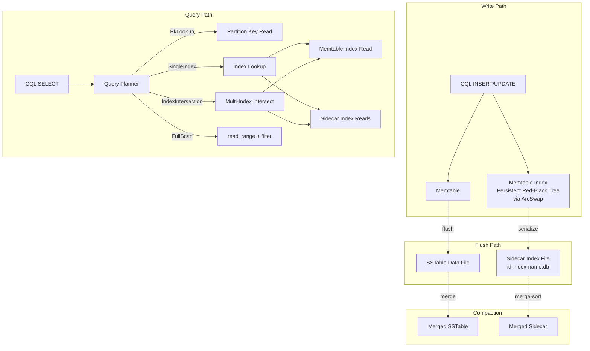
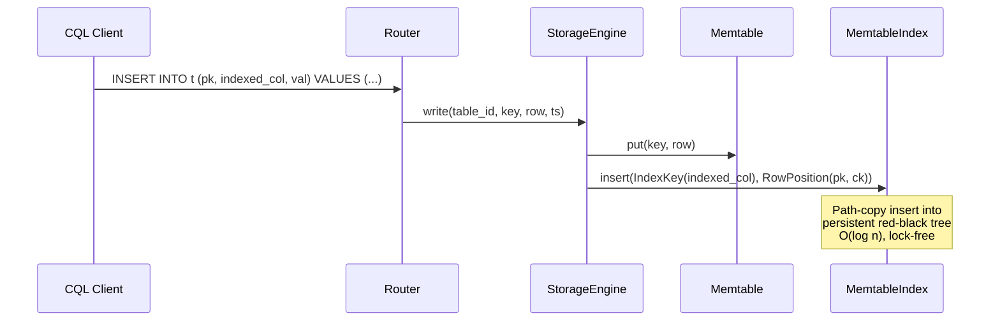

# Secondary Index Pipeline: Query, Build, and Update

> Last updated: 2026-03-18
> Status: Draft

## Overview

Wire the existing secondary index framework (ferrosa-index) into the query and write paths so that indexes actually accelerate queries instead of serving as metadata-only gatekeepers. The design mirrors the LSM-tree architecture: a lock-free memtable-level index for recent writes, immutable per-SSTable sidecar indexes for flushed data, and a query planner that merges results from both layers.

## Architecture



## Components

### 1. Memtable Index (`MemtableIndex`)

- **Purpose**: Lock-free in-memory index updated on every write, one per declared secondary index per table
- **Location**: New struct in `ferrosa-storage/src/memtable/index.rs`
- **Data structure**: Persistent (functional) red-black tree behind `ArcSwap`. Writers path-copy O(log n) nodes to produce a new root. Readers get a consistent snapshot via `ArcSwap::load()`. No locks.
- **Lifecycle**: Created when memtable is allocated. Serialized to sidecar file on flush. Dropped with memtable.
- **Key interfaces**:
  - `insert(index_key: IndexKey, row_position: RowPosition)` — path-copy insert, O(log n)
  - `lookup(key: &IndexKey) -> Vec<RowPosition>` — point lookup
  - `range(start, end) -> Vec<RowPosition>` — range scan
  - `iter() -> impl Iterator<Item = (IndexKey, RowPosition)>` — ordered iteration for flush serialization

### 2. SSTable Sidecar Index

- **Purpose**: Immutable per-SSTable index file, binary-searchable
- **Location**: Companion file `{sstable_id}-Index-{index_name}.db` alongside the SSTable data file
- **Format**: Header (magic, version, entry count, key type) + sorted array of `(key_len, key_bytes, partition_key, clustering_key)` entries
- **Dependencies**: `ferrosa-index` `IndexBuilder`/`IndexReader` traits
- **Key interfaces**:
  - Built by `IndexBuilder::add_row()` + `finish()` during flush
  - Read by `IndexReader::lookup()` / `range()` via binary search
  - Merged during compaction via merge-sort of input sidecar files

### 3. Query Planner (`ScanPlan`)

- **Purpose**: Decide how to execute a SELECT based on available indexes
- **Location**: New module `ferrosa-cql/src/planner.rs`
- **Dependencies**: Schema metadata (`IndexMetadata`), `IndexCapabilities`

```rust
pub enum ScanPlan {
    PkLookup { key: DecoratedKey },
    SingleIndex { index_name: String, key: IndexKey, filter: Vec<WhereClause> },
    IndexIntersection { indexes: Vec<(String, IndexKey)>, filter: Vec<WhereClause> },
    FullScan { filter: Vec<WhereClause> },
}
```

- **Planning rules** (v1, rule-based):
  1. All PK columns in WHERE → `PkLookup`
  1. Exactly 1 WHERE column matches a secondary index → `SingleIndex`
  1. 2+ WHERE columns each match a secondary index → `IndexIntersection`
  1. Otherwise → `FullScan` (requires ALLOW FILTERING)
- **Future**: Cost-based planner using cardinality estimates from sidecar headers and `IndexCapabilities`

### 4. EXPLAIN Statement

- **Purpose**: Show query execution plan without executing
- **Location**: Parser addition in `ferrosa-cql/src/parser.rs`, routing in `router.rs`
- **Output**: Text result set with one row describing the `ScanPlan`

### 5. Index-Aware StorageEngine Methods

- **Purpose**: Bridge between query planner and index infrastructure
- **Location**: New methods on `StorageEngine` in `ferrosa-storage/src/engine.rs`
- **Key interfaces**:
  - `read_by_index(table_id, index_name, key) -> Result<Vec<(DecoratedKey, Vec<Row>)>>`
  - `read_by_index_range(table_id, index_name, start, end) -> Result<Vec<(DecoratedKey, Vec<Row>)>>`

These methods:

1. Query the active memtable's `MemtableIndex`
1. Query each SSTable's sidecar `IndexReader`
1. Collect `RowPosition` results
1. Fetch actual rows by partition key + clustering key
1. Merge and deduplicate (newer entries shadow older)

### 6. Write Path Integration

- **Purpose**: Keep memtable index current with every write
- **Location**: Modification to `StorageEngine::write()` and `TableStore::write()`
- **Flow**:
  1. Write row to memtable (existing path)
  1. For each secondary index on the table, extract the indexed column value
  1. Insert `(IndexKey, RowPosition)` into the memtable's `MemtableIndex`
  1. Cost: O(log n) per index per write, where n is bounded by memtable flush threshold

### 7. Flush Path Integration

- **Purpose**: Serialize memtable index to sidecar file alongside SSTable
- **Location**: Modification to `TableStore::flush()`
- **Flow**:
  1. Flush memtable to SSTable (existing path)
  1. For each memtable index, iterate in key order
  1. Write sorted entries to sidecar file using `IndexBuilder::add_row()` + `finish()`
  1. Register sidecar with `IndexStateTracker`

### 8. Compaction Integration

- **Purpose**: Merge sidecar indexes when SSTables compact
- **Location**: Modification to compaction pipeline
- **Flow**:
  1. Open `IndexReader` for each input SSTable's sidecar
  1. Merge-sort entries from all readers
  1. Write merged entries to new sidecar via `IndexBuilder`
  1. Delete old sidecar files with old SSTables

## Data Flow

### Write + Index Update



### Query with Index

```mermaid
sequenceDiagram
    participant C as CQL Client
    participant R as Router
    participant QP as QueryPlanner
    participant SE as StorageEngine
    participant MI as MemtableIndex
    participant SI as Sidecar IndexReaders

    C->>R: SELECT * FROM t WHERE indexed_col = 'x'
    R->>QP: plan(select_stmt, schema)
    QP-->>R: ScanPlan::SingleIndex("idx_col", key)
    R->>SE: read_by_index(table_id, "idx_col", key)
    SE->>MI: lookup(key)
    MI-->>SE: [RowPosition(pk1, ck1)]
    SE->>SI: lookup(key) for each SSTable sidecar
    SI-->>SE: [RowPosition(pk2, ck2), ...]
    SE->>SE: fetch rows by RowPosition, merge, deduplicate
    SE-->>R: Vec&lt;(DecoratedKey, Vec&lt;Row&gt;)&gt;
    R-->>C: RESULT rows
```

## Key Decisions

- **Lock-free memtable index**: Persistent (functional) red-black tree via `ArcSwap` — no mutex contention on the write path. O(log n) path-copy allocation per insert, bounded by memtable size.
- **Sidecar files, not embedded**: Index data stored in companion files alongside SSTables, not embedded in the SSTable format. Preserves Cassandra SSTable read compatibility.
- **Multi-index intersection in v1**: Query planner supports combining results from multiple indexes via `RowPosition` set intersection before row fetch.
- **EXPLAIN for testability**: Users and tests can verify index usage without executing queries.
- **Incremental updates, not rebuilds**: Every write updates the memtable index. SSTable indexes are built once at flush. Compaction merges them. No periodic full rebuilds needed.

## Update Cost Model

| Operation | Cost | Notes |
|-----------|------|-------|
| Write (per index) | O(log n) | n = memtable entries, bounded by flush threshold |
| Flush (per index) | O(n) | Sequential write of sorted entries |
| Point lookup | O(log n) memtable + O(log n) per SSTable | Binary search in each sidecar |
| Compaction (per index) | O(n₁ + n₂) | Merge-sort of two sorted files |
| Range scan | O(log n + k) | k = result set size |

## Open Questions

- [ ] Should sidecar index files be uploaded to S3 alongside SSTables?
- [ ] How to handle index consistency during crash recovery (sidecar without matching SSTable)?
- [ ] Vector index integration — separate pipeline or unified with secondary indexes?

## Related Specs

- `specs/2026-03-11-ferrosa-architecture-design.md` — Overall architecture
- `superpowers/plans/2026-03-18-p0-p1-cluster-fixes.md` — Recent cluster stability fixes
