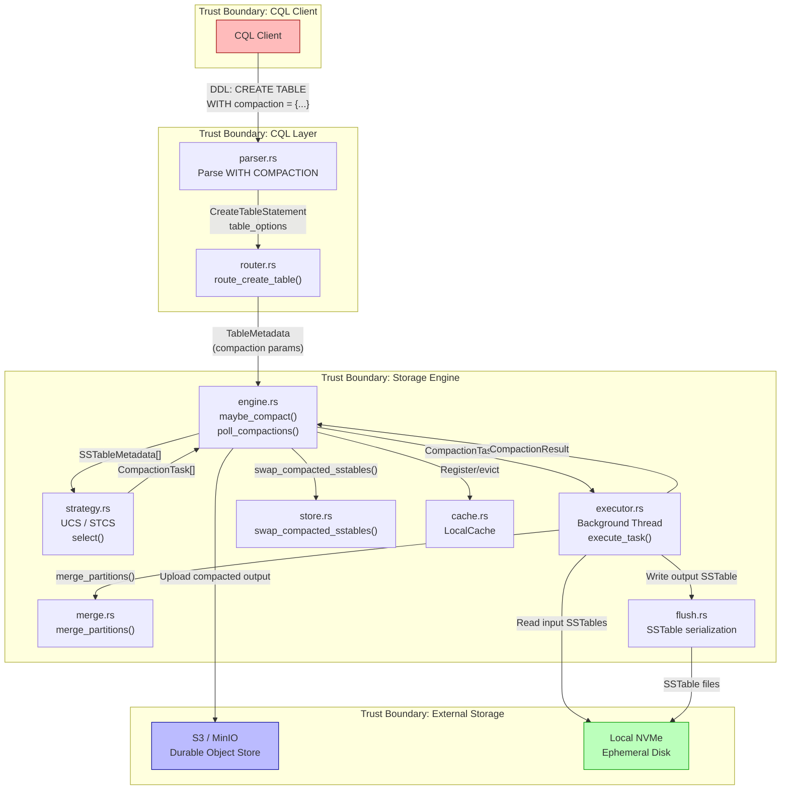

# UCS (Unified Compaction Strategy) Analysis

**Date:** 2026-03-30
**Component:** ferrosa-storage compaction subsystem
**Scope:** DSM dependency analysis, STRIDE threat model, FMEA failure analysis

---

## Section 1: DSM (Dependency Structure Matrix) Analysis

### 1.1 Module Inventory

| ID | Module | Crate | Path | Role |
|----|--------|-------|------|------|
| M1 | `compaction::metadata` | ferrosa-storage | `compaction/metadata.rs` | SSTableMetadata, CompactionTask types |
| M2 | `compaction::strategy` | ferrosa-storage | `compaction/strategy.rs` | CompactionStrategy trait, SizeTieredStrategy (+ UCS) |
| M3 | `compaction::executor` | ferrosa-storage | `compaction/executor.rs` | Background thread, task dispatch, result channel |
| M4 | `engine` | ferrosa-storage | `engine.rs` | StorageEngine: maybe_compact(), poll_compactions(), flush orchestration |
| M5 | `store` | ferrosa-storage | `store.rs` | TableStore: swap_compacted_sstables(), sstable_metadata() |
| M6 | `merge` | ferrosa-storage | `merge.rs` | merge_partitions(), cell-level LWW, deletion suppression |
| M7 | `flush` | ferrosa-storage | `flush.rs` | FileFlushTarget, SSTable serialization from memtable/compaction output |
| M8 | `schema::metadata::table` | ferrosa-schema | `metadata/table.rs` | TableMetadata, TableParams (compaction HashMap), CachingParams |
| M9 | `schema::convert` | ferrosa-schema | `convert.rs` | to_storage_schema() -- TableMetadata to TableSchema |
| M10 | `cql::parser` | ferrosa-cql | `parser.rs` | Parses WITH COMPACTION = {map}, table_options |
| M11 | `cql::router` | ferrosa-cql | `router.rs` | route_create_table() -- builds TableMetadata, registers with storage |
| M12 | `cql::ast` | ferrosa-cql | `ast.rs` | CreateTableStatement with table_options field |
| M13 | `common::schema` | ferrosa-common | schema types | TableSchema (lightweight, used by strategy trait) |
| M14 | `cache` | ferrosa-storage | `cache.rs` | LocalCache for ephemeral disk management |
| M15 | `upload` | ferrosa-storage | `upload/` | UploadManager for S3 write-behind |

### 1.2 Dependency Matrix

Reads as "row depends on column." An `X` means the row module imports or calls into the column module.

```
          M1   M2   M3   M4   M5   M6   M7   M8   M9   M10  M11  M12  M13  M14  M15
M1  meta   .    .    .    .    .    .    .    .    .    .    .    .    X    .    .
M2  strat  X    .    .    .    .    .    .    .    .    .    .    .    X    .    .
M3  exec   X    .    .    .    .    X    X    .    .    .    .    .    .    .    .
M4  engn   .    X    X    .    X    .    X    .    .    .    .    .    X    X    X
M5  store  .    .    .    .    .    X    X    .    .    .    .    .    X    .    .
M6  merge  .    .    .    .    .    .    .    .    .    .    .    .    .    .    .
M7  flush  .    .    .    .    .    .    .    .    .    .    .    .    X    .    .
M8  tmeta  .    .    .    .    .    .    .    .    .    .    .    .    .    .    .
M9  conv   .    .    .    .    .    .    .    X    .    .    .    .    X    .    .
M10 parse  .    .    .    .    .    .    .    .    .    .    .    X    .    .    .
M11 route  .    .    .    X    .    .    .    X    X    .    .    X    .    .    .
M12 ast    .    .    .    .    .    .    .    .    .    .    .    .    .    .    .
M13 comm   .    .    .    .    .    .    .    .    .    .    .    .    .    .    .
M14 cache  .    .    .    .    .    .    .    .    .    .    .    .    .    .    .
M15 uplod  .    .    .    .    .    .    .    .    .    .    .    .    .    .    .
```

### 1.3 Dependency Metrics

**Fan-in (modules that depend on this module):**

| Module | Fan-in | Assessment |
|--------|--------|-----------|
| M13 `common::schema` | 5 (M1, M2, M4, M5, M7, M9) | Stable foundation -- good |
| M1 `compaction::metadata` | 2 (M2, M3) | Appropriate for a type module |
| M6 `merge` | 2 (M3, M5) | Pure logic, well-isolated |
| M7 `flush` | 2 (M3, M4, M5) | Shared serialization path |
| M12 `cql::ast` | 2 (M10, M11) | Data transfer types |
| M8 `schema::metadata::table` | 2 (M9, M11) | Schema source of truth |

**Fan-out (modules this module depends on):**

| Module | Fan-out | Assessment |
|--------|---------|-----------|
| M4 `engine` | 6 (M2, M3, M5, M7, M13, M14, M15) | Highest -- integration hub, expected |
| M11 `cql::router` | 4 (M4, M8, M9, M12) | DDL orchestration, expected |
| M3 `compaction::executor` | 3 (M1, M6, M7) | Background worker, moderate |
| M5 `store` | 3 (M6, M7, M13) | Storage tier, moderate |

### 1.4 Propagation Cost Analysis

**Propagation cost** measures how many modules are transitively affected by a change to a given module.

| Module Changed | Direct Dependents | Transitive Reach | Propagation Cost |
|---------------|-------------------|-------------------|-----------------|
| M13 `common::schema` | M1, M2, M4, M5, M7, M9 | +M3 (via M1), +M11 (via M9) | 8/15 = 0.53 |
| M1 `compaction::metadata` | M2, M3 | +M4 (via M2) | 3/15 = 0.20 |
| M6 `merge` | M3, M5 | +M4 (via M5) | 3/15 = 0.20 |
| M8 `schema::metadata::table` | M9, M11 | +M4 (via M11->engine) | 3/15 = 0.20 |
| M2 `compaction::strategy` | M4 | terminal | 1/15 = 0.07 |

**Overall system propagation cost:** 0.24 (weighted average). This is low, indicating good modularity.

### 1.5 Cycle Analysis

**No dependency cycles detected.** The dependency graph is a DAG:

```
Layer 0 (leaves):  M6, M8, M12, M13, M14, M15
Layer 1:           M1, M7, M9, M10
Layer 2:           M2, M3, M5
Layer 3:           M4 (engine -- integration hub)
Layer 4:           M11 (router -- top-level orchestrator)
```

The absence of cycles is a significant positive finding. The compaction subsystem (M1-M3) has clean downward dependencies only.

### 1.6 UCS Impact Assessment

Adding `UnifiedCompactionStrategy` as a new `CompactionStrategy` impl requires changes to:

| Module | Change Type | Propagation Risk |
|--------|-------------|-----------------|
| M2 `compaction::strategy` | Add UCS struct + impl | None -- trait already exists, new impl is additive |
| M1 `compaction::metadata` | Add `token_share` or density helper to SSTableMetadata | Low -- M2 and M3 consume this |
| M4 `engine::maybe_compact()` | Strategy selection: STCS vs UCS per-table | Contained -- logic change inside existing fn |
| M8 `schema::metadata::table` | Already has `compaction: HashMap<String, String>` in TableParams | None -- field exists |
| M11 `cql::router` | Wire table_options["compaction"] into TableParams.compaction | Low -- contained in route_create_table() |
| M10 `cql::parser` | No change needed -- already parses WITH compaction = {map} | None |

### 1.7 Recommendations

1. **Keep UCS in `compaction::strategy.rs`** -- same module as STCS. The `CompactionStrategy` trait provides the abstraction boundary. No new module needed unless UCS exceeds 200 lines.

2. **Add `density()` method to `SSTableMetadata`** rather than computing density inside UCS. This makes density available to metrics and logging without coupling to the strategy.

3. **Strategy factory in `engine.rs`** -- Replace the hardcoded `SizeTieredStrategy::new()` in `maybe_compact()` with a factory function that reads `TableParams.compaction["class"]` and returns `Box<dyn CompactionStrategy>`. This is the single highest-value change for extensibility.

4. **Do not pass `TableParams` through `CompactionStrategy::select()`** -- the current `&TableSchema` parameter is insufficient for UCS (it lacks compaction params). Either:
   - (a) Add a `compaction_params: &HashMap<String, String>` parameter to `select()`, or
   - (b) Move strategy construction to per-table (construct with params at table registration, store alongside `TableStore`).

   Option (b) is cleaner: construct the strategy once at table registration, avoiding repeated parsing.

5. **Critical gap: `table_options` are currently discarded.** In `route_create_table()` (router.rs:3000), `TableParams::default()` is used unconditionally. The parsed `table_options` from the CQL statement are never applied to the `TableMetadata.params` fields. This must be fixed before UCS can be configured via DDL.

---

## Section 2: STRIDE Threat Model

### 2.1 Data Flow Diagram



### 2.2 Trust Boundaries

| Boundary | From | To | Data Crossing |
|----------|------|----|---------------|
| TB1 | CQL Client | Parser/Router | DDL statements with compaction parameters |
| TB2 | Router | Storage Engine | TableMetadata with compaction config |
| TB3 | Engine main thread | Executor background thread | CompactionTask via mpsc channel |
| TB4 | Executor | Local disk | SSTable file I/O (read inputs, write output) |
| TB5 | Engine | S3 | HTTP PUT of compacted SSTable components |

### 2.3 STRIDE Analysis

#### S -- Spoofing

| ID | Threat | Boundary | Likelihood | Impact | Risk |
|----|--------|----------|-----------|--------|------|
| S1 | Attacker sends DDL with compaction class set to a non-existent strategy name, causing lookup failure or fallback to insecure defaults | TB1 | 3 | 2 | 6 |
| S2 | Malicious CQL client impersonates admin to ALTER TABLE compaction strategy, degrading performance for other tenants | TB1 | 2 | 4 | 8 |

**Mitigations:**
- S1: Validate `compaction.class` against a whitelist of known strategies (`SizeTieredCompactionStrategy`, `UnifiedCompactionStrategy`, `LeveledCompactionStrategy`, `TimeWindowCompactionStrategy`). Return CQL error 0x2200 (Invalid) for unknown classes.
- S2: Already partially mitigated by RBAC permission checks in `route_create_table()` (Permission::Create on keyspace resource). Extend to ALTER TABLE DDL path. Log all compaction strategy changes to audit log.

#### T -- Tampering

| ID | Threat | Boundary | Likelihood | Impact | Risk |
|----|--------|----------|-----------|--------|------|
| T1 | SSTable files modified on local disk between executor read and store swap, causing corrupted merge output | TB4 | 2 | 5 | 10 |
| T2 | S3 upload returns success but object is corrupted (bit-flip, partial write), leading to data loss after local eviction | TB5 | 2 | 5 | 10 |
| T3 | Compaction parameters tampered with in TableParams.compaction HashMap after DDL validation (TOCTOU) | TB2 | 1 | 3 | 3 |
| T4 | Fan factor (W) set to extreme values via DDL to degrade compaction behavior (W=0 causes division by zero, W=1 triggers continuous compaction) | TB1 | 3 | 4 | 12 |

**Mitigations:**
- T1: Compute CRC32 of input SSTable Data.db at task submission. Verify before merge. The existing Statistics.db contains checksums that should be validated on read.
- T2: Implement ETag verification on S3 PutObject responses. Compute Content-MD5 before upload, compare with S3 response. Do not evict local files until verification passes.
- T3: Low risk. TableParams are immutable after construction; HashMap is not shared mutably across threads.
- T4: Validate fan_factor at DDL time: enforce W in range [2, 32]. Reject W < 2 as CQL InvalidRequest. Clamp internally as defense-in-depth.

#### R -- Repudiation

| ID | Threat | Boundary | Likelihood | Impact | Risk |
|----|--------|----------|-----------|--------|------|
| R1 | Compaction executes but no record of which SSTables were merged, making it impossible to diagnose data loss | TB3 | 3 | 4 | 12 |
| R2 | DDL changes to compaction strategy are not logged, preventing audit of who changed compaction behavior | TB1 | 2 | 3 | 6 |

**Mitigations:**
- R1: Add structured logging (tracing) at compaction task submission and completion: input SSTable IDs, output SSTable ID, duration, bytes read/written, strategy name, fan factor. Write to the compaction manifest (pending-log pattern already exists in `poll_compactions()`).
- R2: The audit log framework should capture DDL changes including table_options. Ensure compaction parameter changes in ALTER TABLE are logged with timestamp, role, and old/new values.

#### I -- Information Disclosure

| ID | Threat | Boundary | Likelihood | Impact | Risk |
|----|--------|----------|-----------|--------|------|
| I1 | SSTableMetadata (min_token, max_token, size_bytes) exposed via compaction logging reveals partition distribution, enabling targeted attacks | TB3 | 2 | 2 | 4 |
| I2 | Compaction output written to a shared /tmp directory (test config uses /tmp) leaks data to other local processes | TB4 | 2 | 4 | 8 |

**Mitigations:**
- I1: Low risk in practice. Token ranges are not secret in Cassandra's model. Ensure logs do not include partition key values.
- I2: Production config must use data_dir with restricted permissions (0700). The test fixture using /tmp is acceptable for tests only. Validate output_dir permissions at CompactionConfig construction.

#### D -- Denial of Service

| ID | Threat | Boundary | Likelihood | Impact | Risk |
|----|--------|----------|-----------|--------|------|
| D1 | Fan factor W=2 (LCS-like) on a write-heavy table causes continuous compaction, starving CPU and I/O for reads and other tables | TB1 | 4 | 4 | 16 |
| D2 | Single compaction executor thread blocks on a very large merge, preventing compaction of other tables | TB3 | 3 | 3 | 9 |
| D3 | Compaction output consumes all local disk before S3 upload completes, causing OOM on flush path | TB4 | 3 | 5 | 15 |
| D4 | Pathological token distribution (all SSTables cover full ring) forces UCS to assign everything to level 0, negating the strategy entirely | TB3 | 2 | 3 | 6 |

**Mitigations:**
- D1: Rate-limit compaction submissions per table (max 1 outstanding task per table). Add backpressure: if compaction queue depth exceeds threshold, skip new submissions and log a warning.
- D2: Replace single background thread with a thread pool (2-4 threads). Assign priority by table: tables with more pending SSTables get priority. This is a significant architectural change but necessary for production.
- D3: Check available disk space before starting compaction. If projected output size (sum of input sizes) exceeds available space minus a safety margin, defer the compaction. Integrate with LocalCache eviction.
- D4: When all SSTables have identical token ranges (common in single-node dev), fall back to size-based bucketing within level 0. Document this behavior.

#### E -- Elevation of Privilege

| ID | Threat | Boundary | Likelihood | Impact | Risk |
|----|--------|----------|-----------|--------|------|
| E1 | Compaction executor runs with same privileges as storage engine; a bug in merge logic (e.g., buffer overflow in SSTable reader) could be exploited | TB3 | 1 | 5 | 5 |
| E2 | A non-admin user sets compaction parameters that cause resource exhaustion, effectively gaining DoS capability over the cluster | TB1 | 3 | 3 | 9 |

**Mitigations:**
- E1: Rust's memory safety eliminates buffer overflow class. The remaining risk is logic bugs. Fuzzing the merge path (merge_partitions with arbitrary Partition inputs) is the primary mitigation. Add property-based tests.
- E2: Restrict ALTER TABLE ... WITH compaction to users with ALTER permission on the table. Consider a separate COMPACTION permission for production deployments. Validate all numeric parameters have sane bounds.

### 2.4 Threat Priority Summary

| Risk Score | Threats | Action |
|-----------|---------|--------|
| 15-16 | D1, D3 | Implement before GA: rate limiting, disk space checks |
| 10-12 | T1, T2, T4, R1 | Implement in UCS sprint: validation, checksums, logging |
| 8-9 | S2, I2, D2, E2 | Plan for next sprint: thread pool, permission model |
| 3-6 | S1, T3, R2, I1, D4, E1 | Track in backlog |

---

## Section 3: FMEA (Failure Mode and Effects Analysis)

### 3.1 Severity / Occurrence / Detection Scale

**Severity (S):** 1 = negligible, 5 = performance degradation, 7 = data inconsistency, 10 = silent data loss or corruption

**Occurrence (O):** 1 = nearly impossible, 3 = rare edge case, 5 = occasional under load, 7 = likely in production, 10 = certain without mitigation

**Detection (D):** 1 = immediate automated alert, 3 = detected by monitoring, 5 = detected by user report, 7 = requires manual investigation, 10 = undetectable until audit

### 3.2 Failure Mode Table

| FM# | Component | Failure Mode | Effect | S | O | D | RPN | Recommended Action |
|-----|-----------|-------------|--------|---|---|---|-----|-------------------|
| FM1 | SSTableMetadata | `size_bytes = 0` (placeholder not populated) | UCS density = 0/token_share = 0. All SSTables assigned to same level. Compaction degenerates to STCS-like random merging. | 6 | 7 | 5 | **210** | Assert size_bytes > 0 in UCS select(). Populate size_bytes from disk in collect_sstable_metadata(). |
| FM2 | SSTableMetadata | `min_token == max_token` (single-partition SSTable or placeholder 0s) | token_share = 0 or near-zero. Density = size/0 = infinity. Level assignment overflows. | 8 | 6 | 5 | **240** | Clamp token_share to minimum of 1. Handle single-partition SSTables as a special case (assign to level 0). |
| FM3 | UCS Strategy | Wrong level assignment due to floating-point imprecision in density calculation | SSTables placed in wrong level. Merge mixes levels, producing suboptimal compaction. | 4 | 3 | 7 | 84 | Use integer arithmetic for density (size_bytes * RING_SIZE / token_range). Add determinism tests. |
| FM4 | UCS Strategy | Fan factor W=0 passed via DDL | Division by zero in level calculation (level = log_W(density)). Panic in executor thread. | 9 | 3 | 3 | 81 | Validate W >= 2 at DDL parse time. Assert W >= 2 in UCS constructor. |
| FM5 | UCS Strategy | Fan factor W=1 passed via DDL | log_1(x) is undefined. Level calculation produces NaN or infinity. | 9 | 3 | 3 | 81 | Same as FM4: reject W < 2 at DDL layer. |
| FM6 | UCS Strategy | Negative fan factor (W < 0) | Logarithm of negative base is undefined in real numbers. Panic or NaN. | 9 | 2 | 3 | 54 | Parse fan_factor as u32 (reject negative at parse time). |
| FM7 | Compaction Output | Overlapping token ranges in compacted SSTable when inputs had disjoint ranges | Read path returns duplicate rows. Cell-level LWW produces correct result but at 2x read amplification. | 5 | 2 | 7 | 70 | Verify output token range is union of input ranges. Add post-compaction validation. |
| FM8 | Flush + Compaction Race | Flush and compaction both running on same table; flush adds new SSTable while compaction is swapping | swap_compacted_sstables() removes oldest N SSTables, but the SSTable list has grown by 1 since task was submitted. Wrong SSTable removed. | 8 | 5 | 7 | **280** | Track input SSTable IDs in CompactionTask. In swap_compacted_sstables(), match by ID not by position. Currently removes "oldest N" which is fragile. |
| FM9 | S3 Upload | S3 upload fails after compaction output written to local disk | Output SSTable exists locally but never reaches S3. If local disk is later evicted, data is lost. Input SSTables may already be removed from the view. | 9 | 4 | 5 | **180** | Do not remove input SSTable files until S3 upload confirmed. Keep input SSTable references until upload succeeds. Implement retry with exponential backoff. |
| FM10 | Per-table Strategy Lookup | TableParams.compaction is empty HashMap (default) | Strategy factory cannot determine UCS vs STCS. Falls back to STCS silently. User expects UCS behavior but gets STCS. | 5 | 7 | 7 | **245** | Log strategy selection at INFO level per table. Document that empty compaction params default to STCS. Add system_schema.tables virtual table showing active strategy. |
| FM11 | Executor Thread | Panic in execute_task() during UCS merge (e.g., unwrap on corrupted SSTable) | Background thread terminates. mpsc sender is dropped. All future compaction tasks fail silently. System accumulates SSTables indefinitely. | 9 | 3 | 5 | **135** | Wrap execute_task() in catch_unwind(). On panic, log error and continue processing next task. Add health check: if no compaction completes in N minutes and queue is non-empty, alert. |
| FM12 | CQL Parser | WITH compaction = {'class': 'UnifiedCompactionStrategy', 'fan_factor': '4'} parsed but table_options discarded in route_create_table() | UCS configuration is silently lost. Table always uses STCS. No error visible to user. | 7 | 10 | 9 | **630** | Wire table_options through to TableParams in route_create_table(). This is the highest RPN item -- it represents a complete failure of the UCS configuration path. |
| FM13 | SSTableMetadata | Timestamp fields (min_timestamp, max_timestamp) incorrect | TWCS or time-based GC decisions wrong. For UCS specifically: no direct impact on density, but affects tombstone GC correctness. | 6 | 3 | 7 | **126** | Compute timestamps from actual cell data during flush, not from task input metadata. Validate timestamps are monotonic. |
| FM14 | Compaction Executor | Executor thread falls behind: tasks accumulate faster than they complete | Unbounded memory growth in mpsc channel. Eventually OOM. | 7 | 4 | 5 | **140** | Use bounded channel (e.g., capacity 64). When channel is full, maybe_compact() logs warning and skips submission. Add backpressure metric. |
| FM15 | Store | swap_compacted_sstables() called with input_count > current SSTable count | Vec slicing panics (underflow). Entire storage engine thread panics. | 9 | 2 | 3 | 54 | Add bounds check: if input_count > sstables.len(), log error and return Err instead of panicking. |
| FM16 | UCS Level Assignment | All SSTables assigned to level 0 due to uniform token distribution (full-ring SSTables) | UCS degenerates: every flush triggers a full compaction of all SSTables. Write amplification approaches N (number of SSTables). | 6 | 4 | 5 | **120** | Detect uniform density and fall back to size-tiered bucketing within level 0. Alternatively, use overlap-based level detection as a secondary signal. |

### 3.3 RPN Summary (Sorted Descending)

| FM# | Component | Failure Mode | RPN | Priority |
|-----|-----------|-------------|-----|----------|
| FM12 | CQL Router | table_options discarded, UCS config lost | **630** | CRITICAL |
| FM8 | Store swap | Flush/compaction race, wrong SSTable removed | **280** | CRITICAL |
| FM10 | Strategy lookup | Empty compaction params, silent STCS fallback | **245** | HIGH |
| FM2 | SSTableMetadata | Zero token range, infinite density | **240** | HIGH |
| FM1 | SSTableMetadata | Zero size_bytes, degenerate level assignment | **210** | HIGH |
| FM9 | S3 Upload | Upload failure after local compaction | **180** | HIGH |
| FM14 | Executor | Unbounded task queue growth | **140** | MEDIUM |
| FM11 | Executor | Thread panic kills all compaction | **135** | MEDIUM |
| FM13 | SSTableMetadata | Incorrect timestamps | **126** | MEDIUM |
| FM16 | UCS Strategy | Uniform density degeneration | **120** | MEDIUM |
| FM3 | UCS Strategy | Floating-point imprecision | 84 | LOW |
| FM4 | UCS Strategy | W=0 division by zero | 81 | LOW |
| FM5 | UCS Strategy | W=1 undefined logarithm | 81 | LOW |
| FM7 | Compaction Output | Overlapping token ranges | 70 | LOW |
| FM6 | UCS Strategy | Negative fan factor | 54 | LOW |
| FM15 | Store | input_count > SSTable count panic | 54 | LOW |

### 3.4 Test Cases for RPN >= 50

#### TC-FM12: table_options compaction config propagation (RPN 630)

```
Test: ucs_config_propagated_through_ddl
Given: CQL statement "CREATE TABLE ks.t (k int PRIMARY KEY) WITH compaction = {'class': 'UnifiedCompactionStrategy', 'fan_factor': '4'}"
When: Statement is parsed and routed through route_create_table()
Then: TableMetadata.params.compaction["class"] == "UnifiedCompactionStrategy"
  And: TableMetadata.params.compaction["fan_factor"] == "4"
  And: The storage engine's strategy for table ks.t is UnifiedCompactionStrategy with W=4
```

```
Test: table_options_not_silently_dropped
Given: CQL "CREATE TABLE ks.t (k int PRIMARY KEY) WITH compaction = {'class': 'UnifiedCompactionStrategy'} AND gc_grace_seconds = 3600"
When: route_create_table() completes
Then: TableMetadata.params.gc_grace_seconds == 3600
  And: TableMetadata.params.compaction contains "class" key
```

#### TC-FM8: Flush/compaction race condition (RPN 280)

```
Test: concurrent_flush_and_compaction_swap_by_id
Given: Table with SSTables [A, B, C, D] (4 SSTables, newest first)
When: Compaction task submitted for inputs [C, D] (oldest 2)
  And: Concurrent flush produces SSTable E (now [E, A, B, C, D])
  And: Compaction completes, producing SSTable F
  And: swap_compacted_sstables() is called
Then: SSTables C and D are removed (matched by ID, not position)
  And: SSTable F is inserted at position 0
  And: Final list is [F, E, A, B]
  And: SSTable E (from concurrent flush) is NOT removed
```

```
Test: compaction_swap_rejects_stale_inputs
Given: Table with SSTables [A, B] where compaction task was for [A, B]
When: Both A and B are replaced by a prior compaction before this swap runs
Then: swap_compacted_sstables() returns Err (inputs not found)
  And: Output SSTable is cleaned up
  And: No SSTables are removed from the view
```

#### TC-FM10: Empty compaction params fallback (RPN 245)

```
Test: empty_compaction_params_defaults_to_stcs
Given: TableParams with compaction = {} (empty HashMap)
When: maybe_compact() constructs a strategy
Then: SizeTieredStrategy is used
  And: A log message at INFO level records "using default SizeTieredCompactionStrategy for ks.t"
```

```
Test: unknown_compaction_class_rejected_at_ddl
Given: CQL "CREATE TABLE ks.t (k int PRIMARY KEY) WITH compaction = {'class': 'BogusStrategy'}"
When: route_create_table() processes the statement
Then: Returns CQL error 0x2200 (Invalid) with message containing "unknown compaction strategy"
  And: Table is NOT created
```

#### TC-FM2: Zero token range produces infinite density (RPN 240)

```
Test: ucs_handles_zero_token_range
Given: SSTableMetadata with min_token = 0, max_token = 0, size_bytes = 1000
When: UCS computes density for this SSTable
Then: density is clamped to a finite maximum value (not infinity, not NaN)
  And: SSTable is assigned to level 0 (catch-all)
```

```
Test: ucs_single_partition_sstable_level_zero
Given: SSTableMetadata with min_token = 42, max_token = 42, size_bytes = 5000
When: UCS computes level assignment
Then: SSTable is assigned to level 0
  And: No division by zero occurs
```

#### TC-FM1: Zero size_bytes degenerates level assignment (RPN 210)

```
Test: ucs_rejects_zero_size_sstable
Given: SSTableMetadata with size_bytes = 0, min_token = -1000, max_token = 1000
When: UCS select() is called
Then: SSTable is excluded from compaction candidates
  And: A warning is logged: "SSTable {id} has size_bytes=0, skipping UCS evaluation"
```

```
Test: ucs_density_zero_when_size_zero
Given: Two SSTables: A (size=0, tokens [-1000, 1000]) and B (size=5000, tokens [-1000, 1000])
When: UCS assigns levels
Then: A is placed at level 0 (or excluded)
  And: B is placed at level based on its actual density
  And: A and B are NOT merged together (different effective levels)
```

#### TC-FM9: S3 upload failure during compaction (RPN 180)

```
Test: s3_failure_preserves_input_sstables
Given: Compaction of SSTables [A, B] completes locally, producing SSTable C
When: S3 upload of SSTable C fails (network timeout)
Then: Input SSTables A and B remain in the SSTable view
  And: Input SSTable files are NOT deleted from local disk
  And: SSTable C remains on local disk for retry
  And: A retry is scheduled with exponential backoff
```

```
Test: s3_failure_does_not_double_count_data
Given: Compaction completes locally but S3 upload fails
When: Read path queries the table
Then: Only the original SSTables (A, B) are queried
  And: The compacted output (C) is NOT visible to reads
  And: No duplicate data is returned
```

#### TC-FM14: Unbounded executor queue growth (RPN 140)

```
Test: executor_backpressure_on_full_queue
Given: Compaction executor with bounded channel capacity 64
When: 65th CompactionTask is submitted via maybe_compact()
Then: submit() returns Err (channel full)
  And: A warning is logged with the table ID and queue depth
  And: The engine continues operating (no panic)
```

#### TC-FM11: Executor thread panic recovery (RPN 135)

```
Test: executor_survives_task_panic
Given: CompactionExecutor with a task that will cause a panic (corrupted SSTable path)
When: execute_task() panics inside the background thread
Then: The panic is caught (catch_unwind or equivalent)
  And: An error is logged with the panic message
  And: Subsequent tasks continue to be processed
  And: poll_results() returns no result for the panicking task
```

```
Test: executor_reports_health_after_panic
Given: Executor processes: [task_A (succeeds), task_B (panics), task_C (succeeds)]
When: All three tasks have been processed
Then: poll_results() returns results for task_A and task_C
  And: task_B is reported as failed in metrics/logs
```

#### TC-FM13: Incorrect SSTable timestamps (RPN 126)

```
Test: compaction_output_timestamps_span_inputs
Given: SSTable A with timestamps [1000, 2000], SSTable B with timestamps [1500, 3000]
When: Compaction merges A and B into C
Then: C.min_timestamp == 1000
  And: C.max_timestamp == 3000
```

#### TC-FM16: Uniform density degeneration (RPN 120)

```
Test: ucs_handles_full_ring_sstables
Given: 10 SSTables each covering full token range [i64::MIN, i64::MAX], sizes [1MB, 2MB, 4MB, ...]
When: UCS select() is called
Then: SSTables are NOT all assigned to the same level
  And: Size variation creates at least 2 distinct levels
  And: Compaction task merges only SSTables within the same level
```

#### TC-FM3: Floating-point imprecision in density (RPN 84)

```
Test: ucs_level_assignment_deterministic
Given: 100 SSTables with token ranges and sizes computed from a known seed
When: UCS select() is called 1000 times with the same input
Then: All 1000 invocations produce identical CompactionTask lists
```

#### TC-FM4 / FM5: W=0 and W=1 edge cases (RPN 81)

```
Test: ucs_rejects_fan_factor_zero
Given: compaction params = {'class': 'UnifiedCompactionStrategy', 'fan_factor': '0'}
When: UCS is constructed
Then: Construction returns error / DDL is rejected
  And: Error message indicates fan_factor must be >= 2
```

```
Test: ucs_rejects_fan_factor_one
Given: compaction params = {'class': 'UnifiedCompactionStrategy', 'fan_factor': '1'}
When: UCS is constructed
Then: Construction returns error / DDL is rejected
```

#### TC-FM7: Overlapping token ranges in output (RPN 70)

```
Test: compaction_output_token_range_correct
Given: SSTables with disjoint token ranges: A=[-1000, -1], B=[0, 1000]
When: Compaction merges A and B into C
Then: C.min_token == -1000
  And: C.max_token == 1000
  And: Partitions in C are sorted by token order
```

#### TC-FM6: Negative fan factor (RPN 54)

```
Test: ucs_rejects_negative_fan_factor
Given: compaction params with fan_factor = "-1"
When: Parsed as u32
Then: Parse fails (negative value cannot be represented)
  And: DDL returns CQL error
```

#### TC-FM15: input_count exceeds SSTable count (RPN 54)

```
Test: swap_rejects_overcount
Given: Table with 2 SSTables
When: swap_compacted_sstables(input_count=5, ...) is called
Then: Returns Err with descriptive message
  And: SSTable list is unchanged
  And: No panic occurs
```

### 3.5 Critical Path Summary

The three highest-RPN items form a connected failure chain:

1. **FM12 (RPN 630):** CQL parser correctly parses compaction options, but `route_create_table()` discards them by using `TableParams::default()`. This is the root cause.
2. **FM10 (RPN 245):** Because compaction params are empty, the strategy factory will always fall back to STCS, regardless of what the user specified.
3. **FM8 (RPN 280):** The existing `swap_compacted_sstables()` identifies inputs by position (oldest N) rather than by SSTable ID, creating a race with concurrent flushes.

**Recommended fix order:**
1. Wire `table_options` through `route_create_table()` into `TableParams` (fixes FM12 and FM10).
2. Change `swap_compacted_sstables()` to match inputs by SSTable ID (fixes FM8).
3. Add validation for fan_factor bounds in UCS constructor (fixes FM4, FM5, FM6).
4. Populate `size_bytes` and token ranges from actual SSTable data (fixes FM1, FM2).
5. Implement S3 upload failure retry with input preservation (fixes FM9).
