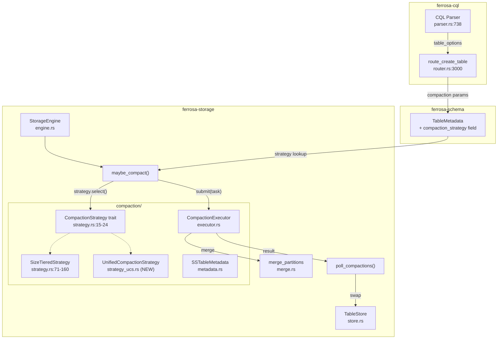

# UCS (Unified Compaction Strategy) — Architecture Spec

## Overview

UCS replaces Cassandra's three separate compaction strategies (STCS, LCS, TWCS) with a single, parameterized strategy that subsumes all three as special cases. Introduced in Cassandra 5.0 (CEP-26), UCS uses a density-based approach where SSTables are organized into levels by their density (data size per token range covered), and compaction decisions are based on the fan factor — the number of SSTables allowed at each level before triggering a merge.

Ferrosa currently implements STCS only (hardcoded in `engine.rs:1976`). This spec adds UCS as a pluggable `CompactionStrategy` implementation, with per-table strategy selection via DDL.

## Design Goals

1. **Subsume STCS/LCS/TWCS**: UCS with appropriate parameters should match the behavior of each legacy strategy
2. **Per-table configuration**: `CREATE TABLE ... WITH compaction = {'class': 'UnifiedCompactionStrategy', ...}`
3. **Zero disruption**: Existing STCS tables continue working; UCS is opt-in
4. **Cassandra 5.x DDL compatibility**: Accept Cassandra's UCS parameter names

## Key Concepts

### Density

An SSTable's **density** = `size_bytes / token_share`, where `token_share` is the fraction of the total token range the SSTable covers (`(max_token - min_token) / TOKEN_RANGE_SIZE`).

Density normalizes SSTable size by the token range it spans, making compaction decisions independent of partition count or key distribution.

### Levels (Buckets)

SSTables are grouped into levels by density:
- Level 0: density < base_density * fan_factor^0 (freshly flushed)
- Level 1: density < base_density * fan_factor^1
- Level N: density < base_density * fan_factor^N

Where `base_density` is derived from the flush SSTable size and `fan_factor` controls how aggressively levels compact.

### Fan Factor (W)

The maximum number of SSTables allowed at any level before triggering compaction:
- `W = 2`: aggressive (like LCS) — low space amplification, high write amplification
- `W = 4`: balanced (default)
- `W = T` (large): lazy (like STCS) — low write amplification, high space amplification

### Shards

UCS can optionally split the token range into shards (power-of-2 count). Each shard runs compaction independently, enabling parallelism. For ferrosa's initial implementation, sharding is deferred (shard_count = 1).

## Component Architecture



## Data Flow

1. **DDL**: `CREATE TABLE t WITH compaction = {'class': 'UnifiedCompactionStrategy', 'fan_factor': '4'}` → parser produces `table_options` → router persists into `TableMetadata.compaction_params`
2. **Flush trigger**: `maybe_compact(table_id)` → reads `table_meta.compaction_params` → instantiates appropriate strategy → `strategy.select(sstables)` → `Vec<CompactionTask>`
3. **Execution**: Same as today — `CompactionExecutor.execute_task()` is strategy-agnostic
4. **Integration**: Same as today — `poll_compactions()` handles S3 upload, manifest update, etc.

## New/Modified Components

### 1. `strategy_ucs.rs` (NEW)

```rust
pub struct UcsConfig {
    pub fan_factor: u32,           // W — default 4
    pub min_sstable_size: u64,     // Minimum SSTable size for density calc (bytes)
    pub base_shard_count: u32,     // Number of shards (power of 2, default 1)
    pub max_levels: u32,           // Safety cap on level count (default 32)
    pub output_dir: PathBuf,
}

pub struct UnifiedCompactionStrategy {
    config: UcsConfig,
}

impl CompactionStrategy for UnifiedCompactionStrategy {
    fn select(&self, sstables: &[SSTableMetadata], schema: &TableSchema, table_id: &TableId)
        -> Vec<CompactionTask>;
}
```

**Algorithm**:
1. Compute density for each SSTable: `size_bytes / max(token_share, epsilon)`
2. Assign each SSTable to a level based on density thresholds
3. For each level with > `fan_factor` SSTables, emit a `CompactionTask` merging the excess
4. Prefer compacting lower levels first (smaller, faster)

### 2. `SSTableMetadata` (MODIFIED)

Add token range fields that are currently placeholder zeros:
- `min_token: i64` — must be populated from SSTable data
- `max_token: i64` — must be populated from SSTable data
- `size_bytes: u64` — must be populated (currently 0)

### 3. `TableMetadata` in ferrosa-schema (MODIFIED)

Add compaction parameters:
```rust
pub struct TableMetadata {
    // ... existing fields ...
    pub compaction_params: HashMap<String, String>,
}
```

### 4. `route_create_table` in router.rs (MODIFIED)

Persist `s.table_options` into `TableMetadata.compaction_params` instead of discarding them.

### 5. `maybe_compact` in engine.rs (MODIFIED)

Strategy selection based on table metadata:
```rust
fn maybe_compact(&self, table_id: &TableId, state: &TableState) {
    let metadata = self.collect_sstable_metadata(table_id, state);
    let strategy = self.strategy_for_table(state);  // NEW: dispatch
    let tasks = strategy.select(&metadata, &state.schema, table_id);
    // ... submit tasks ...
}

fn strategy_for_table(&self, state: &TableState) -> Box<dyn CompactionStrategy> {
    let params = &state.table_meta.compaction_params;
    match params.get("class").map(|s| s.as_str()) {
        Some(c) if c.contains("Unified") || c.contains("UCS") => {
            Box::new(UnifiedCompactionStrategy::new(UcsConfig::from_params(params)))
        }
        _ => Box::new(SizeTieredStrategy::new(self.config.compaction.clone()))
    }
}
```

## UCS Parameter Mapping

| Cassandra UCS Param | Ferrosa Config | Default | Effect |
|---------------------|---------------|---------|--------|
| `fan_factor` / `w` | `UcsConfig.fan_factor` | 4 | SSTables per level before merge |
| `min_sstable_size` | `UcsConfig.min_sstable_size` | 100 MiB | Floor for density calculation |
| `base_shard_count` | `UcsConfig.base_shard_count` | 1 | Parallelism (deferred) |
| `max_space_overhead` | Derived from fan_factor | - | Not separate param |

### Strategy Equivalences

| Legacy Strategy | UCS Equivalent |
|----------------|---------------|
| STCS (size-tiered) | `fan_factor = T` (large, e.g. 32) |
| LCS (leveled) | `fan_factor = 2` |
| TWCS (time-window) | UCS + TTL-aware level assignment (phase 2) |

## Constraints

- **Token range required**: UCS needs accurate `min_token`/`max_token` in `SSTableMetadata`. Currently these are 0 — must be populated from SSTable partition index or decorated key scanning.
- **Size required**: `size_bytes` must be populated (currently 0 placeholder).
- **Backward compatible**: Tables without explicit compaction params default to STCS.
- **No sharding initially**: `base_shard_count = 1` until token-aware compaction is needed.

## Non-Goals (This Iteration)

- TWCS time-window semantics (requires TTL-aware level assignment)
- Shard-aware compaction (requires token range splitting)
- Concurrent compaction (multiple executor threads)
- Compaction throttling / rate limiting
- ALTER TABLE ... WITH compaction (schema evolution)
