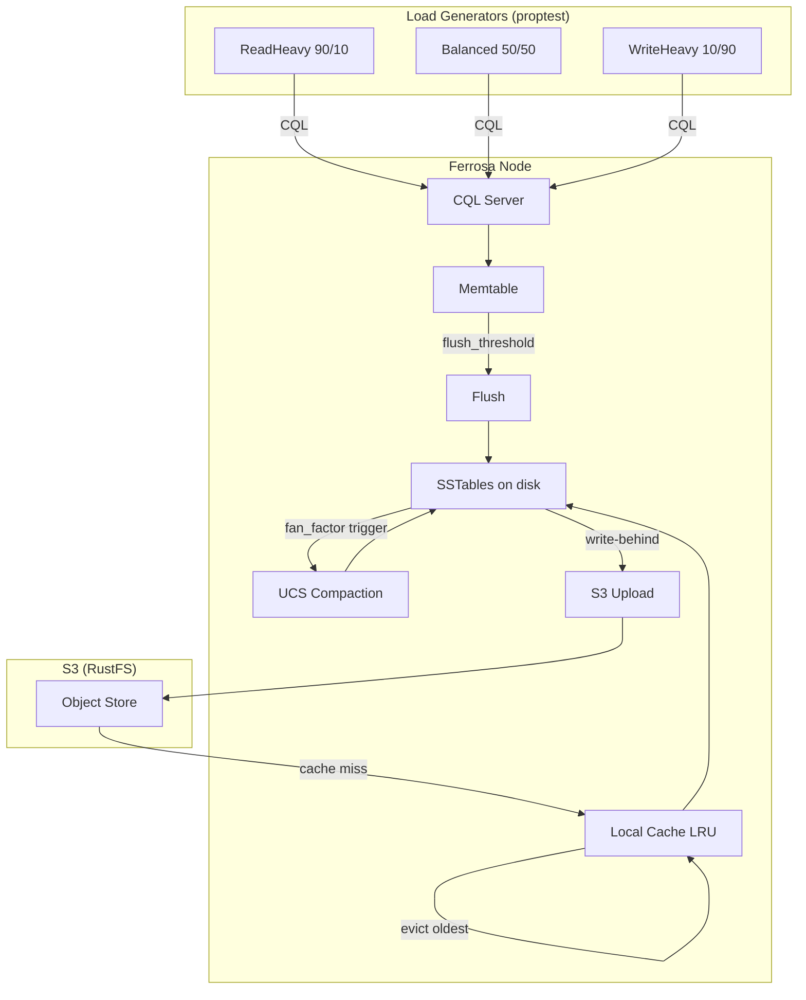

# UCS End-to-End Load Testing — Architecture Spec

> Property-based load generators that verify data integrity, compaction correctness,
> and S3 read-back under sustained load exceeding local disk capacity.
>
> Last updated: 2026-04-01

## Overview

Three load profiles exercise the full write → flush → compact → S3 upload → evict → S3 read-back pipeline. Each profile uses proptest to generate random key/value distributions, operation mixes, and timing patterns. Periodic integrity checks verify zero data loss and zero corruption throughout.



## Design Decisions

### DD-1: In-Process vs Container Tests

In-process `StorageEngine` tests for unit-level load (fast iteration, no network overhead). Docker Compose with S3-compatible object store (RustFS in CI, works with RustFS or AWS S3) for full S3 pipeline tests. Both share the same workload generators.

### DD-2: Small Local Cache Forces S3 Read-Back

Set `local_cache_max_bytes` to 10-50 MB while generating 200+ MB of data. This guarantees LRU eviction and S3 read-back during the read phase. The test *must* observe at least one S3 GET to pass.

### DD-3: Low Flush Threshold Accelerates Compaction

Set `flush_threshold_bytes` to 64 KB - 256 KB so flushes trigger frequently, producing many small SSTables that trigger UCS compaction at fan_factor boundaries.

### DD-4: Proptest for Reproducibility

All randomness flows through proptest strategies. A failing seed can be replayed deterministically. This matters because data loss bugs are often timing-dependent.

### DD-5: Integrity Check via Manifest + Full Scan

After each load phase, perform a full-table scan comparing against an in-memory "ground truth" HashMap. Every key written must be readable with the latest value. Missing keys = data loss. Wrong values = corruption.

## Components

### 1. LoadProfile Configuration

```rust
pub struct LoadProfile {
    pub name: String,
    pub read_ratio: f64,           // 0.0 - 1.0
    pub write_ratio: f64,          // 0.0 - 1.0 (read + write = 1.0)
    pub key_space_size: usize,     // number of distinct keys
    pub value_size_range: (usize, usize),  // min..max bytes
    pub num_writers: usize,        // concurrent writer threads
    pub num_readers: usize,        // concurrent reader threads
    pub duration: Duration,        // how long to run
    pub flush_threshold_bytes: u64,
    pub local_cache_max_bytes: u64,
    pub target_data_size_bytes: u64, // total data to write
    pub fan_factor: u32,           // UCS fan factor
}
```

Predefined profiles:
- `read_heavy()`: 90% read / 10% write, 100K keys, 4 writers / 16 readers
- `balanced()`: 50% read / 50% write, 50K keys, 8 writers / 8 readers
- `write_heavy()`: 10% read / 90% write, 200K keys, 16 writers / 4 readers

### 2. Proptest Strategies

```rust
// Key generator: alphanumeric keys with controlled distribution
fn key_strategy(key_space: usize) -> impl Strategy<Value = String> {
    (0..key_space).prop_map(|i| format!("k{:08}", i))
}

// Value generator: random bytes in size range
fn value_strategy(min: usize, max: usize) -> impl Strategy<Value = Vec<u8>> {
    prop::collection::vec(any::<u8>(), min..=max)
}

// Operation generator: read or write based on ratio
fn operation_strategy(read_ratio: f64) -> impl Strategy<Value = OpType> {
    prop::bool::weighted(read_ratio)
        .prop_map(|is_read| if is_read { OpType::Read } else { OpType::Write })
}
```

### 3. Ground Truth Tracker

```rust
pub struct GroundTruth {
    // Latest value written for each key, protected by sharded locks
    shards: Vec<Mutex<HashMap<String, (Vec<u8>, i64)>>>,  // key → (value, timestamp)
    writes: AtomicU64,
    reads: AtomicU64,
    read_hits: AtomicU64,
    read_misses: AtomicU64,
}
```

- On write: update shard with key → (value, timestamp)
- On read: compare result against expected; increment hit/miss counters
- Thread-safe via 64-shard design (same as ferrosa memtable)

### 4. Stats Collector

```rust
pub struct LoadStats {
    pub total_writes: u64,
    pub total_reads: u64,
    pub write_errors: u64,
    pub read_errors: u64,
    pub data_mismatches: u64,       // corruption detected
    pub missing_keys: u64,          // data loss detected
    pub elapsed: Duration,
    pub writes_per_sec: f64,
    pub reads_per_sec: f64,
    pub bytes_written: u64,
    pub compaction_tasks_completed: u64,
    pub s3_uploads: u64,
    pub s3_reads: u64,              // cache misses → S3 fetches
    pub sstable_count_final: u64,
    pub snapshots: Vec<StatsSnapshot>,  // periodic samples
}

pub struct StatsSnapshot {
    pub timestamp: Instant,
    pub writes: u64,
    pub reads: u64,
    pub writes_per_sec: f64,
    pub reads_per_sec: f64,
    pub memtable_size: u64,
    pub sstable_count: u64,
    pub cache_size_bytes: u64,
}
```

### 5. Integrity Verifier

```rust
pub struct IntegrityVerifier;

impl IntegrityVerifier {
    /// Full-table scan: every key in ground truth must be readable
    /// with the correct latest value. Reports missing keys and mismatches.
    pub async fn verify_all(
        engine: &StorageEngine,
        table_id: &TableId,
        ground_truth: &GroundTruth,
    ) -> IntegrityReport;
    
    /// Spot-check: random sample of N keys for faster periodic checks.
    pub async fn verify_sample(
        engine: &StorageEngine,
        table_id: &TableId,
        ground_truth: &GroundTruth,
        sample_size: usize,
    ) -> IntegrityReport;
}

pub struct IntegrityReport {
    pub keys_checked: u64,
    pub keys_ok: u64,
    pub missing_keys: Vec<String>,
    pub mismatched_keys: Vec<(String, String)>,  // (key, description)
    pub elapsed: Duration,
}
```

### 6. Test Orchestrator

```rust
pub async fn run_load_test(profile: &LoadProfile, engine: &StorageEngine) -> LoadStats {
    // 1. Create table with UCS compaction
    // 2. Spawn writer tasks (profile.num_writers)
    // 3. Spawn reader tasks (profile.num_readers)
    // 4. Spawn stats collector (every 5s: snapshot stats)
    // 5. Spawn integrity checker (every 30s: spot-check 1000 keys)
    // 6. Run for profile.duration
    // 7. Stop all tasks
    // 8. Final full integrity verification
    // 9. Collect and return stats
}
```

## Data Flow Under Load

### Write-Heavy Profile (worst case for compaction)

```
Time    | Memtable | SSTables | Compaction | S3 Objects | Cache
--------|----------|----------|------------|------------|------
0s      | 0 KB     | 0        | 0          | 0          | 0 KB
5s      | 256 KB   | 4        | 0          | 0          | 1 MB
15s     | 128 KB   | 12       | 2 tasks    | 8          | 5 MB
30s     | 192 KB   | 8        | 5 tasks    | 20         | 10 MB (evicting)
60s     | 64 KB    | 6        | 12 tasks   | 40         | 10 MB (steady)
120s    | 128 KB   | 5        | 25 tasks   | 60         | 10 MB (steady)
```

At steady state with 10 MB cache and 200+ MB total data, most reads hit S3.

## Invariants (must hold at all times)

1. **No data loss**: Every key written must be readable after flush
2. **Last-write-wins**: Reading a key returns the value with the highest timestamp
3. **Compaction preserves data**: SSTable count may decrease but all keys survive
4. **S3 round-trip fidelity**: Data read from S3 matches what was written
5. **Cache coherence**: Evicted entries readable from S3; cache never serves stale data
6. **Monotonic progress**: `s3_uploads` counter never decreases; `sstable_count` fluctuates but data volume only grows

## File Layout

```
ferrosa-storage/
  tests/
    ucs_load_test.rs         — Test entry points (3 profiles + edge cases)
  src/
    load/
      mod.rs                 — Module root, re-exports
      profile.rs             — LoadProfile struct + predefined profiles
      generator.rs           — Proptest strategies for keys/values/ops
      ground_truth.rs        — Thread-safe ground truth tracker
      stats.rs               — Stats collection and reporting
      integrity.rs           — Integrity verification (full scan + sample)
      orchestrator.rs        — Test orchestrator (spawn, run, collect)
```

## Metrics Reported

After each test run, print a summary:

```
=== UCS Load Test: write_heavy ===
Duration:           120s
Writers/Readers:    16 / 4
Total writes:       1,234,567      (10,288 writes/s)
Total reads:        135,790        (1,132 reads/s)
Bytes written:      524,288,000    (500 MB)
Write errors:       0
Read errors:        0
Data mismatches:    0
Missing keys:       0
Compaction tasks:   47
S3 uploads:         89
S3 reads (misses):  12,345
Final SSTable count: 6
Integrity: PASS (200,000 keys verified)
```
