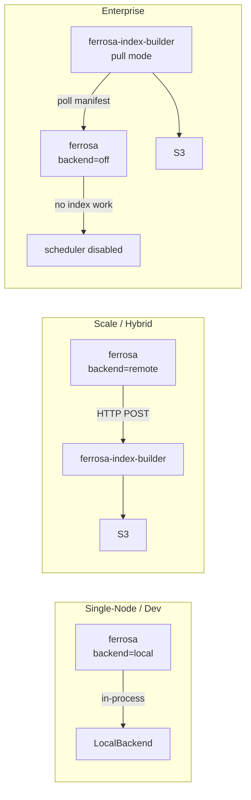
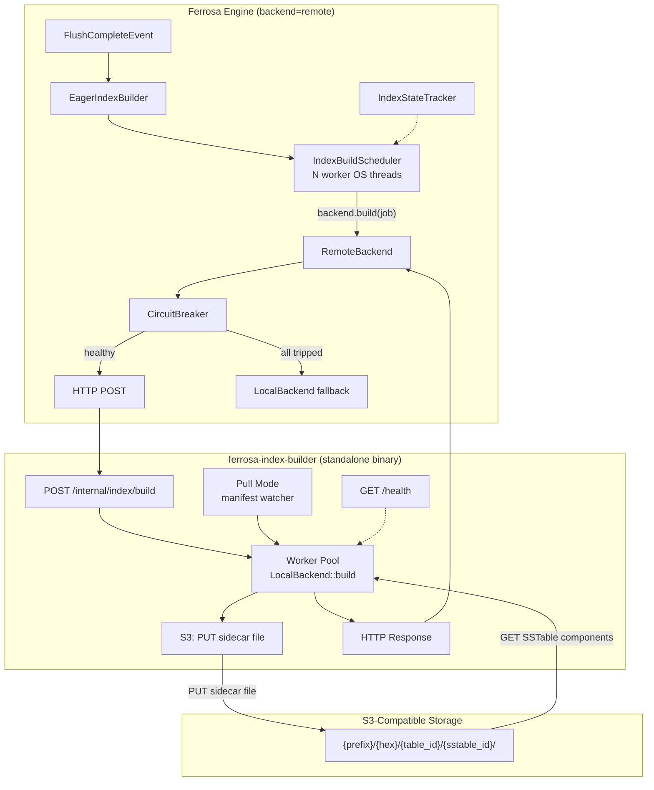
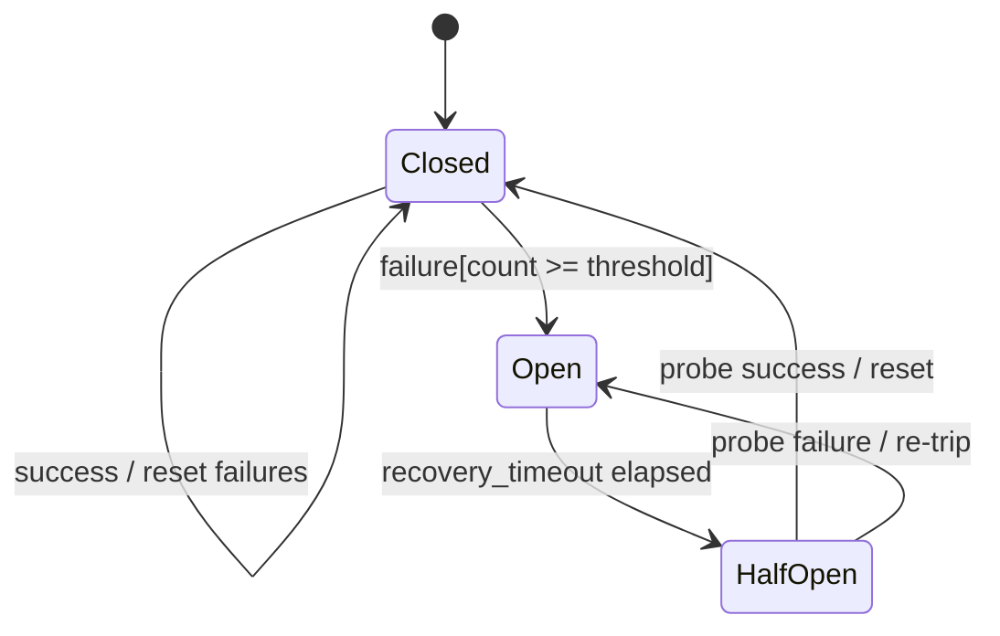
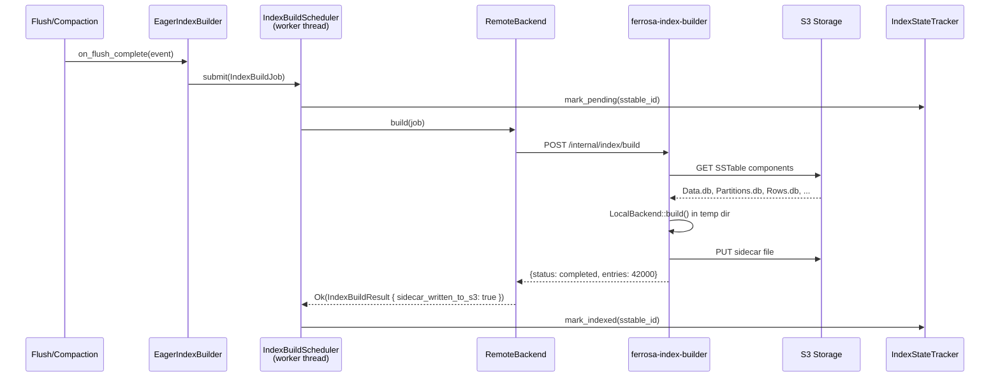
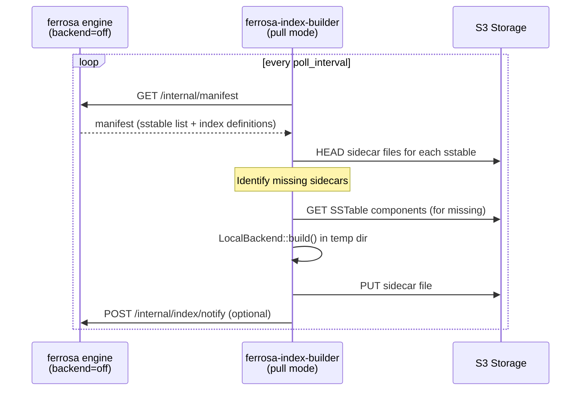
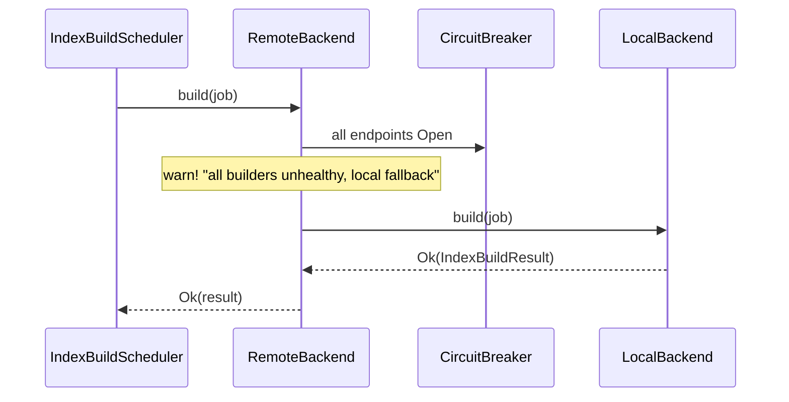

# Remote Index Build Backend

> Last updated: 2026-04-09
> Status: Draft
> Source: [specs/todo/todo-remote-index-build-backend.md](todo/todo-remote-index-build-backend.md)

## Overview

Decouple index building from the main Ferrosa read/write hot path. Two changes:

1. **`ferrosa-index-builder`** — a new standalone binary that runs `LocalBackend` index-build logic as an HTTP service, reading SSTables from S3 and writing sidecar files back to S3.
1. **Engine backend modes** — the main `ferrosa` binary gains a config toggle (`backend = "local" | "remote" | "off"`) that controls whether it builds indexes in-process, delegates to the standalone builder, or disables index building entirely.

In scale/enterprise deployments, the engine runs with `backend = "off"` or `backend = "remote"`, dedicating all CPU to the read/write hot path. One or more `ferrosa-index-builder` instances handle index construction independently, scaling horizontally.

---

## Deployment Modes



| Mode | Engine behavior | Index builder | Use case |
|------|----------------|---------------|----------|
| `local` | In-process `LocalBackend`, 2 worker threads (current default) | Not needed | Dev, single-node, small clusters |
| `remote` | `RemoteBackend` sends jobs via HTTP to builder, circuit breaker fallback to local | Required — receives push jobs | Scale tier, mixed workloads |
| `off` | `IndexBuildScheduler` not started, no worker threads, no `EagerIndexBuilder` hook | Required — pull mode, discovers work via manifest/S3 | Enterprise tier, dedicated hot-path serving |

---

## Architecture



---

## Component 1: `ferrosa-index-builder` Binary

### Crate Structure

New workspace member following the `ferrosa-loadgen` pattern:

```text
ferrosa-index-builder/
  Cargo.toml          # depends on ferrosa-storage, ferrosa-sstable, ferrosa-index, ferrosa-common
  src/
    main.rs           # CLI entry point, config, server startup
    lib.rs            # library root for integration testing
    server.rs         # HTTP server (axum or actix-web)
    worker.rs         # Worker pool wrapping LocalBackend
    pull.rs           # Pull-mode manifest watcher (enterprise)
```

**Dependencies**: `ferrosa-storage` (for `LocalBackend`, `SidecarWriter`, `ObjectStoreConfig`), `ferrosa-sstable` (SSTable reading), `ferrosa-index` (index types), `ferrosa-common` (shared types), `axum` (HTTP server), `tokio`, `object_store`, `serde`/`serde_json`, `tracing`.

### Operation Modes

The binary supports two modes, selectable at startup:

**Push mode** (default): Listens for HTTP requests from the engine's `RemoteBackend`. Stateless — the engine decides what to build and when.

```bash
ferrosa-index-builder \
  --listen 0.0.0.0:8090 \
  --workers 4 \
  --s3-endpoint https://s3.us-east-1.amazonaws.com \
  --s3-bucket ferrosa-data \
  --s3-prefix prod
```

**Pull mode**: Watches the engine's manifest for new SSTables that lack sidecar index files. Discovers work independently — no HTTP calls from the engine needed. Used with `backend = "off"`.

```bash
ferrosa-index-builder \
  --mode pull \
  --manifest-endpoint http://ferrosa-node:9042/internal/manifest \
  --poll-interval 10s \
  --workers 4 \
  --s3-endpoint https://s3.us-east-1.amazonaws.com \
  --s3-bucket ferrosa-data \
  --s3-prefix prod
```

### HTTP API

**Build request** (push mode):

```text
POST /internal/index/build
Content-Type: application/json

{
  "sstable_id": "gen-42",
  "index_name": "idx_email",
  "index_type": "btree",
  "s3_endpoint": "https://s3.us-east-1.amazonaws.com",
  "s3_bucket": "ferrosa-data",
  "s3_prefix": "prod/a7/ks.users/gen-42",
  "table": ["ks", "users"],
  "column_position": 2,
  "priority": "high"
}
```

**Response (success)**:

```text
HTTP/1.1 200 OK
Content-Type: application/json

{
  "status": "completed",
  "sidecar_s3_path": "prod/a7/ks.users/gen-42/gen-42-idx_email.sidecar",
  "entries_built": 42000,
  "elapsed_ms": 1200
}
```

**Response (failure)**:

```text
HTTP/1.1 200 OK
Content-Type: application/json

{
  "status": "failed",
  "error": "SSTable Data.db not found at s3://ferrosa-data/prod/a7/ks.users/gen-42/Data.db"
}
```

**Health endpoint**:

```text
GET /health

{
  "status": "ok",
  "workers_active": 2,
  "workers_total": 4,
  "jobs_completed": 1542,
  "jobs_failed": 3
}
```

**Design note**: HTTP-level errors (5xx, timeouts, connection refused) are transient. Application-level failures (`status: "failed"`) are permanent — the engine records them in `IndexStateTracker::mark_failed()` without retry.

### Worker Pool

The builder runs a bounded worker pool on OS threads (same pattern as the engine's `IndexBuildScheduler`):

```rust
struct WorkerPool {
    task_tx: mpsc::Sender<BuildRequest>,
    workers: Vec<JoinHandle<()>>,
    stop_flag: Arc<AtomicBool>,
}
```

Each worker:

1. Receives a `BuildRequest` from the channel
1. Downloads SSTable components from S3 to a temp directory
1. Runs `LocalBackend::build()` on the downloaded files
1. Writes sidecar file back to S3 via `object_store` PUT
1. Cleans up temp files
1. Returns result to the HTTP handler via `oneshot` channel

The temp directory is bounded by `--max-temp-bytes` (default 10 GiB) to prevent disk exhaustion.

### Pull Mode: Manifest Watcher

For `backend = "off"` deployments, the builder discovers unindexed SSTables independently:

1. Poll the engine's manifest endpoint (`GET /internal/manifest`) at `--poll-interval`
1. For each SSTable in the manifest, check S3 for the expected sidecar file
1. If missing, enqueue a build job into the worker pool
1. After building, optionally notify the engine via `POST /internal/index/notify` so the `IndexStateTracker` updates immediately (otherwise the engine discovers the sidecar on next read)

The manifest endpoint is a lightweight addition to the engine's existing internal HTTP server.

---

## Component 2: Engine Backend Modes

### Configuration

```text
[index_build]
backend = "local"                           # "local" | "remote" | "off"

# remote mode settings
# sidecar_endpoints = ["http://builder-1:8090", "http://builder-2:8090"]
# sidecar_timeout_ms = 30000
# sidecar_max_retries = 2
# circuit_breaker_threshold = 5
# circuit_breaker_recovery_ms = 60000
```

Environment variable overrides (12-factor):

```text
FERROSA_INDEX_BACKEND=remote
FERROSA_INDEX_SIDECAR_ENDPOINTS=http://builder-1:8090,http://builder-2:8090
FERROSA_INDEX_SIDECAR_TIMEOUT_MS=30000
```

### Engine Initialization Changes

Currently in `engine.rs`, the scheduler is unconditionally created with `LocalBackend`:

```rust
// CURRENT (hardcoded)
let backend = Arc::new(LocalBackend::new(config.data_dir.clone()));
let index_scheduler = Some(
    IndexBuildScheduler::with_backend_and_data_dir(2, tracker, backend, data_dir)
);
```

**After**:

```rust
let index_scheduler = match config.index_backend {
    IndexBackend::Local => {
        let backend = Arc::new(LocalBackend::new(config.data_dir.clone()));
        Some(IndexBuildScheduler::with_backend_and_data_dir(
            2, tracker, backend, config.data_dir.clone(),
        ))
    }
    IndexBackend::Remote { ref endpoints, .. } => {
        let backend = Arc::new(RemoteBackend::new(
            endpoints.clone(),
            S3PathResolver::from_config(&config.s3),
            config.index_remote_opts.clone(),
            LocalBackend::new(config.data_dir.clone()), // fallback
        ));
        Some(IndexBuildScheduler::with_backend_and_data_dir(
            2, tracker, backend, config.data_dir.clone(),
        ))
    }
    IndexBackend::Off => None, // no scheduler, no worker threads
};
```

When `index_scheduler` is `None`:
- `EagerIndexBuilder` is not created — flush/compaction hooks are no-ops
- No index worker threads are spawned — zero CPU overhead
- `IndexStateTracker` still exists (read-only, for query planning)
- Sidecar files are discovered from S3 on read by the existing `SidecarReader`

### `IndexBackend` Config Enum

```rust
pub enum IndexBackend {
    /// Build indexes in-process (default).
    Local,
    /// Delegate to external ferrosa-index-builder via HTTP.
    Remote {
        endpoints: Vec<String>,
        timeout: Duration,
        max_retries: u32,
        circuit_breaker_threshold: u32,
        circuit_breaker_recovery: Duration,
    },
    /// Disable index building entirely. External builder handles it.
    Off,
}
```

---

## Component 3: `RemoteBackend`

- **Purpose**: `IndexBuildBackend` implementation that delegates builds to `ferrosa-index-builder` over HTTP
- **Location**: `ferrosa-storage/src/index/remote_backend.rs`
- **Dependencies**: `ureq` (blocking HTTP client), `S3PathResolver`

```rust
pub struct RemoteBackend {
    endpoints: Vec<Endpoint>,
    s3_resolver: S3PathResolver,
    timeout: Duration,
    max_retries: u32,
    circuit_breakers: Vec<CircuitBreaker>,
    local_fallback: LocalBackend,
}
```

**Key constraint**: `IndexBuildBackend::build()` is a synchronous trait method that runs on dedicated OS threads (same as `CompactionExecutor`). `RemoteBackend` uses a blocking HTTP client (`ureq`), not async. Safe because the index-builder threads are dedicated and don't share a tokio runtime.

### `S3PathResolver`

Shared helper extracted from `UploadManager` to resolve `(table_id, sstable_id)` -> S3 prefix:

```rust
/// Format: `{prefix}/{hex_prefix}/{table_id}/{sstable_id}/`
/// where `hex_prefix` = first 2 hex chars of hash(sstable_id).
pub fn resolve_s3_prefix(prefix: &str, table_id: &str, sstable_id: &str) -> String;
```

Matches the existing path layout at `upload/manager.rs:107`.

### Circuit Breaker

Per-endpoint consecutive-failure counter with half-open probe:



When **all** endpoints are open, `RemoteBackend::build()` falls back to `self.local_fallback.build(job)` and logs `tracing::warn!` + increments `ferrosa_index_build_local_fallback_total`.

---

## `IndexBuildResult` Changes

Add a flag so the scheduler knows sidecar files were written to S3 by the backend (skip local `SidecarWriter::write()`):

```rust
pub struct IndexBuildResult {
    pub sstable_id: String,
    pub sidecar_entries: HashMap<String, Vec<(IndexKey, RowPosition)>>,
    pub build_duration: Duration,
    /// If true, sidecar files were written to S3 by the backend.
    /// The scheduler skips local SidecarWriter::write().
    pub sidecar_written_to_s3: bool,
}
```

---

## Data Flow

### Push Mode (backend=remote)



### Pull Mode (backend=off)



### Fallback (backend=remote, all builders down)



---

## Key Decisions

### ADR-RIB-01: Standalone binary, not library-only

**Decision**: `ferrosa-index-builder` is a first-class binary in the workspace, not just code embedded in the dbaas-vector-gateway.

**Rationale**: The index builder is useful independent of the DBaaS layer. Open-source users running ferrosa directly can scale index builds without ferrosa-dbaas. The binary reuses `ferrosa-storage`'s `LocalBackend` directly — no code duplication.

### ADR-RIB-02: Three backend modes, not two

**Decision**: `local`, `remote`, and `off` — not just local/remote with a fallback.

**Rationale**: `off` mode means zero index-build overhead in the engine — no scheduler threads, no `EagerIndexBuilder` hook, no channel. This is what enterprise customers want: the engine is a pure read/write server. `remote` mode still has lightweight overhead (HTTP POST per flush) which is acceptable for scale tier but unnecessary when a pull-based builder handles everything.

### ADR-RIB-03: Pull mode via manifest polling

**Decision**: In `off` mode, the builder discovers unindexed SSTables by polling the engine's manifest, not by watching S3 events.

**Rationale**:
- S3 event notifications (SNS/SQS) add AWS-specific coupling and operational complexity
- The manifest already knows which SSTables exist and which indexes are declared
- Polling interval is configurable (default 10s) — latency is acceptable for background index builds
- The engine exposes a single read-only `GET /internal/manifest` endpoint (minimal surface area)

### ADR-RIB-04: Sidecar writes directly to S3

**Decision**: The builder writes sidecar files to S3 at the same prefix as the SSTable, not back through the engine.

**Rationale**: Avoids round-tripping potentially large files. The engine discovers sidecars via `SidecarReader` on the read path. In `remote` mode, the `sidecar_written_to_s3` flag tells the scheduler to skip local writes.

### ADR-RIB-05: Blocking HTTP client in RemoteBackend

**Decision**: Use `ureq` (blocking HTTP) in `RemoteBackend::build()`.

**Rationale**: The `IndexBuildBackend` trait is synchronous, running on dedicated OS threads with a blocking mpsc channel (`scheduler.rs:186`). Blocking HTTP matches this. No tokio runtime needed.

### ADR-RIB-06: Fallback is visible and logged

**Decision**: `remote` mode fallback to `LocalBackend` logs `tracing::warn!` and increments a counter. `off` mode has no fallback — builds simply don't happen in the engine.

**Rationale**: Per safety rules (Fail Loud, Never Fake), fallbacks must be observable. In `off` mode there is no fallback by design — the operator chose to fully externalize index building.

---

## Error Handling

| Scenario | `remote` mode | `off` mode |
|----------|--------------|------------|
| Connection refused | Retry, circuit breaker, fallback to local | N/A (engine doesn't build) |
| HTTP 5xx / timeout | Retry, circuit breaker, fallback to local | N/A |
| `status: "failed"` | Permanent `mark_failed()` | Builder logs error, retries on next poll |
| All builders down | Fall back to `LocalBackend`, warn | Indexes go stale until builder recovers |
| Builder crash mid-build | Timeout on engine side, retry | Temp files cleaned up on restart |

---

## Observability

### Engine Metrics

| Metric | Type | Labels |
|--------|------|--------|
| `ferrosa_index_build_remote_total` | counter | `endpoint`, `status` |
| `ferrosa_index_build_remote_duration_seconds` | histogram | `endpoint`, `index_type` |
| `ferrosa_index_build_local_fallback_total` | counter | |
| `ferrosa_index_build_circuit_breaker_state` | gauge | `endpoint` (0=closed, 1=open, 2=half-open) |
| `ferrosa_index_build_backend_mode` | gauge | (0=local, 1=remote, 2=off) |

### Builder Metrics

| Metric | Type | Labels |
|--------|------|--------|
| `ferrosa_builder_jobs_total` | counter | `index_type`, `status` |
| `ferrosa_builder_job_duration_seconds` | histogram | `index_type` |
| `ferrosa_builder_s3_download_bytes` | counter | |
| `ferrosa_builder_s3_upload_bytes` | counter | |
| `ferrosa_builder_workers_active` | gauge | |
| `ferrosa_builder_temp_disk_bytes` | gauge | |

---

## File Changes Summary

### Existing Crates

| File | Change |
|------|--------|
| `ferrosa-storage/src/index/remote_backend.rs` | **New** — `RemoteBackend`, `S3PathResolver`, `CircuitBreaker` |
| `ferrosa-storage/src/index/mod.rs` | Add `pub mod remote_backend;` export |
| `ferrosa-storage/src/index/scheduler.rs` | Add `sidecar_written_to_s3` to `IndexBuildResult` |
| `ferrosa-storage/src/engine.rs` | Conditional scheduler init based on `IndexBackend` mode |
| `ferrosa-storage/src/upload/manager.rs` | Extract `hex_prefix_for()` to shared `S3PathResolver` |
| `ferrosa-storage/Cargo.toml` | Add `ureq` dependency |
| `Cargo.toml` (workspace) | Add `ferrosa-index-builder` to members |

### New Crate

| File | Purpose |
|------|---------|
| `ferrosa-index-builder/Cargo.toml` | Crate manifest — depends on ferrosa-storage, ferrosa-sstable, ferrosa-index, ferrosa-common |
| `ferrosa-index-builder/src/main.rs` | CLI entry: parse args, start server or pull-mode watcher |
| `ferrosa-index-builder/src/lib.rs` | Library root for integration tests |
| `ferrosa-index-builder/src/server.rs` | HTTP server: `/internal/index/build`, `/health` |
| `ferrosa-index-builder/src/worker.rs` | Bounded worker pool wrapping `LocalBackend` with temp dir management |
| `ferrosa-index-builder/src/pull.rs` | Pull-mode manifest watcher for `backend=off` deployments |

---

## Test Strategy

1. **Unit tests** (`remote_backend.rs`):
   - `RemoteBackend::build()` with mock HTTP server returning success/failure
   - Circuit breaker state transitions: closed -> open -> half-open -> closed
   - Fallback to `LocalBackend` when all endpoints tripped
   - S3 path resolution matches `UploadManager` format

1. **Builder unit tests** (`ferrosa-index-builder`):
   - Worker pool processes jobs and writes to in-memory `ObjectStore`
   - HTTP API returns correct responses for success/failure/health
   - Pull mode identifies missing sidecars from manifest

1. **Engine config tests**:
   - `backend = "local"`: scheduler created with `LocalBackend`
   - `backend = "remote"`: scheduler created with `RemoteBackend`
   - `backend = "off"`: no scheduler, no worker threads, flush hooks are no-ops

1. **Integration test** (requires `FERROSA_TEST_CONTAINERS=1`):
   - Start MinIO + `ferrosa-index-builder` in push mode
   - Write SSTable, upload to MinIO, POST build request
   - Verify sidecar file at correct S3 path
   - End-to-end: engine flush -> remote build -> query uses sidecar

1. **Existing test preservation**:
   - All `IndexBuildScheduler` tests pass unchanged (use `StubBackend`)
   - `LocalBackend` tests pass unchanged
   - No regression in local-only build performance

---

## Open Questions

- [ ] **mTLS**: Plain HTTP on internal network for v1, mTLS as follow-up?
- [ ] **Pull mode manifest format**: Expose full manifest or a lightweight "unindexed SSTables" view?
- [ ] **Multi-index batch**: Build all indexes for one SSTable per request, or one index per request?
- [ ] **Builder auto-scaling**: Static fleet or integrate with container orchestrator for scale-to-zero?
- [ ] **Index notification in off mode**: Should the builder notify the engine when a sidecar is ready, or let the engine discover it lazily on next read?

---

## Related Specs

- [secondary-index-pipeline.md](secondary-index-pipeline.md) — Current index pipeline architecture
- [fulltext-index-architecture.md](fulltext-index-architecture.md) — Full-text index build details
- [todo/todo-remote-index-build-backend.md](todo/todo-remote-index-build-backend.md) — Originating work item
