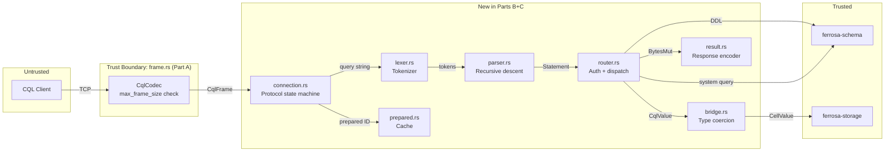

# CQL Parts B+C Threat Model

> Last updated: 2026-03-12
> Status: Approved
> Methodology: STRIDE (focused)
> Scope: ferrosa-cql Parts B (parser + execution) and C (prepared cache + system queries)

## Attack Surface

Parts B+C add 7 new files that process untrusted input from CQL clients:



## Existing Defenses (Part A)

| Defense | Location | Effect |
|---------|----------|--------|
| Frame size limit | `CqlCodec::decode()` | Rejects frames > `max_frame_size` (default 256 MiB) |
| Connection limit | `CqlServer::start_background()` | Returns Overloaded error at `max_connections` (default 1024) |
| Auth attempt limit | `auth.rs::MAX_AUTH_ATTEMPTS` | 3 attempts per connection |
| Error isolation | `CqlError` enum | All error paths produce well-formed ERROR frames, never leak internals |

## Threat Inventory

### T1: Parser DoS via pathological input

| Field | Value |
|-------|-------|
| **STRIDE** | Denial of Service |
| **Component** | `lexer.rs`, `parser.rs` |
| **Threat** | Attacker sends deeply nested collection literals `[[[[...]]]]`, deeply nested type names `frozen<map<text, list<set<...>>>>`, or extremely long queries that cause stack overflow or excessive CPU. |
| **Likelihood** | 3 — trivially crafted |
| **Impact** | 2 — single connection CPU spike or stack overflow crashes the tokio task |
| **Risk** | 6 (High) |
| **Mitigation** | **M1**: Max query string length (default 1 MiB, configurable). Reject before parsing. **M2**: Max nesting depth in parser (default 32). Return SyntaxError on exceeding depth. **M3**: proptest fuzzing to verify no panics. |
| **Status** | Must implement |

### T2: Parser panic = task crash

| Field | Value |
|-------|-------|
| **STRIDE** | Denial of Service |
| **Component** | `lexer.rs`, `parser.rs` |
| **Threat** | Any `unwrap()`, `panic!()`, or unchecked index in the parser crashes the tokio task handling that connection. Repeated crashes exhaust the runtime. |
| **Likelihood** | 2 — requires finding a panic-triggering input |
| **Impact** | 2 — connection drops; repeated = degraded service |
| **Risk** | 4 (High) |
| **Mitigation** | **M3**: proptest with `\\PC{0,200}` — parser must never panic, only return `Err`. **M4**: No `unwrap()` on user-derived data in parser/lexer. Code review gate. |
| **Status** | Must implement |

### T3: Integer overflow in bridge type coercion

| Field | Value |
|-------|-------|
| **STRIDE** | Tampering |
| **Component** | `bridge.rs::term_to_cql_value()` |
| **Threat** | `IntegerLiteral(i64::MAX)` coerced to `CqlType::Int` (i32) wraps silently via `as i32`, storing wrong data. |
| **Likelihood** | 2 — easily triggered by any client |
| **Impact** | 2 — silent data corruption |
| **Risk** | 4 (High) |
| **Mitigation** | **M5**: Range-check all narrowing conversions. `i64` → `i32`: use `i32::try_from(n).map_err(...)`. Same for `i64` → `i16`, `i64` → `i8`, `f64` → `f32` (check for infinity/NaN after cast). Return `CqlError::Invalid("value out of range")`. |
| **Status** | Must implement |

### T4: OOM via large collection literals

| Field | Value |
|-------|-------|
| **STRIDE** | Denial of Service |
| **Component** | `parser.rs`, `bridge.rs` |
| **Threat** | Query contains `INSERT INTO t (k, v) VALUES (1, [1, 2, 3, ... 10_000_000])`. Parser allocates a `Vec<Term>` with millions of elements. Bridge then converts each, doubling memory. |
| **Likelihood** | 2 — frame size limit (256 MiB) constrains this, but 256 MiB of integer literals = ~30M elements |
| **Impact** | 2 — OOM kills process or causes severe GC pressure |
| **Risk** | 4 (High) |
| **Mitigation** | **M6**: Max collection elements in parser (default 65,536). Return SyntaxError. Combined with M1 (query length limit), this bounds total allocation. |
| **Status** | Must implement |

### T5: Auth bypass — queries before authentication

| Field | Value |
|-------|-------|
| **STRIDE** | Spoofing / Elevation of Privilege |
| **Component** | `connection.rs` |
| **Threat** | Client sends QUERY opcode without completing STARTUP + AUTH handshake. If connection handler doesn't enforce state machine ordering, queries execute unauthenticated. |
| **Likelihood** | 3 — trivially attempted |
| **Impact** | 3 — full unauthorized access to all data |
| **Risk** | 9 (Critical) |
| **Mitigation** | **M7**: Connection state machine with explicit phases: `AwaitingStartup → Authenticating → Ready`. Only QUERY/PREPARE/EXECUTE/BATCH allowed in `Ready`. All other opcodes in wrong state → ERROR(Protocol). |
| **Status** | Must implement |

### T6: Missing permission checks in router

| Field | Value |
|-------|-------|
| **STRIDE** | Elevation of Privilege |
| **Component** | `router.rs` |
| **Threat** | Router dispatches queries without calling `schema.check_permission()`. A low-privilege user reads/writes any table. |
| **Likelihood** | 2 — requires auth to be enabled (dev mode skips auth) |
| **Impact** | 3 — unauthorized data access |
| **Risk** | 6 (High) |
| **Mitigation** | **M8**: Every `route_*` function calls `check_permission()` with the appropriate `Permission` and `Resource` before accessing storage or schema. Unit test: non-superuser role gets Unauthorized for tables it doesn't have access to. |
| **Status** | Must implement |

### T7: Prepared cache poisoning / exhaustion

| Field | Value |
|-------|-------|
| **STRIDE** | Denial of Service |
| **Component** | `prepared.rs` |
| **Threat** | Attacker sends millions of unique PREPARE requests, filling the cache with junk and evicting legitimate prepared statements. |
| **Likelihood** | 2 — requires authenticated connection |
| **Impact** | 1 — performance degradation, not data loss (cache miss → re-prepare) |
| **Risk** | 2 (Medium) |
| **Mitigation** | **M9**: Weight-based eviction (moka W-TinyLFU, already planned, default 10 MiB). Frequently-used statements survive eviction. No additional action needed beyond what's planned. |
| **Status** | Acceptable (existing design) |

### T8: Query result as information disclosure

| Field | Value |
|-------|-------|
| **STRIDE** | Information Disclosure |
| **Component** | `router.rs`, `result.rs` |
| **Threat** | Error messages leak internal details (file paths, stack traces, schema internals). |
| **Likelihood** | 2 — any query that fails |
| **Impact** | 1 — aids further attacks but no direct data breach |
| **Risk** | 2 (Medium) |
| **Mitigation** | **M10**: Error messages use CqlError variants — never include file paths, stack traces, or internal type names. ServerError wraps internal errors with generic message. Already designed this way. |
| **Status** | Acceptable (existing design) |

### T9: MD5 collision in prepared statement IDs

| Field | Value |
|-------|-------|
| **STRIDE** | Tampering |
| **Component** | `prepared.rs` |
| **Threat** | Two different queries produce the same MD5 hash. Client executes one and gets the other's plan. |
| **Likelihood** | 1 — MD5 collision requires ~2^64 work; protocol mandates MD5 |
| **Impact** | 2 — wrong query execution |
| **Risk** | 2 (Medium) |
| **Mitigation** | Protocol-mandated behavior (Cassandra uses same scheme). Accept risk. If collision detected at insert time, log a warning. |
| **Status** | Accept |

### T10: Slowloris — idle connection exhaustion

| Field | Value |
|-------|-------|
| **STRIDE** | Denial of Service |
| **Component** | `connection.rs`, `server.rs` |
| **Threat** | Attacker opens many connections and sends data very slowly, holding slots from the connection limit without completing queries. |
| **Likelihood** | 2 — well-known attack pattern |
| **Impact** | 2 — legitimate clients can't connect |
| **Risk** | 4 (High) |
| **Mitigation** | **M11**: Idle connection timeout (default 5 minutes). Connection handler drops if no complete frame received within timeout. Also serves as keepalive detection. |
| **Status** | Must implement |

### T11: Batch bomb — large batch as amplification

| Field | Value |
|-------|-------|
| **STRIDE** | Denial of Service |
| **Component** | `router.rs` |
| **Threat** | Attacker sends BATCH with thousands of statements, each doing a storage write. Single frame triggers massive I/O. |
| **Likelihood** | 2 — requires authenticated connection |
| **Impact** | 2 — storage I/O saturation |
| **Risk** | 4 (High) |
| **Mitigation** | **M12**: Max batch statements (default 500, matches Cassandra's `batch_size_warn_threshold`). Return Invalid error if exceeded. |
| **Status** | Must implement |

## Risk Summary

| ID | Threat | Risk | Mitigation | When |
|----|--------|------|------------|------|
| T1 | Parser DoS (nesting/length) | 6 High | M1 + M2 | Task 2-3 (lexer/parser) |
| T2 | Parser panic | 4 High | M3 + M4 | Task 3 (parser) |
| T3 | Integer overflow in bridge | 4 High | M5 | Task 5 (bridge) |
| T4 | OOM via collection literals | 4 High | M6 + M1 | Task 3 (parser) |
| T5 | Auth bypass | 9 Critical | M7 | Task 9 (connection) |
| T6 | Missing permission checks | 6 High | M8 | Task 8 (router) |
| T7 | Cache exhaustion | 2 Medium | M9 (existing) | Task 7 |
| T8 | Error info leak | 2 Medium | M10 (existing) | All tasks |
| T9 | MD5 collision | 2 Medium | Accept | — |
| T10 | Idle connection exhaustion | 4 High | M11 | Task 9 (connection) |
| T11 | Batch bomb | 4 High | M12 | Task 8 (router) |

## Mitigations to Bake Into Implementation

These are concrete constants/checks that must be present in the implementation:

```rust
// In connection.rs or a shared config
pub const MAX_QUERY_LENGTH: usize = 1_048_576;   // M1: 1 MiB
pub const MAX_NESTING_DEPTH: usize = 32;          // M2: parser recursion
pub const MAX_COLLECTION_ELEMENTS: usize = 65_536; // M6: per collection
pub const MAX_BATCH_STATEMENTS: usize = 500;       // M12: per batch
pub const IDLE_TIMEOUT_SECS: u64 = 300;            // M11: 5 minutes

// Connection state machine (M7)
enum ConnectionPhase {
    AwaitingStartup,
    Authenticating { attempts: u32 },
    Ready,
}
```

### Per-task checklist

| Task | Required Mitigations |
|------|---------------------|
| Task 2 (Lexer) | M1: reject query > MAX_QUERY_LENGTH before lexing |
| Task 3 (Parser) | M2: depth counter, M3: proptest, M4: no unwrap on user data, M6: collection element limit |
| Task 5 (Bridge) | M5: range-checked narrowing conversions |
| Task 8 (Router) | M8: permission checks in every route_*, M12: batch size limit |
| Task 9 (Connection) | M7: connection state machine, M11: idle timeout |

## Assumptions

1. Network-level defenses (VPC, security groups, NLB) limit who can reach port 9042
1. TLS termination is a separate concern (not in scope for Parts B+C)
1. `ferrosa-schema` auth and RBAC are correctly implemented (threat-modeled separately)
1. `ferrosa-storage` write path is safe against oversized writes (frame size limit constrains input)

## Open Questions

1. Should MAX_QUERY_LENGTH be per-statement or per-frame? (Per-frame is already enforced by CqlCodec at 256 MiB; per-statement is the parser-level check)
1. Rate limiting per connection (max queries/sec) — defer to Part D or implement now? **Decision: defer**
