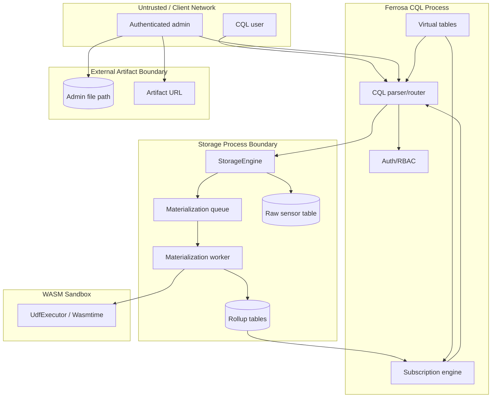

# Threat Model — RRD Materialized Rollups and WASM Time-Series UDFs

> Last updated: 2026-05-20
> Status: Draft STRIDE analysis

## Scope

This model covers:

- CQL table extensions that enable materialized time-series rollups.
- Async materialization queues and virtual table observability.
- `SUBSCRIBE SELECT ... DELTA` over rollup tables and materialization status.
- WASM UDF loading from inline hex, admin-only files, and admin-only URLs.
- WASM UDF execution in SELECT projections, rollup functions, and
  `WHERE ... ALLOW FILTERING` predicates.

## Data Flow

## Assets

| Asset | Type | Impact if compromised |
| ----- | ---- | --------------------- |
| Raw sensor readings | Integrity/availability | Bad rollups, missed anomaly detection |
| Materialized rollups | Integrity/availability | Incorrect dashboards, bad alert decisions |
| Materialization queue | Integrity/availability | Silent lag or dropped aggregates |
| UDF WASM bytes | Integrity | Arbitrary user logic changes analytic output |
| UDF sandbox limits | Availability/security | CPU or memory exhaustion |
| Admin artifact credentials | Confidentiality | Artifact repository compromise |
| Virtual table state | Integrity | Operators miss lag/backlog alerts |
| Subscription streams | Confidentiality/integrity | Data leakage or stale event delivery |

## Threat Inventory

| ID | STRIDE | Threat | Risk | Mitigation |
| -- | ------ | ------ | ---- | ---------- |
| T1 | Tampering | Non-admin creates/replaces WASM UDF used by rollups | Critical | Admin-only UDF loading; function-level audit log; DDL permissions |
| T2 | Tampering | URL artifact changes between review and DDL apply | Critical | Require SHA-256 in `AS URL`; store bytes/hash; disallow hashless URL loading |
| T3 | Spoofing | Attacker points `AS URL` at untrusted internal endpoint | High | URL allowlist/artifact provider config; TLS verification; redirect limits |
| T4 | DoS | WASM UDF burns CPU or memory during rollup | Critical | Wasmtime fuel/epoch/memory limits; per-function concurrency limits; queue backpressure |
| T5 | Tampering | Late data rewrites rollups outside expected correction window | High | Enforce `late_window`; stale/drop counters; audit of correction tasks |
| T6 | Repudiation | Admin denies UDF replacement that changed sensor analytics | High | Audit table entries include actor, signature, hash, source form, timestamp |
| T7 | Information Disclosure | Virtual queue tables leak tenant/table names or lag details | Medium | Apply auth filtering and system table permissions |
| T8 | DoS | Materialization queue falls behind silently | Critical | Virtual queue tables, lag thresholds, subscribe/alert hooks |
| T9 | Tampering | Executor cache uses wrong overload for same function name | High | Key executor by `(keyspace, name, arg_types, hash)` |
| T10 | Availability | Restart/follower lacks compiled UDF for replicated metadata | High | Recompile from schema after startup, DDL apply, and snapshot install |
| T11 | Tampering | UDF predicate in WHERE returns non-boolean or nondeterministic result | Medium | Restrict WHERE UDFs to deterministic scalar functions with boolean return |
| T12 | Information Disclosure | Subscription stream exposes rollups without table permissions | High | Re-check SELECT permissions for SUBSCRIBE setup and stream delivery |

## Security Requirements

- UDF creation, replacement, drop, file import, and URL import require
  administrator privileges.
- Query-time UDF execution requires `EXECUTE` permission on the function
  resource.
- URL imports require expected SHA-256, TLS verification, redirect limits, size
  limits, and an allowlist or configured artifact provider.
- Replicated schema must contain deterministic bytes/hash, not local file paths
  or mutable URLs.
- Virtual materialization tables must be permission-checked like other
  observability tables.
- Queue lag and stale-data drops must be externally observable through virtual
  tables and subscription streams.

## Open Questions

- Should UDF bytes be visible in `system_schema.functions` to admins only, or
  should public system tables expose hash and size but redact body?
- Should rollup correction events be stored as audit rows for every late-window
  recomputation?
- What URL artifact provider configuration should be supported first:
  static allowlist, S3/object-store provider, or HTTPS-only host allowlist?
