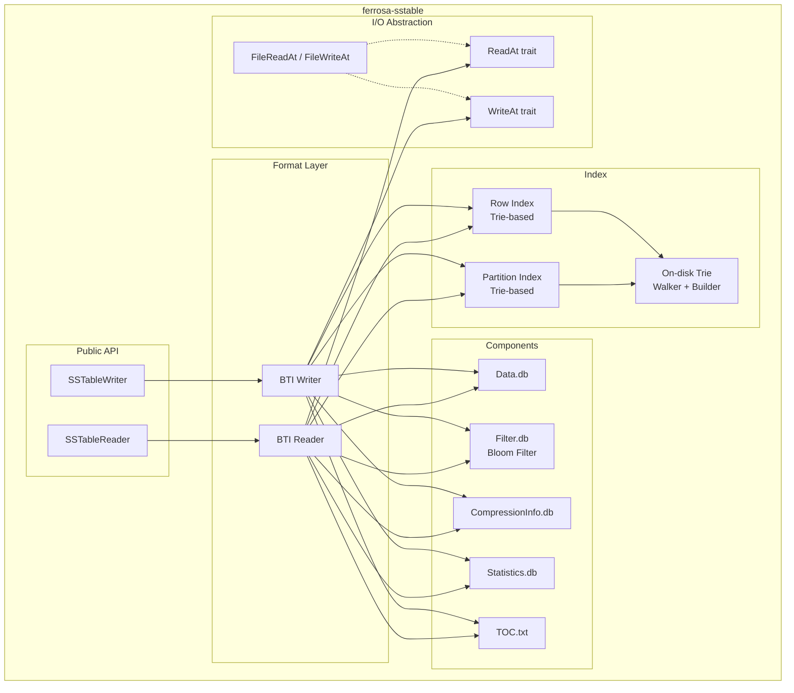

# SSTable Format Specification

> Last updated: 2026-03-11
> Status: Approved

## Overview

`ferrosa-sstable` is the second crate in the Ferrosa build order. It reads and writes Cassandra-compatible SSTable files, providing the on-disk data layer for the storage engine.

The initial implementation targets the **BTI (Big Trie-Indexed)** format — Cassandra 5.x's default — for both reading and writing. Big format reading is deferred to a later phase (see [ADR-004](decisions/004-layered-sstable.md)).

## Design Decisions

| Decision | Choice | Rationale |
|----------|--------|-----------|
| Initial format | BTI only | Modern, trie-based, good Rust fit. Big format deferred. |
| I/O abstraction | `ReadAt`/`WriteAt` traits | Decouple from filesystem vs S3; file-system impl here, S3 in ferrosa-storage |
| Trie implementation | Built from Cassandra BtiFormat.md spec | Exact binary compatibility required |
| Compression | LZ4 + Zstd | LZ4 for speed (default), Zstd for ratio. Snappy/Deflate post-1.0 |
| Bloom filter | Cassandra-compatible double-hashing | Uses both Murmur3 h1 and h2 from ferrosa-common |
| Test fixtures | Generated from Cassandra submodule | Binary-exact oracle for round-trip verification |

## Dependencies

```
ferrosa-sstable
├── ferrosa-common  (Token, DecoratedKey, CellValue, Murmur3, Error)
├── lz4_flex        (LZ4 compression)
└── zstd            (Zstd compression)
```

No async runtime dependency. All I/O goes through the abstract `ReadAt`/`WriteAt` traits, which are synchronous. Async wrappers (for S3) live in ferrosa-storage.

## Architecture



## I/O Traits

The crate defines two traits for positional I/O, decoupling SSTable logic from the backing store:

```rust
/// Positional read — read bytes at an offset without seeking.
pub trait ReadAt {
    fn read_at(&self, buf: &mut [u8], offset: u64) -> Result<usize>;
    fn len(&self) -> Result<u64>;
}

/// Positional write — write bytes at an offset.
pub trait WriteAt {
    fn write_at(&mut self, buf: &[u8], offset: u64) -> Result<usize>;
    fn flush(&mut self) -> Result<()>;
}
```

`ferrosa-sstable` provides `FileReadAt` and `FileWriteAt` implementations backed by `std::fs::File` with `pread`/`pwrite` on Unix. The S3 implementation (`S3ReadAt`) lives in `ferrosa-storage`, which depends on this crate.

## BTI SSTable Components

A BTI SSTable consists of these files, identified by a generation number:

| Component | File Suffix | Purpose |
|-----------|-------------|---------|
| Data | `-Data.db` | Serialized partition data (keys + cells) |
| Partition Index | `-Partitions.db` | Trie mapping partition key prefixes to data/row-index positions |
| Row Index | `-Rows.db` | Per-partition trie mapping clustering key separators to data offsets |
| Bloom Filter | `-Filter.db` | Probabilistic membership test using Murmur3 double-hashing |
| Compression Info | `-CompressionInfo.db` | Chunk offsets and sizes for compressed data blocks |
| Statistics | `-Statistics.db` | Min/max tokens, row count, column stats, tombstone stats |
| TOC | `-TOC.txt` | List of component files (one filename per line) |

### Data File (Data.db)

The data file stores serialized partitions in token order. Each partition contains:

1. **Partition header**: serialized partition key, deletion info
2. **Rows**: ordered by clustering key, each containing cells
3. **Partition footer**: end-of-partition marker

Data is stored in compressed chunks (default 64KB uncompressed). The compression info file maps chunk index to file offset and compressed size.

### Partition Index (Partitions.db)

An on-disk trie mapping byte-ordered partition key **prefixes** (not full keys) to positions in the data or row index file. The trie stores only the shortest unique prefix that distinguishes each key from its neighbors, reducing the structure to approximately 2n nodes for n keys.

**File layout** (written bottom-up):

```
[trie nodes in 4096-byte pages]
...
[final page including root node, ≤4096 bytes]
[smallest key, short-length-prefixed]
[largest key, short-length-prefixed]
[file offset of serialized key bounds above, i64]
[key count, i64]
[root node position, i64]
```

The footer (last 3 `i64` values) is read first to locate the root, key bounds, and count.

**Payload encoding**: The 4 payload bits (`pb`) in each node's type byte determine the payload format:

- If `pb` == 0: no payload (non-leaf node)
- If `pb` < 8: `idxpos` is a sign-extended integer of `pb` bytes at `ppos`
- If `pb` >= 8: `hash` is the byte at `ppos` (lowest-order byte of the key's Murmur3 hash), then `idxpos` is a sign-extended integer of `pb - 7` bytes at `ppos + 1`

The `hash` byte enables early rejection of false-positive trie matches without reading the data file. In Cassandra 5.x, `pb` >= 8 is always used (hash is always stored).

**Position interpretation**: `idxpos` specifies either:

- If `idxpos` >= 0: position in the row index file containing the partition's row index
- If `idxpos` < 0: `!idxpos` (bitwise NOT) gives a direct position in the data file (for partitions small enough to skip the row index)

In either case, the content at the target position starts with the serialized partition key, which must be compared to confirm a true match.

### Row Index (Rows.db)

Per-partition tries mapping clustering key **separators** to data file offsets within the partition. Separators are the shortest byte sequence greater than the last key of the previous block and less-than-or-equal to the first key of the next block.

Row index blocks have a configurable granularity (default 16KB of data). Small partitions (single row or below granularity threshold) skip the row index entirely — the partition index points directly to the data file.

**Per-partition layout** (padded to page boundary):

```
[trie nodes in 4096-byte pages]
...
[final page including root node]
[partition key, short-length-prefixed]
[data file position of partition, unsigned varint]
[root node position, signed varint-encoded as (root_pos - metadata_pos)]
[row index block count, unsigned varint32]
[partition deletion time, variable: 1 byte if live, 12 bytes if non-live]
```

The root node position is stored as a signed delta relative to `metadata_pos`, which is the current write position in Rows.db at the start of this metadata section (immediately after the partition key). Since the trie is written before the metadata, the root is earlier in the file, so this delta is always negative. On read: `root_pos = varint_value + metadata_pos`.

The partition deletion time uses Cassandra 5.x's variable-length `DeletionTime` encoding: if the partition has no deletion, a single `0x80` byte (LIVE marker); otherwise 8 bytes for the `markedForDeleteAt` timestamp (with sign bit clear) followed by 4 bytes for the unsigned local deletion time.

The partition index entry points to the start of the partition key serialization.

**Row index trie payload**: Each leaf in the row index trie carries:

- If `pb & 7` > 0: an integer of `pb & 7` bytes specifying the byte offset within the partition where the relevant row block starts
- If `pb` >= 8: additionally, a serialized `DeletionTime` for the open deletion active at the start of that row index block. This flag is only set when the deletion is non-live, so the deletion time is always 12 bytes (8-byte timestamp + 4-byte local deletion time) when present. This is needed for correctly merging data from multiple SSTables.

### Bloom Filter (Filter.db)

Cassandra-compatible Bloom filter using double-hashing with Murmur3.

**Hash functions**: `h_i(key) = h1 + i * h2` where `(h1, h2)` come from `murmur3::hash3_x64_128` (via `DecoratedKey::filter_hash()` in ferrosa-common). The number of hash functions `k` and bit count `m` are determined by the target false-positive rate (default 1%) and expected key count.

**File format** (new format, Cassandra 5.x):

| Field | Type | Description |
|-------|------|-------------|
| Hash count | i32 | Number of hash functions `k` |
| Word count | i32 | Number of i64 words in the bit array (`m / 64`) |
| Bit array | bytes | `word_count * 8` bytes, raw byte order (NOT big-endian word-swapped) |

Note: Cassandra's new format writes the bit array as raw bytes (via `OffHeapBitSet.serialize`). The old format wrote big-endian i64 words with byte-swapped ordering; Ferrosa only needs to support the new format for BTI SSTables.

### Compression Info (CompressionInfo.db)

Maps compressed data chunks to their file positions. Cassandra stores chunk offsets only — compressed sizes are derived from consecutive offsets (and the compressed file length for the last chunk).

**File format**:

| Field | Type | Description |
|-------|------|-------------|
| Compressor name | Java UTF-8 | 2-byte big-endian length prefix + modified UTF-8 bytes (e.g., `"LZ4"`, `"ZstdCompressor"`) |
| Option count | i32 | Number of key-value option pairs |
| Options | (UTF-8, UTF-8)[] | Key-value pairs for compressor options |
| Chunk length | i32 | Uncompressed chunk size (default 65536) |
| Max compressed size | i32 | Maximum compressed chunk size (always present in BTI format) |
| Data length | i64 | Uncompressed data length |
| Chunk count | i32 | Number of compressed chunks |
| Chunk offsets | i64[chunk_count] | File offset of each compressed chunk in Data.db |

The compressed size of chunk `i` is `offsets[i+1] - offsets[i]` for all but the last chunk, which extends to the end of the compressed data.

**Supported algorithms**:

- **LZ4** (`lz4_flex` crate): Default. Fast compression/decompression, moderate ratio.
- **Zstd** (`zstd` crate): Better compression ratio, slightly slower.
- **Snappy, Deflate**: Deferred to post-1.0. Reader returns `Error::UnsupportedCompression`.

### Statistics (Statistics.db)

SSTable-level metadata used for query optimization and compaction decisions:

- Min/max partition token (for range queries and compaction overlap detection)
- Row count, column count estimates
- Min/max timestamps, min/max TTL, min/max local deletion time
- Compression ratio
- Tombstone histogram (for GC grace evaluation)
- Column-level min/max (for partition key restrictions)

### TOC (TOC.txt)

Plain text file listing all component filenames, one per line. Used to enumerate the SSTable's files for deletion, upload, or verification.

## On-Disk Trie Format

Both the partition index and row index use the same on-disk trie encoding, documented in Cassandra's `BtiFormat.md`. Ferrosa must produce and consume binary-identical trie structures.

### Node Types

Each node begins with a single byte: 4 bits of node type + 4 bits of payload info (`pb`).

| Type | Code | Description | Size (bytes, excl. payload) |
|------|------|-------------|----------------------------|
| `PAYLOAD_ONLY` | 0x0 | Leaf, no transitions | 1 |
| `SINGLE_NOPAYLOAD_4` | 0x1 | One child, 4-bit pointer, no payload | 2 |
| `SINGLE_8` | 0x2 | One child, 8-bit pointer | 3 |
| `SINGLE_NOPAYLOAD_12` | 0x3 | One child, 12-bit pointer, no payload | 3 |
| `SINGLE_16` | 0x4 | One child, 16-bit pointer | 4 |
| `SPARSE_8` | 0x5 | Multiple children, 8-bit pointers | 2 + CC\*2 |
| `SPARSE_12` | 0x6 | Multiple children, 12-bit pointers | 2 + (CC\*5+1)/2 |
| `SPARSE_16` | 0x7 | Multiple children, 16-bit pointers | 2 + CC\*3 |
| `SPARSE_24` | 0x8 | Multiple children, 24-bit pointers | 2 + CC\*4 |
| `SPARSE_40` | 0x9 | Multiple children, 40-bit pointers | 2 + CC\*6 |
| `DENSE_12` | 0xA | Range of children, 12-bit pointers | 3 + (CS\*3+1)/2 |
| `DENSE_16` | 0xB | Range of children, 16-bit pointers | 3 + CS\*2 |
| `DENSE_24` | 0xC | Range of children, 24-bit pointers | 3 + CS\*3 |
| `DENSE_32` | 0xD | Range of children, 32-bit pointers | 3 + CS\*4 |
| `DENSE_40` | 0xE | Range of children, 40-bit pointers | 3 + CS\*5 |
| `LONG_DENSE` | 0xF | Range of children, 64-bit pointers | 3 + CS\*8 |

CC = child count, CS = child span (max byte - min byte + 1). Size formulas for SPARSE_12 and DENSE_12 use integer division (matching Java's integer arithmetic).

### Key Properties

- **Pointers are distances**: stored as the offset from the current node position to the child. Since tries are written bottom-up, children always precede parents in the file.
- **Page-aligned**: no node crosses a 4096-byte page boundary. A reader at a node position can read the full node without a second page fetch.
- **Payload position**: computed from `pb` bits and node type. For SPARSE/DENSE, payload follows the transition data.
- **Smallest node type wins**: the builder chooses whichever encoding produces the smallest representation.

### Trie Builder (Bottom-Up, Page-Aware)

The trie is constructed incrementally from sorted input using bottom-up page-aware packing:

1. Keys are added in sorted order
2. When a branch is complete (next key diverges from it), the builder serializes it
3. Nodes accumulate until a branch exceeds 4096 bytes
4. At that point, child subtrees (each fitting in a page) are laid out and the parent continues accumulating
5. The root is the last node written; its position is recorded in the file footer

This matches Cassandra's `IncrementalDeepTrieWriterPageAware` algorithm.

## Public API

### Reading

```rust
/// Open an SSTable for reading from a directory.
pub struct SSTableReader<R: ReadAt> { /* ... */ }

impl<R: ReadAt> SSTableReader<R> {
    /// Open an SSTable given ReadAt handles for each component.
    pub fn open(components: SSTableComponents<R>) -> Result<Self>;

    /// Look up a partition by decorated key.
    /// Returns None if the partition doesn't exist in this SSTable.
    pub fn get_partition(&self, key: &DecoratedKey) -> Result<Option<Partition>>;

    /// Iterate all partitions in token order.
    pub fn partitions(&self) -> Result<PartitionIterator<'_, R>>;

    /// Iterate partitions within a token range.
    pub fn range(&self, start: Token, end: Token) -> Result<PartitionIterator<'_, R>>;

    /// SSTable-level statistics.
    pub fn statistics(&self) -> &SSTableStatistics;
}
```

### Writing

```rust
/// Write a new SSTable in BTI format.
pub struct SSTableWriter<W: WriteAt> { /* ... */ }

impl<W: WriteAt> SSTableWriter<W> {
    /// Create a writer for a new SSTable.
    pub fn new(components: SSTableComponents<W>, options: WriteOptions) -> Result<Self>;

    /// Add a partition (must be called in token order).
    pub fn add_partition(&mut self, key: &DecoratedKey, rows: &[Row]) -> Result<()>;

    /// Finalize the SSTable: write indices, filter, statistics, TOC.
    pub fn finish(self) -> Result<SSTableStatistics>;
}
```

### Types

```rust
/// Handles to all component files for an SSTable.
pub struct SSTableComponents<IO> {
    pub data: IO,
    pub partitions: IO,
    pub rows: IO,
    pub filter: IO,
    pub compression_info: IO,
    pub statistics: IO,
    pub toc: IO,
}

/// Configuration for SSTable writing.
pub struct WriteOptions {
    pub compression: Compression,
    pub bloom_fp_rate: f64,         // Default: 0.01
    pub chunk_size: usize,          // Default: 65536
    pub row_index_granularity: usize, // Default: 16384
}

pub enum Compression {
    None,
    Lz4,
    Zstd { level: i32 },
}
```

## Byte-Comparable Keys

The BTI partition index stores keys in their **byte-comparable** (byte-ordered) representation, not their raw serialization. For Murmur3-partitioned tables, the byte-comparable form starts with the token bytes, ensuring trie traversal follows token order.

Ferrosa must implement the byte-comparable encoding from `ByteComparable.java` (CASSANDRA-6936). For the initial implementation targeting Murmur3 partitioned tables, this is:

1. Token bytes (8 bytes, XOR with sign bit to make unsigned comparison correct)
2. Separator byte (0x00)
3. Raw partition key bytes
4. Terminator (0x00 0x00)

## Phasing

### Phase 1 (this spec)

- BTI format reader: all component files
- BTI format writer: all component files
- On-disk trie: walker (reader) and page-aware builder
- Bloom filter: read and write, Cassandra-compatible
- Compression: LZ4 and Zstd
- File-system `ReadAt`/`WriteAt` implementations
- Round-trip tests against Cassandra-generated fixtures

### Phase 2 (deferred)

- Big format reader (for migrating older Cassandra deployments)
- `ferrosa-sstable-dump` CLI tool
- `ferrosa-sstable-import` CLI tool

### Phase 3 (deferred, behind feature flag)

- Native Ferrosa SSTable format optimized for S3 access patterns
- Larger blocks, content-addressed, embedded metadata

## Testing Strategy

### Unit Tests

- Trie node encoding/decoding for all 16 node types
- Trie builder: construct from sorted keys, verify node layout
- Trie walker: lookup, floor, ceiling, range iteration
- Bloom filter: false positive rate within tolerance, compatibility with Cassandra-generated filters
- Compression round-trip for all supported algorithms
- Byte-comparable key encoding matches Cassandra

### Integration Tests (Cassandra Oracle)

Test fixtures are generated from the Cassandra submodule to verify binary compatibility:

1. **SSTable fixtures**: Use `cassandra/tools/bin/sstablewriter` or CQL to create SSTables with known data
2. **Read verification**: Ferrosa reads Cassandra-generated SSTables and produces identical query results
3. **Round-trip**: Write data with Ferrosa, read with Cassandra's `sstableutil` / `sstabledump`, compare

Fixture generation scripts live in `tools/` alongside the existing `generate_murmur3_vectors.java`.

### Property Tests

- Trie round-trip: arbitrary sorted key sets produce a trie that resolves every key correctly
- Compression round-trip: arbitrary byte sequences survive compress/decompress
- Bloom filter: no false negatives (inserted keys always found)

## Error Handling

Uses `ferrosa_common::Error` with these variants relevant to SSTable operations:

- `InvalidFormat` — file doesn't match expected SSTable structure
- `ChecksumMismatch` — data corruption detected
- `UnsupportedVersion` — SSTable version not supported
- `UnsupportedCompression` — compression algorithm not implemented (Snappy, Deflate pre-1.0)
- `Io` — underlying I/O failure

## Related Specs

- [Overview](overview.md) — system overview
- [Components](components.md) — crate architecture
- [Data Flow](data-flow.md) — SSTable lifecycle in S3
- [Testing](testing.md) — integration and performance testing
- [ADR-004](decisions/004-layered-sstable.md) — layered format strategy
