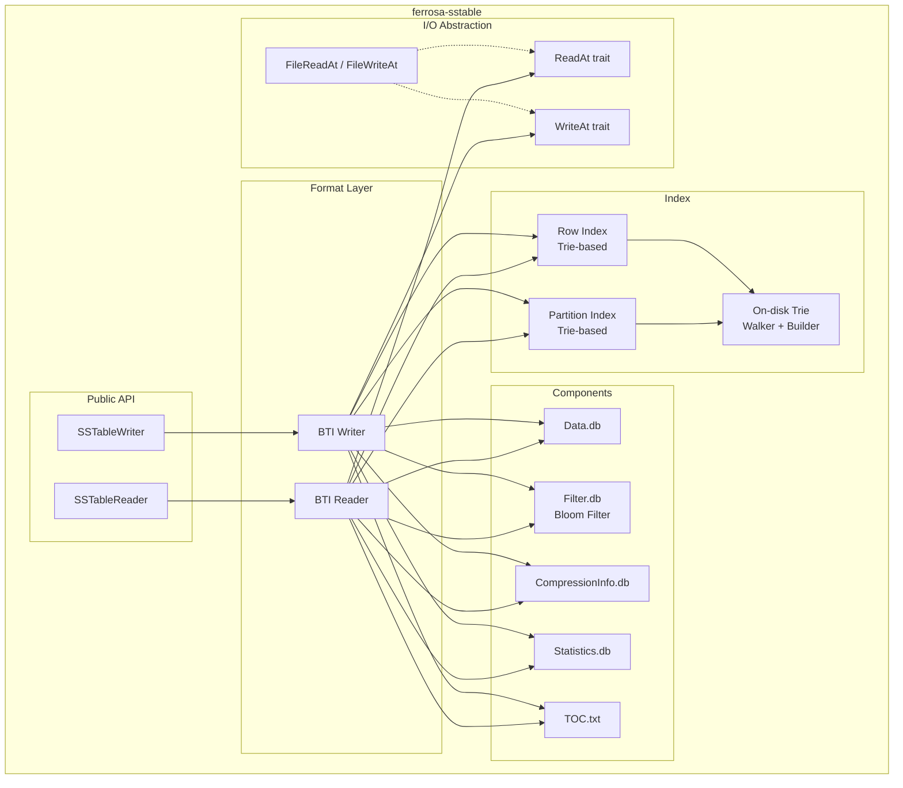

# SSTable Format Specification

> Last updated: 2026-03-22 (sign-bit fix, range tombstone skip, overflow fixes)
> Status: Approved

## Overview

`ferrosa-sstable` reads and writes Cassandra-compatible SSTable files, providing the on-disk data layer for the storage engine.

The initial implementation targets the **BTI (Big Trie-Indexed)** format — Cassandra 5.x's default — for both reading and writing. Big format reading is deferred to a later phase (see [ADR-004](decisions/004-layered-sstable.md)).

## Design Decisions

| Decision | Choice | Rationale |
|----------|--------|-----------|
| Initial format | BTI only | Modern, trie-based, good Rust fit. Big format deferred. |
| I/O abstraction | `ReadAt`/`WriteAt` traits | Decouple from filesystem vs S3; file-system impl here, S3 in ferrosa-storage |
| Trie implementation | Built from Cassandra BtiFormat.md spec | Exact binary compatibility required |
| Compression | LZ4 + Zstd | LZ4 for speed (default), Zstd for ratio. Snappy/Deflate post-1.0 |
| Bloom filter | Cassandra-compatible double-hashing | Uses both Murmur3 h1 and h2 from ferrosa-common |
| Test fixtures | Generated from Cassandra submodule | Binary-exact oracle for round-trip verification |

## Dependencies

```
ferrosa-sstable
├── ferrosa-common  (Token, DecoratedKey, CellValue, Murmur3, Error)
├── lz4_flex        (LZ4 compression)
├── zstd            (Zstd compression)
└── crc32fast       (CRC32 checksums for Statistics.db)
```

No async runtime dependency. All I/O goes through the abstract `ReadAt`/`WriteAt` traits, which are synchronous. Async wrappers (for S3) live in ferrosa-storage.

## Architecture



## I/O Traits

The crate defines two traits for positional I/O, decoupling SSTable logic from the backing store:

```rust
/// Positional read — read bytes at an offset without seeking.
pub trait ReadAt {
    fn read_at(&self, buf: &mut [u8], offset: u64) -> Result<usize>;
    fn len(&self) -> Result<u64>;
}

/// Positional write — write bytes at an offset.
pub trait WriteAt {
    fn write_at(&mut self, buf: &[u8], offset: u64) -> Result<usize>;
    fn flush(&mut self) -> Result<()>;
}
```

`ferrosa-sstable` provides `FileReadAt` and `FileWriteAt` implementations backed by `std::fs::File` with `pread`/`pwrite` on Unix. The S3 implementation (`S3ReadAt`) lives in `ferrosa-storage`, which depends on this crate.

## Common Encodings

Several encoding schemes are used across multiple SSTable components.

### Variable-Length Integers (VInt)

Cassandra uses a leading-ones prefix encoding (NOT protobuf-style). The number of leading 1-bits in the first byte indicates the number of extra bytes to read. Remaining bits in the first byte are the most-significant value bits, followed by subsequent bytes in big-endian order.

**Unsigned varint** (`unsigned_vint`):

| First byte pattern | Total bytes | Value bits in first byte | Max value |
|---|---|---|---|
| `0xxxxxxx` | 1 | 7 | 127 |
| `10xxxxxx` | 2 | 6 | 16,383 |
| `110xxxxx` | 3 | 5 | 2,097,151 |
| `1110xxxx` | 4 | 4 | 268,435,455 |
| `11110xxx` | 5 | 3 | 34,359,738,367 |
| `111110xx` | 6 | 2 | 4,398,046,511,103 |
| `1111110x` | 7 | 1 | 562,949,953,421,311 |
| `11111110` | 8 | 0 | 72,057,594,037,927,935 |
| `11111111` | 9 | 0 (8 raw bytes follow) | `i64::MAX` |

Decoding: `extra_bytes = count_leading_ones(first_byte)`. For 1–7 byte encodings (`extra_bytes` 0–6), mask first byte with `0xFF >> (extra_bytes + 1)` to get value bits. For 8-byte encoding (`extra_bytes` = 7, first byte `0xFE`), the first byte has no value bits — read 7 trailing bytes. For 9-byte encoding (`extra_bytes` = 8, first byte `0xFF`), the first byte has no value bits — read 8 trailing bytes. Read remaining bytes in big-endian order.

**Implementation note:** A naive `0xFF >> (extra_bytes + 1)` overflows when `extra_bytes >= 7` on an 8-bit type. Guard this with a range check (`extra_bytes <= 6`) or use a wider intermediate.

**Signed varint** (`signed_vint`): Standard zigzag encoding applied before unsigned encoding:

- Encode: `zigzag(n) = (n << 1) ^ (n >> 63)` (arithmetic shift)
- Decode: `unzigzag(n) = (n >>> 1) ^ -(n & 1)`

Mapping: `0 -> 0, -1 -> 1, 1 -> 2, -2 -> 3, 2 -> 4, ...`

**Unsigned varint32** (`unsigned_vint32`): Not a separate format. Uses the same unsigned varint encoding, narrowed to `u32` on read. Fields documented as `unsigned_vint32` will always contain values that fit in 32 bits.

**Examples** (unsigned):

| Value | Bytes |
|-------|-------|
| 0 | `0x00` |
| 127 | `0x7F` |
| 128 | `0x80 0x80` |
| 255 | `0x80 0xFF` |

Reference: `org.apache.cassandra.utils.vint.VIntCoding`

### Short-Length-Prefixed Encoding

A 2-byte big-endian unsigned length prefix followed by raw bytes. Maximum length: 65,535 bytes. Used for partition keys in the partition index footer, row index metadata, and Data.db partition headers.

```
[length: u16 big-endian] [bytes: length bytes]
```

Reference: `ByteBufferUtil.writeWithShortLength()`

### DeletionTime Encoding (BTI format)

Variable-length encoding used for partition-level and row-level deletions:

**If LIVE (no deletion):**

```
[0x80: 1 byte]
```

**If deleted:**

```
[markedForDeleteAt: i64 big-endian] [localDeletionTime: u32 big-endian]
```

Total: 12 bytes. The first byte's high bit (0x80) is always 0 for deleted entries because `markedForDeleteAt` is a positive timestamp.

### Delta Encoding (SerializationHeader)

Timestamps, local deletion times, and TTLs within Data.db are delta-encoded against minimums stored in the SerializationHeader (in Statistics.db):

- `encoded_timestamp = actual - header.minTimestamp` (written as `unsigned_vint`)
- `encoded_ldt = actual - header.minLocalDeletionTime` (written as `unsigned_vint32`)
- `encoded_ttl = actual - header.minTTL` (written as `unsigned_vint32`)

The `EncodingStats` epoch defaults (used when no data exists):

- `TIMESTAMP_EPOCH` = 1442880000000000 (Sept 22, 2015 00:00 UTC, microseconds)
- `DELETION_TIME_EPOCH` = 1442880000 (same date, seconds)
- `TTL_EPOCH` = 0

## BTI SSTable Components

A BTI SSTable consists of these files, identified by a generation number:

| Component | File Suffix | Purpose |
|-----------|-------------|---------|
| Data | `-Data.db` | Serialized partition data (keys + cells) |
| Partition Index | `-Partitions.db` | Trie mapping partition key prefixes to data/row-index positions |
| Row Index | `-Rows.db` | Per-partition trie mapping clustering key separators to data offsets |
| Bloom Filter | `-Filter.db` | Probabilistic membership test using Murmur3 double-hashing |
| Compression Info | `-CompressionInfo.db` | Chunk offsets and sizes for compressed data blocks |
| Statistics | `-Statistics.db` | Min/max tokens, row count, column stats, tombstone stats |
| TOC | `-TOC.txt` | List of component files (one filename per line) |

### Data File (Data.db)

The data file stores serialized partitions back-to-back in token order. There is no file-level header — the `SerializationHeader` (encoding stats, column definitions) is stored in Statistics.db.

Data is stored in compressed chunks (default 16KB uncompressed). Chunks are position-based — every N uncompressed bytes, regardless of partition boundaries. A partition can span multiple chunks, and a chunk can contain data from multiple partitions. The compression info file maps chunk index to file offset.

#### Partition Structure

```
partition :=
  [key_len: u16 big-endian] [key: key_len bytes]   // short-length-prefixed
  <partition_deletion>                               // DeletionTime: 1 or 12 bytes
  [<static_row>]                                     // only if table has static columns
  <unfiltered>*                                      // rows and range tombstone markers
  [0x01]                                             // END_OF_PARTITION
```

#### Unfiltered Flags Byte

Every row or marker starts with a flags byte:

| Bit | Mask | Name | Meaning |
|-----|------|------|---------|
| 0 | 0x01 | `END_OF_PARTITION` | End marker; nothing follows |
| 1 | 0x02 | `IS_MARKER` | Range tombstone marker (not a row) |
| 2 | 0x04 | `HAS_TIMESTAMP` | Row has primary key liveness timestamp |
| 3 | 0x08 | `HAS_TTL` | Row has TTL on primary key liveness |
| 4 | 0x10 | `HAS_DELETION` | Row has a row-level deletion |
| 5 | 0x20 | `HAS_ALL_COLUMNS` | Row contains all columns from the header |
| 6 | 0x40 | `HAS_COMPLEX_DELETION` | At least one complex column has a deletion |
| 7 | 0x80 | `EXTENSION_FLAG` | Extended flags byte follows |

**Extended flags byte** (if `EXTENSION_FLAG` set):

| Bit | Mask | Name | Meaning |
|-----|------|------|---------|
| 0 | 0x01 | `IS_STATIC` | Static row (no clustering key) |

#### Row Encoding

```
row :=
  [flags: u8] [ext_flags: u8 if EXTENSION_FLAG]
  [<clustering>]                                   // absent for static rows
  [row_size: unsigned_vint]                        // size of rest (for skipping)
  [prev_unfiltered_size: unsigned_vint]            // offset to previous unfiltered
  [timestamp: unsigned_vint if HAS_TIMESTAMP]      // delta from header.minTimestamp
  [ttl: unsigned_vint32 if HAS_TTL]                // delta from header.minTTL
  [local_deletion_time: unsigned_vint32 if HAS_TTL] // delta from header.minLocalDeletionTime
  [del_ts: unsigned_vint if HAS_DELETION]          // row deletion timestamp (delta)
  [del_ldt: unsigned_vint32 if HAS_DELETION]       // row deletion local time (delta)
  [<column_subset> if !HAS_ALL_COLUMNS]
  <column_data>*                                   // one per column in subset
```

`row_size` counts all bytes after itself (including `prev_unfiltered_size` and the row body).

#### Clustering Key Encoding

Clustering values are serialized in batches of up to 32. The number of clustering columns is known from the table schema (not written).

```
clustering :=
  for each batch of 32 values:
    [header: unsigned_vint]          // 2 bits per value
    [value_bytes]*                   // only for present (non-null, non-empty) values
```

Header bit pairs per value (at bit positions `i*2` and `i*2+1`):

- `00` = value is present (bytes follow)
- `01` = value is empty (zero-length, no bytes)
- `10` = value is null (no bytes)

Value bytes: fixed-length types write raw bytes (no prefix); variable-length types write `[length: unsigned_vint32] [bytes]`.

#### Column Subset Encoding

When `HAS_ALL_COLUMNS` is NOT set, the subset of columns present is encoded relative to the `SerializationHeader`'s column list:

**If fewer than 64 columns in the header:**

```
[bitmap: unsigned_vint]   // 1 bit per MISSING column (LSB first)
```

**If 64 or more columns:**

```
[missing_count: unsigned_vint32]
[indices]*                         // unsigned_vint32 each
```

If `actual_count < superset_count / 2`: indices of present columns. Otherwise: indices of missing columns.

#### Cell Encoding

```
cell :=
  [flags: u8]
  [timestamp: unsigned_vint if !USE_ROW_TIMESTAMP]         // delta
  [local_deletion_time: unsigned_vint32 if (DELETED|EXPIRING) & !USE_ROW_TTL]  // delta
  [ttl: unsigned_vint32 if EXPIRING & !USE_ROW_TTL]        // delta
  [path_len: unsigned_vint32, path: bytes if complex col]  // cell path (collections/UDTs)
  [value if !HAS_EMPTY_VALUE]                              // see below
```

**Cell flags byte:**

| Bit | Mask | Name | Meaning |
|-----|------|------|---------|
| 0 | 0x01 | `IS_DELETED` | Cell is a tombstone |
| 1 | 0x02 | `IS_EXPIRING` | Cell has TTL |
| 2 | 0x04 | `HAS_EMPTY_VALUE` | No value bytes (tombstones) |
| 3 | 0x08 | `USE_ROW_TIMESTAMP` | Timestamp same as row pk liveness (omitted) |
| 4 | 0x10 | `USE_ROW_TTL` | TTL/ldt same as row pk liveness (omitted) |

**Cell value encoding:** Fixed-length types (int=4, long=8, uuid=16, etc.) write raw bytes with no prefix. Variable-length types (text, blob, etc.) write `[length: unsigned_vint32] [bytes]`.

#### Complex Column Data

For non-frozen collections and UDTs:

```
complex_column :=
  [del_ts: unsigned_vint, del_ldt: unsigned_vint32 if HAS_COMPLEX_DELETION]
  [cell_count: unsigned_vint32]
  <cell>*
```

#### Range Tombstone Marker Encoding

When `IS_MARKER` (0x02) is set:

```
range_tombstone_marker :=
  [flags: 0x02]
  [kind: u8]                            // ClusteringPrefix.Kind ordinal
  [num_values: u16 big-endian]          // clustering value count
  <clustering_values>                   // same batch-of-32 format as rows
  [marker_size: unsigned_vint]
  [prev_unfiltered_size: unsigned_vint]
  <deletion_time(s)>                    // 1 for bound, 2 for boundary
```

Kind ordinals: `0=EXCL_END_BOUND`, `1=INCL_START_BOUND`, `2=EXCL_END_INCL_START_BOUNDARY`, `5=INCL_END_EXCL_START_BOUNDARY`, `6=INCL_END_BOUND`, `7=EXCL_START_BOUND`.

Deletion times are delta-encoded (unsigned_vint timestamp + unsigned_vint32 ldt). Boundary markers have two deletion times (end then start).

### Partition Index (Partitions.db)

An on-disk trie mapping byte-ordered partition key **prefixes** (not full keys) to positions in the data or row index file. The trie stores only the shortest unique prefix that distinguishes each key from its neighbors, reducing the structure to approximately 2n nodes for n keys.

**File layout** (written bottom-up):

```
[trie nodes in 4096-byte pages]
...
[final page including root node, ≤4096 bytes]
[smallest key, short-length-prefixed]
[largest key, short-length-prefixed]
[file offset of serialized key bounds above, i64]
[key count, i64]
[root node position, i64]
```

The footer (last 3 `i64` values) is read first to locate the root, key bounds, and count.

**Payload encoding**: The 4 payload bits (`pb`) in each node's type byte determine the payload format:

- If `pb` == 0: no payload (non-leaf node)
- If `pb` < 8: `idxpos` is a sign-extended integer of `pb` bytes at `ppos`
- If `pb` >= 8: `hash` is the byte at `ppos` (lowest-order byte of h2, the second 64-bit word from `murmur3_x64_128`), then `idxpos` is a sign-extended integer of `pb - 7` bytes at `ppos + 1`

The `hash` byte enables early rejection of false-positive trie matches without reading the data file. In Cassandra 5.x, `pb` >= 8 is always used (hash is always stored).

**Position interpretation**: `idxpos` specifies either:

- If `idxpos` >= 0: position in the row index file containing the partition's row index
- If `idxpos` < 0: `!idxpos` (bitwise NOT) gives a direct position in the data file (for partitions small enough to skip the row index)

In either case, the content at the target position starts with the serialized partition key, which must be compared to confirm a true match.

### Row Index (Rows.db)

Per-partition tries mapping clustering key **separators** to data file offsets within the partition. Separators are the shortest byte sequence greater than the last key of the previous block and less-than-or-equal to the first key of the next block.

Row index blocks have a configurable granularity (default 16KB of data). Small partitions (single row or below granularity threshold) skip the row index entirely — the partition index points directly to the data file.

**Per-partition layout** (padded to page boundary):

```
[trie nodes in 4096-byte pages]
...
[final page including root node]
[partition key, short-length-prefixed]
[data file position of partition, unsigned varint]
[root node position, signed varint-encoded as (root_pos - metadata_pos)]
[row index block count, unsigned varint32]
[partition deletion time, variable: 1 byte if live, 12 bytes if non-live]
```

The root node position is stored as a signed delta relative to `metadata_pos`, which is the current write position in Rows.db at the start of this metadata section (immediately after the partition key). Since the trie is written before the metadata, the root is earlier in the file, so this delta is always negative. On read: `root_pos = varint_value + metadata_pos`.

The partition deletion time uses Cassandra 5.x's variable-length `DeletionTime` encoding: if the partition has no deletion, a single `0x80` byte (LIVE marker); otherwise 8 bytes for the `markedForDeleteAt` timestamp (with sign bit clear) followed by 4 bytes for the unsigned local deletion time.

The partition index entry points to the start of the partition key serialization.

**Row index trie payload**: Each leaf in the row index trie carries:

- If `pb & 7` > 0: an integer of `pb & 7` bytes specifying the byte offset within the partition where the relevant row block starts
- If `pb` >= 8: additionally, a serialized `DeletionTime` for the open deletion active at the start of that row index block. This flag is only set when the deletion is non-live, so the deletion time is always 12 bytes (8-byte timestamp + 4-byte local deletion time) when present. This is needed for correctly merging data from multiple SSTables.

### Bloom Filter (Filter.db)

Cassandra-compatible Bloom filter using double-hashing with Murmur3.

**Hash functions**: `h_i(key) = h1 + i * h2` where `(h1, h2)` come from `murmur3::hash3_x64_128` (via `DecoratedKey::filter_hash()` in ferrosa-common). The number of hash functions `k` and bit count `m` are determined by the target false-positive rate (default 1%) and expected key count.

**File format** (new format, Cassandra 5.x):

| Field | Type | Description |
|-------|------|-------------|
| Hash count | i32 | Number of hash functions `k` |
| Word count | i32 | Number of i64 words in the bit array (`m / 64`) |
| Bit array | bytes | `word_count * 8` bytes, raw byte order (NOT big-endian word-swapped) |

Note: Cassandra's new format writes the bit array as raw bytes (via `OffHeapBitSet.serialize`). The old format wrote big-endian i64 words with byte-swapped ordering; Ferrosa only needs to support the new format for BTI SSTables.

### Compression Info (CompressionInfo.db)

Maps compressed data chunks to their file positions. Cassandra stores chunk offsets only — compressed sizes are derived from consecutive offsets (and the compressed file length for the last chunk).

**File format**:

| Field | Type | Description |
|-------|------|-------------|
| Compressor name | Java UTF-8 | 2-byte big-endian length prefix + modified UTF-8 bytes (e.g., `"LZ4Compressor"`, `"ZstdCompressor"`) |
| Option count | i32 | Number of key-value option pairs |
| Options | (UTF-8, UTF-8)[] | Key-value pairs for compressor options |
| Chunk length | i32 | Uncompressed chunk size (default 16384) |
| Max compressed size | i32 | Maximum compressed chunk size (always present in BTI format) |
| Data length | i64 | Uncompressed data length |
| Chunk count | i32 | Number of compressed chunks |
| Chunk offsets | i64[chunk_count] | File offset of each compressed chunk in Data.db |

The compressed size of chunk `i` is `offsets[i+1] - offsets[i]` for all but the last chunk, which extends to the end of the compressed data.

**Supported algorithms**:

- **LZ4** (`lz4_flex` crate): Default. Fast compression/decompression, moderate ratio.
- **Zstd** (`zstd` crate): Better compression ratio, slightly slower.
- **Snappy, Deflate**: Deferred to post-1.0. Reader returns `Error::UnsupportedCompression`.

**When compression is disabled** (`Compression::None`): `CompressionInfo.db` is NOT written. Instead, Cassandra writes a `CRC.db` file with periodic checksums. The TOC lists whichever component was created. The reader checks the TOC for `CompressionInfo.db` — if absent, it reads Data.db as raw uncompressed bytes.

### Statistics (Statistics.db)

Contains four metadata components, each CRC32-checksummed. All BTI version flags are enabled (improved min/max, unsigned deletion times, commit log intervals, host IDs, key range, token space coverage).

#### File Structure

```
[component_count: u32]
For each component:
  [ordinal: u32] [data_length: u32] [data: data_length bytes] [crc32: u32]
```

Components are ordered by ordinal. Each component is self-describing with its own length prefix and CRC32 checksum. The CRC32 covers only the component data bytes (not the ordinal or length fields).

#### Component 0: ValidationMetadata

| Field | Type |
|-------|------|
| Partitioner class name | Java UTF-8 (u16 big-endian length + bytes) |
| Bloom filter FP chance | f64 big-endian |

#### Component 1: CompactionMetadata

| Field | Type |
|-------|------|
| Cardinality byte length | i32 |
| Cardinality bytes | `byte[length]` (HyperLogLogPlus serialized) |

#### Component 2: StatsMetadata

Exact field order for BTI format:

| # | Field | Type |
|---|-------|------|
| 1 | estimatedPartitionSize | EstimatedHistogram |
| 2 | estimatedCellPerPartitionCount | EstimatedHistogram |
| 3 | commitLogUpperBound | i64 segmentId + i32 position |
| 4 | minTimestamp | i64 |
| 5 | maxTimestamp | i64 |
| 6 | minLocalDeletionTime | u32 (unsigned, BTI format) |
| 7 | maxLocalDeletionTime | u32 |
| 8 | minTTL | i32 |
| 9 | maxTTL | i32 |
| 10 | compressionRatio | f64 |
| 11 | estimatedTombstoneDropTime | TombstoneHistogram |
| 12 | sstableLevel | i32 |
| 13 | repairedAt | i64 |
| 14 | clusteringTypes | unsigned_vint32 count, then per type: unsigned_vint32 len + UTF-8 bytes |
| 15 | coveredClustering | Slice (two ClusteringBounds) |
| 16 | hasLegacyCounterShards | u8 boolean |
| 17 | totalColumnsSet | i64 |
| 18 | totalRows | i64 |
| 19 | commitLogLowerBound | i64 segmentId + i32 position |
| 20 | commitLogIntervals | i32 count, then count pairs of (i64 segmentId + i32 position) |
| 21 | pendingRepair | u8 flag (0=null, 1=present) + optional 16-byte UUID |
| 22 | isTransient | u8 boolean |
| 23 | originatingHostId | u8 flag + optional 16-byte UUID |
| 24 | hasPartitionLevelDeletions | u8 boolean |
| 25 | firstKey | unsigned_vint32 length + raw bytes |
| 26 | lastKey | unsigned_vint32 length + raw bytes |
| 27 | tokenSpaceCoverage | f64 (NaN if not computed) |

**EstimatedHistogram sub-format:**

```
[count: i32]                              // number of (offset, bucket) pairs
for i in 0..count:
  [offset: i64] [value: i64]
```

**TombstoneHistogram sub-format** (BTI uses new format, not legacy):

```
[maxBinSize: i32]                         // equals size (legacy compat, ignored)
[size: i32]                               // entry count
for i in 0..size:
  [point: i64] [value: i32]
```

**ClusteringBound sub-format** (for coveredClustering Slice):

```
[kind: u8]                                // ordinal
[size: u16 big-endian]                    // clustering value count
<clustering_values>                       // batch-of-32 format (same as Data.db rows)
```

#### Component 3: SerializationHeader

```
[minTimestamp - TIMESTAMP_EPOCH: unsigned_vint]
[minLocalDeletionTime - DELETION_TIME_EPOCH: unsigned_vint32]
[minTTL - TTL_EPOCH: unsigned_vint32]
[keyType: unsigned_vint32 len + UTF-8 bytes]
[clusteringType count: unsigned_vint32]
  for each: [unsigned_vint32 len + UTF-8 bytes]
[staticColumn count: unsigned_vint32]
  for each: [unsigned_vint32 nameLen + bytes] [unsigned_vint32 typeLen + UTF-8 bytes]
[regularColumn count: unsigned_vint32]
  for each: [unsigned_vint32 nameLen + bytes] [unsigned_vint32 typeLen + UTF-8 bytes]
```

The column type names and delta-encoding minimums from this header are required to decode Data.db correctly.

### TOC (TOC.txt)

Plain text file listing all component filenames, one per line. Used to enumerate the SSTable's files for deletion, upload, or verification.

## On-Disk Trie Format

Both the partition index and row index use the same on-disk trie encoding, documented in Cassandra's `BtiFormat.md`. Ferrosa must produce and consume binary-identical trie structures.

### Node Types

Each node begins with a single byte: 4 bits of node type + 4 bits of payload info (`pb`).

| Type | Code | Description | Size (bytes, excl. payload) |
|------|------|-------------|----------------------------|
| `PAYLOAD_ONLY` | 0x0 | Leaf, no transitions | 1 |
| `SINGLE_NOPAYLOAD_4` | 0x1 | One child, 4-bit pointer, no payload | 2 |
| `SINGLE_8` | 0x2 | One child, 8-bit pointer | 3 |
| `SINGLE_NOPAYLOAD_12` | 0x3 | One child, 12-bit pointer, no payload | 3 |
| `SINGLE_16` | 0x4 | One child, 16-bit pointer | 4 |
| `SPARSE_8` | 0x5 | Multiple children, 8-bit pointers | 2 + CC\*2 |
| `SPARSE_12` | 0x6 | Multiple children, 12-bit pointers | 2 + (CC\*5+1)/2 |
| `SPARSE_16` | 0x7 | Multiple children, 16-bit pointers | 2 + CC\*3 |
| `SPARSE_24` | 0x8 | Multiple children, 24-bit pointers | 2 + CC\*4 |
| `SPARSE_40` | 0x9 | Multiple children, 40-bit pointers | 2 + CC\*6 |
| `DENSE_12` | 0xA | Range of children, 12-bit pointers | 3 + (CS\*3+1)/2 |
| `DENSE_16` | 0xB | Range of children, 16-bit pointers | 3 + CS\*2 |
| `DENSE_24` | 0xC | Range of children, 24-bit pointers | 3 + CS\*3 |
| `DENSE_32` | 0xD | Range of children, 32-bit pointers | 3 + CS\*4 |
| `DENSE_40` | 0xE | Range of children, 40-bit pointers | 3 + CS\*5 |
| `LONG_DENSE` | 0xF | Range of children, 64-bit pointers | 3 + CS\*8 |

CC = child count, CS = child span (max byte - min byte + 1). Size formulas for SPARSE_12 and DENSE_12 use integer division (matching Java's integer arithmetic).

### Key Properties

- **Pointers are distances**: stored as the offset from the current node position to the child. Since tries are written bottom-up, children always precede parents in the file.
- **Page-aligned**: no node crosses a 4096-byte page boundary. A reader at a node position can read the full node without a second page fetch.
- **Payload position**: computed from `pb` bits and node type. For SPARSE/DENSE, payload follows the transition data.
- **Smallest node type wins**: the builder chooses whichever encoding produces the smallest representation.

### Trie Builder (Bottom-Up, Page-Aware)

The trie is constructed incrementally from sorted input using bottom-up page-aware packing:

1. Keys are added in sorted order
1. When a branch is complete (next key diverges from it), the builder serializes it
1. Nodes accumulate until a branch exceeds 4096 bytes
1. At that point, child subtrees (each fitting in a page) are laid out and the parent continues accumulating
1. The root is the last node written; its position is recorded in the file footer

This matches Cassandra's `IncrementalDeepTrieWriterPageAware` algorithm.

## Public API

### Reading

```rust
/// Composes all SSTable component readers into a single read interface.
pub struct SSTableReader<R: ReadAt> { /* ... */ }

impl<R: ReadAt> SSTableReader<R> {
    /// Open an SSTable from its component file handles.
    pub fn open(components: SSTableComponents<R>) -> Result<Self>;

    /// Look up a partition by its byte-comparable encoded key.
    ///
    /// `encoded_key` is produced by `byte_comparable::encode()`.
    /// `filter_hash` enables trie-level bloom filter rejection.
    /// Returns None if the partition is not found.
    pub fn get_partition(
        &self,
        encoded_key: &[u8],
        filter_hash: Option<u8>,
    ) -> Result<Option<Partition>>;

    /// Returns the number of partitions in this SSTable.
    pub fn key_count(&self) -> u64;

    /// Returns a reference to the bloom filter.
    pub fn bloom_filter(&self) -> &BloomFilter;

    /// Returns a reference to the serialization header.
    pub fn header(&self) -> &SerializationHeader;

    /// Returns a reference to the compression info, if present.
    pub fn compression_info(&self) -> Option<&CompressionInfo>;
}
```

**Deferred to Phase 2:**

- `partitions(&self) -> PartitionIterator` — full partition iteration in token order
- `range(start, end) -> PartitionIterator` — range iteration
- `statistics(&self) -> &SSTableStatistics` — aggregate statistics accessor

### Writing

The writer accumulates all component data in memory (`Vec<u8>` buffers) rather than streaming through `WriteAt`. This simplifies the implementation and allows the caller to write the buffers to any backing store (file system, S3, etc.).

```rust
/// SSTable writer that accumulates partitions and produces all component files.
pub struct SSTableWriter { /* ... */ }

impl SSTableWriter {
    /// Create a new SSTableWriter with the given options and serialization header.
    pub fn new(options: WriteOptions, header: SerializationHeader) -> Self;

    /// Add a partition (must be called in token order).
    pub fn add_partition(&mut self, partition: &Partition) -> Result<()>;

    /// Finalize the SSTable and produce all component files.
    pub fn finish(self) -> Result<SSTableOutput>;
}
```

### Types

```rust
/// Handles to all component files for reading an SSTable.
/// Some components (filter, compression_info, statistics) are read fully
/// into memory, while data/partitions/rows use the ReadAt trait for
/// positional access.
pub struct SSTableComponents<R> {
    pub data: R,
    pub partitions: R,
    pub rows: R,
    pub filter: Vec<u8>,
    pub compression_info: Option<Vec<u8>>,
    pub statistics: Vec<u8>,
}

/// Result of writing an SSTable — the raw bytes for each component file.
pub struct SSTableOutput {
    pub data: Vec<u8>,
    pub partitions: Vec<u8>,
    pub rows: Vec<u8>,
    pub filter: Vec<u8>,
    pub compression_info: Option<Vec<u8>>,
    pub statistics: Vec<u8>,
    pub toc: Vec<u8>,
}

/// Configuration for SSTable writing.
pub struct WriteOptions {
    pub compression: Option<Compression>,  // None = no compression
    pub bloom_fp_chance: f64,              // Default: 0.01
    pub chunk_size: usize,                 // Default: 65536
}

pub enum Compression {
    Lz4,
    Zstd { level: i32 },
}
```

## Byte-Comparable Keys

The BTI partition index stores keys in their **byte-comparable** (byte-ordered) representation, not their raw serialization. For Murmur3-partitioned tables, the byte-comparable form starts with the token bytes, ensuring trie traversal follows token order.

Ferrosa must implement the byte-comparable encoding from `ByteComparable.java` (CASSANDRA-6936), version OSS50. For Murmur3-partitioned tables, the encoding is a multi-component sequence with escape encoding:

1. `0x40` (`NEXT_COMPONENT` separator)
1. Token bytes (8 bytes, big-endian, XOR with `0x8000000000000000` to flip sign bit)
1. `0x00` (`ESCAPE` — end of token component)
1. `0x40` (`NEXT_COMPONENT` separator)
1. Partition key bytes with null-escape encoding (see below)
1. `0x00` (`ESCAPE` — end of key component)
1. `0x38` (`TERMINATOR`)

**Null-escape encoding** for key bytes: any `0x00` byte in the key is escaped as `0x00 0xFF`. A sequence of `n` consecutive zeros becomes `0x00` followed by `n-1` `0xFE` bytes and a final `0xFF`. The component ends with a bare `0x00` (the `ESCAPE` byte), which is unambiguous because real zeros are always followed by `0xFE` or `0xFF`.

**Example**: token `1`, key `0x4142` ("AB"):

```
40                          NEXT_COMPONENT
80 00 00 00 00 00 00 01     token (1 XOR sign bit)
00                          ESCAPE (end of token)
40                          NEXT_COMPONENT
41 42                       key bytes (no escaping needed)
00                          ESCAPE (end of key)
38                          TERMINATOR
```

**Key constants** (from `ByteSource.java`): `ESCAPE = 0x00`, `NEXT_COMPONENT = 0x40`, `TERMINATOR = 0x38`, `ESCAPED_0_CONT = 0xFE`, `ESCAPED_0_DONE = 0xFF`.

## Robustness Fixes (2026-03-22)

### BTI Trie Sign-Bit Fix (`encode_signed_bytes`)

The `encode_signed_bytes` function in the trie builder had an incorrect sign-bit transformation. For signed integer types (e.g., `i64` tokens), the most significant bit must be flipped to convert from two's complement to an unsigned byte-comparable representation. The fix ensures negative values sort before positive values in the trie's byte ordering, which is critical for correct partition index lookups.

### Range Tombstone Marker Skip

When reading Data.db partitions, encountering a range tombstone marker (flags byte with `IS_MARKER` / 0x02 set) previously returned an error. Range tombstone markers are now gracefully skipped by reading and discarding their serialized bytes (kind, clustering values, marker size, prev_unfiltered_size, and deletion times). This allows reading SSTables that contain range deletions without failing.

### 0-Clustering Column Serialization Fix

Tables with no clustering columns (i.e., only a partition key) could produce incorrect serialization because the clustering batch header was written even when there were zero values. The fix skips clustering key encoding entirely when the schema declares zero clustering columns.

### `i32` Overflow in `local_deletion_time` Delta

The `local_deletion_time` field is decoded as a delta from the serialization header's `minLocalDeletionTime`. When `minLocalDeletionTime` is at or near `i32::MAX` (the "not deleted" sentinel value 2147483647), adding a non-zero delta would overflow. The fix uses wrapping or saturating arithmetic (capped at `i32::MAX`) to prevent panic on overflow, matching Cassandra's behavior where the sentinel value indicates "not deleted."

## Phasing

### Phase 1 (implemented)

- BTI format reader: all component files (Data.db, Partitions.db, Rows.db, Filter.db, CompressionInfo.db, Statistics.db, TOC.txt)
- BTI format writer: all component files (produces `SSTableOutput` in-memory byte buffers)
- On-disk trie: walker (reader) and page-aware builder
- Bloom filter: read and write, Cassandra-compatible
- Compression: LZ4 and Zstd
- File-system `ReadAt`/`WriteAt` implementations
- Byte-comparable key encoding (OSS50)
- Varint encoding/decoding with property tests
- Unit tests and round-trip tests

### Phase 1b (in progress)

- Round-trip tests against Cassandra-generated fixtures
- `SSTableReader` partition iteration (`partitions()`, `range()`)
- `SSTableStatistics` aggregate type
- Row index granularity configuration

### Phase 2 (deferred)

- Big format reader (for migrating older Cassandra deployments)
- `ferrosa-sstable-dump` CLI tool
- `ferrosa-sstable-import` CLI tool

### Phase 3 (deferred, behind feature flag)

- Native Ferrosa SSTable format optimized for S3 access patterns
- Larger blocks, content-addressed, embedded metadata

## Testing Strategy

### Unit Tests

- Trie node encoding/decoding for all 16 node types
- Trie builder: construct from sorted keys, verify node layout
- Trie walker: lookup, floor, ceiling, range iteration
- Bloom filter: false positive rate within tolerance, compatibility with Cassandra-generated filters
- Compression round-trip for all supported algorithms
- Byte-comparable key encoding matches Cassandra
- Varint encoding/decoding round-trip for all sizes
- Data.db serialization round-trip for rows, cells, tombstones

### Integration Tests (Cassandra Oracle)

Test fixtures are generated from the Cassandra submodule to verify binary compatibility:

1. **SSTable fixtures**: Use `cassandra/tools/bin/sstablewriter` or CQL to create SSTables with known data
1. **Read verification**: Ferrosa reads Cassandra-generated SSTables and produces identical query results
1. **Round-trip**: Write data with Ferrosa, read with Cassandra's `sstableutil` / `sstabledump`, compare

Fixture generation scripts live in `tools/` alongside the existing `generate_murmur3_vectors.java`.

### Property Tests

- Trie round-trip: arbitrary sorted key sets produce a trie that resolves every key correctly
- Compression round-trip: arbitrary byte sequences survive compress/decompress
- Bloom filter: no false negatives (inserted keys always found)
- Varint round-trip: `decode(encode(n)) == n` for all valid integers
- Data serialization round-trip: `deserialize(serialize(partition)) == partition`

## Error Handling

Uses `ferrosa_common::Error` with these variants relevant to SSTable operations:

- `InvalidFormat` — file doesn't match expected SSTable structure
- `ChecksumMismatch` — data corruption detected
- `UnsupportedVersion` — SSTable version not supported
- `UnsupportedCompression` — compression algorithm not implemented (Snappy, Deflate pre-1.0)
- `Io` — underlying I/O failure

## Related Specs

- [Overview](overview.md) — system overview
- [Components](components.md) — crate architecture
- [Data Flow](data-flow.md) — SSTable lifecycle in S3
- [Testing](testing.md) — integration and performance testing
- [ADR-004](decisions/004-layered-sstable.md) — layered format strategy
