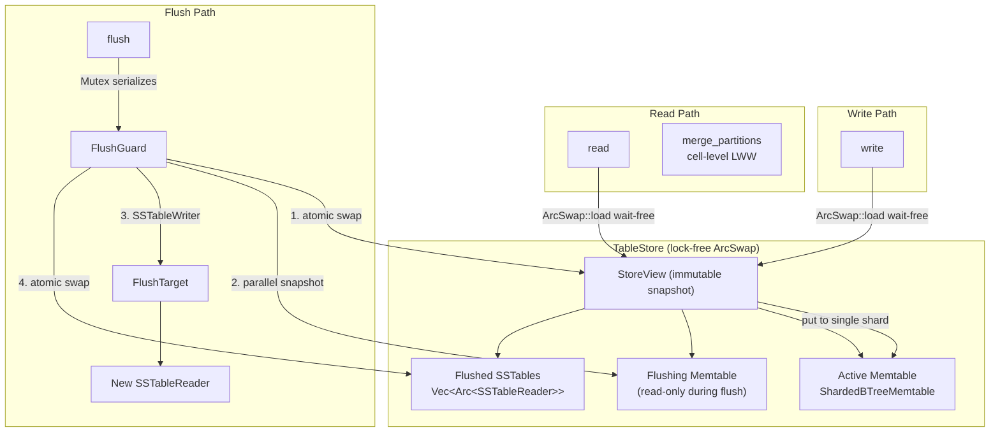

# Storage Engine

> Last updated: 2026-03-11
> Status: Approved

## Overview

`ferrosa-storage` is the single-node storage engine. It accepts writes into an in-memory buffer (memtable), flushes to SSTables, and merges reads across all sources. The read path is entirely wait-free via lock-free atomic pointer swaps.

The crate is implemented in three parts:

| Part | Scope | Key Deps |
|------|-------|----------|
| **A** | Memtable + Flush + Read-path merge | `ferrosa-common`, `ferrosa-sstable`, `arc_swap`, `parking_lot`, `rayon` |
| **B** | Commit log (WAL, segments, replay) | Part A + versioned segment format |
| **C** | Compaction + S3 manager + composition | Part A + B + `aws-sdk-s3`, `tokio` |

## Architecture



## Crate Structure

```
ferrosa-common/src/
  schema.rs               # TableSchema, ColumnDefinition (new)

ferrosa-storage/
  Cargo.toml
  src/
    lib.rs                # Public API re-exports
    memtable/
      mod.rs              # Memtable trait
      sharded.rs          # ShardedBTreeMemtable (64 shards)
    flush.rs              # FlushTarget trait + InMemory/File impls + build_serialization_header()
    store.rs              # TableStore — lock-free ArcSwap composition
    merge.rs              # Read-path merge (cell-level LWW, deletion suppression)
  tests/
    integration.rs        # Module integration tests
```

## Dependencies

| Crate | Version | Purpose | Justification |
|-------|---------|---------|---------------|
| `ferrosa-common` | workspace | Token, DecoratedKey, CellValue, TableSchema | Shared types |
| `ferrosa-sstable` | workspace | SSTableReader, SSTableWriter, ReadAt, WriteAt | SSTable I/O |
| `arc_swap` | 1.7 | Lock-free atomic `Arc` swaps for StoreView | Reads are wait-free; `load()` never contends with other readers. Uses debt-slot mechanism internally — each thread has pre-allocated slots, avoiding `Arc` refcount contention. `store()` is lock-free (not wait-free). Used by tokio, hyper in production. |
| `parking_lot` | 0.12 | Fast RwLock for memtable shards | 1-word size (vs multi-word std), adaptive spinning for short critical sections, up to 50x faster under read-heavy contention. Hardware lock elision (HLE) available on x86. No poisoning. |
| `rayon` | 1.x | Work-stealing thread pool for parallel shard drain | Better than `std::thread::scope` for 64 shards — avoids spawning 64 OS threads on 8-32 core machines. Handles unequal shard sizes via work stealing. |
| `proptest` (dev) | 1.x | Property-based testing | |
| `tempfile` (dev) | 3.x | Temporary directories for file-backed flush tests | |

## Versioned Protocols

No versioned protocols between in-process modules — they share Rust types directly. Versioned format headers are required for **persisted artifacts** that must survive rolling upgrades:

| Artifact | Part | Versioning Strategy |
|----------|------|---------------------|
| Commit log segments | B | Version byte in segment header |
| `manifest.json` (S3) | C | `"format_version"` field in JSON |
| `checkpoint.json` (S3) | C | `"format_version"` field in JSON |

## Components

### ferrosa-common: TableSchema

```rust
pub struct TableSchema {
    pub keyspace: String,
    pub table: String,
    pub key_type: String,                           // Cassandra type class name
    pub clustering_columns: Vec<ColumnDefinition>,
    pub static_columns: Vec<ColumnDefinition>,
    pub regular_columns: Vec<ColumnDefinition>,     // ordered by column index
}

pub struct ColumnDefinition {
    pub name: String,
    pub type_name: String,  // Cassandra type class name
}

impl TableSchema {
    pub fn clustering_types(&self) -> Vec<String>;
    pub fn column_index(&self, name: &str) -> Option<u16>;
}
```

ferrosa-common does NOT depend on ferrosa-sstable. Conversion to `SerializationHeader` lives in `ferrosa-storage::flush::build_serialization_header()`, which computes `min_timestamp`, `min_local_deletion_time`, and `min_ttl` by scanning the partition data being flushed.

### Memtable Trait

```rust
pub trait Memtable: Send + Sync {
    fn put(&self, key: &DecoratedKey, row: Row, schema: &TableSchema) -> Result<()>;
    fn get(&self, key: &DecoratedKey) -> Result<Option<Arc<Partition>>>;
    fn snapshot(&self) -> Vec<Partition>;  // &self — memtable already retired
    fn size_bytes(&self) -> usize;        // AtomicUsize, wait-free
    fn partition_count(&self) -> usize;   // AtomicUsize, wait-free
}
```

The trait enables swapping the backing data structure without changing any consumer code.

### ShardedBTreeMemtable

```rust
pub struct ShardedBTreeMemtable {
    shards: Vec<parking_lot::RwLock<BTreeMap<DecoratedKey, Arc<Partition>>>>,
    num_shards: usize,        // default 64
    size: AtomicUsize,
    count: AtomicUsize,
}
```

- **Shard selection**: `key.token.0 as u64 % num_shards`
- **`put()`**: Write-lock one shard. Merge cells by `(column_index)`, newer timestamp wins. Merge row/partition deletions (newer wins). Update `AtomicUsize` counters.
- **`get()`**: Read-lock one shard, `Arc::clone()` (pointer bump), release. Nanosecond critical section.
- **`snapshot()`**: Parallel drain via `rayon` — distribute 64 shards across thread pool, each read-locks and collects, then k-way merge into token order. No write contention (memtable already swapped out).
- **`size_bytes()` / `partition_count()`**: `AtomicUsize::load(Relaxed)`. Wait-free.

### FlushTarget Trait

```rust
pub trait FlushTarget: Send + Sync {
    type Reader: ReadAt + Send + Sync + 'static;
    fn flush(&self, output: SSTableOutput) -> Result<SSTableReader<Self::Reader>>;
}
```

Two implementations:

- **`InMemoryFlushTarget`**: Wraps `SSTableOutput` as `SSTableComponents<Vec<u8>>`. No filesystem. Used for tests and Part A.
- **`FileFlushTarget`**: Writes component files to `{base_dir}/{generation}-{Component}.db`. Uses `rayon` to write up to 7 files in parallel (`CompressionInfo.db` omitted when compression is disabled). Opens `SSTableReader<FileReadAt>`.

### TableStore

```rust
pub struct TableStore<F: FlushTarget> {
    schema: TableSchema,
    view: ArcSwap<StoreView<F::Reader>>,
    flush_guard: Mutex<()>,
    flush_target: F,
    options: ferrosa_sstable::WriteOptions,
}

struct StoreView<R: ReadAt + Send + Sync + 'static> {
    active: Arc<dyn Memtable>,
    flushing: Option<Arc<dyn Memtable>>,
    sstables: Arc<Vec<Arc<SSTableReader<R>>>>,  // newest first
}
```

**Public API** — all methods take `&self`:

```rust
impl<F: FlushTarget> TableStore<F> {
    pub fn new(schema: TableSchema, flush_target: F, options: ferrosa_sstable::WriteOptions) -> Self;
    pub fn write(&self, key: &DecoratedKey, row: Row) -> Result<()>;
    pub fn read(&self, key: &DecoratedKey) -> Result<Option<Partition>>;
    pub fn flush(&self) -> Result<()>;
    pub fn sstable_count(&self) -> usize;
    pub fn memtable_size(&self) -> usize;
    pub fn memtable_partition_count(&self) -> usize;
}
```

### Read-Path Merge

```rust
pub fn merge_partitions(sources: Vec<Partition>) -> Partition;
```

**Rules** (matching Cassandra):

- Partition-level deletion: newest `DeletionTime` wins. Suppresses rows with `primary_key_liveness.timestamp` < `marked_for_delete_at`.
- Row-level deletion: newest `DeletionTime` wins per clustering key. Suppresses cells with `timestamp` < `marked_for_delete_at`.
- Cell-level: for same `(column_index)`, cell with highest `timestamp` wins.
- Static row: cell-level LWW. When one source has a static row and another does not, the one that has it is used.
- Rows from multiple sources merged by clustering key (byte-ordered).

## Data Flow

### Write Path

1. `ArcSwap::load()` — wait-free, get current view
1. `view.active.put(key, row)` — write-lock one shard out of 64

### Read Path

1. `ArcSwap::load()` — wait-free, get immutable snapshot
1. Check active memtable → `Option<Arc<Partition>>`
1. Check flushing memtable (if mid-flush) → `Option<Arc<Partition>>`
1. Check flushed SSTables newest-first — `SSTableReader::get_partition()` handles bloom filter internally
1. `merge_partitions()` — cell-level LWW across all sources

### Flush Path

1. Acquire `flush_guard` Mutex (serializes flushes; reads/writes unaffected)
1. Atomic swap: install fresh memtable, move old to `flushing` — writes resume immediately
1. Parallel snapshot via rayon: drain 64 shards, k-way merge into token order
1. `build_serialization_header()` — scan partitions for min_timestamp etc.
1. `SSTableWriter::new().add_partition()...finish()` — produce `SSTableOutput`
1. `flush_target.flush(output)` — persist and open reader
1. Atomic swap: prepend new `SSTableReader`, clear `flushing`

## Concurrency Model

| Operation | Mechanism | Contention |
|-----------|-----------|------------|
| `read()` | `ArcSwap::load()` (wait-free) + `get()` (read-lock one shard) | Near-zero |
| `write()` | `ArcSwap::load()` (wait-free) + `put()` (write-lock one shard) | 1 of 64 shards |
| `flush()` | `Mutex` serializes flushes; `ArcSwap::store()` for view transitions | Flushes only; reads/writes unaffected |
| `size_bytes()` | `AtomicUsize::load(Relaxed)` | Zero (wait-free) |
| `snapshot()` | rayon parallel drain, read-locks on retired memtable | None (no writers) |
| File writes | rayon parallel write of independent components | None |

### Concurrency Primitive Selection

| Primitive | Choice | Why Not Alternatives |
|-----------|--------|---------------------|
| View swaps | `arc_swap::ArcSwap` | `RwLock<Arc<>>` would contend under concurrent reads. ArcSwap load is wait-free with zero reader-reader contention via debt-slot mechanism. |
| Shard locks | `parking_lot::RwLock` | `std::sync::RwLock` is multi-word, no adaptive spinning, no HLE, poisoning overhead. `DashMap` lacks ordered iteration. |
| Parallel work | `rayon` | `std::thread::scope` spawns 64 OS threads for 64 shards — oversubscription on 8-32 core machines. Rayon maps to CPU cores via work stealing. |
| Stats counters | `AtomicUsize` | Any lock would add contention to every `put()` call for a stat update. |
| Flush serialization | `Mutex<()>` | CAS loop on ArcSwap would be complex and fragile. Single flush at a time is correct — Cassandra also serializes flushes per table. |

### Lock-Free Upgrade Path

The `Memtable` trait enables swapping `ShardedBTreeMemtable` for a lock-free implementation without changing `TableStore`, `FlushTarget`, or `merge.rs`:

| Option | Status | Properties |
|--------|--------|------------|
| `crossbeam-skiplist::SkipMap` | v0.1.3, not in main crossbeam crate | All operations lock-free. Epoch-based reclamation. Poor cache locality (individually heap-allocated nodes). Single-threaded perf worse than BTreeMap. Wins under high write contention. |
| `im::OrdMap` (persistent B-tree) | v15.1, stable | O(1) clone via structural sharing — `snapshot()` becomes near-free. 2-3x slower per-operation than BTreeMap. Wins when snapshot frequency is high. Thread-safe (`Arc` internally). |
| Custom (Okasaki) | Research | Investigate HAMT or persistent red-black tree from `../research/corpus/cs-foundations/okasaki.pdf`. Could combine im's structural sharing with better per-operation performance. |

## Test Strategy

### Unit Tests

| Module | Tests |
|--------|-------|
| `memtable/sharded.rs` | Put/get single row; merge-on-write (newer timestamp wins); multi-shard distribution; snapshot returns token-sorted; concurrent puts from N threads; size_bytes/partition_count accuracy |
| `flush.rs` | InMemoryFlushTarget round-trip; FileFlushTarget writes correct files; build_serialization_header computes correct min values |
| `merge.rs` | Two partitions merge by timestamp; row deletion suppresses older cells; partition deletion suppresses all rows; disjoint partitions concatenate; static row merge (one-sided and two-sided); commutative: merge(a,b) == merge(b,a) |
| `store.rs` | Write + read (memtable only); flush + read (SSTable only); write + flush + write + read (merge across sources) |

### Integration Tests (`tests/integration.rs`)

| Test | What It Proves |
|------|----------------|
| `write_flush_read_round_trip` | Write N partitions, flush, read each back |
| `multiple_flushes_merge` | Write, flush, overwrite with newer timestamps, flush again, read merges 2 SSTables + memtable |
| `flush_does_not_block_reads` | Reader thread + concurrent flush = consistent data always |
| `deletion_suppresses_across_sources` | Tombstone in memtable suppresses flushed data |
| `snapshot_produces_token_order` | Random keys, snapshot returns token-sorted |
| `file_flush_target_creates_readable_sstables` | FileFlushTarget → tempdir → SSTableReader reads back |
| `concurrent_writes_no_data_loss` | N threads write concurrently, all readable after flush |
| `merge_is_commutative` | Different flush orders produce identical read results |

### Property Tests (proptest)

| Property | Invariant |
|----------|-----------|
| Memtable round-trip | `get(put(key, row))` contains all cells from row |
| Merge commutativity | `merge([a, b]) == merge([b, a])` |
| Merge associativity | `merge([merge([a, b]), c]) == merge([a, merge([b, c])])` |
| Flush preserves data | Write N partitions → flush → read all N back |
| Timestamp ordering | Higher timestamp cell survives merge at same column |

## Build Order (Part A)

| Order | Module | Purpose |
|-------|--------|---------|
| 1 | `ferrosa-common/schema.rs` | `TableSchema`, `ColumnDefinition` |
| 2 | `memtable/mod.rs` + `sharded.rs` | `Memtable` trait + `ShardedBTreeMemtable` |
| 3 | `merge.rs` | `merge_partitions` |
| 4 | `flush.rs` | `FlushTarget` + impls + `build_serialization_header()` |
| 5 | `store.rs` | `TableStore` (composes all) |
| 6 | `tests/integration.rs` | Cross-module integration tests |

## Parts B and C (Future)

### Part B: Commit Log

- Segment-based WAL with versioned header (version byte)
- Append-only writes with CRC32 checksums
- Segment lifecycle: active → closed → shipped
- Replay protocol on startup
- Integration with `TableStore` flush tracking

### Part C: Compaction + S3 + Composition

- Compaction strategies: Size-Tiered, Leveled, Time-Window
- SSTable lifecycle with `Arc`-based reference counting
- S3 upload manager with async upload, backpressure, manifest
- `manifest.json` and `checkpoint.json` with format versioning
- Full `StorageEngine` composing TableStore + CommitLog + Compaction + S3

## Related Specs

- [SSTable](sstable.md) — BTI format, trie encoding, I/O traits
- [Components](components.md) — crate architecture, dependency graph
- [Data Flow](data-flow.md) — write/read paths, S3 lifecycle
- [Overview](overview.md) — system overview and design principles
