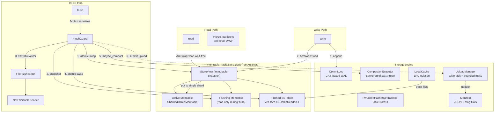

# Storage Engine

> Last updated: 2026-03-14 (index support additions)
> Status: Approved

## Overview

`ferrosa-storage` is the single-node storage engine. It accepts writes into an in-memory buffer (memtable), flushes to SSTables, and merges reads across all sources. The read path is entirely wait-free via lock-free atomic pointer swaps.

The crate is implemented in three parts, all complete:

| Part | Scope | Status | Key Deps |
|------|-------|--------|----------|
| **A** | Memtable + Flush + Read-path merge | Done | `ferrosa-common`, `ferrosa-sstable`, `arc_swap`, `parking_lot` |
| **B** | Commit log (WAL, segments, sync, replay) | Done | Part A + `crc32fast` |
| **C** | Compaction + S3 manager + StorageEngine | Done | Part A + B + `object_store`, `tokio`, `serde`, `bytes` |
| **D** | Secondary index build pipeline | Done | Part C + `ferrosa-index` |

## Architecture



## Crate Structure

```
ferrosa-common/src/
  schema.rs               # TableSchema, ColumnDefinition

ferrosa-storage/
  Cargo.toml
  src/
    lib.rs                # Public API re-exports
    engine.rs             # StorageEngine + StorageEngineConfig (Part C)
    memtable/
      mod.rs              # Memtable trait
      sharded.rs          # ShardedBTreeMemtable (64 shards)
    flush.rs              # FlushTarget trait + InMemory/File impls
    store.rs              # TableStore — lock-free ArcSwap composition
    merge.rs              # Read-path merge (cell-level LWW)
    commitlog/
      mod.rs              # CommitLog — compose segments + sync
      config.rs           # CommitLogConfig, TableId, CommitLogPosition
      segment.rs          # Segment — mmap buffer + CAS allocation
      mutation.rs         # Mutation — self-describing binary format
      sync.rs             # SyncStrategy trait + Batch/Periodic/Group
      reader.rs           # SegmentReader — sync marker chain replay
      checkpoint.rs       # CommitLogCheckpoint — per-table flush tracking
      descriptor.rs       # SegmentDescriptor — segment file metadata
    compaction/
      mod.rs              # Module re-exports
      metadata.rs         # SSTableMetadata, CompactionTask
      strategy.rs         # CompactionStrategy trait + SizeTieredStrategy
      executor.rs         # CompactionExecutor — background thread
    upload/
      mod.rs              # Module re-exports
      config.rs           # ObjectStoreConfig — 12-factor env config
      manager.rs          # UploadManager — tokio task + retry
    manifest.rs           # Manifest — JSON + etag-based CAS
    cache.rs              # LocalCache — LRU eviction with pinning
    index/
      tracker.rs          # IndexStateTracker — per-index staleness tracking
      scheduler.rs        # IndexBuildScheduler — channel-based worker pool
      virtual_table.rs    # SecondaryIndexesVirtualTable — system_views.secondary_indexes
  tests/
    integration.rs        # Part A module integration tests
    engine_integration.rs # Part C end-to-end tests
    engine_property.rs    # Part C property tests (proptest)
    compaction_property.rs # STCS strategy property tests
```

## Dependencies

| Crate | Version | Purpose | Justification |
|-------|---------|---------|---------------|
| `ferrosa-common` | workspace | Token, DecoratedKey, CellValue, TableSchema | Shared types |
| `ferrosa-sstable` | workspace | SSTableReader, SSTableWriter, ReadAt | SSTable I/O |
| `arc-swap` | 1.7 | Lock-free atomic `Arc` swaps for StoreView | Reads are wait-free; `load()` never contends with other readers. Uses debt-slot mechanism internally — each thread has pre-allocated slots, avoiding `Arc` refcount contention. `store()` is lock-free (not wait-free). |
| `parking_lot` | 0.12 | Fast Mutex/RwLock for shards, flush guards, engine internals | 1-word size (vs multi-word std), adaptive spinning, no poisoning. |
| `crc32fast` | 1 | Checksum for commit log entries | Hardware-accelerated CRC32C on supported CPUs. |
| `object_store` | 0.11 (aws) | S3-compatible object storage via `AmazonS3Builder` | Works with AWS S3, MinIO, R2, Ceph. No `aws-sdk-s3` dependency. Provides `PutMode::Update` for etag-based CAS. |
| `tokio` | 1 (rt, sync, time, macros) | Async runtime for upload manager | Upload manager runs as a spawned tokio task. Caller provides runtime handle. |
| `serde` + `serde_json` | 1 | Manifest and config serialization | JSON for manifest.json, checkpoint.json. |
| `bytes` | 1 | Zero-copy byte buffers for upload payloads | Used by `object_store` and upload manager. |
| `proptest` (dev) | 1 | Property-based testing | |
| `tempfile` (dev) | 3 | Temporary directories for file-backed tests | |

## Versioned Protocols

No versioned protocols between in-process modules — they share Rust types directly. Versioned format headers are required for **persisted artifacts** that must survive rolling upgrades:

| Artifact | Part | Versioning Strategy | Status |
|----------|------|---------------------|--------|
| Commit log segments | B | Segment header with descriptor (version, id, compression) | Implemented |
| `manifest.json` (S3) | C | `"format_version": 1` field in JSON | Implemented |
| `checkpoint.json` | B | `"format_version"` field in JSON | Implemented |

## Components

### ferrosa-common: TableSchema

```rust
pub struct TableSchema {
    pub keyspace: String,
    pub table: String,
    pub key_type: String,                           // Cassandra type class name
    pub clustering_columns: Vec<ColumnDefinition>,
    pub static_columns: Vec<ColumnDefinition>,
    pub regular_columns: Vec<ColumnDefinition>,     // ordered by column index
}

pub struct ColumnDefinition {
    pub name: String,
    pub type_name: String,  // Cassandra type class name
}

impl TableSchema {
    pub fn clustering_types(&self) -> Vec<String>;
    pub fn column_index(&self, name: &str) -> Option<u16>;
}
```

ferrosa-common does NOT depend on ferrosa-sstable. Conversion to `SerializationHeader` lives in `ferrosa-storage::flush::build_serialization_header()`, which computes `min_timestamp`, `min_local_deletion_time`, and `min_ttl` by scanning the partition data being flushed.

### Memtable Trait

```rust
pub trait Memtable: Send + Sync {
    fn put(&self, key: &DecoratedKey, row: Row, schema: &TableSchema) -> Result<()>;
    fn get(&self, key: &DecoratedKey) -> Result<Option<Arc<Partition>>>;
    fn snapshot(&self) -> Vec<Partition>;  // &self — memtable already retired
    fn size_bytes(&self) -> usize;        // AtomicUsize, wait-free
    fn partition_count(&self) -> usize;   // AtomicUsize, wait-free
}
```

The trait enables swapping the backing data structure without changing any consumer code.

### ShardedBTreeMemtable

```rust
pub struct ShardedBTreeMemtable {
    shards: Vec<parking_lot::RwLock<BTreeMap<DecoratedKey, Arc<Partition>>>>,
    num_shards: usize,        // default 64
    size: AtomicUsize,
    count: AtomicUsize,
}
```

- **Shard selection**: `key.token.0 as u64 % num_shards`
- **`put()`**: Write-lock one shard. Merge cells by `(column_index)`, newer timestamp wins. Merge row/partition deletions (newer wins). Update `AtomicUsize` counters.
- **`get()`**: Read-lock one shard, `Arc::clone()` (pointer bump), release. Nanosecond critical section.
- **`snapshot()`**: Sequential drain of all shards, collect into token-sorted order. No write contention (memtable already swapped out).
- **`size_bytes()` / `partition_count()`**: `AtomicUsize::load(Relaxed)`. Wait-free.

### FlushTarget Trait

```rust
pub trait FlushTarget: Send + Sync {
    type Reader: ReadAt + Send + Sync + 'static;
    fn flush(&self, output: SSTableOutput) -> Result<SSTableReader<Self::Reader>>;
}
```

Two implementations:

- **`InMemoryFlushTarget`**: Wraps `SSTableOutput` as `SSTableComponents<Vec<u8>>`. No filesystem. Used for tests.
- **`FileFlushTarget`**: Writes component files to `{base_dir}/{generation}-{Component}.db`. Monotonically incrementing generation counter (`AtomicU64`). Opens `SSTableReader<FileReadAt>`.

### TableStore

```rust
pub struct TableStore<F: FlushTarget> {
    schema: TableSchema,
    view: ArcSwap<StoreView<F::Reader>>,
    flush_guard: Mutex<()>,
    flush_target: F,
    options: ferrosa_sstable::WriteOptions,
}

struct StoreView<R: ReadAt + Send + Sync + 'static> {
    active: Arc<dyn Memtable>,
    flushing: Option<Arc<dyn Memtable>>,
    sstables: Arc<Vec<Arc<SSTableReader<R>>>>,  // newest first
}
```

**Public API** — all methods take `&self`:

```rust
impl<F: FlushTarget> TableStore<F> {
    pub fn new(schema: TableSchema, flush_target: F, options: WriteOptions) -> Self;
    pub fn write(&self, key: &DecoratedKey, row: Row) -> Result<()>;
    pub fn read(&self, key: &DecoratedKey) -> Result<Option<Partition>>;
    pub fn flush(&self) -> Result<()>;
    pub fn sstable_count(&self) -> usize;
    pub fn memtable_size(&self) -> usize;
    pub fn memtable_partition_count(&self) -> usize;
}
```

### Read-Path Merge

```rust
pub fn merge_partitions(sources: Vec<Partition>) -> Partition;
```

**Rules** (matching Cassandra):

- Partition-level deletion: newest `DeletionTime` wins. Suppresses rows with `primary_key_liveness.timestamp` < `marked_for_delete_at`.
- Row-level deletion: newest `DeletionTime` wins per clustering key. Suppresses cells with `timestamp` < `marked_for_delete_at`.
- Cell-level: for same `(column_index)`, cell with highest `timestamp` wins.
- Static row: cell-level LWW. When one source has a static row and another does not, the one that has it is used.
- Rows from multiple sources merged by clustering key (byte-ordered).

### CommitLog (Part B)

```rust
pub struct CommitLog {
    config: CommitLogConfig,
    active: Arc<ArcSwap<Segment>>,
    closed_segments: Mutex<Vec<Arc<Segment>>>,
    segment_tracker: Mutex<HashMap<u64, HashMap<TableId, CommitLogPosition>>>,
    sync_strategy: Box<dyn SyncStrategy>,
    next_segment_id: AtomicU64,
}
```

**Public API:**

```rust
impl CommitLog {
    pub fn new(config: CommitLogConfig) -> Result<Self>;
    pub fn append(&self, mutation: &Mutation) -> Result<CommitLogPosition>;
    pub fn open_and_replay(config: CommitLogConfig) -> Result<(Self, Vec<Mutation>)>;
    pub fn discard_completed(&self, table_id: &TableId, position: CommitLogPosition);
    pub fn shutdown(&self) -> Result<()>;
}
```

**Segment architecture:**

- Fixed-size byte buffer (default 32 MB) with **CAS-based lock-free allocation** (`AtomicU64` position)
- `allocate_and_begin_write()` increments an **in-flight writer counter** before CAS, undoes on failure
- `flush_to_disk()` snapshots position, waits for in-flight writers to complete, then incrementally appends new bytes under a mutex
- Forward-linked sync markers: `last_sync_marker_offset` tracks the chain for crash recovery replay

**Sync strategies** (3 implementations of `SyncStrategy` trait):

| Strategy | Throughput | Latency | Durability Window |
|----------|-----------|---------|-------------------|
| `BatchSync` | Lowest | Highest | Zero — fsync per write, no sync markers |
| `PeriodicSync` | Highest | Lowest | Up to `sync_interval` (default 10ms) |
| `GroupSync` | Good | Bounded | Up to `max_wait` (default 1ms) |

**Mutation binary format** (self-describing, big-endian):

```text
keyspace_len:u16 | keyspace | table_len:u16 | table
| key_len:u16 | key_bytes | token:i64 | timestamp:i64
| row_count:u16 | rows...

Row: clustering_len:u16 | clustering
   | deletion_marked_for_delete_at:i64 | deletion_local_deletion_time:u32
   | liveness_timestamp:i64 | liveness_ttl:i32 | liveness_local_deletion_time:i32
   | cell_count:u16 | cells...

Cell: column_index:u16 | timestamp:i64 | ttl:i32 | local_deletion_time:i32
    | value_len:i32 (-1=tombstone) | value
```

### Compaction (Part C)

**Strategy trait:**

```rust
pub trait CompactionStrategy: Send + Sync {
    fn select(&self, sstables: &[SSTableMetadata]) -> Vec<CompactionTask>;
}
```

**Size-Tiered Compaction Strategy (STCS)** — the only strategy currently implemented:

- Groups SSTables into buckets by similar size (within `[bucket_low, bucket_high]` ratio of bucket median)
- Triggers compaction when a bucket reaches `min_threshold` SSTables
- Configuration from `FERROSA_COMPACTION_*` environment variables:
  - `min_threshold` (default 4), `max_threshold` (default 32)
  - `bucket_low` (default 0.5), `bucket_high` (default 1.5)

**CompactionExecutor:**

```rust
pub struct CompactionExecutor {
    task_tx: std::sync::mpsc::Sender<CompactionTask>,
    result_rx: Mutex<std::sync::mpsc::Receiver<CompactionResult>>,
    handle: Mutex<Option<thread::JoinHandle<()>>>,
    stop_flag: Arc<AtomicBool>,
}
```

Runs on a dedicated `std::thread` (not async — compaction is CPU+IO bound). Submit tasks via channel, poll results non-blocking.

### S3 Upload Manager (Part C)

**ObjectStoreConfig** — 12-factor configuration from `FERROSA_S3_*` environment variables:

| Env Var | Required | Default | Purpose |
|---------|----------|---------|---------|
| `FERROSA_S3_ENDPOINT` | Yes | — | S3-compatible endpoint URL |
| `FERROSA_S3_BUCKET` | Yes | — | Bucket name |
| `FERROSA_S3_REGION` | No | `us-east-1` | AWS region |
| `FERROSA_S3_ACCESS_KEY_ID` | No | Instance profile | Access key |
| `FERROSA_S3_SECRET_ACCESS_KEY` | No | Instance profile | Secret key |
| `FERROSA_S3_ALLOW_HTTP` | No | `false` | Allow non-TLS (for MinIO) |
| `FERROSA_S3_PREFIX` | No | `` | Key prefix for multi-tenant separation |
| `FERROSA_S3_UPLOAD_QUEUE_DEPTH` | No | `16` | Bounded upload queue depth |

**UploadManager:**

```rust
pub struct UploadManager {
    task_tx: mpsc::Sender<UploadTask>,
    handle: Mutex<Option<tokio::task::JoinHandle<()>>>,
}
```

- Runs as a spawned tokio task on the caller-provided runtime handle
- Bounded `tokio::sync::mpsc` channel provides backpressure
- Exponential backoff retry on transient errors (5 retries, starting at 100ms)
- Uploads SSTable component files to `{prefix}/sstables/{table_id}/{sstable_id}/{component}`
- **Integrity**: SHA-256 checksum computed during upload, stored as `x-amz-meta-ferrosa-checksum: sha256:{hex}`. On read, checksum is recomputed and verified against the stored value. Mismatch returns `IntegrityError` — the object is treated as corrupt and re-fetched from S3 (once). Persistent mismatch is fatal for that SSTable component.

### Manifest (Part C)

```rust
pub struct Manifest {
    pub format_version: u32,
    pub sstables: HashMap<String, Vec<ManifestEntry>>,
    pub last_compacted_at: Option<String>,
}
```

- JSON document in S3 listing all live SSTables per table
- **Etag-based CAS**: loaded with `ObjectStore::get()` (captures etag), saved with `PutMode::Update(version)` for conditional put. On conflict, caller re-reads and retries.
- `ManifestEntry` tracks: id, size, min/max token, min/max timestamp

### LocalCache (Part C)

```rust
pub struct LocalCache {
    base_dir: PathBuf,
    max_bytes: u64,
    entries: Mutex<HashMap<String, CacheEntry>>,
}
```

- LRU eviction: when total size exceeds `max_bytes`, evicts least-recently-used entries
- **Pinned entries** (referenced by current manifest) are never evicted
- `register()` on download, `touch()` on read hit, `evict_if_needed()` after registration

### StorageEngine (Part C)

```rust
pub struct StorageEngine {
    config: StorageEngineConfig,
    tables: RwLock<HashMap<TableId, TableState>>,
    commit_log: CommitLog,
    compaction_executor: CompactionExecutor,
    upload_manager: Option<UploadManager>,
    local_cache: LocalCache,
}
```

**Public API:**

```rust
impl StorageEngine {
    pub fn new(config: StorageEngineConfig, runtime: Option<&Handle>) -> Result<Self>;
    pub fn register_table(&self, schema: TableSchema) -> Result<()>;
    pub fn write(&self, table_id: &TableId, key: &DecoratedKey, row: Row, timestamp: i64) -> Result<()>;
    pub fn read(&self, table_id: &TableId, key: &DecoratedKey) -> Result<Option<Partition>>;
    pub fn flush(&self, table_id: &TableId) -> Result<()>;
    pub fn flush_if_needed(&self) -> Result<()>;  // threshold-based auto-flush
    pub fn poll_compactions(&self);
    pub fn shutdown(&self) -> Result<()>;
}
```

- `write()`: append to commit log, then write to table's memtable (both lock-free)
- `flush()`: flush memtable to SSTable, then check if STCS compaction is needed
- `flush_if_needed()`: flush any table whose memtable exceeds `flush_threshold_bytes`
- `shutdown()`: flush all tables, stop compaction executor, stop commit log
- `upload_manager` is `Option` — tests run without S3

### Index Support

The storage engine includes infrastructure for secondary index lifecycle management, coordinating with `ferrosa-index` for build execution.

**IndexStateTracker:**

Tracks per-index build state with transitions: `Current` (up to date), `Building` (async build in progress), `Stale` (needs rebuild), `Failed` (build error, will retry). State is updated atomically. Provides staleness information to the query planner so it can decide whether to use an index or fall back to a full scan.

**IndexBuildScheduler:**

Channel-based worker pool following the same pattern as `CompactionExecutor`. After SSTable flush, the scheduler receives `IndexBuildJob` requests and executes builds asynchronously on a dedicated thread pool. Jobs carry a `BuildPriority` (Normal/High for newly created indexes). Zero write-path impact — indexes are built as companion files to SSTables after flush completes.

**UploadTask::IndexFiles:**

The `UploadTask` enum includes an `IndexFiles` variant so that index companion files are uploaded to S3 alongside SSTable components. The upload manager handles index files with the same retry and integrity semantics as SSTable data.

**SecondaryIndexesVirtualTable:**

Implements `VirtualTable` for `system_views.secondary_indexes`, exposing per-index operational metrics: index name, table, type, state (current/building/stale/failed), entry count, size bytes, build duration, and last build timestamp.

## Data Flow

### Write Path (StorageEngine)

1. Build `Mutation` from key + row + table metadata
1. `commit_log.append(&mutation)` — CAS allocation in active segment, lock-free
1. `ArcSwap::load()` on TableStore — wait-free, get current view
1. `view.active.put(key, row)` — write-lock one shard out of 64

### Read Path (StorageEngine)

1. `tables.read()` — get table's `TableStore`
1. `ArcSwap::load()` — wait-free, get immutable snapshot
1. Check active memtable → `Option<Arc<Partition>>`
1. Check flushing memtable (if mid-flush) → `Option<Arc<Partition>>`
1. Check flushed SSTables newest-first — `SSTableReader::get_partition()` handles bloom filter internally
1. `merge_partitions()` — cell-level LWW across all sources

### Flush Path (StorageEngine)

1. Acquire `flush_guard` Mutex (serializes flushes; reads/writes unaffected)
1. Atomic swap: install fresh memtable, move old to `flushing` — writes resume immediately
1. Snapshot flushing memtable, sort by key
1. `build_serialization_header()` — scan partitions for min_timestamp etc.
1. `SSTableWriter::new().add_partition()...finish()` — produce `SSTableOutput`
1. `flush_target.flush(output)` — write files, open reader
1. Atomic swap: prepend new `SSTableReader`, clear `flushing`
1. `maybe_compact()` — evaluate STCS, submit compaction tasks if buckets are full

## Concurrency Model

| Operation | Mechanism | Contention |
|-----------|-----------|------------|
| `read()` | `ArcSwap::load()` (wait-free) + `get()` (read-lock one shard) | Near-zero |
| `write()` | Commit log CAS + `ArcSwap::load()` + `put()` (write-lock one shard) | 1 of 64 shards + segment CAS |
| `flush()` | Per-table `Mutex`; `ArcSwap::store()` for view transitions | Flushes only; reads/writes unaffected |
| `size_bytes()` | `AtomicUsize::load(Relaxed)` | Zero (wait-free) |
| Commit log alloc | `AtomicU64` CAS + in-flight writer counter | CAS contention under heavy write load |
| Compaction | Background `std::thread`, channel-based submit/poll | None (isolated thread) |
| Upload | tokio task, bounded `mpsc` channel | Backpressure when queue full |

### Concurrency Primitive Selection

| Primitive | Choice | Why Not Alternatives |
|-----------|--------|---------------------|
| View swaps | `arc_swap::ArcSwap` | `RwLock<Arc<>>` would contend under concurrent reads. ArcSwap load is wait-free with zero reader-reader contention via debt-slot mechanism. |
| Shard locks | `parking_lot::RwLock` | `std::sync::RwLock` is multi-word, no adaptive spinning, no HLE, poisoning overhead. `DashMap` lacks ordered iteration. |
| Commit log allocation | `AtomicU64` CAS loop | Lock-based allocation would serialize all writers. CAS allows truly concurrent appends to the same segment. |
| In-flight tracking | `AtomicU64` counter | Ensures `flush_to_disk()` waits for all writers to finish writing their allocated bytes before reading the buffer. |
| Compaction thread | `std::thread` + `std::sync::mpsc` | CPU+IO bound work. Async would waste a tokio runtime thread on blocking I/O. |
| Upload task | `tokio::spawn` + `tokio::sync::mpsc` | Network I/O is async-native. Caller provides runtime handle. |
| Stats counters | `AtomicUsize` | Any lock would add contention to every `put()` call for a stat update. |
| Flush serialization | `Mutex<()>` | CAS loop on ArcSwap would be complex and fragile. Single flush at a time is correct — Cassandra also serializes flushes per table. |

### Lock-Free Upgrade Path

The `Memtable` trait enables swapping `ShardedBTreeMemtable` for a lock-free implementation without changing `TableStore`, `FlushTarget`, or `merge.rs`:

| Option | Status | Properties |
|--------|--------|------------|
| `crossbeam-skiplist::SkipMap` | v0.1.3, not in main crossbeam crate | All operations lock-free. Epoch-based reclamation. Poor cache locality (individually heap-allocated nodes). Single-threaded perf worse than BTreeMap. Wins under high write contention. |
| `im::OrdMap` (persistent B-tree) | v15.1, stable | O(1) clone via structural sharing — `snapshot()` becomes near-free. 2-3x slower per-operation than BTreeMap. Wins when snapshot frequency is high. Thread-safe (`Arc` internally). |
| Custom (Okasaki) | Research | Investigate HAMT or persistent red-black tree from `../research/corpus/cs-foundations/okasaki.pdf`. Could combine im's structural sharing with better per-operation performance. |

## Test Strategy

### Unit Tests (per module)

| Module | Tests |
|--------|-------|
| `memtable/sharded.rs` | Put/get single row; merge-on-write (newer timestamp wins); multi-shard distribution; snapshot returns token-sorted; concurrent puts from N threads; size_bytes/partition_count accuracy |
| `flush.rs` | InMemoryFlushTarget round-trip; FileFlushTarget writes correct files; build_serialization_header computes correct min values |
| `merge.rs` | Two partitions merge by timestamp; row deletion suppresses older cells; partition deletion suppresses all rows; disjoint partitions concatenate; static row merge (one-sided and two-sided); commutative: merge(a,b) == merge(b,a) |
| `store.rs` | Write + read (memtable only); flush + read (SSTable only); write + flush + write + read (merge across sources); multiple flushes; empty flush is no-op |
| `commitlog/segment.rs` | Allocate and write; in-flight writer counter; incremental flush; concurrent appends no data loss |
| `commitlog/mod.rs` | Append and position; segment rotation; shutdown |
| `commitlog/mutation.rs` | Serialize/deserialize round-trip |
| `commitlog/sync.rs` | BatchSync flushes immediately; PeriodicSync flushes on timer |
| `commitlog/reader.rs` | Read single entry; read multiple entries; sync marker chain traversal |
| `compaction/strategy.rs` | Bucket selection by size; min_threshold gating; config from_env defaults |
| `compaction/executor.rs` | Submit and poll; shutdown |
| `upload/config.rs` | Test config defaults |
| `upload/manager.rs` | Upload round-trip; multiple components uploaded |
| `manifest.rs` | Load/save round-trip; add/remove sstables; empty prefix |
| `cache.rs` | Register and total_size; get_path; eviction removes oldest; touch prevents eviction; pinned entries never evicted; no eviction when under limit |
| `engine.rs` | Write then read; read unregistered table; write to unregistered table; write/flush/read; merge after flush; multiple tables; shutdown flushes all; flush_if_needed threshold |

### Integration Tests

| File | Tests |
|------|-------|
| `tests/integration.rs` | Part A: write/flush/read round-trip, multiple flushes, concurrent writes, deletion suppression, merge commutativity |
| `tests/engine_integration.rs` | Part C: write/read round-trip, write/flush/read, memtable+SSTable merge, multiple flushes, multi-table isolation, concurrent writers (4 threads × 25 keys) |

### Property Tests (proptest)

| File | Properties |
|------|-----------|
| `tests/engine_property.rs` | All writes readable; writes survive flush; last-write-wins across flush boundaries |
| `tests/compaction_property.rs` | STCS bucket selection is deterministic; tasks are subset of input; each task meets min_threshold; similar sizes grouped; different sizes separated |
| Part A inline | Memtable round-trip; merge commutativity/associativity; flush preserves data; timestamp ordering |

## SubscriptionObserver

`SubscriptionObserver` implements the `WriteObserver` trait to support CQL `SUBSCRIBE` queries. It maintains a dynamic set of active subscriptions and filters writes to determine which subscriptions need notification.

### Design

```rust
pub struct SubscriptionObserver {
    subscriptions: DashMap<SubscriptionId, SubscriptionFilter>,
    table_ref_counts: DashMap<TableId, AtomicUsize>,
}

pub struct SubscriptionFilter {
    pub table_id: TableId,
    pub predicate: Option<KeyPredicate>,
    pub stream_id: u16,
    pub connection_id: ConnectionId,
}
```

**Observer mode:** `ObserverMode::Async` — writes are never blocked by subscription evaluation. The `on_write()` method returns an empty `Vec`, deferring notification delivery to a separate async task.

### Registration

```rust
impl SubscriptionObserver {
    pub fn register(&self, id: SubscriptionId, filter: SubscriptionFilter);
    pub fn deregister(&self, id: &SubscriptionId);
    pub fn active_count(&self) -> usize;
}
```

- `register()` inserts the filter and increments the ref count for the watched table in `table_ref_counts`
- `deregister()` removes the filter and decrements the ref count; when a table's count reaches zero, writes to that table skip subscription checking entirely
- Ref counts allow the hot write path to short-circuit: if no subscriptions watch a table, `on_write()` returns immediately

### WriteObserver Implementation

```rust
impl WriteObserver for SubscriptionObserver {
    fn mode(&self) -> ObserverMode {
        ObserverMode::Async
    }

    fn on_write(&self, table_id: &TableId, key: &DecoratedKey, row: &Row) -> Vec<ObserverAction> {
        // Check ref count — if zero, return immediately
        // Match against subscription filters
        // Return empty vec — delivery is deferred
        Vec::new()
    }
}
```

The deferred delivery model ensures writes proceed at full speed regardless of subscription count. A separate notification task (in `ferrosa-cql`) polls for matched writes and pushes results to subscribed clients.

## StorageStatsTable

Virtual table at `system_observability.storage_stats`. Provides per-table storage metrics by querying the storage engine directly.

### VirtualTable Trait

```rust
pub trait VirtualTable: Send + Sync {
    fn name(&self) -> &str;
    fn keyspace(&self) -> &str;
    fn columns(&self) -> &[VirtualColumnDef];
    fn read(&self, predicate: Option<&Predicate>) -> Result<Vec<Vec<Option<CqlValue>>>>;
}
```

`StorageStatsTable` implements `VirtualTable` with `keyspace() = "system_observability"` and `name() = "storage_stats"`.

### StorageStatsProvider Trait

```rust
pub trait StorageStatsProvider: Send + Sync {
    fn collect_stats(&self) -> Vec<StorageStats>;
}

pub struct StorageStats {
    pub keyspace: String,
    pub table_name: String,
    pub memtable_size_bytes: u64,
    pub memtable_count: u32,
    pub sstable_count: u32,
    pub sstable_size_bytes: u64,
    pub s3_object_count: u32,
    pub s3_bytes: u64,
    pub pending_compactions: u32,
}
```

`StorageEngine` implements `StorageStatsProvider`. It iterates over registered tables and collects:

- `memtable_size_bytes` / `memtable_count` — from `TableStore::memtable_size()` and `memtable_partition_count()` (both `AtomicUsize`, wait-free)
- `sstable_count` / `sstable_size_bytes` — from `TableStore::sstable_count()` and SSTable metadata
- `s3_object_count` / `s3_bytes` — from the current `Manifest` (if loaded)
- `pending_compactions` — from `CompactionExecutor` pending task count

### Columns

| Column | CQL Type | Source |
|--------|----------|--------|
| `keyspace` | `text` | `TableSchema.keyspace` |
| `table_name` | `text` | `TableSchema.table` |
| `memtable_size_bytes` | `bigint` | `TableStore::memtable_size()` |
| `memtable_count` | `int` | `TableStore::memtable_partition_count()` |
| `sstable_count` | `int` | `TableStore::sstable_count()` |
| `sstable_size_bytes` | `bigint` | SSTable file metadata |
| `s3_object_count` | `int` | `Manifest::sstables` entry count |
| `s3_bytes` | `bigint` | `ManifestEntry::size` sum |
| `pending_compactions` | `int` | `CompactionExecutor` queue depth |

## Follow-on Work

### Not Yet Implemented

| Area | Description | Depends On |
|------|-------------|------------|
| **Compaction execution** | `CompactionExecutor` has a placeholder `execute_task()` — needs to read input SSTables, merge, write output SSTable | SSTableReader merge iterator |
| **SSTable metadata collection** | `collect_sstable_metadata()` returns empty — needs to iterate SSTableReader list and extract stats for STCS evaluation | SSTableReader stats API |
| **S3 upload wiring** | `StorageEngine.flush()` doesn't yet submit uploaded files to `UploadManager` — the upload path is built but not wired into flush | Compaction execution |
| **Manifest CAS loop** | Manifest load/save is implemented, but the retry loop on conflict isn't wired into the flush/upload pipeline | S3 upload wiring |
| **Recovery (`open()`)** | Load manifest from S3, ensure local cache has SSTables, replay commit log into memtables | Manifest, upload wiring |
| **Commit log S3 shipping** | Segments are flushed to local disk but not yet uploaded to S3 | UploadManager integration |
| **LCS / TWCS** | Only STCS is implemented. Leveled and Time-Window strategies are future | CompactionStrategy trait is ready |
| **Disk backpressure** | `flush_if_needed()` uses memtable size threshold but doesn't monitor local disk usage | Monitoring infrastructure |
| **Grace period GC** | Safe deletion protocol for superseded SSTables (1-hour grace period) | Manifest, S3 integration |
| **Orphan cleanup** | Periodic sweep of S3 objects not referenced by any manifest | Manifest |
| **S3 integrity verification** | SHA-256 checksum on upload stored in object metadata, verified on every read — designed, awaiting S3 upload wiring | S3 upload wiring |

## Related Specs

- [SSTable](sstable.md) — BTI format, trie encoding, I/O traits
- [Components](components.md) — crate architecture, dependency graph
- [Data Flow](data-flow.md) — write/read paths, S3 lifecycle
- [Overview](overview.md) — system overview and design principles
