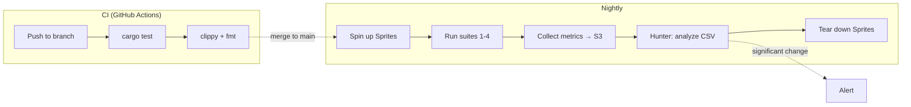
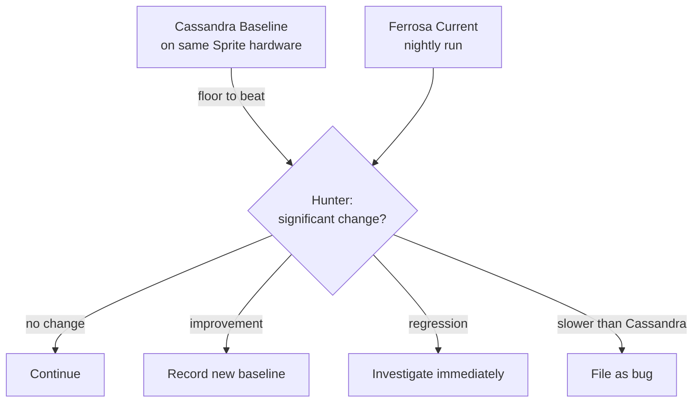

# Testing Strategy

> Last updated: 2026-03-22
> Status: Approved

## Overview

Ferrosa uses on-demand Sprite/fly.io clusters for integration testing and Hunter (DataStax) for automated performance regression detection. The Cassandra Java baseline is the floor to beat — Ferrosa should always be faster.

## Test Infrastructure



### Budget: less than $50/month

All clusters are on-demand — spin up for test runs, tear down after.

| Purpose | Nodes | Spec | Est. Cost |
|---------|-------|------|-----------|
| Correctness (Cassandra baseline) | 3 | shared-cpu-2x, 1GB | ~$3/mo |
| Correctness (Ferrosa) | 3 | shared-cpu-2x, 1GB | ~$3/mo |
| Performance baseline | 3 | shared-cpu-4x, 2GB | ~$5/mo |
| Chaos / node kill | 3-5 | shared-cpu-1x, 256MB | ~$1-2/run |

## Performance Philosophy



- Cassandra baseline is the **floor**, not the target
- Regressions measured against **Ferrosa's own prior performance**
- No hardcoded threshold — Hunter detects statistically significant changes
- 5% relative change filter for noise (from Hunter paper)
- Need 30+ data points for reliable detection

### Metrics Collected

- Throughput (ops/sec)
- p50, p99, p999 latency
- S3 upload lag (Ferrosa-specific)
- Cache hit ratio (Ferrosa-specific)
- HVQ S3 range GETs per query, bytes read per query, vector cache hit/miss
  bytes, checksum failures, and recall@k against exact `f32` baseline

### HVQ S3 Spill-Tier Gates

Hierarchical vector quantization adds test gates because vector indexes may be
larger than any compute node's local disk. These gates are required before
`quantized_ivf_flat` or `quantized_hnsw` can become production defaults.

| Test | Validates | Method |
|------|-----------|--------|
| Exact baseline | Quantized recall is measured against truth | Brute-force `f32` top-k corpus |
| Codec properties | Q8/Q4/Q2/Q1 decode error stays bounded | `proptest` generated vectors/dimensions |
| S3 publish | `.qvec` manifest is visible only after checksum validation | MinIO integration, kill builder mid-upload |
| Cold read-through | Query works with no local vector pages | Wipe NVMe cache, query via S3 Range GET |
| Cache smaller than index | Correctness does not depend on full local residency | Set cache cap below `.qvec` size |
| Corrupt remote page | Missing/short/stale/checksum-bad object fails loud | Inject object-store faults |
| Compaction replacement | New `.qvec` is published before old artifact GC | Compact, query, reject stale cached pages |
| Budget enforcement | Query and build stay within declared limits | Assert bytes/query, range gets/query, temp bytes |

## Suite 1: Data Integrity

No data loss under any condition. This is the #1 requirement.

| Test | Validates | Method |
|------|-----------|--------|
| Write + read back | Readable at all CL levels | YCSB workload A |
| Node kill during write | Survives single node death | QUORUM write, kill mid-stream |
| Node kill + recovery | Complete data from S3 | Kill, replace, verify |
| Multi-node failure | Survives RF-1 failures | Sequential kill |
| Compaction correctness | No data loss or corruption | Write, compact, verify all rows |
| S3 upload verification | S3 matches local | Checksum comparison |
| Cold start from S3 | Serves correctly with no local data | Wipe local, restart |

### SSTable Fuzz Testing

Property-based fuzz tests using `proptest` verify that the SSTable writer and reader handle all cell types correctly and never panic on malformed input. Located in `ferrosa-sstable/tests/property_tests.rs`.

| Test | Category | Validates |
|------|----------|-----------|
| `live_cell_roundtrip` | Cell roundtrip | Random value + timestamp survives write/read |
| `tombstone_cell_roundtrip` | Cell roundtrip | Tombstone timestamp + LDT survives write/read |
| `expiring_cell_roundtrip` | Cell roundtrip | TTL + LDT + value survives write/read |
| `mixed_cell_types_in_one_partition` | Cell roundtrip | Live, tombstone, and expiring cells coexist in one partition |
| `random_bytes_never_panic` | Reader resilience | Arbitrary byte sequences produce `Ok` or `Err`, never panic |
| `random_bytes_with_clustering_never_panic` | Reader resilience | Random bytes with clustering-column header never panic |
| `valid_prefix_then_garbage_never_panic` | Reader resilience | Truncated partition header + garbage (simulates crash during flush) |
| `corrupt_single_byte_never_panic` | Corruption | Valid SSTable with one random byte flipped never panics |
| `corrupt_expiring_cell_never_panic` | Corruption | Valid expiring-cell SSTable with one random byte flipped never panics |

Each test runs 1000+ generated inputs per `cargo test` invocation. The invariant is simple: the reader must return `Ok` or `Err` for any input — a panic is always a bug.

Additional leaf-component property tests (varint unsigned/signed round-trip, LZ4/Zstd compression round-trip, Bloom filter false-negative freedom, byte-comparable round-trip and ordering preservation) bring the total to 16 property-based tests across the crate.

### Cassandra Cross-Compatibility Fixtures

A Java-based fixture generator uses Cassandra's `CQLSSTableWriter` to produce reference SSTables with known data. The generator runs inside a Docker container built from the Cassandra 5.1 submodule, ensuring binary-level compatibility.

| Component | Location |
|-----------|----------|
| Dockerfile | `tests/sstable-compat/Dockerfile` |
| Java fixture generator | `tests/sstable-compat/CassandraSSTableWriter.java` |
| Generate script | `tests/sstable-compat/generate.sh` |
| Output fixtures | `ferrosa-sstable/tests/fixtures/cassandra_generated/` |

**Fixtures generated:**

| Fixture | Contents | Validates |
|---------|----------|-----------|
| `normal_cells` | Multi-partition, multi-row text data | Standard cell read path |
| `ttl_cells` | Rows with 60s, 1hr, 1day TTL | Expiring cell metadata parsing |
| `edge_cases` | Empty string, null value, 200-char partition key | Boundary conditions |
| `many_partitions` | 100 partitions, 1 row each | Partition index iteration |
| `wide_partition` | 1 partition, 500 rows | Clustering key ordering, row iteration |

```bash
# Generate fixtures (requires Docker)
./tests/sstable-compat/generate.sh
```

The Docker build compiles Cassandra from source (`ant build`), compiles the Java generator against Cassandra's `CQLSSTableWriter` classes, then runs the generator in a slim JRE image. Output is volume-mounted to the fixture directory for use by Rust integration tests.

## Suite 2: Performance Baselines

YCSB workloads on identical Sprite hardware:

| Workload | Mix | Models |
|----------|-----|--------|
| A | 50% read, 50% update | Session store |
| B | 95% read, 5% update | Photo tagging |
| C | 100% read | User profile cache |
| D | 95% read, 5% insert | Latest status |
| F | 50% read, 50% read-modify-write | User database |

## Suite 3: Chaos / Failure Injection

Sprites are ideal — Firecracker VMs with fast spin-up/kill.

| Scenario | Action | Verify |
|----------|--------|--------|
| Node crash | Kill Sprite VM | Cluster continues, data intact |
| Network partition | iptables isolation | Correct CL behavior |
| Slow node | tc qdisc latency | No cluster degradation |
| Disk full | Fill ephemeral storage | S3 data accessible |
| S3 unavailable | Block S3 endpoint | Local writes continue |
| Rolling restart | One node at a time | Zero downtime |
| Multi-kill | Kill 2 of 3 nodes | Sub-quorum writes rejected |

## Suite 4: CQL Compatibility

- **Drivers**: DataStax Java/Python/Go, gocql, scylla-rust-driver
- **Protocol**: All CQL v5 message types and error responses
- **DDL**: CREATE/ALTER/DROP keyspaces, tables, indexes (USING 'btree'/'hash'/'composite'/'phonetic'/'vector'), roles, GRANT/REVOKE
- **DML**: INSERT, UPDATE, DELETE, SELECT at all CL levels
- **Types**: All CQL types including collections, UDTs, tuples
- **cqlsh**: Connects and operates normally

### Python Wire-Level CQL Tests

A Python test harness using the DataStax `cassandra-driver` executes Cassandra's official CQL documentation examples over the wire against a live Ferrosa instance. This validates both parsing and execution, not just parsing.

| Component | Location |
|-----------|----------|
| Test harness | `tests/drivers/python/test_cassandra_cql_examples.py` |
| Docker Compose | `tests/drivers/docker-compose.drivers.yml` |
| CQL examples source | `cassandra/doc/modules/cassandra/examples/CQL/` |

**How it works:**

1. Collects all `.cql` files from the Cassandra submodule's documentation examples
2. Splits each file into individual CQL statements
3. Filters out cqlsh-only commands (`SOURCE`, `DESCRIBE`, `COPY`, etc.) and non-CQL fragments (UDF bodies, code snippets)
4. Executes each remaining statement against Ferrosa via the Python driver
5. Reports pass/fail/skip counts and overall coverage percentage

**Current coverage:** 81.8% of 707 executable CQL statements (864 total, 157 filtered as cqlsh commands or non-CQL fragments).

```bash
# Via Docker
docker compose -f tests/drivers/docker-compose.drivers.yml run python-tests \
    pytest -v test_cassandra_cql_examples.py

# Locally (with ferrosa running on 9042)
pytest -v tests/drivers/python/test_cassandra_cql_examples.py
```

The test is currently informational — it reports coverage without failing the suite. The CQL parser's own doc test (`cassandra_cql_examples.rs`) enforces parse-level coverage separately.

## Suite 5: Secondary Index Tests

| Test | Validates | Location |
|------|-----------|----------|
| Index type unit tests | B-tree, hash, composite, phonetic, filtered, HNSW, IVFFlat build + query | `ferrosa-index/src/*.rs` (110 tests) |
| Schema CRUD | CREATE/DROP INDEX, idempotent internal methods, cascade cleanup | `ferrosa-schema/tests/integration.rs` |
| Build pipeline | IndexStateTracker staleness transitions, IndexBuildScheduler job processing | `ferrosa-storage/tests/index_integration.rs` |
| Smoke — CQL client | CREATE INDEX DDL, IF NOT EXISTS idempotency, DROP INDEX | `ferrosa/tests/smoke.rs` |
| Smoke — cqlsh | Index creation and system_schema.indexes introspection | `tests/cqlsh_smoke_test.sh` |
| Smoke — Docker pair mode | Index DDL replication across two nodes, survival after failover | `tests/docker-smoke.sh` |

## Suite 6: Accord Transaction Tests

The Accord consensus implementation includes a comprehensive built-in test infrastructure for verifying linearizability and serializable isolation.

### Jepsen-Style Infrastructure

Ferrosa includes a built-in Jepsen-style testing framework (not the external Jepsen tool) with these components:

| Component | Purpose |
|-----------|---------|
| `TestCluster` | In-process multi-node cluster for deterministic testing |
| `NemesisController` | Fault injection: partitions, node kills, clock skew |
| `HistoryRecorder` | Records all operations with timestamps for verification |
| `LinearizabilityChecker` | Verifies linearizability of operation histories |

### Jepsen Test Matrix

| Test | Workloads | Nemesis | Validates |
|------|-----------|---------|-----------|
| Register | Read, Write, CAS | Partition, kill, skew | Single-key linearizability |
| Bank | Transfer | Partition, kill | Balance preservation |
| Write-skew | Read-then-write | Partition | Serializable isolation |

### Accord Unit Tests

| Category | Tests | Description |
|----------|-------|-------------|
| AccordStateMachine | 39 | State transitions, quorum logic, conflict detection |
| AccordCoordinator | ~50 | Fast/slow path, quorum formulas, timeout handling |
| ConflictIndex / MemIndex | ~30 | Key-range overlap, concurrent access, BTreeMap lookups |
| RecoveryCoordinator | ~40 | 11 recovery scenarios at each protocol phase |
| DepWaitGraph | ~15 | Dependency tracking, cycle detection |
| DdlDrain / WriteGate | ~15 | Drain timing, gate open/close semantics |
| CrossShard | ~20 | Multi-shard coordination, partial failure |
| Electorate reconfiguration | ~30 | Epoch propagation, 4-gate join, shrink/resize |
| UDF/UDA integration | 18 | WASM functions within Accord transactions |

### Protocol Verification Tests

| Test | Description |
|------|-------------|
| 24-step EPaxos test | Full protocol round-trip with dependency tracking and multiple concurrent transactions |
| 4 property-based tests | Agreement, validity, termination, and serialization invariants via QuickCheck-style generation |

### Chaos / Nemesis Tests

| Scenario | Action | Verify |
|----------|--------|--------|
| Network partition | Isolate minority | Transactions in majority complete; minority retries |
| Minority kill | Kill < quorum nodes | No committed transaction lost |
| Clock skew | Inject SkewMax offset | HLC ordering remains correct |
| Coordinator crash (PreAccept) | Kill coordinator mid-phase | RecoveryCoordinator completes transaction |
| Coordinator crash (Accept) | Kill coordinator mid-phase | RecoveryCoordinator completes transaction |
| Coordinator crash (Commit) | Kill coordinator mid-phase | Committed state recovered from replicas |
| Crash recovery replay | Kill + restart node | `.accord` sidecar files restore ProtocolLog |

### Performance Tests

| Test | Metrics | Purpose |
|------|---------|---------|
| Baseline throughput | ops/sec, p50/p99 latency | Establish performance floor |
| Fast path ratio | % fast vs slow path | Verify low-contention fast path dominance |
| Contention scaling | Throughput under N concurrent txns | Identify contention knee |
| Regression suite | Automated comparison vs baseline | Prevent performance regressions |

## Suite 7: End-to-End Accord Verification (ferrosa-jepsen)

Real multi-node cluster testing with real CQL drivers, real failure injection, and formal linearizability verification. Unlike Suite 6 (in-process deterministic), Suite 7 tests the full stack from CQL socket to disk under real network failures.

See [ferrosa-jepsen spec](jepsen-e2e-test-plan.md) for full details.

### Infrastructure

| Component | Technology | Purpose |
|-----------|-----------|---------|
| Local clusters | Firecracker VMs | Sub-second boot, real kernel isolation, tc/netem per-link |
| Geo-distributed | Fly.io (iad/cdg/nrt) | Real multi-region latency, WAN chaos proxy |
| Formal verification | Jepsen + Knossos/Elle | NP-complete linearizability proof, G0-G2 anomaly detection |
| Fast verification | Rust `LinearizabilityChecker` | O(n log n) inline checker for immediate feedback |
| CQL drivers | Python, Go, Node, Java, C#, Rust | All 6 drivers hit the same cluster simultaneously |

### Topology Progression

| Phase | Nodes | RF | Focus |
|-------|-------|----|-------|
| T1 | 3 single-DC | 3 | Basic quorum, all failure modes |
| T2 | 5 single-DC | 5 | Fast/slow quorum paths |
| T3 | 3+3 dual-DC | 3/DC | LOCAL_SERIAL vs SERIAL, DC partition |
| T4 | 3+3+3 tri-DC | 3/DC | Electorate reconfiguration, geo-failures |

### Nemesis Matrix (21 nemeses + 5 composed)

**Network:** partition-halves, partition-ring, partition-one, slow-network, jitter-network, packet-loss, packet-corrupt, packet-reorder

**Process:** kill-minority, kill-majority, pause-node

**Clock:** clock-skew-small (+/-100ms), clock-skew-large (+/-5s), clock-strobe (NTP jumps)

**Disk:** disk-slow (dm-flakey delay), disk-fail (dm-flakey drop)

**WAN (T3/T4):** dc-partition, dc-slow, dc-asymmetric, dc-flap, dc-lossy

**Composed:** partition+clock, kill+jitter, pause+loss, dc-partition+kill, all-random

### LWT Pattern Coverage (16 patterns)

All patterns run under every nemesis, at 3 concurrency levels (12/60/300 concurrent clients), with all 6 CQL drivers:

| # | Pattern | Invariant |
|---|---------|-----------|
| 1 | INSERT IF NOT EXISTS | Exactly one winner per key |
| 2 | INSERT IF NOT EXISTS + TTL | No insert during unexpired TTL window |
| 3 | UPDATE IF col = ? | Final value = count of successful CAS |
| 4 | UPDATE IF col1 = ? AND col2 = ? | Only valid state transitions |
| 5 | UPDATE IF EXISTS | Fails on non-existent row |
| 6 | DELETE IF col = ? | Only matching rows deleted |
| 7 | DELETE IF EXISTS | Exactly one delete succeeds |
| 8 | BATCH mixed IF | Atomic all-or-nothing |
| 9 | BATCH multi-row same partition | All-or-nothing across clustering keys |
| 10 | LWT + counters | Monotonic, threshold respected |
| 11 | LWT + collections | Set grows monotonically |
| 12 | LWT + TTL | No phantom CAS on expired row |
| 13 | LWT + static columns | CAS serialized across partition |
| 14 | LWT result set format | Wire format matches Cassandra spec |
| 15 | SERIAL/LOCAL_SERIAL reads | Reads see latest committed write |
| 16 | BEGIN TRANSACTION | Cross-partition balance invariant |

### Execution Tiers

| Tier | Duration | Scope |
|------|----------|-------|
| Smoke | ~5 min | T1, 3 nemeses, Rust driver, low concurrency |
| Standard | ~45 min | T1+T2, all nemeses, all drivers, low+medium |
| Full | ~4 hours | All topologies, all nemeses, all drivers, all concurrency |
| Endurance | 24 hours | T4 tri-DC on Fly.io, continuous random nemesis |

### Full Test Matrix

```
4 topologies x 16 nemeses x 16 LWT patterns x 6 drivers x 3 concurrency = 18,432 combinations
```

## Pre-1.0 Test Backlog

Required before declaring production readiness:

| Category | Test | Details |
|----------|------|---------|
| **Data Model** | Tombstone & TTL handling | Expiration, gc_grace_seconds, accumulation degrading reads |
| | Large partition handling | Partitions exceeding memory, wide rows |
| | Counter correctness | Merge semantics, concurrent increments across replicas |
| | Timestamp conflict resolution | Last-write-wins, out-of-order writes, clock skew |
| **Distributed** | Hinted handoff | Accumulation during downtime, replay on return, storage limits |
| | Read repair verification | Intentional divergence, verify repair corrects it |
| | Anti-entropy repair | Full and incremental repair under load |
| | Range queries & pagination | Token range scans, paging, coordinator changes mid-page |
| **S3 Failure Modes** | Throttling (HTTP 429) | Backpressure, exponential retry, local writes continue |
| | LIST eventual consistency | Manifest-based tracking must not depend on LIST |
| | Partial upload failure | Cleanup, retry, no orphaned S3 objects |
| | Cost profiling | Track PUT/GET/LIST call volume |
| **Operational** | Rolling upgrade | Version N and N+1 coexist, no data loss or downtime |
| | Schema evolution under load | ALTER TABLE while writes active |
| | Compaction under heavy writes | L0 accumulation, read amplification |
| | Backup/restore from S3 | Point-in-time recovery, snapshot consistency |
| | Soak test (24-72hr) | Memory leaks, fd leaks, S3 queue growth |
| | Memory pressure / OOM | Backpressure, graceful degradation |
| **Migration** | SSTable import correctness | Every row from Big + BTI reads correctly in Ferrosa |

Sprites' small memory footprint naturally triggers memory pressure issues that would take deliberate effort to reproduce on larger instances.

## Related Specs

- [Data Flow](data-flow.md) — write/read paths, Accord transaction flow, durability mitigations
- [Components](components.md) — crate architecture
- [Accord](accord.md) — Accord consensus protocol specification
- [Accord Project Plan](accord-project-plan.md) — sprint completion details
