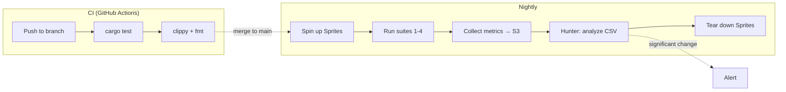
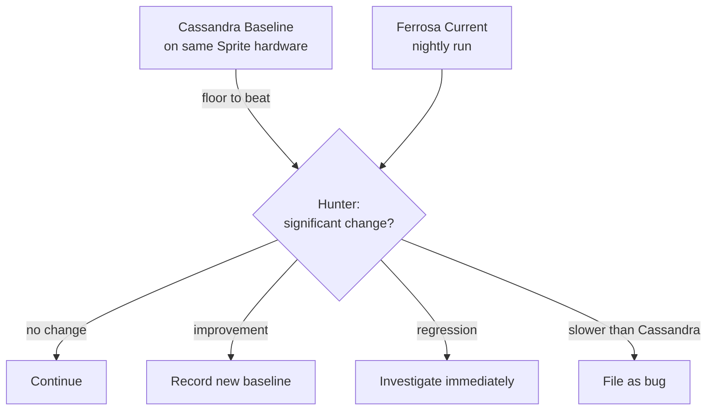

# Testing Strategy

> Last updated: 2026-03-11
> Status: Approved

## Overview

Ferrosa uses on-demand Sprite/fly.io clusters for integration testing and Hunter (DataStax) for automated performance regression detection. The Cassandra Java baseline is the floor to beat — Ferrosa should always be faster.

## Test Infrastructure

### Budget: less than $50/month

All clusters are on-demand — spin up for test runs, tear down after.

| Purpose | Nodes | Spec | Est. Cost |
|---------|-------|------|-----------|
| Correctness (Cassandra baseline) | 3 | shared-cpu-2x, 1GB | ~$3/mo |
| Correctness (Ferrosa) | 3 | shared-cpu-2x, 1GB | ~$3/mo |
| Performance baseline | 3 | shared-cpu-4x, 2GB | ~$5/mo |
| Chaos / node kill | 3-5 | shared-cpu-1x, 256MB | ~$1-2/run |

## Performance Philosophy

- Cassandra baseline is the **floor**, not the target
- Regressions measured against **Ferrosa's own prior performance**
- No hardcoded threshold — Hunter detects statistically significant changes
- 5% relative change filter for noise (from Hunter paper)
- Need 30+ data points for reliable detection

### Metrics Collected

- Throughput (ops/sec)
- p50, p99, p999 latency
- S3 upload lag (Ferrosa-specific)
- Cache hit ratio (Ferrosa-specific)

## Suite 1: Data Integrity

No data loss under any condition. This is the #1 requirement.

| Test | Validates | Method |
|------|-----------|--------|
| Write + read back | Readable at all CL levels | YCSB workload A |
| Node kill during write | Survives single node death | QUORUM write, kill mid-stream |
| Node kill + recovery | Complete data from S3 | Kill, replace, verify |
| Multi-node failure | Survives RF-1 failures | Sequential kill |
| Compaction correctness | No data loss or corruption | Write, compact, verify all rows |
| S3 upload verification | S3 matches local | Checksum comparison |
| Cold start from S3 | Serves correctly with no local data | Wipe local, restart |

## Suite 2: Performance Baselines

YCSB workloads on identical Sprite hardware:

| Workload | Mix | Models |
|----------|-----|--------|
| A | 50% read, 50% update | Session store |
| B | 95% read, 5% update | Photo tagging |
| C | 100% read | User profile cache |
| D | 95% read, 5% insert | Latest status |
| F | 50% read, 50% read-modify-write | User database |

## Suite 3: Chaos / Failure Injection

Sprites are ideal — Firecracker VMs with fast spin-up/kill.

| Scenario | Action | Verify |
|----------|--------|--------|
| Node crash | Kill Sprite VM | Cluster continues, data intact |
| Network partition | iptables isolation | Correct CL behavior |
| Slow node | tc qdisc latency | No cluster degradation |
| Disk full | Fill ephemeral storage | S3 data accessible |
| S3 unavailable | Block S3 endpoint | Local writes continue |
| Rolling restart | One node at a time | Zero downtime |
| Multi-kill | Kill 2 of 3 nodes | Sub-quorum writes rejected |

## Suite 4: CQL Compatibility

- **Drivers**: DataStax Java/Python/Go, gocql, scylla-rust-driver
- **Protocol**: All CQL v5 message types and error responses
- **DDL**: CREATE/ALTER/DROP keyspaces, tables, indexes
- **DML**: INSERT, UPDATE, DELETE, SELECT at all CL levels
- **Types**: All CQL types including collections, UDTs, tuples
- **cqlsh**: Connects and operates normally

## Pre-1.0 Test Backlog

Required before declaring production readiness:

| Category | Test | Details |
|----------|------|---------|
| **Data Model** | Tombstone & TTL handling | Expiration, gc_grace_seconds, accumulation degrading reads |
| | Large partition handling | Partitions exceeding memory, wide rows |
| | Counter correctness | Merge semantics, concurrent increments across replicas |
| | Timestamp conflict resolution | Last-write-wins, out-of-order writes, clock skew |
| **Distributed** | Hinted handoff | Accumulation during downtime, replay on return, storage limits |
| | Read repair verification | Intentional divergence, verify repair corrects it |
| | Anti-entropy repair | Full and incremental repair under load |
| | Range queries & pagination | Token range scans, paging, coordinator changes mid-page |
| **S3 Failure Modes** | Throttling (HTTP 429) | Backpressure, exponential retry, local writes continue |
| | LIST eventual consistency | Manifest-based tracking must not depend on LIST |
| | Partial upload failure | Cleanup, retry, no orphaned S3 objects |
| | Cost profiling | Track PUT/GET/LIST call volume |
| **Operational** | Rolling upgrade | Version N and N+1 coexist, no data loss or downtime |
| | Schema evolution under load | ALTER TABLE while writes active |
| | Compaction under heavy writes | L0 accumulation, read amplification |
| | Backup/restore from S3 | Point-in-time recovery, snapshot consistency |
| | Soak test (24-72hr) | Memory leaks, fd leaks, S3 queue growth |
| | Memory pressure / OOM | Backpressure, graceful degradation |
| **Migration** | SSTable import correctness | Every row from Big + BTI reads correctly in Ferrosa |

Sprites' small memory footprint naturally triggers memory pressure issues that would take deliberate effort to reproduce on larger instances.

## Related Specs

- [Data Flow](data-flow.md) — write/read paths and durability mitigations
- [Components](components.md) — crate architecture
