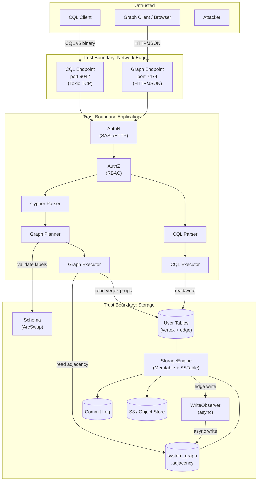

# Threat Model — ferrosa-graph Extensions

> **Date:** 2026-03-12
> **Scope:** New attack surface introduced by the graph query endpoint (ferrosa-graph)
> **Methodology:** STRIDE per element
> **Design Spec:** `docs/superpowers/specs/2026-03-12-ferrosa-graph-design.md`

## System Overview

ferrosa-graph adds a Cypher/GQL query endpoint alongside CQL. Key new components:

- **HTTP/JSON endpoint** (port 7474) — new network-facing service
- **Cypher parser** — new input parsing surface accepting arbitrary user text
- **Adjacency index** — system-managed table with async write consistency
- **WriteObserver** — hook in the storage write path generating derived mutations
- **Table extensions** — metadata annotations controlling graph behavior
- **Dual-access model** — same data accessible via CQL (port 9042) and Cypher (port 7474)

## Data Flow Diagram

## Assets

| Asset | Type | Impact if Compromised |
|-------|------|----------------------|
| Graph data (vertices, edges, properties) | Confidentiality, Integrity | Data breach, incorrect query results |
| Adjacency index | Integrity, Availability | Incorrect traversals, missing edges, graph corruption |
| Table extensions metadata | Integrity | Attacker controls which tables are treated as graph edges |
| Authentication credentials | Confidentiality | Full system access via either CQL or graph endpoint |
| Audit trail | Integrity | Actions via graph endpoint untracked |
| System availability | Availability | Graph queries or observer overload degrades CQL |
| S3-stored SSTables | Confidentiality, Integrity | Long-term data exposure if adjacency index leaks |

## Threat Inventory

### T1: Cypher Injection / Parser Exploitation

| Field | Value |
|-------|-------|
| **STRIDE** | Tampering, Elevation of Privilege |
| **Component** | Cypher parser (parser.rs) |
| **Threat** | Malformed Cypher input causes parser panic, stack overflow (deeply nested expressions), or unexpected AST that bypasses planner validation |
| **Likelihood** | 2 — Parser accepts arbitrary user text; hand-rolled parsers are error-prone |
| **Impact** | 2 — Panic crashes the connection task; crafted AST could bypass authorization |
| **Risk** | **4 (High)** |
| **Mitigation** | (1) Proptest fuzz testing on all parser entry points (already in plan). (2) Limit expression nesting depth (max 64 levels) to prevent stack overflow. (3) Catch panics at the HTTP handler boundary (tokio task). (4) Parser produces AST only — planner validates against schema before execution. |
| **Status** | **Mitigated.** Proptests implemented, expression depth capped at 64 (returns ParseError). Remaining: catch panics at HTTP handler boundary (Phase 1). |

### T2: Unauthenticated Graph Endpoint Access

| Field | Value |
|-------|-------|
| **STRIDE** | Spoofing |
| **Component** | HTTP endpoint (http.rs) |
| **Threat** | Graph HTTP endpoint lacks authentication, allowing unauthenticated queries. CQL uses SASL handshake; HTTP has no equivalent unless explicitly implemented. |
| **Likelihood** | 3 — If auth is not implemented on the HTTP endpoint, it's trivially exploitable |
| **Impact** | 3 — Full read/write access to all graph data |
| **Risk** | **9 (Critical)** |
| **Mitigation** | (1) HTTP endpoint MUST authenticate before processing queries. Use HTTP Basic Auth or Bearer token mapped to the same RBAC system (ferrosa-schema AuthContext). (2) Reuse the same `Schema::authenticate()` with rate limiting. (3) Never ship an unauthenticated endpoint, even in dev mode — use a dev token. |
| **Status** | **Not yet designed.** Design spec mentions reusing AuthContext but HTTP auth mechanism is unspecified. Must be addressed before Phase 1 implementation. |

### T3: Authorization Bypass via Graph Endpoint

| Field | Value |
|-------|-------|
| **STRIDE** | Elevation of Privilege |
| **Component** | Graph executor, planner |
| **Threat** | A user with CQL SELECT on `graph.person` but NOT on `graph.company` uses a Cypher traversal `MATCH (a:Person)-[:WORKS_AT]->(c:Company) RETURN c.name` to read Company data they shouldn't access. The graph executor must enforce per-table permissions at each hop. |
| **Likelihood** | 2 — If per-hop auth checking is missed, traversals leak data across permission boundaries |
| **Impact** | 3 — Unauthorized data access across tables |
| **Risk** | **6 (High)** |
| **Mitigation** | (1) Executor MUST check `Permission::Select` on each vertex/edge table accessed during traversal — not just the anchor table. (2) Planner should pre-check all tables in the pattern at plan time and fail fast. (3) Adjacency index reads should also check permission on the referenced `edge_table`. |
| **Status** | Not yet designed. Design spec mentions reusing AuthContext but per-hop enforcement is unspecified. |

### T4: Denial of Service via Expensive Graph Queries

| Field | Value |
|-------|-------|
| **STRIDE** | Denial of Service |
| **Component** | Graph executor (expand.rs) |
| **Threat** | Unbounded graph traversals exhaust memory or CPU. Examples: (a) `MATCH (a)-[:FOLLOWS]->() RETURN a` on a social graph with a supernode (millions of edges). (b) Multi-hop expansion without LIMIT produces cartesian blowup. (c) No query timeout — long-running traversals block executor threads. |
| **Likelihood** | 3 — Trivial to craft; even well-meaning queries can be expensive |
| **Impact** | 2 — Degrades both graph AND CQL performance (shared StorageEngine) |
| **Risk** | **6 (High)** |
| **Mitigation** | (1) Default query timeout (e.g., 30 seconds). (2) Max result set size (e.g., 10,000 rows default). (3) Max expansion fan-out per hop (configurable). (4) Query memory budget tracking. (5) Separate thread pool or Tokio task budget for graph queries so CQL is not starved. |
| **Status** | Not yet designed. Design spec has no timeout or resource limits. |

### T5: Adjacency Index Inconsistency (Eventual Consistency Window)

| Field | Value |
|-------|-------|
| **STRIDE** | Tampering, Information Disclosure |
| **Component** | AdjacencyIndexObserver (observer.rs) |
| **Threat** | The async WriteObserver creates a consistency window where edge data exists in the edge table but not yet in the adjacency index. During this window: (a) Cypher queries miss recently written edges. (b) DELETE via CQL removes the edge but adjacency index still has the entry — phantom edges. (c) Observer crash/restart could leave permanent inconsistency. |
| **Likelihood** | 2 — Async by design; crash scenarios are realistic |
| **Impact** | 2 — Incorrect query results; phantom edges could leak data that was "deleted" |
| **Risk** | **4 (High)** |
| **Mitigation** | (1) Observer mutations go through the commit log for crash recovery. (2) Periodic background reconciliation job compares edge tables against adjacency index. (3) `DELETE` tombstones in the adjacency index must have timestamps ≥ the edge deletion. (4) Document the consistency model clearly for users. (5) Consider a "consistency check" graph query (`EXPLAIN CONSISTENCY`). |
| **Status** | Partially designed. Commit log recovery is implicit (observer writes go through StorageEngine), but reconciliation and tombstone ordering are unspecified. |

### T6: Table Extension Metadata Poisoning

| Field | Value |
|-------|-------|
| **STRIDE** | Tampering, Elevation of Privilege |
| **Component** | ferrosa-schema (table extensions) |
| **Threat** | A user with ALTER TABLE permission sets `graph.type = 'edge'` and `graph.source = 'src_id'` on a table they control, causing the WriteObserver to generate adjacency index entries for their table. This could: (a) Pollute the adjacency index with attacker-controlled edges. (b) Create edges that point to vertices in tables the attacker can't normally read. |
| **Likelihood** | 2 — Requires ALTER TABLE permission, but that's a common grant |
| **Impact** | 2 — Adjacency index pollution, possible data leakage via graph traversals |
| **Risk** | **4 (High)** |
| **Mitigation** | (1) Setting `graph.*` extensions requires a new `Permission::GraphAdmin` or at minimum `Permission::Create` on the keyspace (not just ALTER on the table). (2) Validate that `graph.source_label` and `graph.target_label` reference existing vertex tables in the same keyspace. (3) Audit `graph.*` extension changes as a distinct event type. |
| **Status** | Not yet designed. Extensions are currently opaque key-value pairs with no validation. |

### T7: Cross-Protocol Data Leakage

| Field | Value |
|-------|-------|
| **STRIDE** | Information Disclosure |
| **Component** | Dual-access model |
| **Threat** | The adjacency index (`system_graph.adjacency`) is a system table. If readable via CQL, any user with access to the `system_graph` keyspace can enumerate all edges in the graph, bypassing per-table permissions. The adjacency index stores `vertex_id`, `edge_label`, `neighbor_id` — enough to reconstruct the graph structure without accessing the actual edge/vertex tables. |
| **Likelihood** | 2 — System keyspaces are often granted broader access |
| **Impact** | 2 — Graph structure leak even for users without edge table access |
| **Risk** | **4 (High)** |
| **Mitigation** | (1) `system_graph.adjacency` must be protected: CQL SELECT on it requires the same permissions as on the underlying edge tables. (2) Or: make `system_graph` completely inaccessible via CQL (internal-only). (3) The adjacency index should not store edge properties — only vertex IDs and table references. |
| **Status** | Not yet designed. Design spec creates a system table but access control is unspecified. |

### T8: HTTP Response Information Disclosure

| Field | Value |
|-------|-------|
| **STRIDE** | Information Disclosure |
| **Component** | HTTP endpoint (http.rs) |
| **Threat** | Error responses from the graph endpoint leak internal details: stack traces, table names, file paths, schema structure, Rust panic messages. |
| **Likelihood** | 2 — Common in HTTP APIs without explicit error sanitization |
| **Impact** | 1 — Information aids further attacks but is not directly exploitable |
| **Risk** | **2 (Medium)** |
| **Mitigation** | (1) Return generic error messages to clients; log details server-side. (2) Never expose Rust panic backtraces in HTTP responses. (3) Parse errors should show the query position but not internal parser state. |
| **Status** | Not yet designed. |

### T9: WriteObserver Amplification Attack

| Field | Value |
|-------|-------|
| **STRIDE** | Denial of Service |
| **Component** | WriteObserver, StorageEngine |
| **Threat** | A user bulk-inserts into an edge table, triggering the async WriteObserver for every row. Each edge write generates 2 adjacency mutations (OUT + IN). A batch of 1M edge inserts generates 2M observer writes, potentially overwhelming the storage engine or commit log. The observer shares the same StorageEngine as CQL. |
| **Likelihood** | 2 — Bulk loads are normal operations |
| **Impact** | 2 — Observer backlog degrades all storage operations |
| **Risk** | **4 (High)** |
| **Mitigation** | (1) Observer write queue with bounded capacity and backpressure. (2) Rate-limit observer mutations (e.g., max 10K/sec per table). (3) Batch observer mutations (accumulate for 10ms, write as batch). (4) Monitor observer queue depth as a health metric. |
| **Status** | Not yet designed. Observer is fire-and-forget with no backpressure. |

### T10: Audit Gap on Graph Operations

| Field | Value |
|-------|-------|
| **STRIDE** | Repudiation |
| **Component** | GraphEngine, HTTP endpoint |
| **Threat** | Graph read queries (MATCH) and write operations (CREATE/SET/DELETE via Cypher) are not audited. An attacker performs actions via the graph endpoint that don't appear in the audit log. CQL has comprehensive audit events; graph operations should too. |
| **Likelihood** | 3 — If audit events are not implemented for the graph endpoint, there's a 100% gap |
| **Impact** | 2 — Compliance failure, inability to trace data access |
| **Risk** | **6 (High)** |
| **Mitigation** | (1) Graph DDL operations (creating vertex/edge tables with extensions) should emit existing `TableCreated`/`TableAltered` audit events (they go through Schema). (2) Add new audit event types: `GraphQueryExecuted { query, keyspace, actor }`, `GraphMutationExecuted { query, keyspace, actor, vertices_affected, edges_affected }`. (3) Log source IP from HTTP connection. |
| **Status** | Partially mitigated. Schema mutations already audit. Graph query/mutation auditing is unspecified. |

### T11: Unencrypted HTTP Transport

| Field | Value |
|-------|-------|
| **STRIDE** | Information Disclosure, Tampering |
| **Component** | HTTP endpoint |
| **Threat** | Graph endpoint serves plain HTTP. Credentials (if using HTTP Basic Auth) and query results travel in cleartext. Network observers can read graph data and steal credentials. |
| **Likelihood** | 2 — Depends on deployment; internal networks may be less exposed |
| **Impact** | 3 — Credential theft + data leakage |
| **Risk** | **6 (High)** |
| **Mitigation** | (1) Support TLS on the HTTP endpoint (shared TLS config with CQL). (2) Production mode (DeploymentMode::Production) should reject unencrypted HTTP. (3) Development mode can allow plaintext with a warning. |
| **Status** | Not yet designed. CQL spec has TLS planned; HTTP TLS is unmentioned. |

## Risk Summary

| ID | Threat | Risk | Priority |
|----|--------|------|----------|
| T2 | Unauthenticated graph endpoint | **9 Critical** | Must address before Phase 1 ships |
| T3 | Authorization bypass via traversal | **6 High** | Must address before Phase 1 ships |
| T4 | DoS via expensive graph queries | **6 High** | Must address before Phase 1 ships |
| T10 | Audit gap on graph operations | **6 High** | Must address before Phase 1 ships |
| T11 | Unencrypted HTTP transport | **6 High** | Must address before production use |
| T1 | Parser exploitation | **4 High** | **Mitigated** (proptests + depth limit); HTTP panic catch in Phase 1 |
| T5 | Adjacency index inconsistency | **4 High** | Design reconciliation before Phase 1 |
| T6 | Table extension poisoning | **4 High** | Add permission check for graph.* extensions |
| T7 | Cross-protocol data leakage | **4 High** | Restrict system_graph CQL access |
| T9 | Observer amplification | **4 High** | Add backpressure before production use |
| T8 | HTTP error info disclosure | **2 Medium** | Sanitize error responses |

## Recommended Design Changes

### Before Phase 1 Ships (Critical/High)

1. **HTTP authentication** — Add HTTP Basic Auth or Bearer token. Map to `Schema::authenticate()`. Reuse rate limiting. Add to design spec.

2. **Per-hop authorization** — Executor checks `Permission::Select` on every table accessed during traversal. Planner pre-validates all pattern tables at plan time.

3. **Query resource limits** — Default timeout (30s), max result rows (10K), max fan-out per hop. Configurable via GraphEngine config.

4. **Graph audit events** — Add `GraphQueryExecuted` and `GraphMutationExecuted` to `AuditEventKind`. Emit from GraphEngine.

5. **TLS on HTTP** — Reuse CQL TLS configuration. Reject plaintext in production mode.

### Before Production Use (High)

1. **Parser depth limit** — Cap expression nesting at 64 levels. Return `ParseError`, don't stack overflow.

2. **Observer backpressure** — Bounded queue, batch mutations, rate limit per table.

3. **Extension permission guard** — Setting `graph.*` extensions requires `Permission::Create` on the keyspace. Validate label references.

4. **system_graph CQL access** — Either make `system_graph` inaccessible via CQL, or check underlying edge table permissions on every read.

5. **Adjacency reconciliation** — Background job to detect and repair index/edge table divergence after crashes.

## Assumptions

- ferrosa is deployed in a VPC with network-level controls (not directly internet-facing)
- TLS termination may happen at a load balancer, but internal traffic should also be encrypted
- Users have distinct RBAC roles (not everyone is superuser)
- The async observer will eventually catch up under normal load
- S3 bucket policies provide an additional access control layer for data at rest

## Open Questions

1. **Should the graph endpoint share the CQL TCP port?** A single port with protocol detection would simplify TLS configuration but add complexity.
2. **Should graph RBAC use existing CQL permissions or add graph-specific ones?** E.g., `Permission::Traverse` as distinct from `Permission::Select`.
3. **How does Bolt protocol authentication work?** When Bolt is added in a later phase, it has its own auth handshake. Plan for this now?
4. **Should the adjacency index be per-keyspace or global?** Per-keyspace isolates tenants; global enables cross-keyspace traversals.
5. **Is there a need for query audit sampling?** High-traffic graph endpoints may generate too many audit events. Configurable sampling rate?
