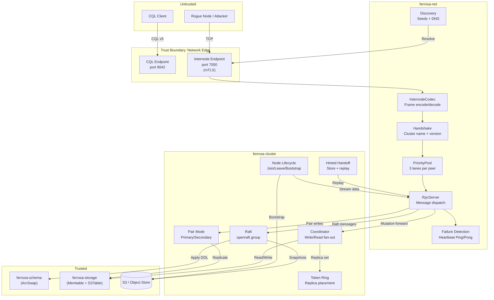

# Threat Model — ferrosa-net and ferrosa-cluster

> **Date:** 2026-03-13
> **Scope:** New attack surface introduced by distributed operation (ferrosa-net + ferrosa-cluster)
> **Methodology:** STRIDE per element
> **Design Spec:** `docs/superpowers/specs/2026-03-13-ferrosa-net-cluster-design.md`

## System Overview

ferrosa-net and ferrosa-cluster add distributed operation to Ferrosa. Key new components:

- **Internode protocol** (port 7000) — new network-facing service, binary wire format
- **mTLS handshake** — cluster name validation, protocol version negotiation
- **Priority-lane connection pool** — 3 TCP connections per peer (raft, data, bulk)
- **Failure detection** — heartbeat-based peer liveness
- **Raft consensus** (openraft) — single group managing schema, topology, tokens, config
- **Pair mode** — 2-node synchronous replication, write forwarding, manual failover
- **Token ring** — Murmur3 token space, replica placement, virtual nodes
- **Coordinator pattern** — CL-enforced write/read fan-out to replicas
- **Hinted handoff** — store-and-forward for unavailable replicas

## Data Flow Diagram



## Assets

| # | Asset | Type | Impact if Compromised |
|---|-------|------|----------------------|
| A1 | Raft log and state machine | Integrity | Schema divergence, topology corruption, split brain |
| A2 | Internode traffic | Confidentiality | Eavesdrop on mutations, schema changes, Raft votes |
| A3 | Cluster membership | Integrity | Rogue node joins, participates in Raft, receives data |
| A4 | Token ring | Integrity | Attacker controls which data routes to which node |
| A5 | Hinted handoff storage | Confidentiality, Integrity | Read queued mutations, replay manipulated data |
| A6 | Pair mode roles | Integrity | Unauthorized promotion, split brain, data loss |
| A7 | Raft snapshots in S3 | Confidentiality, Integrity | Full schema + topology leak, tampered snapshots |
| A8 | Commit log positions (catch-up) | Integrity | Replay attacks, data duplication, skipped mutations |
| A9 | Consistency level enforcement | Integrity | Client believes QUORUM but only ONE replica confirmed |
| A10 | Peer identity (host_id) | Integrity | Node impersonation, vote manipulation |

## Trust Boundaries

| # | Boundary | From | To |
|---|----------|------|----|
| TB1 | Peer → Internode port | VPC / untrusted peer | ferrosa-net codec |
| TB2 | ferrosa-net → ferrosa-cluster | Transport layer | Consensus + coordination |
| TB3 | Raft → Schema | Committed Raft command | Schema registry apply |
| TB4 | Coordinator → Storage | CL-validated request | Local storage engine |
| TB5 | Node → S3 | Raft snapshot upload | S3 bucket (shared) |
| TB6 | DNS → Discovery | External DNS resolver | Seed resolution |

---

## Threat Inventory

### TB1: Peer → Internode Protocol (Port 7000)

### T1: Rogue Node Joins Cluster

| Field | Value |
|-------|-------|
| **STRIDE** | Spoofing |
| **Component** | `handshake.rs`, `tls.rs` |
| **Threat** | Attacker within VPC (or after lateral movement) connects to internode port, completes handshake with correct cluster name, and joins the Raft group. Receives replicated data, participates in elections, can propose malicious Raft commands. |
| **Likelihood** | 2 — Requires VPC access; cluster name is not a strong secret |
| **Impact** | 3 — Full data access, schema manipulation, consensus disruption |
| **Risk** | **6 (High)** |
| **Mitigation** | (1) mTLS required in production mode (ADR-010) — peer must present a certificate signed by the cluster CA. (2) Handshake validates `cluster_name` match. (3) Raft `JoinNode` command requires leader approval — unknown `host_id` cannot self-add. (4) Certificate pinning or shared CA prevents self-signed cert spoofing. |
| **Status** | Planned — mTLS implementation in ferrosa-net Phase 2 |

### T2: Internode Traffic Eavesdropping

| Field | Value |
|-------|-------|
| **STRIDE** | Information Disclosure |
| **Component** | `codec.rs`, `tls.rs` |
| **Threat** | Without TLS, internode traffic (mutations, Raft proposals, schema DDL, heartbeats) is plaintext within VPC. Attacker with network access reads all replicated data. |
| **Likelihood** | 2 — Requires VPC network access (lateral movement, compromised node, packet capture) |
| **Impact** | 3 — Complete data exposure including credentials in Raft state (roles, hashed passwords) |
| **Risk** | **6 (High)** |
| **Mitigation** | (1) TLS on all internode connections (rustls). (2) Production mode rejects unencrypted internode (fail-closed). (3) Development mode logs a warning. |
| **Status** | Planned — TLS in Phase 2; production mode enforcement via ADR-010 |

### T3: Internode Protocol Exploitation

| Field | Value |
|-------|-------|
| **STRIDE** | Denial of Service, Tampering |
| **Component** | `codec.rs`, `message.rs` |
| **Threat** | Malformed frames sent to the internode port: (a) Oversized `length` field (u32 max = 4 GiB) causes OOM allocation. (b) Invalid `msg_type` or corrupt body causes panics during deserialization. (c) Wrong `lane` value causes messages to be processed on wrong priority. (d) Stream ID reuse confuses request-response correlation. |
| **Likelihood** | 2 — Requires network access to port 7000 |
| **Impact** | 2 — OOM crash, connection drops, degraded performance |
| **Risk** | **4 (High)** |
| **Mitigation** | (1) Max frame body size (default 256 MiB, configurable). Reject frames exceeding limit before allocating. (2) Unknown `msg_type` → close connection with `ProtocolError`. (3) Lane validation (0-2 only). (4) Deserialization returns `Result`, never panics — proptest fuzz all message types. |
| **Status** | Must implement |

### T4: Handshake Cluster Name as Weak Authentication

| Field | Value |
|-------|-------|
| **STRIDE** | Spoofing |
| **Component** | `handshake.rs` |
| **Threat** | Cluster name (`FERROSA_CLUSTER_NAME`, default "ferrosa") is the only identity check before mTLS is implemented. It is not secret — it's in environment variables, docker-compose files, and operational documentation. Any node that knows the cluster name can connect. |
| **Likelihood** | 3 — Default cluster name is trivially guessable |
| **Impact** | 2 — Connection accepted, but without mTLS, attacker still needs Raft leader to approve `JoinNode` |
| **Risk** | **6 (High)** |
| **Mitigation** | (1) Cluster name is a sanity check, NOT authentication. Documentation must emphasize this. (2) mTLS is the real authentication — mandatory in production. (3) Handshake should reject connections before any data exchange if cluster name mismatches. (4) Consider adding a shared pre-authentication token (PSK) for Phase 1 before mTLS is implemented. |
| **Status** | Must implement (PSK for Phase 1, mTLS for Phase 2) |

### T5: Connection Flood on Internode Port

| Field | Value |
|-------|-------|
| **STRIDE** | Denial of Service |
| **Component** | `rpc/server.rs` |
| **Threat** | Attacker opens thousands of connections to port 7000, exhausting file descriptors and memory. Unlike CQL (which has `max_connections`), the internode port expects a small number of known peers but has no connection limit. |
| **Likelihood** | 2 — Requires network access to port 7000 |
| **Impact** | 2 — Node can't accept legitimate peer connections, consensus disrupted |
| **Risk** | **4 (High)** |
| **Mitigation** | (1) Max internode connections (e.g., `FERROSA_MAX_INTERNODE_CONNECTIONS`, default 100). Each peer only needs 3 connections. (2) Rate limit new connections per source IP. (3) Handshake timeout — close connections that don't complete handshake within 5 seconds. |
| **Status** | Must implement |

### T6: Failure Detection Manipulation

| Field | Value |
|-------|-------|
| **STRIDE** | Tampering, Denial of Service |
| **Component** | `peer.rs` (failure detection loop) |
| **Threat** | (a) Attacker sends spoofed `Pong` responses on behalf of a dead node, keeping it "alive" in the cluster — prevents hinted handoff, stale reads continue. (b) Attacker blocks/delays `Ping` packets to trigger false suspected-dead events, causing unnecessary failover churn or hint accumulation. |
| **Likelihood** | 1 — Requires MITM or mTLS bypass |
| **Impact** | 2 — Incorrect cluster topology view, degraded availability |
| **Risk** | **2 (Medium)** |
| **Mitigation** | (1) Heartbeat messages authenticated via TLS (mTLS connection identity). (2) `Pong` must be correlated to a specific `Ping` via stream_id — unsolicited `Pong` rejected. (3) Failure detection uses a sliding window, not single-miss. |
| **Status** | Mitigated by mTLS + stream_id correlation |

---

### TB2: ferrosa-net → ferrosa-cluster (RPC Dispatch)

### T7: Malicious Raft Proposal via Internode RPC

| Field | Value |
|-------|-------|
| **STRIDE** | Tampering, Elevation of Privilege |
| **Component** | `raft/state_machine.rs`, `rpc/handler.rs` |
| **Threat** | A compromised peer proposes malicious Raft commands: (a) `CreateRole { name: "admin", superuser: true }` — creates a backdoor superuser. (b) `DropKeyspace { name: "production_data" }` — destructive DDL. (c) `JoinNode` for attacker-controlled host — expands attacker's access. |
| **Likelihood** | 1 — Requires compromised peer (mTLS bypass + cluster membership) |
| **Impact** | 3 — Full schema/topology control, data loss |
| **Risk** | **3 (Medium)** |
| **Mitigation** | (1) Raft proposals originate from the CQL/admin layer which enforces auth + RBAC. ferrosa-cluster does not accept raw proposals from the wire — only from local auth-gated codepaths. (2) `RaftAppendEntries` replicates committed entries from the leader, not arbitrary proposals. Only the leader proposes. (3) If a peer becomes leader via election, it can only propose entries through the auth-gated API. |
| **Status** | Mitigated by architecture — proposals are auth-gated at origin |

### T8: Write Forwarding Without Re-Authentication

| Field | Value |
|-------|-------|
| **STRIDE** | Elevation of Privilege |
| **Component** | `coordinator/write.rs` |
| **Threat** | Coordinator receives an authenticated CQL write, forwards the mutation to replicas via `MutationForward`. The receiving replica stores the mutation without re-checking auth (it trusts the coordinator's auth decision). If the coordinator is compromised, it can forward arbitrary unauthorized writes. |
| **Likelihood** | 1 — Requires compromised coordinator node |
| **Impact** | 3 — Unauthorized writes to any table |
| **Risk** | **3 (Medium)** |
| **Mitigation** | (1) mTLS ensures only legitimate cluster members can send `MutationForward`. (2) This is the Cassandra model — replicas trust coordinators. Re-authenticating would add unacceptable latency. (3) Audit logging on the coordinator captures the original authenticated context. (4) Accept this risk (same as Cassandra, ScyllaDB, CockroachDB). |
| **Status** | Accepted — standard distributed database trust model |

---

### TB3: Raft → Schema (State Machine Application)

### T9: Raft State Machine Divergence

| Field | Value |
|-------|-------|
| **STRIDE** | Tampering |
| **Component** | `raft/state_machine.rs`, `schema.rs` |
| **Threat** | If `apply()` is not deterministic across all nodes, the same Raft log entry produces different schema states on different nodes. This causes silent divergence: queries return different results depending on which node coordinates. |
| **Likelihood** | 2 — Subtle bugs (HashMap iteration order, floating point, time-dependent logic) can cause non-determinism |
| **Impact** | 3 — Silent data corruption, schema divergence |
| **Risk** | **6 (High)** |
| **Mitigation** | (1) `apply()` must be purely deterministic — no timestamps, no random values, no HashMap iteration in output. Use `BTreeMap` for deterministic ordering. (2) Every Raft command must include all values explicitly (no "fill in defaults" at apply time). (3) State machine checksum after each apply — compare checksums across nodes periodically to detect divergence. (4) Integration test: apply log on 3 nodes, verify identical state. |
| **Status** | Must implement |

### T10: Raft Snapshot Tampering in S3

| Field | Value |
|-------|-------|
| **STRIDE** | Tampering, Integrity |
| **Component** | `raft/snapshot.rs` |
| **Threat** | Raft snapshots stored in S3 contain full schema, topology, and token ring state. An attacker with S3 write access replaces the snapshot with a tampered version: (a) Adds a backdoor superuser role. (b) Changes token assignments to route data to attacker-controlled node. (c) A new node bootstraps from the tampered snapshot. |
| **Likelihood** | 1 — Requires S3 write access (IAM compromise) |
| **Impact** | 3 — Full cluster state compromise on new node bootstrap |
| **Risk** | **3 (Medium)** |
| **Mitigation** | (1) Sign snapshots with a cluster-internal key. Verify signature before restoring. (2) SHA-256 checksum stored separately (in Raft log or second S3 object). (3) After bootstrap from snapshot, new node compares state checksum with leader — reject if mismatch. (4) S3 bucket policy: write access only for Ferrosa IAM role, versioning enabled. |
| **Status** | Must implement (signature + checksum verification) |

---

### TB4: Pair Mode

### T11: Split Brain in Pair Mode

| Field | Value |
|-------|-------|
| **STRIDE** | Integrity |
| **Component** | `pair/primary.rs`, `pair/secondary.rs` |
| **Threat** | Network partition between the two nodes. Both nodes believe the other is dead. If auto-promotion were allowed, both would promote to primary and accept conflicting writes. Even with manual promotion, an operator unaware of the partition could promote the secondary while the primary is still running. |
| **Likelihood** | 2 — Network partitions are common in production |
| **Impact** | 3 — Conflicting writes, data divergence, no automatic resolution |
| **Risk** | **6 (High)** |
| **Mitigation** | (1) No auto-promotion — operator must explicitly promote via ferrosa-ctl (design decision). (2) ferrosa-ctl `promote` command should warn: "Cannot confirm primary is down. Risk of split brain. Proceed? (y/N)". (3) When partition heals and both claim primary, the node with the higher `last_ack_seq` wins — the other must re-sync. (4) Metrics: `replication_lag` virtual table shows partition state. |
| **Status** | Mitigated by design — manual promotion only |

### T12: Pair Mode Catch-Up Data Injection

| Field | Value |
|-------|-------|
| **STRIDE** | Tampering |
| **Component** | `pair/catchup.rs` |
| **Threat** | After reconnection, secondary sends `PairCatchUp { last_segment_id, last_offset }` to primary. A compromised secondary sends an artificially old position (segment 0, offset 0), forcing primary to replay the entire commit log — DoS via I/O. Or it sends a future position, skipping mutations — data loss. |
| **Likelihood** | 1 — Requires compromised node |
| **Impact** | 2 — DoS (full replay) or data loss (skipped mutations) |
| **Risk** | **2 (Medium)** |
| **Mitigation** | (1) Primary validates the requested position exists in its commit log. If the segment is recycled, respond `FullBootstrapRequired` (not replay from zero). (2) If requested position is ahead of primary's current position, reject with error. (3) Rate-limit catch-up replay to prevent I/O saturation. |
| **Status** | Mitigated by validation + rate limiting |

### T13: Unauthorized Role Swap

| Field | Value |
|-------|-------|
| **STRIDE** | Elevation of Privilege |
| **Component** | `pair/switchover.rs` |
| **Threat** | Attacker sends a `RoleSwap` message to the primary via internode protocol, causing it to demote to secondary. Combined with promoting a compromised node, attacker takes control of all writes. |
| **Likelihood** | 1 — Requires mTLS bypass + peer identity spoofing |
| **Impact** | 3 — Full write control, data manipulation |
| **Risk** | **3 (Medium)** |
| **Mitigation** | (1) `RoleSwap` only accepted from the current secondary's authenticated `host_id` (via mTLS). (2) `RoleSwap` only processed if primary initiated the switchover sequence (drain → confirm caught-up → swap). Unsolicited `RoleSwap` rejected. (3) Switchover requires operator initiation via ferrosa-ctl — never triggered by peer messages alone. |
| **Status** | Mitigated by design — operator-initiated, authenticated |

---

### TB5: Coordinator and Consistency Levels

### T14: Consistency Level Downgrade Attack

| Field | Value |
|-------|-------|
| **STRIDE** | Tampering |
| **Component** | `coordinator/write.rs`, `coordinator/read.rs` |
| **Threat** | Coordinator receives a QUORUM write but only waits for ONE replica ACK before responding success to client. Client believes data is at QUORUM durability when it's only at ONE. Could happen due to a bug in `blockFor()` or timeout handling. |
| **Likelihood** | 1 — Would be a bug, not an external attack |
| **Impact** | 3 — Silent durability violation, data loss on node failure |
| **Risk** | **3 (Medium)** |
| **Mitigation** | (1) `blockFor()` has exhaustive unit tests for all CL × RF combinations. (2) Coordinator logs CL, required ACKs, and received ACKs — auditable. (3) Property test: `blockFor(CL, RF)` always satisfies the CL invariant. (4) Timeout returns `WriteTimeout` error to client (not silent success). |
| **Status** | Must implement (property tests + logging) |

### T15: Coordinator Starvation via Large Fan-Out

| Field | Value |
|-------|-------|
| **STRIDE** | Denial of Service |
| **Component** | `coordinator/write.rs`, `coordinator/read.rs` |
| **Threat** | High RF (e.g., RF=5) with ALL consistency means every write/read fans out to 5 replicas. Under load, coordinator exhausts connection pool capacity or overwhelms data lane. |
| **Likelihood** | 2 — Normal operations at high RF + high throughput |
| **Impact** | 2 — Coordinator becomes bottleneck, latency spikes, timeouts |
| **Risk** | **4 (High)** |
| **Mitigation** | (1) Connection pool capacity per peer (configurable, default 128 concurrent streams per lane). (2) Coordinator request queuing with bounded backpressure. (3) Client receives `Overloaded` error when coordinator is saturated (fail-fast). (4) Metrics: coordinator queue depth, in-flight requests per peer. |
| **Status** | Must implement |

---

### TB6: Hinted Handoff

### T16: Hinted Handoff Disk Exhaustion

| Field | Value |
|-------|-------|
| **STRIDE** | Denial of Service |
| **Component** | `repair/hinted_handoff.rs` |
| **Threat** | A replica is down for an extended period. Coordinator accumulates hints for that peer. If hints are unbounded, they fill the local disk, causing the coordinator to fail. |
| **Likelihood** | 2 — Long outages are realistic |
| **Impact** | 2 — Coordinator disk full, affecting all operations |
| **Risk** | **4 (High)** |
| **Mitigation** | (1) `FERROSA_HINTED_HANDOFF_MAX_MB` caps hint storage per peer (default 1 GB). (2) When cap reached, oldest hints are dropped and the peer is flagged for full repair on reconnection. (3) Metrics: hint storage per peer, hints dropped count. |
| **Status** | Designed — must implement cap enforcement |

### T17: Hint Replay Ordering Violation

| Field | Value |
|-------|-------|
| **STRIDE** | Tampering |
| **Component** | `repair/hinted_handoff.rs` |
| **Threat** | Hints replayed out of order cause timestamp-dependent operations (TTL, tombstones, LWT) to produce incorrect results. A tombstone replayed before the insert it covers causes the insert to "resurrect" data. |
| **Likelihood** | 2 — Ordering bugs are common in store-and-forward systems |
| **Impact** | 2 — Data inconsistency, zombie data |
| **Risk** | **4 (High)** |
| **Mitigation** | (1) Hints stored and replayed in write-order (FIFO per peer). (2) Each hint includes the original mutation timestamp. (3) Replay uses the original timestamp, not replay time. (4) Integration test: INSERT + DELETE + hint replay = data stays deleted. |
| **Status** | Must implement |

---

### TB7: Node Lifecycle and Bootstrap

### T18: Unauthorized Node Join

| Field | Value |
|-------|-------|
| **STRIDE** | Spoofing, Elevation of Privilege |
| **Component** | `lifecycle/join.rs`, `raft/state_machine.rs` |
| **Threat** | An attacker connects to a seed node and requests to join the cluster. Without proper authorization, the Raft leader assigns tokens to the rogue node, which then receives replicated data during bootstrap. |
| **Likelihood** | 2 — Requires network access + cluster name (T4 applies) |
| **Impact** | 3 — Full data access, consensus participation |
| **Risk** | **6 (High)** |
| **Mitigation** | (1) mTLS — joining node must present a valid cluster CA-signed certificate. (2) Raft leader should require operator approval for new nodes (configurable: auto-approve in dev, require approval in production). (3) `FERROSA_AUTO_JOIN=false` (production default) requires admin to run `ferrosa-ctl add-node <host_id>` before the node can join. |
| **Status** | Must implement |

### T19: Bootstrap Data Theft via S3

| Field | Value |
|-------|-------|
| **STRIDE** | Information Disclosure |
| **Component** | `lifecycle/bootstrap.rs` |
| **Threat** | Fast bootstrap reads SSTables from S3. An attacker who obtains S3 read credentials (IAM role, leaked keys) can bootstrap a rogue Ferrosa instance and access all data without ever connecting to the cluster. |
| **Likelihood** | 1 — Requires S3 credential compromise |
| **Impact** | 3 — Complete data exfiltration |
| **Risk** | **3 (Medium)** |
| **Mitigation** | (1) S3 bucket policy: restrict access to specific IAM roles/VPC endpoints. (2) S3 SSE-KMS: data encrypted at rest with a key only Ferrosa IAM roles can use. (3) Application-level encryption (envelope encryption) for sensitive keyspaces — deferred to hardening phase. (4) Same threat as existing T19 in the full system threat model. |
| **Status** | Existing mitigation (S3 IAM + SSE-KMS) — application encryption deferred |

---

### DNS and Discovery

### T20: DNS Poisoning for Peer Discovery

| Field | Value |
|-------|-------|
| **STRIDE** | Spoofing |
| **Component** | `discovery/dns.rs` |
| **Threat** | If `FERROSA_DNS_DISCOVERY` is used, an attacker who can poison DNS responses directs the node to connect to a malicious peer. This is the initial contact — before mTLS can verify identity. |
| **Likelihood** | 1 — Requires DNS infrastructure compromise or DNS hijacking |
| **Impact** | 2 — Connection to rogue peer, but mTLS handshake would fail if cluster CA doesn't match |
| **Risk** | **2 (Medium)** |
| **Mitigation** | (1) DNS discovery is optional — static seeds are the primary mechanism. (2) mTLS handshake rejects peers without valid cluster CA certificate. DNS provides addresses, not trust. (3) Document: use private DNS zones (Route53 private hosted zone, Kubernetes CoreDNS) rather than public DNS. |
| **Status** | Mitigated by mTLS — DNS provides addresses only |

---

## Risk Summary

### Critical (Risk 7-9) — Must mitigate before production

No threats at critical risk level. The highest-risk threats (T1, T2, T4, T9, T11, T18) are all at Risk 6 (High), reflecting the design's emphasis on mTLS and manual operator controls.

### High (Risk 4-6) — Mitigate in implementation

| ID | Threat | Risk | Mitigation |
|----|--------|------|------------|
| T1 | Rogue node joins cluster | 6 | mTLS (Phase 2), PSK (Phase 1), JoinNode requires leader approval |
| T2 | Internode eavesdropping | 6 | TLS on all internode connections, production mode enforcement |
| T4 | Cluster name as weak auth | 6 | PSK for Phase 1, mTLS for Phase 2, documentation |
| T9 | Raft state machine divergence | 6 | Deterministic apply, BTreeMap, checksums, property tests |
| T11 | Split brain in pair mode | 6 | Manual promotion only, conflict resolution on heal |
| T18 | Unauthorized node join | 6 | mTLS + operator approval + `FERROSA_AUTO_JOIN=false` |
| T3 | Internode protocol exploitation | 4 | Frame size limit, unknown type rejection, proptest fuzz |
| T5 | Connection flood on internode | 4 | Max connections, handshake timeout, rate limiting |
| T14 | CL downgrade (bug risk) | 4* | Property tests for blockFor(), timeout returns error not success |
| T15 | Coordinator starvation | 4 | Bounded stream capacity, backpressure, Overloaded error |
| T16 | Hint disk exhaustion | 4 | Per-peer cap (1 GB), oldest-first drop, repair flag |
| T17 | Hint replay ordering | 4 | FIFO replay, original timestamps, integration tests |

*T14 is an internal bug risk, not an external attack.

### Medium (Risk 2-3) — Accept or plan

| ID | Threat | Risk | Status |
|----|--------|------|--------|
| T6 | Failure detection manipulation | 2 | Mitigated by mTLS + stream_id |
| T7 | Malicious Raft proposal | 3 | Mitigated by auth-gated proposal API |
| T8 | Write forwarding trust model | 3 | Accepted (standard distributed DB pattern) |
| T10 | Raft snapshot tampering | 3 | Planned — signature + checksum verification |
| T12 | Catch-up data injection | 2 | Mitigated by position validation |
| T13 | Unauthorized role swap | 3 | Mitigated by operator-initiated design |
| T19 | Bootstrap data theft via S3 | 3 | Existing S3 IAM/KMS controls |
| T20 | DNS poisoning | 2 | Mitigated by mTLS (DNS provides addresses only) |

---

## Mitigations by Implementation Phase

### Phase 1: ferrosa-net core + Pair mode

| Mitigation | Threats | Effort |
|-----------|---------|--------|
| Max frame body size (256 MiB default) | T3 | Small |
| Unknown msg_type → close connection | T3 | Small |
| Max internode connections + handshake timeout | T5 | Small |
| Pre-shared key (PSK) for Phase 1 auth | T1, T4 | Medium |
| Proptest fuzz all message encode/decode | T3 | Medium |
| Deterministic Raft apply (BTreeMap, no timestamps) | T9 | Medium |
| Manual-only pair promotion | T11 | Small (design decision) |
| Catch-up position validation | T12 | Small |
| Switchover requires operator initiation | T13 | Small |

### Phase 2: TLS + Cluster mode

| Mitigation | Threats | Effort |
|-----------|---------|--------|
| mTLS on all internode connections | T1, T2, T4, T6, T18 | Medium |
| Production mode rejects unencrypted internode | T2 | Small |
| `FERROSA_AUTO_JOIN=false` (operator approval) | T18 | Medium |
| Raft state machine checksum (cross-node comparison) | T9 | Medium |
| Property tests: `blockFor()` invariants | T14 | Small |
| Coordinator backpressure + Overloaded error | T15 | Medium |
| Hinted handoff per-peer cap enforcement | T16 | Small |
| FIFO hint replay with original timestamps | T17 | Medium |

### Phase 3: Hardening

| Mitigation | Threats | Effort |
|-----------|---------|--------|
| Raft snapshot signing + checksum verification | T10 | Medium |
| Split-brain resolution on partition heal | T11 | Medium |
| Hint replay integration tests (INSERT+DELETE round-trip) | T17 | Medium |
| Coordinator metrics (queue depth, in-flight) | T15 | Small |

---

## Mitigations to Bake Into Implementation

Concrete constants and checks that must be present:

```rust
// In ferrosa-net config.rs
pub const MAX_FRAME_BODY_SIZE: usize = 268_435_456; // 256 MiB
pub const MAX_INTERNODE_CONNECTIONS: usize = 100;
pub const HANDSHAKE_TIMEOUT_SECS: u64 = 5;
pub const MAX_STREAMS_PER_LANE: usize = 128;

// In ferrosa-cluster config.rs
pub const HINTED_HANDOFF_MAX_MB: u64 = 1024;      // 1 GB per peer
pub const AUTO_JOIN_DEFAULT: bool = false;          // Production: require approval

// Lane validation
fn validate_lane(lane: u8) -> Result<Lane> {
    match lane {
        0 => Ok(Lane::Raft),
        1 => Ok(Lane::Data),
        2 => Ok(Lane::Bulk),
        _ => Err(ProtocolError::InvalidLane(lane)),
    }
}

// Raft state machine: deterministic apply
// - Use BTreeMap (not HashMap) for all state machine fields
// - No wall-clock timestamps in apply() — use Raft log index
// - No random values — all state derived from command content
```

### Per-phase checklist

| Phase | Required Mitigations |
|-------|---------------------|
| Net Phase 1 | T3: frame size limit, unknown type rejection, proptest fuzz. T4: PSK auth. T5: max connections, handshake timeout. |
| Cluster Phase 1 (Pair) | T9: deterministic apply. T11: manual promotion only. T12: catch-up validation. T13: operator-initiated switchover. |
| Net Phase 2 | T1, T2, T4: mTLS. T5: per-IP rate limiting. |
| Cluster Phase 2 | T14: blockFor() property tests. T15: coordinator backpressure. T16: hint cap. T17: FIFO replay. T18: operator node approval. |
| Cluster Phase 3 | T10: snapshot signing. T11: partition heal resolution. |

## Assumptions

1. **Network**: Internode traffic is within a VPC; port 7000 is not exposed to the public internet
1. **mTLS**: Production clusters use a private CA for internode certificates; certificate distribution is an operator responsibility
1. **Operator competence**: Operators understand split-brain risks and will not blindly promote secondary during a partition
1. **S3 security**: S3 bucket policies, IAM roles, and SSE-KMS are correctly configured (outside Ferrosa's control)
1. **Rust safety**: No unsafe blocks in ferrosa-net or ferrosa-cluster; memory safety bugs are not modeled
1. **openraft correctness**: The openraft crate correctly implements Raft consensus; consensus protocol bugs are not modeled

## Open Questions

- [ ] Should ferrosa-net support certificate rotation without restart? (Hot reload via `arc-swap` for rustls config)
- [ ] Should Raft proposals carry the originating user's identity for audit purposes?
- [ ] Is there a need for internode traffic encryption in pair mode during Phase 1 (before mTLS)?
- [ ] Should hinted handoff hints be encrypted at rest? (They contain mutation data)
- [ ] How should the cluster handle a node that joins with an incompatible schema version?
